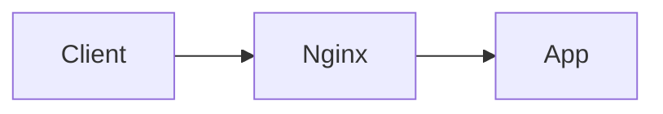
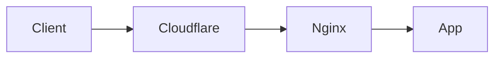
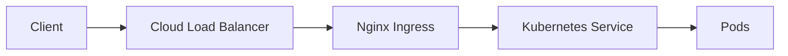
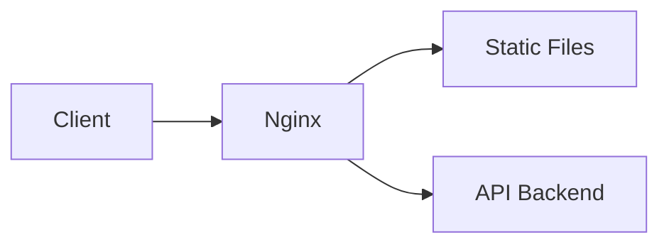

# Where Nginx Can Stand

`nginx` не имеет одного фиксированного места в архитектуре. Он может стоять в разных точках в зависимости от задачи.

## Содержание

- [1. Nginx как внешний reverse proxy](#1-nginx-как-внешний-reverse-proxy)
- [2. Nginx за Cloudflare или другим edge](#2-nginx-за-cloudflare-или-другим-edge)
- [3. Nginx как ingress в Kubernetes](#3-nginx-как-ingress-в-kubernetes)
- [4. Nginx как static file server и API proxy](#4-nginx-как-static-file-server-и-api-proxy)
- [Чего не стоит делать](#чего-не-стоит-делать)
- [Practical rule](#practical-rule)

## 1. Nginx как внешний reverse proxy

Что делает:
- принимает внешний HTTP и HTTPS;
- завершает TLS;
- отдает статику;
- проксирует в backend.

Когда уместно:
- простой single-region deployment;
- небольшой проект;
- self-hosted инфраструктура без отдельного cloud edge.

## 2. Nginx за Cloudflare или другим edge

Что делает:
- Cloudflare = внешний edge, WAF, CDN;
- Nginx = origin-side reverse proxy.

Когда уместно:
- нужен global edge снаружи;
- но на origin хочется свой proxy, routing и buffering.

## 3. Nginx как ingress в Kubernetes

Что делает:
- принимает traffic внутри k8s cluster entrypoint;
- маршрутизирует по host и path;
- передает запрос в service.

Когда уместно:
- Kubernetes cluster;
- нужен стандартный ingress path.

## 4. Nginx как static file server и API proxy

Что делает:
- статику отдает сам;
- API проксирует дальше.

Когда уместно:
- SSR or SPA deployment;
- один edge node для фронта и API.

## Чего не стоит делать

- считать, что `nginx` автоматически равен `edge provider`;
- рисовать `nginx` как отдельную "магическую коробку" без роли;
- забывать, кто именно терминирует TLS и кто добавляет proxy headers.

## Practical rule

Когда рисуешь `nginx` на схеме, сразу подписывай его роль:
- `Nginx reverse proxy`
- `Nginx ingress`
- `Nginx static + API proxy`

Иначе схема быстро становится неинформативной.
