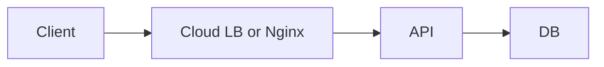
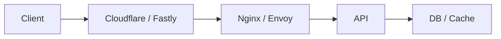
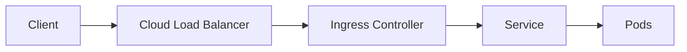
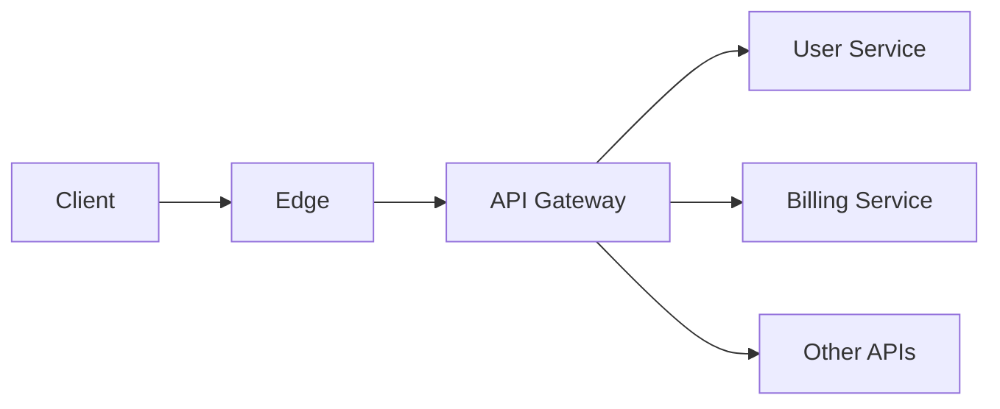
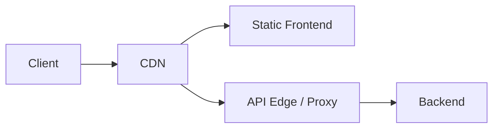

# Typical Edge Topologies

Ниже несколько типовых схем, которые полезно быстро узнавать и уметь объяснять.

## 1. Simple public API

Подходит:
- для простого сервиса;
- когда нет сложного edge stack.

## 2. Managed edge plus origin proxy

Подходит:
- когда нужен внешний managed edge;
- но внутри origin нужен свой proxy layer.

## 3. Cloud LB plus Kubernetes ingress

Подходит:
- для Kubernetes;
- когда routing и entrypoint живут внутри cluster.

## 4. Public API through API gateway

Подходит:
- для public APIs;
- для multi-tenant или partner APIs;
- когда важны policies и quotas.

## 5. Static and API split

Подходит:
- для SPA and frontend-heavy systems;
- когда static path и API path масштабируются по-разному.

## Как выбирать схему

Надо смотреть на:
- кто твой основной traffic source;
- нужен ли global edge;
- есть ли Kubernetes;
- сколько у тебя отдельных сервисов;
- нужна ли отдельная auth and API policy layer;
- есть ли heavy static delivery.

## Practical rule

На system design интервью полезнее показать:
- почему ты выбрал конкретную topology;
- чем она лучше более простой альтернативы;
- какие у нее failure points;
- как она меняется при росте нагрузки.
