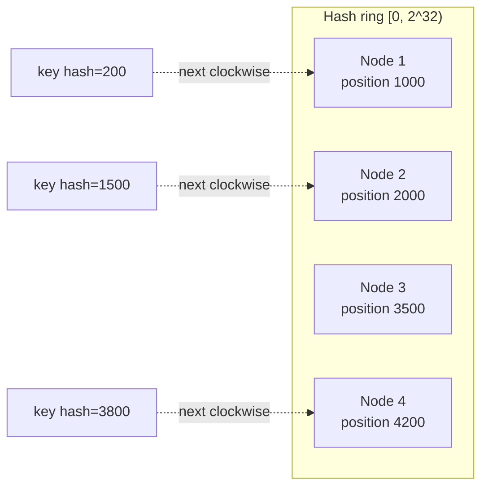
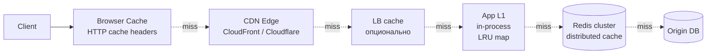
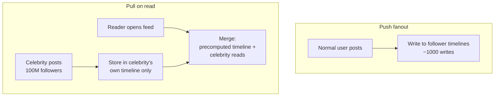
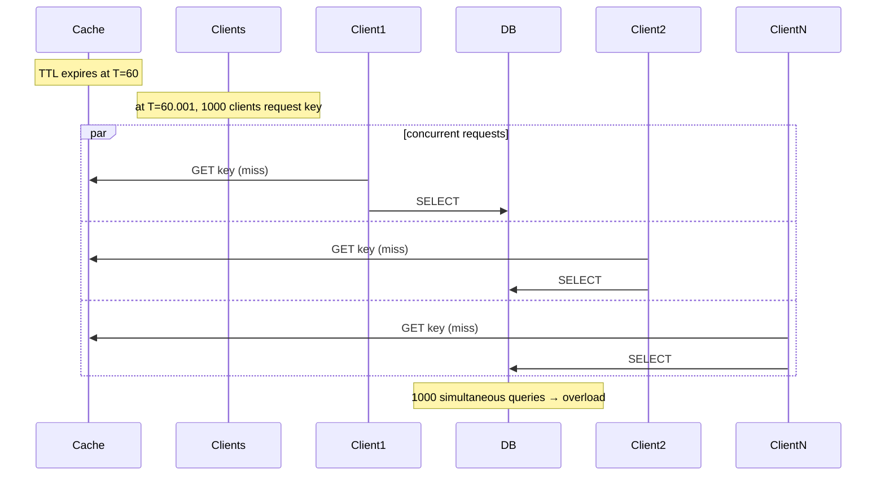
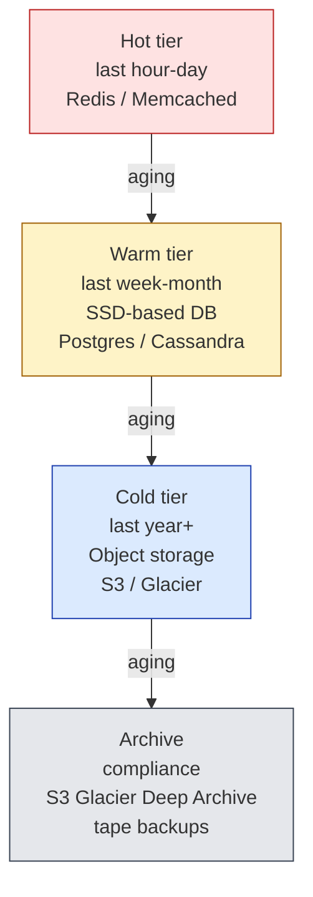
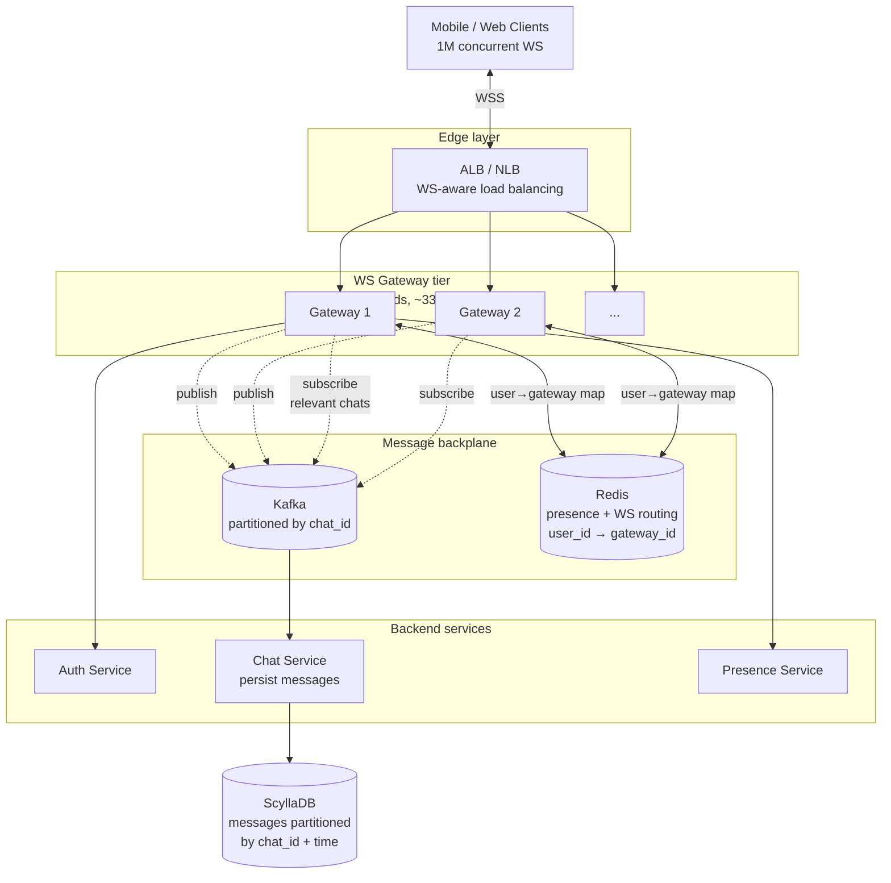

# Highload Design Patterns

Когда обычный backend перестаёт работать: что значит "лютый highload", какие **walls** появляются на каждом уровне нагрузки, и **как реально решают** эти проблемы Twitter, Discord, Stripe, Cloudflare и другие компании.

Это не "design X". Это **набор паттернов и принципов**, которые отличают системы 1K RPS от систем 1M+ RPS. На senior+ собеседованиях именно этих знаний обычно не хватает.

## Содержание

- [Что такое highload по числам](#что-такое-highload-по-числам)
- [Walls: где обычные подходы перестают работать](#walls-где-обычные-подходы-перестают-работать)
- [Главный принцип: async first](#главный-принцип-async-first)
- [Sharding: как разделить нагрузку](#sharding-как-разделить-нагрузку)
- [Replication и consistency trade-offs](#replication-и-consistency-trade-offs)
- [Caching at scale: tiered](#caching-at-scale-tiered)
- [Hot key problem](#hot-key-problem)
- [Fan-out patterns](#fan-out-patterns)
- [Thundering herd и coordination](#thundering-herd-и-coordination)
- [Backpressure и load shedding](#backpressure-и-load-shedding)
- [Bulkheading: изоляция доменов](#bulkheading-изоляция-доменов)
- [Geographic distribution](#geographic-distribution)
- [Storage tiering](#storage-tiering)
- [Operational scale](#operational-scale)
- [Cost at scale](#cost-at-scale)
- [Реальные истории](#реальные-истории)
- [Design example: 1M concurrent WebSocket chat](#design-example-1m-concurrent-websocket-chat)
- [Чек-лист интервью](#чек-лист-интервью)

---

## Что такое highload по числам

Термин "highload" размытый. Senior должен иметь конкретные пороги.

| RPS / scale | Категория | Что нужно |
|---|---|---|
| < 100 RPS | Низкая | Один pod, любая БД. Не задумываемся. |
| 100-1K RPS | Средняя | Несколько pod'ов, базовое кэширование. |
| 1K-10K RPS | High | Connection pooling, Redis cache, read replicas, асинхронность для тяжёлых операций. |
| **10K-100K RPS** | **Highload** | Sharding, message queues, observability, capacity planning. Здесь начинается "лютый". |
| **100K-1M RPS** | **Hyperscale** | Geo distribution, специализированные БД (Cassandra/Scylla), edge compute, custom protocols. |
| **1M+ RPS** | **Mega scale** | Кастомные решения, hardware optimization, multi-region active-active, network engineering. Это территория FAANG. |

### Другие dimensions помимо RPS

RPS не единственное число. На "highload" влияет:

- **Concurrent connections** — 10M WebSocket'ов (Discord, Slack) — другая задача чем 10M RPS HTTP
- **Storage** — 100PB данных (YouTube, Dropbox)
- **Throughput** — 10TB/s сетевого трафика (CDN)
- **Fan-out** — один write порождает 10M reads (Twitter celebrity tweet)
- **Latency budget** — 1ms vs 100ms vs 1s — кардинально разные архитектуры

**Mental model:** "highload" = когда **одна машина больше не справляется** ни по одной из dimensions, и **простое горизонтальное масштабирование** уже не помогает (нужны hierarchical, sharding, async).

---

## Walls: где обычные подходы перестают работать

В каждом масштабе появляется свой **wall** — фундаментальное ограничение, которое нельзя обойти "поставить больше pod'ов".

### 1. CPU wall (один pod)

```
Один Go pod: ~50K RPS на простом HTTP-handler (без БД)
              ~10K RPS с DB query
              ~1K RPS с heavy compute
```

**Wall:** не помещается на одну машину. **Решение:** scale-out, load balancer, stateless services.

### 2. Memory wall

```
Один pod: 8-64 GB RAM типично
Hold-in-memory state: 100K-10M entries в map
```

**Wall:** state не помещается в RAM одного pod'а. **Решение:** external state (Redis), sharding, eventual consistency.

### 3. DB wall

```
Single Postgres master: ~5-50K writes/sec (зависит от схемы и hardware)
Read replicas: можно × 10 reads
Connection limit: ~500-1000 active connections
```

**Wall:** один primary DB не выдерживает write load. **Решения:**
- **Vertical scaling** — больше CPU/RAM до предела
- **Sharding** — разбить по shard key
- **Specialized stores** — Cassandra, ScyllaDB, FoundationDB
- **Event sourcing + CQRS** — write log + materialized reads

### 4. Network wall

```
Single VM: 10-100 Gbps NIC
Single datacenter: ограничена inter-rack networking
Cross-region: latency 30-300ms
```

**Wall:** сетевая bandwidth дороже compute на больших scale'ах. **Решения:**
- **CDN / edge** — отвечаем поближе к клиенту
- **Compression** — gzip/brotli, custom protocols
- **Multiplexing** — HTTP/2, gRPC streaming
- **Locality-aware routing** — routing к ближайшему datacenter

### 5. Coordination wall

```
Distributed locks (Redis SET NX) — 10K-50K/sec
Consensus (Raft, Paxos) — 1K-10K writes/sec
Two-phase commit — практически невыполним на > 5 узлов
```

**Wall:** любая глобальная координация — bottleneck. **Решение:** eventual consistency, partition-local consistency, CRDT'ы.

### 6. Operational wall

```
Kubernetes control plane: до ~5K pods/cluster (потом etcd cracks)
Service mesh: control plane scaling
Observability: метрики/логи/traces — терабайты/день
```

**Wall:** инфраструктура для управления системой сама становится bottleneck. **Решения:**
- Multi-cluster federation
- Hierarchical service mesh
- Sampling tracing (1% вместо 100%)
- Metric aggregation на edge

### 7. Cost wall

```
1M RPS HTTP API на AWS:
  ~$50K-500K/month инфра (зависит от complexity)

10TB egress/month: $90K (на $0.09/GB)
```

**Wall:** на этой шкале $ начинает доминировать. **Решения:**
- Right-sizing (Compute Optimizer)
- Reserved/Savings Plans
- Spot для stateless workers
- Caching → reduce backend load
- Own DC vs cloud trade-off

---

## Главный принцип: async first

В highload **синхронный путь** — это путь к bottleneck'у.

**Правило:** на каждый sync call задайся вопросом — можно ли это сделать async?

### Антипаттерн: full sync flow

```
POST /order:
  1. Charge payment (~500ms)
  2. Reserve inventory (~100ms)
  3. Create shipment (~200ms)
  4. Send email (~300ms)
  5. Update analytics (~50ms)
  ----
  Total: 1150ms, single-thread
  Throughput: 1 / 1.15s = 0.87 RPS на 1 thread
```

### Async-first paradigm

```
POST /order:
  1. INSERT orders + outbox (one tx, ~10ms)
  2. Return 202 Accepted с order_id
  ----
  Total: 10ms, можем делать миллионы

Outbox → Kafka:
  - payments worker → charge (async)
  - inventory worker → reserve (async)
  - shipping worker → create (async)
  - email worker → send (async)
  - analytics worker → consume (async)
```

**Trade-off:** результат не immediate. Frontend должен показать "обрабатывается" и обновлять через polling/WebSocket.

**Что обязательно sync:**
- Validation (быстрая) — отказ за 10ms лучше чем accept потом fail
- Auth check
- Дедупликация (idempotency-key)

**Что обязательно async:**
- Heavy compute (image processing, ML inference)
- External integrations (Stripe, SendGrid)
- Notification fanout
- Analytics events
- Anything > 100ms response time

См. [09-saga-and-outbox.md](../04-architecture-and-patterns/patterns/09-saga-and-outbox.md).

---

## Sharding: как разделить нагрузку

Когда **одна БД не справляется** — sharding. Есть несколько стратегий, и выбор критичен.

### 1. Range sharding

```
shard_1: user_id 0 - 1M
shard_2: user_id 1M - 2M
shard_3: user_id 2M - 3M
```

**Плюсы:** удобно для range queries (`WHERE user_id BETWEEN ...`).
**Минусы:**
- **Hot shards** — новые пользователи концентрируются в одном shard
- Manual rebalancing при росте

### 2. Hash sharding

```
shard = hash(user_id) % N
```

**Плюсы:** uniform distribution.
**Минусы:**
- Нет range queries
- **При изменении N — переключение всех ключей** (плохо)

### 3. Consistent hashing

```
Hash ring: nodes размещаются на круге [0, 2^32)
key → hash(key) → ближайший node по часовой стрелке
```

**Плюсы:**
- При добавлении node перемещается только `1/N` ключей
- Используется в Cassandra, DynamoDB, memcached



**Virtual nodes:** каждый physical node размещается в 100-200 точках на ring → лучше uniformity.

### 4. Directory-based sharding (lookup table)

```
user_id → shard_id (lookup в metadata service)
```

**Плюсы:** гибкость — можно переселять отдельные ключи (hot users → dedicated shard).
**Минусы:**
- Дополнительный hop через lookup service
- Lookup service — single point of failure

Используется в Slack (per-team isolation), Twitter (Manhattan).

### 5. Shard key — главное решение

Что выбрать как shard key:

| Shard key | Применение | Проблемы |
|---|---|---|
| `user_id` | Per-user data | Один user может быть hot (celebrity) |
| `tenant_id` (org) | Multi-tenant SaaS | Один tenant может быть huge (Spotify, Netflix как enterprise customer) |
| `room_id` (chat) | Discord channels | Hot channels (announcements) |
| `time bucket` | Time-series | Recent shards hot |
| Composite (`user_id`, `time`) | Mix | Lookup сложнее |

### Resharding — самый болезненный процесс

Когда выбранная схема перестаёт работать (hot shards, growth):

**Стратегии:**
- **Double writes** — write в old + new, read из new когда synced
- **Background migration** — копирует данные по фоновому потоку
- **Online schema change** — gh-ost / pt-online-schema-change для Postgres/MySQL

Большие компании имели resharding incidents — Discord (cassandra → scyllaDB), Instagram (postgres → cassandra-like), Twitter (multiple times).

---

## Replication и consistency trade-offs

В highload **single primary** — bottleneck для writes. Решения:

### Single-leader replication

```
Writer → Primary → async replicate → Read replicas
```

**Read scaling:** × 10 от primary через read replicas.
**Write scaling:** ограничено primary.
**Consistency:** read replicas могут отставать (replication lag) — eventual consistency.

### Multi-leader replication

```
Region A primary ←→ Region B primary
                  (bidirectional replication)
```

**Плюсы:** writes в обоих регионах с low latency.
**Минусы:** **conflict resolution** — что если оба region'а одновременно update'или один row?

**Решения конфликтов:**
- **Last-Write-Wins** (timestamp) — простой, но теряет данные
- **CRDTs** (Conflict-free Replicated Data Types) — automatic merge (counters, sets)
- **Application-level resolution** — caller solves (e.g., Git merge conflicts)

### Leaderless replication

```
Write → quorum из N nodes (W ≥ N/2 + 1)
Read → quorum из N nodes (R ≥ N/2 + 1)
```

Используется Cassandra, DynamoDB, Riak.

**W + R > N** = strong consistency (sort of)
**W + R ≤ N** = eventual

### Consistency levels

| Уровень | Что |
|---|---|
| **Strong** | После write — все reads видят |
| **Read-your-writes** | Свои writes видишь сразу, чужие — eventually |
| **Monotonic** | Раз прочитал X, не увидишь "X-1" в следующем read |
| **Eventual** | Когда-нибудь все увидят (typically secs, иногда minutes) |

В highload — **eventual** norm. Sync replication слишком дорого.

**Anti-pattern:** "у нас strong consistency на хайлоаде" — обычно либо неправда, либо очень дорого.

---

## Caching at scale: tiered

В highload — **одного слоя кэширования недостаточно**. Используется иерархия.



**Latency:**
- Browser cache: 0 ms (local)
- CDN: 5-30 ms (geographic edge)
- App L1: < 1 μs (in-process)
- Redis: 0.5-2 ms (local DC)
- DB: 1-100 ms

### Cache patterns

**Cache-aside:** app reads cache, on miss reads DB and populates. См. [01-redis-as-cache.md](../06-databases/caching/01-redis-as-cache.md).

**Write-through:** writes идут в cache и DB одновременно.

**Write-behind:** writes идут только в cache, async — в DB.

**Read-through:** cache сам читает DB на miss (через cache library).

### Multi-tier specifics

**L1 (in-process Go map):**
- Размер: 10K-100K entries
- TTL: короткий (10-60s)
- Не consistent между instance'ами
- **Used for:** very hot keys (config, feature flags)

**L2 (Redis):**
- Размер: миллионы entries
- TTL: минуты-часы
- Shared между instances
- **Used for:** session, computed results, hot DB rows

**CDN cache:**
- Размер: огромный, но geographic
- TTL: hours-days
- **Used for:** static, semi-static, public API responses

### Cache invalidation at scale

"Two hard things in CS: cache invalidation and naming things."

**Стратегии:**
- **TTL-based** — simplest, eventual
- **Explicit invalidate on write** — точно, но dual-write problem
- **Pub/sub invalidation** — write publishes invalidate event, все nodes listening
- **Versioned keys** — `user:123:v45` — old keys просто expire

В hyperscale обычно: **TTL + versioned keys + targeted invalidation для critical updates**.

---

## Hot key problem

**Сценарий:** в Twitter Justin Bieber tweet'нул. 100M followers сразу пытаются прочитать его последний tweet. Single key `tweets:by_user:bieber` получает 1M RPS.

```
Normal user: 100 RPS на ключ user:123
Celebrity: 1M RPS на ключ user:bieber
                                   ↑
                              hot key
```

Single shard / single Redis node не выдержит. **Hot key problem** — фундаментальная проблема в любом hash-distributed системе.

### Решения

**1. Replicate hot key.**
Hot key хранится на 10 nodes вместо 1. Client randomly выбирает node.

```
Hot keys list: { "user:bieber", "user:obama", ... }
For hot key: random.choice([node1, node5, node12, ...])
```

**2. Client-side caching.**
Application instances кэшируют hot keys локально (in-memory). Reduce load на Redis.

**3. Read replicas для hot keys.**
Hot key migrate'ится на dedicated read-replica setup.

**4. Suffix randomization.**
```
Was: SET user:bieber → 1M writes hits one key
Now: SET user:bieber:{random_0_99} → 100 keys, 10K writes each
Read: pick random suffix
```

Подходит для counters (votes, likes), не для structured data.

**5. Application-level memoization.**
В Go: `singleflight` (см. [singleflight task](../13-interview-practice/coding-tasks/concurrency/06-singleflight.md)) дедуплицирует одновременные запросы.

### Detection

В Redis 7+: `CLUSTER COUNTKEYSINSLOT` + slot stats. Сторонние tools — Twemproxy stats, datadog Redis integration.

В application: per-key counters in metrics — top-K queries.

---

## Fan-out patterns

Когда **один write порождает много reads** (или наоборот) — fan-out проблема.

### Write-time fan-out (push)

```
User posts tweet
  ↓
Backend записывает tweet в "timeline:follower" каждого follower'а
  ↓
Follower просто читает свой timeline (precomputed)
```

**Плюсы:** read очень быстрый — просто чтение precomputed list.
**Минусы:**
- Celebrity с 100M followers → 100M writes на каждый post
- Storage: каждое посещение N раз продублировано (sharding)

### Read-time fan-out (pull)

```
User opens timeline
  ↓
Backend читает posts всех друзей user'а и merge'ит
```

**Плюсы:** write дешевый — один INSERT.
**Минусы:**
- Read дорогой — нужно merge N следящих feeds
- Cold cache → expensive

### Hybrid (Twitter's approach)

```
For normal users: push (write-fanout)
For celebrities: pull (read-fanout)
For users following celebrities: merge precomputed + celebrity reads at read-time
```

Это **точно** что Twitter делает с timeline. Чёткое решение celebrity problem.



### Other fan-out scenarios

- **Notifications:** new comment → 1 push notification per follower
- **Pub/sub:** event → N subscribers
- **Cache invalidation:** schema change → invalidate everywhere

Pattern: **дешевле fan-out** на стороне которая меньше нагружена.

---

## Thundering herd и coordination

### Thundering herd

**Сценарий:** cache TTL истёк. 1000 одновременных requests promptly находят cache miss. Все 1000 идут в DB. DB ложится.



**Решения:**

1. **Singleflight** — только один request реально идёт в DB; остальные ждут результат.
2. **Probabilistic early refresh** — обновляем кэш до истечения с растущей вероятностью.
3. **Stale-while-revalidate** — отдаём stale value, в фоне refresh.

См. [Redis cache patterns](../06-databases/caching/01-redis-as-cache.md).

### Distributed coordination

Любой `SET NX` lock, `compare-and-swap`, consensus — потенциальный bottleneck.

**Антипаттерн:** "получим distributed lock на каждый order". С 100K orders/sec — Redis lock service ляжет.

**Альтернативы:**
- **Optimistic concurrency** (CAS на version) вместо locks
- **Partition by key** — нет shared state, не нужен lock
- **Single-writer per partition** — pinning thread к partition
- **Conflict-free design** — CRDT, idempotency

---

## Backpressure и load shedding

Когда система **не справляется**, есть 3 опции:

1. **Block** (backpressure): producer ждёт
2. **Drop** (load shedding): отказываем новым
3. **Crash**: catastrophic

При hyperscale Block → cascade failure (один slow service блокирует upstream). **Drop осознанно** обычно лучше.

### Patterns

**Bounded queues:** size cap, при overflow → drop или error.

**Adaptive concurrency limits:** Netflix's [concurrency-limits](https://github.com/Netflix/concurrency-limits) — dynamically adjusts based on observed latency.

**Request priorities:** drop low-priority под нагрузкой.

**429 Too Many Requests:** rate limit honest response.

**503 Service Unavailable:** "wait Y seconds then retry" (with Retry-After header).

**Open circuit breaker:** временно отказываем чтобы downstream восстановилось. См. [03-circuit-breaker.md](reliability-patterns/03-circuit-breaker.md).

### Adaptive shedding

```
At low load: accept all
At 80% capacity: drop low-priority traffic
At 95% capacity: drop normal traffic, only critical
At 100%: emergency, drop everything new, save current state
```

Используется Cloudflare, Netflix. См. [04-backpressure (interview task)](../13-interview-practice/coding-tasks/streams/04-backpressure.md).

---

## Bulkheading: изоляция доменов

Один сломанный домен не должен валить остальные. Это **bulkhead pattern** (от перегородок в кораблях — если один отсек затопило, корабль не тонет).

### Уровни изоляции

**1. Process-level:**
- Микросервисы: один сервис упал — остальные работают
- Trade-off: network overhead

**2. Thread/goroutine pools:**
- Отдельный pool для каждой внешней зависимости
- Stripe ляжет — отдельный pool, не блокирует email pool

```go
// Bad: shared pool
http.DefaultClient  // все calls делят один pool

// Good: per-dependency
stripeClient := &http.Client{
    Transport: &http.Transport{MaxConnsPerHost: 50},
}
sendgridClient := &http.Client{
    Transport: &http.Transport{MaxConnsPerHost: 20},
}
```

**3. Database connection pools:**
- Один pool на каждую важную табличку (или domain)
- Slow query на одной не блокирует connections для others

**4. Network-level:**
- Rate limit per dependency
- Circuit breaker per dependency
- Timeouts (different per dependency!)

**5. Cluster-level:**
- Cell-based architecture (Cloudflare, AWS): несколько маленьких clusters вместо одного большого
- Один cell упал — остальные работают

См. [bulkhead pattern](reliability-patterns/07-bulkhead.md).

---

## Geographic distribution

Single-region архитектура хорошо работает до тех пор пока пользователи в одном регионе. После — **geo distribution** обязательна.

### Latency reality

```
Same datacenter: 0.5 ms
Within region: 1-5 ms
Cross-region same continent: 30-80 ms
Cross-continent: 100-300 ms
```

**Implication:** для интерактивного UX (< 100ms response) у тебя есть **один cross-continent round-trip максимум**.

### Patterns

**1. CDN + Anycast routing:**
- DNS возвращает ближайший edge IP
- Cloudflare/Fastly/CloudFront

**2. Read-local-write-global:**
- Reads из ближайшего region
- Writes идут в primary (cross-region latency)
- E-commerce browsing — local, checkout — может быть slow

**3. Active-active multi-region:**
- Writes в любом region
- Sync через multi-leader replication
- Conflict resolution
- Discord, DynamoDB global tables

**4. Active-passive:**
- All writes в primary region
- Hot standby в secondary
- Failover если primary down
- Простой, но secondary "idle" большую часть времени

**5. Cell-based:**
- Каждый region — independent cell
- Минимум cross-region traffic
- Один cell упал — остальные не affected
- Cloudflare, AWS S3

### Geo-routing examples

**Pro:** Spotify — pre-positioned content в каждом region. Streaming from nearest.

**Pro:** Netflix Open Connect — physical CDN servers в ISP'ах. Movie playing from same building.

**Con:** Banks — writes consistent globally → cross-region для каждой operation → slow.

---

## Storage tiering

В hyperscale данные разделяются по **температуре**:



**Cost vs latency trade-off:**
- Redis: $50/GB/month, 1ms
- SSD: $0.10/GB/month, 1-10ms
- S3 Standard: $0.023/GB/month, 50-100ms
- S3 Glacier: $0.004/GB/month, hours retrieval

### Lifecycle management

S3 lifecycle policies: автоматический переход cold-tier → archive после X дней.

DB partitioning: month-based partitions, dropping old ones.

**Real example:** WhatsApp message storage. Most reads — last 24 hours. After 30 days — cold (rarely accessed). Strategy: SSD for hot, HDD for warm, very rare reads from old data.

---

## Operational scale

Когда у тебя 1000+ services, миллионы pods — **operations** становится отдельным walls.

### Observability at scale

**Metrics:** Prometheus с 100K pods → storage explosion. Решения:
- Cardinality limits (количество unique label combinations)
- Aggregation на edge (Mimir, Thanos)
- Sampling — не каждый запрос в histogram

**Tracing:** 1M traces/sec — слишком много для хранения.
- **Head sampling** — выбираем 1% случайно
- **Tail sampling** — keep slow traces, errors; drop rest

**Logs:** TB/day легко.
- Structured logging
- Log levels strict in production (INFO+, не DEBUG)
- Indexing only relevant fields
- Cold storage для compliance

### Deployment at scale

Rolling update для 10K pods занимает hours. Approaches:
- Canary deployments (1% → 10% → 100%)
- Feature flags для риск-free release
- Blue-green для critical services
- Cell-based rollouts — один cell at a time

### Incident response

**MTTD/MTTR** (Mean Time To Detect / Resolve):
- Auto-detection через anomaly detection
- Auto-rollback при SLO violations
- Runbook automation
- Pre-prepared "kill switches" для каждого compute path

См. [postmortem template](reliability-patterns/09-postmortem.md).

---

## Cost at scale

На 1M+ RPS scale инфра-cost доминирует над dev cost.

### Главные cost drivers

**1. Network egress** — самое коварное. AWS $0.09/GB to internet → 1 PB/month = $90K.
**Решения:**
- CDN для static (cheaper egress)
- Compression
- Same-AZ traffic (free in AWS)
- VPC endpoints для S3/DynamoDB

**2. Compute** — обычно 30-50% bill.
**Решения:**
- Right-sizing (Compute Optimizer)
- Spot для stateless workers (savings 70-90%)
- Reserved/Savings Plans для baseline (savings 30-72%)
- Graviton/ARM (savings 20-40%)

**3. Storage** — особенно для retention.
**Решения:**
- Tiered storage (lifecycle policies)
- Compression at storage level
- Cold storage (Glacier) для archives

**4. Managed services premium** — RDS дороже self-hosted на factor 2-3.
**Trade-off:** managed = меньше ops headcount.

### Cost monitoring

Tagging обязательно — per-team, per-feature attribution.
Anomaly detection — alert при unusual spend (S3 случайно public например).

См. [cloud cost guide](../11-devops-and-observability/cloud/02-cloud-cost-and-architecture.md).

---

## Реальные истории

Конкретные walls которые публично известны.

### Twitter: timeline fan-out

**Wall:** в 2008 Twitter падал при каждом event (Olympics, US election). Timeline construction was read-heavy, не выдерживал.

**Solution:** инвертировали — push-based timeline (precompute), потом hybrid для celebrities. Manhattan storage (custom-built на key-value model).

Эссенция: **переключение read-heavy → write-heavy** когда reads несколько порядков чаще writes.

### Discord: messages

**Wall:** Cassandra cluster с 177 nodes начал struggle при 12 billion messages. Latency p99 росла до seconds.

**Solution:** мигрировали на **ScyllaDB** (C++ rewrite Cassandra). Same data model, в 2-3x меньше nodes, latency p99 миллисекунды.

Эссенция: **right database matters at scale**. Cassandra → ScyllaDB — нет API changes, но 10x performance.

### WhatsApp: 2 billion users on 50 engineers

**Wall:** classical architecture не scale'ится до billions с маленькой командой.

**Solution:**
- **Erlang/OTP** — millions of lightweight processes, designed for telecom-scale concurrency
- **Очень простая архитектура** — minimal services
- **FreeBSD optimizations** — kernel tuning, custom networking
- **End-to-end encryption** — служит и feature и cost saver (нельзя индексировать messages)

Эссенция: **right language/runtime matters**. Erlang на 50 engineers vs Java на 500.

### Stripe: payment processing

**Wall:** 10K+ payments/sec, **zero tolerance** для double-charges или lost payments.

**Solution:**
- **Idempotency-key для everything** — каждая операция accepts idempotency-key, dedup на server side
- **Strong consistency для money** — Postgres с careful sharding
- **Outbox pattern** для всех state changes
- **Reconciliation jobs** — daily compare с банками

Эссенция: **money requires strong consistency**, но через careful design можно scale (idempotency + sharding).

См. [11-payment-system.md](interview-cases/11-payment-system.md).

### Cloudflare: 50M+ req/sec edge

**Wall:** edge layer должен обрабатывать DDoS-scale traffic, всегда, с малой латенси.

**Solution:**
- **Anycast routing** — каждый IP advertised из 300+ datacenters
- **Pingora** — custom HTTP proxy в Rust (заменил nginx)
- **Workers** (V8 isolates) для edge compute
- **DDoS protection** — на уровне routing

Эссенция: **edge scale требует custom infra**. Стандартные tools (nginx, Linux defaults) не справляются.

### GitHub: scaling MySQL

**Wall:** MySQL на одной машине, 100M+ devs. Сначала read replicas (1:5 ratio), потом sharding.

**Solution:**
- **Vitess** — Google's sharding layer для MySQL
- **gh-ost** — online schema migrations без downtime
- **Per-shard read replicas** — multi-region reads

Эссенция: **vertical scaling до конца, потом sharding**. Vitess дал sharding без переписывания application.

### Netflix: Open Connect CDN

**Wall:** streaming 200M+ users globally, video bandwidth — главный cost.

**Solution:**
- **Own CDN** — Open Connect appliances в ISP datacenter'ах
- **Pre-positioning** — content pushed заранее в каждый OCA
- **Adaptive bitrate** — per-segment encoding для разных bandwidth

Эссенция: **own infra для core competency**. Netflix's CDN saves $$ vs commercial CDN.

---

## Design example: 1M concurrent WebSocket chat

Конкретный пример где все patterns соединяются.

### Требования

- 10M registered users
- 1M concurrent online
- Group chats до 10K members
- "Online" status за < 5s
- Message delivery < 100ms global

### Сначала числа

```
1M concurrent WS:
  ~10MB RAM per connection × 1M = 10TB ?? Нет, slim WS:
  ~20KB × 1M = 20GB → один pod не выдержит → распределить
  Single pod может держать ~64K connections → 16 pods минимум

Messages/sec:
  1M users × 5 msg/min = ~83K msg/sec normal
  Peak burst: × 5 = 400K msg/sec

Group fanout:
  1 message in 10K-member group = 10K deliveries
  100 active 10K-groups = 1M deliveries/sec average
```

### Архитектура



### Ключевые decisions

**1. WS connection routing:** sticky sessions через connection_id в URL. ALB поддерживает.

**2. User → gateway lookup:** Redis hash `user_id → gateway_id`. На connect — пишет, на disconnect — удаляет. TTL короткий (heartbeat обновляет).

**3. Message flow:**
```
Client A → Gateway 1 → Kafka (partitioned by chat_id) →
  Gateway 1 (and others subscribed to this chat) →
    For each user in chat: Redis lookup → forward via WS
```

**4. Chat membership routing:** Gateway subscribes к Kafka topics для chats whose members он сейчас держит. Subscription dynamically updates.

**5. Persistence:** Kafka → ChatService (async consumer) → ScyllaDB. Partition by chat_id, sorted by time.

**6. Hot chats:** announcement channels с 10K members — multiple Gateway pods subscribe к том же partition (consumer group rebalances).

**7. Backpressure:** при peak traffic Kafka буферизует. Если consumer слишком медленный — Kafka retention обрезает. Drop старые messages в "channel paused" state.

**8. Presence:** Redis sorted set per user, score = last heartbeat timestamp. Online = heartbeat < 30s ago. Offline status broadcast через Kafka.

**9. Geo distribution:** active-active с per-region Kafka cluster. Cross-region messages через mirror-maker. Eventual consistency для cross-region chats.

**10. Scaling:** Gateway pods stateless (state в Redis) → scale-out trivial. Kafka partitions = capacity unit.

### Walls и решения

| Wall | Симптом | Решение |
|---|---|---|
| Connection memory | Pod OOM at >64K WS | Многие pods, sticky LB |
| Hot channel | One Kafka partition saturated | Multiple consumers per partition; per-channel rate limit |
| Presence storm | User reconnects → all friends notified → fan-out | Debounce presence updates, only notify on transition |
| Cross-region | Cross-region message latency | Local writes, async cross-region sync |
| Reconnect storm | Network blip → 1M reconnects at once | Random reconnect jitter on client; LB capacity headroom |

### Throughput estimate

```
Per gateway pod (33K WS):
  Read RPS: 33K × 1 ws msg/sec = 33K
  Write to Kafka: same
  Memory: ~700MB for WS state
  CPU: 2-4 cores

Total fleet:
  30 gateway pods
  Kafka cluster: 12 brokers (3 racks × 4 brokers)
  Redis cluster: 6 nodes (3 master + 3 replica)
  ScyllaDB: 12 nodes
```

---

## Чек-лист интервью

Если на собеседовании просят "design system at 1M RPS" — пройди по этому чек-листу:

**Сначала числа:**
- [ ] Уточни **что** именно 1M (RPS HTTP? concurrent users? messages? events?)
- [ ] Read:write ratio
- [ ] Latency budget (P99)
- [ ] Consistency requirements

**Architectural decisions:**
- [ ] Sharding strategy и shard key
- [ ] Replication mode (single/multi-leader/leaderless)
- [ ] Caching layers (L1 in-process, L2 Redis, CDN)
- [ ] Async vs sync paths (что в outbox, что real-time)
- [ ] Geographic distribution (single/multi-region)

**Failure handling:**
- [ ] Per-dependency timeouts и circuit breakers
- [ ] Retry policy (exponential backoff, idempotency)
- [ ] Backpressure / load shedding strategy
- [ ] Bulkheading critical paths

**Hot spots:**
- [ ] Identify potential hot keys/shards
- [ ] Plan для celebrity-type users
- [ ] Cache invalidation strategy

**Operational:**
- [ ] Observability stack (metrics/logs/traces) с sampling
- [ ] Deployment strategy (canary, blue-green)
- [ ] Auto-scaling
- [ ] Cost considerations

**Real-world signals (что показать seniority):**
- [ ] Упомянуть **конкретные тех** (Cassandra/Scylla/Manhattan, не "NoSQL")
- [ ] Знать **реальные примеры** (Discord scyllaDB migration, Twitter timeline)
- [ ] **Trade-offs explicit** — "выбираю X потому что важнее Y, готов терять Z"
- [ ] **What breaks first** — какой component первым ляжет под нагрузкой
- [ ] **Cost discussion** — at scale это серьёзный фактор

---

## Что точно показать что ты понимаешь highload

1. **Walls thinking** — не "поставлю больше pod'ов", а "что именно станет bottleneck'ом"
2. **Eventual consistency mindset** — strong consistency дорого, design системы вокруг "когда-нибудь правда"
3. **Async first** — каждый sync call — потенциальный bottleneck
4. **Bulkheading** — один домен не должен валить остальные
5. **Hot key awareness** — uniform distribution не происходит само
6. **Real examples** — знать как Twitter/Discord/Stripe/Cloudflare решают конкретные проблемы
7. **Cost matters** — на больших scale инфра дороже команды

## Связки

- [Reliability Patterns](reliability-patterns/) — circuit breaker, retries, backpressure, SLO, postmortems
- [Caching](../06-databases/caching/01-redis-as-cache.md) — production cache patterns
- [Saga и Outbox](../04-architecture-and-patterns/patterns/09-saga-and-outbox.md) — async-first ground truth
- [Database sharding (Postgres)](../06-databases/database-systems-catalog/postgresql/12-sharding.md)
- [Kafka](../07-message-brokers-and-streaming/01-kafka.md) — backbone для async
- [Cloud cost](../11-devops-and-observability/cloud/02-cloud-cost-and-architecture.md)
- Interview cases с highload элементами:
  - [Uber ride-sharing](interview-cases/06-uber-ride-sharing.md) — geo + real-time
  - [YouTube](interview-cases/07-youtube-video-platform.md) — video at scale
  - [Twitter feed](interview-cases/08-twitter-social-feed.md) — celebrity problem
  - [Netflix](interview-cases/09-netflix-streaming.md) — CDN scale
- Внешние:
  - [High Scalability blog](http://highscalability.com/) — real architectures from big companies
  - [Designing Data-Intensive Applications](https://dataintensive.net/) — Martin Kleppmann
  - [Discord ScyllaDB migration story](https://discord.com/blog/how-discord-stores-trillions-of-messages)
  - [Twitter Manhattan paper](https://blog.twitter.com/engineering/en_us/a/2014/manhattan-our-real-time-multi-tenant-distributed-database-for-twitter-scale)
