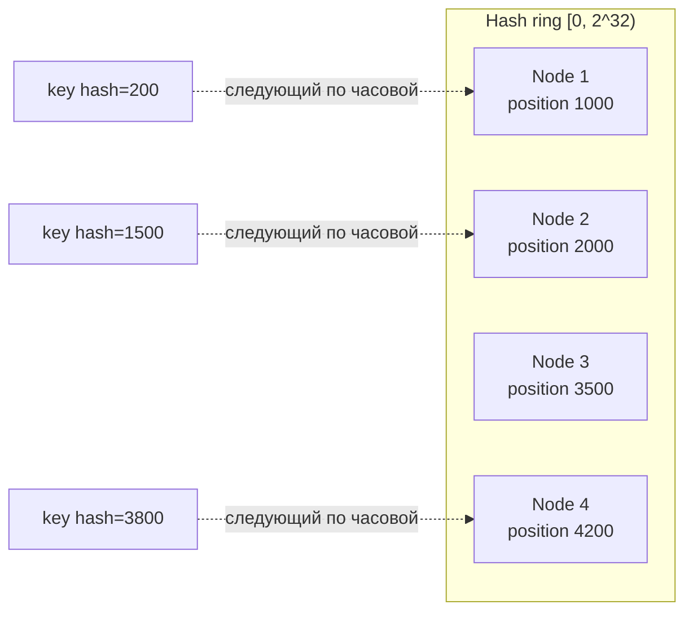
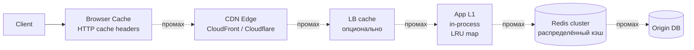
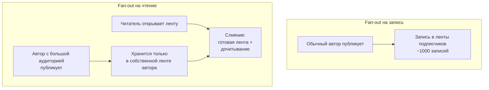
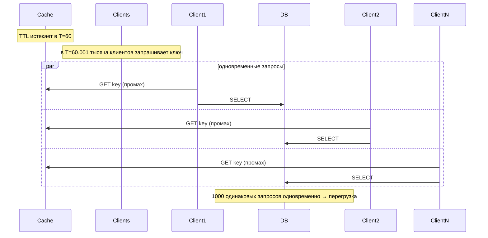
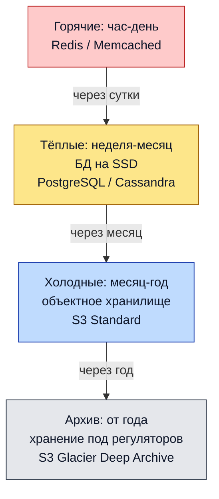

# Highload Design Patterns

## Содержание

- [Что такое highload по числам](#что-такое-highload-по-числам)
- [Walls: где обычные подходы перестают работать](#walls-где-обычные-подходы-перестают-работать)
- [Главный принцип: async first](#главный-принцип-async-first)
- [Sharding: как разделить нагрузку](#sharding-как-разделить-нагрузку)
- [Репликация и consistency trade-offs](#репликация-и-consistency-trade-offs)
- [Многоуровневое кэширование](#многоуровневое-кэширование)
- [Hot key problem](#hot-key-problem)
- [Fan-out patterns](#fan-out-patterns)
- [Thundering herd и координация](#thundering-herd-и-координация)
- [Backpressure и load shedding](#backpressure-и-load-shedding)
- [Bulkheading: изоляция доменов](#bulkheading-изоляция-доменов)
- [Географическое распределение](#географическое-распределение)
- [Storage tiering: данные по температуре](#storage-tiering-данные-по-температуре)
- [Эксплуатация на масштабе](#эксплуатация-на-масштабе)
- [Стоимость на масштабе](#стоимость-на-масштабе)
- [Реальные истории](#реальные-истории)
- [Сквозной пример: 1M WebSocket-соединений](#сквозной-пример-1m-websocket-соединений)
- [Чек-лист интервью](#чек-лист-интервью)
- [Interview-ready answer](#interview-ready-answer)
- [Связки](#связки)

Статья о том, где обычный backend перестаёт работать: какие стены (walls) появляются на каждом уровне нагрузки, почему их нельзя обойти добавлением подов, и какими приёмами их обходят Twitter, Discord, Stripe, Cloudflare и другие компании.

Это не разбор одной конкретной системы, а набор паттернов и ограничений, которые отличают систему на 1K RPS от системы на 1M+ RPS. Разборы конкретных задач лежат рядом — в [interview-cases](interview-cases/), а порядок работы над задачей на собеседовании описан в [00-how-to-approach.md](interview-cases/00-how-to-approach.md).

---

## Что такое highload по числам

Слово «highload» само по себе ничего не сообщает: без числа за ним стоит любой смысл от 200 RPS до миллиона. Поэтому первое, что стоит держать в голове, — пороги, на которых меняется архитектура.

| RPS / масштаб | Категория | Что нужно |
|---|---|---|
| < 100 RPS | Низкая | Один под, любая БД. Архитектурных решений не требует. |
| 100–1K RPS | Средняя | Несколько подов, базовое кэширование. |
| 1K–10K RPS | High | Пул соединений, кэш в Redis, read-реплики, асинхронность для тяжёлых операций. |
| 10K–100K RPS | Highload | Шардирование, очереди, observability, capacity planning. |
| 100K–1M RPS | Hyperscale | Гео-распределение, специализированные БД (Cassandra, DynamoDB), edge compute, свои протоколы. |
| 1M+ RPS | Mega scale | Кастомные решения, оптимизация под железо, multi-region active-active, сетевой инжиниринг. |

Пороги в таблице описывают типичный read-heavy JSON API. Write-heavy нагрузка или нагрузка с большим fan-out упирается в стены раньше: 10K записей в секунду с пятью индексами на таблице тяжелее, чем 100K чтений из кэша.

### Другие измерения помимо RPS

RPS — не единственное число, по которому система становится тяжёлой. Нагрузку задают ещё пять величин:

- **Одновременные соединения.** 10M открытых WebSocket (Discord, Slack) — не то же самое, что 10M HTTP-запросов в секунду: там платят памятью и файловыми дескрипторами, здесь — процессором.
- **Объём хранения.** 100 ПБ данных (YouTube, Dropbox) меняют не обработку запроса, а стоимость и стратегию размещения.
- **Пропускная способность сети.** 10 ТБ/с трафика CDN упирается в железо и цену канала раньше, чем в логику приложения.
- **Fan-out.** Одна запись порождает 10M чтений — celebrity tweet в Twitter.
- **Бюджет задержки.** 1 мс, 100 мс и 1 с — три разные архитектуры для одной и той же функциональности.

Ментальная модель: highload начинается там, где одна машина перестаёт справляться хотя бы по одному из измерений, и при этом простое добавление одинаковых машин уже не помогает — нужны шардирование, иерархия и асинхронность.

---

## Walls: где обычные подходы перестают работать

На каждом масштабе появляется своя стена — ограничение, которое не снимается фразой «поставим больше подов». Стен семь, и полезно знать порядок величины для каждой.

### 1. CPU wall (один под)

```text
Один Go-под на 2–4 ядрах:
  ~50K RPS  — простой HTTP-хендлер без внешних вызовов
  ~10K RPS  — хендлер с одним запросом в БД
  ~1K RPS   — хендлер с тяжёлыми вычислениями
```

Это порядок величины для прикидки, а не измерение: между «вернуть 200 OK» и «сериализовать 50 КБ JSON» разница в десятки раз. Реальную цифру даёт нагрузочный тест на своём хендлере, и именно она подставляется в расчёт числа подов.

Стена: обработка не помещается на одну машину. Решение: масштабирование вширь, балансировщик, stateless-сервисы.

### 2. Memory wall

```text
Один под: 8–64 ГБ RAM типично
Состояние в памяти: 100K–10M записей в map

10M записей map[string]struct{...} со значением ~100 Б:
  ключ ~30 Б + значение ~100 Б + накладные расходы map ~20 Б ≈ 150 Б
  10M × 150 Б ≈ 1.5 ГБ
```

Стена: состояние не помещается в память одного пода. Решение: вынести состояние наружу (Redis), шардировать его, согласиться на eventual consistency между репликами приложения.

### 3. DB wall

```text
Один primary PostgreSQL:
  ~5K записей/с   — широкая таблица с 5 индексами
  ~50K записей/с  — узкая таблица с одним индексом на NVMe
Read-реплики: чтения масштабируются примерно ×10
Активные соединения: ~500–1000
```

Потолок соединений упирается не в сеть: каждое соединение в PostgreSQL — отдельный процесс ОС с собственной памятью, поэтому тысячи соединений превращаются в переключения контекста. Отсюда pgbouncer перед базой.

Стена: один primary не выдерживает поток записей. Решения:

- **Вертикальное масштабирование** — больше CPU и памяти, пока хватает.
- **Шардирование** — разбить по shard key.
- **Специализированные хранилища** — Cassandra, DynamoDB, FoundationDB.
- **Event sourcing и CQRS** — журнал записей плюс материализованные представления для чтения.

См. [шардирование PostgreSQL](../06-databases/database-systems-catalog/postgresql/12-sharding.md).

### 4. Network wall

```text
Одна виртуальная машина: 10–100 Гбит/с NIC
Внутри дата-центра: ограничение — межстоечная сеть
Между регионами: 30–300 мс задержки

10 Гбит/с = 1.25 ГБ/с
При среднем ответе 50 КБ это 1.25e9 / 50e3 = 25 000 RPS
```

Сетевой потолок наступает раньше процессорного, если ответы крупные: 25K RPS по сети против 50K RPS по процессору для того же пода.

Стена: на больших масштабах трафик стоит дороже вычислений. Решения:

- **CDN и edge** — отвечать ближе к клиенту.
- **Сжатие** — gzip/brotli, компактные форматы вместо JSON.
- **Мультиплексирование** — HTTP/2, gRPC streaming: один TCP-коннект вместо сотни.
- **Locality-aware routing** — маршрутизация в ближайший дата-центр.

### 5. Coordination wall

```text
Redis на одном узле: ~100K простых команд/с
  захват + освобождение блокировки = 2 команды → ~50K циклов/с на узел

Настоящий потолок задаёт не узел, а сам ключ:
  критическая секция 5 мс → 1 / 0.005 = 200 захватов/с на один ключ

etcd (Raft): ~10K записей/с — каждая ждёт fsync на кворуме
Two-phase commit: задержку задаёт самый медленный участник,
  отказ координатора блокирует всех остальных до его возвращения
```

Разница между двумя числами важна: узел выдерживает 50K блокировок в секунду, но только если это 50K разных ключей. Если все спорят за один ключ, потолок задаёт длительность критической секции, и никакой шардинг Redis его не поднимет.

Стена: любая глобальная координация — узкое место. Решение: eventual consistency, согласованность в пределах партиции, CRDT.

### 6. Operational wall

```text
Kubernetes, официальные пределы большого кластера:
  ≤ 110 подов на узел
  ≤ 5 000 узлов
  ≤ 150 000 подов в кластере
  etcd по умолчанию ограничен базой в 2 ГБ

Observability: метрики, логи и трейсы — терабайты в день
```

На практике первым упирается не число подов, а watch-трафик: каждое изменение объекта api-server рассылает всем подписчикам, и контроллеры с service mesh создают его больше, чем сами рабочие нагрузки.

Стена: инфраструктура управления системой сама становится узким местом. Решения:

- Федерация нескольких кластеров вместо одного большого.
- Иерархический service mesh.
- Сэмплирование трейсов (1% вместо 100%).
- Агрегация метрик на подходе к хранилищу.

### 7. Cost wall

```text
1M RPS HTTP API в AWS: ~$50K–500K/мес
  разброс задаёт не RPS, а что именно делает запрос

Исходящий трафик в интернет, on-demand us-east-1:
  первые 10 ТБ  — $0.09/ГБ → 10 000 ГБ × 0.09 = $900
  следующие 40 ТБ — $0.085/ГБ → $3 400
  следующие 100 ТБ — $0.07/ГБ → $7 000
  свыше 150 ТБ  — $0.05/ГБ → 850 000 ГБ × 0.05 = $42 500
  1 ПБ/мес по ступеням ≈ $54K
```

Тарифная сетка ступенчатая, поэтому линейная прикидка «1 ПБ × $0.09 = $90K» завышает счёт почти вдвое. Крупные клиенты вдобавок договариваются о скидке, так что прайс-лист — верхняя граница.

Стена: на этом масштабе деньги начинают определять архитектуру. Решения:

- Right-sizing инстансов.
- Reserved instances и Savings Plans под базовую нагрузку.
- Spot для stateless-воркеров.
- Кэширование как способ снизить нагрузку на backend, а не только задержку.
- Сравнение своего дата-центра с облаком.

---

## Главный принцип: async first

Синхронный путь удерживает ресурсы на всё время выполнения. Чем длиннее путь, тем больше запросов одновременно находятся в полёте, и тем раньше кончаются соединения к БД, воркеры и память.

Правило: на каждый синхронный вызов стоит проверить, нельзя ли сделать его асинхронным.

### Антипаттерн: полностью синхронный поток

```text
POST /order:
  1. Charge payment     ~500 мс
  2. Reserve inventory  ~100 мс
  3. Create shipment    ~200 мс
  4. Send email         ~300 мс
  5. Update analytics    ~50 мс
  ----
  Итого 1150 мс на запрос
```

Во что это превращается на нагрузке, показывает закон Литтла (`параллелизм = поток × длительность`):

```text
10 000 RPS × 1.15 с = 11 500 запросов одновременно в полёте
```

Каждый из этих 11 500 запросов удерживает соединение к БД, слот в пуле к платёжному провайдеру и память под контекст. Пул PostgreSQL на 500 соединений закончится на 435 RPS — задолго до того, как упрётся процессор.

### Async-first

```text
POST /order:
  1. INSERT orders + outbox (одна транзакция, ~10 мс)
  2. Вернуть 202 Accepted с order_id
  ----
  Итого 10 мс

10 000 RPS × 0.01 с = 100 запросов одновременно в полёте

Outbox → Kafka:
  - payments worker  → charge   (async)
  - inventory worker → reserve  (async)
  - shipping worker  → create   (async)
  - email worker     → send     (async)
  - analytics worker → consume  (async)
```

Параллелизм упал в 115 раз — ровно во столько же, во сколько сократилась длительность синхронной части. Это и есть весь эффект: асинхронность не делает работу быстрее, она убирает её из запроса.

Плата: результат перестаёт быть немедленным. Клиент должен показать «обрабатывается» и получить финальный статус через опрос или WebSocket, а система — уметь рассказать, чем закончилась каждая асинхронная ветка.

Что остаётся синхронным:

- **Валидация.** Отказ за 10 мс лучше, чем приём с последующим отказом через минуту.
- **Проверка прав.** Асинхронный отказ в доступе означает, что операция уже началась.
- **Дедупликация по idempotency-key.** Дубль надо отсечь до попадания в очередь, иначе он размножится по всем потребителям.

Что уходит в асинхронный путь:

- Тяжёлые вычисления: обработка изображений, инференс моделей.
- Обращения к внешним системам: Stripe, SendGrid.
- Рассылка уведомлений.
- Аналитические события.
- Всё, что дольше ~100 мс.

См. [09-saga-and-outbox.md](../04-architecture-and-patterns/patterns/09-saga-and-outbox.md).

---

## Sharding: как разделить нагрузку

Когда одна БД не справляется с записью, данные разносят по нескольким независимым базам. Стратегий несколько, и выбор ключа определяет, во что упрётся система через год.

Стоит различать два похожих механизма. Партиционирование делит одну таблицу внутри одной базы: снимает проблему размера таблицы и ускоряет удаление старых данных, но не добавляет ни процессора, ни диска. Шардирование разносит данные по разным серверам: добавляет ресурсы, но взамен убирает межшардовые join и транзакции.

### 1. Range sharding

```text
shard_1: user_id 0 – 1M
shard_2: user_id 1M – 2M
shard_3: user_id 2M – 3M
```

Плюс: удобно для диапазонных запросов (`WHERE user_id BETWEEN ...`) — они попадают в один шард.

Минусы:

- **Горячие шарды.** Новые пользователи с последовательными id концентрируются в последнем шарде, и вся нагрузка на регистрацию идёт туда.
- **Ручная перебалансировка.** Границы диапазонов приходится двигать самим по мере роста.

### 2. Hash sharding

```text
shard = hash(user_id) % N
```

Плюс: равномерное распределение.

Минусы:

- Диапазонные запросы невозможны — соседние id лежат в разных шардах.
- **При изменении N переезжает почти всё.** Переход с N на N+1 оставляет на месте примерно 1/(N+1) ключей: при N=4 на месте остаётся около 20%, остальные 80% нужно перевезти.

### 3. Consistent hashing

```text
Кольцо: узлы размещаются на окружности [0, 2^32)
ключ → hash(ключ) → ближайший узел по часовой стрелке
```

Плюсы:

- При добавлении узла переезжает примерно K/(N+1) ключей вместо всех: с 4 узлов на 5 — около 20%, а не 80%.
- Применяется в Cassandra, DynamoDB, memcached.



Виртуальные узлы: каждый физический узел размещается на кольце в 100–200 точках. Без этого при четырёх узлах дуги между ними получаются разной длины, и один узел может получить вдвое больше ключей, чем соседний; сотня случайных точек усредняет длины дуг.

### 4. Directory-based sharding

```text
user_id → shard_id (поиск в сервисе метаданных)
```

Плюс: гибкость. Отдельный ключ можно переселить на выделенный шард, не трогая остальные, — это единственная стратегия, где горячего пользователя лечат точечно.

Минусы:

- Дополнительный сетевой переход через сервис поиска на каждом запросе.
- Сервис поиска становится единой точкой отказа, и его самого приходится реплицировать и кэшировать.

Применяется в Slack (изоляция по команде) и в Vitess через lookup vindex — таблицу соответствия, по которой роутер определяет шард.

### 5. Shard key — главное решение

| Shard key | Применение | Проблемы |
|---|---|---|
| `user_id` | Данные по пользователю | Один пользователь может стать горячим (celebrity) |
| `tenant_id` | Multi-tenant SaaS | Один арендатор может занять больше шарда целиком |
| `room_id` | Чаты, каналы | Горячие каналы: объявления, анонсы |
| Временной бакет | Time-series | Свежий шард горячий, старые простаивают |
| Составной (`user_id`, `time`) | Смешанная нагрузка | Поиск усложняется: нужны оба поля |

Ключ выбирается по запросам, а не по данным: если 90% запросов приходят с `user_id` в условии, шардирование по `created_at` заставит опрашивать все шарды на каждом запросе.

### Resharding — самый болезненный процесс

Когда выбранная схема перестаёт работать, данные приходится перекладывать на живой системе:

- **Двойная запись.** Пишем в старое и новое расположение, читаем из нового, когда оно догнало. Требует сверки: расхождение обнаруживается только сравнением.
- **Фоновая миграция.** Копируем историю фоном, поверх неё накатываем поток изменений.
- **Онлайн-изменение схемы.** gh-ost или pt-online-schema-change для MySQL, `ADD COLUMN` без переписывания таблицы для PostgreSQL.

Публично известные примеры смены схемы хранения: Discord переехал с Cassandra на ScyllaDB, GitHub — с одиночного MySQL на Vitess, Twitter менял схему хранения таймлайнов несколько раз. Instagram в этом ряду стоит особняком: компания осталась на PostgreSQL и решила задачу тысячами логических шардов внутри небольшого числа физических машин.

---

## Репликация и consistency trade-offs

Одна primary-нода — узкое место для записи. Способов обойти три, и каждый платит своей монетой.

### Single-leader

```text
Писатель → Primary → асинхронная репликация → Read-реплики
```

- **Чтение** масштабируется примерно ×10 через реплики.
- **Запись** упирается в primary и не масштабируется вообще.
- **Согласованность:** реплики отстают на лаг репликации, поэтому чтение с реплики сразу после записи может не увидеть свою же запись.

### Multi-leader

```text
Region A primary ←→ Region B primary
                (двусторонняя репликация)
```

Плюс: запись в обоих регионах с локальной задержкой.

Минус: конфликты. Если оба региона одновременно изменили одну строку, кто-то должен решить, какая версия победит. Вариантов три:

- **Last-Write-Wins по метке времени.** Простой и молча теряет одну из записей; вдобавок зависит от синхронности часов на серверах.
- **CRDT.** Структуры данных, которые сливаются автоматически: счётчики, множества, регистры. Работают без координации, но не для произвольных данных.
- **Разрешение на уровне приложения.** Обе версии сохраняются, выбор делает вызывающий код или пользователь — так работает разрешение конфликтов в Git.

### Leaderless

```text
N — сколько реплик хранит ключ
W — сколько подтверждений ждём при записи
R — сколько реплик опрашиваем при чтении
```

Применяется в Cassandra, DynamoDB, Riak. W и R выбираются свободно, никакого требования «больше половины» нет. Значение имеет только условие пересечения `W + R > N`:

```text
N=3, W=2, R=2 → 4 > 3   читающий кворум обязан пересечься с пишущим
N=3, W=3, R=1 → 4 > 3   дешёвое чтение, дорогая запись
N=3, W=1, R=3 → 4 > 3   дешёвая запись, дорогое чтение
N=3, W=1, R=1 → 2 ≤ 3   гарантий нет, читатель может не увидеть запись
```

Условие `W + R > N` гарантирует, что множества узлов пересекутся хотя бы в одном, и читатель увидит свежее значение. Линеаризуемости оно не даёт: при конкурентных записях реплики расходятся, а read repair и hinted handoff исправляют расхождение уже постфактум.

### Уровни согласованности

| Уровень | Что гарантирует |
|---|---|
| Strong | После подтверждения записи любое чтение видит новое значение |
| Read-your-writes | Свои записи видны сразу, чужие — со временем |
| Monotonic reads | Прочитав значение X, читатель не увидит более старое в следующем чтении |
| Eventual | Когда-нибудь все реплики сойдутся: обычно секунды, при проблемах — минуты |

На больших масштабах eventual — норма, потому что синхронная репликация добавляет к каждой записи полный round-trip до самой медленной реплики. Утверждение «у нас strong consistency на хайлоаде» обычно означает одно из двух: либо согласованность strong только в пределах шарда, либо за неё платят задержкой, о которой не упомянули.

---

## Многоуровневое кэширование

Одного слоя кэша не хватает: каждый слой снимает свою часть нагрузки и имеет свою цену промаха.



Задержки по слоям:

```text
Browser cache: 0 мс      (локально)
CDN:           5–30 мс   (географический edge)
App L1:        < 1 мкс   (в процессе)
Redis:         0.5–2 мс  (свой дата-центр)
DB:            1–100 мс
```

### Почему борются за последние проценты hit ratio

Нагрузка на источник — это доля промахов, а не доля попаданий:

```text
1 000 000 RPS, hit ratio 90% → 10% × 1M = 100 000 RPS доходит до БД
                        95% →  5% × 1M =  50 000 RPS
                        99% →  1% × 1M =  10 000 RPS
```

Между 95% и 99% попаданий разница выглядит как четыре процентных пункта, а нагрузка на базу падает в пять раз. Поэтому на масштабе имеет смысл добавлять слой L1 ради нескольких процентов и заранее считать, что будет при холодном кэше: 1M RPS в базу после сброса Redis — это отказ, а не деградация.

### Паттерны работы с кэшом

- **Cache-aside.** Приложение читает кэш, при промахе идёт в БД и кладёт результат обратно. Самый распространённый; на промахе возможен thundering herd. См. [01-redis-as-cache.md](../06-databases/caching/01-redis-as-cache.md).
- **Write-through.** Запись идёт одновременно в кэш и в БД. Кэш всегда свежий, запись дороже.
- **Write-behind.** Запись идёт только в кэш, в БД переносится фоном. Быстро, но потеря кэша означает потерю данных.
- **Read-through.** Кэш сам загружает данные из БД при промахе, приложение о БД не знает. Логика загрузки живёт в библиотеке кэша.

### Особенности слоёв

**L1, in-process map в Go:**

- Размер: 10K–100K записей.
- TTL: короткий, 10–60 с.
- Между экземплярами приложения не согласован — два пода могут отдавать разные значения.
- Подходит для очень горячих ключей: конфигурация, фиче-флаги, справочники.

**L2, Redis:**

- Размер: миллионы записей.
- TTL: минуты и часы.
- Общий для всех экземпляров.
- Подходит для сессий, вычисленных результатов, горячих строк БД.

**CDN:**

- Размер: практически неограничен, но кэш у каждого edge свой.
- TTL: часы и дни.
- Подходит для статики, полустатики и публичных ответов API. Для персональных данных бесполезен: у каждого пользователя свой ответ, попаданий не будет.

### Инвалидация

Инвалидация кэша заслуженно считается одной из двух трудных задач в программировании — вместе с придумыванием имён (формулировка приписывается Филу Карлтону). Причина в том, что кэш и источник — два хранилища, а обновить два хранилища атомарно нельзя.

- **По TTL.** Проще всего, данные устаревают на время TTL. Работает всегда и не требует связи между сервисами.
- **Явная инвалидация при записи.** Точно, но это классическая двойная запись: если БД обновилась, а `DEL` в Redis не дошёл, кэш будет отдавать старое значение до конца TTL.
- **Инвалидация через pub/sub.** Пишущий публикует событие, все узлы его слушают и чистят локальные кэши. Решает согласованность L1 между подами, но события тоже теряются.
- **Версионные ключи.** Вместо удаления пишется новый ключ `user:123:v45`, старые истекают сами. Удаление не нужно вовсе, но объём кэша растёт.

На больших масштабах обычно комбинируют: TTL как страховка на все случаи, версионные ключи там, где важна атомарность переключения, точечная инвалидация для критичных обновлений.

---

## Hot key problem

Равномерное распределение — предположение, а не свойство системы. Реальный трафик распределён по степенному закону, и один ключ может собрать больше нагрузки, чем весь остальной шард.

```text
Обычный пользователь: 100 RPS на ключ user:123
Знаменитость:          1M RPS на ключ user:bieber
                                        ↑
                                    горячий ключ
```

Один узел Redis держит порядка 100K команд в секунду, поэтому 1M RPS на один ключ не спасает ни шардирование, ни добавление узлов: все запросы по определению идут в один слот. Это ограничение любой системы с распределением по хэшу.

### Решения

**1. Размножить горячий ключ.** Значение хранится на 10 узлах вместо одного, клиент выбирает узел случайно. Нагрузка на чтение делится на 10, запись дорожает в 10 раз.

**2. Кэшировать на стороне приложения.** Экземпляры сервиса держат горячие ключи локально с коротким TTL. Даже TTL в одну секунду при 1M RPS превращает миллион обращений в Redis в число подов.

**3. Выделенные реплики.** Горячий ключ переезжает на отдельный набор read-реплик, чтобы его трафик не мешал остальным ключам того же шарда.

**4. Разложение по суффиксам.** Приём выглядит одинаково для чтения и записи, но работает по-разному, и путать их нельзя:

```text
Горячий на чтение ключ — размножить копии одного значения:
  user:bieber:copy0 … user:bieber:copy9   (во всех копиях одно и то же)
  чтение: взять случайную копию
  запись: обновить все 10 копий

Горячий на запись счётчик — разложить на слагаемые:
  likes:post42:0 … likes:post42:99        (в каждой части своя доля суммы)
  инкремент: взять случайную часть
  чтение: прочитать все 100 частей и сложить
```

Если прочитать одну часть счётчика, получится примерно сотая доля значения. Если записать в одну копию значения, девять читателей из десяти получат устаревшее. Приём подходит для счётчиков (голоса, лайки, просмотры) и плохо подходит для структурированных данных, где нужна атомарность обновления целиком.

Отдельно: в Redis Cluster фигурные скобки — это синтаксис hash tag, а не плейсхолдер. Ключ `likes:post42:{7}` распределяется по хэшу от `7`, а не от всей строки, поэтому суффикс в схеме разложения пишется без скобок — иначе распределение получится не тем, которое планировали.

**5. Дедупликация одновременных запросов.** В Go для этого есть `singleflight`: пока один вызов идёт в источник, остальные ждут его результат вместо собственных походов. См. [задачу про singleflight](../12-interview-practice/coding-tasks/concurrency/06-singleflight.md).

### Как обнаружить

```text
redis-cli --hotkeys        — семплирует ключи через OBJECT FREQ;
                             требует maxmemory-policy из семейства LFU
redis-cli --bigkeys        — про размер ключа, а не про частоту обращений
CLUSTER COUNTKEYSINSLOT    — сколько ключей в слоте, а не сколько по ним запросов
```

Названия похожи, но отвечают на разные вопросы: большой ключ и горячий ключ — независимые проблемы, и слот с миллионом холодных ключей безопаснее слота с одним горячим.

Надёжнее считать на стороне приложения: счётчик обращений по ключу в метриках даёт top-K и не зависит от политики вытеснения в Redis.

---

## Fan-out patterns

Fan-out возникает, когда одна запись порождает много операций: один пост — записи в тысячи лент, одно событие — доставка тысячам подписчиков.

### Fan-out на запись (push)

```text
Пользователь публикует пост
  ↓
Backend записывает пост в timeline каждого подписчика
  ↓
Подписчик просто читает свою готовую ленту
```

Плюс: чтение очень дешёвое — это выборка готового списка по одному ключу.

Минусы:

- **Знаменитость.** 100M подписчиков означают 100M записей на один пост.
- **Дублирование хранения.** Пост лежит в стольких лентах, сколько у автора подписчиков.

### Fan-out на чтение (pull)

```text
Пользователь открывает ленту
  ↓
Backend читает посты всех, на кого он подписан, и сливает их по времени
```

Плюс: запись дешёвая — один INSERT независимо от числа подписчиков.

Минусы:

- Чтение дорогое: слияние N потоков на каждый показ ленты.
- Холодный кэш превращает открытие ленты в десятки запросов к хранилищу.

### Гибрид

```text
Обычные авторы:                push (запись в ленты подписчиков)
Авторы с большой аудиторией:   pull (пост лежит только у автора)
Читатель:                      готовая лента + дочитывание постов
                               тех немногих, кто попал в pull-категорию
```

Гибрид решает задачу знаменитости, потому что дорогих авторов мало: пороговое число подписчиков подбирается так, чтобы в pull-категорию попадали единицы процентов авторов, а объём работы на запись оставался предсказуемым. Порог считают от бюджета записи, а не берут круглым числом — подробный расчёт в [08-twitter-social-feed.md](interview-cases/08-twitter-social-feed.md).



### Где ещё встречается тот же выбор

- **Уведомления.** Новый комментарий порождает push-уведомление каждому участнику обсуждения.
- **Pub/sub.** Одно событие — N подписчиков.
- **Инвалидация кэша.** Изменение справочника — сброс кэша на всех подах.

Общее правило: fan-out делают на той стороне, которая нагружена меньше. Если чтений на три порядка больше, чем записей, работу переносят на запись, и наоборот.

---

## Thundering herd и координация

### Thundering herd

Сценарий: TTL популярного ключа истёк. Тысяча одновременных запросов получает промах, и все тысяча идут в базу за одним и тем же значением.



Особенность в том, что нагрузка на базу здесь не пропорциональна полезной работе: 999 запросов из 1000 вычисляют то, что уже вычисляется прямо сейчас.

Решения:

- **Singleflight.** В источник идёт ровно один запрос, остальные ждут его результат. Убирает дубли внутри одного пода; между подами нужен либо распределённый вариант, либо смирение с числом подов вместо числа запросов.
- **Вероятностное раннее обновление.** Ключ обновляют не в момент истечения, а заранее, с вероятностью, растущей по мере приближения TTL. Пик размазывается по времени, и момента одновременного промаха просто не наступает.
- **Stale-while-revalidate.** Просроченное значение продолжают отдавать, пока фоновая задача считает новое. Читатель получает чуть устаревшие данные вместо ожидания.

См. [паттерны кэширования в Redis](../06-databases/caching/01-redis-as-cache.md).

### Распределённая координация

Любая распределённая блокировка, compare-and-swap или консенсус — потенциальное узкое место, потому что сериализует то, что до этого шло параллельно.

Антипаттерн: «возьмём распределённую блокировку на каждый заказ». При 100K заказов в секунду это 200K команд в Redis плюс сериализация по ключу; и если блокировка берётся на один и тот же ключ, потолок задаёт длительность критической секции — те самые 200 операций в секунду из раздела про coordination wall.

Альтернативы:

- **Оптимистичная блокировка.** `UPDATE ... WHERE version = $1` вместо захвата блокировки: конфликт обнаруживается при записи, а не предотвращается заранее.
- **Партиционирование по ключу.** Если данные разнесены так, что два обработчика физически не могут коснуться одной записи, блокировка не нужна.
- **Один писатель на партицию.** Обработчик закреплён за партицией, внутри неё всё последовательно по построению — так устроены consumer group в Kafka.
- **Дизайн без конфликтов.** CRDT и идемпотентные операции: повтор безопасен, порядок не важен.

---

## Backpressure и load shedding

Когда система не справляется, у неё три исхода:

1. **Блокировать** (backpressure): источник ждёт, пока освободится место.
2. **Отбрасывать** (load shedding): новые запросы получают отказ.
3. **Падать**: никто ничего не решил, и процесс умирает по OOM.

На больших масштабах блокировка опаснее отказа: один медленный сервис задерживает вызывающих, те задерживают своих вызывающих, и медленный участок превращается в отказ всей цепочки. Осознанный отказ части трафика оставляет систему живой и предсказуемой.

### Приёмы

- **Ограниченные очереди.** У очереди есть максимальный размер, при переполнении — отказ или отбрасывание. Неограниченная очередь не решает проблему, а превращает её в рост задержки и памяти.
- **Адаптивные лимиты параллелизма.** Лимит подбирается по наблюдаемой задержке: [concurrency-limits](https://github.com/Netflix/concurrency-limits) от Netflix использует те же алгоритмы, что TCP congestion control.
- **Приоритеты запросов.** Под нагрузкой первым отбрасывается то, без чего можно жить: префетч, аналитика, рекомендации.
- **429 Too Many Requests.** Честный ответ о превышении лимита, с `Retry-After`.
- **503 Service Unavailable.** Отказ по перегрузке, тоже с `Retry-After`, чтобы клиент не пришёл через миллисекунду.
- **Circuit breaker.** Временный отказ вызовов вниз по цепочке, чтобы дать зависимости восстановиться. См. [03-circuit-breaker.md](reliability-patterns/03-circuit-breaker.md).

### Ступенчатое отбрасывание

```text
низкая нагрузка   → принимаем всё
80% ёмкости       → отбрасываем низкоприоритетный трафик
95% ёмкости       → оставляем только критичный
100%              → отказываем всему новому, доводим до конца начатое
```

Ступени нужны, чтобы деградация была управляемой: без них система работает нормально ровно до момента, когда перестаёт работать совсем. См. [05-backpressure-and-shedding.md](reliability-patterns/05-backpressure-and-shedding.md) и [задачу про backpressure](../12-interview-practice/coding-tasks/streams/04-backpressure.md).

---

## Bulkheading: изоляция доменов

Один сломанный домен не должен ронять остальные. Название взято у переборок (bulkhead) в корпусе корабля: затопление одного отсека не топит судно.

### Уровни изоляции

**1. Процессы.** Отдельные сервисы: упавший не уносит с собой соседей. Цена — сетевые вызовы вместо вызовов функций.

**2. Пулы горутин и соединений.** Отдельный пул на каждую внешнюю зависимость: если платёжный провайдер отвечает по 30 секунд, отправка писем продолжает работать.

```go
// Плохо: общий пул на всех
http.DefaultClient // все вызовы делят один Transport

// Хорошо: свой клиент на зависимость
stripeClient := &http.Client{
    Timeout:   3 * time.Second,
    Transport: &http.Transport{MaxConnsPerHost: 50},
}
sendgridClient := &http.Client{
    Timeout:   5 * time.Second,
    Transport: &http.Transport{MaxConnsPerHost: 20},
}
```

Пример показывает одну идею — разделение пулов; в реальном коде к нему добавляются retry, circuit breaker и метрики на каждый клиент.

**3. Пулы соединений к БД.** Отдельные пулы под разные классы нагрузки: пользовательские запросы и фоновые отчёты не должны делить одни соединения, иначе один тяжёлый аналитический запрос выест пул и уронит основной путь.

**4. Сеть.** На каждую зависимость — свой лимит запросов, свой circuit breaker и свой таймаут. Единый таймаут на все зависимости всегда либо слишком короткий для медленных, либо слишком длинный для быстрых.

**5. Кластеры.** Cell-based архитектура: несколько небольших независимых кластеров вместо одного большого. Отказ одной ячейки задевает только её пользователей, а не всех сразу.

См. [07-bulkhead.md](reliability-patterns/07-bulkhead.md).

---

## Географическое распределение

Пока пользователи в одном регионе, гео-распределение не нужно. Как только они появляются на другом континенте, скорость света становится частью архитектуры.

### Физика задержки

```text
Один дата-центр:                  0.5 мс
Внутри региона:                   1–5 мс
Между регионами одного континента: 30–80 мс
Между континентами:               100–300 мс
```

Нижнюю границу задаёт не оборудование, а расстояние. Лондон — Сидней по прямой около 17 000 км, свет в оптоволокне идёт со скоростью примерно 200 000 км/с:

```text
17 000 / 200 000 = 0.085 с = 85 мс в одну сторону
round-trip = 170 мс
```

Реальный маршрут длиннее прямой, так что 170 мс — оптимистичная нижняя граница. Оптимизировать здесь нечего: это не сеть плохая, это планета большая.

Отсюда следствие: бюджет ответа в 100 мс целиком съедается одним трансконтинентальным round-trip. Интерактивный путь обязан обслуживаться локально, а между континентами остаётся только то, что можно сделать асинхронно, — репликация, аналитика, отложенное согласование.

### Схемы размещения

**1. CDN и Anycast.** Один и тот же IP анонсируется из сотен точек, маршрутизация сама уводит клиента в ближайшую. Подходит для статики и всего, что кэшируется.

**2. Локальное чтение, глобальная запись.** Чтения обслуживаются ближайшим регионом, записи идут в primary. Каталог интернет-магазина открывается мгновенно, оформление заказа занимает лишние 150 мс — и это приемлемо, потому что заказ оформляют один раз, а каталог листают долго.

**3. Active-active.** Запись принимается в любом регионе, регионы сходятся через multi-leader репликацию. Даёт локальную задержку на запись и требует разрешения конфликтов. Так устроены глобальные таблицы DynamoDB.

**4. Active-passive.** Все записи в primary, во втором регионе горячий резерв, при отказе — переключение. Просто и понятно, но резерв большую часть времени простаивает, а переключение нужно регулярно проверять, иначе оно не сработает в нужный момент.

**5. Cell-based.** Каждый регион — самостоятельная ячейка с минимумом межрегионального трафика. Отказ одной ячейки не виден остальным. Так строит свои сервисы AWS.

### Что работает, а что нет

- **Работает: предразмещение контента.** Netflix Open Connect ставит серверы прямо в дата-центрах провайдеров и заранее заливает туда популярное. Видео едет не через океан, а из соседнего здания.
- **Работает: локальные реплики для чтения.** Музыкальный или видеокаталог одинаков для всех, поэтому его копия в каждом регионе окупается.
- **Не работает: глобально согласованная запись.** Если каждая операция требует подтверждения из всех регионов, задержку задаёт самый дальний, и никакая оптимизация кода этого не исправит. Банковские системы обычно решают это разделением: локальная авторизация и отложенная глобальная сверка.

---

## Storage tiering: данные по температуре

На больших объёмах данные разделяют по частоте обращений, потому что цена хранения различается на три порядка.



Цена против задержки, порядок величин для AWS:

```text
Redis (ElastiCache):  ~$10–25/ГБ/мес   1 мс
                      (r7g.xlarge: 26 ГБ за ~$300/мес ≈ $11/ГБ,
                       с репликой вдвое дороже)
Диск gp3:             ~$0.08/ГБ/мес    1–10 мс
S3 Standard:          ~$0.023/ГБ/мес   50–100 мс
S3 Glacier Deep:      ~$0.001/ГБ/мес   часы на извлечение
```

Разница между памятью и объектным хранилищем — примерно в 500 раз. Именно поэтому хранить в Redis всё подряд не получается: 10 ТБ в памяти стоят как небольшая команда разработки.

### Как это устроено на практике

- **Lifecycle-политики S3.** Автоматический перевод объектов в более холодный класс через N дней после создания, без участия приложения.
- **Партиционирование по времени в БД.** Партиция на месяц: старые отцепляются одной операцией `DETACH PARTITION` вместо `DELETE` на миллиарды строк, который создаёт тот же объём мусора в MVCC.
- **Разделение на метаданные и тело.** Метаданные (кто, когда, размер) остаются в горячем хранилище всегда, тело переезжает в холодное. Список файлов открывается мгновенно, скачивание старого файла занимает секунды.

Пример из мониторинга: свежие метрики лежат в локальном хранилище Prometheus и читаются за миллисекунды, всё старше нескольких часов уезжает блоками в S3 и читается через Thanos или Mimir. Дашборд за последний час работает поверх горячего слоя, отчёт за год — поверх холодного, и это одна и та же система.

---

## Эксплуатация на масштабе

При тысяче сервисов и десятках тысяч подов эксплуатация становится отдельной стеной сложности.

### Observability

**Метрики.** Основная проблема — кардинальность, то есть число уникальных комбинаций лейблов. Одна строка кода легко порождает миллионы временных рядов:

```text
одна метрика с лейблами:
  pod (10 000) × endpoint (50) × status (10) = 5 000 000 временных рядов
```

Каждый ряд занимает память в Prometheus постоянно, независимо от того, смотрит на него кто-нибудь или нет. Решения:

- Лимиты кардинальности и запрет на лейблы с неограниченным множеством значений: `user_id`, `request_id`, полный URL.
- Агрегация и долгосрочное хранение отдельно от сбора: Thanos, Mimir.
- Гистограммы с разумным числом бакетов — каждый бакет это отдельный ряд.

**Трейсы.** Миллион трейсов в секунду хранить целиком бессмысленно.

- **Head sampling** — решение о сохранении принимается в начале, случайно: 1% трейсов. Дёшево, но редкая ошибка в этот процент может не попасть.
- **Tail sampling** — решение принимается после завершения: сохраняются медленные и ошибочные, остальные отбрасываются. Дороже, потому что до решения трейс надо где-то держать целиком.

**Логи.** Терабайты в день набираются быстро.

- Структурированные логи вместо текста: иначе поиск невозможен.
- Строгие уровни в проде: `INFO` и выше, `DEBUG` — точечно и временно.
- Индексируются только поля, по которым действительно ищут; остальное хранится как есть.
- Долгое хранение — в холодном слое.

### Выкладка

Rolling update на 10 000 подов занимает часы, поэтому релиз перестаёт быть одномоментным событием:

- Canary: 1% → 10% → 100% с проверкой метрик между шагами.
- Фиче-флаги: код выкладывается выключенным, включается отдельно и мгновенно откатывается.
- Blue-green для критичных сервисов, где нужен мгновенный откат целиком.
- Выкладка по ячейкам: одна ячейка за раз, отказ ограничен её пользователями.

### Реакция на инциденты

Ключевые метрики — MTTD и MTTR (среднее время обнаружения и восстановления). Их сокращают:

- Автоматическим обнаружением аномалий, а не ожиданием жалоб.
- Автооткатом при нарушении SLO.
- Runbook, доведёнными до автоматизации.
- Заранее подготовленными «рубильниками» на каждый тяжёлый путь: возможность выключить рекомендации, поиск или аналитику отдельной ручкой.

См. [08-slo-sli-error-budgets.md](reliability-patterns/08-slo-sli-error-budgets.md) и [09-postmortem.md](reliability-patterns/09-postmortem.md).

---

## Стоимость на масштабе

На масштабе 1M+ RPS инфраструктура стоит дороже команды, которая её разрабатывает, и решения по стоимости становятся архитектурными.

### Основные статьи

**1. Исходящий трафик.** Самая незаметная статья: она не видна в коде и не растёт линейно с RPS, а растёт с размером ответа. Прайс-лист AWS ступенчатый, 1 ПБ в месяц обходится примерно в $54K (расчёт по ступеням приведён в разделе про cost wall). Что помогает:

- CDN: у CDN-провайдеров исходящий трафик дешевле, чем у облака напрямую.
- Сжатие: уменьшение ответа вдвое уменьшает счёт вдвое.
- Трафик внутри одной зоны доступности в AWS бесплатен — размещение сервисов имеет цену.
- VPC endpoints для S3 и DynamoDB, чтобы трафик не выходил в интернет.

**2. Вычисления** — обычно 30–50% счёта.

- Right-sizing: большинство подов запрошены с запасом, который никогда не используется.
- Spot для stateless-воркеров: экономия 70–90% при готовности к вытеснению.
- Reserved instances и Savings Plans под базовую нагрузку: экономия 30–72%.
- ARM (Graviton): экономия 20–40% при пересборке образов.

**3. Хранение** — растёт вместе с retention, а retention обычно никто не пересматривает.

- Lifecycle-политики и tiering.
- Сжатие на уровне хранилища.
- Архивные классы для того, что хранится ради регуляторов и не читается.

**4. Управляемые сервисы.** RDS дороже самостоятельно поднятого PostgreSQL примерно вдвое-втрое. Разница окупается, если своя команда эксплуатации обошлась бы дороже, — и не окупается, если такая команда уже есть.

### Контроль

Теги обязательны: без разметки по командам и фичам счёт остаётся одной большой цифрой, и обсуждать в нём нечего. Поверх тегов — оповещения об аномалиях: случайно открытый наружу бакет S3 обнаруживается по счёту так же надёжно, как по аудиту.

См. [02-cloud-cost-and-architecture.md](../10-devops-and-observability/cloud/02-cloud-cost-and-architecture.md).

---

## Реальные истории

Публично описанные случаи, где компания упёрлась в стену и рассказала, как её обошла.

### Twitter: fan-out таймлайна

Стена: в 2008 году сервис падал на каждом крупном событии. Таймлайн собирался в момент чтения, а чтений на порядки больше, чем публикаций.

Решение: собирать таймлайн заранее, при публикации, а не при открытии ленты. Позже к этому добавился гибрид для авторов с большой аудиторией и собственное хранилище Manhattan.

Суть: если чтений на несколько порядков больше, чем записей, работу переносят с чтения на запись.

### Discord: миграция с Cassandra на ScyllaDB

Стена: к началу 2022 года кластер Cassandra из 177 узлов хранил триллионы сообщений, и задержка чтения p99 держалась на уровне 40–125 мс, а записи — 5–70 мс. Основная причина — паузы сборщика мусора JVM и стоимость compaction.

Решение: переезд на ScyllaDB — совместимую по протоколу CQL реализацию на C++ без JVM.

```text
177 узлов Cassandra  →  72 узла ScyllaDB
чтение  p99: 40–125 мс  →  15 мс
запись  p99: 5–70 мс    →  5 мс (стабильно)
```

Суть: модель данных и API остались теми же, изменилась только реализация движка. Это редкий случай, когда выигрыш даёт замена реализации, а не переделка дизайна. Подробнее о том, что ScyllaDB совместима с Cassandra, — в [04-chat-messaging.md](interview-cases/04-chat-messaging.md).

### WhatsApp: сотни миллионов пользователей на маленькой команде

Стена: на момент покупки в 2014 году сервис обслуживал около 450 миллионов пользователей силами примерно полусотни инженеров. Обычная многосервисная архитектура требует людей на эксплуатацию, которых просто не было.

Решение:

- **Erlang/OTP** — миллионы легковесных процессов и модель супервизоров, изначально спроектированная под телеком.
- **Очень простая архитектура** — минимум сервисов и минимум движущихся частей.
- **Настройка FreeBSD** — тюнинг ядра и сетевого стека под сотни тысяч соединений на машину.
- **Сквозное шифрование** — одновременно функциональность и экономия: сервер не может ни индексировать сообщения, ни хранить их дольше доставки.

Суть: выбор среды выполнения — архитектурное решение. Erlang позволил обойтись командой, которой на другой платформе не хватило бы на эксплуатацию.

### Stripe: обработка платежей

Стена: десятки тысяч платежей в секунду при нулевой терпимости к двойным списаниям и потерянным платежам. Здесь нельзя ответить «данные сойдутся через минуту».

Решение:

- **Idempotency-key на каждой операции** — повторный запрос с тем же ключом возвращает результат первого, а не выполняется заново.
- **Строгая согласованность для денег** — PostgreSQL с аккуратным шардированием, а не eventual-хранилище.
- **Outbox** для всех изменений состояния, чтобы событие и запись в БД не расходились.
- **Сверки** — ежедневное сравнение своих проводок с выписками банков.

Суть: деньгам нужна строгая согласованность, но масштабировать её можно — идемпотентность плюс шардирование по счёту, а не глобальные транзакции. См. [11-payment-system.md](interview-cases/11-payment-system.md).

### Cloudflare: десятки миллионов запросов в секунду на edge

Стена: пограничный слой должен переваривать трафик уровня DDoS постоянно и с низкой задержкой, а стандартные инструменты на этих числах упираются в собственные ограничения.

Решение:

- **Anycast** — каждый адрес анонсируется из сотен точек присутствия, трафик сам растекается по ближайшим.
- **Pingora** — собственный HTTP-прокси на Rust вместо nginx, написанный ради контроля над пулами соединений и памятью.
- **Workers** — исполнение пользовательского кода в изолятах V8 вместо контейнеров: старт за миллисекунды вместо секунд.
- **Защита от DDoS на уровне маршрутизации**, а не приложения.

Суть: на масштабе edge стандартные инструменты приходится заменять своими — но только после того, как измерения показали, во что именно упёрлись.

### GitHub: масштабирование MySQL

Стена: единственный primary MySQL и сотня миллионов пользователей.

Решение:

- **Vitess** — слой шардирования для MySQL, разработанный в Google: приложение продолжает говорить на протоколе MySQL, роутер прячет шарды.
- **gh-ost** — собственный инструмент онлайн-миграций схемы без блокировок и простоя.
- **Read-реплики на каждый шард** для чтений из разных регионов.

Суть: вертикальное масштабирование до конца, потом шардирование прослойкой, которая не требует переписывать приложение.

### Netflix: собственный CDN

Стена: сотни миллионов подписчиков и видео-трафик как главная статья расходов. Коммерческий CDN на этих объёмах стоит дороже собственной инфраструктуры.

Решение:

- **Open Connect** — свои серверы, размещённые прямо в дата-центрах интернет-провайдеров.
- **Предразмещение** — популярный контент заливается на них заранее, ночью, когда сеть свободна.
- **Адаптивный битрейт** — каждый фрагмент закодирован в нескольких качествах, клиент выбирает по фактической скорости.

Суть: если что-то составляет основную статью расходов и одновременно является ключевой функциональностью, его имеет смысл строить самим. Оговорка: это верно для Netflix и неверно для сервиса, у которого трафик не главная статья. См. [09-netflix-streaming.md](interview-cases/09-netflix-streaming.md).

---

## Сквозной пример: 1M WebSocket-соединений

Чат на миллион одновременных соединений удобен тем, что в нём разом включаются почти все приёмы из этой статьи, и видно, как они ограничивают друг друга. Опорные числа задачи: 1M соединений, около 83 000 сообщений в секунду в среднем и около 1.1 млн доставок в секунду — доставок на порядок больше, потому что сообщение в группе на 10 000 участников доставляется десять тысяч раз.

| Что задаёт нагрузку | Какой приём становится главным |
| --- | --- |
| Миллион долгоживущих соединений | Число подов выбирается по радиусу поражения, а не по памяти: при 30 подах потеря одного даёт 33 000 переподключений вместо полумиллиона |
| Сотни тысяч сообщений в секунду | Kafka как буфер на пике и как единица ёмкости; порядок внутри чата обеспечивает партиционирование по `chat_id` |
| Миллионы доставок в секунду | Fan-out вынесен из потребителя партиции, маршруты кэшируются локально: запрос в Redis на каждую доставку упирается в потолок узла |
| Presence и heartbeat | Sorted set на шард со временем в score; рассылка контактам только при смене состояния, а не на каждый heartbeat |
| Сотни терабайт истории | Горячий слой в Cassandra на месяц, всё старше — в объектное хранилище |
| Несколько регионов | Либо у чата есть домашний регион, либо строгим порядком между регионами жертвуют осознанно |

Строки таблицы — это стены из начала статьи, приложенные к одной задаче: память и радиус поражения, координация, fan-out, хранение, география. Полный расчёт памяти, трафика, доставок, хранения и запаса на отказы вынесен в отдельный разбор — [WebSocket Chat at Scale](interview-cases/04.1-websocket-chat-capacity.md). Функциональная часть мессенджера — схема данных, порядок сообщений, статусы доставки — в [04-chat-messaging.md](interview-cases/04-chat-messaging.md).

---

## Чек-лист интервью

Порядок, по которому стоит проходить задачу вида «спроектируйте систему на 1M RPS».

**Сначала числа:**

- [ ] Уточнить, что именно измеряется миллионом: HTTP-запросы, одновременные пользователи, сообщения, события.
- [ ] Соотношение чтений и записей.
- [ ] Бюджет задержки (p99), отдельно для чтения и записи.
- [ ] Требования к согласованности: где допустимо eventual, где нет.
- [ ] Пик против среднего: ёмкость считается по пику, накопление данных — по среднему.

**Архитектурные решения:**

- [ ] Стратегия шардирования и shard key.
- [ ] Модель репликации: single-leader, multi-leader, leaderless.
- [ ] Слои кэша: L1 в процессе, L2 в Redis, CDN.
- [ ] Что синхронно, что уходит в outbox и очередь.
- [ ] Гео-распределение: один регион или несколько.

**Отказы:**

- [ ] Таймауты и circuit breaker на каждую зависимость отдельно.
- [ ] Политика повторов: экспоненциальная задержка с джиттером плюс идемпотентность.
- [ ] Backpressure и load shedding.
- [ ] Изоляция критичных путей.

**Горячие точки:**

- [ ] Где могут появиться горячие ключи и шарды.
- [ ] Что происходит с пользователями-знаменитостями.
- [ ] Стратегия инвалидации кэша и поведение при холодном кэше.

**Эксплуатация:**

- [ ] Метрики, логи и трейсы с сэмплированием и контролем кардинальности.
- [ ] Стратегия выкладки: canary, blue-green, фиче-флаги.
- [ ] Автомасштабирование и его пределы.
- [ ] Стоимость.

**Что показывает уровень:**

- [ ] Конкретные технологии вместо «возьмём NoSQL»: Cassandra, DynamoDB, Vitess — с объяснением, почему именно эта.
- [ ] Знание реальных примеров: миграция Discord, гибридный таймлайн Twitter, Open Connect у Netflix.
- [ ] Явные trade-offs: «выбираю X, потому что важнее Y, и готов терять Z».
- [ ] Ответ на вопрос, что сломается первым при росте нагрузки вдвое.
- [ ] Мышление стенами: не «поставлю больше подов», а «вот здесь упрёмся в память, а вот здесь в координацию».
- [ ] Отношение к согласованности: strong дорого, поэтому система строится вокруг «сойдётся позже», кроме мест, где это недопустимо.
- [ ] Стоимость как аргумент: на масштабе инфраструктура дороже команды.

---

## Interview-ready answer

**1. Что такое highload и когда он начинается?**

- Порог — не число RPS, а момент, когда одна машина перестаёт справляться хотя бы по одному измерению и одинаковые машины уже не помогают.
- Измерений пять — RPS, одновременные соединения, объём хранения, пропускная способность сети, fan-out; бюджет задержки задаёт архитектуру поверх них.
- Практические пороги — 10K–100K RPS требуют шардирования и очередей, 100K–1M добавляют гео-распределение, 1M+ ведёт к своим протоколам и оптимизации под железо.

**2. В какие стены упирается система и в каком порядке?**

- Процессор и память одного пода — снимаются масштабированием вширь, это самая дешёвая стена.
- Запись в одну БД — снимается шардированием, и это первое по-настоящему дорогое решение.
- Сеть — на крупных ответах наступает раньше процессора: 10 Гбит/с при ответе 50 КБ это 25K RPS.
- Координация — любая глобальная блокировка сериализует систему; потолок задаёт длительность критической секции, а не мощность узла.
- Эксплуатация и стоимость — на большом масштабе управление системой и счёт за неё становятся отдельными ограничениями.

**3. Почему async first?**

- Синхронный путь удерживает ресурсы всю свою длительность; по закону Литтла 10K RPS при 1.15 с на запрос дают 11 500 запросов в полёте.
- Пул на 500 соединений к БД при таком раскладе кончается на 435 RPS — раньше процессора и памяти.
- Сокращение синхронной части до 10 мс снижает параллелизм до 100 — во столько же раз, во сколько сократилась длительность.
- Синхронными остаются валидация, проверка прав и дедупликация; всё остальное уходит в outbox и очередь.
- Плата — отсутствие немедленного результата и необходимость рассказать клиенту, чем закончилась каждая асинхронная ветка.

**4. Как выбирается стратегия шардирования?**

- Ключ выбирается по запросам, а не по данным: шардирование по полю, которого нет в условии запроса, заставляет опрашивать все шарды.
- Range даёт диапазонные запросы и горячий последний шард; hash даёт равномерность и переезд почти всех ключей при изменении числа шардов.
- Consistent hashing перемещает при добавлении узла примерно 1/(N+1) ключей вместо всех — за счёт этого он и используется в Cassandra и DynamoDB.
- Directory-based дороже на каждом запросе, но это единственная схема, где горячего пользователя переселяют точечно.
- Решардинг — самая болезненная операция: двойная запись, фоновая миграция и обязательная сверка.

**5. Что делать с горячим ключом?**

- Проблема не решается добавлением узлов: все запросы по определению попадают в один слот.
- Горячий на чтение ключ размножают копиями, читая случайную; горячий на запись счётчик раскладывают на слагаемые, читая сумму всех частей.
- Путать два приёма нельзя: чтение одной части счётчика даёт долю значения, запись в одну копию значения даёт устаревшее чтение у остальных.
- Локальный кэш в приложении с TTL в секунду превращает миллион запросов в секунду в число подов.
- Обнаружение — счётчики по ключам в метриках приложения; `--hotkeys` требует политики LFU, а `COUNTKEYSINSLOT` показывает количество ключей, а не нагрузку.

**6. Что выбрать при перегрузке — ждать или отказывать?**

- Отказывать: блокировка распространяется вверх по цепочке вызовов и превращает медленный участок в отказ всей системы.
- Отбрасывание должно быть ступенчатым и по приоритетам, иначе система работает нормально ровно до полного отказа.
- Инструменты — ограниченные очереди, адаптивные лимиты параллелизма, коды 429 и 503 с `Retry-After`, circuit breaker на каждую зависимость.
- Клиент обязан отвечать джиттером на отказ, иначе синхронный повтор соберёт лавину.

**7. Почему eventual consistency, а не strong?**

- Синхронная репликация добавляет к каждой записи round-trip до самой медленной реплики, а между континентами это 170 мс только по скорости света.
- `W + R > N` гарантирует пересечение кворумов, но не линеаризуемость: конкурентные записи расходятся, а read repair чинит расхождение постфактум.
- Strong оставляют там, где расхождение недопустимо, — деньги, остатки товара, права доступа; там же соглашаются на шардирование по счёту вместо глобальных транзакций.
- Формулировка «у нас strong consistency на хайлоаде» обычно означает strong внутри шарда либо неозвученную плату задержкой.

---

## Связки

- [Reliability Patterns](reliability-patterns/) — circuit breaker, повторы, backpressure, SLO, постмортемы
- [Кэширование в Redis](../06-databases/caching/01-redis-as-cache.md) — паттерны кэша в проде
- [Saga и Outbox](../04-architecture-and-patterns/patterns/09-saga-and-outbox.md) — основа асинхронного пути
- [Шардирование PostgreSQL](../06-databases/database-systems-catalog/postgresql/12-sharding.md)
- [Kafka](../07-message-brokers-and-streaming/01-kafka.md) — транспорт для асинхронного пути
- [Стоимость в облаке](../10-devops-and-observability/cloud/02-cloud-cost-and-architecture.md)
- [Как подходить к задаче на собеседовании](interview-cases/00-how-to-approach.md) — порядок, тайминг и техника прикидок
- Разборы задач с highload-элементами:
  - [Chat / messaging](interview-cases/04-chat-messaging.md) — WebSocket, порядок сообщений, доставка
  - [WebSocket chat capacity drill](interview-cases/04.1-websocket-chat-capacity.md) — 1M connections, fan-out, blast radius и capacity planning
  - [Uber](interview-cases/06-uber-ride-sharing.md) — гео-индекс и реальное время
  - [YouTube](interview-cases/07-youtube-video-platform.md) — видео на масштабе
  - [Twitter feed](interview-cases/08-twitter-social-feed.md) — fan-out и знаменитости
  - [Netflix](interview-cases/09-netflix-streaming.md) — CDN и трафик
- Внешние источники:
  - [High Scalability](http://highscalability.com/) — разборы реальных архитектур
  - [Designing Data-Intensive Applications](https://dataintensive.net/) — Martin Kleppmann
  - [How Discord Stores Trillions of Messages](https://discord.com/blog/how-discord-stores-trillions-of-messages)
  - [Manhattan: распределённая БД Twitter](https://blog.twitter.com/engineering/en_us/a/2014/manhattan-our-real-time-multi-tenant-distributed-database-for-twitter-scale)
