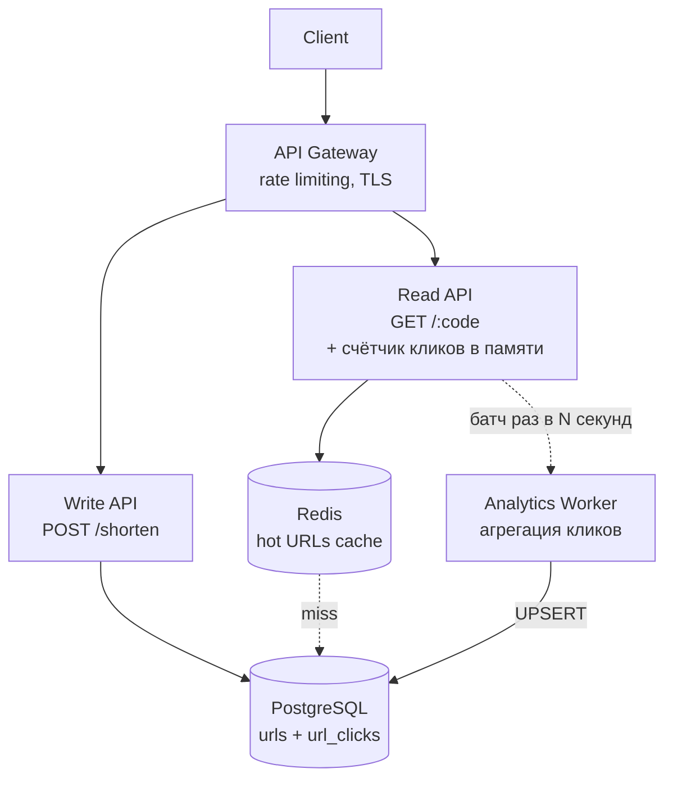

# URL Shortener

## Содержание

- [Фаза 1: Уточнение требований](#фаза-1-уточнение-требований)
- [Фаза 2: Оценка нагрузки](#фаза-2-оценка-нагрузки)
- [Фаза 3: Высокоуровневый дизайн](#фаза-3-высокоуровневый-дизайн)
- [Фаза 4: Deep Dive](#фаза-4-deep-dive)
- [Сквозные потоки](#сквозные-потоки)
- [Трейдоффы и альтернативы](#трейдоффы-и-альтернативы)
- [Масштабирование до 10x](#масштабирование-до-10x)
- [Interview-ready ответ (2 минуты)](#interview-ready-ответ-2-минуты)

Разбор задачи "Спроектируй URL Shortener (сервис сокращения ссылок)". Один из самых частых примеров на system design — чистый, хорошо ограниченный объём работы.

---

## Фаза 1: Уточнение требований

### Функциональные требования

```
Кандидат: Давайте уточню scope. Основные сценарии:
  1. Пользователь передаёт длинный URL → получает короткий (например, https://svc.io/abc123)
  2. Пользователь переходит по короткому URL → редирект на оригинальный

Вопросы:
  - Нужна ли кастомизация alias? ("https://svc.io/my-promo" вместо рандомного)
  - Нужен ли срок жизни ссылки (TTL/expiration)?
  - Нужна ли аналитика (click count, geo, device)?
  - Авторизация нужна для создания ссылок?
  - Аудитория глобальная или в пределах одного региона?
    (без этого нельзя понять, достижим ли заявленный p99 в принципе)
```

**Договорились (MVP scope):**
- Создать короткую ссылку (random alias, без кастомизации)
- Редирект по короткой ссылке
- TTL: ссылки живут 5 лет
- Аналитика: только click count (опционально, не blocking)
- Auth: публичный API для создания (rate limiting вместо авторизации)

**Out of scope:** кастомные alias, аналитика по geo/device, bulk creation, QR коды.

### Нефункциональные требования

```
- DAU: 100 млн пользователей
- Read/Write ratio: 100:1 (redirect >> create)
- Latency: redirect < 10ms p99 — это бюджет НА СТОРОНЕ СЕРВЕРА, в пределах
  региона. Сетевой RTT до пользователя в него не входит и не может входить
  (обоснование — в фазе 2)
- Availability: 99.9% (до 8.7 часов downtime в год)
- Durability: потеря ссылки недопустима
- Consistency: eventual OK для click count; strong для redirect (ссылка должна работать сразу)
- Geography: аудитория глобальная → одним регионом сквозную задержку не закрыть,
  нужны точки присутствия ближе к пользователю
```

---

## Фаза 2: Оценка нагрузки

```
DAU = 100 млн

Создание ссылок:
  100 млн × 0,1 в сутки = 10 млн ссылок/сутки
  10 млн / 86 400  ≈ 115 создан./с среднее
  пик ×3           ≈ 350 создан./с

Редиректы (100:1):
  10 млн × 100     = 1 млрд редиректов/сутки
  1 млрд / 86 400  ≈ 11 500 RPS среднее
  пик ×3           ≈ 35 000 RPS

Хранилище:
  Грубо: short_code (8 B) + long_url (200 B avg) + created_at + ttl + user_id ≈ ~250 B

  Честнее — с учётом того, как PostgreSQL физически раскладывает строку:
     23 B  заголовок кортежа + null-bitmap (выравнивается до 24)
      9 B  short_code — 8 ASCII-символов + 1 B varlena-заголовка
    204 B  long_url   — 200 символов + 4 B заголовка
                        (значения > 126 B получают 4-байтовый, а не 1-байтовый)
      3 B  padding до 8-байтовой границы перед timestamp'ами
     24 B  created_at (8) + expires_at (8) + user_id (8)
      4 B  item pointer в странице
    ─────
   ~265 B на строку

  10 млн/сутки × 365 × 5 лет = 18,25 млрд записей
  18,25 млрд × 265 B ≈ 4,9 TB за 5 лет — и это только heap, без индексов
```

На порядок вывода уточнение не влияет, но показывает, что «250 байт» — это не размер полей, а размер полей плюс служебные байты движка. Если `user_id` останется `NULL` (API публичный, авторизации нет), строка ужимается примерно до 257 B: `NULL` не занимает места в данных, а лишь отмечается битом в null-bitmap.

**Выводы:**
- Read-heavy (100:1) — **кеш критичен**
- 18,25 млрд строк, ~4,9 TB heap плюс сотни гигабайт индексов — это уже граница одного
  узла PostgreSQL. Шардирование по `short_code` планируется сразу, а не «когда-нибудь»
- 10 млн ссылок создаётся в сутки — столько же истекает. Cleanup обязан переваривать
  **~116 удалений/с**, иначе таблица растёт неограниченно
- Коллизии кода на таком объёме неизбежны — нужен не «генератор без коллизий»,
  а дешёвый retry
- Горизонтальное масштабирование read-пути обязательно, но **не из-за RPS** — ниже

### Почему одного сервера мало

По пропускной способности 35K RPS одного сервера хватает:

```
Один редирект = распарсить путь + GET в Redis + отдать 302 (тело пустое)

  CPU:     ~20-50 µs на запрос → одно ядро даёт 20-50K RPS
  Трафик:  35K × ~400 B ≈ 14 MB/s ≈ 110 Mbit/s — на 10GbE незаметно
  Redis:   35K GET/с — единицы процентов от одной ноды

Для сравнения: nginx отдаёт редиректы из map со скоростью 100K+ RPS.
```

Горизонтальное масштабирование нужно по трём другим причинам:

```
1. Доступность.
   Один инстанс — SPOF; 99.9% с ним недостижимы: выкатка, обновление ядра
   и отказ железа съедают весь бюджет.

2. Запас.
   35K — уже пик. При целевой загрузке 50-60% закладываемся на 60-70K,
   иначе всплеск, GC-пауза или деградация Redis пробивают p99.

3. География — решающая.
   Сквозные 10 мс из одной точки недостижимы физически:

     скорость света в волокне ≈ 200 000 км/с
     Москва → Берлин    ~1 600 км → RTT ≥ 16 мс
     Москва → Нью-Йорк  ~7 500 км → RTT ≥ 75 мс (на практике 100-120 мс)
```

Отсюда уточнение контракта: **`p99 < 10 мс` — серверная часть задержки внутри региона.** Сквозная для пользователя на другом континенте — сотни миллисекунд, и закрывается только точками присутствия (см. рост ×10).

---

## Фаза 3: Высокоуровневый дизайн



**API:**
```
POST /api/v1/shorten
Body: { "url": "https://very-long-url.com/..." }
Response: { "short_url": "https://svc.io/abc123ef" }

GET /{code}
Response: 301 Redirect → original URL
```

### Роль каждого компонента

Сквозная идея — **read/write skew 100:1**: путь чтения (redirect) и путь записи (create) разнесены, потому что у них разные требования и нагрузка (CQRS-мотив).

**API Gateway.**
*Зачем:* TLS-терминация, rate limiting (вместо авторизации для публичного create), маршрутизация.
*Почему отдельно:* create — публичный, его надо защищать от абуза, не нагружая бизнес-логику. Алгоритмы лимитирования — в кейсе [03. Rate Limiter](./03-rate-limiter.md) и [reliability-patterns / rate-limiting](../reliability-patterns/04-rate-limiting.md).

**Write API (`POST /shorten`).**
*Зачем:* генерирует short_code, пишет в PostgreSQL.
*Почему отдельно от Read:* запись редкая (~350/сек пик) и идёт прямо в БД; смешивать её с 35K RPS чтения незачем — масштабируются независимо.

**Read API (`GET /:code`).**
*Зачем:* критический путь — resolve short_code → long_url → редирект, цель p99 < 10 мс. Он же инкрементит счётчик клика в локальной памяти.
*Почему отдельно / stateless:* это 99% трафика; держим его тонким и горизонтально масштабируемым, всё состояние — в Redis/БД. Счётчики в памяти — единственное исключение, и оно намеренно недолговечно: потеря нескольких секунд кликов допустима.

**Analytics Worker.**
*Зачем:* принимает от подов агрегированные пачки кликов и делает `UPSERT` в `url_clicks`.
*Почему отдельно:* учёт кликов не должен ни задерживать редирект, ни писать в `urls` — таблицу, которая обслуживает чтение. Подробнее — в разделе про счётчик.

**Redis (hot URLs cache).**
*Зачем:* отдаёт горячие short_code за < 1 мс, снимая 80% трафика с БД (Zipf).
*Почему именно кеш:* без него 35K RPS бьют в PostgreSQL. Паттерн cache-aside и инвалидация — [caching / Redis as cache](../../06-databases/caching/01-redis-as-cache.md), [Redis](../../06-databases/database-systems-catalog/08-redis.md).

**PostgreSQL (source of truth).**
*Зачем:* durable-хранилище `code → url`, уникальность кода через unique-индекс.
*Почему реляционка и почему сразу с шардингом:* схема стабильна, нужен ACID на уникальность. При 18,25 млрд строк один узел уже неудобен, поэтому шардирование по `hash(short_code)` закладывается с самого начала — ключ поиска совпадает с ключом шардирования, и любой редирект попадает ровно в один шард. См. [postgresql / sharding](../../06-databases/database-systems-catalog/postgresql/12-sharding.md) и [indexes](../../06-databases/database-systems-catalog/postgresql/02-indexes.md).

---

## Фаза 4: Deep Dive

### Short Code Generation

Требования: уникальный, короткий, URL-safe.

**Почему именно 8 символов.** Алфавит Base62 (`[0-9A-Za-z]`) — чистый ASCII, поэтому длина в символах равна длине в байтах: те самые «8 B» в оценке хранилища. Саму длину выбираем не на глаз, а из допустимого числа коллизий на целевом объёме (18,25 млрд записей) по парадоксу дней рождения — `N² / (2 × 62^L)`:

| Длина | Пространство `62^L` | Заполнение | Ожидаемых коллизий за 5 лет |
|---|---|---|---|
| 6 | 5.68 × 10¹⁰ | **32%** | ~2.9 млрд — нерабочее |
| 7 | 3.52 × 10¹² | 0.52% | ~47 млн (≈0.3/сек) |
| **8** | **2.18 × 10¹⁴** | 0.008% | **~760 тыс. (≈0.4/час)** |
| 10 | 8.39 × 10¹⁷ | ~0 | ~200 за весь срок |

8 — минимальная длина, при которой retry остаётся редким фоновым событием. 7 символов формально «влезают», но дают на два порядка больше повторных вставок; 6 непригодны в принципе: при заполнении трети пространства генератор начинает постоянно попадать в занятые коды.

**Вариант 1: Base62 от ID**
```
characters = [0-9A-Za-z]  → 62 символа
8 символов → 62^8 = 218 триллионов комбинаций

Алгоритм:
  1. Получить auto-increment ID из БД (или distributed sequence)
  2. Перевести в Base62

Плюсы: детерминировано, нет коллизий
Минусы: ID предсказуем (можно перебрать), нужен центральный генератор ID
```

**Вариант 2: Random + collision check**
```
Алгоритм:
  1. Генерировать 8 случайных Base62 символов
  2. Проверить уникальность в БД
  3. При коллизии — повторить

Плюсы: непредсказуемость, нет централизации
Минусы: вероятность коллизии растёт с заполнением таблицы

  При 18,25 млрд записей (оценка из фазы 2, а не 1 млрд):
    на одну вставку:  1.8e10 / 2.18e14 ≈ 0.0084%
    всего за 5 лет:   N² / (2 × 62^8) ≈ (1.8e10)² / 4.4e14 ≈ 760 000 коллизий

  Это ~0.4 коллизии в час. Retry по unique-индексу справляется,
  но «коллизий практически нет» — неверная формулировка
```

**Вариант 3: Hash (MD5/SHA) + truncate**
```
short_code = base62(md5(long_url + salt))[:8]

Плюсы: детерминировано для одного URL (дедупликация)
Минусы: hash collision теоретически возможен, нужна проверка
```

**Выбор: Вариант 2 (Random)** — простота реализации, нет зависимости от централизованного ID. Пик создания — 350 запросов/с (не 35K, это пик редиректов), коллизия случается порядка раза в час и гасится retry на unique-индексе.

Если retry хочется убрать совсем — 10 символов вместо 8 увеличивают пространство в 3844 раза: ожидаемое число коллизий за те же 5 лет падает с ~760 000 до ~200. Цена — ссылка на два символа длиннее.

---

### База данных и схема

```sql
CREATE TABLE urls (
  short_code  VARCHAR(10)  NOT NULL,
  long_url    TEXT         NOT NULL,
  created_at  TIMESTAMPTZ  NOT NULL DEFAULT now(),
  expires_at  TIMESTAMPTZ  NOT NULL,
  user_id     BIGINT       -- nullable, для авторизованных пользователей
);

-- Один индекс на short_code: он же обеспечивает уникальность,
-- он же обслуживает redirect. Отдельный CREATE INDEX по той же колонке
-- был бы полным дублем: удвоенная стоимость записи и сотни лишних ГБ.
CREATE UNIQUE INDEX idx_urls_short_code ON urls (short_code);

CREATE INDEX idx_urls_expires_at ON urls (expires_at);  -- для cleanup job

-- Счётчик кликов — ОТДЕЛЬНОЙ таблицей, не колонкой в urls.
CREATE TABLE url_clicks (
  short_code   VARCHAR(10)  PRIMARY KEY,
  click_count  BIGINT       NOT NULL DEFAULT 0,
  updated_at   TIMESTAMPTZ  NOT NULL DEFAULT now()
);
```

**Четыре решения в этой схеме, которые стоит проговорить:**

```
1. Нет суррогатного id BIGSERIAL.
   Поиск идёт по short_code, код генерируется случайно — автоинкремент
   не используется нигде. На 18,25 млрд строк это лишние 8 байт в строке
   плюс целый индекс порядка сотен ГБ.

2. Не делаем covering index INCLUDE (long_url).
   Он убрал бы heap fetch на редиректе, но long_url в среднем 200 B:
   такой индекс на 18,25 млрд строк раздуется до размера самой таблицы,
   в память всё равно не поместится, а запись подорожает.
   Обычный unique-индекс дешевле — 80% редиректов и так не доходят
   до БД благодаря кешу.

3. click_count живёт в url_clicks, а не в urls.
   UPDATE на каждый клик порождает новую версию строки (MVCC).
   Держать это в таблице, которая обслуживает redirect, значит
   получить bloat и работу autovacuum прямо на горячем пути чтения.

4. created_at оставлен осознанно, а не «на всякий случай».
   TTL фиксированный (5 лет), поэтому created_at = expires_at − 5 лет,
   то есть колонка выводится из соседней. На 18,25 млрд строк она стоит
   8 B × 18.25e9 ≈ 146 ГБ. Держать её стоит, только если нужна
   аналитика по датам создания или TTL станет переменным.
```

Ещё три детали, заметные на этом объёме:

```
- TIMESTAMPTZ вопреки названию НЕ хранит таймзону: это те же 8 байт, что и
  TIMESTAMP (значение нормализуется в UTC, разворачивается в таймзону сессии).
  Выбор в его пользу бесплатен.

- NULL не занимает места в данных — только бит в null-bitmap. API публичный,
  поэтому user_id будет NULL почти везде: реально три последних поля весят
  16 байт вместо 24, то есть ~292 ГБ вместо ~438 ГБ на весь объём.

- Порядок колонок влияет на padding. Если сгруппировать 8-байтовые поля подряд,
  исчезают 3 байта выравнивания перед timestamp'ами — ещё ~55 ГБ.
```

**Почему PostgreSQL, а не NoSQL?**
- Данные структурированы, схема стабильна
- ACID нужен для уникальности short_code (уникальный индекс + retry при коллизии)
- Но 18,25 млрд строк на одном узле — это уже неудобно: heap ~4,9 TB плюс индексы.
  Шардирование по `hash(short_code)` закладывается сразу; ключ поиска совпадает
  с ключом шардирования, поэтому любой redirect идёт ровно в один шард
- Альтернатива при глобальном geo-распределении — DynamoDB/Cassandra: модель
  «ключ → значение» здесь ложится идеально, а транзакции нужны только на вставку

---

### Стратегия кеширования

**Что кешировать:** горячие URL (redirect path)

```
Cache key:   short_code
Cache value: long_url
TTL в кеше: min(URL expires_at, 24h)

Cache hit:  short_code → Redis → 301 Redirect (< 1ms)
Cache miss: short_code → Redis miss → PostgreSQL → заполнить кеш → 301 Redirect
```

**Cache invalidation:**
- При удалении/истечении URL → `DEL short_code` из Redis
- TTL-based expiry как safety net

**Размер кеша:**

Считать надо не от общего числа ссылок (из 18,25 млрд подавляющее большинство мертво), а от **рабочего множества** — уникальных кодов, к которым реально обращаются за сутки. Точной цифры в условии нет, поэтому допущение проговаривается вслух:

```
Допустим, за сутки трогают ~50 млн уникальных кодов
  (1 млрд редиректов, но с сильным перекосом на свежие и популярные ссылки)

Zipf: ~80% трафика дают ~20% из них → ~10 млн горячих кодов

Размер записи в Redis:
  ключ ~10 B + long_url ~200 B + накладные Redis ~80 B ≈ 290 B

  10 млн × 290 B ≈ 2,9 GB
```

Вывод меняет обоснование кластера: по памяти хватило бы **одной ноды**. Redis Cluster здесь нужен не ради объёма, а ради отказоустойчивости и распределения 35K RPS — это разные аргументы, и путать их не стоит.

**Холодный старт — отдельный риск.** При рестарте кеша 35K RPS уходят напрямую в PostgreSQL с таблицей на 18 млрд строк, и БД ложится:

```
1. Singleflight (request coalescing): параллельные промахи по ОДНОМУ коду
   схлопываются в один запрос к БД, остальные ждут его результат.
   Без этого популярная ссылка даёт тысячи одинаковых SELECT одновременно.

2. Постепенный прогрев: пускать в БД ограниченный поток
   (например, не более N запросов/с на шард), остальным — 503 с Retry-After.

3. Прогрев «топ-1000» бессмыслен при рабочем множестве в 10 млн ключей:
   кеш наполняется трафиком за минуты, и это нормальный путь.
```

---

### Redirect: 301 vs 302

```
301 Permanent Redirect:
  + Браузер кеширует → меньше нагрузки на сервер
  - Нельзя изменить URL после кеширования браузером
  - Аналитика не работает (браузер не обращается к нам)

302 Temporary Redirect:
  + Каждый переход проходит через нас → точная аналитика
  + Можно изменить destination URL
  - Больше нагрузки (нет browser cache)
```

**Ключевой аргумент — не аналитика, а TTL.** По требованиям ссылки живут 5 лет и затем удаляются. Но `301`, закешированный браузером, живёт практически вечно и переживает удаление записи: после истечения срока браузер продолжит редиректить на старый адрес, а сервис уже не сможет ни отозвать ссылку, ни показать «просрочено». Для сервиса с TTL и с потенциально вредоносным контентом (см. ниже) это неприемлемо: **отзыв ссылки обязан работать**.

**Выбор: 302.** Честная цена решения:

```
301 срезал бы заметную часть повторных переходов на стороне браузера —
то есть уменьшил бы те самые 35K RPS, ради которых строится Redis.

Выбирая 302, мы сознательно оставляем весь трафик у себя:
  + отзыв ссылки работает мгновенно
  + destination можно менять
  + click count считается точно
  - платим за это кешем и горизонтальным масштабированием read-пути
```

Замечание про аналитику само по себе слабое: в требованиях она помечена как «опционально, не blocking», поэтому обосновывать ею главное решение по трафику нельзя. Отзыв ссылки — можно.

---

### Click Counter (асинхронный)

**Кто вообще считает клик, если 80% редиректов уходят из Redis?** Считает приложение, а не хранилище. Read API обрабатывает каждый запрос независимо от того, откуда взялся `long_url` — кеш ускоряет чтение, но не прячет сам факт обращения. Поэтому попадание в кеш на учёт никак не влияет.

**Проблема:** при 35K RPS инкремент на каждый редирект — это write hotspot, куда бы его ни писали.

```
Наивно — событие на каждый клик:
  35 000 редиректов/с → 35 000 сообщений/с в очередь

  Работает, но создаёт поток, сопоставимый с основным трафиком,
  ради счётчика, которому точность не нужна.
```

**Решение: агрегировать в памяти пода, сбрасывать пачкой.**

```
Каждый под держит map[short_code]int64

  на редиректе:  counters[code]++       ← наносекунды, ничего не блокирует
  раз в 1-5 с:   отправить накопленное и очистить map

При 15 подах и 35K RPS:
  один под видит ~2 300 кликов/с,
  из-за Zipf они ложатся на заметно меньшее число уникальных кодов
  → один батч на под в секунду вместо 35 000 отдельных событий
```

Дальше два пути, и выбор зависит от того, нужна ли детальная аналитика:

```
Вариант A — сразу в БД (проще):
  батч → ОДИН UPSERT на весь батч в url_clicks
  Очередь не нужна вовсе. Достаточно, когда в scope только click count.

Вариант B — через очередь (гибче):
  батч → Kafka → Analytics Worker → url_clicks
  Оправдан, если позже понадобятся geo, device, referrer
  или отдельное хранилище под аналитику.
```

По требованиям в scope только click count, а geo/device вынесены за скобки — значит достаточно варианта A, и Kafka здесь пока избыточна. Если брать вариант B, очередь и батчинг — [message brokers / Kafka](../../07-message-brokers-and-streaming/01-kafka.md).

Сам UPSERT в обоих вариантах одинаков — **одна команда на весь батч**, а не по строке на код:

```sql
-- Два параметра независимо от размера батча:
-- массив кодов и массив накопленных счётчиков.
INSERT INTO url_clicks (short_code, click_count)
SELECT * FROM unnest($1::text[], $2::bigint[])
ON CONFLICT (short_code)
DO UPDATE SET click_count = url_clicks.click_count + EXCLUDED.click_count,
              updated_at  = now();
```

Многострочный `VALUES ($1,$2), ($3,$4), ...` тоже работает, но упирается в лимит PostgreSQL в 65 535 параметров на запрос (при двух на строку — около 32 тыс. строк) и заставляет перестраивать план под каждый размер батча. `unnest` от размера батча не зависит.

Сколько строк реально в батче:

```
35K кликов/с / 15 подов ≈ 2 300 кликов/с на под
за окно 1-5 с           ≈ 2 000-11 000 кликов

Уникальных КОДОВ меньше: Zipf концентрирует клики на популярных ссылках
→ примерно 1 000-3 000 строк в батче

Нагрузка на БД: ~15 транзакций/с (по одной на под)
вместо 35 000 инкрементов
```

Три детали, которые здесь легко упустить:

```
1. Сортировать батч по short_code перед записью.
   Два пода могут сбрасывать пересекающиеся наборы кодов. Без общего
   порядка блокировок это классический deadlock — тот же приём, что
   с сортировкой allocations по warehouse_id в кейсе 14.

2. Разбивать батч по шардам.
   urls шардирована по hash(short_code), значит url_clicks тоже.
   Один flush превращается в одну команду на каждый затронутый шард.

3. Отдельно тюнить autovacuum для url_clicks.
   UPSERT существующей строки создаёт новую версию: поток мёртвых
   кортежей здесь плотный, а таблица горячая и небольшая — ей нужен
   более агрессивный autovacuum, чем таблице urls.
```

Интервал сброса — регулируемый компромисс:

```
1 с:  счётчики свежее, больше транзакций,
      меньше схлопывания повторных кликов внутри окна
5 с:  втрое меньше транзакций, лучше дедупликация по одному коду,
      но при падении пода теряется до 5 секунд
```

Писать `UPDATE urls SET click_count += N` было бы ошибкой: MVCC создаст новую версию строки на каждый инкремент — в той самой таблице, которая обслуживает redirect. Получим bloat и autovacuum на горячем пути чтения. Отдельная таблица изолирует эту нагрузку. Тот же приём «буфер → периодический flush», что и view counter в [Avito-кейсе](./13-avito-classifieds.md).

**Цена решения:** при падении пода теряются клики, накопленные с последнего сброса — до нескольких секунд. Для счётчика это приемлемо, он и так объявлен eventual. Если бы по кликам считались деньги (реклама, партнёрские выплаты), понадобились бы durable-события с at-least-once и дедупликацией по идентификатору перехода — то есть вариант B, но уже обязательный, а не опциональный.

---

### Cleanup Expired URLs

Создаётся 10 млн ссылок в сутки — значит столько же истекает:

```
10 млн / 86 400 ≈ 116 удалений/с

Одна пачка LIMIT 10000 раз в сутки удаляет 10 тыс. вместо 10 млн
→ отставание в 1000×, таблица растёт неограниченно
```

Правильный вариант — цикл батчами, а не одна пачка:

```sql
-- Крутится непрерывно, пачками, с паузой между итерациями.
-- 116 строк/с — мизерная нагрузка, важен именно цикл.
DELETE FROM urls
WHERE short_code IN (
    SELECT short_code FROM urls
    WHERE expires_at < now()
    ORDER BY expires_at
    LIMIT 5000
);
-- повторять, пока затронуто > 0
```

**Почему не партиционирование по `expires_at`.** Замена `DELETE` на `DROP PARTITION` здесь не работает по двум причинам:

```
1. Чтение идёт по short_code, а не по времени → partition pruning не сработает:
   каждый redirect будет опрашивать все партиции.
2. В партиционированной таблице PostgreSQL уникальный индекс обязан включать
   ключ партиционирования → UNIQUE(short_code) станет UNIQUE(short_code, expires_at),
   что НЕ даёт глобальной уникальности кода.

Партиционировать имеет смысл по hash(short_code) — это совпадает с ключом
шардирования и сохраняет и pruning, и уникальность. Но TTL-удаление
такое партиционирование не ускоряет: остаётся батчевый DELETE.
```

Дополнительно `expires_at` стоит проверять **на чтении** (истёкшая ссылка → `410 Gone`), чтобы корректность не зависела от того, догнала ли джоба.

---

### Злоупотребление: главный риск публичной сокращалки

Создание объявлено публичным (rate limiting вместо авторизации), а значит сервис немедленно становится инструментом отмывания вредоносных ссылок: фишинговый адрес прячется за доверенным доменом `svc.io`, и почтовые фильтры видят уже нашу репутацию, а не адрес злоумышленника. Это не теоретический риск — на нём выгорели все публичные сокращалки, и на интервью вопрос задают почти всегда.

```
Проверка на создании:
  - блоклисты (Google Safe Browsing и аналоги) — синхронно, это единицы мс
  - запрет на приватные диапазоны и localhost (127.0.0.0/8, 10/8, 169.254/16)
    → иначе сокращалка превращается в SSRF-прокси
  - запрет рекурсии: сокращать ссылку на собственный домен

Проверка после создания:
  - асинхронная перепроверка по блоклистам (URL могли «испортить» позже)
  - реакция на abuse-репорты

Реакция на вредоносную ссылку:
  - мгновенный отзыв (за это и выбран 302, а не 301)
  - interstitial-страница «переход на внешний сайт» вместо прямого редиректа
    для подозрительных ссылок

Ограничение потока:
  - rate limit по IP и по API-ключу — см. кейс ./03-rate-limiter.md
  - репутация источника: аномальный всплеск создания с одного IP → капча/бан
```

Важное следствие для read-пути: отзыв должен добивать **и до кеша** — при бане ссылки нужен `DEL` в Redis, а не ожидание TTL.

---

## Сквозные потоки

**1. Создание ссылки.**
`POST /shorten` → Gateway (rate limit) → проверка URL по блоклистам и на приватные диапазоны → Write API генерирует Random Base62 → `INSERT` в PostgreSQL с unique-индексом (коллизия → retry, ~раз в час) → возврат `short_url`.
*Итог:* запись редкая (350/с в пике) и идёт прямо в source of truth; кеш не трогаем — он наполнится лениво при первом чтении.

**2. Редирект, попадание в кеш (горячий путь, ~80%).**
`GET /{code}` → Read API → Redis hit → `counters[code]++` в памяти пода → `302 Redirect` за < 1 мс.
*Итог:* основной трафик вообще не доходит до БД — за счёт этого держим p99 < 10 мс при 35K RPS. Клик при этом всё равно учтён: считает приложение, а не хранилище.

**3. Редирект, промах кеша.**
Redis miss → singleflight схлопывает параллельные промахи по одному коду в один запрос → PostgreSQL (unique-индекс по `short_code`, затем чтение строки) → проверка `expires_at` → `SET` в Redis с TTL → `302 Redirect`.
*Итог:* первый запрос холодного кода чуть дороже, дальше он становится горячим; БД видит только «длинный хвост» Zipf, а не тысячу одинаковых SELECT на популярную ссылку.

**4. Учёт кликов (вне критического пути).**
Под накапливает `map[short_code]int64` в памяти → раз в 1-5 секунд сбрасывает пачку → `UPSERT` в отдельную таблицу `url_clicks`.
*Итог:* 35K инкрементов/с превращаются в ~15 батчей/с (по одному на под); латентности редиректу это не добавляет и MVCC-мусора в `urls` не создаёт. Цена — потеря нескольких секунд кликов при падении пода, что для eventual-счётчика приемлемо.

**5. Отзыв вредоносной ссылки.**
Abuse-репорт или срабатывание блоклиста → пометка записи → `DEL` ключа в Redis → следующий переход получает `410 Gone`.
*Итог:* отзыв работает мгновенно именно потому, что выбран `302` — при `301` браузеры продолжали бы редиректить из своего кеша.

---

## Трейдоффы и альтернативы

| Решение | Принятое | Альтернатива | Когда выбирать альтернативу |
|---|---|---|---|
| Short code gen | Random Base62, 8 символов | Base62 от sequence ID; 10 символов | Sequence — если retry недопустим; 10 символов — если хочется убрать коллизии почти совсем |
| БД | PostgreSQL, шард по `hash(short_code)` | Cassandra/DynamoDB | Глобальное geo-распределение: модель «ключ → значение» ложится идеально |
| Индекс | Один unique по `short_code` | Covering `INCLUDE (long_url)` | Только если long_url короткий; на 200 B индекс раздувается до размера таблицы |
| Кеш | Redis | Memcached | Если нужны только simple KV без persistence |
| Redirect type | 302 | 301 | Если нет TTL и не нужен отзыв ссылки — тогда 301 срежет трафик браузерным кешем |
| Click counter | Агрегация в памяти пода → батч в `url_clicks` | Событие на каждый клик в очередь; колонка в `urls` | Очередь — если нужна детальная аналитика (geo, device) или клики монетизируются; колонка в `urls` — никогда при таком RPS (MVCC-bloat на read-critical таблице) |
| Cleanup TTL | Батчевый DELETE в цикле | `DROP PARTITION` по `expires_at` | Не применимо: чтение по `short_code` теряет pruning, а unique-индекс — глобальность |

---

## Масштабирование до 10x

```
Текущее: 35K RPS redirect
10x: 350K RPS redirect

Что меняется:
  - Read API: добавить реплики (stateless, легко)
  - Redis Cluster: добавить шарды — узкое место здесь RPS и сеть, не память
  - PostgreSQL: шардирование по hash(short_code) уже заложено → добавляем шарды;
    read replicas помогают только miss-пути
  - При 10x записи (3 500 создан./с): 116 → 1 160 удалений/с в cleanup,
    цикл батчей это выдержит, но за lag джобы нужно следить метрикой
  - CDN на edge: осторожно. Кешируя сам редирект, мы возвращаемся к проблеме 301 —
    отозванная ссылка продолжит работать до истечения edge-TTL.
    Допустимо только с коротким TTL и активной инвалидацией
```

**Про географию.** Рост ×10 по RPS чинится добавлением инстансов, а вот сквозная задержка — нет: она упирается в скорость света (см. фазу 2). Если аудитория глобальная, единственный способ приблизиться к 10 мс у пользователя — вынести обработку ближе к нему:

```
Вариант A: несколько регионов с полным стеком
  Ссылки иммутабельны (code → url не меняется), поэтому реплицировать
  их между регионами просто: конфликтов записи нет по определению.
  Создание — в домашнем регионе, чтение — из ближайшего.
  Цена: окно, в котором свежая ссылка ещё не доехала до дальнего региона.

Вариант B: edge-воркеры с кешем у CDN-провайдера
  Редирект отрабатывает на границе сети, промах идёт в ближайший регион.
  Цена: та же проблема отзыва, что и с 301 — нужен короткий TTL
  и явная инвалидация при бане ссылки.
```

Иммутабельность записи — главное, что делает мультирегион для этого сервиса дешёвым: в отличие от [Stock](./14-stock-inventory-service.md) или [Payment](./11-payment-system.md), здесь нечего согласовывать между регионами.

---

## Interview-ready ответ (2 минуты)

> "URL shortener — это сервис с сильным read/write skew: на 1 создание приходится 100 редиректов. Поэтому ключевые решения вокруг read path.
>
> Short code — 8 символов Base62 (62^8 = 218 трлн комбинаций), генерирую случайно и полагаюсь на unique-индекс. Коллизии не «почти невозможны»: на 18 млрд записей их будет порядка 760 тысяч за пять лет, то есть примерно раз в час — retry это закрывает, а 10 символов убрали бы почти совсем.
>
> Хранилище — PostgreSQL, ключ поиска и ключ шардирования совпадают (`short_code`), поэтому редирект всегда идёт ровно в один шард. 18 млрд строк, ~4,9 TB heap плюс индексы — шардирование закладываю сразу. Суррогатный `id` не завожу, он бы стоил ещё один индекс на этом объёме.
>
> Critical path: GET /{code} → Redis → при miss → PostgreSQL → заполнить кеш → 302. Цель — p99 < 10ms, Redis даёт < 1ms. Рабочее множество — порядка 10 млн горячих кодов, это ~3 GB, так что кластер нужен ради отказоустойчивости и RPS, а не ради объёма. На промахах — singleflight, иначе рестарт кеша уронит БД.
>
> Отдельно оговорю масштабирование read-пути: 35K RPS редиректов один сервер в принципе вытянул бы — это ~50 микросекунд CPU на запрос. Инстансов нужно несколько по другим причинам: SPOF и деплой без даунтайма, запас над пиком, и главное — география. Десять миллисекунд сквозной задержки из одной точки недостижимы, до другого континента только RTT будет под сотню миллисекунд. Поэтому 10 мс я трактую как серверный бюджет внутри региона, а глобально это закрывается точками присутствия.
>
> 302 вместо 301 — не ради аналитики, а ради отзыва: ссылки живут 5 лет и их надо уметь удалять, а 301 браузер кеширует навсегда. Плачу за это тем, что весь трафик остаётся у меня.
>
> Click count считает само приложение — кеш этому не мешает, потому что каждый запрос всё равно проходит через Read API. Инкремент идёт в память пода, раз в несколько секунд сбрасывается пачкой в отдельную таблицу: 35 тысяч инкрементов в секунду превращаются в полтора десятка батчей. Отдельная таблица, а не колонка в `urls`, чтобы не плодить версии строк в таблице редиректов. Цена — потеря пары секунд кликов при падении пода; для eventual-счётчика это нормально, а вот если бы клики монетизировались, понадобились бы durable-события с дедупликацией.
>
> Отдельно проговорю злоупотребление: публичная сокращалка — инструмент фишинга, поэтому блоклисты на создании, запрет приватных диапазонов и быстрый отзыв."
