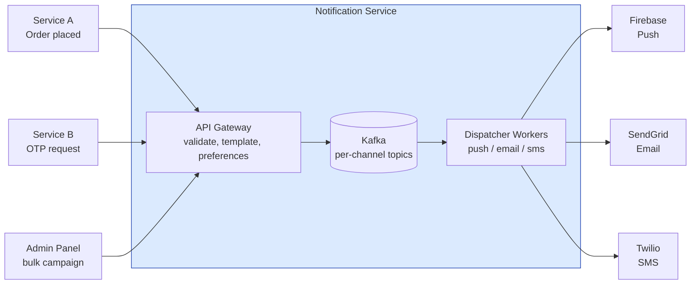

# Notification Service

Разбор задачи "Спроектируй систему уведомлений". Типична для компаний с мобильным приложением, e-commerce, финтехом. Проверяет знание очередей, fan-out, delivery semantics.

---

## Фаза 1: Уточнение требований

### Функциональные требования

```
Кандидат: Давайте уточню каналы и use cases.

Вопросы:
  - Какие каналы нужно поддерживать?
    → Push (iOS/Android), Email, SMS, in-app?
  - Уведомления транзакционные (OTP, подтверждение заказа) или маркетинговые (рассылки)?
  - Нужна ли шаблонизация сообщений? (переменные в тексте, локализация)
  - Нужно ли управление предпочтениями пользователя (opt-out)?
  - Нужна ли аналитика (delivered, opened)?
```

**Договорились (scope):**
- Каналы: Push (iOS + Android), Email, SMS
- Оба типа: транзакционные (немедленно) + маркетинговые (bulk, с расписанием)
- Шаблонизация: есть (переменные типа `{{user.name}}`, `{{order.id}}`)
- User preferences: пользователь может отключить отдельные каналы
- Delivery status: delivered/failed (opened — out of scope)

**Out of scope:** in-app уведомления, rich media (картинки в push), A/B testing контента, webhooks.

### Нефункциональные требования

```
- Транзакционные: latency < 5 сек end-to-end (OTP нужен быстро)
- Маркетинговые: могут ждать, но нужен throughput для 10M+ рассылки
- Delivery semantics: at-least-once (лучше дублировать, чем потерять)
- Idempotency: повторная отправка одного уведомления = одно сообщение пользователю
- Scale: 10M пользователей, 1M уведомлений/день в среднем
- High availability: 99.9%
```

---

## Фаза 2: Оценка нагрузки

```
Daily notifications = 1M
  Транзакционные: ~100K/day (OTP, order confirmations)
  Маркетинговые: ~900K/day (кампании)

Среднее:
  1M / 86400 ≈ 12 notifications/sec

Пиковая нагрузка (маркетинговая рассылка):
  Одна кампания на 1M пользователей за 1 час
  = 1M / 3600 ≈ 280 notifications/sec на каждый канал

Хранилище:
  Статус каждого уведомления: ~200 bytes
  1M/day × 365 × 3 года хранения = 1.1B записей ≈ 220 GB
  → Вполне управляемо

External provider rate limits:
  Firebase FCM: до 1000 msg/sec per project
  Twilio SMS: до 100 msg/sec по умолчанию
  SendGrid Email: до 600 emails/sec (paid tier)
  → Provider limits диктуют throughput, нужен backpressure
```

---

## Фаза 3: Высокоуровневый дизайн



### Роль каждого компонента

Сквозная идея — **fan-out по каналам, а не по пользователям**: у каждого провайдера свой rate limit и своя надёжность, поэтому каналы развязаны и троттлятся независимо.

**API Gateway.**
*Зачем:* валидация, рендеринг шаблона, проверка preferences и idempotency, затем fan-out в очереди.
*Почему отдельно:* единая точка входа для всех сервисов-источников; вся «дорогая» подготовка делается до постановки в очередь, воркеры получают уже готовое сообщение.

**Kafka (per-channel topics).**
*Зачем:* буфер между приёмом и доставкой; отдельный топик на канал + priority-топик для транзакционных + DLQ.
*Почему именно брокер с retention:* при недоступности провайдера сообщения копятся (retention 7 дней), а не теряются; replay и consumer groups из коробки. Выбор брокера — [brokers / comparison](../../07-message-brokers-and-streaming/07-comparison.md), профиль — [Kafka](../../07-message-brokers-and-streaming/01-kafka.md).

**Dispatcher Workers (push / email / sms).**
*Зачем:* читают свой топик, вызывают провайдера, троттлят под его лимит, ретраят, пишут статус.
*Почему по одному на канал:* лимиты разные (FCM 1000/сек, Twilio 100/сек) — общий воркер пришлось бы троттлить по худшему. Backpressure под лимиты — [reliability / backpressure & shedding](../reliability-patterns/05-backpressure-and-shedding.md), троттлинг — [rate-limiting](../reliability-patterns/04-rate-limiting.md).

**External providers (FCM / SendGrid / Twilio).**
*Зачем:* фактическая доставка в каналы; delivery receipts приходят вебхуками.
*Почему обёртка на воркере:* провайдеры нестабильны и имеют лимиты — изолируем retry/DLQ. Приём подтверждений — [protocols / webhooks](../../08-networking-and-api/protocols/06-webhooks.md).

**Redis (idempotency + preferences cache).**
*Зачем:* быстрый чек `idempotency_key` на горячем пути и кеш user-preferences (TTL 5 мин).
*Почему Redis:* проверка идемпотентности на каждом запросе должна быть sub-ms; механика — [reliability / idempotency](../reliability-patterns/06-idempotency.md), [Redis](../../06-databases/database-systems-catalog/08-redis.md).

**PostgreSQL (notification_log).**
*Зачем:* durable-статусы (QUEUED/SENT/DELIVERED/FAILED), unique `idempotency_key`, аналитика.
*Почему реляционка:* объёмы умеренные (~220 GB за 3 года), OLAP не нужен; unique-индекс — вторая линия идемпотентности после Redis.

---

## Фаза 4: Deep Dive

### Notification Pipeline

**Шаги обработки одного уведомления:**

```
1. Входящий запрос:
   POST /notifications
   {
     "type": "order_confirmed",
     "user_id": 12345,
     "template_id": "order-confirm-v2",
     "variables": { "order_id": "ORD-789", "amount": "4200 RUB" },
     "channels": ["push", "email"],         // или берём из user preferences
     "idempotency_key": "order-789-confirm"
   }

2. Validation:
   - user_id существует?
   - template_id существует?
   - Каналы активны для данного пользователя? (проверка preferences)

3. Template rendering:
   "Ваш заказ {{order_id}} на сумму {{amount}} подтверждён"
   → "Ваш заказ ORD-789 на сумму 4200 RUB подтверждён"

4. Idempotency check:
   - Проверить idempotency_key в Redis (TTL 24h)
   - Если ключ уже есть → вернуть cached response, не отправлять повторно

5. Fan-out в очереди:
   Для каждого канала → отдельное сообщение в Kafka:
   topic: notifications.push   → { user_id, rendered_body, device_tokens }
   topic: notifications.email  → { user_id, rendered_html, recipient_email }

6. Channel workers читают из своих топиков
   → вызывают external provider
   → обновляют статус в DB
```

---

### Kafka топики и партиционирование

```
Топики:
  notifications.push    (10 партиций)
  notifications.email   (10 партиций)
  notifications.sms     (5 партиций)
  notifications.dlq     (dead letter queue — ошибки после N retries)

Partition key = user_id:
  - Гарантирует ordering для одного пользователя
  - Равномерное распределение (если нет hotspot users)

Consumer groups:
  push-workers:  10 воркеров (по 1 на партицию)
  email-workers: 10 воркеров
  sms-workers:   5 воркеров
```

---

### Retry и Dead Letter Queue

**Логика retry для transient errors (5xx от провайдера, timeout):**

```
Попытка 1: немедленно
Попытка 2: через 30 сек (exponential backoff)
Попытка 3: через 5 мин
Попытка 4: через 30 мин
После 4-й: → DLQ + alert + статус = FAILED

Permanent errors (4xx — неверный токен, невалидный email):
  → сразу в DLQ, не retry
  → пометить device token как inactive (для push)
```

**DLQ обработчик:**
- Алертинг инженерам на необычный объём
- Manual replay или skip
- Анализ причин для мониторинга

---

### User Preferences

```sql
CREATE TABLE user_notification_preferences (
  user_id     BIGINT NOT NULL,
  channel     VARCHAR(20) NOT NULL,  -- 'push', 'email', 'sms'
  category    VARCHAR(50) NOT NULL,  -- 'transactional', 'marketing', 'security'
  enabled     BOOLEAN NOT NULL DEFAULT true,
  updated_at  TIMESTAMP NOT NULL,
  PRIMARY KEY (user_id, channel, category)
);
```

**Кеш preferences:**
```
Redis: HGETALL prefs:{user_id}
TTL: 5 минут (preferences меняются редко)

При изменении settings → invalidate cache немедленно
```

**Важно:** транзакционные (OTP, security alerts) нельзя отключить. Проверять в validation layer до сохранения в очередь.

---

### Транзакционные vs Маркетинговые

```
Транзакционные (OTP, confirmations):
  - Высокий приоритет → отдельный Kafka топик (notifications.priority)
  - Воркеры с меньшим батчингом → ниже latency
  - No rate limiting throttling

Маркетинговые (campaigns):
  - Low priority топик
  - Throttling: не более X msg/sec на провайдера
  - Scheduled: "отправить в 10:00 по timezone пользователя"
  - Unsubscribe link обязателен (CAN-SPAM, GDPR)
```

---

### Scheduled Notifications

```
Сценарий: кампания "отправить 1M пользователям в 10:00 UTC+3"

Подход: delayed message scheduling

1. Admin создаёт кампанию:
   { campaign_id, template_id, audience_segment_id, schedule_time }
   → сохранить в PostgreSQL, статус = SCHEDULED

2. Scheduler job (cron каждую минуту):
   SELECT * FROM campaigns WHERE schedule_time <= NOW() AND status = 'SCHEDULED'
   → статус = PROCESSING
   → начать fan-out: загрузить audience (user IDs из segment)
   → push сообщения в Kafka батчами по 1000

3. Throttling:
   Kafka consumer worker проверяет token bucket:
   "не более 500 email/sec через SendGrid"
   → при превышении → sleep → продолжить
```

---

### Delivery Status Tracking

```sql
CREATE TABLE notification_log (
  id              BIGINT GENERATED ALWAYS AS IDENTITY,
  idempotency_key VARCHAR(128) UNIQUE,
  user_id         BIGINT NOT NULL,
  channel         VARCHAR(20) NOT NULL,
  template_id     VARCHAR(100),
  status          VARCHAR(20) NOT NULL,  -- QUEUED/SENT/DELIVERED/FAILED
  provider_msg_id VARCHAR(256),          -- ID от FCM/SendGrid/Twilio
  error_message   TEXT,
  created_at      TIMESTAMP NOT NULL DEFAULT NOW(),
  updated_at      TIMESTAMP NOT NULL DEFAULT NOW()
);
```

**Delivery confirmation:**
- Email (SendGrid): webhook `delivered` event → UPDATE status
- Push (FCM): response при отправке + webhook для confirmation
- SMS (Twilio): webhook delivery receipt

---

### Что если провайдер недоступен?

```
FCM недоступен 30 минут:
  - Retry с exponential backoff
  - Сообщения накапливаются в Kafka (retention = 7 дней)
  - Alert инженерам при lag > 10000 сообщений
  - При восстановлении FCM → воркеры продолжат автоматически
  - Transactional OTP: уведомить через SMS как fallback (если настроено)
```

---

## Сквозные потоки

**1. Транзакционное уведомление (OTP / подтверждение).**
`POST /notifications` → валидация + рендер шаблона → idempotency-чек в Redis → fan-out в priority-топик → priority-воркер (минимальный батчинг) → провайдер → статус SENT.
*Итог:* OTP не застревает за маркетинговым батчем; end-to-end < 5 сек.

**2. Маркетинговая кампания по расписанию.**
Admin создаёт кампанию (SCHEDULED в PostgreSQL) → Scheduler (cron) в `schedule_time` загружает аудиторию → пушит в Kafka батчами по 1000 → воркеры троттлят под лимит провайдера (token bucket).
*Итог:* миллионная рассылка не превышает лимиты провайдера и не вытесняет транзакционные.

**3. Сбой провайдера и retry.**
Воркер получает 5xx/timeout → exponential backoff (30 сек → 5 мин → 30 мин) → после N попыток в DLQ + alert. Permanent 4xx (битый токен) → сразу DLQ, токен помечается inactive.
*Итог:* сообщения копятся в Kafka, а не теряются; при восстановлении провайдера воркеры досылают автоматически.

**4. Подтверждение доставки.**
Провайдер шлёт вебхук `delivered` → обновляем `notification_log` (SENT → DELIVERED).
*Итог:* статус eventual-consistent через вебхуки, горячий путь отправки им не нагружается.

---

## Трейдоффы

| Решение | Принятое | Альтернатива | Причина |
|---|---|---|---|
| Queue | Kafka | SQS/RabbitMQ | Replay, retention, consumer groups |
| Fan-out | По каналам | По пользователям | Независимый throttling для каждого провайдера |
| Idempotency | Redis + idempotency_key | DB уникальный индекс | Redis быстрее для check на hot path |
| Scheduling | Cron + DB | Kafka delayed messages | Проще, легко мониторить |
| Status tracking | PostgreSQL | ClickHouse | Достаточен для аналитики, не нужен OLAP |

---

## Interview-ready ответ (2 минуты)

> "Notification service — это fan-out система с несколькими каналами и сильно разными нагрузками: транзакционные требуют latency < 5 сек, маркетинговые — throughput для миллионных рассылок.
>
> Ключевая архитектура: API принимает запрос, рендерит шаблон, проверяет idempotency через Redis, затем fan-out в Kafka — отдельный топик для каждого канала. Это позволяет независимо масштабировать и throttle каждый канал под лимиты провайдера.
>
> Отдельный высокоприоритетный топик для транзакционных — чтобы OTP не застрял за батчем маркетинговой рассылки.
>
> Retry с exponential backoff, после N попыток → DLQ. Permanent errors (невалидный токен) — сразу в DLQ без retry.
>
> User preferences в PostgreSQL, кешированы в Redis с TTL 5 минут. Транзакционные уведомления нельзя отключить — это проверяется до постановки в очередь."
