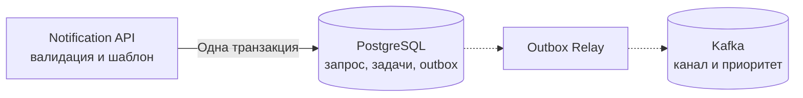
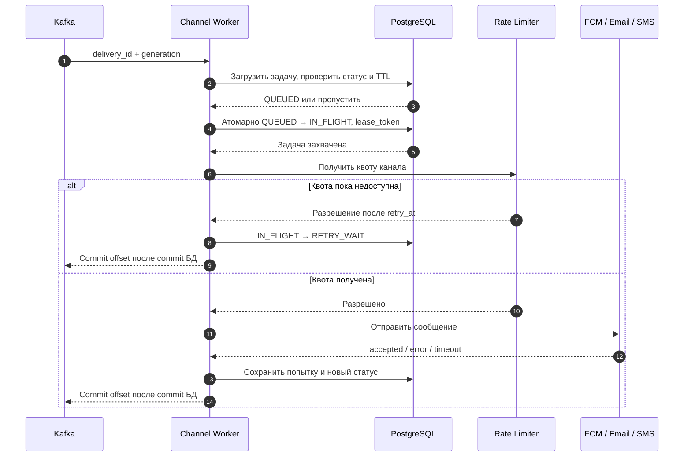
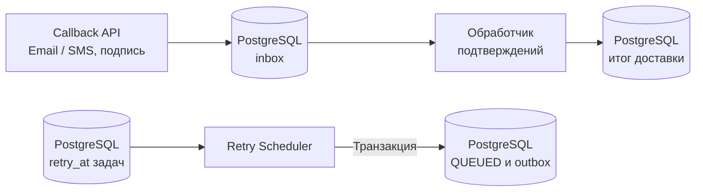

# Notification Service

## Содержание

- [Фаза 1: Уточнение требований](#фаза-1-уточнение-требований)
- [Фаза 2: Оценка нагрузки](#фаза-2-оценка-нагрузки)
- [Фаза 3: Высокоуровневый дизайн](#фаза-3-высокоуровневый-дизайн)
- [Фаза 4: Deep Dive](#фаза-4-deep-dive)
- [Сквозные потоки](#сквозные-потоки)
- [Трейдоффы](#трейдоффы)
- [Failure Scenarios и наблюдаемость](#failure-scenarios-и-наблюдаемость)
- [Interview-ready ответ (2 минуты)](#interview-ready-ответ-2-минуты)
- [Официальные источники](#официальные-источники)

Сервис уведомлений принимает бизнес-событие, выбирает разрешённые каналы и доставляет сообщение через внешних провайдеров. Главная сложность — сохранить принятую работу, не забить срочные сообщения массовой рассылкой и правильно обработать ситуацию «провайдер, возможно, отправил, но мы не получили ответ».

Для разбора используем Push, Email и SMS. Числа нагрузки и внутренние лимиты — учебные допущения, а ограничения конкретных API сверяем с документацией.

---

## Фаза 1: Уточнение требований

### Функциональные требования

Уточняем:

- Какие каналы нужны: Push для iOS/Android, Email, SMS, in-app?
- Какие категории отправляем: OTP, подтверждения заказов, security alerts, маркетинг?
- Нужны ли шаблоны, локализация, пользовательские предпочтения и расписание?
- Что считать успехом: приём провайдером, доставку устройству или прочтение?
- Допустимы ли повтор сообщения и переключение на резервный канал?

**Границы задачи:**

- Push через FCM, включая доставку на Apple-устройства через APNs, Email через SendGrid, SMS через Twilio.
- Транзакционные уведомления с высоким приоритетом и маркетинговые кампании, в том числе по расписанию.
- Версионируемые шаблоны, переменные, локаль и настройки категорий/каналов.
- Приём статусов от провайдеров там, где они доступны; статусы отдельных попыток и доставок.
- Кампании до 10 млн получателей; расчёт ниже сначала для 1 млн.

In-app, rich media, A/B testing, аналитика открытий и исходящие webhooks для клиентов не входят в scope. Входящие callbacks провайдеров входят: без них нельзя реализовать заявленное отслеживание Email/SMS.

### Что именно считаем уведомлением

| Сущность | Пример | Зачем различать |
|---|---|---|
| Бизнес-запрос | Подтверждение заказа ORD-789 для пользователя | Дедупликация повторов вызывающего сервиса |
| Задача доставки | Email на один адрес или push на одно устройство | Собственные срок жизни, состояние и политика повторов |
| Попытка | Один вызов SendGrid для этой задачи | Провайдерский ID, timeout и результат могут отличаться при повторах |
| Кампания | Один шаблон для миллиона пользователей | Массовое создание задач с прогрессом и отменой |

Один запрос с push и email, если у пользователя два устройства, может дать три задачи доставки. Поэтому «уведомления/с», «API-вызовы/с» и «SMS-сегменты/с» — разные величины.

### Нефункциональные требования

| Параметр | Допущение или целевой показатель |
|---|---|
| Пользователи | 10 млн |
| Обычный день без большой кампании | 1 млн задач доставки: 100 тыс. транзакционных и 900 тыс. маркетинговых |
| Срочные сообщения | p99 от надёжного приёма до подтверждения приёма провайдером менее 5 секунд в штатном режиме |
| Кампании | Срок оцениваем по канальным квотам и объёму, не обещаем всем отправку ровно в одну секунду |
| Доступность API приёма | 99,9%; при ошибке вызывающий сервис повторяет с тем же ключом |
| Обработка внутри системы | At-least-once с идемпотентными изменениями состояния |
| Доставка пользователю | Возможны потеря на стороне внешнего канала и дубли; exactly-once не обещаем |
| Срок жизни | Для примера OTP — 2 минуты, маркетинговой задачи — 24 часа от планового старта |

Отдельно измеряем время до фактической доставки там, где канал даёт подтверждения. Смартфон может быть офлайн, почтовый сервер — задерживать письмо: наш SLO приёма провайдером не гарантирует end-to-end доставку за 5 секунд.

Входная идемпотентность означает «один бизнес-запрос создаёт один набор задач». Она не означает «пользователь гарантированно видит сообщение ровно один раз». Политика ambiguous outcome — неизвестного результата внешнего вызова — зависит от категории уведомления.

---

## Фаза 2: Оценка нагрузки

### Фон и кампания

```text
Обычный день:
    1 000 000 / 86 400 ≈ 11,57 задач/с
    транзакционные: 100 000 / 86 400 ≈ 1,16 задач/с

Кампания на 1 млн получателей:
    по одному push-устройству и одному email на человека
    1 млн × 2 канала = 2 млн задач сверх обычного дня

Кампания на 10 млн получателей:
    при тех же условиях = 20 млн задач
```

Среднее не определяет пиковый поток OTP, число устройств и частоту повторов. Эти параметры уточняем отдельно. Не отправляем миллион ID одним Kafka-сообщением: генератор аудитории создаёт ограниченные батчи и регулирует скорость постановки задач.

### Реальные квоты и расчётные лимиты

Нельзя принимать «FCM 1000/с, SendGrid 600/с, Twilio 100/с» за универсальные тарифные ограничения. У FCM HTTP v1 квота downstream относится к проекту и минутному окну; документация указывает базовые 600 тыс. сообщений/мин. Это не разрешение отправлять любой burst с такой средней скоростью. У Twilio throughput зависит от отправителя, назначения и конфигурации, а SMS учитывается в сегментах. Лимит API-запросов и скорость фактической отправки — тоже разные ограничения. См. [FCM quotas](https://firebase.google.com/docs/cloud-messaging/throttling-and-quotas) и [Twilio scaling](https://www.twilio.com/docs/messaging/guides/best-practices-at-scale).

Для арифметики примем согласованные внутренние бюджеты: Push — 1000 сообщений/с, Email — 600 сообщений/с, SMS — 100 сегментов/с. Это допущения для проекта, которые нужно подтвердить договорённостями, конфигурацией аккаунта и замерами.

| Канал | Нижняя оценка на 1 млн сообщений без резерва | Если bulk получает 80% бюджета |
|---|---|---|
| Push | `1 000 000 / 1000 = 1000 с` ≈ 16 мин 40 с | `1 000 000 / 800 = 1250 с` ≈ 20 мин 50 с |
| Email | `1 000 000 / 600 ≈ 1667 с` ≈ 27 мин 47 с | `1 000 000 / 480 ≈ 2083 с` ≈ 34 мин 43 с |
| SMS, один сегмент | `1 000 000 / 100 = 10 000 с` ≈ 2 ч 47 мин | `1 000 000 / 80 = 12 500 с` ≈ 3 ч 28 мин |

SMS здесь — отдельный сценарий сравнения, он не включён в кампанию push + email. При среднем размере в два сегмента время SMS удваивается. Для кампании на 10 млн эти оценки увеличиваются в 10 раз: SMS даже без резерва потребует около 27,8 часа и не уложится в принятый TTL 24 часа. Нужно уменьшить аудиторию, изменить срок или получить большую пропускную способность.

Таблица предполагает постоянную достижимую скорость, без ошибок, другого трафика и задержек подготовки. При параллельной работе каналов срок кампании определяет самый медленный канал, а не сумма их времён. Быстрый ответ API провайдера может лишь поставить сообщение в его внутреннюю очередь.

### Воркеры, очередь и хранение

**Параллелизм по закону Литтла.** Если целевые 600 Email-вызовов/с занимают в среднем 0,2 секунды каждый и один вызов отправляет одно письмо, нужны примерно `600 × 0,2 = 120` одновременных вызовов. Это пример средней занятости; запас определяем по разбросу задержек и нагрузочному тесту. 120 — число запросов в полёте, а не Kafka-партиций или отдельных процессов.

**Рост очереди.** Если в один канал ставят 5000 задач/с, а исполняют 500/с, очередь растёт на 4500/с. Буфер может пережить конечный burst, но постоянное превышение делает систему неустойчивой. Ограничиваем fan-out кампаний, следим за возрастом задач и прогнозом завершения.

```text
История без дополнительных крупных кампаний:
    1 млн задач/сутки × 365 × 3 = 1,095 млрд задач
    при условных 200 B на запись статуса → 219 GB

Если дополнительно запускаем одну кампанию push + email на 1 млн в месяц:
    2 млн задач × 12 × 3 = 72 млн дополнительных задач
    72 млн × 200 B = 14,4 GB
    итого 233,4 GB логических записей статуса за 3 года
```

200 B не включают полные тела, индексы, попытки, callbacks, outbox, WAL и реплики. Это не размер всей БД и не доказательство «точно помещается на один сервер». PostgreSQL — разумная отправная точка, но проверяем пиковые транзакции, размер рабочего набора и время восстановления. Старые статусы архивируем по срокам хранения; тяжёлую аналитику при необходимости выносим отдельно.

---

## Фаза 3: Высокоуровневый дизайн

**1. Надёжный приём.** Бизнес-сервис или планировщик передаёт небольшой запрос. Notification API сохраняет задачи и outbox в одной транзакции; `202 Accepted` означает, что работа зафиксирована. Relay публикует её в Kafka асинхронно.



**2. Отправка.** Схема показывает один канал; Push, Email и SMS имеют отдельные очереди и пулы. Внутри канала транзакционный трафик и bulk делят общий провайдерский бюджет с резервом для срочных задач.



Если БД вернула уже завершённую задачу или старое `generation`, worker не захватывает её и подтверждает Kafka-сообщение без внешнего вызова. При отсутствии квоты задача переходит в `RETRY_WAIT`, поэтому consumer не держит сообщение и аренду до освобождения лимита. Ответ провайдера может дать `ACCEPTED`, известную ошибку или `UNKNOWN` при неоднозначном timeout; Kafka offset фиксируется только после сохранения результата в БД. Возврат `RETRY_WAIT` в очередь показан на следующей схеме.

**3. Подтверждения и повторы.** Две независимые дорожки: сверху принимаем callbacks, снизу выбираем созревшие повторы. Ожидание retry не блокирует отправляющие воркеры, а его запуск не зависит от прихода callback.



PostgreSQL в этих схемах — одно логическое хранилище, показанное в разных ролях; Kafka — набор топиков. Новую запись retry-outbox публикует тот же relay, что на первой схеме. Callback API сначала надёжно сохраняет событие в inbox, затем отвечает провайдеру; обработчик обновляет состояние независимо. Для Push нельзя автоматически перенести модель Email/SMS callbacks — различия разобраны ниже.

### Роль каждого компонента

| Компонент | Роль и причина выделения |
|---|---|
| API Gateway | Аутентификация источника, лимит запросов, маршрутизация; бизнес-валидацию выполняет Notification API |
| Notification API | Шаблоны, локаль, входная идемпотентность, создание запросов и задач с outbox |
| PostgreSQL | Источник истины для задач, прогресса кампаний, предпочтений, попыток и принятых callback-событий |
| Outbox Relay | Публикует зафиксированные задачи в брокер; сбой допускает повтор, а не потерю между БД и Kafka |
| Kafka | Разделяет каналы/классы, буферизует burst и позволяет повторить обработку |
| Channel Workers | Захватывают задачи, проверяют актуальность, вызывают провайдера и сохраняют результат |
| Redis | Общие rate limiters и кеши; не единственный источник входной идемпотентности |
| Scheduler | Разворачивает кампании и повторно ставит созревшие retry-задачи; имеет ограниченный темп работы |
| Callback API / обработчик | Проверяют источник, сохраняют подтверждения и согласуют их с попытками отправки |

Fan-out происходит и по аудитории, и по каналам/устройствам. Это не взаимоисключающие варианты. Отдельный канал означает отдельный пул, а не единственный воркер. Выбор Kafka оправдан при существующей инфраструктуре и потребности в replay; при этой нагрузке [другой брокер](../../07-message-brokers-and-streaming/00-comparison.md) или [задачи в БД](../../04-architecture-and-patterns/patterns/12-db-backed-jobs.md) могут быть проще.

---

## Фаза 4: Deep Dive

### Notification Pipeline и входная идемпотентность

```json
{
    "type": "order_confirmed",
    "user_id": 12345,
    "template_id": "order-confirm-v2",
    "variables": { "order_id": "ORD-789", "amount": "4200 RUB" },
    "channels": ["push", "email"],
    "idempotency_key": "order-789-confirm"
}
```

1. Gateway аутентифицирует источник. Для известного ключа API сравнивает содержимое и возвращает прежний результат без повторного выбора каналов. Для нового запроса проверяет право отправлять категорию, получателя, структуру переменных и существование версии шаблона; гонку параллельных новых запросов закрывает UNIQUE в шаге 3.
2. API проверяет предпочтения и выбирает адресатов. Шаблон `Ваш заказ {{order_id}} на сумму {{amount}} подтверждён` даёт `Ваш заказ ORD-789 на сумму 4200 RUB подтверждён`. Для HTML переменные экранируются, версии шаблона и локали фиксируются.
3. В транзакции создаётся запрос с уникальным `(source_id, idempotency_key)`, канальные задачи и outbox-события. Каждая задача получает стабильный `delivery_id`; каждый push-target — отдельную задачу. Повтор ключа возвращает прежний запрос, а другое содержимое с тем же ключом — конфликт.
4. После commit возвращаем `202` и `request_id`. Relay отправляет в Kafka `delivery_id` и поколение постановки. Данные задачи и ссылка на подготовленное тело лежат в БД/защищённом хранилище; в брокер не обязательно копировать адреса и OTP.
5. Воркер повторно проверяет срок жизни, статус, отмену и разрешение отправки. Затем захватывает задачу, получает квоту, отправляет и сохраняет результат попытки.

Хэш входного payload считают по каноническому содержимому запроса, а не по текущим preferences или меняющемуся шаблону. При повторе возвращается ранее принятый набор задач. Если все каналы запрещены, запрос всё равно получает результат: задачи помечаются `SUPPRESSED`, а не исчезают без объяснения.

Бизнес-сервис тоже должен надёжно связать своё событие с запросом уведомления: например, сохранить «заказ подтверждён» и собственный outbox одной транзакцией. Notification Service не восстановит запрос, который источник потерял до обращения к API.

**Почему одного SET NX недостаточно.** `SET idem:{key} request_id NX EX 86400` атомарно устраняет гонку двух запросов, но не связывает claim с отправкой в Kafka. После claim процесс может упасть: повтор увидит занятый ключ, хотя задачи нет. Или запись в брокер пройдёт частично по каналам. В нашем решении источником истины служат уникальный ключ и транзакция БД; Redis может кешировать только уже зафиксированный результат. См. [идемпотентность](../reliability-patterns/06-idempotency.md).

**Outbox.** Relay помечает запись опубликованной только после подтверждения брокера. При падении после publish и до отметки событие повторится; воркер проверяет `delivery_id`, поколение и состояние. Для Kafka конфигурируем надёжное подтверждение и репликацию, например RF=3, `acks=all`, `min.insync.replicas=2`; offset consumer фиксируется после долговечного результата или решения о retry. [Kafka delivery semantics](https://kafka.apache.org/41/design/design/) не распространяют exactly-once на вызов SMS-провайдера.

**Срок дедупликации.** Он должен покрывать заявленное окно повторов источника. Для кампаний ключи получателей сохраняем до завершения и конца допустимого replay; TTL в одни сутки не защищает кампанию, повторно запущенную через неделю. Тела, ключи идемпотентности и метаданные статусов могут иметь разные сроки хранения.

### Модель данных и состояний

Упрощённая схема без таблиц попыток, inbox и outbox:

```sql
CREATE TABLE notification_requests (
    request_id BIGINT GENERATED ALWAYS AS IDENTITY PRIMARY KEY,
    source_id TEXT NOT NULL,
    idempotency_key TEXT NOT NULL,
    payload_hash TEXT NOT NULL,
    user_id BIGINT NOT NULL,
    template_version TEXT NOT NULL,
    created_at TIMESTAMPTZ NOT NULL DEFAULT now(),
    UNIQUE (source_id, idempotency_key)
);

CREATE TABLE deliveries (
    delivery_id BIGINT GENERATED ALWAYS AS IDENTITY PRIMARY KEY,
    request_id BIGINT NOT NULL REFERENCES notification_requests(request_id),
    channel TEXT NOT NULL,
    target_key TEXT NOT NULL,
    status TEXT NOT NULL,
    generation BIGINT NOT NULL DEFAULT 0,
    attempt_count INTEGER NOT NULL DEFAULT 0,
    next_attempt_at TIMESTAMPTZ,
    expires_at TIMESTAMPTZ NOT NULL,
    lease_until TIMESTAMPTZ,
    lease_token UUID,
    updated_at TIMESTAMPTZ NOT NULL DEFAULT now(),
    UNIQUE (request_id, channel, target_key)
);

CREATE INDEX idx_deliveries_retry_due
ON deliveries (next_attempt_at, delivery_id)
WHERE status = 'RETRY_WAIT';
```

`target_key` — стабильный внутренний ID адресата/устройства для этой задачи, а не открытый email в ключах логов. Снимок адреса, ссылка на тело, категория и политика повторов — дополнительные поля рабочей модели. Перед отправкой проверяем, что target всё ещё принадлежит пользователю и активен; устаревший токен не должен стать отправкой другому получателю.

Уникальность только по ключу запроса ломает fan-out. Уникальность по запросу и каналу тоже недостаточна для двух push-устройств. Провайдерский ID хранится в `delivery_attempts`: одна задача может иметь несколько попыток и несколько внешних ID. Для callbacks нужен индекс по `(provider, provider_account, provider_msg_id)`, а не по внешнему ID без контекста.

| Состояние задачи | Значение |
|---|---|
| `QUEUED` | Готова к отправке, событие в outbox/брокере |
| `IN_FLIGHT` | Захвачена воркером, есть ограниченная по времени аренда |
| `RETRY_WAIT` | Повтор назначен на `next_attempt_at` |
| `ACCEPTED` | Провайдер подтвердил приём; доставка ещё не доказана |
| `DELIVERED` | Получено доступное для канала подтверждение, с сохранением его точного смысла |
| `UNKNOWN` | Внешний вызов мог сработать, достоверного ответа нет |
| `FAILED` | Окончательная известная ошибка либо исчерпаны разрешённые повторы без подтверждённого приёма |
| `EXPIRED` | Срок отправки истёк до начала следующей попытки |
| `SUPPRESSED` / `CANCELED` | Отправку запретила политика или отменили |

Отсутствие receipt после `ACCEPTED` не означает `FAILED`: отдельно отражаем неизвестность подтверждения доставки. Если нужно агрегировать результат запроса, показываем статусы его задач, например «email delivered, push accepted».

Для партиционирования истории по дате отдельно продумываем глобальную дедупликацию: PostgreSQL требует включать ключ партиционирования в ограничение уникальности партиционированной таблицы. Нельзя механически перенести текущие `UNIQUE` в помесячные партиции. Возможный вариант — отдельный реестр ключей и активных задач, архив истории отдельно. См. [PostgreSQL partitioning limitations](https://www.postgresql.org/docs/current/ddl-partitioning.html#DDL-PARTITIONING-DECLARATIVE-LIMITATIONS).

### Kafka: каналы, приоритеты и порядок

```text
Топики (числа партиций — пример для обсуждения):
    notifications.push.tx       10    notifications.push.bulk       10
    notifications.email.tx      10    notifications.email.bulk      10
    notifications.sms.tx         5    notifications.sms.bulk         5
    notifications.dlq                 диагностические события

Consumer groups:
    отдельная группа на канал и класс: push-tx, push-bulk, ...
    consumers одной группы делят партиции своего топика

Сообщение:
    { delivery_id, generation }
```

Число партиций выбираем по throughput и требуемому параллелизму consumers. Внутри процесса может быть ограниченное число одновременных HTTP-вызовов. Увеличение количества групп не делит одну работу: каждая группа прочитает её независимо.

Key = `user_id` сохраняет порядок записей только в пределах одной партиции одного топика. Разные каналы, tx/bulk, retries и параллельные внешние вызовы не сохраняют общий пользовательский порядок. Если он нужен, добавляем последовательность бизнес-событий и сериализацию по ключу. Для OTP важнее актуальность challenge: старый код не должен снова стать действующим из-за позднего SMS.

**Граница подтверждения.** Перед отправкой worker атомарно переводит ожидаемое поколение `QUEUED` в `IN_FLIGHT`, записывает `lease_token` и срок. Дубликат брокера не должен запускать параллельный вызов. Результат меняет задачу только при совпадении токена; это защищает БД от устаревшего worker. Сам результат известной попытки, включая поздний ответ с provider ID, сохраняем отдельно и передаём на сверку, даже если аренда уже сменилась.

Аренда не ограждает внешний сервис: зависший процесс может ожить после её истечения. Поэтому истёкшую `IN_FLIGHT` нельзя бездумно вернуть в очередь — сначала считаем результат неизвестным и применяем политику из следующего раздела. Таймаут внешнего вызова должен укладываться в срок аренды с запасом; продление проверяет владельца. Если квоты нет, сохраняем время ожидания вместо долгого удержания аренды. Ни SQL-lock, ни Redis-lock не дают exactly-once отправки во внешнюю сеть.

### Два уровня дублирования

```text
Повтор входного POST:
    источник не получил 202 → повторил тот же ключ
    уникальный запрос в БД → возвращаем прежний request_id
    новые задачи не создаём

Повтор внешнего вызова:
    worker вызвал провайдера → провайдер принял сообщение
    ответ потерялся → provider_msg_id не записан
    повторная отправка может дать второе сообщение
```

Если подтверждённый приём уже сохранён, повторное Kafka-событие пропускаем. Если результат неизвестен:

1. Используем идемпотентный API провайдера, только если конкретный endpoint его поддерживает. Ключ привязываем к задаче и неизменяемому содержимому; учитываем срок хранения ключа провайдером.
2. Сверяем статус по внешнему ID, если он известен, либо по поддерживаемому client reference. Если провайдер не умеет поиск по нашей ссылке, не выдумываем такую возможность.
3. При отсутствии способа сверки выбираем между риском дубля и риском пропуска. Решение хранится как политика категории, `UNKNOWN` не маскируется словом «безопасный retry».

`collapse_key` FCM не является idempotency key: он позволяет заменить ожидающее доставки сообщение другим. Это полезно для «обновилось состояние», но не гарантирует однократный показ и может убрать промежуточные сообщения. См. [FCM collapsible messages](https://firebase.google.com/docs/cloud-messaging/customize-messages/collapsible-message-types).

Для OTP повтор уже созданного сообщения не должен генерировать новый код или продлевать его срок. Auth-сервис владеет challenge и его проверкой; Notification Service только доставляет. Резервный канал не исключает позднего прихода основного.

### Retry и Dead Letter Queue

Ошибки классифицирует адаптер конкретного провайдера. HTTP-класс сам по себе недостаточен:

| Результат | Действие |
|---|---|
| Подтверждённый временный отказ | Назначить повтор с backoff и jitter |
| `429` / quota exceeded | Уважать `Retry-After`, снизить скорость на соответствующей квоте |
| Timeout, обрыв соединения, неоднозначный `5xx` | Возможно принятие запроса; сначала политика `UNKNOWN` |
| `401` / `403`, ошибка конфигурации | Остановить затронутый маршрут, alert; не деактивировать все токены |
| Подтверждённый недействующий target | Прекратить его отправки; деактивировать только подходящий адресат/токен |
| Истёк `expires_at` | Не отправлять заново, статус `EXPIRED` |

Например, FCM `UNREGISTERED` означает недействующий registration token, а `INVALID_ARGUMENT` может относиться к payload. Нельзя удалять токен при любой `400`. Для FCM квотных ошибок соблюдаем рекомендуемую минимальную задержку, даже если общий алгоритм дал меньше. См. [FCM error codes](https://firebase.google.com/docs/cloud-messaging/error-codes).

**Пример backoff для маркетинга.** Четыре попытки, начальная задержка 30 секунд, предел базовой задержки 5 минут до добавления jitter. После неуспешной попытки `n`, где первая имеет `n=1`:

```text
base(n) = min(300 с, 30 с × 2^(n-1))
jitter(n) = случайная величина от 0 до base(n) / 2
wait(n) = max(base(n) + jitter(n), Retry-After, минимум адаптера)

Если провайдер не задал более долгую паузу:
    после попытки 1: 30–45 секунд
    после попытки 2: 60–90 секунд
    после попытки 3: 120–180 секунд
    после попытки 4: повторы исчерпаны
```

Задержки считаются от результата предыдущей попытки. Расписание «30 секунд → 5 минут → 30 минут» тоже допустимо как явная политика, но это не один exponential backoff с постоянным множителем. Для OTP с TTL 2 минуты такое маркетинговое расписание не подходит: отдельная короткая политика ограничена deadline, доступным каналом и указаниями провайдера. Если разрешённый повтор уже позже срока, его не планируем.

**Где ждём.** Kafka не предоставляет произвольную задержку доставки каждой записи через `retry_at`. Воркер сохраняет `RETRY_WAIT`, ошибку и `next_attempt_at` в БД, затем подтверждает Kafka-сообщение. Retry Scheduler в транзакции переводит созревшую задачу в `QUEUED`, увеличивает поколение и создаёт новый outbox. Старое событие не может повторить новое поколение. Не спим минуты внутри consumer и не держим offset за незавершённым внешним вызовом без контроля.

**DLQ.** В БД остаётся причина окончательного исхода, а в DLQ через outbox уходит диагностическая ссылка на задачу. Ожидаемые невалидные адреса не требуют отдельного pager-alert на каждый случай; алертим всплески и системные ошибки. Для `UNKNOWN` сохраняем неизвестность, даже если попытки прекращены. При replay снова проверяем TTL, согласие, отмену, поколение и возможный прежний приём провайдером. Старый OTP вручную не оживляем.

### User Preferences и актуальность сообщения

```sql
CREATE TABLE user_notification_preferences (
    user_id BIGINT NOT NULL,
    channel TEXT NOT NULL,
    category TEXT NOT NULL,
    enabled BOOLEAN NOT NULL,
    version BIGINT NOT NULL DEFAULT 1,
    updated_at TIMESTAMPTZ NOT NULL DEFAULT now(),
    PRIMARY KEY (user_id, channel, category)
);
```

Категории вроде `marketing`, `order_updates`, `security` отражают продуктовую политику. Нельзя объявить любые «транзакционные» сообщения неотключаемыми. Для обязательного служебного сценария явно определяем разрешённые каналы и основания отправки; название категории не обходит блокировку адреса у провайдера. Маркетинговая рассылка учитывает согласие и возможность отписки.

**Кеш.** Redis может хранить `prefs:{user_id}` с TTL, например 5 минут, и версией. Изменение настройки и событие инвалидации фиксируются через outbox. Сам по себе `DELETE` кеша не устраняет гонку: старый параллельный reader может снова положить прежнее значение. Нужны контроль версий либо авторитетная проверка перед отправкой.

Проверяем preferences и при создании, и перед фактической отправкой, включая retry и fallback. Иначе пользователь отпишется за часы до рассылки, но уже поставленные задачи всё равно уйдут. При недоступной проверке маркетинг откладываем. Рабочая граница отмены — проверка непосредственно перед внешним вызовом: уже принятый провайдером email или SMS обычно нельзя гарантированно отозвать.

**Тело сообщения.** Для разового запроса фиксируем версию шаблона и данные события. Для кампании шаблон фиксируется при запуске, персонализация выполняется ограниченными батчами. Не читаем произвольные меняющиеся бизнес-данные заново на каждом retry. При этом срок, отмену, принадлежность target и consent проверяем по актуальному состоянию.

OTP и полные адреса не попадают в обычные логи и DLQ. Доступ к телам ограничиваем, срок хранения чувствительных данных задаём отдельно от многолетней истории статусов. Защита от массового запроса OTP и SMS-budget относится также к входному API: одна provider quota не защищает от злоупотребления.

### Транзакционные vs Маркетинговые: общий бюджет

У обоих классов есть throttling. Высокий приоритет даёт резерв мощности и более короткую очередь, но не отменяет лимиты провайдера.

```text
Допущение: общий Email-бюджет 600 сообщений/с.
    резерв для tx: 120/с
    потолок bulk: 480/с
    сумма никогда не превышает 600/с

Если 10 workers независимо ограничивают себя каждый до 600/с:
    10 × 600 = 6000/с → общий бюджет превышен в 10 раз.
```

Размер tx-резерва выбираем по его пику, а не по средним 1,16 задач/с по всем каналам. При недостаточном резерве SLO пяти секунд не выполняется. Можно разрешить bulk занимать свободную квоту, если она быстро возвращается срочным сообщениям. Уже принятые в длинную очередь провайдера bulk-сообщения наш Kafka-приоритет не обгонит; поэтому ограничиваем и объём работы в полёте.

Ключ лимитера соответствует реальному ограничению: проект, аккаунт, sender, кампания, направление или устройство. Иногда действуют несколько квот сразу. Расход SMS учитывает число сегментов; бюджет повторов входит в общий лимит.

**Общий token bucket.** Redis Lua атомарно пополняет и расходует токены одного bucket; время должно иметь единый источник. При нескольких ключах в Redis Cluster учитываем hash slots и не притворяемся, что один скрипт атомарен через весь кластер. Частичное резервирование нескольких квот должно быть консервативным: потерять часть доступной квоты безопаснее, чем превысить общий предел.

**Квоты по воркерам.** Статическое деление 600/10 = 60/с проще и не требует сетевого вызова на каждую отправку, но часть мощности простаивает. При масштабировании перераспределение должно учитывать старых владельцев квот; запуск ещё десяти workers с теми же долями удвоит поток. При недоступном лимитере нельзя всем перейти в безлимитный режим: отправку останавливаем либо используем заранее ограниченные локальные квоты. Подробнее — [rate limiter](./03-rate-limiter.md) и [backpressure](../reliability-patterns/05-backpressure-and-shedding.md).

### Scheduled Notifications: захват, курсор и восстановление

Кампания хранит шаблон, фиксированную версию аудитории, срок начала и срок прекращения отправок. «Начать в 10:00» означает открыть окно отправки; миллион сообщений при ограниченной квоте физически не уйдёт одновременно.

Планировщик может опрашивать БД раз в минуту, если допустима задержка старта примерно до минуты плюс очередь. Для более точного старта уменьшаем интервал или используем отдельный таймерный механизм. OTP не проходит через минутный планировщик кампаний.

**Атомарный захват задания.** У `campaign_jobs` есть `status`, `fire_at`, `lease_until`, `lease_token`, `last_user_id`. `$1` — новый уникальный UUID аренды. Пример для PostgreSQL:

```sql
WITH candidate AS (
    SELECT job_id
    FROM campaign_jobs
    WHERE (status = 'SCHEDULED' AND fire_at <= now())
       OR (status = 'PROCESSING' AND lease_until < now())
    ORDER BY fire_at, job_id
    FOR UPDATE SKIP LOCKED
    LIMIT 1
)
UPDATE campaign_jobs AS j
SET status = 'PROCESSING',
    lease_until = now() + interval '60 seconds',
    lease_token = $1
FROM candidate AS c
WHERE j.job_id = c.job_id
RETURNING j.*;
```

Блокировка и UPDATE здесь находятся в одном SQL statement/транзакции; после завершения строки разблокируются. Аренда позволяет подобрать `PROCESSING` после падения, чего одно поле `locked_by` не обеспечивает. `SKIP LOCKED` подходит для распределения работ, а не для получения согласованного общего снимка. См. [PostgreSQL SELECT](https://www.postgresql.org/docs/current/sql-select.html).

**Батч кампании:**

1. Из неизменяемого снимка аудитории читаем до 1000 пользователей после `last_user_id`. Иначе изменение сегмента во время обхода может пропустить получателя или добавить его неожиданно.
2. Готовим небольшой батч вне длинной транзакции. Перед фиксацией блокируем строку job и проверяем текущий `lease_token`, срок аренды и отсутствие отмены.
3. В одной короткой транзакции создаём запросы/задачи с уникальными ключами, outbox и обновляем `last_user_id`. При истёкшей аренде или чужом токене откатываем весь батч.
4. Продлеваем аренду с проверкой владельца; после исчерпания снимка ставим `EXPANDED`. Это означает «задачи созданы», а не «все сообщения доставлены».

Ключ для получателя: `campaign:{campaign_id}:user:{user_id}` в пространстве источника кампании; каналы и устройства различаются ключами задач. При 1000 пользователях и двух каналах батч может создать 2000 задач, поэтому ограничиваем также размер транзакции и payload.

```text
Падение до commit батча:
    ни checkpoint, ни задачи не зафиксированы → повторяем батч

Падение после commit:
    задачи, outbox и checkpoint сохранены → продолжаем со следующего батча

Падение relay после publish:
    возможен дубль Kafka-события → delivery_id/generation отсекут его
```

Курсор не защищает от окна «послали в Kafka, но не сохранили checkpoint». Именно общая транзакция задач, outbox и курсора закрывает это окно. `last_user_id` описывает создание задач, поэтому название `last_sent_user_id` вводило бы в заблуждение.

### Время по таймзонам

«В 10:00 по времени пользователя» не выражается одной глобальной датой и не распадается ровно на 24 часовых пояса. Есть смещения на полчаса и 45 минут, сезонные переходы и изменение правил. Храним IANA zone ID, например `Asia/Tbilisi`, и используем актуальную [IANA Time Zone Database](https://www.iana.org/time-zones).

| Подход | Механика | Trade-off |
|---|---|---|
| Задание на группу | `campaign_jobs(campaign_id, zone_id, local_date, fire_at, cursor, ...)` для зон аудитории | Меньше заданий; нужны правила группировки и перерасчёта |
| Время на получателя | Вычислить UTC `send_at` для каждого пользователя | Гибче, но больше записей и работы планировщика |

Для обоих фиксируем политику неоднозначного/несуществующего местного времени при переводе часов, изменения зоны пользователя и правил tzdb. Если обещание привязано к местным 10:00, будущие неисполненные задания могут потребовать перерасчёта `fire_at`. Повторный запуск одного локального дня не должен создавать второй набор задач.

Распределение аудитории по зонам может сгладить поток, но не гарантирует этого: большинство пользователей могут жить в одной зоне. Срок завершения всё равно проверяем по числу получателей каждого окна и доступной квоте.

### Delivery Status Tracking и callbacks

| Канал | Что означает успешный вызов | Чем подтверждается дальнейший результат |
|---|---|---|
| Email / SendGrid | Запрос принят для обработки | `delivered` означает принятие принимающим почтовым сервером, не прочтение и не гарантированное попадание во входящие |
| SMS / Twilio | Создан ресурс сообщения, оно может быть ещё в очереди | Status callback сообщает `sent`, `delivered`, `undelivered` и другие состояния; смысл зависит от подтверждений оператора |
| Push / FCM | Сообщение принято FCM, возвращён ID | Универсального синхронного receipt на каждое устройство нет; есть отчёты/экспорт и, если реализован, отдельный ACK приложения |

Семантика описана в [SendGrid Event Webhook](https://www.twilio.com/docs/sendgrid/for-developers/tracking-events/event), [Twilio Message resource](https://www.twilio.com/docs/messaging/api/message-resource) и [FCM delivery reporting](https://firebase.google.com/docs/cloud-messaging/understand-delivery). У FCM отчётность может быть отложенной и зависит от платформы/настроек; её нельзя изображать как обычный realtime webhook доставки. ACK приложения подтверждает только определённый нами этап обработки, а не прочтение человеком.

**Приём callback:**

1. Проверяем подпись/аутентификацию по правилам провайдера, используя исходный URL и payload в требуемом формате.
2. Сохраняем в inbox событие и его ключ дедупликации, затем возвращаем успешный HTTP-ответ. Если запись не удалась, успешное подтверждение не отправляем.
3. Обработчик находит попытку по провайдеру, аккаунту и внешнему ID либо поддерживаемой корреляционной ссылке. Незнакомое событие оставляем для последующей сверки: callback может прийти раньше сохранения ответа API.
4. Применяем допустимый переход и отмечаем inbox обработанным в одной транзакции. Повтор события безопасен.

События могут дублироваться и приходить не по порядку. Поздний `sent` не должен понизить `delivered`; результат одной неудачной попытки не затирает успех другой. Не используем универсальный числовой порядок всех статусов: отложенный bounce у Email требует собственного правила и сохранения исходного события. Если нет стабильного event ID, адаптер задаёт ключ повторов и идемпотентное применение переходов.

Для долго зависших `ACCEPTED` выполняем сверку через status API, где она поддерживается. Отсутствующий callback не повод автоматически посылать второй SMS. Рекомендации по проверке источника — [SendGrid webhook security](https://www.twilio.com/docs/sendgrid/for-developers/tracking-events/getting-started-event-webhook-security-features) и [Twilio request validation](https://www.twilio.com/docs/usage/security#validating-requests).

### Недоступный провайдер, TTL и fallback

Если FCM недоступен 30 минут, часть маркетинга может дождаться восстановления, но OTP с TTL 2 минуты уже не имеет смысла отправлять. Перед каждой попыткой проверяем `expires_at`, а при вызове передаём поддерживаемый каналом срок действия сообщения. В FCM TTL не является гарантией немедленной доставки; настройки срока описаны в [message lifespan](https://firebase.google.com/docs/cloud-messaging/customize-messages/setting-message-lifespan).

**Fallback на SMS:**

- Политика заранее разрешает этот канал, учитывает подтверждённый номер, квоту и бюджет стоимости.
- В транзакции проверяем актуальность challenge/уведомления и создаём единственную fallback-задачу с уникальным ключом `(request_id, channel, target_key)`. Несколько процессов не должны создать несколько SMS.
- Основной канал мог уже принять сообщение; резервная отправка может дать два уведомления. По возможности отменяем только ещё не отправленные задачи, не обещая отозвать сообщение из чужой очереди.
- Используем тот же действующий challenge и оставшийся срок. Истёкший OTP не получает новую жизнь через fallback.

Retention Kafka, например 7 дней, — окно хранения записей, а не гарантия бессрочной доставки. Задачи и расписание повторов хранятся в БД. Reconciler ищет зависшие состояния и при необходимости повторно публикует `QUEUED` с контролем поколения; `IN_FLIGHT` разбирается как возможный неизвестный результат. Рост outbox и брокера ограничиваем, кампании приостанавливаем до исчерпания места. После восстановления ускоряем отправку постепенно, сохраняя общий rate limit и резерв для tx.

---

## Сквозные потоки

**1. Транзакционное уведомление.** `POST /notifications` → аутентификация, шаблон и политика → транзакция request + deliveries + outbox → `202` → tx-топик нужного канала → захват задачи, проверка TTL и квоты → провайдер → сохранение `ACCEPTED` или ошибки. Пять секунд — проверяемый SLO до приёма провайдером, а не гарантия доставки телефону.

**2. Кампания по расписанию.** Campaign job становится доступен → Scheduler захватывает аренду → читает снимок аудитории страницами → атомарно сохраняет задачи, outbox и курсор → relay наполняет bulk-топики → канальные workers повторно проверяют разрешения и отправляют в пределах общей квоты. Завершение генерации и завершение доставок учитываются раздельно.

**3. Временная ошибка.** Worker классифицирует результат → сохраняет `RETRY_WAIT` и время либо `UNKNOWN` → подтверждает обработанную запись Kafka. Созревший retry в транзакции получает новое поколение и outbox; истёкшие или запрещённые сообщения не отправляются. После исчерпания политики сохраняем причину и диагностическое событие DLQ.

**4. Подтверждение доставки.** Email/SMS provider → проверка callback → долговечный inbox → корреляция с попыткой → допустимый переход состояния. Повторы и поздние события не откатывают известный успех. Для Push используем доступную телеметрию/ACK, не выдумываем одинаковый механизм для всех каналов.

---

## Трейдоффы

| Решение | Выбор в примере | Цена и альтернатива |
|---|---|---|
| Брокер | Kafka, канал × класс приоритета | Эксплуатация топиков и relay; RabbitMQ/SQS или очередь БД могут быть проще |
| Fan-out | По аудитории, каналам и устройствам | Больше задач и статусов; зато независимая обработка адресатов |
| Идемпотентность приёма | UNIQUE в PostgreSQL + общая транзакция с outbox | Запись БД на запрос; кеш результата только ускоряет повторы |
| Внешняя отправка | Сверка/idempotency провайдера либо явная политика `UNKNOWN` | Остаточный риск дубля или пропуска остаётся |
| Rate limiting | Общие квоты и резерв tx | Сетевой координатор; статическое деление проще, но хуже использует мощность |
| Retry | Долговечный `next_attempt_at` и Scheduler | Дополнительная запись; consumer не блокируется долгим ожиданием |
| Кампании | Снимок аудитории, аренда и атомарный checkpoint с outbox | Хранение снимка и контроль владельца; один cursor сам по себе недостаточен |
| Локальное время | IANA zone + дата + вычисленный UTC | Обработка DST и изменения правил; один фиксированный offset недостаточен |
| Статусы | PostgreSQL и отдельные попытки/inbox | Индексы и архивирование; OLAP выносим по реальной потребности |

---

## Failure Scenarios и наблюдаемость

| Сбой | Реакция |
|---|---|
| API упал после commit до ответа | Повтор ключа возвращает прежний request_id |
| БД недоступна | Не подтверждаем надёжный приём; источник повторяет запрос |
| Kafka недоступна | Outbox временно растёт; при приближении к пределам ограничиваем приём/кампании |
| Worker упал до известного результата внешнего вызова | После истечения аренды сверяем исход; не считаем любой повтор безопасным |
| Scheduler упал посреди аудитории | Новый владелец продолжает после атомарного checkpoint |
| Пользователь отписался после постановки | Проверка перед вызовом подавляет ещё не отправленные задачи |
| Callback пришёл дважды или раньше ответа API | Inbox, корреляция и идемпотентные переходы |
| Лимитер недоступен | Консервативный ограниченный режим или пауза; никаких независимых безлимитных workers |

Измеряем возраст старейшей задачи по каналу/классу, p99 приёма провайдером, скорость создания и выполнения задач, outbox lag, `429`, долю `UNKNOWN`, истечения TTL, задержку callbacks и прогноз завершения кампаний. Размер очереди без скорости мало говорит о задержке: 10 тыс. задач при 1000/с — около 10 секунд работы без нового поступления, при 10/с — около 1000 секунд. Границы алертов привязываем к срокам сообщений, а не одному числу lag для всех каналов.

Проверяем сбои на границах commit/publish/внешнего вызова, повтор одного запроса, истечение аренды, опоздавшие callbacks, отписку в очереди и burst кампании одновременно с OTP. Средних 12 задач/с для такой проверки недостаточно.

---

## Interview-ready ответ (2 минуты)

**1. В чём основная задача?**

- Суть — надёжно принять работу и независимо доставить её по каналам, сохраняя место для срочных сообщений во время массовой рассылки.
- Граница успеха — приём провайдером, доставка и прочтение различаются; пять секунд задаём как SLO конкретного этапа.

**2. Как устроен надёжный приём?**

- Приём — запрос, канальные задачи и outbox фиксируются одной транзакцией PostgreSQL; уникальный ключ источника отсекает повтор.
- Доставка в очередь — relay публикует с возможными дублями, workers проверяют delivery_id, поколение и состояние.

**3. Как не перегрузить провайдера?**

- Изоляция — отдельные очереди/пулы по каналу и приоритету, общий лимитер и резерв для tx; OTP тоже ограничивается квотой.
- Оценка — миллион одно-сегментных SMS при условных 100 сегментах/с требует минимум 10 тыс. секунд; больше workers не увеличит эту квоту.

**4. Как устроены повторы и расписание?**

- Retry — классификация ошибки, Retry-After, backoff с jitter и общий deadline; задержка хранится в БД, а не в спящем consumer.
- Кампания — снимок аудитории, аренда и атомарная запись батча с checkpoint/outbox; локальное время считается по IANA-зоне.

**5. Можно ли гарантировать одно сообщение пользователю?**

- Ограничение — timeout после приёма провайдером оставляет неизвестный исход; входной ключ и FCM collapse_key не дают exactly-once доставки.
- Решение — идемпотентность/сверка провайдера, где доступны, иначе явная политика дублей; callback-статусы обрабатываем отдельно и без регрессии.

---

## Официальные источники

Ограничения API и ссылки на них приведены рядом с объяснениями. Основные точки для повторной сверки:

- [FCM quotas](https://firebase.google.com/docs/cloud-messaging/throttling-and-quotas), [error codes](https://firebase.google.com/docs/cloud-messaging/error-codes) и [delivery reporting](https://firebase.google.com/docs/cloud-messaging/understand-delivery).
- [Twilio Messaging: масштабирование](https://www.twilio.com/docs/messaging/guides/best-practices-at-scale) и [статусы Message](https://www.twilio.com/docs/messaging/api/message-resource).
- [SendGrid Event Webhook](https://www.twilio.com/docs/sendgrid/for-developers/tracking-events/event).
- [PostgreSQL SELECT / locking](https://www.postgresql.org/docs/current/sql-select.html) и [IANA Time Zone Database](https://www.iana.org/time-zones).
