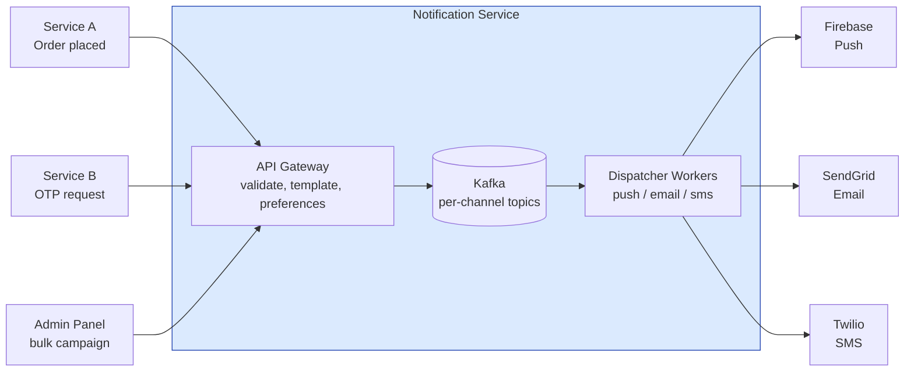

# Notification Service

## Содержание

- [Фаза 1: Уточнение требований](#фаза-1-уточнение-требований)
- [Фаза 2: Оценка нагрузки](#фаза-2-оценка-нагрузки)
- [Фаза 3: Высокоуровневый дизайн](#фаза-3-высокоуровневый-дизайн)
- [Фаза 4: Deep Dive](#фаза-4-deep-dive)
- [Сквозные потоки](#сквозные-потоки)
- [Трейдоффы](#трейдоффы)
- [Interview-ready ответ (2 минуты)](#interview-ready-ответ-2-минуты)

Разбор задачи "Спроектируй систему уведомлений". Типична для компаний с мобильным приложением, e-commerce, финтехом. Проверяет знание очередей, fan-out, delivery semantics.

---

## Фаза 1: Уточнение требований

### Функциональные требования

```
Кандидат: Давайте уточню каналы и use cases.

Вопросы:
  - Какие каналы нужно поддерживать?
    → Push (iOS/Android), Email, SMS, in-app?
  - Уведомления транзакционные (OTP, подтверждение заказа) или маркетинговые (рассылки)?
  - Нужна ли шаблонизация сообщений? (переменные в тексте, локализация)
  - Нужно ли управление предпочтениями пользователя (opt-out)?
  - Нужна ли аналитика (delivered, opened)?
```

**Договорились (scope):**
- Каналы: Push (iOS + Android), Email, SMS
- Оба типа: транзакционные (немедленно) + маркетинговые (bulk, с расписанием)
- Шаблонизация: есть (переменные типа `{{user.name}}`, `{{order.id}}`)
- User preferences: пользователь может отключить отдельные каналы
- Delivery status: delivered/failed (opened — out of scope)

**Out of scope:** in-app уведомления, rich media (картинки в push), A/B testing контента, webhooks.

### Нефункциональные требования

```
- Транзакционные: latency < 5 сек end-to-end (OTP нужен быстро)
- Маркетинговые: могут ждать, но нужен throughput для 10M+ рассылки
- Delivery semantics: at-least-once (лучше дублировать, чем потерять)
- Idempotency: повторная отправка одного уведомления = одно сообщение пользователю
- Scale: 10M пользователей, 1M уведомлений/день в среднем
- High availability: 99.9%
```

---

## Фаза 2: Оценка нагрузки

```
Обычный день:
  1 млн уведомлений/сутки
    транзакционные ~100 тыс., маркетинговые ~900 тыс.
  1 млн / 86 400 ≈ 12 уведомлений/с — фоновая нагрузка ничтожна

Кампания — это не «средний день», а отдельный всплеск:
  одна рассылка на 1 млн получателей
  два канала (push + email) → 2 млн сообщений разом
  то есть одна кампания превышает весь обычный суточный объём

Лимиты провайдеров — НА АККАУНТ, а не на воркер:
  Firebase FCM    ~1 000 msg/с
  SendGrid Email  ~600 msg/с (paid tier)
  Twilio SMS      ~100 msg/с по умолчанию

Отсюда главный вывод фазы: длительность кампании задаёт провайдер,
а не пожелание «разослать за час»:

  1 млн push  / 1 000 в с ≈ 17 минут
  1 млн email /   600 в с ≈ 28 минут
  1 млн SMS   /   100 в с ≈ 2,8 ЧАСА   ← узкое место канала

Хранилище:
  статус одного уведомления ~200 B
  1 млн/сутки × 365 × 3 года ≈ 1,1 млрд записей ≈ 220 GB
  → умещается в одну реляционную БД
```

**Выводы:**
- Фоновые 12/с не определяют ничего — систему проектируем под всплеск кампании.
- Пропускная способность упирается не в наши сервисы, а во внешние лимиты, поэтому нужен **троттлинг и backpressure**, а не «побольше воркеров».
- SMS на порядок медленнее остальных каналов: планировать кампанию единым сроком для всех каналов нельзя.

---

## Фаза 3: Высокоуровневый дизайн



### Роль каждого компонента

Сквозная идея — **fan-out по каналам, а не по пользователям**: у каждого провайдера свой rate limit и своя надёжность, поэтому каналы развязаны и троттлятся независимо.

**API Gateway.**
*Зачем:* валидация, рендеринг шаблона, проверка preferences и idempotency, затем fan-out в очереди.
*Почему отдельно:* единая точка входа для всех сервисов-источников; вся «дорогая» подготовка делается до постановки в очередь, воркеры получают уже готовое сообщение.

**Kafka (per-channel topics).**
*Зачем:* буфер между приёмом и доставкой; отдельный топик на канал + priority-топик для транзакционных + DLQ.
*Почему именно брокер с retention:* при недоступности провайдера сообщения копятся (retention 7 дней), а не теряются; replay и consumer groups из коробки. Выбор брокера — [brokers / comparison](../../07-message-brokers-and-streaming/07-comparison.md), профиль — [Kafka](../../07-message-brokers-and-streaming/01-kafka.md).

**Dispatcher Workers (push / email / sms).**
*Зачем:* читают свой топик, вызывают провайдера, троттлят под его лимит, ретраят, пишут статус.
*Почему по одному на канал:* лимиты разные (FCM 1000/сек, Twilio 100/сек) — общий воркер пришлось бы троттлить по худшему. Backpressure под лимиты — [reliability / backpressure & shedding](../reliability-patterns/05-backpressure-and-shedding.md), троттлинг — [rate-limiting](../reliability-patterns/04-rate-limiting.md).

**External providers (FCM / SendGrid / Twilio).**
*Зачем:* фактическая доставка в каналы; delivery receipts приходят вебхуками.
*Почему обёртка на воркере:* провайдеры нестабильны и имеют лимиты — изолируем retry/DLQ. Приём подтверждений — [protocols / webhooks](../../08-networking-and-api/protocols/06-webhooks.md).

**Redis (idempotency + preferences cache).**
*Зачем:* быстрый чек `idempotency_key` на горячем пути и кеш user-preferences (TTL 5 мин).
*Почему Redis:* проверка идемпотентности на каждом запросе должна быть sub-ms; механика — [reliability / idempotency](../reliability-patterns/06-idempotency.md), [Redis](../../06-databases/database-systems-catalog/08-redis.md).

**PostgreSQL (notification_log).**
*Зачем:* durable-статусы (QUEUED/SENT/DELIVERED/FAILED), unique `idempotency_key`, аналитика.
*Почему реляционка:* объёмы умеренные (~220 GB за 3 года), OLAP не нужен; unique-индекс — вторая линия идемпотентности после Redis.

---

## Фаза 4: Deep Dive

### Notification Pipeline

**Шаги обработки одного уведомления:**

```
1. Входящий запрос:
   POST /notifications
   {
     "type": "order_confirmed",
     "user_id": 12345,
     "template_id": "order-confirm-v2",
     "variables": { "order_id": "ORD-789", "amount": "4200 RUB" },
     "channels": ["push", "email"],         // или берём из user preferences
     "idempotency_key": "order-789-confirm"
   }

2. Validation:
   - user_id существует?
   - template_id существует?
   - Каналы активны для данного пользователя? (проверка preferences)

3. Template rendering:
   "Ваш заказ {{order_id}} на сумму {{amount}} подтверждён"
   → "Ваш заказ ORD-789 на сумму 4200 RUB подтверждён"

4. Idempotency claim — АТОМАРНО, одной командой:
   SET idem:{key} {request_id} NX EX 86400
     OK  → ключ заняли мы, продолжаем
     nil → ключ уже занят, вернуть сохранённый результат

   Раздельные GET и потом SET — гонка: два параллельных запроса
   с одним ключом оба увидят «пусто» и оба поставят задачу в очередь.

5. Fan-out в очереди:
   Для каждого канала → отдельное сообщение в Kafka:
   topic: notifications.push   → { user_id, rendered_body, device_tokens }
   topic: notifications.email  → { user_id, rendered_html, recipient_email }

6. Channel workers читают из своих топиков
   → вызывают external provider
   → обновляют статус в DB
```

---

### Kafka топики и партиционирование

```
Топики:
  notifications.push    (10 партиций)
  notifications.email   (10 партиций)
  notifications.sms     (5 партиций)
  notifications.dlq     (dead letter queue — ошибки после N retries)

Partition key = user_id:
  - Гарантирует ordering для одного пользователя
  - Равномерное распределение (если нет hotspot users)

Consumer groups:
  push-workers:  10 воркеров (по 1 на партицию)
  email-workers: 10 воркеров
  sms-workers:   5 воркеров
```

---

### Retry и Dead Letter Queue

**Логика retry для transient errors (5xx от провайдера, timeout):**

```
Попытка 1: немедленно
Попытка 2: через 30 сек (exponential backoff)
Попытка 3: через 5 мин
Попытка 4: через 30 мин
После 4-й: → DLQ + alert + статус = FAILED

Permanent errors (4xx — неверный токен, невалидный email):
  → сразу в DLQ, не retry
  → пометить device token как inactive (для push)
```

**DLQ обработчик:**
- Алертинг инженерам на необычный объём
- Manual replay или skip
- Анализ причин для мониторинга

---

### User Preferences

```sql
CREATE TABLE user_notification_preferences (
  user_id     BIGINT NOT NULL,
  channel     VARCHAR(20) NOT NULL,  -- 'push', 'email', 'sms'
  category    VARCHAR(50) NOT NULL,  -- 'transactional', 'marketing', 'security'
  enabled     BOOLEAN NOT NULL DEFAULT true,
  updated_at  TIMESTAMP NOT NULL,
  PRIMARY KEY (user_id, channel, category)
);
```

**Кеш preferences:**
```
Redis: HGETALL prefs:{user_id}
TTL: 5 минут (preferences меняются редко)

При изменении settings → invalidate cache немедленно
```

**Важно:** транзакционные (OTP, security alerts) нельзя отключить. Проверять в validation layer до сохранения в очередь.

---

### Два уровня дублирования — их нельзя путать

В требованиях одновременно стоят «at-least-once» и «повторная отправка = одно сообщение пользователю». Это противоречие только на вид: речь о разных уровнях.

```
Уровень 1 — приём запроса (дедупликация ЕСТЬ).
  Сервис-источник ретраит POST /notifications с тем же idempotency_key.
  SET NX отсекает повтор → в очередь попадает одно сообщение.

Уровень 2 — доставка провайдеру (дубликат ВОЗМОЖЕН).
  Воркер вызвал провайдера, сообщение ушло, но воркер упал
  до коммита offset. После перезапуска Kafka отдаст сообщение снова
  → пользователь получит второй SMS.

  Idempotency key на входе от этого НЕ защищает: он отработал
  на уровне 1, а дубль рождается на уровне 2.
```

Что с этим делать:

```
1. Проверять статус перед вызовом провайдера:
   если в notification_log уже есть provider_msg_id для этой записи —
   значит вызов состоялся, повторять не нужно.
   Закрывает почти все случаи, но остаётся окно между вызовом
   провайдера и записью provider_msg_id.

2. Использовать идемпотентность самого провайдера, если он её даёт
   (Idempotency-Key у части API, collapse_key у FCM).

3. Признать остаточный риск. Требование «at-least-once, лучше
   дублировать, чем потерять» — это и есть осознанный выбор:
   редкий повтор OTP лучше, чем неполученный OTP.
```

Формулировать на интервью стоит именно так: idempotency key дедуплицирует **обращения источников**, а не **вызовы провайдера**; для второго нужен либо провайдерский ключ, либо принятие редких дублей.

---

### Транзакционные vs Маркетинговые

```
Транзакционные (OTP, confirmations):
  - Высокий приоритет → отдельный Kafka топик (notifications.priority)
  - Воркеры с меньшим батчингом → ниже latency
  - No rate limiting throttling

Маркетинговые (campaigns):
  - Low priority топик
  - Throttling: не более X msg/sec на провайдера
  - Scheduled: "отправить в 10:00 по timezone пользователя"
  - Unsubscribe link обязателен (CAN-SPAM, GDPR)
```

---

### Scheduled Notifications

```
Сценарий: кампания "отправить 1M пользователям в 10:00 UTC+3"

Подход: delayed message scheduling

1. Admin создаёт кампанию:
   { campaign_id, template_id, audience_segment_id, schedule_time }
   → сохранить в PostgreSQL, статус = SCHEDULED

2. Scheduler job (cron каждую минуту) — забирает кампанию атомарно:

   UPDATE campaigns SET status = 'PROCESSING', locked_by = :node
   WHERE campaign_id = (
       SELECT campaign_id FROM campaigns
       WHERE status = 'SCHEDULED' AND schedule_time <= now()
       ORDER BY schedule_time
       LIMIT 1
       FOR UPDATE SKIP LOCKED      -- два инстанса не возьмут одну кампанию
   )
   RETURNING *;

   → fan-out: читать аудиторию КУРСОРОМ, а не грузить 1 млн ID в память
   → push в Kafka батчами по 1000
   → после каждого батча сохранять last_sent_user_id (чекпойнт)

3. Возобновление после падения:
   Планировщик упал на 500-тысячном получателе. Без чекпойнта
   перезапуск начал бы с нуля и отправил половине аудитории второе
   сообщение. С курсором работа продолжается с последнего батча.

   Вторая линия защиты — idempotency_key вида
   "campaign:{campaign_id}:user:{user_id}": даже повторный проход
   не создаст дубликат.

4. Throttling — token bucket ОБЩИЙ, а не локальный в воркере:

   Ловушка: лимит SendGrid ~600 msg/с даётся на аккаунт.
   Если каждый из 10 воркеров держит свой bucket на 600/с,
   суммарно уйдёт 6 000/с и провайдер начнёт отдавать 429.

   Варианты:
     a) общий bucket в Redis (Lua-скрипт, атомарный расход токенов)
        → точно, но +1 round trip на каждое сообщение
     b) поделить квоту: каждому воркеру 600 / 10 = 60/с
        → без сети, но при неравномерной загрузке часть квоты простаивает

   Механика обоих — в кейсе ./03-rate-limiter.md
```

**«В 10:00 по таймзоне пользователя» — это не одно время.** Одна колонка `schedule_time` такого не выражает: кампания должна сработать 24 раза, по разу на часовой пояс. Схема доработки:

```
Вариант A — разбить кампанию на подзадачи по таймзонам:
  campaign_jobs(campaign_id, tz, fire_at, status, cursor)
  На каждый пояс своя строка со своим абсолютным fire_at.
  Планировщик забирает их тем же SKIP LOCKED.

Вариант B — считать время на получателя:
  send_at вычисляется из таймзоны пользователя при формировании
  аудитории, дальше это обычная delayed-очередь.

Вариант A проще эксплуатировать: у кампании 24 понятных куска,
каждый со своим прогрессом и возможностью остановки.
```

Побочный эффект, который стоит проговорить: «10:00 в каждом поясе» размазывает миллионную рассылку на сутки — и это скорее плюс, потому что снимает пик с провайдерских лимитов.

---

### Delivery Status Tracking

```sql
CREATE TABLE notification_log (
  id              BIGINT      GENERATED ALWAYS AS IDENTITY PRIMARY KEY,
  idempotency_key VARCHAR(128) NOT NULL,
  user_id         BIGINT       NOT NULL,
  channel         VARCHAR(20)  NOT NULL,
  template_id     VARCHAR(100),
  status          VARCHAR(20)  NOT NULL,  -- QUEUED/SENT/DELIVERED/FAILED
  provider_msg_id VARCHAR(256),           -- ID от FCM/SendGrid/Twilio
  error_message   TEXT,
  created_at      TIMESTAMPTZ  NOT NULL DEFAULT now(),
  updated_at      TIMESTAMPTZ  NOT NULL DEFAULT now(),

  -- Ключ уникален В ПРЕДЕЛАХ КАНАЛА: одно уведомление раскладывается
  -- в push и email, у обоих один idempotency_key от источника,
  -- но это две разные записи доставки.
  UNIQUE (idempotency_key, channel)
);

-- Поиск по внешнему идентификатору при обработке вебхуков провайдера
CREATE INDEX idx_notif_provider_msg ON notification_log (provider_msg_id)
    WHERE provider_msg_id IS NOT NULL;
```

Два момента в этой схеме. Первый: `PRIMARY KEY` был пропущен — `GENERATED ALWAYS AS IDENTITY` сам по себе ключом не является. Второй: `UNIQUE` только по `idempotency_key` сломал бы fan-out по каналам, потому что одно входящее уведомление порождает по записи на канал.

**Delivery confirmation:**
- Email (SendGrid): webhook `delivered` event → UPDATE status
- Push (FCM): response при отправке + webhook для confirmation
- SMS (Twilio): webhook delivery receipt

---

### Что если провайдер недоступен?

```
FCM недоступен 30 минут:
  - Retry с exponential backoff
  - Сообщения накапливаются в Kafka (retention = 7 дней)
  - Alert инженерам при lag > 10000 сообщений
  - При восстановлении FCM → воркеры продолжат автоматически
  - Transactional OTP: уведомить через SMS как fallback (если настроено)
```

---

## Сквозные потоки

**1. Транзакционное уведомление (OTP / подтверждение).**
`POST /notifications` → валидация + рендер шаблона → idempotency-чек в Redis → fan-out в priority-топик → priority-воркер (минимальный батчинг) → провайдер → статус SENT.
*Итог:* OTP не застревает за маркетинговым батчем; end-to-end < 5 сек.

**2. Маркетинговая кампания по расписанию.**
Admin создаёт кампанию (SCHEDULED в PostgreSQL) → Scheduler (cron) в `schedule_time` загружает аудиторию → пушит в Kafka батчами по 1000 → воркеры троттлят под лимит провайдера (token bucket).
*Итог:* миллионная рассылка не превышает лимиты провайдера и не вытесняет транзакционные.

**3. Сбой провайдера и retry.**
Воркер получает 5xx/timeout → exponential backoff (30 сек → 5 мин → 30 мин) → после N попыток в DLQ + alert. Permanent 4xx (битый токен) → сразу DLQ, токен помечается inactive.
*Итог:* сообщения копятся в Kafka, а не теряются; при восстановлении провайдера воркеры досылают автоматически.

**4. Подтверждение доставки.**
Провайдер шлёт вебхук `delivered` → обновляем `notification_log` (SENT → DELIVERED).
*Итог:* статус eventual-consistent через вебхуки, горячий путь отправки им не нагружается.

---

## Трейдоффы

| Решение | Принятое | Альтернатива | Причина |
|---|---|---|---|
| Queue | Kafka | SQS/RabbitMQ | Replay, retention, consumer groups |
| Fan-out | По каналам | По пользователям | Независимый throttling для каждого провайдера |
| Idempotency приёма | `SET NX` в Redis + `UNIQUE` в БД | Только Redis; только БД | Redis даёт скорость и атомарный захват, БД — durability при потере кеша |
| Дубли у провайдера | Признаём (at-least-once) + проверка `provider_msg_id` | Exactly-once | Провайдеры его не дают; редкий повтор OTP лучше неполученного |
| Троттлинг | Общий bucket в Redis либо квота на воркер | Локальный bucket в каждом воркере | Лимит даётся на аккаунт: N воркеров × лимит = превышение в N раз |
| Scheduling | Cron + БД с `SKIP LOCKED` и курсором | Kafka delayed messages | Проще мониторить; курсор даёт возобновление без дублей |
| Время по таймзонам | Подзадачи на пояс | Одно `schedule_time` | «10:00 у пользователя» — это 24 разных момента |
| Status tracking | PostgreSQL | ClickHouse | 220 GB за 3 года; OLAP не нужен |

---

## Interview-ready ответ (2 минуты)

> "Notification service — это fan-out система с несколькими каналами и сильно разными нагрузками: транзакционные требуют latency < 5 сек, маркетинговые — throughput для миллионных рассылок.
>
> Ключевая архитектура: API принимает запрос, рендерит шаблон, проверяет idempotency через Redis, затем fan-out в Kafka — отдельный топик для каждого канала. Это позволяет независимо масштабировать и throttle каждый канал под лимиты провайдера.
>
> Отдельный высокоприоритетный топик для транзакционных — чтобы OTP не застрял за батчем маркетинговой рассылки.
>
> Пропускная способность упирается не в нас, а во внешние лимиты, и они даются на аккаунт. Миллион SMS при лимите Twilio в 100 в секунду — это почти три часа, поэтому срок кампании диктует провайдер. Важная деталь: token bucket должен быть общим на канал, иначе десять воркеров с локальным лимитом превысят квоту в десять раз.
>
> Про идемпотентность разделю два уровня. На приёме — атомарный `SET NX` по ключу, плюс уникальный индекс в БД как durable-подстраховка. А вот на доставке at-least-once честно означает, что при падении воркера между вызовом провайдера и коммитом offset пользователь может получить дубль. Ключ на входе от этого не спасает; помогает проверка `provider_msg_id` перед повтором, а остаток риска принимается осознанно.
>
> Retry с exponential backoff, после N попыток → DLQ. Permanent errors (невалидный токен) — сразу в DLQ без retry.
>
> User preferences в PostgreSQL, кешированы в Redis с TTL 5 минут. Транзакционные уведомления нельзя отключить — это проверяется до постановки в очередь."
