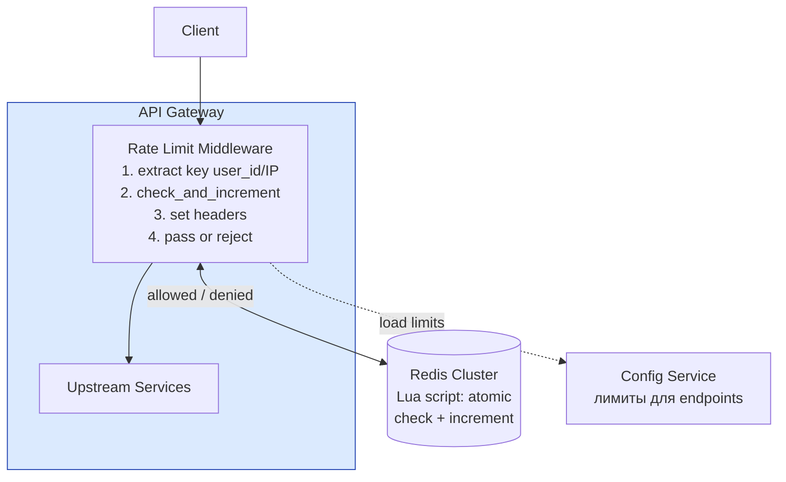

# Rate Limiter

## Содержание

- [Фаза 1: Уточнение требований](#фаза-1-уточнение-требований)
- [Фаза 2: Оценка нагрузки](#фаза-2-оценка-нагрузки)
- [Фаза 3: Алгоритмы Rate Limiting](#фаза-3-алгоритмы-rate-limiting)
- [Фаза 4: Deep Dive](#фаза-4-deep-dive)
- [Расширение: Rate Limiter как отдельный сервис](#расширение-rate-limiter-как-отдельный-сервис)
- [Сквозные потоки](#сквозные-потоки)
- [Трейдоффы](#трейдоффы)
- [Interview-ready ответ (2 минуты)](#interview-ready-ответ-2-минуты)

Разбор задачи "Спроектируй Rate Limiter". Проверяет понимание алгоритмов, распределённого состояния, latency требований и failure modes. Часто идёт как компонент более крупной системы или как самостоятельная задача.

---

## Фаза 1: Уточнение требований

### Функциональные требования

```
Кандидат: Несколько уточнений прежде чем начать.

Вопросы:
  - На каком уровне применять rate limiting?
    → API Gateway (централизованно) или в каждом сервисе?
  - По чему лимитируем?
    → По IP? По user_id? По API key? Комбинация?
  - Тип лимита?
    → Фиксированное окно (100 req/min) или sliding window?
    → Разные лимиты для разных endpoint'ов?
  - Что происходит при превышении?
    → 429 Too Many Requests с Retry-After header?
  - Hard limit или soft (throttle, но пропустить)?
```

**Договорились:**
- Уровень: API Gateway (один централизованный компонент)
- Ключ: комбинация (user_id если есть, иначе IP + API key)
- Тип: sliding window — точнее fixed window (нет "burst" на границе окна)
- Лимиты: конфигурируемые по-разному для разных endpoint-групп
- При превышении: 429 + стандартный заголовок `Retry-After`
- Hard limit (отклонить запрос)

**Out of scope:** балансировка нагрузки, DDoS-защита (это другой уровень), per-tenant billing.

### Нефункциональные требования

```
- Latency: overhead rate limiter < 1ms p99 (критично — стоит на каждом запросе)
- Accuracy: +/- 0.1% (небольшая погрешность допустима)
- Availability: если rate limiter упал → fail-open (пропустить запрос) или fail-closed?
  → Обсудить: для большинства API — fail-open (не блокировать легитимных пользователей)
- Scale: 100K RPS через gateway
- Consistency: eventual OK (небольшой burst при нескольких нодах допустим)
```

---

## Фаза 2: Оценка нагрузки

```
Трафик через Gateway: 100K RPS
  → 100K проверок rate limiter / sec

Данные в Redis — считать надо по ВЫБРАННОМУ алгоритму и по АКТИВНЫМ ключам:

  Sliding window log хранил бы список меток времени (~1 KB на пользователя),
  но он отвергнут. У sliding window counter — два счётчика:
    2 ключа × (значение + накладные Redis ~80 B) ≈ 200 B на пользователя

  Ключи живут TTL = два окна (2 минуты), значит в памяти лежат не все
  10 млн зарегистрированных, а только активные за это время:

    100K RPS × 120 с = 12 млн запросов за окно жизни ключей
    при ~10 запросах на пользователя → ~1,2 млн активных пользователей

    1,2 млн × 200 B ≈ 240 MB

  Это на два порядка меньше «10 GB» из наивной оценки: экономию дают
  и выбор алгоритма, и то, что ключи протухают.

Команды Redis на запрос:
  Fixed window:       INCR + EXPIRE          → 2 команды
  Sliding window log: ZADD + ZREMRANGEBYSCORE + ZCARD → 3-4 команды
  Sliding window counter (выбран): один EVAL → 1 round trip

При 100K RPS это 100K вызовов EVAL/с — около 10% от возможностей
одной ноды Redis. Кластер здесь нужен ради отказоустойчивости
и переживания рестарта, а не ради пропускной способности.
```

---

## Фаза 3: Алгоритмы Rate Limiting

Прежде чем рисовать архитектуру — важно понять алгоритмы, потому что они влияют на хранилище и точность.

### 1. Fixed Window Counter

```
Окно: 1 минута
Лимит: 100 запросов

Ключ: rl:{user_id}:{minute_timestamp}
Операция: INCR key; EXPIRE key 60

Плюсы: O(1) memory, простота
Минусы: burst на границе окна

Пример проблемы:
  23:59:59 → 100 запросов (в рамках минуты X)
  00:00:01 → ещё 100 запросов (новая минута Y)
  → 200 запросов за 2 секунды — окно позволяет!
```

### 2. Sliding Window Log

```
Лимит: 100 запросов за последние 60 секунд

Redis: Sorted Set, score = timestamp
  ZADD rl:{user_id} {now_ms} {request_id}
  ZREMRANGEBYSCORE rl:{user_id} 0 {now_ms - 60000}  // удалить старые
  ZCARD rl:{user_id}  // текущий count

Плюсы: точный sliding window, нет burst проблемы
Минусы: O(N) memory (растёт с количеством запросов), дороже по Redis ops
```

### 3. Sliding Window Counter (гибрид — выбираем этот)

```
Компромисс между точностью и памятью:

Идея: хранить счётчики двух соседних окон + интерполировать

current_window_count = counter[current_window]
prev_window_count    = counter[prev_window]
overlap              = elapsed_time_in_current_window / window_size
estimated_count = prev_window_count × (1 - overlap) + current_window_count

Пример:
  window = 1 min, limit = 100
  prev окно: 80 запросов
  current окно: 20 запросов, прошло 30 сек (overlap = 0.5)
  estimated = 80 × 0.5 + 20 = 60 — в норме

Плюсы: O(1) memory (только 2 счётчика)
Минусы: это ОЦЕНКА, а не точный счёт

  Формула предполагает, что запросы в предыдущем окне распределены
  равномерно. Если все 80 пришли в его последнюю секунду, реальная
  нагрузка за скользящую минуту выше расчётной, и лимитер пропустит
  лишнее; если в первую — наоборот, отклонит легитимные.

  На реальном трафике отклонение невелико (Cloudflare публиковали
  порядок сотых долей процента ошибочных решений), но обещать
  «точность 99,9%» как свойство алгоритма нельзя: она зависит
  от формы трафика, а не от реализации.
```

### 4. Token Bucket

```
Bucket: N токенов, заполняется со скоростью R tokens/sec

Плюсы: естественный burst (можно использовать N накопленных токенов сразу)
Минусы: нужен атомарный GET+SET+conditional update → Lua script в Redis

Когда выбирать: если нужно разрешить кратковременные bursts
  (API позволяет 100 req/min но допускает 10 запросов за 1 сек)
```

**Выбор: Sliding Window Counter** — баланс между точностью и эффективностью.

---

## Фаза 4: Deep Dive

### Архитектура



### Роль каждого компонента

Сквозная идея — **централизованное атомарное состояние при < 1 мс на каждом запросе**: решение принимает один Lua-скрипт в Redis, поэтому все ноды Gateway согласованы без межнодовой синхронизации.

**Rate Limit Middleware (в Gateway).**
*Зачем:* извлекает ключ (user_id/IP), зовёт Redis, выставляет заголовки `X-RateLimit-*`, пропускает или режет 429.
*Почему в Gateway, а не в каждом сервисе:* лимит должен считаться один раз на входе; дублировать его в N сервисах — рассинхрон и лишний overhead. Готовые реализации — [networking / rate-limiting](../../08-networking-and-api/protocols/04-rate-limiting.md), паттерн — [reliability / rate-limiting](../reliability-patterns/04-rate-limiting.md).

**Redis Cluster (atomic check + increment).**
*Зачем:* хранит счётчики окон; Lua-скрипт делает «проверить и инкрементировать» атомарно.
*Почему именно Redis + Lua:* нужно общее состояние для всех нод и атомарность без race между операциями; sub-ms латентность. Готовые скрипты sliding-window/token-bucket — [Redis rate limiters](../../06-databases/database-systems-catalog/08b-redis-rate-limiters.md), профиль — [Redis](../../06-databases/database-systems-catalog/08-redis.md).

**Config Service.**
*Зачем:* лимиты по endpoint-группам и tier пользователя (free/pro/enterprise).
*Почему отдельно:* лимиты меняются без передеплоя Gateway; кешируются в памяти ноды с TTL 30 сек, чтобы не ходить за ними на каждом запросе.

**Upstream Services.**
*Зачем:* получают только прошедшие лимит запросы.
*Почему за middleware:* rate limiter — это shed-нагрузки на входе, защищающий upstream от перегруза ещё до бизнес-логики.

---

### Redis Lua Script (атомарность)

Проблема: ZREMRANGEBYSCORE + ZCARD + ZADD — три операции. Между ними может вклиниться другой запрос (race condition).

**Решение: Lua script выполняется атомарно в Redis:**

```lua
-- sliding_window_counter.lua
--
-- Оба ключа приходят в KEYS и содержат ОБЩИЙ hash tag {...}:
--   KEYS[1] = rl:{user:123}:1716213600   текущее окно
--   KEYS[2] = rl:{user:123}:1716213599   предыдущее окно
-- Без общего тега в Redis Cluster эти ключи попадут в разные слоты
-- и скрипт завершится ошибкой CROSSSLOT.

local current_key = KEYS[1]
local prev_key    = KEYS[2]
local window      = tonumber(ARGV[1])   -- размер окна, мс
local limit       = tonumber(ARGV[2])
local elapsed     = tonumber(ARGV[3])   -- прошло от начала текущего окна, мс

-- вес предыдущего окна: чем дальше ушли от его границы, тем меньше
local prev_weight   = 1 - (elapsed / window)
local prev_count    = tonumber(redis.call("GET", prev_key) or "0")
local current_count = tonumber(redis.call("GET", current_key) or "0")

local estimated = math.floor(prev_count * prev_weight) + current_count

if estimated >= limit then
  local retry_after = math.ceil((window - elapsed) / 1000)
  return {0, 0, retry_after}                  -- denied, remaining=0
end

redis.call("INCR", current_key)
redis.call("PEXPIRE", current_key, window * 2)   -- TTL = два окна

return {1, limit - estimated - 1, 0}           -- allowed, remaining
```

Три вещи, которые здесь важны и которые легко сделать неправильно:

```
1. Ключи вычисляет КЛИЕНТ и передаёт через KEYS.
   Собирать имена ключей внутри скрипта нельзя: клиент Redis Cluster
   маршрутизирует запрос по объявленным KEYS, и обращение к
   невыведенному ключу — неопределённое поведение.

2. Hash tag {user:123} обязателен.
   Он заставляет оба окна лечь в один слот. Иначе CROSSSLOT-ошибка
   на каждом втором запросе.

3. Скрипт возвращает remaining.
   Иначе заголовок X-RateLimit-Remaining нечем заполнять —
   второй запрос за этим числом убил бы смысл атомарности.
```

Номер окна считается по часам шлюза, поэтому ноды должны быть синхронизированы по NTP: расхождение больше долей секунды сдвинет границу окна между нодами. Брать время через `redis.call("TIME")` не получится — тогда ключи нельзя вычислить заранее и передать в `KEYS`.

---

### Конфигурация лимитов

```yaml
rate_limits:
  default:
    window: 60s
    limit: 100

  rules:
    - pattern: "POST /api/v1/auth/*"
      window: 60s
      limit: 10              # строже для auth endpoint

    - pattern: "POST /api/v1/send-otp"
      window: 300s
      limit: 5               # 5 OTP за 5 минут

    - pattern: "GET /api/v1/feed"
      window: 60s
      limit: 300             # читающие endpoint — свободнее

  tiers:
    free:     { window: 60s, limit: 100  }
    pro:      { window: 60s, limit: 1000 }
    enterprise: { window: 60s, limit: 10000 }
```

Конфигурация хранится в Config Service (например, consul/etcd/DB), кешируется в памяти API Gateway с TTL 30 секунд.

---

### Заголовки ответа

```
Нормальный запрос (лимит не превышен):
  X-RateLimit-Limit:     100
  X-RateLimit-Remaining: 73
  X-RateLimit-Reset:     1716213600  (unix timestamp когда сбросится)

При превышении (429):
  Retry-After:           47           ← СТАНДАРТНЫЙ заголовок (RFC 9110)
  X-RateLimit-Limit:     100
  X-RateLimit-Remaining: 0
  X-RateLimit-Reset:     1716213647

  Body: {"error": "rate_limit_exceeded", "retry_after": 47}
```

`Retry-After` обязателен именно в стандартном виде: его понимают HTTP-клиенты, SDK и прокси «из коробки», и многие библиотеки ретраев ориентируются только на него. Кастомный `X-RateLimit-Retry-After` такие клиенты просто не увидят и продолжат долбить сервис с прежней частотой. Префикс `X-RateLimit-*` уместен для остальных трёх — это де-факто соглашение, а не стандарт.

---

### Distributed Rate Limiting: проблема и решение

**Проблема:** несколько нод API Gateway, каждая смотрит в один Redis.

```
Node 1: проверяет → 99/100 → пропускает
Node 2: проверяет → 99/100 (данные ещё не обновились) → тоже пропускает
→ 101 запрос прошёл

Решение: centralized Redis (не per-node в памяти).
  Lua script гарантирует атомарность на уровне Redis.
  Race condition возможен между EVAL и следующим EVAL,
  но Lua script атомарен в рамках одного вызова → OK.
```

**Альтернатива — локальный rate limiter + синхронизация:**
```
Каждая нода хранит локальный bucket.
Периодически (каждые 100ms) синхронизирует с Redis.
→ Меньше нагрузки на Redis, но временно допускает burst при N нодах.
→ Подходит если небольшая погрешность (< 10%) приемлема.
```

---

### Failure Modes

**Что если Redis недоступен?**

```
Fail-open (пропустить запрос):
  + Пользователи не страдают от проблем инфраструктуры
  - Злоумышленник может обойти лимиты во время сбоя

Fail-closed (отклонить запрос):
  + Безопаснее
  - Недоступность Redis = недоступность всего API

Рекомендация: fail-open, но НЕ «пропускать всё» —
  переключаться на локальный лимитер ноды с грубой квотой,
  писать метрику rate_limiter.bypass и алертить.
  При восстановлении Redis счётчики стартуют с нуля,
  поэтому сразу после инцидента лимиты временно мягче.

Исключение — эндпоинты, где обход лимита опаснее отказа:
  отправка OTP, сброс пароля, платёжные операции.
  Для них выбирают fail-closed: лучше временно отказать,
  чем дать перебирать коды без ограничений.
```

**Degraded mode:**
```go
func (r *RateLimiter) Allow(ctx context.Context, key string) (bool, error) {
    // 1. Circuit breaker: пока Redis признан недоступным, вообще не ходим
    //    в него. Без этого каждый из 100K RPS будет ждать таймаута,
    //    и латентность деградирует сильнее, чем от самого отказа лимитера.
    if r.breaker.Open() {
        r.metrics.IncCounter("rate_limiter.bypass")
        return r.localFallback.Allow(key), nil
    }

    // 2. Таймаут заметно меньше клиентского дедлайна: лимитер не имеет
    //    права съедать бюджет запроса.
    ctx, cancel := context.WithTimeout(ctx, 50*time.Millisecond)
    defer cancel()

    allowed, err := r.redis.CheckAndIncrement(ctx, key)
    if err != nil {
        r.breaker.RecordFailure()
        r.metrics.IncCounter("rate_limiter.bypass")
        // 3. Не «пропустить всё», а отдать решение локальному лимитеру
        return r.localFallback.Allow(key), nil
    }
    r.breaker.RecordSuccess()
    return allowed, nil
}
```

Три отличия от наивного fail-open, каждое закрывает свою проблему:

```
Circuit breaker    — иначе при недоступном Redis КАЖДЫЙ запрос платит
                     полный таймаут, и лимитер из защиты превращается
                     в источник деградации. См. ../reliability-patterns/03-circuit-breaker.md

Короткий таймаут   — 50 мс при бюджете overhead < 1 мс: это уже авария,
                     но она не должна становиться минутной

Локальный fallback — «пропустить всё» при 100K RPS означает снять защиту
                     с upstream ровно в тот момент, когда инфраструктура
                     и так нездорова. Грубый in-memory лимитер на ноду
                     (лимит / число нод, с запасом) держит порядок величины
```

---

### Защита от обхода

```
1. IP Spoofing:
   Использовать несколько заголовков: X-Forwarded-For, X-Real-IP, CF-Connecting-IP
   Но доверять только последнему hop от trusted proxy

2. Burst via distributed clients:
   Один пользователь с 1000 IP → rate limit по user_id (не по IP)
   Для незарегистрированных → IP-based, но жёстче (10 req/min)

3. Slowloris / connection exhaustion:
   Это задача для другого уровня (LB, nginx) — не rate limiter
```

---

## Расширение: Rate Limiter как отдельный сервис

Если нужен не middleware в Gateway, а отдельный микросервис:

```
Other services → gRPC → Rate Limiter Service → Redis
                        ↑
                Centralized decisions

API:
  rpc CheckRateLimit(CheckRequest) returns (CheckResponse) {}

  message CheckRequest {
    string key    = 1;  // "user:{id}" или "ip:{addr}"
    string policy = 2;  // "default" или "auth"
  }

  message CheckResponse {
    bool   allowed      = 1;
    int32  remaining    = 2;
    int64  reset_at     = 3;
    int32  retry_after  = 4;  // если не allowed
  }
```

Overhead: один gRPC call + Redis = ~1-2ms. Нужно кешировать в сервисе-клиенте при строгих latency требованиях. Протокол — [networking / gRPC](../../08-networking-and-api/protocols/01-grpc.md).

---

## Сквозные потоки

**1. Запрос в пределах лимита.**
Client → middleware извлекает ключ → `EVAL` Lua в Redis: `estimated < limit` → `INCR` текущего окна → `allowed` + заголовки `X-RateLimit-Remaining` → upstream.
*Итог:* одно обращение в Redis (~1 мс), решение атомарно и одинаково для всех нод.

**2. Превышение лимита.**
`EVAL` → `estimated >= limit` → `denied` + `retry_after` → `429` со стандартным `Retry-After`, upstream не вызывается.
*Итог:* перегруз отсекается на входе; клиент знает, через сколько повторить.

**3. Гонка между нодами Gateway.**
Node 1 и Node 2 одновременно на 99/100 → оба шлют `EVAL` в один Redis → Lua сериализует вызовы: первый инкрементит до 100 и проходит, второй видит лимит → 429.
*Итог:* общее состояние + атомарный скрипт исключают «101-й запрос» без межнодовой координации.

**4. Redis недоступен (fail-open).**
`EVAL` падает → middleware ловит ошибку → метрика `rate_limiter.bypass` + alert → запрос пропускается.
*Итог:* сбой инфраструктуры лимитера не роняет API; временно лимиты мягче — осознанный trade-off в пользу доступности.

---

## Трейдоффы

| Алгоритм | Memory | Точность | Сложность | Burst handling |
|---|---|---|---|---|
| Fixed Window | O(1) | Низкая (boundary burst) | Простой | Нет |
| Sliding Window Log | O(N) | Высокая | Средний | Нет |
| Sliding Window Counter | O(1) | Оценочная (зависит от формы трафика) | Средний | Нет |
| Token Bucket | O(1) | Высокая | Сложный (Lua) | Да |
| Leaky Bucket | O(1) | Высокая | Средний | Сглаживает |

---

## Interview-ready ответ (2 минуты)

> "Rate limiter стоит на каждом запросе, поэтому latency overhead критичен — цель < 1ms.
>
> Алгоритм: Sliding Window Counter — два счётчика с интерполяцией, O(1) памяти. Оговорюсь честно: это оценка, а не точный счёт — формула предполагает равномерность запросов в предыдущем окне, поэтому на всплесках возможны перелёты в обе стороны. На реальном трафике отклонение малое, и ради O(1) памяти это приемлемо.
>
> Выполняется одним Lua-скриптом в Redis, чтобы проверка и инкремент были атомарны. Важная деталь для Redis Cluster: оба ключа окна должны передаваться в KEYS и содержать общий hash tag, иначе они уедут в разные слоты и скрипт упадёт с CROSSSLOT.
>
> По памяти: считать надо не по всем 10 миллионам пользователей, а по активным за время жизни ключей — при TTL в два окна это порядка миллиона, то есть сотни мегабайт. Кластер здесь нужен ради отказоустойчивости, а не пропускной способности: 100 тысяч EVAL в секунду — это около 10% одной ноды.
>
> Ключ лимитирования: user_id для аутентифицированных, IP для анонимных. Лимиты конфигурируемые по endpoint-группам и tier.
>
> При превышении — 429 со стандартным `Retry-After`, а не кастомным заголовком: иначе клиентские SDK его не увидят и не сбавят темп.
>
> При отказе Redis — fail-open, но с двумя оговорками: нужен circuit breaker, иначе каждый запрос платит полный таймаут и лимитер сам становится причиной деградации; и вместо «пропускаем всё» лучше грубый локальный лимитер на ноду, чтобы не снимать защиту с upstream в момент аварии. Для OTP и сброса пароля выбираю наоборот fail-closed — там обход лимита опаснее отказа."
