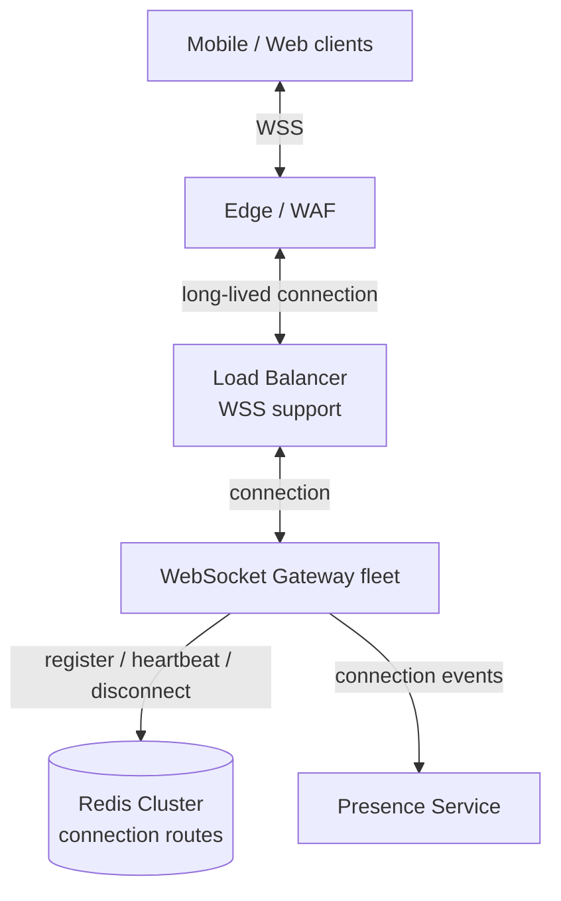
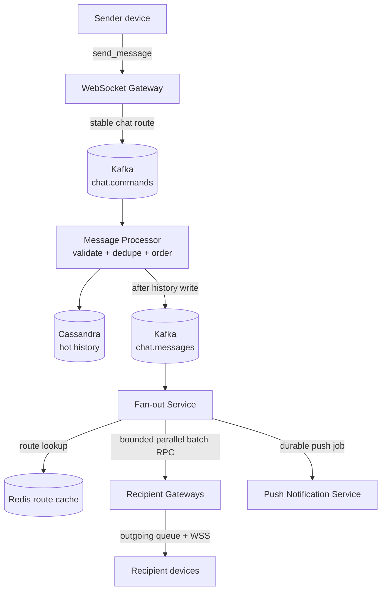
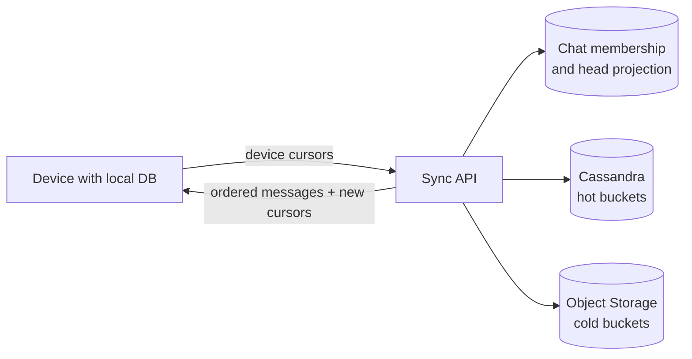

# Chat / Messaging System: доставка, порядок и multi-device sync

## Содержание

- [Что проектируем](#что-проектируем)
- [Чем отличаются кейсы 04 и 04.1](#чем-отличаются-кейсы-04-и-041)
- [Фаза 1: уточнение требований](#фаза-1-уточнение-требований)
- [Фаза 2: оценка нагрузки](#фаза-2-оценка-нагрузки)
- [Ключевые гарантии](#ключевые-гарантии)
- [Фаза 3: высокоуровневый дизайн](#фаза-3-высокоуровневый-дизайн)
- [Фаза 4: deep dive](#фаза-4-deep-dive)
- [Сквозные потоки](#сквозные-потоки)
- [Отказы и наблюдаемость](#отказы-и-наблюдаемость)
- [Трейдоффы](#трейдоффы)
- [Фаза 5: финал](#фаза-5-финал)
- [Interview-ready answer](#interview-ready-answer)
- [Связанные материалы и источники](#связанные-материалы-и-источники)

Разбор задачи «Спроектируй мессенджер» на 45–60 минут по
[общему плану интервью](./00-how-to-approach.md). Здесь главное не нарисовать
WebSocket и Kafka, а согласовать пользовательские гарантии: когда сообщение
считается принятым, откуда берётся порядок, как пережить повтор запроса и как
новое устройство дочитывает пропущенную историю.

---

## Что проектируем

Пользователи обмениваются текстовыми сообщениями в личных и групповых чатах.
Сообщение сначала надёжно принимается системой, затем появляется в истории и
доставляется на все нужные устройства. WebSocket ускоряет live-доставку, но не
является хранилищем и не даёт гарантию доставки сам по себе.

Простая ментальная модель:

```text
команда клиента
    → durable intake
    → проверка + дедупликация + порядок
    → durable history
    → live delivery / push
    → ACK устройства и sync после reconnect
```

Критическая граница проходит между «байты дошли до WebSocket Gateway» и
«система взяла ответственность за сообщение». Ответ об успехе отправляем только
после durable write, который переживает падение Gateway.

---

## Чем отличаются кейсы 04 и 04.1

| Файл | Главный вопрос | Что разбирается глубже |
| --- | --- | --- |
| Этот кейс | Как мессенджер сохраняет корректность? | API, ACK semantics, порядок, идемпотентность, история, статусы, reconnect и multi-device |
| [04.1 WebSocket Chat at Scale](./04.1-websocket-chat-capacity.md) | Выдержит ли архитектура заданную нагрузку? | Миллион соединений, память Gateway, Kafka partitions, hot groups, backpressure, reconnect storm и hot/cold storage |

`04` — основной interview-case. `04.1` — дополнительное упражнение по capacity
planning, а не альтернативная архитектура. Компоненты и гарантии в них должны
совпадать; числа нагрузки намеренно разные.

---

## Фаза 1: уточнение требований

### Что спросить

| Вопрос | Почему меняет дизайн |
| --- | --- |
| Только личные чаты или группы тоже? | Размер группы определяет fan-out и модель read receipts |
| История хранится всегда или только до доставки? | Меняет объём, cold storage и reconnect protocol |
| Что означает `sent`? | ACK от Gateway, Kafka или history DB дают разные гарантии |
| Нужен ли строгий порядок? | Нужно определить область порядка и источник sequence |
| Сколько устройств у одного пользователя? | Маршрутизация и cursors должны быть per-device |
| Новому участнику группы видна старая история? | Нужны `joined_seq` и правила авторизации history reads |
| Нужны ли end-to-end encryption и поиск по тексту? | При E2EE сервер хранит ciphertext и не индексирует содержимое |
| Один регион или весь мир? | Строгий порядок конфликтует с local writes из нескольких регионов |
| Медиа входит в scope? | Появляются object storage, direct upload, scanning и CDN |

### Зафиксированный scope

- Личные и групповые чаты до 500 участников.
- Только текстовые сообщения размером до 10 KB.
- Полная история сохраняется; три года используются как горизонт расчёта.
- Live-доставка через WebSocket и восстановление после reconnect.
- Несколько устройств на одного пользователя.
- Статусы `sent`, `delivered`, `read`.
- Push-уведомления для offline-пользователей.
- Online presence и `last seen` с ограничениями приватности.

За рамками: медиа, звонки, реакции, редактирование, полнотекстовый поиск,
end-to-end encryption и юридические правила конкретных стран. Если на интервью
требуют E2EE, сервер хранит ciphertext, а управление ключами и multi-device
key distribution становятся отдельным deep dive.

### Нефункциональные требования

Все числа ниже — учебные допущения:

- 50 млн DAU и 10 млн одновременных WebSocket-соединений.
- Доставка между online-пользователями: p99 меньше 500 мс внутри региона.
- Региональный сервис доступен 99,99% времени при отказе узла или зоны.
- После `command_received` команда завершается ровно одним результатом:
  `message_stored` или бизнес-ошибкой; после `message_stored` сообщение не теряется.
- Внутри одного чата canonical history и отображение имеют единый строгий
  порядок; live frames могут прийти не по порядку и сходятся через sync.
- Обработка канонического `MessageStored` работает at-least-once; повторная
  попытка для одного получателя безопасна по `message_id`.
- WebSocket-доставка является best effort: окончательное восстановление
  обеспечивает history + cursor sync, а не память Gateway.
- `delivered`, `read`, presence и push могут сходиться eventual consistency.
- Старую историю можно читать медленнее, чем последние сообщения.

### Семантика статусов

| Статус | Что он означает | Чего не обещает |
| --- | --- | --- |
| `pending` | Сообщение есть только в локальной БД клиента | Что сервер уже принял команду |
| `command_received` | Команда записана в реплицированный intake log | Что сообщение прошло окончательную проверку |
| `sent` / `message_stored` | Каноническое сообщение записано в history | Что получатель уже увидел сообщение |
| `delivered` | Хотя бы одно устройство получателя подтвердило получение | Что пользователь прочитал сообщение |
| `read` | Хотя бы одно устройство получателя продвинуло read cursor | Что все устройства открывали сообщение |

Для групп продукт может показывать aggregate вроде «прочитали 37 из 100» либо
список участников. Это read-проекция над пользовательскими cursors, а не поле
`status` в строке сообщения.

---

## Фаза 2: оценка нагрузки

### Сообщения и хранение

```text
DAU                                  50 млн
исходящих сообщений на пользователя 50 в сутки
сообщений в сутки                    50 млн × 50 = 2,5 млрд

среднее: 2,5 млрд / 86 400 ≈ 28 935 сообщений/с
пик ×3:  28 935 × 3          ≈ 86 806 сообщений/с
```

При среднем полном envelope около 1 KB:

```text
2,5 млрд × 1 KB                 ≈ 2,5 TB/сутки
2,5 TB × 365                    ≈ 912,5 TB/год
2,5 TB × 365 × 3                ≈ 2,74 PB за три года
с replication factor 3          ≈ 8,21 PB до compression и индексов
```

Это capacity estimate, а не обещание физического размера: текст сжимается, но
ключи, tombstones, compaction, индексы и запас добавляют объём. Полную историю
не обязательно держать на дорогих дисках Cassandra: например, 90 дней остаются
hot, закрытые buckets архивируются в object storage и читаются с отдельным SLO.

```text
90 дней hot history:
2,5 TB × 90 × RF 3 ≈ 675 TB до compression и operational headroom
```

### Соединения и heartbeat

`20 KB` на соединение — гипотеза для benchmark, включающая goroutine, buffers,
TLS и application state, а не свойство Go или WebSocket:

```text
10 млн connections × 20 KB ≈ 200 GB connection state на весь fleet

при 50 000 connections на Gateway:
10 млн / 50 000 = 200 Gateway — только математический минимум
```

Число Gateway выбирается с запасом на GC, CPU, сеть, rolling deploy и потерю
зоны. Например, целевая загрузка 70% уже даёт около `200 / 0,7 ≈ 286` нод до
дополнительного failure headroom.

Heartbeats создают отдельный write workload:

```text
10 млн connections / 30 секунд ≈ 333 333 heartbeat updates/с
```

Поэтому connection routing требует шардированного Redis и локального кеша, а не
«одного Redis, потому что payload занимает около гигабайта».

### Fan-out

Количество сообщений и количество доставок — разные величины. Зафиксируем
пример распределения пиковых `87K сообщений/с`:

```text
80% личные:        69 600 × 1 recipient    =  69 600 deliveries/с
19% малые группы:  16 530 × 10 recipients  = 165 300 deliveries/с
 1% группы по 500:    870 × 500 recipients = 435 000 deliveries/с
                                                 ----------------
user deliveries:                                ≈ 670 000/с

при 1,2 активного устройства на online-получателя:
670 000 × 1,2 ≈ 804 000 WebSocket writes/с
```

Распределение — допущение. В production отдельно измеряются размеры групп,
доля online-получателей и число устройств. Верхняя оценка `87K × 500 = 43,5 млн`
доставок/с полезна как stress test, но нельзя выдавать её за основной workload.

### Выводы из чисел

- Gateway fleet масштабируется по соединениям, heartbeat и blast radius.
- Message Processor масштабируется по Kafka partitions и Cassandra writes.
- Fan-out Service масштабируется по deliveries, а не по incoming messages.
- История требует bucketed wide-column storage и hot/cold tiers.
- Количество узлов и partitions выводится из benchmark полной операции.

---

## Ключевые гарантии

### WebSocket — быстрый канал, а не очередь

Gateway может упасть сразу после чтения frame. Поэтому получение frame ещё не
означает `command_received`. Клиент хранит `pending` локально и повторяет команду
с тем же `client_msg_id`, пока не увидит server ACK либо результат в sync.

### Порядок принадлежит чату

Все команды одного чата идут в одну стабильную Kafka partition. Producer берёт
маршрут из `routing_generation/routing_bucket` metadata чата, а не пересчитывает
его по текущему числу partitions при каждом запросе. Ordering token `seq` равен
Kafka offset. Для данного чата он строго возрастает, хотя значения
могут иметь gaps из-за других чатов той же partition. Topic generation и номер
partition фиксируются в routing metadata чата и не меняются в его обычном
lifecycle.

Kafka гарантирует порядок только внутри partition. Поэтому изменение числа
partitions без контролируемой миграции может перенаправить чат и сломать шкалу.
Нужен стабильный mapping `virtual_bucket → partition` либо новая topic generation.

### Идемпотентность не равна Kafka producer idempotence

Kafka producer защищает свои внутренние retry в одной producer session. Если
клиент после timeout повторил команду через другой Gateway, это новый
application-level request. Его объединяет ключ:

```text
(sender_id, device_id, client_msg_id)
```

Одинаковый ключ и payload возвращают прежний `message_id` и `seq`. Одинаковый
ключ с другим payload отклоняется как конфликт.

### Push и presence — подсказки

Push может задержаться, прийти дважды или не прийти. Presence может отставать
после обрыва сети. Ни то ни другое не участвует в сохранности сообщения:
источником восстановления остаётся durable history и cursor устройства.

---

## Фаза 3: высокоуровневый дизайн

### Connection plane



Установленное TCP-соединение уже закреплено за конкретным Gateway. Cookie-based
sticky session для него не нужна; после reconnect клиент может попасть на любую
здоровую ноду. Gateway хранит ephemeral connection-local state и остаётся
disposable: durable сообщения находятся вне него.

### Message, history и delivery plane



Gateway пишет непосредственно в `chat.commands`: собственной бизнес-БД у него
нет, поэтому согласовывать DB-транзакцию через outbox нечего. Только после
Kafka `acks=all` он возвращает `command_received`; timeout считается неизвестным
результатом, и клиент повторяет тот же `client_msg_id`.

`chat.commands` — durable intake. Message Processor читает команды по порядку,
проверяет membership state, схлопывает retry, назначает `seq` из позиции первой
команды и `prev_message_seq` из последнего сообщения чата, затем идемпотентно
пишет history. Только после ACK Cassandra он напрямую публикует каноническое
`MessageStored` в `chat.messages`; поэтому live delivery никогда не опережает
историю. В этом пути также нет outbox: Cassandra и Kafka не входят в одну
транзакцию, разрыв между ними закрывает replay.

Под ACK Cassandra здесь понимается успешная запись с выбранным consistency level,
например `LOCAL_QUORUM` при replication factor 3 внутри региона. Значение
фиксируется из failure model: ответ после одного replica не соответствует
обещанию пережить потерю узла без риска для только что принятого сообщения.

Processor коммитит input offset только после ACK Cassandra и ACK выходного
Kafka topic. Если он упал после записи history, но до публикации, replay повторит
тот же Cassandra upsert и опубликует событие. `message_id`, `seq`,
`prev_message_seq` и `created_at` при replay не меняются; например, `message_id`
можно детерминированно получить из application idempotency key.

Без Kafka transaction сбой после публикации, но до commit input offset создаст
повтор канонического события. Это безопасно, если клиент дедуплицирует по
`message_id`, а внешний side effect использует более узкий ключ, например
`(message_id, recipient_id, device_id, channel)`. Одна глобальная отметка
«`message_id` обработан» для Fan-out неверна: при частично выполненном batch она
может скрыть ещё не обработанных получателей.

Состояние дедупликации и `last_message_seq` каждого чата Processor хранит в
fault-tolerant state store с changelog.
Kafka Streams-style вариант может атомарно связать input offset, state changelog
и output через `exactly_once_v2`. В Go тот же контракт реализуется отдельным
stateful processor с transactional producer; более простая альтернатива —
шардированный PostgreSQL с outbox, рассмотренный в трейдоффах.

### Reconnect и multi-device sync



Устройство хранит собственный cursor для каждого чата. Sync API сначала
получает доступные чаты и их head sequence, затем читает только диапазоны после
device cursor. Один глобальный `last_seen_message_id` нельзя применять ко всем
чатам: шкала порядка принадлежит конкретному чату.

### Роль компонентов

| Компонент | Зачем | Почему отдельно |
| --- | --- | --- |
| Edge / WAF + Load Balancer | DDoS-защита, TLS/WSS, health-aware распределение соединений | Долгоживущие соединения требуют отдельной настройки timeouts и draining |
| WebSocket Gateway | Auth, connection lifecycle, приём команд и доставка событий | Масштабируется по sockets и network, не владеет durable history |
| Kafka `chat.commands` | Durable acceptance, buffer и порядок входных команд | ACK Gateway переживает его падение |
| Message Processor | Membership check, application dedupe, `seq` и history write | Это единственная точка канонизации команды |
| Cassandra | Пагинация hot history по `chat_id`, bucket и `seq` | Высокий append throughput и query-driven partitions |
| Kafka `chat.messages` | Повторяемый поток уже сохранённых сообщений | Fan-out, receipts и аналитика не читают сырой intake |
| Fan-out Service | Разворачивает сообщение в online deliveries и push hints | Нагрузка зависит от числа получателей, а не от числа сообщений |
| Redis Cluster | Короткоживущий `user → active connections` | Быстрый routing допустимо восстановить после сбоя |
| Presence Service | Агрегирует устройства в online/last seen и применяет privacy rules | Presence не должен усложнять message correctness |
| Object Storage | Хранит закрытые cold-history buckets | Полная история не обязана целиком находиться на hot SSD |

---

## Фаза 4: deep dive

### 4.1 WebSocket и HTTP API

Авторизация выполняется во время WSS handshake либо первым protocol frame.
`user_id` и зарегистрированный `device_id` берутся из проверенной session, а не
из пользовательского payload.

```json
{
    "type": "send_message",
    "request_id": "req-91",
    "client_msg_id": "0199...",
    "chat_id": "chat-42",
    "content": "Привет"
}
```

После durable append в intake log Gateway подтверждает только приём команды:

```json
{
    "type": "command_received",
    "request_id": "req-91",
    "client_msg_id": "0199..."
}
```

После canonicalization и history write отправитель и его остальные устройства
получают итоговый envelope. Именно он переводит UI из `pending` в `sent`:

```json
{
    "type": "message_stored",
    "chat_id": "chat-42",
    "client_msg_id": "0199...",
    "message_id": "msg-77",
    "seq": 5007,
    "prev_message_seq": 4979,
    "sender_id": "user-a",
    "content": "Привет",
    "created_at": "2026-09-13T10:00:00Z"
}
```

Если окончательная membership-проверка или бизнес-валидация не прошла,
Processor публикует адресованный отправителю `message_rejected` с тем же
`client_msg_id`. Этот sender-only control path не показан на основной схеме,
чтобы не смешивать его с доставкой сохранённых сообщений. Финальный результат
команды также попадает в короткоживущую result-проекцию и доступен через sync,
поэтому разрыв WebSocket не оставляет клиент в вечном `pending`.

Время клиента можно сохранить для UI и диагностики, но оно не определяет
порядок. Сервер ограничивает размер frame, rate и число pending-команд.

История и fallback доступны через HTTP:

```http
GET /v1/chats/{chat_id}/messages?cursor=opaque-token&limit=50
GET /v1/sync?device_id=device-3&cursor=opaque-token
```

Cursor подписывается и включает chat/bucket position. Проверка membership
выполняется на каждом history read, а не только при подключении WebSocket.

### 4.2 Порядок и дедупликация

Допустим, ACK первой отправки потерялся:

```text
t1  device-A отправляет client_msg_id=c-17
t2  Kafka сохраняет command на offset=1001
t3  ответ Gateway теряется
t4  device-A повторяет c-17 через другой Gateway
t5  повтор попадает на offset=1040
t6  Processor оставляет первый результат: message_id=m-9, seq=1001
t7  повтор получает тот же результат и не создаёт второе сообщение
```

Kafka offset имеет gaps, поэтому `unread = last_seq - last_read_seq` неверен.
Unread count поддерживается отдельной идемпотентной read-проекцией, а watermarks
используются для порядка и диапазонов чтения.

Канонический порядок и порядок прихода по сети — не одно и то же. Например,
`seq=5007` может прийти раньше предыдущего сообщения `seq=4979` после reconnect
или неудачной live-попытки. Поэтому envelope содержит `prev_message_seq`:

```text
local cursor = 4900
пришло seq=5007, prev_message_seq=4979
    → 5007 временно сохраняется в gap buffer
    → клиент запрашивает history after 4900
    → применяет 4979, затем 5007
    → только теперь подтверждает up_to_seq=5007
```

Если `prev_message_seq` совпал с локальным cursor, числовой gap между ними не
является потерей: промежуточные Kafka offsets могли принадлежать другим чатам.
При небольшом подозрении на перестановку клиент может коротко подождать, затем
запустить sync. UI строится по каноническому порядку из history, а не по времени
получения WebSocket frame.

Для нового участника Sync API задаёт `visibility_floor`: сообщения раньше этой
границы ему недоступны, поэтому ссылка `prev_message_seq` ниже floor не считается
gap. При изменении membership клиент получает новую cursor baseline вместе с
версией состава группы.

Если нужно добавлять Kafka partitions, чат нельзя молча remap на новую partition.
Варианты:

- стабильные virtual buckets, которые мигрируются явно;
- новая topic generation только для новых чатов, без переноса существующих;
- отдельный per-chat sequencer с dense sequence.

Последний вариант упрощает unread arithmetic, но создаёт stateful hot key.

### 4.3 Модель данных

Метаданные удобно хранить в PostgreSQL:

```sql
CREATE TABLE chats (
    id                  UUID PRIMARY KEY,
    kind                TEXT NOT NULL,
    home_region         TEXT NOT NULL,
    routing_generation  INTEGER NOT NULL,
    routing_bucket      INTEGER NOT NULL,
    created_at          TIMESTAMPTZ NOT NULL
);

CREATE TABLE chat_members (
    chat_id       UUID NOT NULL,
    user_id       BIGINT NOT NULL,
    role          TEXT NOT NULL,
    joined_seq    BIGINT,
    left_seq      BIGINT,
    created_at    TIMESTAMPTZ NOT NULL,
    PRIMARY KEY (chat_id, user_id)
);

CREATE INDEX idx_chat_members_by_user
    ON chat_members (user_id, chat_id);
```

`joined_seq` и `left_seq` определяют видимость истории. Если новый участник не
должен видеть старые сообщения, Sync API не отдаёт `seq < joined_seq`.

Таблицы PostgreSQL здесь являются удобной read-проекцией metadata. Создание,
добавление и удаление участника проходят как команды с тем же routing key, что и
сообщения, чтобы Message Processor однозначно упорядочил membership change и
send. Нельзя сначала независимо изменить PostgreSQL, а затем публиковать Kafka
event без outbox или другого протокола согласования.

Hot history в Cassandra моделируется под range query:

```sql
CREATE TABLE messages_by_chat_bucket (
    chat_id           UUID,
    bucket_date       DATE,
    seq               BIGINT,
    prev_message_seq  BIGINT,
    message_id        UUID,
    sender_id         BIGINT,
    content           TEXT,
    created_at        TIMESTAMP,
    PRIMARY KEY ((chat_id, bucket_date), seq)
) WITH CLUSTERING ORDER BY (seq DESC);
```

`bucket_date` ограничивает размер partition. Для обычного чата подходит месяц,
для горячего — день или час; граница выбирается по измеренному размеру partition.
Cursor содержит `(bucket_date, seq)`. При переходе границы Sync API дочитывает
предыдущий bucket.

`message_id` не отвечает за сортировку. Оно стабильно во всех retry и служит
ключом дедупликации для клиента, push, аналитики и downstream consumers.

Watermarks хранятся отдельно:

```sql
CREATE TABLE member_cursors_by_chat (
    chat_id             UUID,
    user_id             BIGINT,
    device_id           TEXT,
    last_delivered_seq  BIGINT,
    last_read_seq       BIGINT,
    updated_at          TIMESTAMP,
    PRIMARY KEY (chat_id, user_id, device_id)
);
```

Клиент имеет право отправить cumulative ACK только после применения всей цепочки
до `up_to_seq`; live-сообщение за gap ещё не двигает cursor. Для валидного ACK
обновление выполняется как `max(old, received)`, поэтому повторный или
запоздавший ACK не двигает cursor назад. Для списка чатов строится отдельная
`inbox_by_user` projection с preview, head sequence и unread count.

Короткоживущая проекция результатов позволяет устройству завершить pending
команду после reconnect:

```text
command_results_by_sender
  PK: sender_id
  SK: device_id + client_msg_id
  payload_hash, status, message_id?, seq?, error_code?, expires_at
```

Она не заменяет history: успешный результат хранится ограниченное время, а
каноническое сообщение остаётся в `messages_by_chat_bucket`.

### 4.4 Connection routing и presence

Один пользователь может иметь несколько устройств и вкладок. Общий TTL на Redis
Set неверен: heartbeat одного устройства продлит мёртвую запись другого.
Используем sorted set с expiry каждого member:

```text
ZADD ws:route:{user_id} <expires_at> "gw-7|conn-a|device-phone"
ZADD ws:route:{user_id} <expires_at> "gw-9|conn-b|device-web"

ZREMRANGEBYSCORE ws:route:{user_id} -inf <now>
ZRANGEBYSCORE    ws:route:{user_id} <now> +inf
```

Heartbeat обновляет score только своего соединения. Disconnect удаляет только
свой member. Fan-out Service держит короткий локальный cache routes, пакетно
читает cache misses и группирует получателей по Gateway:

```text
не 500 RPC к Gateway

gw-7  → [conn-a, conn-c, conn-k]
gw-12 → [conn-b, conn-d]
```

Presence считается online, если существует хотя бы одно непросроченное
соединение. `last seen` обновляется по событиям перехода состояния, а не каждым
heartbeat, иначе 333K updates/с бессмысленно попадают в долговременное
хранилище. Redis недоступен — live delivery деградирует, history остаётся целой.

Каждый Gateway уже держит локальный registry собственных живых sockets. После
перехода Redis client из `unavailable` в `healthy` один background reconciler на
Gateway пакетно регистрирует все локальные connections заново. Записи
растягиваются с rate limit и jitter, чтобы recovery не создал новый outage;
обычные heartbeats закрывают пропуски, если сигнал восстановления был потерян.
У каждого reconnect новый `connection_id`, поэтому запоздавший disconnect старой
session удаляет только старый member. Восстанавливать routing из backup для
correctness не требуется: это производный индекс, а не durable history.

Service discovery и connection routing — разные задачи. Load Balancer получает
список здоровых Gateway из Kubernetes EndpointSlice, cloud target group или
Consul. Redis отвечает на другой вопрос: «на каких Gateway сейчас находятся
соединения конкретного пользователя?». Добавлять отдельный Consul поверх уже
имеющегося orchestration control plane только ради схемы не нужно.

### 4.5 Fan-out, offline и slow consumers

Сообщение хранится один раз в chat history. Для online-пользователей fan-out
создаёт сетевую доставку на каждое активное устройство; это нельзя устранить,
если каждый должен увидеть сообщение в real time.

Inbox pointer на каждого участника большой группы тоже является fan-out-on-write.
Поэтому основной путь для группы такой:

```text
одна запись сообщения
    → список участников на membership_version
    → только online connections группируются по Gateway
    → offline-пользователь получает push hint
    → после открытия клиент читает chat history по cursor
```

Push не содержит обязательный полный текст. Его side effect дедуплицируется по
`(message_id, recipient_id, device_id, channel)`, но провайдер всё равно может
доставить уведомление дважды или не доставить вообще.

#### От Kafka batch до Gateway batch

Fan-out читает `chat.messages` с выключенным auto-commit. Для каждого события он
получает membership snapshot нужной версии, читает active routes из Redis и
группирует соединения:

```text
gw-7  → [conn-a, conn-c, conn-k]
gw-12 → [conn-b, conn-d]
```

Между разными Gateway batch RPC выполняются параллельно, но с ограниченной
конкурентностью. Внутри одного `(chat_id, connection_id)` сообщения поступают в
порядке `seq`: один consumer не должен одновременно отправить на тот же Gateway
два пересекающихся batch и случайно переставить их. Постоянный gRPC/HTTP2 channel
идёт к конкретному `gateway_id`, найденному через service discovery; обычный
load-balanced вызов на случайный Gateway здесь не подходит.

Gateway отвечает после помещения frame в локальную outgoing queue, а не после
клиентского `delivery_ack`. Fan-out коммитит только наибольший непрерывно
обработанный Kafka offset, когда каждая target delivery получила один из
результатов:

- `accepted` — frame принят очередью нужного Gateway;
- `offline` / `not_found` — live route отсутствует, при необходимости создана
  durable push-задача;
- transient RPC error — выполнено несколько коротких retry в пределах deadline,
  после чего realtime attempt прекращён и клиент восстановится через sync.

Долгоживущий общий `delivery-retry` topic не нужен для correctness и способен
переставить старое сообщение относительно нового. Если продукт всё же требует
фоновых live-retry, задача сначала надёжно пишется в retry stream и только потом
коммитится исходный offset; клиент всё равно обрабатывает перестановку через
`prev_message_seq` и sync.

Fan-out не ждёт WebSocket ACK пользователя: медленный или offline-клиент иначе
заблокировал бы всю Kafka partition. Если Fan-out упал до commit offset, Kafka
повторит событие и часть Gateway получит его ещё раз. Клиент безопасно
дедуплицирует повтор по `message_id`.

#### Bounded outgoing queue

У каждого соединения есть небольшая ограниченная очередь и один
последовательный writer — отдельная goroutine либо эквивалентный event loop:

```text
batch RPC
    → lookup connection_id
    → [seq 4979, seq 5007]  bounded queue
    → один WebSocket writer
    → устройство
```

Очередь развязывает быстрый внутренний RPC и медленную сеть клиента, а один
writer сохраняет порядок frames внутри соединения. `accepted` означает только
«frame помещён в память Gateway»; это не `delivered`. При падении Gateway очередь
исчезает, но сообщение остаётся в history.

Лимит задаётся одновременно в количестве frames и байтах. Иначе очередь из ста
сообщений по 10 KB расходует совсем не ту память, что сто коротких событий, а
редкий большой payload раздувает весь Gateway fleet.

Если клиент читает медленнее поступления сообщений и очередь заполняется:

1. объединяем presence и typing events;
2. перестаём слать необязательные события;
3. закрываем соединение с кодом `resync_required`;
4. клиент переподключается и дочитывает durable history.

Нельзя бесконечно накапливать frames в памяти Gateway ради медленного клиента.

### 4.6 Reconnect и несколько устройств

На каждом устройстве есть локальная БД:

```text
device_state
  device_id
  per_chat_last_stored_seq
  per_chat_last_read_seq
  pending_messages by client_msg_id
```

После reconnect устройство:

1. авторизуется с `device_id`;
2. получает список чатов и их current head;
3. выбирает чаты, где `head_seq > local_seq`;
4. запрашивает сообщения `after local_seq` по каждому изменившемуся чату;
5. объединяет history и live frames в локальной БД, используя `message_id` для
   дедупликации и `prev_message_seq` для поиска gaps;
6. применяет сообщения в каноническом порядке;
7. отправляет cumulative ACK `up_to_seq` только для полностью применённой цепочки.

Для пользователя с тысячами чатов нужен per-user change feed и глобальный
непрозрачный sync cursor, чтобы не проверять каждый чат. Для обычного пользователя
batch запроса chat heads проще и дешевле.

Сообщение отправляется также на другие устройства автора. Поэтому телефон может
отправить текст, а desktop получит тот же `message_stored` и продвинет собственный
cursor. Устройства не разделяют один cursor: offline-телефон не должен считаться
синхронизированным только потому, что desktop уже получил сообщение.

### 4.7 Delivered и read receipts

Клиент подтверждает диапазон, а не каждое сообщение:

```json
{
    "type": "delivery_ack",
    "chat_id": "chat-42",
    "device_id": "device-phone",
    "up_to_seq": 5007
}
```

```json
{
    "type": "mark_read",
    "chat_id": "chat-42",
    "device_id": "device-phone",
    "up_to_seq": 5007
}
```

User-level `delivered` и `read` — максимум cursors его устройств. Сырые
device-level значения полезны для sync и диагностики, но обычно не показываются
собеседнику.

`delivery_ack(up_to_seq)` означает «устройство применило всю известную цепочку до
этого сообщения», а не «устройство однажды увидело frame с таким `seq`». Поэтому
пришедший за gap frame сначала буферизуется или вызывает sync. `mark_read`
продвигается только до действительно показанной пользователю непрерывной цепочки.

Для группы до 500 участников запрос read receipts читает максимум 500
user-level cursors либо готовую проекцию. Записывать `status` в каждое сообщение
для каждого получателя не нужно: это дублирует состояние и умножает writes.

### 4.8 Membership и конкурентные изменения

Сообщение и изменение состава группы могут пересечься. Контракт определяется
порядком команд в home region:

```text
member_removed seq=700
message        seq=701  → бывший участник не получает сообщение

message        seq=700
member_removed seq=701  → сообщение входит в доступный ему диапазон
```

Gateway может использовать membership cache для быстрой предварительной
проверки, но окончательное решение принимает Message Processor. Команда содержит
версию membership, а её события маршрутизируются тем же chat routing key.

### 4.9 Multi-region и доступность

У каждого чата есть `home_region`. Все его write-команды проходят через один
регион и стабильный ordering shard. Пользователь держит WebSocket в ближайшем
регионе, но отправка в удалённый home region добавляет network RTT.

Одновременно обещать local writes на разных континентах, единый строгий порядок
и минимальную задержку невозможно. Active-active допускается только после
ослабления порядка и введения conflict protocol.

Внутри региона Gateway, Kafka, Processor и Cassandra распределяются по зонам.
Для Kafka стартовая политика — replication factor 3, `acks=all` и не менее двух
in-sync replicas; точные параметры зависят от принятого failure model.

Если Message Processor не успевает писать Cassandra, lag растёт. Kafka retention
не продлевается из-за медленного consumer, поэтому до приближения к границе
retention система включает admission control: лучше временно отказать новой
команде, чем подтвердить её и позже потерять.

---

## Сквозные потоки

### 1. Оба пользователя online

Устройство A сохраняет pending message → Gateway публикует command в Kafka с
`acks=all` → A получает `command_received` → Message Processor проверяет membership и
dedupe, пишет Cassandra → публикует `MessageStored` → Fan-out находит все
соединения B и остальные устройства A → Gateway доставляет envelope → B двигает
delivery cursor.

Итог: live delivery начинается только после history write, а потеря любого ACK
лечится повтором с тем же `client_msg_id`.

### 2. Ответ потерялся после durable acceptance

Gateway получил Kafka ACK и упал до ответа → клиент повторяет command через
другую ноду → Message Processor видит тот же idempotency key → возвращает
существующие `message_id` и `seq` → второй history row и повторный пользовательский
эффект не создаются.

Итог: timeout означает неизвестный результат, а не разрешение создать новое
сообщение с новым идентификатором.

### 3. Получатель offline

Message Processor сохраняет history → Fan-out не находит live route → Push
Service пытается разбудить устройство → при открытии клиент сравнивает cursors и
читает пропущенный range из Cassandra или cold storage.

Итог: push ускоряет обнаружение, но отсутствие push не приводит к потере.

### 4. Gateway получателя падает

Соединение обрывается → stale route протухает по собственному score → клиент с
backoff и jitter подключается к другой ноде → новый Gateway регистрирует route →
клиент выполняет sync после своего последнего cursor.

Итог: теряется ephemeral connection state, а не сообщение.

### 5. Второе устройство выходит online

Desktop уже прочитал чат, телефон долго был offline → телефон подключается со
своим cursor → получает пропущенные сообщения → server-side user read watermark
может быть уже впереди, но device cursor продвигается независимо.

Итог: UI пользователя и физическая синхронизация устройства — разные состояния.

---

## Отказы и наблюдаемость

| Сбой | Поведение | Что измерять |
| --- | --- | --- |
| Gateway упал | Reconnect на другую ноду, затем cursor sync | Connections/node, reconnect rate, handshake errors |
| Redis routing недоступен | Существующие sockets живут, lookup деградирует; после recovery Gateway заново регистрируют routes | Route cache hit, Redis p99/errors, re-registration rate |
| Kafka intake недоступен | Не возвращаем `command_received`; pending остаётся у клиента | Produce errors, ISR, under-replicated partitions |
| Message Processor отстаёт | `command_received → stored` растёт; включается backpressure | Consumer lag во времени, processing p99, oldest command age |
| Cassandra недоступна | Canonical delivery останавливается, commands остаются в Kafka | Write errors, unavailable replicas, retention headroom |
| Canonical event пришёл дважды | Gateway/client повторно применяет тот же `message_id`; side effects дедуплицируются per target | Duplicate ratio, idempotency conflicts |
| Gateway подтвердил batch и упал | In-memory frames теряются, устройство закрывает gap через sync | Accepted-to-device-ACK gap, reconnect recovery time |
| Push provider недоступен | Пользователь синхронизируется при открытии | Provider errors, retry age, DLQ |
| Медленный клиент | Ограниченная очередь, disconnect с последующим sync | Queue depth, dropped optional events, slow disconnects |
| Архив не читается | Недоступна только старая history | Cold-read errors/p99, restore queue |

Ключевые SLI:

- p99 `send frame → command_received` и `command_received → MessageStored`;
- p99 `MessageStored → recipient Gateway → device ACK`;
- число принятых commands без history row или бизнес-ошибки старше SLO;
- Kafka lag в секундах и запас до retention;
- duplicate commands и payload conflicts;
- Cassandra write/read p99, partition size и compaction backlog;
- fan-out amplification по размеру группы;
- доля live frames с gap и latency `gap detected → sync complete`;
- connection skew, heartbeat rate и reconnect storm;
- доля push, после которых устройство так и не выполнило sync.

Для Go Gateway важны bounded queues, write deadline и один сериализованный writer
на WebSocket connection. Несколько goroutine не должны конкурентно писать frames
в библиотеку без подтверждённого контракта. Пулы buffers ограничиваются сверху,
чтобы редкое сообщение на 10 KB не удерживало крупные capacity buffers во всём
fleet.

---

## Трейдоффы

| Решение | Альтернатива | Почему и чем платим |
| --- | --- | --- |
| Kafka intake → stateful Processor | Sharded PostgreSQL + outbox | Kafka даёт buffer и partition order, но stateful dedupe сложнее реализовать в Go |
| Kafka offset как `seq` | Dense per-chat counter | Нет горячей counter-row, но есть gaps и сложнее менять partition mapping |
| History до live delivery | Параллельные persistence и fan-out | Reconnect всегда видит уже доставленное сообщение ценой дополнительной latency |
| Cassandra hot history | Sharded PostgreSQL / distributed SQL | Простые range queries и append scale, но query model жёсткая и нужен repair/compaction |
| Hot/cold tiers | Вся история в Cassandra | Дешевле хранение, но старые сообщения читаются медленнее |
| At-least-once event processing + client dedupe | Попытка end-to-end exactly-once delivery | Переживает сетевые timeout, но WebSocket остаётся best effort и gaps закрываются через sync |
| ZSET routes с member expiry | Set с общим TTL | Корректный multi-device cleanup ценой фонового удаления stale members |
| Home region чата | Active-active writes | Строгий порядок ценой межрегионального RTT |

Kafka-first — не единственный правильный ответ. На меньшем масштабе можно
шардировать PostgreSQL по `chat_id` и одной транзакцией записывать сообщение,
dense sequence, idempotency row и outbox. Это проще рассуждать и тестировать, но
горячий чат сериализуется на counter-row, а большой write/archive workload
ложится на relational shards.

---

## Фаза 5: финал

### Двухминутное резюме

> Мы проектируем текстовый мессенджер с личными и групповыми чатами до 500
> участников, полной историей и несколькими устройствами. При 50 млн DAU получаем
> около 29K сообщений/с в среднем и 87K в условный пик. Десять миллионов
> соединений дают около 333K heartbeat updates/с, а fan-out в выбранном workload —
> около 800K WebSocket writes/с.
>
> Gateway хранит только ephemeral connections. Приём команды с `client_msg_id`
> подтверждается после записи в реплицированный Kafka intake, а `sent` появляется
> только после history write. Stateful Message Processor, шардированный тем же
> chat key, проверяет membership, схлопывает
> повторы, использует позицию первой команды как `seq` и идемпотентно пишет
> Cassandra. Только после history write появляется canonical `MessageStored`,
> поэтому live delivery не обгоняет reconnect storage.
>
> Fan-out группирует online connections по Gateway; offline-пользователю push
> служит только подсказкой. Batch RPC выполняются параллельно между Gateway, а
> внутри соединения один writer сохраняет порядок frames. ACK batch означает
> запись в bounded in-memory queue, не доставку устройству; при сбое клиент
> восстанавливает gap из history. Каждый device хранит свои per-chat cursors,
> проверяет `prev_message_seq` и подтверждает только полностью применённую
> цепочку. Delivered/read — монотонные watermarks, а не status в каждой строке.
>
> Redis хранит несколько routes пользователя в ZSET с expiry каждого connection.
> Потеря Redis ухудшает live delivery, но не затрагивает history. У чата есть
> home region и стабильный partition mapping; менять число partitions без
> миграции нельзя. Главные риски — consumer lag до Kafka retention, hot groups,
> slow clients, reconnect storm и некорректная application-level дедупликация.

### Что осталось за scope и рост ×10

За рамками остались E2EE, media pipeline, поиск, редактирование, moderation и
юридический retention. При росте ×10 сначала проверяем:

- fan-out distribution и hot groups;
- partitions и capacity одного Message Processor shard;
- Cassandra partition sizes, compaction и repair;
- Redis heartbeat/update capacity;
- reconnect blast radius Gateway;
- межрегиональный RTT до home region;
- скорость archive и cold-history reads.

---

## Interview-ready answer

**1. Когда отправителю можно ответить `sent`?**

- Граница — `command_received` можно вернуть после durable intake, но `sent` только после canonicalization и history write.
- Следствие — если любой ACK потерялся, клиент повторяет или синхронизируется с тем же `client_msg_id`.

**2. Как исключить двойное сообщение после timeout?**

- Ключ — `(sender_id, device_id, client_msg_id)` определяет одну логическую команду.
- Проверка — одинаковый payload возвращает прежний результат, другой payload даёт conflict.
- Защита — history и клиент идемпотентны по стабильному `message_id`, а внешний
  side effect использует ключ `(message_id, recipient_id, device_id, channel)`.

**3. Откуда берётся порядок сообщений?**

- Область — строгий порядок обещается внутри одного чата.
- Источник — все команды чата идут в стабильную Kafka partition, а первая позиция становится `seq`.
- Доставка — при сетевой перестановке `prev_message_seq` обнаруживает gap, который клиент закрывает через sync.
- Ограничение — partition mapping нельзя менять без generation или явной миграции.

**4. Почему Snowflake или timestamp недостаточно?**

- Причина — сообщения приходят через разные ноды с разными часами.
- Роль — Snowflake подходит для уникальности и приблизительного времени, но не определяет конфликтующий порядок чата.

**5. Как работает reconnect?**

- Состояние — каждое устройство хранит собственный cursor каждого чата.
- Восстановление — Sync API сравнивает его с chat head и возвращает диапазон сообщений после cursor.
- Порядок — cumulative ACK двигается только после применения всей цепочки до `up_to_seq`.
- Гарантия — WebSocket и push ускоряют доставку, но correctness обеспечивает history.

**6. Как хранить несколько соединений пользователя?**

- Модель — Redis ZSET содержит отдельный member и expiry каждого connection.
- Причина — общий TTL Set оставляет stale route одного устройства, пока heartbeat другого продлевает key.
- Recovery — после восстановления Redis каждый Gateway пакетно регистрирует свой локальный registry, а heartbeats закрывают пропуски.

**7. Что делать с большой группой?**

- Хранение — сообщение записывается один раз в chat history.
- Доставка — online recipients группируются по Gateway и получают bounded-parallel batched RPC.
- Перегрузка — bounded queues, per-group rate limit и resync защищают личные чаты и Gateway memory.

**8. Где нужна строгая, а где eventual consistency?**

- Строго — durable acceptance, application dedupe, membership boundary и порядок внутри чата.
- Eventual — live delivery, read receipts, presence, push и пользовательские read-проекции.

---

## Связанные материалы и источники

- [04.1 WebSocket Chat at Scale](./04.1-websocket-chat-capacity.md) — capacity drill для Gateway, Kafka, Redis и hot groups.
- [Notification Service](./02-notification-service.md) — retry, DLQ и провайдеры push.
- [WebSocket](../../08-networking-and-api/protocols/04-realtime/01-websocket.md) — handshake, framing и connection lifecycle.
- [Kafka](../../07-message-brokers-and-streaming/01-kafka.md) — partitions, consumer groups, delivery semantics и replay.
- [Cassandra](../../06-databases/database-systems-catalog/05-cassandra.md) — query-first schema, partitions и compaction.
- [Redis](../../06-databases/database-systems-catalog/08-redis.md) — TTL, Cluster и operational trade-offs.
- [Apache Kafka: introduction](https://kafka.apache.org/documentation/) — одинаковый key, partition и порядок records.
- [Kafka Producer API](https://kafka.apache.org/41/javadoc/org/apache/kafka/clients/producer/KafkaProducer.html) — producer idempotence и граница producer session.
- [Kafka Streams processing guarantees](https://kafka.apache.org/41/streams/developer-guide/config-streams/) — `at_least_once` и `exactly_once_v2`.
- [Apache Cassandra data definition](https://cassandra.apache.org/doc/latest/cassandra/developing/cql/ddl.html) — partition и clustering keys.
- [Redis `EXPIRE`](https://redis.io/docs/latest/commands/expire/) — TTL относится к key.
- [AWS Application Load Balancer](https://docs.aws.amazon.com/elasticloadbalancing/latest/application/application-load-balancers.html) — пример L7 load balancer с поддержкой WebSocket.
- [Telegram: Working with Updates](https://core.telegram.org/api/updates) — `random_id`, update sequences, обнаружение gaps и `getDifference`.
- [MTProto service messages](https://core.telegram.org/mtproto/service_messages_about_messages) — transport ACK и явный запрос повторной отправки.
- [WhatsApp System Design](https://newsletter.systemdesign.one/p/whatsapp-system-design) — дополнительный разбор с API-примерами; не normative source.
