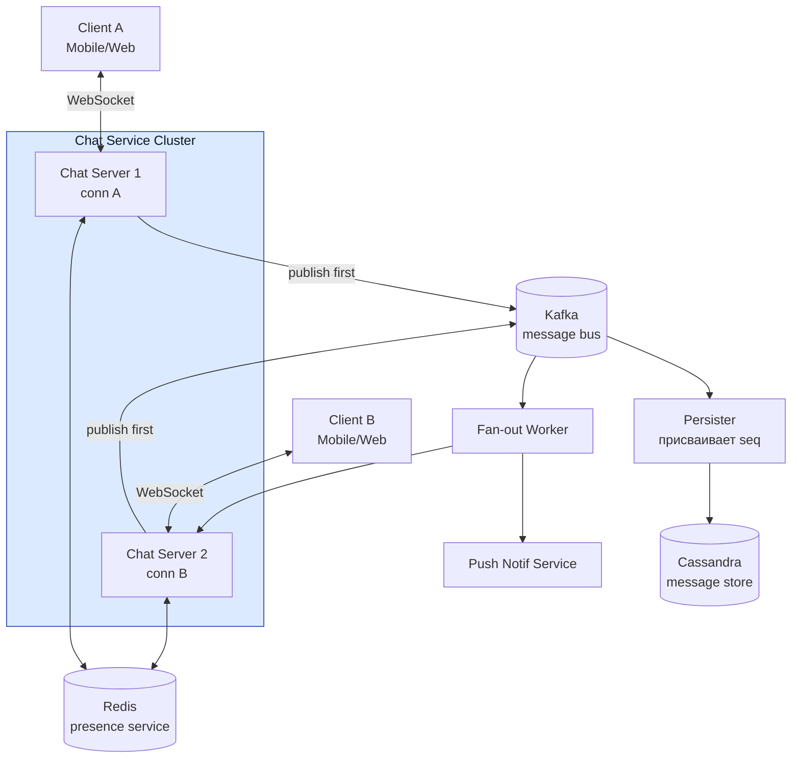

# Chat / Messaging System

## Содержание

- [Фаза 1: Уточнение требований](#фаза-1-уточнение-требований)
- [Фаза 2: Оценка нагрузки](#фаза-2-оценка-нагрузки)
- [Фаза 3: Высокоуровневый дизайн](#фаза-3-высокоуровневый-дизайн)
- [Фаза 4: Deep Dive](#фаза-4-deep-dive)
- [Сквозные потоки](#сквозные-потоки)
- [Трейдоффы](#трейдоффы)
- [Что если Chat Server падает?](#что-если-chat-server-падает)
- [Interview-ready ответ (2 минуты)](#interview-ready-ответ-2-минуты)

Разбор задачи "Спроектируй мессенджер (chat system)". Сложная задача, проверяет знание WebSocket/long-polling, fan-out в реальном времени, storage для истории и online-presence.

Отдельная прикидка для миллиона одновременных соединений, reconnect storm и
группового fan-out находится в
[WebSocket Chat at Scale: capacity drill](./04.1-websocket-chat-capacity.md).

---

## Фаза 1: Уточнение требований

### Функциональные требования

```
Кандидат: Уточняю scope — мессенджер большой.

Вопросы:
  - Личные чаты (1-on-1) или групповые тоже?
    → Оба, но группы до 500 человек
  - Реального времени (WebSocket) или asynchronous (email-like)?
    → Real-time, с доставкой "почти мгновенно"
  - Историю сообщений нужно хранить? Сколько?
    → Да, вся история, не удаляем
  - Статусы сообщений (sent/delivered/read)?
    → sent + delivered (read receipts — опционально, in scope если успеем)
  - Файлы/медиа?
    → Пока только текст; медиа — out of scope
  - Online presence ("был в сети 5 мин назад")?
    → Да, нужен
```

**Договорились (scope):**
- 1-on-1 и групповые чаты (до 500 участников)
- Real-time delivery (WebSocket)
- Полная история сообщений
- Статусы: sent, delivered, read
- Online presence
- Push notifications для offline пользователей

**Out of scope:** медиафайлы, голосовые/видео звонки, боты, реакции.

### Нефункциональные требования

```
- DAU: 50M пользователей
- Одновременно online: 10M (20% DAU)
- Latency: сообщение доставлено < 500ms при обоих online
- Message ordering: строгий порядок в рамках чата
- Durability: потеря сообщения недопустима
- Availability: 99.99% (мессенджер = критичный сервис)
- Consistency: eventual OK для статусов delivered/read
```

---

## Фаза 2: Оценка нагрузки

```
DAU = 50M
Среднее: 50 сообщений/день на пользователя
Total messages/day = 50M × 50 = 2.5B сообщений

Writes (новые сообщения):
  2.5B / 86400 ≈ 29000 msg/sec среднее
  Peak ≈ 3x = 90000 msg/sec

Одновременных WebSocket соединений: 10M
  → Это главный challenge: держать 10M persistent connections

Storage:
  1 сообщение: ~1KB (текст 500 chars + metadata)
  2.5B × 365 дней × 3 года хранения = 2.7T сообщений
  2.7T × 1KB = 2.7 PB — нужно распределённое хранилище (Cassandra)

Fan-out:
  Групповой чат 500 человек × 10 msg/min = 5000 deliveries/min на чат
  Если таких активных групп 10K → 50M deliveries/min ≈ 833K/sec
  → Нужен эффективный fan-out механизм
```

---

## Фаза 3: Высокоуровневый дизайн



### Роль каждого компонента

Сквозная идея — **stateless connection layer над durable message bus**: ноды держат только TCP-соединения, всё состояние (маршрутизация, история, presence) — во внешних хранилищах. Падение ноды теряет соединения, но не данные.

**Chat Server (WebSocket-ноды).**
*Зачем:* терминируют persistent WebSocket-соединения (~50K на ноду), валидируют, принимают/доставляют сообщения.
*Почему отдельно / stateless:* 10M соединений физически не помещаются на одну ноду; маршрутизация `user→node` вынесена в Redis, поэтому ноды взаимозаменяемы. Протокол — [networking / WebSocket](../../08-networking-and-api/protocols/04-realtime/01-websocket.md).

**Kafka (message bus).**
*Зачем:* развязывает приём сообщения и его fan-out/персист; `key=chat_id` сохраняет порядок в рамках чата.
*Почему отдельно:* при пике 90K msg/сек синхронная доставка всем участникам заблокировала бы отправителя; брокер даёт буфер и durability. См. [message brokers / Kafka](../../07-message-brokers-and-streaming/01-kafka.md).

**Cassandra (message store).**
*Зачем:* durable-история, партиционирование по `chat_id`, чтение страницами по time-ordered `message_id`.
*Почему не PostgreSQL:* 2.7 PB и write-heavy 29K msg/сек — это про Cassandra-совместимые БД. Профиль: [Cassandra](../../06-databases/database-systems-catalog/05-cassandra.md).

**Redis (presence + routing).**
*Зачем:* `user→chat_server` для адресной доставки и online-presence с TTL.
*Почему именно Redis:* нужен sub-ms доступ и естественная волатильность (TTL-протухание = «ушёл в офлайн»). Сценарии — [Redis real scenarios](../../06-databases/database-systems-catalog/08a-redis-real-scenarios.md).

**Fan-out Worker.**
*Зачем:* по `chat_id` достаёт участников, online → доставляет через их Chat Server, offline → ставит в очередь push.
*Почему отдельно:* fan-out для групп до 500 — самая тяжёлая часть; держим её асинхронной и независимо масштабируемой.

**Push Notification Service.**
*Зачем:* доставляет offline-пользователям через FCM/APNs.
*Почему переиспользуем:* это тот же сервис, что в кейсе [02. Notification Service](./02-notification-service.md) — отдельный домен со своими retry/DLQ.

---

## Фаза 4: Deep Dive

### WebSocket управление соединениями

**Проблема:** 10M одновременных соединений.

```
Одна нода держит ~50K WebSocket соединений (Go: ~10KB на goroutine × 50K = 500MB RAM)
10M / 50K = 200 нод Chat Server

Mapping: user_id → соединения. Не одна строка, а МНОЖЕСТВО:

  SADD  ws_conns:{user_id}  "chat-server-42|conn-abc"
  EXPIRE ws_conns:{user_id} 90

  У пользователя одновременно телефон, десктоп и веб — три соединения,
  возможно на трёх разных нодах. Один ключ "user → server" их не выражает
  и доставит сообщение только на одно устройство.

При подключении:
  1. LB направляет на любой Chat Server
  2. Нода добавляет себя в множество и запоминает conn-id

Пока соединение живо — TTL ПРОДЛЕВАЕТСЯ на каждом heartbeat:
  EXPIRE ws_conns:{user_id} 90

При разрыве — удаление СВОЕЙ записи, а не всего ключа:
  SREM ws_conns:{user_id} "chat-server-42|conn-abc"
```

Две ошибки, которые здесь легко допустить:

```
1. Поставить TTL и не продлевать его.
   Соединение живёт часами, а запись маршрутизации протухает через
   пять минут — пользователь остаётся подключённым, но невидимым
   для fan-out. TTL обязан обновляться heartbeat'ом, и его величина
   должна быть согласована с детектором офлайна (90 с при ping 30 с),
   а не выбираться независимо.

2. Удалять ключ целиком (DEL) при разрыве.
   Классическая гонка: клиент уже переподключился к ноде B и записал
   себя туда, после чего на ноде A срабатывает таймаут старого
   соединения и стирает запись — живой пользователь становится
   недоступен. Поэтому удаляется конкретный элемент множества,
   а не ключ; удаление своего элемента идемпотентно и безопасно.
```

**Heartbeat:**
```
Клиент → сервер: ping каждые 30 сек
Сервер: нет ping 60 сек → закрыть соединение, SREM своей записи
        каждый ping → EXPIRE ws_conns:{user_id} 90
```

---

### Message Flow (отправка сообщения)

```
Отправитель (User A, подключён к Chat-Server-1):

1. A отправляет через WebSocket:
   { "type": "send_message", "chat_id": 42, "content": "Hello!", "client_msg_id": "abc-123" }

2. Chat-Server-1:
   a. Валидация (user A — участник chat 42?)
   b. Publish в Kafka: topic=chat.messages, key=chat_id
      → ack от Kafka = сообщение принято, отправителю возвращается "sent"

3. Persister (консьюмер того же топика):
   Присваивает seq в порядке партиции и пишет в Cassandra

4. Fan-out Worker (консьюмер того же топика):
   Получить список участников chat 42
   Для каждого участника B:
     - Если B online → найти его Chat-Server через Redis → deliver
     - Если B offline → поставить в очередь push notification

5. Delivery confirmation:
   B получил → ACK → двигается watermark last_delivered_id (см. ниже)
   A получает WebSocket event со статусом
```

**Почему запись идёт в Kafka, а не в базу первой.** Порядок «сначала `INSERT` в Cassandra, потом publish в Kafka» — это классический dual-write:

```
Сервер записал сообщение в Cassandra и упал до publish.

  → сообщение лежит в истории, но никому не доставлено
    и push не ушёл: получатель узнает о нём, только открыв чат
  → отправитель при этом видел успех

Обратный порядок такой дыры не создаёт: Kafka — durable-лог,
и всё, что в него попало, будет и записано, и разослано.
Оба консьюмера читают один и тот же поток.
```

Это тот же принцип, что outbox в [11. Payment](./11-payment-system.md) и [12. Marketplace](./12-marketplace-vendor-notifications.md): одна durable-запись, из которой производится всё остальное.

---

### Message ID: порядок сообщений

**Требование:** строгий порядок в рамках чата.

```
Проблема с UUID v4: случайные, нельзя сортировать по времени.
Проблема с timestamp: миллисекунды могут совпасть.

Решение: Snowflake-подобный ID

Структура (64 бит):
  41 бит: milliseconds since epoch (69 лет)
   5 бит: datacenter_id
   5 бит: machine_id
  12 бит: sequence (4096 msg/ms на одной ноде)

  → Монотонно возрастающий В ПРЕДЕЛАХ ОДНОЙ НОДЫ
  → Уникальный
  → Можно извлечь timestamp
```

**Важная оговорка: Snowflake сам по себе НЕ даёт строгого порядка в чате.**

```
Участники одного чата подключены к разным Chat Server:
  A → Chat-Server-1 (machine_id = 1)
  B → Chat-Server-7 (machine_id = 7)

Snowflake монотонен внутри ноды, а между нодами упорядочен ровно
настолько, насколько синхронизированы их часы. При расхождении
даже в десятки миллисекунд ответ B может получить id МЕНЬШЕ,
чем у сообщения A, на которое он отвечает.

То есть требование «строгий порядок в рамках чата» этим способом
не выполняется — только «примерно по времени».
```

**Как получить настоящий порядок.** Источником истины делаем не часы, а партицию Kafka: все сообщения чата идут с `key=chat_id`, то есть в одну партицию и в строгом порядке. Persister, читая её, присваивает монотонный `seq` в пределах чата:

```
chat_id=42, partition offset 1001 → seq 5001
chat_id=42, partition offset 1002 → seq 5002

Порядок определяется тем, кто раньше попал в лог,
а не тем, у кого точнее часы.
```

Тогда роли разделяются так:

| Идентификатор | Кто присваивает | Для чего |
|---|---|---|
| `client_msg_id` | клиент | дедупликация ретраев отправки |
| `message_id` (Snowflake) | Chat Server | глобальная уникальность, грубая сортировка по времени |
| `seq` | Persister из порядка партиции | **строгий порядок внутри чата**, курсор пагинации |

**Альтернатива:** `TIMEUUID` в Cassandra — тоже time-ordered, но упирается ровно в ту же проблему часов на разных нодах. Она решает уникальность, а не согласованность порядка.

---

### Хранилище сообщений (Cassandra)

> Если в других материалах встретится **ScyllaDB** — это та же Cassandra, переписанная на C++ и совместимая с ней по протоколу CQL и модели данных. Дизайн от замены не меняется, отличается только реализация движка (меньше узлов на ту же нагрузку). Пример такой миграции — история Discord в [highload-design-patterns](../highload-design-patterns.md).

**Почему не PostgreSQL?**
- 2.7 PB данных → шардирование обязательно, Cassandra для этого и создана
- Write-heavy workload (29K msg/sec)
- Partitioning по chat_id даёт locality для пагинации истории

```sql
-- Cassandra CQL schema
CREATE TABLE messages (
  chat_id     UUID,
  message_id  TIMEUUID,      -- time-ordered, уникальный
  sender_id   BIGINT,
  content     TEXT,
  status      TINYINT,       -- 1=sent, 2=delivered, 3=read
  created_at  TIMESTAMP,
  PRIMARY KEY (chat_id, message_id)
) WITH CLUSTERING ORDER BY (message_id DESC)
  AND compaction = {'class': 'LeveledCompactionStrategy'}
  AND gc_grace_seconds = 864000;
```

**Чтение истории:**
```sql
-- Последние 50 сообщений
SELECT * FROM messages WHERE chat_id = ? ORDER BY message_id DESC LIMIT 50;

-- Пагинация (загрузить старее)
SELECT * FROM messages WHERE chat_id = ? AND message_id < ? ORDER BY message_id DESC LIMIT 50;
```

**Hot partition problem:**
- Активный чат с 500 участниками = много writes в одну partition
- Решение: partition key = (chat_id, bucket) где bucket = message_id / 1000 (сегментирование по времени)

---

### Fan-out для групповых чатов

**Для маленьких групп (< 100 человек): push at send time**
```
При отправке → сразу доставить всем N участникам
При 100 × 29K msg/sec = 2.9M deliveries/sec → нагрузка управляема
```

**Для больших групп (100-500 человек): pull + inbox**
```
Проблема: 500 участников × 90K peak msg/sec = 45M deliveries/sec → слишком много

Решение: inbox model
  1. Сообщение сохраняется в messages table
  2. В user_inbox_{user_id} пишется только pointer: { chat_id, message_id }
     (не полное сообщение)
  3. Клиент при подключении загружает inbox → fetches messages by chat_id/message_id
  4. WebSocket event для online пользователей: { "type": "new_message", "chat_id", "message_id" }
     → клиент сам делает fetch
```

---

### Online Presence

```
Хранение:
  Redis: HSET presence:{user_id} status "online" last_seen {timestamp}
  TTL: 60 сек (обновляется heartbeat)

  При heartbeat от клиента:
    HSET presence:{user_id} status "online" last_seen {now}
    EXPIRE presence:{user_id} 60

  При disconnect:
    DEL presence:{user_id}
    → или: HSET presence:{user_id} status "offline" last_seen {now} (для "был N мин назад")

Запрос presence:
  GET presence:{user_id} → { status: "online" } или null (offline)

Для групп (присутствие 500 человек):
  MGET presence:{u1} presence:{u2} ... presence:{u500}
  → пайплайн Redis, ~1-2ms

Масштабирование:
  10M online users × ~100 bytes = 1GB в Redis
  Легко, один Redis достаточен (+ replica)
```

---

### Push Notifications для offline пользователей

```
Fan-out Worker:
  Если recipient offline (нет в Redis presence):
    → отправить событие в Kafka: topic=notifications.push
    → Push Notification Service (см. кейс ./02-notification-service.md — fan-out, retry, DLQ)
       → FCM/APNs с payload:
          { "type": "new_message", "chat_id": X, "sender": "Alice", "preview": "Hello..." }
```

---

### Статусы доставки и прочтения: watermark, а не запись на сообщение

Наивный вариант «хранить статус каждого сообщения для каждого получателя» не выдерживает арифметики:

```
Сообщение в группе на 500 человек = 500 записей статуса
При 833K доставок/с статусы дают БОЛЬШЕ записи, чем сами сообщения

2,5 млрд сообщений/сутки × среднее число получателей
→ поток статусов на порядок превышает поток контента
```

Поэтому статус хранится как **watermark — одна строка на пару (чат, пользователь)**, а не на каждое сообщение:

```sql
CREATE TABLE chat_cursors (
  chat_id            UUID,
  user_id            BIGINT,
  last_delivered_seq BIGINT,   -- докуда доставлено
  last_read_seq      BIGINT,   -- докуда прочитано
  updated_at         TIMESTAMP,
  PRIMARY KEY (chat_id, user_id)
);
```

```
Клиент при получении:  { "type": "ack",       "chat_id": 42, "up_to_seq": 5007 }
Клиент при прочтении:  { "type": "mark_read", "chat_id": 42, "up_to_seq": 5007 }

Сервер двигает watermark вперёд (только вперёд, назад не откатываем)
и уведомляет отправителя: { "type": "read_receipt", "user_id": B, "up_to_seq": 5007 }
```

Запись на пользователя в чате одна и обновляется, а не растёт. Отсюда же дешёвый счётчик непрочитанного: `unread = last_seq_в_чате − last_read_seq`, без пересчёта по сообщениям.

Здесь и виден смысл монотонного `seq` из предыдущего раздела: watermark работает только на строго упорядоченной шкале. По Snowflake с разных нод «докуда прочитано» определить нельзя.

---

### Reconnect и missed messages

```
При reconnect клиент отправляет:
  { "type": "sync", "last_seen_message_id": "XYZ" }

Server:
  Для каждого чата пользователя:
    SELECT * FROM messages WHERE chat_id = ? AND message_id > 'XYZ' LIMIT 100
  → Вернуть пропущенные сообщения
```

---

## Сквозные потоки

**1. Доставка при обоих online.**
A шлёт по WebSocket → Chat-Server-1 валидирует и публикует в Kafka (`key=chat_id`) → ack от Kafka, отправителю «sent» → Persister присваивает `seq` в порядке партиции и пишет в Cassandra, Fan-out Worker параллельно находит соединения B через Redis и доставляет → B шлёт ACK → двигается `last_delivered_seq`, A видит статус.
*Итог:* сообщение durable до любой обработки; порядок в чате задаёт порядок партиции, а не часы отправляющей ноды.

**2. Получатель offline.**
Fan-out Worker не находит B в Redis presence → событие в `notifications.push` → Push Service шлёт FCM/APNs.
*Итог:* сообщение уже в Cassandra; пользователь догрузит его при следующем подключении, push лишь будит клиент.

**3. Reconnect и пропущенные сообщения.**
Нода упала / клиент потерял сеть → reconnect с exponential backoff на любую ноду → `sync { last_seen_message_id }` → `SELECT ... WHERE message_id > X` по чатам → отдать пропущенное.
*Итог:* in-memory соединения потеряны, данные — нет; клиент детерминированно доезжает до актуального состояния.

**4. Read receipt.**
Клиент `mark_read { up_to_seq }` → двигается `last_read_seq` в `chat_cursors` → уведомить отправителя через WebSocket.
*Итог:* статусы eventual-consistent (по требованиям допустимо), отдельная таблица не нагружает горячий путь записи сообщений.

---

## Трейдоффы

| Решение | Принятое | Альтернатива | Причина |
|---|---|---|---|
| Протокол | WebSocket | Long-polling, SSE | Bidirectional, persistent |
| Порядок записи | Сначала Kafka, потом БД | Сначала БД, потом Kafka | Обратный порядок = dual-write: сообщение сохранено, но не доставлено |
| Порядок в чате | `seq` из порядка партиции | Snowflake / TIMEUUID | Часы разных нод не дают строгого порядка |
| Хранилище | Cassandra | PostgreSQL + sharding | Built-in partitioning, write throughput |
| Message ID | Snowflake | UUID v4 | Уникальность и грубая сортировка по времени |
| Статусы | Watermark на (чат, юзер) | Запись на сообщение × получателя | В группе 500 человек статусов больше, чем сообщений |
| Маршрутизация соединений | Set с TTL, продлеваемым heartbeat | Один ключ user→server | Мультидевайс; DEL при разрыве ломает переподключение |
| Fan-out большие группы | Pull (inbox pointer) | Push всем | Контроль write amplification |
| Presence | Redis TTL | DB с polling | Latency < 1ms, volatility OK |

---

## Что если Chat Server падает?

```
10M соединений на 200 нод → ~50K соединений на ноду.
Нода падает:
  1. 50K клиентов теряют соединение
  2. Клиенты начинают reconnect (exponential backoff: 1s, 2s, 4s, ...)
  3. LB направляет на другие ноды
  4. При reconnect: sync пропущенных сообщений через Kafka/Cassandra

Важно: никаких in-memory state для соединений — только routing в Redis.
  Все сообщения персистентно в Cassandra/Kafka.
  → Падение ноды = потеря in-flight соединений, не данных.
```

---

## Interview-ready ответ (2 минуты)

> "Мессенджер — это два главных challenge: 10M persistent WebSocket соединений и эффективный fan-out для групп.
>
> WebSocket: 200+ нод, каждая держит ~50K соединений. Routing user→node через Redis — любая нода знает, на каком сервере подключён пользователь. Heartbeat каждые 30 секунд, падение ноды → клиенты переподключаются + sync пропущенных сообщений.
>
> Порядок записи важен: сначала publish в Kafka, и только потом персист и fan-out из этого же лога. Обратный порядок — сначала в базу, потом в брокер — это dual-write: при падении между ними сообщение окажется в истории, но никому не доставленным, а отправитель увидит успех.
>
> Отдельно оговорю порядок сообщений. Snowflake сам по себе строгого порядка в чате не даёт: участники сидят на разных нодах, и при расхождении часов ответ может получить id меньше, чем у сообщения, на которое отвечают. Поэтому источником порядка беру партицию Kafka — все сообщения чата идут с key=chat_id, и persister присваивает монотонный seq по порядку лога. Snowflake остаётся для уникальности, seq — для порядка и курсора пагинации.
>
> Storage: Cassandra, partitioned по chat_id, clustered по seq. Write throughput 30K msg/sec, объём ~2.7 PB за 3 года — wide-column хранилища для такого и созданы.
>
> Статусы доставки и прочтения храню как watermark — одна строка на пару чат-пользователь с last_delivered_seq и last_read_seq. Запись на каждое сообщение для каждого получателя не выдержала бы арифметики: в группе на 500 человек статусов получается больше, чем самих сообщений.
>
> Fan-out: для малых групп (< 100) — push всем при отправке. Для больших — inbox model: храним только pointer, клиент сам тянет сообщение при получении события.
>
> Presence через Redis с TTL — не база данных. Offline → push notification через тот же Notification Service.
>
> Ordering: Snowflake ID, монотонно возрастающий в рамках ноды, сортируется без дополнительного поля."
