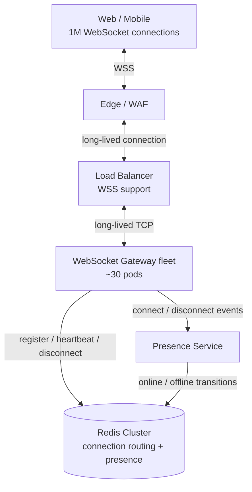
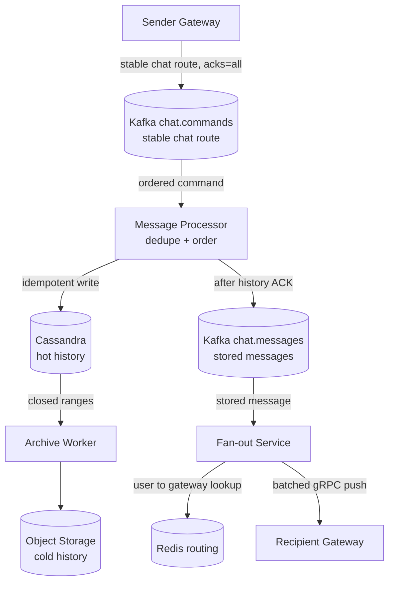

# WebSocket Chat at Scale: capacity drill

## Содержание

- [Что проверяет разбор](#что-проверяет-разбор)
- [Фаза 1: требования и допущения](#фаза-1-требования-и-допущения)
- [Фаза 2: оценка нагрузки](#фаза-2-оценка-нагрузки)
- [Фаза 3: высокоуровневый дизайн](#фаза-3-высокоуровневый-дизайн)
- [Фаза 4: deep dive](#фаза-4-deep-dive)
- [Стены и решения](#стены-и-решения)
- [Трейдоффы](#трейдоффы)
- [Фаза 5: финал](#фаза-5-финал)
- [Interview-ready answer](#interview-ready-answer)
- [Связанные материалы](#связанные-материалы)

Это companion-разбор к [Chat / Messaging System](./04-chat-messaging.md). Основной
кейс задаёт API и гарантии: durable acceptance, application-level dedupe,
порядок, history, receipts и multi-device sync. Здесь они не проектируются
заново — тренируется capacity planning для миллиона постоянных
WebSocket-соединений, группового fan-out, reconnect storm, маршрутизации и
tiered storage.

---

## Что проверяет разбор

Одна цифра «1M concurrent users» создаёт несколько независимых нагрузок:

| Измерение | Что ограничивает систему |
| --- | --- |
| Открытые WebSocket | Память, файловые дескрипторы и радиус поражения gateway |
| Входящие сообщения | Kafka partitions и скорость durable persistence |
| Доставки получателям | Fan-out workers, сеть и поиск connection routing |
| Heartbeats | Redis operations и ложные переходы online/offline |
| История | Cassandra capacity, compaction и срок hot-retention |

Главная ошибка — выбрать число серверов только по памяти. Нода может вместить
сотни тысяч idle-соединений, но её падение одновременно отправит столько же
клиентов на reconnect.

---

## Фаза 1: требования и допущения

### Функциональный scope

- Личные и групповые чаты до 10 000 участников.
- Доставка новых сообщений через WebSocket.
- История сохраняется и дочитывается после reconnect.
- Пользователь может подключить несколько устройств.
- Presence показывает online/offline, но не является источником истины для сообщений.

### Нефункциональные требования

```text
зарегистрированных пользователей:  10 млн
одновременно online:                1 млн
внутрирегиональная доставка:        p99 < 100 мс
online transition:                  < 5 с после connect
offline после аварийного обрыва:    < 60 с
hot history:                        30 дней
canonical event processing:         at-least-once
WebSocket delivery:                 best effort + cursor sync
ordering:                           строгий в history/UI, transport может reorder
```

Требования к presence разделены намеренно. Явный connect/disconnect виден быстро,
но обнаружить умершее устройство за 5 секунд при heartbeat раз в 30 секунд
невозможно. Если бизнес требует именно пятисекундный crash detection, период
heartbeat придётся уменьшить примерно до двух секунд, что даст около 500 000
heartbeat updates/с только для миллиона соединений.

### Допущения для расчёта

```text
сообщений на online-пользователя:  5 в минуту
средний message payload:           300 B
WebSocket event с envelope:        400 B
Kafka record с envelope:           500 B
persisted history row:              500 B
connection footprint:              20 KB, гипотеза для benchmark
репликация Kafka/Cassandra:         factor 3
```

`20 KB` на соединение не является гарантией Go или WebSocket-библиотеки. Сюда
условно включены goroutine stack, read/write buffers, TLS и connection state;
реальное значение измеряется на выбранной реализации вместе с GC и пиковыми
буферами.

---

## Фаза 2: оценка нагрузки

### Соединения и радиус поражения

```text
1 000 000 connections × 20 KB
  ≈ 20 GB connection memory на весь gateway-флот

30 gateway-подов:
1 000 000 / 30 ≈ 33 300 connections на pod
33 300 × 20 KB ≈ 666 MB connection memory на pod
```

Из этого не следует, что pod должен иметь ровно `666 MB`: приложение, runtime,
метрики, временные buffers и запас под GC требуют дополнительной памяти. Число
30 выбрано как стартовая гипотеза по blast radius: падение одного pod вызывает
около 33 000 reconnect, а не 500 000.

Ограничение `65 535 connections` к принимающей стороне не относится. Лимит
эфемерных портов ограничивает исходящие соединения к одной паре адресов; сервер
ограничивают память, CPU, сеть и file descriptors.

### Сообщения

```text
1 000 000 online × 5 сообщений/мин / 60
  ≈ 83 333 сообщений/с в среднем

условный пик ×5:
  ≈ 416 667 сообщений/с
```

Пиковый коэффициент — допущение, которое нужно заменить данными production или
нагрузочного профиля.

### Fan-out deliveries

Проверим отдельный stress-сценарий: из общего потока 100 сообщений/с приходят в
100 больших групп по 10 000 участников, остальные сообщения — личные.

```text
личные:
(83 333 - 100) × 1 ≈ 83 233 deliveries/с

большие группы:
100 сообщений/с × 10 000 получателей = 1 000 000 deliveries/с

всего в среднем:
83 233 + 1 000 000 ≈ 1,083 млн deliveries/с

условный пик ×5:
≈ 5,42 млн deliveries/с
```

Отправитель формально тоже входит в группу, поэтому `10 000` — небольшая верхняя
оценка вместо `9 999`.

### Исходящий трафик

```text
5,42 млн deliveries/с × 400 B
  ≈ 2,17 GB/с
  ≈ 17,3 Gbit/с на gateway-флот

при 30 pod:
2,17 GB/с / 30 ≈ 72 MB/с ≈ 580 Mbit/с на pod
```

Это payload-оценка без TCP/TLS overhead, retransmits и heartbeat traffic.
Итоговая network capacity берётся из benchmark и должна переживать потерю pod.

### Хранение

Для накопления используем средний поток, а не пик:

```text
83 333 сообщений/с × 86 400
  ≈ 7,2 млрд сообщений/день

7,2 млрд × 500 B
  ≈ 3,6 TB/день persisted history до репликации

replication factor 3:
  ≈ 10,8 TB/день

30 дней hot history:
10,8 × 30 ≈ 324 TB
```

Если benchmark и operational policy допускают около `4 TB` полезных данных на
Cassandra-ноду уже после запаса под compaction и repair:

```text
324 TB / 4 TB = 81 storage-нода
```

`81` — результат конкретного допущения, а не готовый размер кластера. Число
реплик, диски, compaction strategy, repair window и отказ домена проверяются
отдельно. История старше 30 дней уходит в Object Storage.

---

## Фаза 3: высокоуровневый дизайн

### Connection plane

Эта схема отвечает только за lifecycle соединения: куда подключён пользователь и
как система узнаёт его online/offline state.



L4-балансировщик не является обязательным условием WebSocket. Подойдёт и L7
load balancer, если он поддерживает HTTP Upgrade/WSS, достаточные idle timeouts
и корректный connection draining. Выбор делается по возможностям платформы,
наблюдаемости и стоимости, а не по правилу «WebSocket работает только на L4».

### Message и history plane

Эта схема показывает один durable message flow. `Redis routing` уже заполнен
Gateway-событиями из первой схемы.



`chat.commands` является durable intake log. Gateway подтверждает
`command_received` только после `acks=all`. Message Processor использует
application-level idempotency из основного кейса, пишет Cassandra и лишь затем
публикует `MessageStored`. Поэтому live delivery не обгоняет history, а повтор
после timeout не создаёт второе логическое сообщение.

---

## Фаза 4: deep dive

### 4.1 Где живёт WebSocket

После HTTP Upgrade соединение часами остаётся на одном Gateway. Cookie-based
sticky sessions ничего не добавляют: конкретный TCP connection уже привязан к
pod. Системе нужна обратная маршрутизация `user_id → active connections`, чтобы
Fan-out Service нашёл Gateway каждого устройства.

Gateway хранит только connection-local state. После падения клиенты подключаются
к другим pod с exponential backoff и jitter, затем запрашивают сообщения после
последнего подтверждённого `seq`.

### 4.2 Multi-device routing и presence

Один пользователь может иметь несколько соединений, поэтому routing хранится как
sorted set с отдельным временем жизни каждого member:

```text
ZADD ws:route:{user_id} <expires_at> "gw-7|conn-a"
ZADD ws:route:{user_id} <expires_at> "gw-9|conn-b"

ZREMRANGEBYSCORE ws:route:{user_id} -inf <now>
ZRANGEBYSCORE    ws:route:{user_id} <now> +inf
```

Общий TTL на Set неверен: heartbeat ноутбука продлит весь key и оставит мёртвое
соединение телефона. Disconnect удаляет только собственный member, а heartbeat
обновляет только его score.

При среднем времени connection в один час миллион активных соединений создаёт
примерно `1 000 000 / 3 600 ≈ 278` starts и столько же disconnects в секунду.
Heartbeats раз в 30 секунд дают уже около `33 333 updates/с`. Эти потоки нельзя
смешивать с 5,42 млн deliveries/с.

Fan-out не делает Redis lookup для каждой delivery. Он держит локальный cache,
обновляемый connect/disconnect events, использует pipeline для cache misses и
группирует получателей по Gateway. Pipeline убирает лишние network round-trips,
но не превращает 10 000 lookup в одну Redis-операцию.

Stale route может отправить batch на старый Gateway. Это допустимо: обработка
канонического события работает at-least-once, но сам WebSocket transport остаётся
best effort. Клиент дедуплицирует повтор по `message_id`, обнаруживает gap через
`prev_message_seq` и после reconnect дочитывает durable history.

После восстановления Redis каждый Gateway пакетно регистрирует свой локальный
registry активных sockets. Rate limit и jitter растягивают миллион recovery
writes; обычные heartbeats завершают self-healing. Этот burst проверяется
отдельным нагрузочным сценарием вместе с reconnect storm.

### 4.3 Порядок и Kafka partitions

Все команды чата публикуются по стабильному routing bucket и попадают в одну
Kafka partition. Message Processor использует offset первой команды логического
сообщения как `seq`. Он монотонен для чата, хотя между соседними сообщениями
возможны gaps из-за других чатов, membership-команд и дедуплицированных retry.
Каноническое событие также содержит `prev_message_seq`, чтобы клиент отличил
сетевую перестановку от допустимого числового gap и при необходимости запустил
sync. Полный client protocol разобран в основном кейсе.

Message Processor переносит `seq` в canonical event, и Fan-out видит тот же
ordering token, который уже записан в history. Изменять число partitions на месте
опасно: hash routing чата изменится, и новые offset перестанут продолжать прежний
порядок. Существующий чат оставляют на прежнем virtual bucket; новые buckets или
новая topic generation назначаются новым чатам. Перенос существующего чата
потребовал бы отдельного ordering epoch в cursor и storage key.

Топик или partition на каждый чат не подходит: чатов миллионы, а Kafka partitions
являются operational resource. Стартовые `128 partitions` можно использовать как
гипотезу для benchmark:

```text
416 667 сообщений/с / 128
  ≈ 3 255 сообщений/с на partition при равномерном распределении
```

Финальное число определяется измеренной capacity partition и нужным consumer
parallelism, а не этой арифметикой в одиночку.

### 4.4 Почему Gateway не читает Kafka напрямую

В одной consumer group Kafka отдаёт partition только одному consumer. Если каждый
Gateway создать в собственной consumer group канонического топика, каждый из 30
pod будет читать весь пиковый поток:

```text
416 667 records/с × 30
  ≈ 12,5 млн broker reads/с
```

Поэтому `chat.messages` читает отдельный Fan-out Service. Он находит routes,
группирует получателей по Gateway и отправляет один batched gRPC request на
Gateway вместо отдельного вызова на каждого пользователя. Вызовы разных Gateway
выполняются с bounded parallelism, а порядок одного `(chat_id, connection_id)`
сохраняется.

Gateway отвечает после помещения frames в bounded outgoing queues, а не после
клиентского ACK. Fan-out коммитит наибольший непрерывно обработанный Kafka offset
после успешного batch, фиксации offline/push path либо исчерпания коротких
RPC-retry. Долгий live-retry не удерживает partition: пропуск восстанавливается
из history. Если Fan-out упал до commit, Kafka повторит событие, а клиент уберёт
дубль по `message_id`.

### 4.5 Горячие группы

Группа на 10 000 участников и 10 сообщений/с создаёт:

```text
10 × 10 000 = 100 000 deliveries/с
```

Kafka partition получает только 10 records/с; горячей становится не запись, а
fan-out. Consumer partition быстро создаёт задания по batches получателей, а
отдельный bounded worker pool выполняет доставку. Rate limit на большую группу и
приоритет личных сообщений не дают одному каналу занять весь delivery fleet.

### 4.6 Backpressure и сохранность

Kafka сглаживает короткий пик, но не создаёт бесконечную ёмкость. Retention
удаляет старые records независимо от lag consumer, поэтому Message Processor
должен стабильно обрабатывать больше среднего входящего потока, а его lag входит
в paging и alerts.

При перегрузке система сохраняет разные пути по-разному:

- Persistence — не отбрасывается; acceptance throttling начинается до исчерпания retention.
- Realtime delivery — может деградировать первой; клиент восстановит gaps из history.
- Presence — может стать более stale, не влияя на сообщения.
- Большие группы — получают отдельный rate limit и очередь.

### 4.7 Multi-region

Для строгого порядка у chat есть `home_region`: все writes одного чата проходят
через его Kafka cluster. Пользователь из другого региона может держать WebSocket
локально, но отправка проходит межрегиональный round-trip до home region.

Одновременно обещать локальную запись в каждом регионе, единый строгий порядок и
`p99 < 100 мс` между континентами нельзя. Альтернатива — active-active writes с
последующим merge, но тогда порядок становится eventual и нужен conflict protocol.

---

## Стены и решения

| Стена | Симптом | Решение |
| --- | --- | --- |
| Gateway blast radius | Падение pod создаёт reconnect storm | Ограничить connections на pod, client backoff + jitter, держать запас fleet capacity |
| Route lookup | Миллионы Redis reads/с | Локальный cache, pipeline misses, batch delivery по Gateway |
| Hot group | Один message создаёт 10 000 deliveries | Bounded fan-out workers, per-group rate limit, отдельный приоритет |
| Message Processor lag | Consumer приближается к Kafka retention | Admission control, lag alerts, запас write capacity |
| Presence / route recovery storm | Heartbeats, reconnect или re-registration перегружают Redis | Sharded ZSET, jitter, rate limit, отдельные budgets routing/presence |
| Partition change | Один chat попадает в новую partition | Topic generation или стабильные virtual buckets |
| Cross-region order | Локальные writes расходятся | Home region либо явная eventual merge policy |

---

## Трейдоффы

| Выбор | Альтернатива | Почему и чем платим |
| --- | --- | --- |
| Kafka-first intake | Синхронная запись Cassandra | Команда переживает Gateway, но `sent` появляется только после history write |
| Central Fan-out Service | Kafka consumer на каждом Gateway | Нет умножения broker reads на число Gateway, но появляется отдельный delivery fleet |
| Local route cache | Redis lookup на delivery | Снимает миллионы операций, но допускает stale route и повтор доставки |
| Kafka offset как seq | Отдельный per-chat counter | Нет hot counter, но seq имеет gaps и требует стабильного partition routing |
| Push fan-out | Pull только при открытии | Быстрый realtime ценой write/network amplification для групп |
| Home region | Active-active writes | Строгий порядок ценой межрегиональной latency |
| 30 дней hot history | Вся история в Cassandra | Ограничивает рост дорогого кластера, но cold reads медленнее |

---

## Фаза 5: финал

### Capacity summary

```text
Gateway:
  1M connections / 30 ≈ 33,3K connections на pod
  ≈ 666 MB connection-only memory на pod при допущении 20 KB
  CPU, полный memory limit и число pod подтверждаются benchmark

Kafka:
  peak ingress ≈ 416,7K records/с
  один topic: 416,7K × 500 B ≈ 208 MB/с application writes
  intake + canonical topic      ≈ 416 MB/с application writes
  replication factor 3         ≈ 1,25 GB/с broker replica writes
  128 partitions → стартовая гипотеза, не финальный sizing

Redis:
  память зависит от реального размера key/member и числа устройств
  heartbeat workload ≈ 33,3K updates/с
  sizing определяют heartbeat и cache-miss operations, а не память

Cassandra:
  ≈ 324 TB на 30 дней с replication factor 3
  ≈ 81 нода только при измеренных 4 TB usable capacity на ноду
```

### Двухминутное резюме

> Миллион WebSocket-соединений масштабируется не только памятью. При допущении
> 20 KB на connection весь fleet держит около 20 GB connection state, но число
> Gateway выбираю по blast radius: при 30 pod падение одного переподключает около
> 33 тысяч клиентов. Reconnect использует backoff и jitter.
>
> Один миллион online-пользователей по пять сообщений в минуту создаёт около
> 83 тысяч messages/с в среднем и 417 тысяч в условный пик. Большие группы
> поднимают fan-out примерно до 5,42 млн deliveries/с, поэтому routing кешируется
> локально, а отправки группируются по Gateway.
>
> Gateway принимает command в Kafka с `acks=all`; стабильный routing bucket даёт
> единый partition order, а offset первой команды служит seq. Message Processor
> дедуплицирует retry, пишет Cassandra и только затем публикует canonical event.
> Fan-out Service группирует соединения по Gateway и отправляет bounded-parallel
> batches. ACK Gateway означает помещение frame в ограниченную in-memory queue,
> а не получение устройством. Persistence нельзя отбрасывать при lag, WebSocket
> delivery остаётся best effort, а gaps восстанавливаются из history.
>
> Hot history за 30 дней занимает около 324 TB с тройной репликацией и затем
> переносится в Object Storage. Конкретное число Gateway, brokers, Redis и
> Cassandra nodes определяет benchmark полного mixed workload, а не универсальный
> предел технологии.

---

## Interview-ready answer

**1. Почему число Gateway нельзя вывести только из памяти?**

- Главный риск — падение большой ноды одновременно переподключает всех её клиентов.
- Capacity — memory, CPU, network и file descriptors проверяются вместе.
- Выбор — connections на pod ограничиваются допустимым reconnect blast radius.

**2. Как доставить сообщение нужному WebSocket Gateway?**

- Routing — Redis хранит несколько active connections пользователя с отдельным expiry.
- Fast path — Fan-out Service использует локальный cache routes.
- Delivery — получатели группируются по Gateway и отправляются bounded-parallel batches; Kafka offset не ждёт ACK конечного устройства.

**3. Откуда берётся порядок сообщений?**

- Partitioning — все commands чата идут по одному стабильному routing bucket.
- Sequence — offset первой логической команды монотонен внутри чата и допускает gaps.
- Recovery — `prev_message_seq` отличает сетевую перестановку от числового gap Kafka offset и запускает sync.
- Resharding — существующий chat остаётся на прежнем virtual bucket; миграция требует ordering epoch.

**4. Что происходит с горячей группой?**

- Amplification — 10 messages/с на 10 000 участников дают 100 000 deliveries/с.
- Изоляция — partition consumer создаёт batches, а bounded worker pool выполняет fan-out.
- Защита — per-group rate limit сохраняет capacity для личных сообщений.

**5. Что можно отбросить при перегрузке?**

- Persistence — не отбрасывается, иначе сообщение исчезнет из history.
- Realtime — может задержаться или потеряться; клиент дочитает gap после reconnect.
- Presence — может временно стать stale без потери сообщений.

**6. Как выбирать число узлов?**

- Среднее — используется для накопления storage.
- Пик — используется для network, broker и worker capacity.
- Benchmark — проверяет mixed workload, failure headroom и p99, после чего выводится число узлов.

---

## Связанные материалы

- [Chat / Messaging System](./04-chat-messaging.md) — полный функциональный разбор
- [Highload Design Patterns](../highload-design-patterns.md) — каталог использованных приёмов
- [Kafka](../../07-message-brokers-and-streaming/01-kafka.md)
- [Redis](../../06-databases/database-systems-catalog/08-redis.md)
- [WebSocket](../../08-networking-and-api/protocols/04-realtime/01-websocket.md)
- [Cassandra](../../06-databases/database-systems-catalog/05-cassandra.md)
