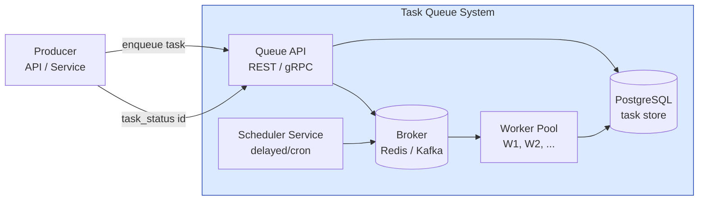

# Distributed Task Queue

## Содержание

- [Фаза 1: Уточнение требований](#фаза-1-уточнение-требований)
- [Фаза 2: Оценка нагрузки](#фаза-2-оценка-нагрузки)
- [Фаза 3: Высокоуровневый дизайн](#фаза-3-высокоуровневый-дизайн)
- [Фаза 4: Deep Dive](#фаза-4-deep-dive)
- [Сквозные потоки](#сквозные-потоки)
- [Трейдоффы](#трейдоффы)
- [Что если Redis падает?](#что-если-redis-падает)
- [Interview-ready ответ (2 минуты)](#interview-ready-ответ-2-минуты)

Разбор задачи "Спроектируй распределённую очередь задач" (job queue, background processing system). Аналоги: Celery, Sidekiq, BullMQ, Temporal. Проверяет понимание at-least-once delivery, idempotency, dead letter queues, scheduling.

---

## Фаза 1: Уточнение требований

### Функциональные требования

```
Кандидат: Уточняю — task queue может означать разные вещи.

Вопросы:
  - Это просто очередь задач (fire-and-forget) или нужен workflow (цепочки задач)?
    → Пока одиночные задачи, без DAG
  - Нужно ли расписание (cron-like: "запускать каждый час")?
    → Да, delayed tasks ("запустить через 30 мин") и recurring ("каждые 5 мин")
  - Приоритеты у задач?
    → Да, три уровня: high/normal/low
  - Retry при ошибке?
    → Да, с конфигурируемой стратегией (max attempts, backoff)
  - Нужен UI для мониторинга задач?
    → Статусы через API, UI — out of scope
  - Нужна ли гарантия exactly-once?
    → at-least-once + idempotent workers (пользователь обеспечивает идемпотентность)
```

**Договорились (scope):**
- Enqueue task → worker picks up → executes → reports result
- Delayed tasks (schedule at time T)
- Recurring tasks (cron expression)
- Priority: high/normal/low
- Retry с exponential backoff + max attempts
- Dead Letter Queue для необработанных задач
- Task status tracking (queued/running/done/failed)
- At-least-once delivery

**Out of scope:** workflow/DAG, task dependencies, distributed tracing (интеграция — ок, design — нет), UI dashboard.

### Нефункциональные требования

```
- Throughput: 10K tasks/sec enqueue; 5K tasks/sec execution
- Latency: задача начинается в пределах 1 сек после enqueue (для high priority)
- Durability: задача не теряется при падении любого компонента
- Availability: 99.9%
- Scale: воркеры масштабируются горизонтально
- Task isolation: один медленный/крашащий worker не влияет на остальных
```

---

## Фаза 2: Оценка нагрузки

Первое, что нужно проверить, — сходится ли приём с обработкой:

```
Enqueue  10K задач/с — это ПИК, не среднее
Execute   5K задач/с — устойчивая пропускная способность

Если 10K/с держится постоянно, очередь растёт на 5K задач/с:
  5 000 × 86 400 ≈ 432 млн задач backlog за сутки
  → это не «нагрузка», это неработающая система

Значит согласуем: 5K/с в среднем, 10K/с в пике на десятки минут.
Пик поглощается очередью, разбирается за счёт запаса воркеров.
```

Дальше считаем воркеров через закон Литтла (`параллелизм = поток × длительность`):

```
Длительность задачи сильно разная — считать надо по классам:

  быстрые (~1 с):   4K/с × 1 с   = 4 000 одновременных
  медленные (~60 с): 1K/с × 60 с = 60 000 одновременных
                                   ─────────────────────
                                   ~64 000 конкурентных задач

При 50 goroutine на под → ~1 300 подов
```

Отсюда важный вывод: **пул должен быть не один.** Медленные задачи при общем пуле съедят все слоты, и быстрые встанут в очередь за ними — классическая проблема head-of-line blocking. Нужны раздельные пулы по классам длительности (см. [reliability / bulkhead](../reliability-patterns/07-bulkhead.md)).

```
Хранилище активных задач:
  одна задача ~5 KB (payload + metadata)
  64 000 in-flight × 5 KB ≈ 320 MB — свободно умещается в Redis

История выполненных:
  5K/с × 86 400 = 432 млн задач/сутки
  432 млн × 7 дней × 5 KB ≈ 15 TB

  Но хранить в истории ПОЛНЫЙ payload не нужно: после выполнения он
  бесполезен. Оставляем метаданные (id, type, статус, тайминги, ошибка)
  ~500 B → ~1,5 TB, а payload обнуляем при переводе в терминальный статус.

  → активные задачи в Redis, живые записи в PostgreSQL,
    история старше нескольких дней — в ClickHouse или S3
```

---

## Фаза 3: Высокоуровневый дизайн



### Роль каждого компонента

Сквозная идея — **durable source of truth (PostgreSQL) + быстрый dispatch (Redis Streams)**: задача сначала фиксируется надёжно, потом раздаётся быстро; at-least-once обеспечивает PEL/XACK, а корректность повторов — идемпотентные воркеры.

**Queue API (REST / gRPC).**
*Зачем:* приём enqueue, запрос статуса; двойная запись — INSERT в PostgreSQL, затем XADD в Redis.
*Почему отдельно:* единая точка с валидацией и идемпотентностью enqueue; источники не работают с брокером напрямую.

**Broker (Redis Streams + Sorted Sets).**
*Зачем:* очереди по приоритетам (XREADGROUP/XACK), delayed-задачи в ZSET по timestamp.
*Почему Redis, а не Kafka:* при 10K/сек нужны нативные delayed-задачи, приоритеты и атомарный claim — у Redis это из коробки. Сравнение — [brokers / comparison](../../07-message-brokers-and-streaming/07-comparison.md); профиль — [Redis Streams](../../07-message-brokers-and-streaming/03-redis-streams.md), [Redis сценарии](../../06-databases/database-systems-catalog/08a-redis-real-scenarios.md).

**Worker Pool.**
*Зачем:* claim задачи, выполнение с timeout, retry/DLQ, ACK.
*Почему stateless + изоляция:* медленный/падающий воркер не должен влиять на остальных; масштабируются горизонтально (KEDA по глубине очереди). At-least-once требует идемпотентности — [reliability / idempotency](../reliability-patterns/06-idempotency.md), стратегия повторов — [retries & backoff](../reliability-patterns/02-retries-and-backoff.md).

**TaskStore (PostgreSQL).**
*Зачем:* durable-история и статусы, unique `idempotency_key`, recovery при падении Redis.
*Почему реляционка:* нужны произвольные выборки для мониторинга и восстановление `status='queued'`; индексы — [postgresql / indexes](../../06-databases/database-systems-catalog/postgresql/02-indexes.md).

**Scheduler Service.**
*Зачем:* раз в 500 мс перекладывает готовые delayed/cron-задачи в очередь.
*Почему отдельно + leader election:* нужен ровно один активный планировщик (иначе дубли) — distributed lock в Redis выбирает лидера.

---

## Фаза 4: Deep Dive

### Broker: Redis vs Kafka

```
Redis (с BLPOP / Streams):
  + Latency < 1ms (in-memory)
  + Встроенная поддержка sorted sets для priority queues и delayed tasks
  + XACK для at-least-once с acknowledgment
  - Ограниченная retention (память дорогая)
  - Не подходит для очень высокого throughput (>100K/sec)

Kafka:
  + Высокий throughput (миллионы/sec)
  + Retention 7+ дней
  + Consumer groups для масштабирования
  - Нет нативных delayed tasks (нужен обходной путь)
  - Нет приоритетов (нужно несколько топиков)
  - Задача нельзя "взять" атомарно → нужен external locking

Выбор: Redis Streams + Sorted Sets
  - 10K tasks/sec — Redis справится
  - Нативные delayed tasks через ZSET
  - XREADGROUP + XACK = at-least-once с tracking
  - Проще для operator'а
```

---

### Схема данных в Redis

**Очереди по приоритету:**
```
Redis List/Stream:
  queue:high   → XADD / XREADGROUP
  queue:normal → XADD / XREADGROUP
  queue:low    → XADD / XREADGROUP

Worker читает: сначала queue:high, если пусто → queue:normal, если пусто → queue:low
```

**Строгий приоритет голодает.** Если `queue:high` не пустеет, `queue:low` не выполнится никогда — а «никогда» на практике означает задачи, висящие сутками, и жалобу «отчёты не формируются».

```
Взвешенный обход вместо строгого:
  из 10 итераций 7 → high, 2 → normal, 1 → low
  low выполняется медленно, но выполняется

Плюс старение (aging):
  задача, ждущая дольше N минут, повышается в приоритете
  → ограничивает худшее время ожидания сверху
```

Ещё нюанс Redis Streams: блокирующий `XREADGROUP` по нескольким стримам возвращает то, что пришло раньше, **без учёта приоритета**. Поэтому приоритет реализуется на стороне воркера — неблокирующими чтениями по очереди, и только при пустоте всех очередей уходим в блокирующее ожидание. Иначе получится либо busy-poll, либо потеря приоритета.

**Delayed tasks (sorted set по timestamp):**
```
Redis ZSET: delayed_tasks
  Score = execute_at (unix timestamp)
  Member = task_id

Scheduler job (каждые 500ms):
  ZRANGEBYSCORE delayed_tasks 0 {now}
  → перенести в соответствующую очередь
  → ZREM delayed_tasks {task_id}
```

**Pending ACK (at-least-once):**
```
Redis Streams автоматически ведут PEL (Pending Entry List):
  XREADGROUP → задача в PEL до XACK
  При падении worker → задача остаётся в PEL
  
Redelivery job (каждые 30 сек):
  XPENDING queue:high workers 0 + {idle_30sec}
  → XCLAIM → вернуть задачу в обработку
```

---

### Task Schema

```go
type Task struct {
    ID             string            `json:"id"`              // UUID v7 (time-ordered)
    Type           string            `json:"type"`            // "send_email", "resize_image"
    Payload        json.RawMessage   `json:"payload"`         // task-specific data
    Priority       Priority          `json:"priority"`        // high/normal/low
    Status         Status            `json:"status"`          // queued/running/done/failed
    MaxAttempts    int               `json:"max_attempts"`
    Attempt        int               `json:"attempt"`
    LastError      string            `json:"last_error,omitempty"`
    CreatedAt      time.Time         `json:"created_at"`
    ScheduledAt    time.Time         `json:"scheduled_at"`    // для delayed
    StartedAt      *time.Time        `json:"started_at,omitempty"`
    CompletedAt    *time.Time        `json:"completed_at,omitempty"`
    WorkerID       string            `json:"worker_id,omitempty"`
    IdempotencyKey string            `json:"idempotency_key,omitempty"`
}
```

---

### Worker: at-least-once и idempotency

**Worker lifecycle:**
```go
func (w *Worker) Run(ctx context.Context) {
    for {
        // 1. Claim задачу из Redis Stream (блокирующее чтение с таймаутом)
        task, err := w.broker.Claim(ctx, w.queues, 30*time.Second)
        if err != nil { /* handle */ continue }

        // 2. Обновить статус: running + worker_id
        w.store.UpdateStatus(ctx, task.ID, StatusRunning, w.id)

        // 3. Выполнить с timeout
        taskCtx, cancel := context.WithTimeout(ctx, task.Timeout)
        err = w.handlers[task.Type].Handle(taskCtx, task.Payload)
        cancel()

        if err != nil {
            w.handleFailure(ctx, task, err)  // retry or DLQ
        } else {
            // 4. ACK + обновить статус: done
            w.broker.Ack(ctx, task.ID)
            w.store.UpdateStatus(ctx, task.ID, StatusDone, "")
        }
    }
}
```

**Idempotency на стороне worker:**
```go
func (h *SendEmailHandler) Handle(ctx context.Context, payload []byte) error {
    var p SendEmailPayload
    json.Unmarshal(payload, &p)

    key := "email_sent:" + p.IdempotencyKey

    // Атомарный ЗАХВАТ права на отправку, а не «проверить и потом сделать».
    ok, err := h.cache.SetNX(ctx, key, "in_progress", 24*time.Hour)
    if err != nil {
        return err   // ошибку кеша НЕЛЬЗЯ глотать: иначе отправим повторно
    }
    if !ok {
        return nil   // ключ уже занят — задачу обрабатывают либо обработали
    }

    if err := h.emailClient.Send(ctx, p); err != nil {
        h.cache.Del(ctx, key)   // освободить, чтобы retry имел шанс
        return err
    }

    h.cache.Set(ctx, key, "sent", 24*time.Hour)
    return nil
}
```

Три ошибки, которые убирает этот вариант:

```
1. Раздельные Get и Set — гонка.
   XCLAIM отдаёт задачу второму воркеру, пока первый ещё жив, но тормозит.
   Оба читают пустой ключ, оба отправляют письмо.

2. Проглоченная ошибка кеша (sent, _ := ...).
   Redis недоступен → sent == "" → отправляем письмо повторно.
   Причём именно в момент, когда инфраструктура и так нездорова.

3. Ключ ставится ПОСЛЕ отправки.
   Падение между отправкой и записью ключа даёт дубликат при retry.
   Захват до отправки сужает окно до «упали ровно во время вызова».
```

Полностью окно не закрывается — это и есть цена at-least-once. Если дубликат недопустим, идемпотентность должна быть на стороне получателя (провайдер с idempotency key, `INSERT ... ON CONFLICT` в целевой таблице).

---

### Retry Strategy

```go
func (w *Worker) handleFailure(ctx context.Context, task *Task, err error) {
    task.Attempt++
    task.LastError = err.Error()

    if task.Attempt >= task.MaxAttempts {
        // Исчерпаны попытки → Dead Letter Queue
        w.broker.MoveToDLQ(ctx, task)
        w.store.UpdateStatus(ctx, task.ID, StatusFailed, "")
        w.metrics.Inc("tasks.dlq", "type", task.Type)
        return
    }

    // Exponential backoff с jitter: 30s → 2m → 8m → 32m, потолок 2h
    base := 30 * time.Second
    delay := base << (task.Attempt - 1)        // 30s, 60s... растёт вдвое
    delay = min(delay, 2*time.Hour)

    // Jitter ОБЯЗАТЕЛЕН, а не «желателен»: без него тысяча задач,
    // упавших из-за одного недоступного сервиса, вернётся ровно
    // в одну и ту же секунду и положит его повторно.
    jitter := time.Duration(rand.Int63n(int64(delay) / 5))  // ±20%
    delay = delay - delay/10 + jitter

    // Добавить обратно с задержкой
    task.ScheduledAt = time.Now().Add(delay)
    w.broker.Schedule(ctx, task)
    w.store.UpdateStatus(ctx, task.ID, StatusRetrying, "")
}
```

**Почему exponential backoff?**
- Transient errors (network hiccup, DB overload) обычно проходят за секунды
- Немедленный retry при постоянной ошибке = DDoS собственного сервиса
- Jitter (±20% к delay) предотвращает синхронный retry storm

---

### Persistent Storage (PostgreSQL)

**Для истории и мониторинга:**
```sql
CREATE TABLE tasks (
  id              VARCHAR(36) PRIMARY KEY,
  type            VARCHAR(100) NOT NULL,
  payload         JSONB NOT NULL,
  priority        SMALLINT NOT NULL DEFAULT 1,
  status          VARCHAR(20) NOT NULL DEFAULT 'queued',
  max_attempts    SMALLINT NOT NULL DEFAULT 3,
  attempt         SMALLINT NOT NULL DEFAULT 0,
  last_error      TEXT,
  idempotency_key VARCHAR(255) UNIQUE,
  worker_id       VARCHAR(100),
  scheduled_at    TIMESTAMPTZ,
  created_at      TIMESTAMPTZ NOT NULL DEFAULT NOW(),
  started_at      TIMESTAMPTZ,
  completed_at    TIMESTAMPTZ
);

CREATE INDEX idx_tasks_status_priority ON tasks(status, priority, scheduled_at);
CREATE INDEX idx_tasks_type_status ON tasks(type, status, created_at);
```

**Двойная запись:**
```
Enqueue:
  1. INSERT INTO tasks (PostgreSQL) — для durability и истории
  2. XADD queue:{priority} (Redis) — для fast dispatch

При падении Redis → scheduler может восстановить из PostgreSQL:
  SELECT * FROM tasks WHERE status = 'queued' AND scheduled_at <= NOW()
  → Re-enqueue в Redis
```

---

### Scheduler Service (cron и delayed)

```go
// Каждые 500ms: перенести delayed tasks в очередь
func (s *Scheduler) Run(ctx context.Context) {
    ticker := time.NewTicker(500 * time.Millisecond)
    defer ticker.Stop()

    for {
        select {
        case <-ctx.Done():
            return
        case <-ticker.C:
            // ZRANGEBYSCORE delayed_tasks 0 now LIMIT 1000
            tasks, _ := s.redis.GetReadyTasks(ctx, time.Now(), 1000)
            for _, task := range tasks {
                s.redis.Enqueue(ctx, task)
                s.redis.RemoveFromDelayed(ctx, task.ID)
            }
        }
    }
}

// Cron: "отправить digest каждый день в 9:00"
func (s *Scheduler) ScheduleCron(rule CronRule) {
    // Хранить cron rules в PostgreSQL
    // При наступлении времени → создать task + enqueue
    next := rule.CronExpr.Next(time.Now())
    s.redis.ZAdd("delayed_tasks", next.Unix(), rule.TaskTemplate)
}
```

**Leader election для scheduler:**
```
Несколько нод Scheduler — нужен один активный (иначе duplicate tasks).

Решение: Redis distributed lock
  SETNX scheduler:leader {node_id} EX 10
  Продлевать каждые 5 сек: EXPIRE scheduler:leader 10
  При потере лидера → другая нода захватит через 10 сек
```

---

### Мониторинг и операции

```
Метрики:
  queue_depth{priority=high}     — длина очереди
  task_processing_time{type}     — время выполнения
  task_failure_rate{type}        — % ошибок
  dlq_size                       — размер DLQ (алерт при росте)
  worker_concurrency             — активные воркеры

API:
  GET  /tasks/{id}               — статус задачи
  POST /tasks/{id}/retry         — ручной retry из DLQ
  GET  /tasks?status=failed&type=send_email  — поиск задач
  GET  /queues/stats             — глубина очередей

Алерты:
  queue_depth{priority=high} > 1000  — воркеров не хватает
  dlq_size > 100                     — много необработанных ошибок
  task_failure_rate > 5%             — проблема с конкретным типом задач
```

---

### Worker Autoscaling

```
Kubernetes HPA:
  Metric: queue_depth / worker_count (custom metric через KEDA)

KEDA (Kubernetes Event-Driven Autoscaling):
  scaleObject:
    triggers:
    - type: redis
      metadata:
        address: redis:6379
        listName: queue:high
        listLength: "10"  # 1 worker на 10 задач в очереди

  → При росте очереди → добавить Pod'ы
  → При пустой очереди → scale to zero (для экономии)
```

---

## Сквозные потоки

**1. Enqueue и выполнение (happy path).**
Producer → Queue API: INSERT в PostgreSQL (durability) → XADD в `queue:{priority}` → воркер XREADGROUP (high → normal → low) → статус running → Handle с timeout → XACK + статус done.
*Итог:* задача durable до диспетчеризации; приоритетные не ждут за низкоприоритетными.

**2. Delayed / recurring задача.**
Запланированная задача в ZSET `delayed_tasks` (score = execute_at) → Scheduler (лидер) раз в 500 мс `ZRANGEBYSCORE 0 now` → переносит в очередь → дальше как обычная.
*Итог:* один планировщик через leader-lock исключает дубликаты; cron-правила переводятся в следующий запуск.

**3. Падение воркера в процессе.**
Воркер взял задачу (она в PEL), но упал до XACK → Redelivery job по XPENDING + idle-timeout → XCLAIM возвращает задачу другому воркеру.
*Итог:* at-least-once — задача не теряется; идемпотентный Handle гасит возможный повтор (например, `email_sent:{key}`).

**4. Ошибка выполнения → retry → DLQ.**
Handle вернул ошибку → attempt++ → если < max: reschedule с exponential backoff + jitter; если исчерпан: MoveToDLQ + статус failed + alert.
*Итог:* transient-ошибки сами рассасываются, постоянные не крутятся бесконечно и видны операторам.

---

## Трейдоффы

| Решение | Принятое | Альтернатива | Когда менять |
|---|---|---|---|
| Broker | Redis Streams | Kafka | При > 100K tasks/sec или retention > 7 дней |
| Delivery | at-least-once | exactly-once | Недостижимо в общем виде; идемпотентность переносится к получателю |
| Приоритеты | Взвешенный обход + aging | Строгий приоритет | Строгий голодает: low не выполнится, пока есть high |
| Пулы воркеров | Раздельные по классам длительности | Один общий пул | Общий пул: медленные задачи блокируют быстрые (head-of-line) |
| Backoff | Экспоненциальный **с jitter** | Без jitter | Без jitter тысяча упавших задач вернётся в одну секунду |
| Scheduling | Redis ZSET + Cron Service | DB polling | При > 1M scheduled tasks |
| Worker | Stateless goroutines | Actor model | При complex state в workflow |
| История | Метаданные без payload | Полная задача | Payload после выполнения бесполезен: 15 TB против 1,5 TB |

---

## Что если Redis падает?

```
Сценарий: Redis недоступен 5 минут

1. Enqueue: новые задачи пишутся только в PostgreSQL, статус = queued
2. Воркеры: не могут читать из Redis → idle
3. Восстановление:
   - Redis поднялся
   - Recovery job: SELECT * FROM tasks WHERE status='queued' ORDER BY priority, scheduled_at LIMIT 1000
   - Re-enqueue в Redis
   - Задержка: 5 мин простоя + время recovery

Более resilient: Redis Sentinel или Redis Cluster для HA
  Master+Replica → автоматический failover < 30 сек
```

---

## Interview-ready ответ (2 минуты)

> "Task queue — это три основных challenge: надёжная доставка (at-least-once), эффективная диспетчеризация с приоритетами и delayed tasks, плюс масштабируемые воркеры.
>
> Сначала проверю, сходятся ли числа: приём 10K/с при обработке 5K/с — это рост очереди на 432 миллиона задач в сутки, то есть неработающая система. Поэтому 10K трактую как пик на десятки минут, а 5K — как устойчивую пропускную способность.
>
> Воркеров считаю по закону Литтла и обязательно по классам длительности: 4K/с быстрых по секунде дают 4 тысячи конкурентных, 1K/с минутных — 60 тысяч. Отсюда раздельные пулы: в общем пуле медленные задачи заняли бы все слоты и заблокировали быстрые.
>
> Broker: Redis Streams с consumer groups. Три очереди по приоритетам, но обход взвешенный, а не строгий — при строгом low-очередь не выполнится никогда, пока есть high. Delayed tasks через Sorted Set по timestamp, Scheduler раз в 500ms перекладывает готовые в основную очередь.
>
> At-least-once: Redis XREADGROUP + XACK. Задача остаётся в Pending Entry List до явного ACK. При падении воркера — redelivery через XCLAIM после timeout.
>
> Retry: exponential backoff с jitter. После max attempts — DLQ с алертингом.
>
> PostgreSQL — долгосрочное хранилище для истории и мониторинга. Двойная запись: сначала PostgreSQL (durability), потом Redis (dispatch). При потере Redis — recovery из PostgreSQL.
>
> Масштабирование воркеров: stateless pods, KEDA autoscaling по глубине очереди."
