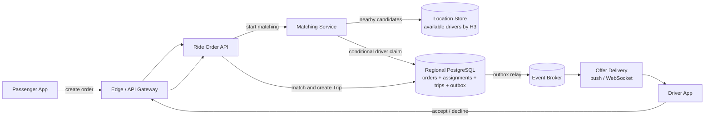
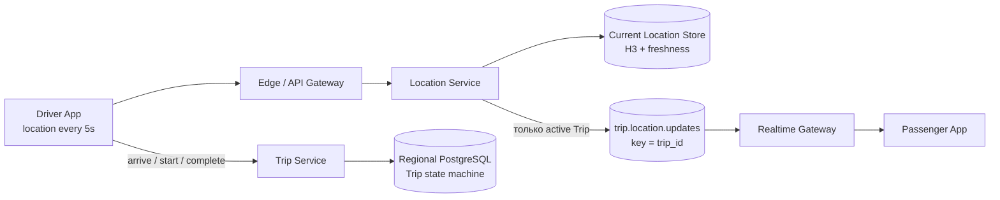

# Uber / Ride-Sharing Platform

## Содержание

- [Фаза 1: Уточнение требований](#фаза-1-уточнение-требований)
- [Фаза 2: Оценка нагрузки](#фаза-2-оценка-нагрузки)
- [Ключевая модель: Ride Order и Trip](#ключевая-модель-ride-order-и-trip)
- [Фаза 3: Высокоуровневый дизайн](#фаза-3-высокоуровневый-дизайн)
- [Фаза 4: Deep Dive](#фаза-4-deep-dive)
- [Сквозные потоки](#сквозные-потоки)
- [Трейдоффы](#трейдоффы)
- [Что если Location Service падает?](#что-если-location-service-падает)
- [Фаза 5: финал](#фаза-5-финал)
- [Interview-ready answer](#interview-ready-answer)

Разбор задачи «Спроектируй Uber». В центре находятся два независимых потока:
поиск и назначение водителя до поездки, затем tracking уже созданной поездки.
Если назвать оба объекта `trip`, retry старого matching способен вмешаться в
активную поездку, а координаты всех свободных водителей смешиваются с историей
конкретного заказа.

---

## Фаза 1: Уточнение требований

### Функциональные требования

```
Вопросы:
  - Только matching водитель↔пассажир или весь lifecycle (оплата, рейтинги)?
  - Нужен ли realtime tracking на карте во время поездки?
  - Surge pricing — в scope?
  - Разные типы транспорта (X, XL, Black)?
  - Нужно ли планирование поездок заранее?
```

**Договорились (scope):**
- Пассажир создаёт `Ride Order`, система находит и атомарно назначает водителя.
- После принятия предложения создаётся отдельный `Trip`.
- Real-time location tracking (водитель видит пассажира, пассажир видит водителя)
- Независимые state machines заказа и поездки.
- ETA calculation
- Surge pricing (базовая логика)

**Out of scope:** оплата, рейтинги, история поездок, разные типы авто, scheduling заранее.

### Нефункциональные требования

```
- DAU: 30M пассажиров, 3M водителей
- Завершённых поездок: 10M/день; средняя длительность: 30 минут
- Активных поездок: около 208K в среднем, до 500K в условный пик
- Location update: каждые 5 секунд от каждого активного водителя
- Matching latency: < 2 секунд от запроса до предложения водителю
- Availability: 99.99% (downtime = потери для водителей и компании)
- Consistency: eventual OK для location; strong для booking (нельзя двойной booking)
- Geo coverage: глобальное, несколько регионов
```

---

## Фаза 2: Оценка нагрузки

```
Location updates от водителей:
  3M водителей × 20% активны = 600K активных водителей
  600K updates / 5 сек = 120K location writes/sec
  → Это основная write нагрузка

Location reads (пассажир ищет водителей рядом):
  30M users × 2 поиска/день = 60M queries/день
  60M / 86 400 ≈ 694 geo queries/sec в среднем
  commuting peak ×10 ≈ 6 940/sec

Ride orders и matching:
  10M поездок/day / 86 400 ≈ 116 новых заказов/sec в среднем
  Peak ×5 ≈ 580 orders/sec

  если проверяем до 5 кандидатов:
  580 × 5 ≈ 2 900 попыток claim/sec в пике

Проверка одновременности по закону Литтла:
  116 поездок/sec × 1 800 sec ≈ 208K активных поездок в среднем
  условный пик ≈ 500K активных поездок

Storage для location:
  Нужно только текущее положение: 600K × 50 bytes = 30MB → Redis
  История location:
  10M trips × 30 min × 12 points/min × 50B ≈ 180GB/day raw
```

Число `500K` — допущение пикового одновременного tracking, а не ещё одно
независимое продуктовое требование. Оно согласуется с потоком поездок и средней
длительностью; прежняя комбинация `1M trips/day` и `1M concurrent trips` была бы
математически невозможна при получасовой поездке.

---

## Ключевая модель: Ride Order и Trip

`Ride Order` — намерение пассажира найти машину. Он существует до того, как
какой-либо водитель согласился:

```text
SEARCHING ⇄ OFFERED → MATCHED
     │          │
     └──────────┴──→ CANCELED / EXPIRED
```

`Trip` — фактическое исполнение уже согласованной поездки. Он создаётся только в
момент успешного `MATCHED`:

```text
DRIVER_EN_ROUTE → DRIVER_WAITING → IN_PROGRESS → COMPLETED
       │                 │              │
       └─────────────────┴──────────────┴──→ CANCELED
```

Разделение даёт практические гарантии:

- retry поиска работает с тем же `order_id` и не создаёт второй Trip;
- отменённый order не засоряет историю поездок;
- assignment водителя принадлежит order до принятия и Trip после принятия;
- поток всех доступных водителей обслуживает matching, а `trip.location.updates`
  содержит только tracking активных поездок.

---

## Фаза 3: Высокоуровневый дизайн

### Поиск и назначение водителя



### Активная поездка и tracking



### Роль каждого компонента

Сквозная идея — разделение по типу нагрузки: write-heavy волатильные координаты
(120K/сек) полностью отделены от точного assignment. Геоиндекс быстро даёт
кандидатов, но только условная запись в regional PostgreSQL решает, свободен ли
водитель на самом деле.

**Location Service.**
*Зачем:* принимает обновления координат каждые 5 секунд, поддерживает H3-индекс и
публикует координаты активных поездок в один partitioned topic по `trip_id`.
*Почему отдельно:* это доминирующая write-нагрузка со своей eventual consistency;
она не должна создавать транзакцию в Trip DB на каждую точку.

**Ride Order API.**
*Зачем:* идемпотентно создаёт заказ, принимает cancel/accept и владеет state
machine до `MATCHED`.
*Почему отдельно:* поиск может повторяться и менять кандидатов, но не должен
плодить новые поездки при retry одного намерения пассажира.

**Matching Service.**
*Зачем:* находит ближайших кандидатов через H3 и пытается атомарно перевести
assignment водителя `AVAILABLE → OFFERED`, а Ride Order `SEARCHING → OFFERED`.
*Почему отдельно:* поиск приблизительный, а до 2,9K пиковых попыток claim/с требуют
короткого точного пути без внешнего push внутри транзакции.

**Trip Service.**
*Зачем:* создаёт Trip после принятия предложения и выполняет переходы от подачи
машины до завершения.
*Почему отдельно + PostgreSQL:* order можно отменять и переназначать до match, а
Trip уже является финансово значимым фактом исполнения.

**Current Location Store.**
*Зачем:* текущие позиции и freshness водителей по H3-ячейкам, а также surge
projection.
*Почему Redis:* данные волатильны, а `GEOSEARCH`, Hash/ZSET и atomic scripts
подходят для регионального geo-index. Это candidate source, но не authority
занятости водителя. Профиль — [Redis](../../06-databases/database-systems-catalog/08-redis.md).

**Regional PostgreSQL.**
*Зачем:* хранит `ride_orders`, активный assignment водителя, `trips` и outbox на
одном региональном shard.
*Почему реляционка:* accept одной транзакцией завершает Order, сохраняет ровно
один active assignment и создаёт Trip. Это exact barrier против double booking —
[transactions & locking](../../06-databases/database-systems-catalog/postgresql/04-transactions-and-locking.md).

**Event Broker.**
*Зачем:* доставляет domain events и один поток `trip.location.updates`,
partitioned по `trip_id`.
*Почему не topic на поездку:* миллионы динамических topics операционно дороже
одного масштабируемого topic; partition key сохраняет порядок координат поездки.

---

## Фаза 4: Deep Dive

### Геопространственный индекс: как найти ближайших водителей

**Проблема:** "найти всех водителей в радиусе 2 км от точки (55.7522, 37.6156)"

#### Вариант 1: Geohash

```
Geohash: кодирует координаты в строку
  (55.7522, 37.6156) → "ucfv0" (5 символов ~ 4.9km × 4.9km)
                     → "ucfv0e" (6 символов ~ 1.2km × 0.6km)

Принцип: одинаковый prefix = близко географически (с нюансами)

Хранение: Redis GEOADD (внутри использует geohash)
  GEOADD drivers:active {lon} {lat} {driver_id}

Поиск: GEORADIUS drivers:active {lon} {lat} 2 km ASC COUNT 20
  → Вернёт 20 ближайших водителей

Проблема geohash: граничный эффект
  Две точки с одинаковым prefix могут быть далеко если на границе ячейки
  Решение: проверять 8 соседних ячеек тоже
```

#### Вариант 2: S2 Geometry (Google) / H3 (Uber)

```
H3 (Hexagonal Hierarchical Spatial Index):
  пространство делится преимущественно на шестиугольные ячейки
  соседство и расстояния до центров равномернее, чем у квадратной сетки
  
  Resolution 9: ~0.1 km² на ячейку (для поиска водителей в городе)
  Resolution 7: ~5 km² (для surge pricing зон)
  
  Операция: h3.LatLngToCell(lat, lng, resolution) → cellID
  
Хранение: Redis Hash
  HSET h3:r9:{cell_id} {driver_id} {serialized_location}
  
Поиск ближайших: получить cell_id пассажира + все 6 соседей
  cells = h3.GridDisk(passenger_cell, k=1)  // 7 ячеек
  для каждой ячейки → HGETALL h3:r9:{cell_id}
  → объединить, вернуть N ближайших по реальному расстоянию
```

**Выбор: H3.** Иерархические resolution удобны для matching и surge. H3 не
устраняет границы: поиск всё равно включает `GridDisk` соседних ячеек и затем
фильтрует кандидатов по настоящему расстоянию.

---

### Location Service: обновление позиций

```
Driver App → POST /drivers/{id}/location
  Body: { "lat": 55.7522, "lng": 37.6156, "heading": 45, "speed": 30, "timestamp": ... }

Location Service:
  1. Валидация (водитель online и активен?)
  2. Обновить позицию и H3-индекс ОДНИМ Lua-скриптом (см. ниже)
  3. Publish в Kafka если водитель в активной поездке:
     topic = trip.location.updates → Trip Service → WebSocket → пассажир
```

**Почему обновление обязано быть атомарным.** Наивная последовательность из трёх команд ломается на любом сбое:

```
HDEL h3:r9:{old_cell} {driver_id}       ← убрали со старой ячейки
HSET h3:r9:{new_cell} {driver_id} ...   ← добавили в новую
SET  driver:{id}:cell {new_cell}        ← запомнили, где он теперь

Падение между 1 и 2: водитель исчез из индекса целиком —
  для matching он больше не существует, хотя онлайн.

Падение между 2 и 3: указатель на ячейку остался старым.
  Следующее обновление сделает HDEL из НЕПРАВИЛЬНОЙ ячейки,
  а запись в new_cell останется навсегда → «призрак»:
  водитель числится там, где его нет, и попадает в выдачу matching.
```

Плюс в Redis Cluster эти ключи лежат в разных слотах (шардинг координат по `driver_id`, индекса — по `cell_id`), поэтому обернуть их в один скрипт или транзакцию без общего hash tag нельзя.

Два рабочих выхода:

```
Вариант A — Redis GEO вместо ручного индекса (проще):
  GEOADD drivers:active {lon} {lat} {driver_id}
  Перемещение водителя — это ПЕРЕЗАПИСЬ одного элемента в одном ключе,
  атомарная по определению. Ни рассинхрона, ни призраков.
  Поиск: GEOSEARCH ... BYRADIUS 2 km ASC COUNT 20
  Цена: один большой ключ на регион → его придётся резать вручную
        по городам, иначе он станет hot key.

Вариант B — оставить H3, но держать ячейку и позицию рядом:
  Ключи с общим hash tag: h3:{city42}:r9:{cell}, driver:{city42}:{id}
  → один слот → Lua-скрипт делает HDEL+HSET+SET атомарно.
  Цена: hash tag по городу, а не по driver_id — шардирование
        становится географическим со всеми его перекосами.
```

**Протухание записей: у полей хеша нет TTL.** Формулировка «не обновился 30 сек → убрать из индекса» не реализуется через `HSET`: `EXPIRE` работает на ключ целиком, а не на поле (per-field TTL появился только в Redis 7.4). Рабочие способы:

```
1. Ячейка как ZSET, score = время обновления:
     ZADD h3:r9:{cell} {now} {driver_id}
     Чтение:  ZRANGEBYSCORE h3:r9:{cell} {now-30s} +inf   ← свежие
     Уборка:  ZREMRANGEBYSCORE h3:r9:{cell} -inf {now-30s}

2. Фильтровать на чтении по updated_at и подчищать фоновым свипером.

Первый способ лучше: устаревшие записи не попадают в выдачу
даже до того, как их удалили.
```

**Масштаб:**
```
120K updates/sec → Redis Cluster, шардинг по географии
  (город/регион в hash tag — иначе индекс и позиция разъедутся по слотам)

Read (geo queries): около 7K/sec в условный пик.
```

Exact matching читает master выбранного geo-shard:

```
Нагрузка чтения (~7K/с) намного ниже записи (120K/с), поэтому сначала
масштабируется partitioning по городу/региону, а не replica reads.

Асинхронная реплика может показать старую позицию. Это не ломает инвариант —
точный claim всё равно проверит Regional PostgreSQL, — но увеличивает число
бесполезных предложений и ухудшает ETA.

Replica допустима для приблизительной heatmap и аналитики, но не нужна в
основном candidate path при данной нагрузке.
```

---

### Matching Service: водитель → пассажир

Geo-index отвечает только «кто выглядит подходящим». Authority назначения
находится в regional PostgreSQL рядом с Ride Order и Trip:

```
Алгоритм:
  1. Ride Order API идемпотентно создаёт order в SEARCHING.
  2. Matching читает кандидатов из H3 projection.
  3. Локальная транзакция делает conditional claim водителя AVAILABLE → OFFERED,
     переводит order SEARCHING → OFFERED и пишет outbox.
  4. Outbox доставляет предложение водителю с deadline 15 секунд.
  5. Decline/timeout освобождает claim и возвращает order в SEARCHING, только
     если совпадают order, driver и offer version.
  6. Accept одной транзакцией переводит order в MATCHED,
     assignment в ACTIVE и создаёт ровно один Trip.
```

Минимальное состояние authority:

```text
ride_orders:
  order_id, rider_id, region_id, state, offered_driver_id,
  offer_version, request_hash, version

driver_assignment_state:
  driver_id PRIMARY KEY,
  state AVAILABLE | OFFERED | ACTIVE | OFFLINE,
  order_id, trip_id, offer_expires_at, version

trips:
  trip_id, order_id UNIQUE, driver_id, rider_id, state, version
```

Claim выполняется локальной транзакцией. Первый условный update пытается занять
водителя:

```sql
UPDATE driver_assignment_state
SET state = 'OFFERED',
    order_id = $order_id,
    offer_expires_at = $deadline,
    version = version + 1
WHERE driver_id = $driver_id
  AND state = 'AVAILABLE';
```

Затем в той же транзакции Ride Order переводится `SEARCHING → OFFERED` с
`offered_driver_id` и новой `offer_version`, после чего пишется outbox. Если
любой conditional update изменил ноль строк, вся транзакция откатывается. Поэтому
нельзя занять водителя, но забыть, какому Order он предложен.

Освобождение после timeout также одной транзакцией проверяет `order_id`, driver и
полученную offer version: запоздавший sweeper не имеет права стереть более новый
assignment или вернуть уже `MATCHED` Order в поиск.

Accept выполняет локальную транзакцию:

```text
BEGIN
1. Проверить Ride Order: OFFERED, тот же driver и не истёкший deadline.
2. Проверить assignment: OFFERED, тот же order и version.
3. Order → MATCHED.
4. INSERT Trip с UNIQUE(order_id).
5. Assignment → ACTIVE и записать trip_id.
6. INSERT outbox TripCreated.
COMMIT
```

Короткий offer deadline закрывает только окно принятия. После accept assignment
становится `ACTIVE` без TTL и освобождается только финальным переходом Trip. Иначе
таймер на 15 секунд истёк бы посреди получасовой поездки.

Location Store получает availability projection через outbox. Его lag может
оставить занятого водителя среди кандидатов, но conditional claim отклонит его.
Потеря Redis поэтому ухудшает matching, но не освобождает активных водителей.

Тот же принцип «быстрый approximate candidate source + exact conditional claim»
используется для назначения исполнителя на маршрут в [15. TMS](./15-tms-transport-management.md).

---

### ETA Calculation

```
Упрощённый подход:
  ETA = distance(driver → pickup) / average_speed_on_route

Реальный подход:
  1. Routing Service (OSRM/Valhalla/Google Maps API)
     → учитывает дороги, повороты, текущие пробки
  2. Traffic Layer:
     → агрегировать speed данные от всех активных водителей
     → road segment → avg speed в реальном времени
  
Кеширование ETA:
  ETA между точками меняется медленно (пробки — раз в несколько минут)
  Cache: {start_cell}:{end_cell} → ETA, TTL 5 min
  Spatial key: H3 cell → не точные координаты, группировать похожие запросы
```

---

### Surge Pricing

```
Концепция: спрос > предложение в зоне → цена растёт

Вычисление:
  Каждые 5 минут для каждой H3 ячейки (resolution 7, ~5km²):
    demand = количество запросов поездок за 5 мин в этой ячейке
    supply = количество свободных водителей в этой ячейке
    
    ratio = demand / supply
    if ratio > 2.0: surge = 1.5x
    if ratio > 3.0: surge = 2.0x
    if ratio > 5.0: surge = 2.5x (cap)

Хранение: Redis
  SET surge:{cell_id} 1.5 EX 300  // действует 5 мин

Отображение: тепловая карта в приложении
  → отдельный Surge Map Service, читает все ненулевые surge ключи
```

---

### Real-time Tracking во время поездки

```
Когда поездка активна (IN_PROGRESS):
  Водитель → Location updates
  → Kafka topic trip.location.updates, key = trip_id
  
Пассажир подключён по WebSocket:
  Trip Service → консьюмер Kafka → WebSocket push → пассажир видит движение

Почему не прямой WebSocket от водителя к пассажиру?
  → Водители и пассажиры могут быть на разных серверах
  → Kafka как decoupled transport
  → Легко добавить других консьюмеров (диспетчер, аналитика)
```

---

### Multi-region Architecture

```
Проблема: водитель в Москве, сервер в US-West → 200ms latency → недопустимо

Решение: шардирование по географическому региону
  eu-west-1:  Европа
  us-east-1:  США восток
  ap-southeast-1: ЮВА

  Каждый регион — полностью независимый deployment
  Location data не реплицируется между регионами (не нужно)
  
Crossregion запросы:
  Только для глобальной аналитики и бухгалтерии (не realtime)
  
Routing:
  GeoDNS → направить пользователя на ближайший регион
```

---

## Сквозные потоки

**1. Обновление позиции водителя.**
Driver App каждые 5 сек → Location Service → `HSET` координат + пересчёт H3-ячейки; при смене ячейки атомарно `HDEL` из старой и `HSET` в новую. Если поездка активна — координаты в Kafka.
*Итог:* индекс атомарно отражает последнюю принятую позицию; запоздавшие точки
отсекаются по sequence и timestamp.

**2. Запрос поездки и matching.**
Пассажир идемпотентно создаёт Ride Order → Matching читает H3-кандидатов →
локальная conditional-транзакция переводит водителя и Order в `OFFERED` → outbox
доставляет предложение → accept одной транзакцией создаёт Trip.
*Итог:* фиксированное число H3-ячеек ограничивает область поиска, а DB authority
исключает двойное назначение даже при stale geo projection.

**3. Трекинг во время поездки.**
Водитель → координаты в общий `trip.location.updates`, ключ `trip_id` → Realtime
Gateway → WebSocket пассажиру.
*Итог:* порядок одной поездки сохраняет partition key, а число topics не растёт
вместе с числом поездок.

**4. Surge pricing.**
Каждые 5 мин по H3-ячейкам (res 7): `demand/supply` → коэффициент → `SET surge:{cell} EX 300`.
*Итог:* цена реагирует на дисбаланс локально по зонам; значения сами протухают через 5 мин.

---

## Трейдоффы

| Компонент | Выбор | Альтернатива | Причина |
|---|---|---|---|
| Geo index | H3 + соседние ячейки | Geohash, QuadTree, Redis GEO | Удобная иерархия и равномерное соседство; границы всё равно требуют `GridDisk` |
| Обновление индекса | Один Lua-скрипт / общий hash tag | Три отдельные команды | Иначе призраки в ячейках и исчезнувшие из индекса водители |
| Протухание позиций | ZSET со score = временем | TTL на поле хеша | У полей хеша нет TTL (до Redis 7.4) |
| Location store | Redis | Cassandra | Volatile data, < 1ms latency |
| Чтение гео-запросов | С мастера шарда | Read replicas | Асинхронные реплики дают устаревшие позиции в matching |
| Назначение водителя | Conditional DB state | Redis-лок с TTL | Authority переживает restart и не освобождает водителя по истёкшему offer timer |
| Order и Trip | Две state machines | Один объект `trip` с `PENDING` | Retry matching не вмешивается в уже начатую поездку |
| Order/Trip store | Regional PostgreSQL | Документное хранилище | Accept атомарно завершает Order, фиксирует assignment и создаёт Trip |
| Location streaming | Kafka | Direct WebSocket | Decoupling, multiple consumers |

### Почему не QuadTree?

```
QuadTree: рекурсивное деление пространства на 4 квадранта
  + Хорошо для неравномерной плотности (больше ячеек в центре города)
  - Сложно шардировать и балансировать в distributed системе
  - Для однородных данных (водители по городу) H3 проще

H3 лучше для Uber потому что:
  - Соседство регулярнее, чем в квадратной сетке
  - Простой поиск соседей: GridDisk(cell, k)
  - Легко маппится на Redis ключи
  - Открытый стандарт с готовыми библиотеками
```

---

## Что если Location Service падает?

| Сбой | Поведение |
| --- | --- |
| Один Location Service упал | Балансировщик исключает instance, клиенты повторяют запрос с jitter |
| Geo-shard недоступен | Новые Ride Orders в зоне временно fail closed; уже созданные Trips продолжают state transitions |
| Осталась позиция моложе 30 секунд | Её можно использовать как candidate hint, но assignment всё равно проверяет DB authority |
| Driver App повторяет накопленные точки | `driver_seq` и timestamp не позволяют старой точке откатить новую позицию |
| Redis failover | Время восстановления измеряется failure test; фиксированное обещание «меньше 30 секунд» без конфигурации не даётся |
| Location stream отстаёт | Карта временно отстаёт, но Trip state и назначение не меняются из координат |

Паттерн размыкания при деградации — [reliability / circuit breaker](../reliability-patterns/03-circuit-breaker.md).

---

## Фаза 5: финал

### Двухминутное резюме

> Я разделяю Ride Order и Trip. Order описывает повторяемый поиск водителя и
> может пройти через несколько offers. Trip создаётся ровно один раз после
> accept; уникальность `order_id` и одна локальная транзакция связывают Order,
> assignment водителя, Trip и outbox.
>
> При учебных допущениях Location Service принимает около 120 тысяч updates/с.
> Десять миллионов поездок в сутки дают 116 стартов/с в среднем и около 580/с в
> пике. При средней длительности 30 минут закон Литтла даёт 208 тысяч активных
> Trips в среднем; условный пик в 500 тысяч согласуется с числом водителей.
>
> H3/Redis быстро возвращает кандидатов из соседних ячеек, но это только
> projection. Exact claim выполняется условным update в regional PostgreSQL.
> Stale geo state может породить лишнюю попытку, но не двойное назначение.
> Offer deadline освобождает только `OFFERED`; после accept assignment становится
> `ACTIVE` без TTL и заканчивается вместе с Trip.
>
> До match используется общий поток доступных `driver.location`, после match —
> `trip.location.updates` с ключом `trip_id`. Один topic сохраняет порядок внутри
> поездки и не создаёт topic на каждого пользователя. Регионы независимы в hot
> path; глобальная аналитика получает события асинхронно.

### За пределами scope и рост ×10

- Payment и payout добавят отдельную financial saga после `TripCompleted`.
- Scheduled rides потребуют reservations водителей и другой matching horizon.
- Pool/shared rides превратят matching в задачу маршрутизации нескольких заказов.
- При росте сначала делятся города и H3 ranges; assignment shards сохраняют
  региональную локальность Order, Driver и Trip.

---

## Interview-ready answer

**1. Почему Ride Order и Trip — разные объекты?**

- Order — намерение пассажира, которое может пережить несколько offers и отмену до match.
- Trip — уже согласованное исполнение с водителем и отдельной state machine.
- Retry — тот же `order_id` не создаёт второй Trip благодаря idempotency и `UNIQUE(order_id)`.

**2. Как не назначить одного водителя двум пассажирам?**

- Candidate source — H3 projection только предлагает ближайших водителей.
- Authority — одна транзакция переводит водителя `AVAILABLE → OFFERED`, а Order
  `SEARCHING → OFFERED`; частичный claim откатывается.
- Accept — одна транзакция фиксирует Order, assignment, Trip и outbox.

**3. Почему Redis-лок с TTL недостаточен?**

- Время жизни — offer длится секунды, а поездка десятки минут.
- Ошибка — истёкший TTL может показать активного водителя свободным.
- Решение — после accept durable assignment остаётся `ACTIVE` до финала Trip.

**4. Как масштабировать координаты?**

- Partitioning — geo-index делится по городу или региону.
- Write path — 120K updates/с распределяются независимо от Order/Trip DB.
- Freshness — sequence и timestamp отбрасывают запоздавшие точки.

**5. Зачем два location stream?**

- До match — позиции доступных водителей нужны Matching Service.
- После match — координаты конкретного Trip нужны пассажиру и диспетчеру.
- Partition key — `trip_id` сохраняет порядок без topic на каждую поездку.

**6. Что происходит при stale location?**

- UX — ETA и список кандидатов могут быть хуже.
- Correctness — exact DB claim всё равно отклоняет занятого водителя.
- Degradation — слишком старые точки исключаются по freshness threshold.

---

## Связанные материалы

- [Как проходить System Design Interview](./00-how-to-approach.md)
- [Redis](../../06-databases/database-systems-catalog/08-redis.md)
- [PostgreSQL: транзакции и блокировки](../../06-databases/database-systems-catalog/postgresql/04-transactions-and-locking.md)
- [Kafka](../../07-message-brokers-and-streaming/01-kafka.md)
- [WebSocket](../../08-networking-and-api/protocols/04-realtime/01-websocket.md)
