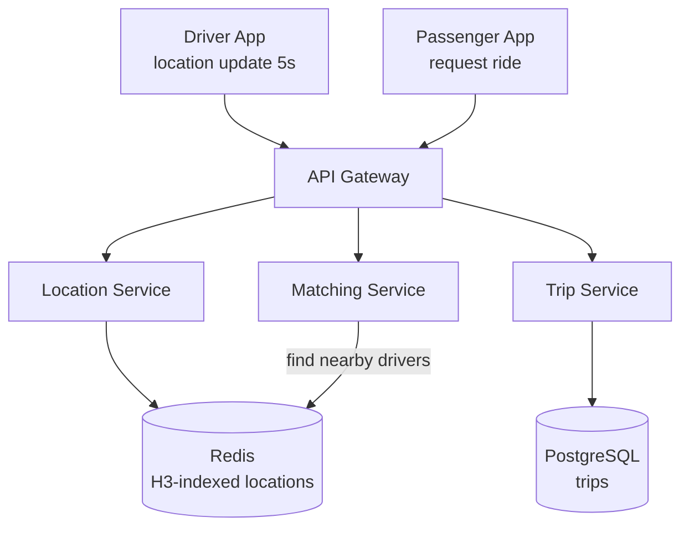

# Uber / Ride-Sharing Platform

Разбор задачи "Спроектируй Uber". Проверяет знание geospatial индексирования, real-time обновлений, matching алгоритмов и работы с geo-distributed системой.

---

## Фаза 1: Уточнение требований

### Функциональные требования

```
Вопросы:
  - Только matching водитель↔пассажир или весь lifecycle (оплата, рейтинги)?
  - Нужен ли realtime tracking на карте во время поездки?
  - Surge pricing — в scope?
  - Разные типы транспорта (X, XL, Black)?
  - Нужно ли планирование поездок заранее?
```

**Договорились (scope):**
- Пассажир запрашивает поездку → система находит ближайшего водителя → matching → поездка
- Real-time location tracking (водитель видит пассажира, пассажир видит водителя)
- Статусы: поиск → подтверждение → в пути → завершено
- ETA calculation
- Surge pricing (базовая логика)

**Out of scope:** оплата, рейтинги, история поездок, разные типы авто, scheduling заранее.

### Нефункциональные требования

```
- DAU: 30M пассажиров, 3M водителей
- Активных поездок одновременно: 1M
- Location update: каждые 5 секунд от каждого активного водителя
- Matching latency: < 2 секунд от запроса до предложения водителю
- Availability: 99.99% (downtime = потери для водителей и компании)
- Consistency: eventual OK для location; strong для booking (нельзя двойной booking)
- Geo coverage: глобальное, несколько регионов
```

---

## Фаза 2: Оценка нагрузки

```
Location updates от водителей:
  3M водителей × 20% активны = 600K активных водителей
  600K updates / 5 сек = 120K location writes/sec
  → Это основная write нагрузка

Location reads (пассажир ищет водителей рядом):
  30M users × 2 поиска/час = 60M queries/час ≈ 17K geo queries/sec

Matching events:
  1M поездок/day / 86400 = 12 match operations/sec (очень мало)
  Peak = 5x ≈ 60/sec

Storage для location:
  Нужно только текущее положение: 600K × 50 bytes = 30MB → Redis
  История location (для поездки): 1M trips × 1h × 12 points/min × 50B = 36GB/day
```

---

## Фаза 3: Высокоуровневый дизайн



### Роль каждого компонента

Сквозная идея — **разделение по типу нагрузки**: write-heavy волатильные координаты (Redis, 120K/сек) полностью отделены от strong-consistent booking (PostgreSQL); геопоиск сведён к O(1) lookup по H3-ячейкам, а не сканированию.

**Location Service.**
*Зачем:* принимает обновления координат каждые 5 сек, поддерживает H3-индекс в Redis (перенос водителя между ячейками), стримит координаты активных поездок в Kafka.
*Почему отдельно:* это доминирующая write-нагрузка (120K/сек) со своими требованиями (volatile, eventual) — нельзя смешивать с booking.

**Matching Service.**
*Зачем:* по запросу находит топ-5 ближайших свободных водителей (H3 GridDisk) и проводит matching с distributed lock.
*Почему отдельно:* matching редкий (~60/сек), но требует атомарности «занять водителя» — изолируем от потока координат.

**Trip Service.**
*Зачем:* state machine поездки (PENDING→…→COMPLETED), real-time tracking пассажиру через WebSocket.
*Почему отдельно + Postgres:* переходы статусов финансово значимы, нужен ACID. Протокол трекинга — [networking / WebSocket](../../08-networking-and-api/protocols/05-websocket.md).

**Redis (H3-indexed locations).**
*Зачем:* текущие позиции водителей по H3-ячейкам, booking-локи, surge-значения.
*Почему Redis:* данные волатильны и нужны за < 1 мс; GEO/Hash-операции и `SET NX` — нативно. Профиль — [Redis](../../06-databases/database-systems-catalog/08-redis.md), сценарии гео/локов — [Redis real scenarios](../../06-databases/database-systems-catalog/08a-redis-real-scenarios.md). Шардинг по `driver_id` — [sharding](../../06-databases/database-systems-catalog/postgresql/12-sharding.md).

**PostgreSQL (trips).**
*Зачем:* durable state машины поездки.
*Почему реляционка:* нельзя двойной booking и нужны консистентные переходы — [transactions & locking](../../06-databases/database-systems-catalog/postgresql/04-transactions-and-locking.md).

**Kafka (location streaming).**
*Зачем:* транспорт координат активной поездки от водителя к пассажиру и другим консьюмерам.
*Почему через брокер, а не прямой WebSocket:* водитель и пассажир на разных серверах; decoupling + лёгкое добавление консьюмеров (диспетчер, аналитика). Профиль — [Kafka](../../07-message-brokers-and-streaming/01-kafka.md).

---

## Фаза 4: Deep Dive

### Геопространственный индекс: как найти ближайших водителей

**Проблема:** "найти всех водителей в радиусе 2 км от точки (55.7522, 37.6156)"

#### Вариант 1: Geohash

```
Geohash: кодирует координаты в строку
  (55.7522, 37.6156) → "ucfv0" (5 символов ~ 4.9km × 4.9km)
                     → "ucfv0e" (6 символов ~ 1.2km × 0.6km)

Принцип: одинаковый prefix = близко географически (с нюансами)

Хранение: Redis GEOADD (внутри использует geohash)
  GEOADD drivers:active {lon} {lat} {driver_id}

Поиск: GEORADIUS drivers:active {lon} {lat} 2 km ASC COUNT 20
  → Вернёт 20 ближайших водителей

Проблема geohash: граничный эффект
  Две точки с одинаковым prefix могут быть далеко если на границе ячейки
  Решение: проверять 8 соседних ячеек тоже
```

#### Вариант 2: S2 Geometry (Google) / H3 (Uber)

```
H3 (Hexagonal Hierarchical Spatial Index):
  Uber использует шестиугольные ячейки (hexagons)
  Преимущество: у шестиугольника все соседи на одинаковом расстоянии (у квадрата нет)
  
  Resolution 9: ~0.1 km² на ячейку (для поиска водителей в городе)
  Resolution 7: ~5 km² (для surge pricing зон)
  
  Операция: h3.LatLngToCell(lat, lng, resolution) → cellID
  
Хранение: Redis Hash
  HSET h3:r9:{cell_id} {driver_id} {serialized_location}
  
Поиск ближайших: получить cell_id пассажира + все 6 соседей
  cells = h3.GridDisk(passenger_cell, k=1)  // 7 ячеек
  для каждой ячейки → HGETALL h3:r9:{cell_id}
  → объединить, вернуть N ближайших по реальному расстоянию
```

**Выбор: H3** — Uber сам разработал и открыл, лучше обрабатывает границы, поддерживает иерархию для разных масштабов.

---

### Location Service: обновление позиций

```
Driver App → POST /drivers/{id}/location
  Body: { "lat": 55.7522, "lng": 37.6156, "heading": 45, "speed": 30, "timestamp": ... }

Location Service:
  1. Валидация (водитель online и активен?)
  2. Обновить в Redis:
     HSET driver:{id} lat {lat} lng {lng} updated_at {ts}
     // Обновить H3 индекс:
     new_cell = h3.LatLngToCell(lat, lng, 9)
     old_cell = GET driver:{id}:cell
     if new_cell != old_cell:
       HDEL h3:r9:{old_cell} {driver_id}  // убрать со старого места
     HSET h3:r9:{new_cell} {driver_id} {location_json}
     SET driver:{id}:cell {new_cell}
  
  3. Publish в Kafka если водитель в активной поездке:
     topic = trip.location.updates → Trip Service → WebSocket → пассажир

TTL: если водитель не обновился 30 сек → считать offline, убрать из H3 индекса
```

**Масштаб:**
```
120K updates/sec → Redis Cluster
  Шардинг по driver_id % N (consistent hashing)
  H3 ключи шардируются по cell_id

Read (geo queries): 17K/sec → Read Replicas для Redis
```

---

### Matching Service: водитель → пассажир

```
Алгоритм:
  1. Пассажир запрашивает поездку
  2. Matching Service: найти TOP-5 ближайших свободных водителей
     → H3 geo query
  3. Отправить каждому водителю запрос (timeout 15 сек)
  4. Первый водитель кто принял → match confirmed
  5. Остальным — cancel

Booking lock (предотвратить двойной booking):
  Redis distributed lock:
  SET driver:{id}:booking {trip_id} EX 30 NX  // атомарно
  Если key уже есть → водитель занят → пропустить

State machine поездки:
  PENDING → DRIVER_FOUND → DRIVER_EN_ROUTE → IN_PROGRESS → COMPLETED/CANCELLED
  Хранить в PostgreSQL (ACID нужен для финансово-значимых переходов)
```

Тот же гео-подбор + `NX`-лок против двойного назначения применяется для назначения исполнителя на маршрут в [15. TMS](./15-tms-transport-management.md).

---

### ETA Calculation

```
Упрощённый подход:
  ETA = distance(driver → pickup) / average_speed_on_route

Реальный подход:
  1. Routing Service (OSRM/Valhalla/Google Maps API)
     → учитывает дороги, повороты, текущие пробки
  2. Traffic Layer:
     → агрегировать speed данные от всех активных водителей
     → road segment → avg speed в реальном времени
  
Кеширование ETA:
  ETA между точками меняется медленно (пробки — раз в несколько минут)
  Cache: {start_cell}:{end_cell} → ETA, TTL 5 min
  Spatial key: H3 cell → не точные координаты, группировать похожие запросы
```

---

### Surge Pricing

```
Концепция: спрос > предложение в зоне → цена растёт

Вычисление:
  Каждые 5 минут для каждой H3 ячейки (resolution 7, ~5km²):
    demand = количество запросов поездок за 5 мин в этой ячейке
    supply = количество свободных водителей в этой ячейке
    
    ratio = demand / supply
    if ratio > 2.0: surge = 1.5x
    if ratio > 3.0: surge = 2.0x
    if ratio > 5.0: surge = 2.5x (cap)

Хранение: Redis
  SET surge:{cell_id} 1.5 EX 300  // действует 5 мин

Отображение: тепловая карта в приложении
  → отдельный Surge Map Service, читает все ненулевые surge ключи
```

---

### Real-time Tracking во время поездки

```
Когда поездка активна (IN_PROGRESS):
  Водитель → Location updates → Kafka topic: trip.{trip_id}.location
  
Пассажир подключён по WebSocket:
  Trip Service → консьюмер Kafka → WebSocket push → пассажир видит движение

Почему не прямой WebSocket от водителя к пассажиру?
  → Водители и пассажиры могут быть на разных серверах
  → Kafka как decoupled transport
  → Легко добавить других консьюмеров (диспетчер, аналитика)
```

---

### Multi-region Architecture

```
Проблема: водитель в Москве, сервер в US-West → 200ms latency → недопустимо

Решение: шардирование по географическому региону
  eu-west-1:  Европа
  us-east-1:  США восток
  ap-southeast-1: ЮВА

  Каждый регион — полностью независимый deployment
  Location data не реплицируется между регионами (не нужно)
  
Crossregion запросы:
  Только для глобальной аналитики и бухгалтерии (не realtime)
  
Routing:
  GeoDNS → направить пользователя на ближайший регион
```

---

## Сквозные потоки

**1. Обновление позиции водителя.**
Driver App каждые 5 сек → Location Service → `HSET` координат + пересчёт H3-ячейки; при смене ячейки атомарно `HDEL` из старой и `HSET` в новую. Если поездка активна — координаты в Kafka.
*Итог:* индекс всегда отражает актуальное положение; geo-запрос видит водителя в правильной ячейке.

**2. Запрос поездки и matching.**
Пассажир → Matching Service → `GridDisk(cell, k=1)` (7 ячеек) → топ-5 по реальному расстоянию → каждому предложение (timeout 15 сек) → первый принявший фиксируется через `SET driver:{id}:booking NX`.
*Итог:* O(1) поиск без сканирования; `NX`-лок исключает двойной booking, проигравшие получают cancel.

**3. Трекинг во время поездки.**
Водитель → координаты в `trip.{id}.location` (Kafka) → Trip Service-консьюмер → WebSocket-push пассажиру.
*Итог:* пассажир и водитель на разных серверах связаны через брокер; легко подключить ещё консьюмеров.

**4. Surge pricing.**
Каждые 5 мин по H3-ячейкам (res 7): `demand/supply` → коэффициент → `SET surge:{cell} EX 300`.
*Итог:* цена реагирует на дисбаланс локально по зонам; значения сами протухают через 5 мин.

---

## Трейдоффы

| Компонент | Выбор | Альтернатива | Причина |
|---|---|---|---|
| Geo index | H3 | Geohash, квадродерево (QuadTree) | Нет граничного эффекта, иерархия |
| Location store | Redis | Cassandra | Volatile data, < 1ms latency |
| Trip store | PostgreSQL | MongoDB | ACID для state transitions |
| Location streaming | Kafka | Direct WebSocket | Decoupling, multiple consumers |
| Matching lock | Redis NX | DB row lock | Latency < 1ms |

### Почему не QuadTree?

```
QuadTree: рекурсивное деление пространства на 4 квадранта
  + Хорошо для неравномерной плотности (больше ячеек в центре города)
  - Сложно шардировать и балансировать в distributed системе
  - Для однородных данных (водители по городу) H3 проще

H3 лучше для Uber потому что:
  - Все соседние ячейки equidistant (у квадрата — нет)
  - Простой поиск соседей: GridDisk(cell, k)
  - Легко маппится на Redis ключи
  - Открытый стандарт с готовыми библиотеками
```

---

## Что если Location Service падает?

```
Водители продолжают отправлять обновления → 503
Matching Service не может найти водителей → поездки не назначаются
  
Mitigation:
  1. Location Service за LB с несколькими репликами
  2. Redis Cluster: автоматический failover < 30 сек
  3. Driver App: буферизовать updates, retry при ошибке
  4. Matching Service: fallback на last known location (< 30 сек стale)
  
Circuit breaker:
  Если Location Service отвечает > 500ms → matching service использует stale data
  Alert инженерам немедленно
```

Паттерн размыкания при деградации — [reliability / circuit breaker](../reliability-patterns/03-circuit-breaker.md).

---

## Interview-ready ответ (2 минуты)

> "Uber — это три ключевые challenge: real-time геопространственный поиск при 120K location updates/sec, быстрый matching без двойного booking, и глобальное geo-распределение с sub-100ms latency.
>
> Геоиндекс: H3 (Uber's own hexagonal grid). Драйверы хранятся в Redis, сгруппированные по H3 ячейкам (resolution 9, ~0.1km²). При запросе поездки — получаем ячейку пассажира + 6 соседей, сортируем по расстоянию, берём топ-5. Это O(1) lookup, не сканирование.
>
> Matching: Distributed lock через Redis SET NX — атомарно помечаем водителя 'занят'. Первый принявший водитель из топ-5 выигрывает, остальные получают cancel.
>
> Location updates: 120K/sec — Redis Cluster, шардинг по driver_id. При смене H3 ячейки — атомарно перемещаем из старой в новую.
>
> Multi-region: GeoDNS routing, каждый регион независим. Location data не реплицируется — нет смысла, московский водитель не нужен в US.
>
> WebSocket для real-time tracking во время поездки: через Kafka, не прямое соединение — decoupling и multiple consumers."
