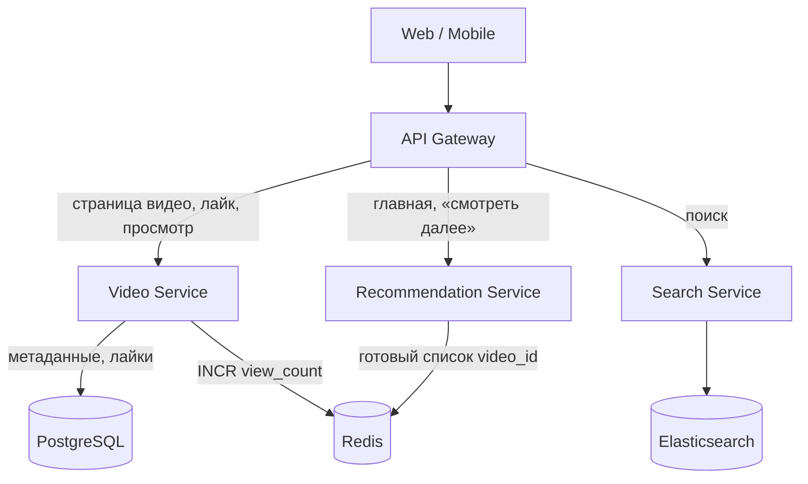
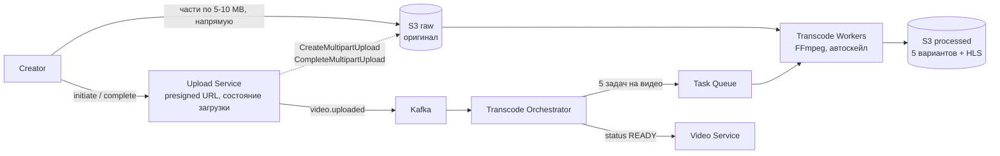
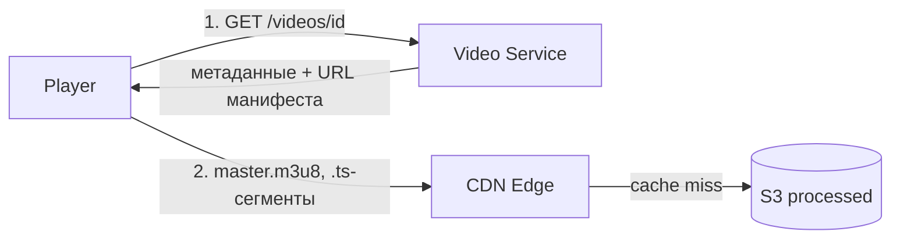
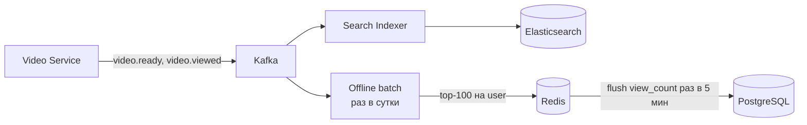
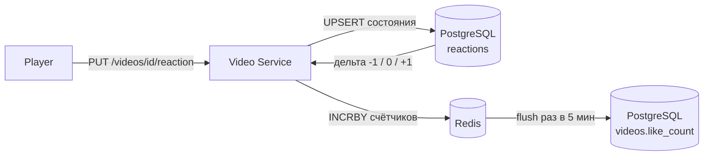

# YouTube / Video Platform

## Содержание

- [Фаза 1: Уточнение требований](#фаза-1-уточнение-требований)
- [Фаза 2: Оценка нагрузки](#фаза-2-оценка-нагрузки)
- [Фаза 3: Высокоуровневый дизайн](#фаза-3-высокоуровневый-дизайн)
- [Фаза 4: Deep Dive](#фаза-4-deep-dive)
- [Сквозные потоки](#сквозные-потоки)
- [Трейдоффы](#трейдоффы)
- [Interview-ready ответ (2 минуты)](#interview-ready-ответ-2-минуты)

Разбор задачи "Спроектируй YouTube". Проверяет знание медиа-пайплайнов, CDN архитектуры, adaptive bitrate streaming и масштабирования хранилища. Одна из самых популярных задач на senior-уровне.

---

## Фаза 1: Уточнение требований

### Функциональные требования

```
Вопросы:
  - Полный YouTube или только video upload + playback?
  - Нужна ли лента рекомендаций или только прямые ссылки?
  - Live streaming — в scope?
  - Комментарии, лайки, подписки?
  - Монетизация/ads?
```

**Договорились (scope):**
- Upload видео: обработка, транскодирование, хранение
- Playback: streaming с адаптивным битрейтом (ABR)
- Поиск по названию/тегам
- Просмотр счётчик + лайки
- Рекомендации (базовые, без ML deep dive)

**Out of scope:** live streaming, монетизация, комментарии, подписки, Creator Studio, DRM.

### Нефункциональные требования

```
- DAU: 100M пользователей
- Upload: 500 часов видео загружается каждую минуту (реальная цифра YouTube)
- Views: 1B просмотров в день
- Видео latency: начало воспроизведения < 2 сек (time-to-first-frame)
- Availability: 99.99%
- Storage: хранить видео вечно (или configurable retention)
- Global: CDN для низкой latency по всему миру
```

---

## Фаза 2: Оценка нагрузки

Считаем только те числа, которые меняют архитектуру.

```
Upload:
  500 ч/мин × 3 600 / 60 = 30 000 секунд видео в секунду
  500 ч/мин × 1 440 мин = 720 000 ч/сутки ≈ 4,3 млн роликов по 10 минут
  на ролик: оригинал 500 MB + пять вариантов (360p…1440p) ≈ 1,5 GB
  → 4,3 млн × 1,5 GB ≈ 6,5 PB/сутки ≈ 2,4 EB/год

Playback:
  1 млрд просмотров/сутки / 86 400 ≈ 11 600 стартов/с
  × 180 с просмотра (удержание 30% от 10 минут) ≈ 2,1 млн ОДНОВРЕМЕННЫХ зрителей
  × 2 Mbit/с (720p) ≈ 4,2 Tbit/с исходящего трафика

Transcode:
  30 000 с/с × 5 вариантов = 150 000 с/с работы кодека
  при ~4× быстрее реального времени на ядро ≈ десятки тысяч ядер
```

Типичная ошибка — умножать старты в секунду на битрейт. Старт длится не мгновение, поэтому нагрузку дают **одновременные** зрители: по закону Литтла это поток × длительность просмотра.

**Выводы:**
- ~4,2 Tbit/с исходящего — раздача возможна только через CDN.
- ~2,4 EB/год — обязателен tiering, редкие варианты качества создаются лениво; вместе с раздачей это основная статья расходов.
- Десятки тысяч ядер под кодек — отдельный пул воркеров с очередью и автоскейлом, не связанный с API.

---

## Фаза 3: Высокоуровневый дизайн

Система распадается на три контура с разным профилем нагрузки. Их удобно
показывать по очереди: сначала API, в который ходят пользователи, затем
асинхронная обработка загруженного видео, затем раздача видеобайтов и в конце
фоновые проекции (поиск, счётчики, рекомендации).

**Запросы пользователя (metadata plane):**



Через API идут только небольшие JSON-ответы: метаданные, URL манифеста,
результаты поиска. Видеобайты через сервисы не проходят — это главный
приём, благодаря которому API масштабируется независимо от 4,2 Tbit/с раздачи.

**Загрузка и транскодирование:**



Контур асинхронный: creator получает ответ сразу после загрузки оригинала,
видео появляется в статусе `PROCESSING`. CPU-bound транскодирование живёт в
отдельном пуле воркеров и не отнимает ресурсы у API.

**Воспроизведение:**



Плеер обращается к API один раз, дальше качает манифест и сегменты только с
CDN и сам переключает качество (ABR). Сегменты immutable, поэтому кешируются
надолго, а origin видит в основном длинный хвост непопулярных видео.

**Фоновые проекции: поиск, счётчики, рекомендации:**



Все три проекции eventual-consistent: новое видео попадает в поиск с задержкой
индексации, счётчик в PostgreSQL отстаёт на минуты, рекомендации — на сутки.
Для этих данных такая свежесть допустима, а API не ждёт ни одного из шагов.

### Роль каждого компонента

Главная идея — разделить три контура: write-heavy обработку видео, read-heavy
раздачу байтов и API метаданных. У каждого своё узкое место (CPU, трафик, RPS),
поэтому они масштабируются и оптимизируются раздельно.

**API Gateway** — единая точка входа.

- *Зачем:* TLS, аутентификация, rate limiting, маршрутизация в сервисы.
- *Граница ответственности:* видеобайты через gateway не идут; право менять видео (владелец) проверяет Video Service.

**Video Service + PostgreSQL** — владелец сущности «видео».

- *Зачем:* метаданные и статусы (`PROCESSING → READY`), URL master-манифеста на CDN, лайки и дизлайки — таблица `reactions` с первичным ключом `(user_id, video_id)`.
- *Почему так:* метаданных мало (сотни миллионов строк), нужны транзакции и индексы — реляционная БД подходит. Индексы — [postgresql / indexes](../../06-databases/database-systems-catalog/postgresql/02-indexes.md).

**Redis** — горячие счётчики и готовые списки.

- *Зачем:* `INCR view_count:{video_id}` с периодическим flush в PostgreSQL; `recommendations:{user_id}` с TTL 24 часа.
- *Почему не сразу в БД:* счётчик популярного видео — write hotspot; буферизуем его в Redis, как в [Avito-кейсе](./13-avito-classifieds.md).

**Upload Service** — приём оригинала.

- *Зачем:* выдаёт presigned URL на части S3 Multipart Upload, проверяет права и квоты creator, хранит состояние загрузки для возобновления, по `complete` закрывает multipart и публикует `video.uploaded` в Kafka.
- *Почему байты мимо него:* файл в 500 MB ненадёжно слать одним запросом, а ~25 GB/с входящего трафика нельзя пропускать через приложение — части идут напрямую в S3, сервис видит только управляющие вызовы.

**Kafka** — шина событий.

- *Зачем:* `video.uploaded`, `video.ready`, `video.viewed`; развязывает загрузку, транскодирование, индексацию и аналитику.
- *Почему так:* новые консьюмеры (индексатор, batch) добавляются без изменения сервисов, события можно перечитать после сбоя. Профиль — [Kafka](../../07-message-brokers-and-streaming/01-kafka.md).

**Transcode Orchestrator + Workers (FFmpeg)** — обработка видео.

- *Зачем:* orchestrator режет видео на задачи по качествам, воркеры создают 5 вариантов и HLS-сегменты, orchestrator ставит статус `READY`.
- *Почему отдельный пул + очередь:* транскодирование CPU-bound и пиковое (десятки тысяч ядер); автоскейл по глубине очереди. Механика очереди — кейс [05. Task Queue](./05-task-queue.md).

**S3 (raw + processed)** — хранилище видеобайтов.

- *Зачем:* durable-хранение оригиналов и вариантов, tiering hot → warm → Glacier.
- *Почему object storage:* ~2,4 EB/год бинарного контента, нужны надёжность и дешёвый холодный tier; метаданные при этом в PostgreSQL.

**CDN (edge nodes)** — раздача.

- *Зачем:* отдаёт immutable-сегменты близко к зрителю; S3 видит только cache miss.
- *Почему обязателен:* 4,2 Tbit/с из одного региона невозможны, а Zipf (топ-1% видео = 80% трафика) делает кеш очень эффективным. Профиль — [CDN / reverse proxy](../../08-networking-and-api/request-lifecycle/04-cdn-load-balancer-reverse-proxy.md), сквозной поток — [external flows / read-heavy with CDN](../external-request-flows/02-read-heavy-request-with-cdn-and-cache.md).

**Search Service + Elasticsearch** — поиск.

- *Зачем:* поиск по title/description/tags с весами; индекс обновляется индексатором из Kafka.
- *Почему отдельный индекс:* 500M+ видео и полнотекстовая релевантность — не задача реляционного FTS. Профиль — [Elasticsearch / OpenSearch](../../06-databases/database-systems-catalog/09-elasticsearch-and-opensearch.md).

**Recommendation Service + offline batch** — рекомендации.

- *Зачем:* batch раз в сутки считает по истории просмотров top-100 видео на пользователя и кладёт в Redis; онлайн-сервис читает список и обогащает метаданными.
- *Почему так:* тяжёлый расчёт вынесен из запроса, ответ укладывается в миллисекунды, а суточная свежесть для базовых рекомендаций допустима.

---

## Фаза 4: Deep Dive

### Upload Pipeline

**Шаг 1: Chunked Upload напрямую в S3**

Видео в 500 MB одним запросом передавать ненадёжно: обрывы сети и таймауты.
Нужен resumable-протокол. Ключевое решение — **байты идут напрямую в S3 по
presigned URL, через Upload Service проходят только управляющие вызовы**:

```
1. POST /videos/initiate-upload
     Upload Service: проверить права и квоту creator
                     CreateMultipartUpload в S3 → upload_id
                     запись видео в БД: status = UPLOADING
     → клиенту: video_id, upload_id, presigned URL на каждую часть

2. PUT <presigned-url-part-N> — клиент шлёт части по 5-10 MB ПРЯМО в S3
     S3 отвечает ETag на каждую часть; сервис в передаче не участвует
     URL живут минуты - для долгой загрузки клиент запрашивает новую пачку

3. POST /videos/{video_id}/complete  { parts: [{part_number, etag}, ...] }
     Upload Service: CompleteMultipartUpload — сборку делает S3
                     status = PROCESSING, событие video.uploaded в Kafka

При обрыве сети:
  GET /videos/{video_id}/upload-status
    → Upload Service: ListParts в S3 → список уже загруженных частей
    → клиент продолжает с первой недостающей
```

Сборка чанков — это `CompleteMultipartUpload`: один небольшой вызов со списком
частей и их ETag, байты при нём никуда не копируются. Незавершённые загрузки
удаляет lifecycle-правило бакета, иначе их части копятся и занимают место.

**Почему не проксировать чанки через сервис:**

| | Через сервис (proxy) | Напрямую в S3 (presigned) |
|---|---|---|
| Трафик | ~25 GB/с идёт через приложение | приложение видит только JSON-вызовы |
| Инстансы | сотни машин только на перекладывание байтов | десятки под управляющий API |
| Сетевой путь | двойной: клиент → сервис → S3 | одинарный |
| Проверка содержимого | возможна на лету | только после загрузки, асинхронно |
| Лимит размера | проверка в коде | условия presigned-политики |

Проксирование оправдано при небольших файлах и обязательной проверке содержимого
в момент приёма. Здесь объём трафика решает вопрос однозначно. Антивирус и
модерация всё равно работают асинхронно, уже после загрузки оригинала.

**Шаг 2: Transcode Pipeline**

```
После полной загрузки оригинала в S3:
  Upload Service → Kafka: topic=video.uploaded, key=video_id
  
Transcode Orchestrator (консьюмер Kafka):
  Для каждого видео создать задачи транскодирования:
  { video_id, input_s3_key, output_quality: "1080p", codec: "h264" }
  → Задачи в очередь (Task Queue — см. кейс ./05-task-queue.md)

Transcode Workers (FFmpeg):
  Забирают задачу → читают из S3 → FFmpeg → пишут в S3
  
  Команда:
    ffmpeg -i input.mp4 -vf scale=1280:720 -c:v libx264 -crf 23 \
           -preset fast -c:a aac -b:a 128k output_720p.mp4

Параллельность:
  5 качеств × N видео обрабатываются параллельно
  Каждый worker на отдельном Pod (CPU-intensive!)
  Auto-scaling по queue depth (KEDA)

Статус обработки:
  Video Service DB: status = PROCESSING → READY
  После всех 5 качеств готовы → notify creator
```

**Шаг 3: Thumbnails и metadata**

```
После транскодирования:
  Thumbnail Service: извлечь кадры на 10%, 25%, 50% длины
  Store в S3: thumbnails/{video_id}/{1,2,3}.jpg
  
  Auto-генерация: выбрать "лучший" кадр (яркость, контраст, лица)
  Сохранить в Video metadata DB
```

---

### Adaptive Bitrate Streaming (ABR)

**HLS (HTTP Live Streaming) — стандарт:**

```
Структура:
  Master playlist (m3u8):
    #EXT-X-STREAM-INF:BANDWIDTH=400000,RESOLUTION=640x360
    /videos/abc123/360p/playlist.m3u8
    
    #EXT-X-STREAM-INF:BANDWIDTH=1500000,RESOLUTION=1280x720
    /videos/abc123/720p/playlist.m3u8
    
    #EXT-X-STREAM-INF:BANDWIDTH=4000000,RESOLUTION=1920x1080
    /videos/abc123/1080p/playlist.m3u8

  Quality playlist (720p/playlist.m3u8):
    #EXTINF:6.000,
    segment_001.ts
    #EXTINF:6.000,
    segment_002.ts
    ...

Сегменты: 6-секундные chunks (.ts файлы) → хранятся в S3 → раздаются CDN

Алгоритм ABR на клиенте:
  1. Загрузить master playlist
  2. Начать с низкого качества (быстрый старт)
  3. Замерять download speed каждого сегмента
  4. Если скорость > threshold → upgrade quality
  5. Если буфер падает ниже 10 сек → downgrade quality

Почему 6-секундные сегменты?
  Короткие (2 сек): чаще переключения качества, overhead
  Длинные (10+ сек): долго ждать при переключении качества
  6 сек — баланс
```

---

### Storage Architecture

```
Уровни хранения (cost optimization):

Hot (< 30 дней): S3 Standard
  Видео загружены недавно, высокий трафик
  Стоимость: $0.023/GB/мес

Warm (30 дней - 1 год): S3 Infrequent Access
  Видео с умеренным трафиком
  Стоимость: $0.0125/GB/мес (46% дешевле)

Cold (> 1 год, мало просмотров): S3 Glacier
  Редко смотримые видео
  Стоимость: $0.004/GB/мес (83% дешевле)
  Retrieval time: 3-5 часов (при запросе → перенести в Hot автоматически)

Жизненный цикл (S3 Lifecycle Rules):
  Автоматически переносить между уровнями по access patterns

Видео никогда не удаляются: юридические требования, creator может запрос восстановления
```

---

### CDN Architecture

```
Проблема: 4,2 Tbit/с исходящего трафика из одного региона → невозможно

CDN (Content Delivery Network):
  Видео хранится в S3 (origin)
  CDN edge nodes кешируют популярные сегменты ближе к пользователям

  Пользователь в Берлине:
    1. Запрос сегмента → CDN edge в Frankfurt
    2. Edge: cache hit → отдать (latency ~5ms)
    3. Edge: cache miss → запросить из S3 → закешировать → отдать

CDN cache policy:
  Сегменты (.ts): Cache-Control: public, max-age=31536000 (immutable — они не меняются!)
  Playlist (.m3u8): Cache-Control: public, max-age=30 (обновляется при добавлении сегментов)
  
Популярность видео:
  Топ 1% видео = 80% трафика (Zipf distribution)
  Эти видео всегда в CDN cache
  Long-tail видео: CDN miss → S3 (приемлемо для редких запросов)

Что кешировать обязательно:
  - Первые 3-4 сегмента видео (начало просмотра — критично для TTFF)
  - Популярные видео целиком (pre-warm CDN после upload)
```

---

### View Count: распределённый счётчик

**Проблема:** 11,600 просмотров/сек × INCREMENT на одно популярное видео → write hotspot.

```
Наивное решение:
  UPDATE videos SET view_count = view_count + 1 WHERE id = ?
  → При 1000 просмотров/сек на одно видео → очередь блокировок в БД

Решение 1: Redis INCR + периодическая запись в БД
  INCR view_count:{video_id}  // Redis атомарно, ~100ns
  Batch job каждые 5 мин: перенести накопленное в PostgreSQL

Решение 2: HyperLogLog для уникальных просмотров
  PFADD unique_views:{video_id} {user_id}
  PFCOUNT unique_views:{video_id}
  → Погрешность 0.81%, зато стандарт-алгоритм без точного хранения

Решение 3: Kafka + stream processing (Lambda architecture)
  Каждый view → event в Kafka
  Flink/Spark Streaming: считать views в реальном времени
  Batch job: точный count за период
  
  Плюс: все events сохранены → можно пересчитать, строить аналитику
```

**Выбор: Redis INCR + async flush в PostgreSQL** — просто, достаточно точно для view count (не финансовые данные).

**Как сбрасывать счётчик, не теряя просмотры.** Наивный flush читает значение,
пишет его в БД и удаляет ключ — и теряет всё, что накопилось между чтением и
удалением:

```
value = GET view_count:{id}          ← 1000
UPDATE videos SET view_count = view_count + 1000
DEL view_count:{id}                  ← между GET и DEL пришло ещё 7 INCR — потеряны
```

Окно маленькое, но при 11 600 просмотрах/с срабатывает регулярно. Redis
выполняет команды по одной, поэтому чтение и обнуление делаем одной командой:

```
delta = GETSET view_count:{id} 0     ← атомарно: вернуть старое, записать 0
UPDATE videos SET view_count = view_count + $delta WHERE id = $id
```

Просмотры, пришедшие после `GETSET`, увеличивают уже обнулённый счётчик и
попадут в следующий цикл. Обязательное условие — запись в БД **прибавляет**
дельту, а не присваивает значение: присваивание затирало бы параллельные
обновления.

Гонка закрыта, но остаётся падение процесса: если flush упал между `GETSET` и
`UPDATE`, дельта уже стёрта из Redis. Усиление — уносить счётчик в сторону
атомарным `RENAME view_count:{id} view_flush:{id}`: следующий `INCR` создаст
исходный ключ заново с нуля, а `view_flush` переживёт падение и будет подобран
следующим запуском. Это тот же принцип, что в outbox из
[Avito-кейса](./13-avito-classifieds.md) — удалять данные только после
подтверждённой записи.

Счётчики нельзя держать в базе Redis с вытеснением по памяти: вытесненный ключ
означает потерю всего, что не успело попасть в PostgreSQL.

---

### Лайки и дизлайки

В отличие от просмотра, реакция — это **состояние пары (пользователь, видео)**, а не
поток событий. Одно и то же нажатие может прийти дважды (ретрай, двойной клик),
пользователь может переключить лайк на дизлайк или снять реакцию. Поэтому главная
задача здесь не пропускная способность, а идемпотентность.



**Хранение состояния:**

```sql
CREATE TABLE reactions (
  user_id   BIGINT       NOT NULL,
  video_id  VARCHAR(11)  NOT NULL,
  reaction  SMALLINT     NOT NULL,   -- +1 лайк, -1 дизлайк
  updated_at TIMESTAMPTZ NOT NULL DEFAULT NOW(),
  PRIMARY KEY (user_id, video_id)
);
```

Первичный ключ `(user_id, video_id)` сам по себе даёт идемпотентность: повторное
нажатие не создаёт второй строки. Он же обслуживает чтение «как я отреагировал на
это видео» — точечный lookup при открытии карточки.

**Почему счётчик нельзя обновлять простым `+1`:**

```
Переключение лайка на дизлайк — это не одно событие, а две правки счётчиков:
  like_count -1  и  dislike_count +1

Значит нужно знать ПРЕДЫДУЩЕЕ состояние реакции. Простой RETURNING отдаёт уже
новое значение, поэтому прежнее читаем отдельным CTE — он видит снимок данных
до вставки:

  WITH prev AS (
    SELECT reaction FROM reactions
     WHERE user_id = $1 AND video_id = $2
  ), upsert AS (
    INSERT INTO reactions (user_id, video_id, reaction)
    VALUES ($1, $2, $3)
    ON CONFLICT (user_id, video_id)
    DO UPDATE SET reaction = EXCLUDED.reaction, updated_at = NOW()
    RETURNING reaction
  )
  SELECT COALESCE((SELECT reaction FROM prev), 0) AS old_reaction,
         (SELECT reaction FROM upsert)            AS new_reaction;

Дельта считается из пары (было, стало):

  было +1, стало +1  → дельта 0  (ретрай, счётчики не трогаем)
  было  0, стало +1  → like +1
  было +1, стало -1  → like -1, dislike +1
  было +1, стало  0  → like -1  (снятие реакции — удаление строки)
```

Одновременные запросы по одной паре `(user_id, video_id)` сериализует сам
`ON CONFLICT`: второй ждёт блокировку строки. Дельта 0 при повторе — это и есть
защита от накрутки ретраями. Если бы счётчик
увеличивался на каждый запрос, дубли и повторные отправки завышали бы его.

**Агрегаты.** `videos.like_count` и `videos.dislike_count` денормализованы: считать
`COUNT(*)` по `reactions` на каждое открытие видео нельзя — под популярным роликом
миллионы строк. Сами счётчики обновляются тем же приёмом, что и просмотры:
`INCRBY` в Redis и периодический flush в PostgreSQL.

**Нужен ли вообще буфер в Redis:** реакции ставят примерно на 1-2% просмотров, то
есть ~230 запросов/с на всю систему против 11 600 просмотров/с. Для PostgreSQL это
немного, и на этапе MVP счётчик можно обновлять прямо в БД одной транзакцией с
`reactions` — так он всегда согласован с состоянием реакций. Redis добавляется,
когда под вирусным видео реакции идут сотнями в секунду и строка `videos`
становится точкой блокировок. Это осознанный размен: точность и простота против
защиты горячей строки.

**Дизлайки как отдельный случай.** YouTube в 2021 году скрыл публичный счётчик
дизлайков, оставив его видимым автору. С точки зрения дизайна это меняет только
выдачу: состояние по-прежнему хранится, счётчик считается, но в публичный ответ
API не попадает. Полезный ответ на собеседовании: сбор данных и их показ —
независимые решения.

---

### База данных для метаданных

```sql
-- Video metadata
CREATE TABLE videos (
  id            VARCHAR(11)   PRIMARY KEY,  -- YouTube-style ID (11 chars, Base64)
  creator_id    BIGINT        NOT NULL,
  title         VARCHAR(500)  NOT NULL,
  description   TEXT,
  status        VARCHAR(20)   NOT NULL,     -- PROCESSING/READY/DELETED
  duration_sec  INT,
  thumbnail_url TEXT,
  view_count    BIGINT        NOT NULL DEFAULT 0,
  like_count    INT           NOT NULL DEFAULT 0,    -- агрегат по reactions
  dislike_count INT           NOT NULL DEFAULT 0,
  created_at    TIMESTAMPTZ   NOT NULL DEFAULT NOW(),
  published_at  TIMESTAMPTZ,

  -- HLS manifest locations
  manifest_url  TEXT,

  -- Storage tier
  storage_tier  VARCHAR(20)   DEFAULT 'hot'
);

CREATE INDEX idx_videos_creator ON videos(creator_id, published_at DESC);
CREATE INDEX idx_videos_published ON videos(published_at DESC) WHERE status = 'READY';

-- Full-text search (или Elasticsearch)
CREATE INDEX idx_videos_search ON videos USING GIN(to_tsvector('english', title || ' ' || COALESCE(description, '')));
```

---

### Search

```
Elasticsearch/OpenSearch:
  При публикации видео → индексировать:
    { video_id, title, description, tags, creator_name, published_at, view_count }

  Запрос:
    GET /videos/search?q=golang+tutorial&sort=relevance
    
    bool:
      must: { multi_match: { query: "golang tutorial", fields: ["title^3", "description", "tags^2"] }}
      filter: { term: { status: "READY" }}
    sort: [{ "_score": "desc" }, { "view_count": "desc" }]

  Индексация при росте view_count:
    Не обновлять реалтайм — дорого
    Batch update раз в час для популярных видео
    Elasticsearch: search результаты не требуют идеальной точности view_count
```

---

### Рекомендации (базовые)

```
Collaborative filtering (упрощённо):
  "Пользователи похожие на тебя смотрели вот это"

Данные:
  user_id × video_id → watch_time (матрица взаимодействий)
  
Offline обработка (раз в день):
  1. Считать коэффициенты схожести между пользователями
  2. Для каждого пользователя: ТОП-100 рекомендованных video_id
  3. Сохранить в Redis: recommendations:{user_id} → [video_ids] TTL 24h

Online serving:
  GET /recommendations/{user_id}
  → Читать из Redis → обогатить метаданными → вернуть

Deep ML (out of scope):
  YouTube реально использует двухэтапную систему:
  1. Candidate generation (нейронная сеть, миллионы → тысячи)
  2. Ranking (другая сеть, тысячи → десятки)
```

---

## Сквозные потоки

**1. Загрузка видео.**
Creator → `initiate-upload` → presigned URL на части → части по 5-10 MB идут напрямую в S3 → `complete` (сборка на стороне S3) → событие `video.uploaded` в Kafka.
*Итог:* обрыв сети не теряет прогресс (resume по `ListParts`); оригинал durable в S3 до обработки, а входящие ~25 GB/с не проходят через приложение.

**2. Транскодирование.**
Kafka → Transcode Orchestrator создаёт 5 задач (по качеству) в очередь → FFmpeg-воркеры (автоскейл по глубине) пишут варианты + HLS-сегменты в S3 → статус READY, pre-warm первых сегментов в CDN.
*Итог:* CPU-bound работа распараллелена и изолирована от playback; зритель получает быстрый старт за счёт прогретого начала.

**3. Воспроизведение (ABR).**
Player → master playlist → стартует с низкого качества → CDN отдаёт `.ts`-сегменты (hit ~5 мс) → клиент повышает/понижает качество по скорости загрузки.
*Итог:* 4,2 Tbit/с обслуживает CDN, origin видит только длинный хвост; immutable-сегменты кешируются «вечно».

**4. Учёт просмотров, реакций и поиск.**
Каждый просмотр → Redis `INCR view_count` → batch-flush в PostgreSQL раз в 5 мин; лайк или дизлайк → UPSERT в `reactions` → дельта в счётчики; публикация видео → индексация в Elasticsearch.
*Итог:* счётчик не создаёт write-hotspot в БД; поиск и view_count eventual-consistent, что для них допустимо.

---

## Трейдоффы

| Компонент | Выбор | Альтернатива | Причина |
|---|---|---|---|
| Streaming | HLS | DASH | HLS: лучшая поддержка iOS |
| Storage | S3 + tiering | Кастомный distributed FS | S3: надёжность, cost-effective tiering |
| CDN | CloudFront/Akamai | Собственный CDN (как Netflix Open Connect) | Own CDN: cost при YouTube scale |
| Transcode | FFmpeg workers | Cloud Transcoding API | Cost: FFmpeg дешевле при 500hr/min |
| View count | Redis + flush | Kafka stream | Simplicity: достаточно для view count |
| Search | Elasticsearch | PostgreSQL FTS | Scale: 500M+ videos |

---

## Interview-ready ответ (2 минуты)

> "YouTube — это два независимых пайплайна: upload/transcode и playback.
>
> Upload: chunked resumable upload напрямую в S3 по presigned URL, сервис обрабатывает только initiate/complete → событие в Kafka → transcode workers параллельно создают 5 quality variants через FFmpeg → готово в S3. Transcode — CPU-intensive, auto-scaling workers по queue depth.
>
> Playback: HLS с 6-секундными сегментами. Клиент сам выбирает качество (ABR) по скорости загрузки. Весь трафик через CDN — 4,2 Tbit/с невозможно отдавать из origin. Сегменты immutable, кешируются бесконечно. Первые 3-4 сегмента популярных видео — pre-warm в CDN после transcode.
>
> Storage tiering: hot → warm → Glacier по access patterns, экономия 83% на cold data.
>
> View count: Redis INCR + async flush в PostgreSQL каждые 5 минут. Точность 99.9% — для view count достаточно.
>
> Search через Elasticsearch, индекс по title/description/tags с weighting.
>
> Metadata в PostgreSQL — структурированные, транзакционные операции. S3 для binary content."
