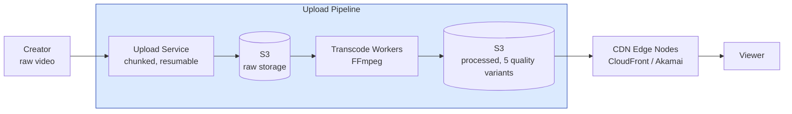

# YouTube / Video Platform

Разбор задачи "Спроектируй YouTube". Проверяет знание медиа-пайплайнов, CDN архитектуры, adaptive bitrate streaming и масштабирования хранилища. Одна из самых популярных задач на senior-уровне.

---

## Фаза 1: Уточнение требований

### Функциональные требования

```
Вопросы:
  - Полный YouTube или только video upload + playback?
  - Нужна ли лента рекомендаций или только прямые ссылки?
  - Live streaming — в scope?
  - Комментарии, лайки, подписки?
  - Монетизация/ads?
```

**Договорились (scope):**
- Upload видео: обработка, транскодирование, хранение
- Playback: streaming с адаптивным битрейтом (ABR)
- Поиск по названию/тегам
- Просмотр счётчик + лайки
- Рекомендации (базовые, без ML deep dive)

**Out of scope:** live streaming, монетизация, комментарии, подписки, Creator Studio, DRM.

### Нефункциональные требования

```
- DAU: 100M пользователей
- Upload: 500 часов видео загружается каждую минуту (реальная цифра YouTube)
- Views: 1B просмотров в день
- Видео latency: начало воспроизведения < 2 сек (time-to-first-frame)
- Availability: 99.99%
- Storage: хранить видео вечно (или configurable retention)
- Global: CDN для низкой latency по всему миру
```

---

## Фаза 2: Оценка нагрузки

```
Upload:
  500 часов/мин = 500 × 60 = 30,000 сек видео/мин
  30,000 / 60 ≈ 500 сек видео/сек загружается
  
  Средняя длина видео: 10 мин = 600 сек
  Одно видео ~500 MB (оригинал 1080p)
  500 bytes/сек видео × 500 MB/600 сек ≈ 416 MB/сек upload ingress
  ≈ 3.3 Gbps входящего трафика

Просмотры:
  1B/day / 86400 = 11,600 views/sec
  Среднее удержание: 30% длины → 10 мин × 0.3 = 3 мин просмотра
  Bitrate 720p: ~2 Mbps
  11,600 × 2 Mbps ≈ 23 Tbps исходящего трафика (через CDN)

Storage:
  Одно видео в 5 качествах (360/480/720/1080/1440p) × 500 MB ≈ 1.5 GB per video
  500 часов/мин × 1440 мин/day × 1.5 GB = 1.08 PB/day
  За год: ~400 PB → распределённое хранилище (S3 / GCS / кастомное)
```

---

## Фаза 3: Высокоуровневый дизайн



### Роль каждого компонента

Сквозная идея — **два независимых пайплайна**: write-heavy upload/transcode (асинхронный, batch, CPU-bound) и read-heavy playback (CDN-first, 23 Tbps). Они масштабируются и оптимизируются раздельно.

**Upload Service.**
*Зачем:* chunked resumable-загрузка оригинала в S3 (Multipart Upload), затем событие `video.uploaded` в Kafka.
*Почему отдельно:* загрузка 500 MB ненадёжна одним запросом; resumable-протокол и сборка чанков — отдельная ответственность.

**S3 (raw + processed).**
*Зачем:* durable-хранилище оригиналов и 5 quality-вариантов, tiering hot→warm→Glacier.
*Почему object storage:* ~400 PB/год бинарного контента, нужны надёжность и дешёвый cold-tier; метаданные при этом в Postgres.

**Transcode Workers (FFmpeg).**
*Зачем:* параллельно создают 5 битрейтов и HLS-сегменты.
*Почему отдельный пул + очередь:* транскодирование CPU-bound и пиковое; раздаём задачи через очередь (механика — кейс [05. Task Queue](./05-task-queue.md)), автоскейл по глубине очереди. Транспорт событий — [Kafka](../../07-message-brokers-and-streaming/01-kafka.md).

**CDN (edge nodes).**
*Зачем:* раздаёт immutable-сегменты близко к зрителю; origin (S3) видит только cache-miss.
*Почему обязателен:* 23 Tbps из одного региона невозможны; Zipf (топ-1% = 80% трафика) делает кеш крайне эффективным. Профиль — [CDN / reverse proxy](../../08-networking-and-api/request-lifecycle/04-cdn-load-balancer-reverse-proxy.md), сквозной read-heavy поток — [external flows / read-heavy with CDN](../external-request-flows/02-read-heavy-request-with-cdn-and-cache.md).

**Video metadata (PostgreSQL) + Redis.**
*Зачем:* структурированные метаданные/статусы (PROCESSING→READY), view_count через Redis INCR с async-flush.
*Почему так:* счётчик на популярном видео — write hotspot, его буферизуем в Redis (тот же приём, что в [Avito-кейсе](./13-avito-classifieds.md)); индексы метаданных — [postgresql / indexes](../../06-databases/database-systems-catalog/postgresql/02-indexes.md).

**Elasticsearch.**
*Зачем:* поиск по title/description/tags с весами.
*Почему отдельный индекс:* 500M+ видео, полнотекстовый поиск с релевантностью — не для реляционного FTS. Профиль — [Elasticsearch / OpenSearch](../../06-databases/database-systems-catalog/09-elasticsearch-and-opensearch.md).

---

## Фаза 4: Deep Dive

### Upload Pipeline

**Шаг 1: Chunked Upload**

```
Проблема: видео 500MB — одним запросом ненадёжно (network drops, timeouts).

Решение: Resumable Upload Protocol
  1. Клиент: POST /videos/initiate-upload → получить upload_id
  2. Клиент: разбить файл на chunks по 5MB
  3. Клиент: PUT /videos/{upload_id}/chunks/{n} для каждого chunk
  4. Upload Service: собрать в S3 (Multipart Upload S3 API)
  5. Клиент: POST /videos/{upload_id}/complete

  При обрыве сети:
    GET /videos/{upload_id}/status → список загруженных chunks
    Продолжить с первого незагруженного

S3 Multipart Upload нативно поддерживает это:
  CreateMultipartUpload → UploadPart × N → CompleteMultipartUpload
```

**Шаг 2: Transcode Pipeline**

```
После полной загрузки оригинала в S3:
  Upload Service → Kafka: topic=video.uploaded, key=video_id
  
Transcode Orchestrator (консьюмер Kafka):
  Для каждого видео создать задачи транскодирования:
  { video_id, input_s3_key, output_quality: "1080p", codec: "h264" }
  → Задачи в очередь (Task Queue — см. кейс ./05-task-queue.md)

Transcode Workers (FFmpeg):
  Забирают задачу → читают из S3 → FFmpeg → пишут в S3
  
  Команда:
    ffmpeg -i input.mp4 -vf scale=1280:720 -c:v libx264 -crf 23 \
           -preset fast -c:a aac -b:a 128k output_720p.mp4

Параллельность:
  5 качеств × N видео обрабатываются параллельно
  Каждый worker на отдельном Pod (CPU-intensive!)
  Auto-scaling по queue depth (KEDA)

Статус обработки:
  Video Service DB: status = PROCESSING → READY
  После всех 5 качеств готовы → notify creator
```

**Шаг 3: Thumbnails и metadata**

```
После транскодирования:
  Thumbnail Service: извлечь кадры на 10%, 25%, 50% длины
  Store в S3: thumbnails/{video_id}/{1,2,3}.jpg
  
  Auto-генерация: выбрать "лучший" кадр (яркость, контраст, лица)
  Сохранить в Video metadata DB
```

---

### Adaptive Bitrate Streaming (ABR)

**HLS (HTTP Live Streaming) — стандарт:**

```
Структура:
  Master playlist (m3u8):
    #EXT-X-STREAM-INF:BANDWIDTH=400000,RESOLUTION=640x360
    /videos/abc123/360p/playlist.m3u8
    
    #EXT-X-STREAM-INF:BANDWIDTH=1500000,RESOLUTION=1280x720
    /videos/abc123/720p/playlist.m3u8
    
    #EXT-X-STREAM-INF:BANDWIDTH=4000000,RESOLUTION=1920x1080
    /videos/abc123/1080p/playlist.m3u8

  Quality playlist (720p/playlist.m3u8):
    #EXTINF:6.000,
    segment_001.ts
    #EXTINF:6.000,
    segment_002.ts
    ...

Сегменты: 6-секундные chunks (.ts файлы) → хранятся в S3 → раздаются CDN

Алгоритм ABR на клиенте:
  1. Загрузить master playlist
  2. Начать с низкого качества (быстрый старт)
  3. Замерять download speed каждого сегмента
  4. Если скорость > threshold → upgrade quality
  5. Если буфер падает ниже 10 сек → downgrade quality

Почему 6-секундные сегменты?
  Короткие (2 сек): чаще переключения качества, overhead
  Длинные (10+ сек): долго ждать при переключении качества
  6 сек — баланс
```

---

### Storage Architecture

```
Уровни хранения (cost optimization):

Hot (< 30 дней): S3 Standard
  Видео загружены недавно, высокий трафик
  Стоимость: $0.023/GB/мес

Warm (30 дней - 1 год): S3 Infrequent Access
  Видео с умеренным трафиком
  Стоимость: $0.0125/GB/мес (46% дешевле)

Cold (> 1 год, мало просмотров): S3 Glacier
  Редко смотримые видео
  Стоимость: $0.004/GB/мес (83% дешевле)
  Retrieval time: 3-5 часов (при запросе → перенести в Hot автоматически)

Жизненный цикл (S3 Lifecycle Rules):
  Автоматически переносить между уровнями по access patterns

Видео никогда не удаляются: юридические требования, creator может запрос восстановления
```

---

### CDN Architecture

```
Проблема: 23 Tbps исходящего трафика из одного региона → невозможно

CDN (Content Delivery Network):
  Видео хранится в S3 (origin)
  CDN edge nodes кешируют популярные сегменты ближе к пользователям

  Пользователь в Берлине:
    1. Запрос сегмента → CDN edge в Frankfurt
    2. Edge: cache hit → отдать (latency ~5ms)
    3. Edge: cache miss → запросить из S3 → закешировать → отдать

CDN cache policy:
  Сегменты (.ts): Cache-Control: public, max-age=31536000 (immutable — они не меняются!)
  Playlist (.m3u8): Cache-Control: public, max-age=30 (обновляется при добавлении сегментов)
  
Популярность видео:
  Топ 1% видео = 80% трафика (Zipf distribution)
  Эти видео всегда в CDN cache
  Long-tail видео: CDN miss → S3 (приемлемо для редких запросов)

Что кешировать обязательно:
  - Первые 3-4 сегмента видео (начало просмотра — критично для TTFF)
  - Популярные видео целиком (pre-warm CDN после upload)
```

---

### View Count: распределённый счётчик

**Проблема:** 11,600 просмотров/сек × INCREMENT на одно популярное видео → write hotspot.

```
Наивное решение:
  UPDATE videos SET view_count = view_count + 1 WHERE id = ?
  → При 1000 просмотров/сек на одно видео → очередь блокировок в БД

Решение 1: Redis INCR + периодическая запись в БД
  INCR view_count:{video_id}  // Redis атомарно, ~100ns
  Batch job каждые 5 мин:
    Читать все view_count из Redis
    Bulk UPDATE в PostgreSQL
    Сбросить Redis счётчики
  
  Проблема: потеря данных при падении Redis

Решение 2: HyperLogLog для уникальных просмотров
  PFADD unique_views:{video_id} {user_id}
  PFCOUNT unique_views:{video_id}
  → Погрешность 0.81%, зато стандарт-алгоритм без точного хранения

Решение 3: Kafka + stream processing (Lambda architecture)
  Каждый view → event в Kafka
  Flink/Spark Streaming: считать views в реальном времени
  Batch job: точный count за период
  
  Плюс: все events сохранены → можно пересчитать, строить аналитику
```

**Выбор: Redis INCR + async flush в PostgreSQL** — просто, достаточно точно для view count (не финансовые данные).

---

### База данных для метаданных

```sql
-- Video metadata
CREATE TABLE videos (
  id            VARCHAR(11)   PRIMARY KEY,  -- YouTube-style ID (11 chars, Base64)
  creator_id    BIGINT        NOT NULL,
  title         VARCHAR(500)  NOT NULL,
  description   TEXT,
  status        VARCHAR(20)   NOT NULL,     -- PROCESSING/READY/DELETED
  duration_sec  INT,
  thumbnail_url TEXT,
  view_count    BIGINT        NOT NULL DEFAULT 0,
  like_count    INT           NOT NULL DEFAULT 0,
  created_at    TIMESTAMPTZ   NOT NULL DEFAULT NOW(),
  published_at  TIMESTAMPTZ,

  -- HLS manifest locations
  manifest_url  TEXT,

  -- Storage tier
  storage_tier  VARCHAR(20)   DEFAULT 'hot'
);

CREATE INDEX idx_videos_creator ON videos(creator_id, published_at DESC);
CREATE INDEX idx_videos_published ON videos(published_at DESC) WHERE status = 'READY';

-- Full-text search (или Elasticsearch)
CREATE INDEX idx_videos_search ON videos USING GIN(to_tsvector('english', title || ' ' || COALESCE(description, '')));
```

---

### Search

```
Elasticsearch/OpenSearch:
  При публикации видео → индексировать:
    { video_id, title, description, tags, creator_name, published_at, view_count }

  Запрос:
    GET /videos/search?q=golang+tutorial&sort=relevance
    
    bool:
      must: { multi_match: { query: "golang tutorial", fields: ["title^3", "description", "tags^2"] }}
      filter: { term: { status: "READY" }}
    sort: [{ "_score": "desc" }, { "view_count": "desc" }]

  Индексация при росте view_count:
    Не обновлять реалтайм — дорого
    Batch update раз в час для популярных видео
    Elasticsearch: search результаты не требуют идеальной точности view_count
```

---

### Рекомендации (базовые)

```
Collaborative filtering (упрощённо):
  "Пользователи похожие на тебя смотрели вот это"

Данные:
  user_id × video_id → watch_time (матрица взаимодействий)
  
Offline обработка (раз в день):
  1. Считать коэффициенты схожести между пользователями
  2. Для каждого пользователя: ТОП-100 рекомендованных video_id
  3. Сохранить в Redis: recommendations:{user_id} → [video_ids] TTL 24h

Online serving:
  GET /recommendations/{user_id}
  → Читать из Redis → обогатить метаданными → вернуть

Deep ML (out of scope):
  YouTube реально использует двухэтапную систему:
  1. Candidate generation (нейронная сеть, миллионы → тысячи)
  2. Ranking (другая сеть, тысячи → десятки)
```

---

## Сквозные потоки

**1. Загрузка видео.**
Creator → initiate-upload → чанки по 5 MB через S3 Multipart → complete → событие `video.uploaded` в Kafka.
*Итог:* обрыв сети не теряет прогресс (resume по списку загруженных чанков); оригинал durable в S3 до обработки.

**2. Транскодирование.**
Kafka → Transcode Orchestrator создаёт 5 задач (по качеству) в очередь → FFmpeg-воркеры (автоскейл по глубине) пишут варианты + HLS-сегменты в S3 → статус READY, pre-warm первых сегментов в CDN.
*Итог:* CPU-bound работа распараллелена и изолирована от playback; зритель получает быстрый старт за счёт прогретого начала.

**3. Воспроизведение (ABR).**
Player → master playlist → стартует с низкого качества → CDN отдаёт `.ts`-сегменты (hit ~5 мс) → клиент повышает/понижает качество по скорости загрузки.
*Итог:* 23 Tbps обслуживает CDN, origin видит только длинный хвост; immutable-сегменты кешируются «вечно».

**4. Учёт просмотров и поиск.**
Каждый просмотр → Redis `INCR view_count` → batch-flush в PostgreSQL раз в 5 мин; публикация видео → индексация в Elasticsearch.
*Итог:* счётчик не создаёт write-hotspot в БД; поиск и view_count eventual-consistent, что для них допустимо.

---

## Трейдоффы

| Компонент | Выбор | Альтернатива | Причина |
|---|---|---|---|
| Streaming | HLS | DASH | HLS: лучшая поддержка iOS |
| Storage | S3 + tiering | Кастомный distributed FS | S3: надёжность, cost-effective tiering |
| CDN | CloudFront/Akamai | Собственный CDN (как Netflix Open Connect) | Own CDN: cost при YouTube scale |
| Transcode | FFmpeg workers | Cloud Transcoding API | Cost: FFmpeg дешевле при 500hr/min |
| View count | Redis + flush | Kafka stream | Simplicity: достаточно для view count |
| Search | Elasticsearch | PostgreSQL FTS | Scale: 500M+ videos |

---

## Interview-ready ответ (2 минуты)

> "YouTube — это два независимых пайплайна: upload/transcode и playback.
>
> Upload: chunked resumable upload в S3 → событие в Kafka → transcode workers параллельно создают 5 quality variants через FFmpeg → готово в S3. Transcode — CPU-intensive, auto-scaling workers по queue depth.
>
> Playback: HLS с 6-секундными сегментами. Клиент сам выбирает качество (ABR) по скорости загрузки. Весь трафик через CDN — 23 Tbps невозможно отдавать из origin. Сегменты immutable, кешируются бесконечно. Первые 3-4 сегмента популярных видео — pre-warm в CDN после transcode.
>
> Storage tiering: hot → warm → Glacier по access patterns, экономия 83% на cold data.
>
> View count: Redis INCR + async flush в PostgreSQL каждые 5 минут. Точность 99.9% — для view count достаточно.
>
> Search через Elasticsearch, индекс по title/description/tags с weighting.
>
> Metadata в PostgreSQL — структурированные, транзакционные операции. S3 для binary content."
