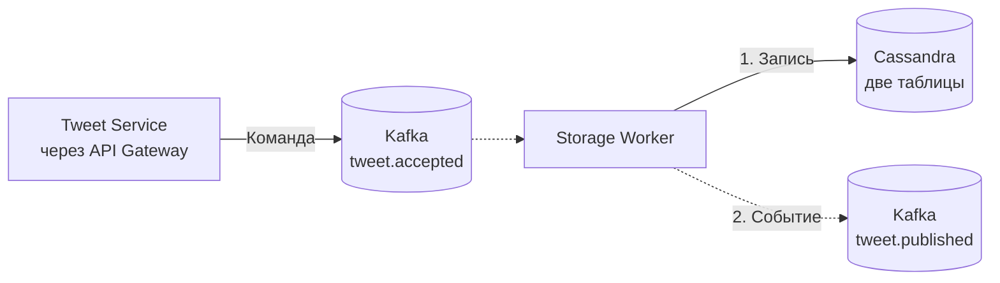
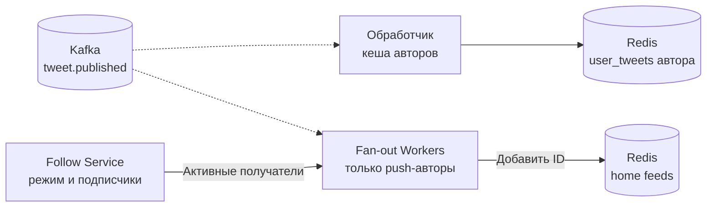
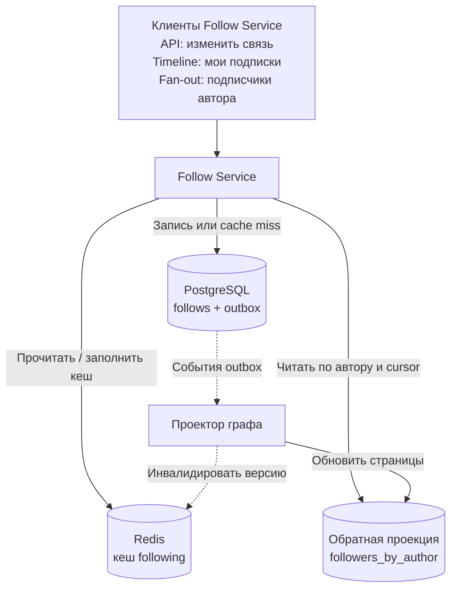
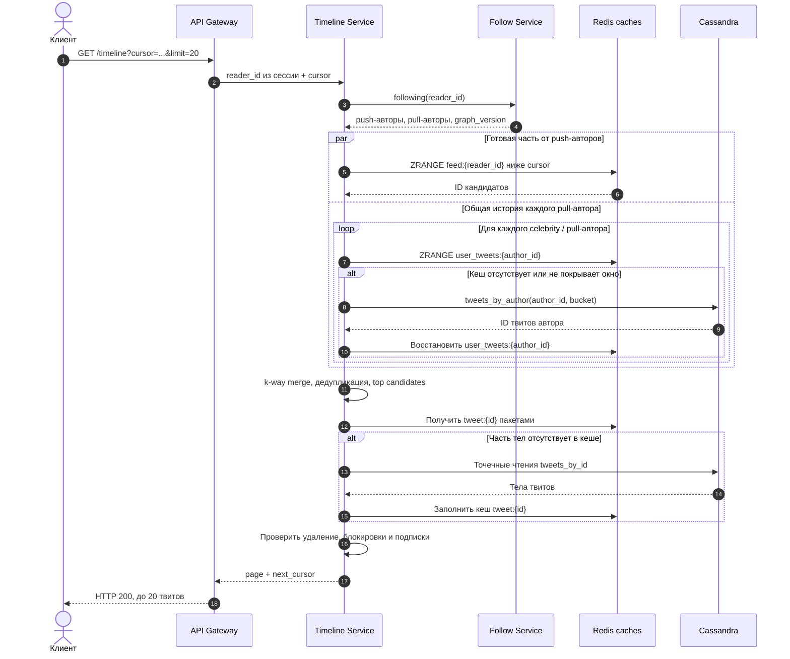

# Twitter / Social Feed

## Содержание

- [Фаза 1: Уточнение требований](#фаза-1-уточнение-требований)
- [Фаза 2: Оценка нагрузки](#фаза-2-оценка-нагрузки)
- [Фаза 3: Ключевое решение — Fan-out Strategy](#фаза-3-ключевое-решение--fan-out-strategy)
- [Фаза 4: Deep Dive](#фаза-4-deep-dive)
- [Архитектура](#архитектура)
- [Сквозные потоки](#сквозные-потоки)
- [Трейдоффы](#трейдоффы)
- [Failure Scenarios](#failure-scenarios)
- [Interview-ready ответ (2 минуты)](#interview-ready-ответ-2-минуты)
- [Официальные источники](#официальные-источники)

Разбор задачи «Спроектируй Twitter»: как доставлять публикации в домашнюю ленту, если у одного автора 300 подписчиков, а у другого — 100 миллионов. Главный выбор — подготовить ленту заранее при записи или собирать её при чтении. От этого зависят задержка, стоимость хранения и поведение при сбоях.

Это учебный проект социальной сети, а не описание текущей внутренней архитектуры X. Объёмы, пороги и SLO ниже — допущения для собеседования.

Альтернативный разбор тех же требований с противоположным ключевым решением — [08.1 Twitter: pull-first альтернатива](./08.1-twitter-pull-first.md).

---

## Фаза 1: Уточнение требований

### Функциональные требования

Перед выбором компонентов уточняем:

- Нужны только публикации и лента или также поиск, личные сообщения и рекомендации?
- Лента хронологическая или персонализированная?
- Как работают retweet, reply, like и отмена этих действий?
- Должен ли автор сразу видеть свою публикацию?
- Насколько глубоко можно листать историю?

**Границы задачи:**

- Текстовые публикации до 280 символов; это лимит нашего продукта.
- Home feed из публикаций подписок, новые сначала, по 20 элементов на страницу.
- Follow / unfollow, like / unlike, retweet; хранение связей для replies и счётчиков.
- Базовый поиск по хэштегам.
- Подтверждённые данные храним без фиксированного срока; горячее окно ленты — последние 1000 ссылок, старая история доступна через более дорогую сборку.

Личные сообщения, реклама, медиа, рекомендации, push-уведомления и trending не входят в основной проект. Trending ниже оставлен как отдельное расширение. Для простоты все аккаунты публичные; удаление и блокировки всё равно проверяются перед выдачей контента.

### Нефункциональные требования

| Параметр | Допущение или целевой показатель |
|---|---|
| Зарегистрированные пользователи | 1 млрд |
| DAU / активные за сутки | 200 млн |
| Активные за 30 дней | 400 млн; отдельное допущение для кеша |
| Открытия ленты | 10 на DAU в сутки |
| Публикации | 5 на DAU в сутки, включая retweet/reply как записи активности |
| Подписки | В среднем 300 на зарегистрированного пользователя |
| Большой автор | Пример с 100 млн подписчиков |
| Свежесть | В штатном режиме 99% публикаций доступны в ленте активного подписчика за 10 секунд |
| Задержка чтения | p99 серверного ответа менее 200 мс |
| Доступность чтения | 99,99%; устаревшая лента допустима при деградации |

API публикации может вернуть `202 Accepted` после надёжного приёма команды. Это ещё не обещание, что твит появился в хранилище чтения и у всех подписчиков. Автор видит локальную карточку со статусом отправки, затем подтверждение публикации. Если требуется синхронный `201 Created` с немедленным чтением из БД, контракт и путь записи нужно изменить.

---

## Фаза 2: Оценка нагрузки

### Среднее, пик и fan-out

Для накопления данных берём среднее. Для мощности системы примем пик в 3 раза выше среднего; реальный коэффициент получают из статистики.

```text
Чтения:
    200 млн × 10 / 86 400 ≈ 23 148 запросов/с в среднем
    пик × 3 ≈ 69 444 запросов/с

Публикации:
    200 млн × 5 / 86 400 ≈ 11 574 записей/с в среднем
    пик × 3 ≈ 34 722 записей/с

Наивный push, условно по 300 получателей на каждую публикацию:
    11 574 × 300 ≈ 3,47 млн вставок/с в среднем
    34 722 × 300 ≈ 10,42 млн вставок/с на пике

Одна публикация автора со 100 млн подписчиков:
    до 100 млн вставок, если рассылать всем
```

Среднее число подписок по пользователям не равно автоматически числу получателей на публикацию: активные авторы могут иметь больше подписчиков. Поэтому 3,47 млн — модель для сравнения, а не измеренная нагрузка. Для гибрида нужна сумма `частота публикаций автора × число его активных получателей` только по авторам в push-режиме.

**Отсечка неактивных.** Поддерживаем готовые ленты для активных за 30 дней. Если для иллюстрации доля таких получателей каждой публикации равна 40%, оценка push уменьшается до `3,47 млн × 0,4 ≈ 1,39 млн/с`, пик — до `4,17 млн/с`. Гибрид дополнительно исключает дорогих авторов. Долю активных нужно измерять по рёбрам графа, а не выводить только из числа пользователей.

### Хранение твитов и графа

```text
Публикации за 5 лет (по 365 дней в году):
    1 млрд/сутки × 365 × 5 = 1,825 трлн записей

При условном среднем размере 300 B на запись:
    1,825 трлн × 300 B = 547,5 TB логических данных
    replication factor 3 → 1,6425 PB только для этих данных

Follow graph:
    1 млрд пользователей × 300 подписок = 300 млрд рёбер
    два 8-байтовых ID → минимум 4,8 TB только на ID
```

Используем десятичные TB/PB. 300 B — допущение о среднем размере, не верхняя граница: Unicode-текст и метаданные могут занимать больше. Дополнительно считаем авторский индекс, индексы графа, служебные структуры БД, реплики, резервные копии и запас под compaction. 547,5 TB не описывают весь кластер и сами по себе не доказывают, что определённая БД не подходит.

### Память готовых лент

```text
Только бинарные ID, без структур Redis:
    400 млн активных × 1000 ID × 8 B = 3,2 TB

Иллюстрация для Sorted Set при допущении 100 B на элемент:
    400 млн × 1000 × 100 B = 40 TB на primary-узлах
    с одной репликой → 80 TB

При тех же допущениях для всех 1 млрд пользователей:
    1 млрд × 1000 × 100 B = 100 TB на primary-узлах
```

100 B — пример для оценки чувствительности, а не норматив Redis. Размер зависит от кодирования, длины member, аллокатора и наполнения ключа; его измеряют через `MEMORY USAGE` на представительной выборке. Ключи, запас свободной памяти, буферы и кеш контента идут сверху. List и Sorted Set нельзя оценивать одним числом байт на элемент.

Даже активные ленты дороги. Варианты: уменьшить окно, держать полностью прогретыми только недавно читаемые ленты, вынести часть готовых лент в менее дорогое хранилище. Возврат пользователя потребует восстановления. Нельзя умножить 200 млн DAU на «20% активных» и получить всего 40 млн лент: DAU уже обозначает активных пользователей.

---

## Фаза 3: Ключевое решение — Fan-out Strategy

**Fan-out** — раздача одной публикации множеству получателей. Сначала выбираем, когда оплачиваем эту работу; конкретные команды Redis разберём ниже.

### Вариант 1: Fan-out on Write (Push model)

```text
Публикация:
    сохранить твит → найти подписчиков → добавить ссылку в каждую готовую ленту

Чтение:
    взять первые K ссылок из готовой ленты → загрузить контент
```

Преимущество — чтение почти не зависит от числа подписок. Цена — отдельная запись на каждого получателя, память под ленты и очередь доставки. Это не буквально O(1): чтение K элементов Sorted Set стоит `O(log N + K)`, затем нужны контент и фильтрация. Для фиксированного небольшого K путь предсказуемее сборки по сотням авторов.

Автор с 300 подписчиками порождает до 300 вставок. Автор со 100 млн — до 100 млн. Сам запрос публикации можно сделать быстрым асинхронно, но очередь всё равно должна выполнить эту работу в пределах бюджета свежести.

### Вариант 2: Fan-out on Read (Pull model)

```text
Публикация:
    сохранить твит и запись в истории автора

Чтение:
    получить 300 подписок
    прочитать последние публикации каждого автора
    объединить упорядоченные последовательности → выбрать K → загрузить контент
```

При среднем потоке `23 148 × 300 ≈ 6,94 млн` авторских чтений/с; при принятом пике — `20,83 млн/с`. Это количество логических запросов, а не миллионы обязательных сетевых round-trips: помогают кеши, батчи и ограниченный параллелизм. Однако объём работы остаётся большим, а задержку определяют в том числе самые медленные зависимости.

Pull дешевле при записи и полезен для редко читаемых лент. С ростом числа подписок и частоты чтений становится дорогим. Большой автор не создаёт массовой записи, но его кеш может стать горячим ключом на чтение.

### Hybrid approach

Комбинируем оба подхода:

- Обычные авторы: ссылки доставляются в готовые ленты активных подписчиков.
- Дорогие для push авторы, далее «celebrity»: недавние публикации добавляются при чтении.
- Вернувшиеся неактивные пользователи: лента восстанавливается из историй авторов.

Для сквозного примера начальный порог — 50 тыс. подписчиков: ниже используем push, начиная с порога — pull. Это настройка учебного проекта. Реальный выбор учитывает активных получателей, частоту публикаций и стоимость чтения; расчёт есть в разделе [Трейдоффы](#трейдоффы).

```text
Анна подписана на Бориса (обычный автор) и Веру (celebrity).
Борис публикует B42 → B42 попадает в feed Анны.
Вера публикует V99 → V99 хранится в истории и кеше Веры.
Анна открывает ленту → merge [B42, ...] и [V99, ...] по ID публикации.
```

---

## Фаза 4: Deep Dive

### Архитектура

Разделим систему на четыре контура: сохранение публикации, подготовка лент, граф подписок и чтение home feed. Одинаковые названия в разных схемах обозначают те же логические компоненты. Коробка БД или Redis обозначает кластер, а не один сервер.

**1. Приём и сохранение публикации.** Сплошные стрелки показывают запросы и запись, пунктирные — асинхронную обработку. Ответ `202` возвращается после подтверждения Kafka. Storage Worker сначала сохраняет данные в Cassandra и только потом выпускает событие для доставки.



**2. Подготовка лент.** Обработчик кеша обновляет недавние публикации авторов в отдельной consumer group. Fan-out Workers получают режим автора и активных подписчиков через Follow Service. Для celebrity персональная рассылка пропускается.



**3. Граф подписок.** Timeline Service запрашивает авторов, на которых подписан читатель, а Fan-out Workers — подписчиков автора. Follow Service скрывает способ хранения графа: читает небольшой reader-side список из Redis, при промахе идёт в PostgreSQL, а большие обратные выборки отдаёт страницами из проекции `followers_by_author`.



`follows` — авторитетное направление «читатель → авторы». Оно нужно для проверки текущей подписки и сборки home feed. `followers_by_author` — обратная проекция «автор → подписчики» для fan-out; она может отставать и при большом авторе разбивается на страницы или бакеты. В простой нешардированной модели её роль выполняет обратный индекс PostgreSQL. Redis кеширует небольшие списки подписок читателя с версией графа; гигантский Set всех подписчиков celebrity не создаём.

**4. Чтение ленты.** Точка входа — `GET /timeline`. Timeline Service параллельно получает готовую часть ленты обычных авторов и последние ID pull-авторов. Затем он объединяет ID, загружает тела твитов и применяет текущие правила видимости.



На схеме Redis объединён в одного участника только ради ширины. Логически это разные наборы ключей и, возможно, разные кластеры: `feed:{reader_id}`, `user_tweets:{author_id}`, `tweet:{id}` и кеш графа. Поиск и лайки — отдельные контуры и не входят в критический путь чтения home feed.

### Роль каждого компонента

| Компонент | Что делает и почему выделен |
|---|---|
| API Gateway | Аутентификация, ограничения запросов и маршрутизация; ID читателя берём из сессии |
| Tweet Service | Проверяет публикацию, закрепляет её ID за ключом идемпотентности, отправляет команду; не ждёт fan-out |
| Kafka | Сохраняет принятые команды и события; позволяет пережить временный сбой обработчика и повторить работу |
| Storage Worker | Строит представления в Cassandra; сообщает о публикации только после их сохранения |
| Cassandra | Контент по ID и история по автору/временному бакету; доступ по заранее известным ключам |
| Fan-out Workers | Доставляют ID активным подписчикам обычных авторов с ограниченным параллелизмом |
| Обработчик кеша авторов | Обновляет `user_tweets` независимо от персональной рассылки, включая celebrity |
| Timeline Service | Собирает кандидатов, объединяет, проверяет видимость и формирует страницу |
| Redis | Восстанавливаемые готовые ленты, недавние твиты авторов и кеш контента; разные роли могут иметь отдельные кластеры |
| Follow Service / PostgreSQL | Авторитетный граф подписок, режимы push/pull и доступ к выборкам; кеш не заменяет источник данных |

Для меньшей нагрузки PostgreSQL с репликами может быть проще Cassandra. Здесь её рассматриваем из-за объёма и известных ключевых запросов, принимая цену денормализации, repair и эксплуатации. См. [Cassandra](../../06-databases/database-systems-catalog/05-cassandra.md), [Redis](../../06-databases/database-systems-catalog/08-redis.md) и [Kafka](../../07-message-brokers-and-streaming/01-kafka.md).

### Tweet Service: надёжная публикация

Последовательность «записать в Cassandra → послать в Kafka» без механизма восстановления оставляет окно потери события. Процесс может упасть между шагами: твит есть, а доставка не запущена.

В выбранной модели первым надёжным шагом служит журнал команд:

1. Tweet Service проверяет запрос и получает стабильный `tweet_id`. Повтор одного ключа идемпотентности должен получать тот же ID и тело; другое тело с тем же ключом отклоняем. Для серверных ID нужна долговечная таблица соответствий с уникальным `(author_id, idempotency_key)` и атомарным созданием; срок её хранения покрывает заявленное окно повторов.
2. Отправляем полное неизменяемое событие в `tweet.accepted`, key = `author_id`. Для модели принимаем Kafka RF=3, `acks=all`, `min.insync.replicas=2`, идемпотентный producer. Только после подтверждения возвращаем `202` и ID.
3. Storage Worker выполняет идемпотентные upsert в обе таблицы Cassandra с теми же ID и значениями. Частично выполненную запись повторяет.
4. После успешных записей публикует `tweet.published` и ждёт подтверждения Kafka. Лишь затем фиксирует входной offset. При параллельной работе нельзя фиксировать offset за ещё не завершёнными сообщениями.

Сбой между шагами 3 и 4 приводит к повтору, а не потере доставки; все downstream-обработчики учитывают дубли. Идемпотентность producer не устраняет повторный HTTP-запрос — это разные границы. Kafka-транзакция сама по себе не включает Cassandra. Гарантии и настройки описаны в [Kafka design](https://kafka.apache.org/41/design/design/) и [producer configs](https://kafka.apache.org/41/configuration/producer-configs/).

Retention команд должен превышать максимальный срок восстановления обработчиков; до его исчерпания нужны увеличение retention, архивирование или ограничение приёма. Журнал не является вечным архивом. Альтернатива при синхронной записи — БД с transactional outbox и надёжным relay/CDC; просто нарисовать две независимые стрелки недостаточно.

### Хранилище и Tweet ID

Нужны два разных запроса: получить контент по известному `tweet_id` и прочитать недавние публикации автора. Одна таблица с partition key `user_id` не обслуживает первый запрос по одному ID без дополнительной маршрутизации.

```sql
CREATE TABLE tweets_by_id (
    tweet_id BIGINT PRIMARY KEY,
    author_id BIGINT,
    content TEXT,
    created_at TIMESTAMP,
    kind TEXT,
    original_tweet_id BIGINT,
    reply_to_id BIGINT
);

CREATE TABLE tweets_by_author (
    author_id BIGINT,
    bucket DATE,
    tweet_id BIGINT,
    PRIMARY KEY ((author_id, bucket), tweet_id)
) WITH CLUSTERING ORDER BY (tweet_id DESC);

-- bucket — первый день месяца UTC, вычисленный из времени ID.
-- Для следующей страницы внутри бакета:
SELECT tweet_id FROM tweets_by_author
WHERE author_id = ? AND bucket = ? AND tweet_id < ?
LIMIT 20;
```

Временной бакет ограничивает рост партиции: история автора за много лет не лежит в одной бесконечной партиции. Месяц — начальное допущение; для очень активных авторов может потребоваться меньший бакет. Для перехода в старые месяцы храним каталог непустых бакетов либо ограничиваем глубину сканирования. Авторский индекс содержит ID, поэтому промах кеша контента ведёт в `tweets_by_id`. Дополнительную запись и объём индекса учитываем отдельно. Это следствие [моделирования Cassandra под запросы](https://cassandra.apache.org/doc/latest/cassandra/developing/data-modeling/data-modeling_logical.html).

**Snowflake-подобный ID.** В нашей раскладке 1 резервный знаковый бит, 41 бит миллисекунд от выбранной эпохи, 10 бит узла и 12 бит последовательности. Поле узла можно разделить на 5 бит датацентра и 5 бит машины. Времени хватает примерно на `2^41 / 1000 / 3600 / 24 / 365 ≈ 69,7 года` от этой эпохи. Узлы должны иметь уникальные номера, а генератор — политику отката часов и исчерпания sequence.

ID даёт детерминированный порядок, примерно соответствующий времени создания, но не глобальный порядок причинности. Для старых записей используем `< cursor_id`, для новых — `>`. В CQL нужен также полный ключ партиции. В JSON ID передаём строкой: JavaScript Number не представляет произвольный 64-битный ID точно.

**Retweet и reply.** Retweet — отдельная запись активности с собственными автором, временем и ID, ссылающаяся на исходный твит. Лента сортируется по ID этой активности; контент оригинала загружается отдельно. Reply содержит `reply_to_id`. Для примера replies участвуют в ленте как обычные публикации подписок; продукт может выбрать другую политику.

### Fan-out Workers и Redis

На `tweet.published` работают независимые группы: персональная доставка, кеш авторов и поисковый индекс. Внутри группы fan-out несколько consumers делят партиции. Создание дополнительных групп повторяет всю обработку, а не делит одну работу. Key по автору задаёт порядок только внутри его Kafka-партиции; события разных авторов в ленту приходят вперемешку.

```text
Fan-out Worker:
    1. Получить событие с tweet_id и author_id.
    2. Получить режим автора. Для pull-режима персональную доставку пропустить.
    3. Читать подписчиков страницами; отбирать активных за 30 дней.
    4. Для получателей батча выполнить обновление лент.
    5. Проверить результаты, повторить неуспешные операции.
    6. Подтвердить сообщение после всей доставки или надёжного сохранения подзадач.
```

**Структура ленты.** Используем Sorted Set с одинаковым score `0` и member = положительный ID, дополненный нулями слева до 19 десятичных цифр. Тогда лексикографический порядок совпадает с порядком ID, а повтор не создаёт второй элемент.

```text
ZADD feed:{123} 0 0000000000000000042
ZADD feed:{123} 0 0000000000000000042
ZCARD feed:{123}
    → 1, если до примера ключ был пуст

ZRANGE feed:{123} + - BYLEX REV LIMIT 0 20
    → первая страница, новые ID сначала

ZRANGE feed:{123} (0000000000000000042 - BYLEX REV LIMIT 0 20
    → строго старше 42, даже если запись 42 уже исчезла из кеша
```

Это команды протокола Redis, не shell-команды; для CLI границу со скобкой нужно заключить в кавычки. Синтаксис `ZRANGE ... BYLEX REV` требует Redis 6.2+. У всех элементов этого ключа должен быть одинаковый score. Полный Snowflake нельзя класть в score: double точно представляет целые только до `2^53`. Правила описаны в [ZADD](https://redis.io/docs/latest/commands/zadd/) и [ZRANGE](https://redis.io/docs/latest/commands/zrange/).

Добавление и ограничение окна выполняем атомарно на одном ключе:

```lua
-- KEYS[1] = feed:{123}, ARGV[1] = ID в формате из примера.
-- Ключ принадлежит сервису и всегда имеет тип Sorted Set.
redis.call('ZADD', KEYS[1], 0, ARGV[1])
redis.call('ZREMRANGEBYRANK', KEYS[1], 0, -1001)
return redis.call('ZCARD', KEYS[1])
```

При 1001 элементе удаляется самый старый; при 1000 или меньше ничего не удаляется. `LPUSH` с `LTRIM` был бы короче, но повторный fan-out создаёт дубли и вытесняет полезные записи. Sorted Set обычно дороже List по памяти; конкретный коэффициент нужно измерить.

**Батчи и параллелизм.** При 10 тыс. получателей и RTT 1 мс последовательные запросы дают около `10 000 × 1 мс = 10 с` только ожидания сети. Батчи по 1000 дают 10 волн, то есть около 10 мс этой составляющей для одного соединения. Это не обещание обработать fan-out за 10 мс: остаются команды сервера, объём данных, шардирование и очередь. [Pipeline](https://redis.io/docs/latest/develop/using-commands/pipelining/) сокращает ожидания сети, но не делает батч атомарным.

Клиент группирует запросы по Redis-узлам и ограничивает число запросов в полёте. В [Redis Cluster](https://redis.io/docs/latest/operate/oss_and_stack/reference/cluster-spec/) многоключевые операции требуют совместимого размещения ключей; для Lua все ключи передаются через `KEYS` и должны быть в одном hash slot. Наш скрипт работает с одной лентой. Частичный сбой батча безопасно повторяется.

### Timeline Service: чтение и пагинация

До чтения полезно разделить пять представлений, которые на общей схеме выглядят как один Redis/Cassandra:

| Представление | Что содержит | Когда появляется |
|---|---|---|
| `tweets_by_id` в Cassandra | Полное тело и метаданные твита | Storage Worker создаёт при публикации |
| `tweets_by_author` в Cassandra | Упорядоченные ID твитов автора | Storage Worker создаёт при публикации |
| `user_tweets:{author_id}` в Redis | Горячий хвост ID одного автора, включая celebrity | Обработчик `tweet.published` обновляет после публикации; чтение может восстановить при cache miss |
| `feed:{reader_id}` в Redis | ID твитов push-авторов для конкретного читателя | Fan-out Workers заполняют после публикации обычного автора |
| `tweet:{id}` в Redis | Закешированное тело твита | Появляется при первом чтении или прогреве кеша |

При чтении твита celebrity новая запись самого твита не создаётся. Она уже появилась в двух таблицах Cassandra во время публикации, а общий для всех читателей `user_tweets:{celebrity_id}` обычно уже обновил обработчик события. Если этот кеш потерян или не покрывает нужное окно, Timeline Service читает `tweets_by_author`, восстанавливает только кеш ID автора и продолжает запрос. В персональный `feed:{reader_id}` celebrity-твит не записывается: результат merge существует только внутри текущего запроса.

Например, Вера публикует `V99`. Storage Worker пишет тело `V99` в `tweets_by_id` и его ID в `tweets_by_author`, затем обработчик кеша добавляет `V99` в `user_tweets:{vera}`. Когда Анна открывает ленту, Timeline Service читает этот общий список Веры, объединяет `V99` с ID из `feed:{anna}` и только после этого загружает тело `V99` по ID.

```text
GET /timeline?cursor=...&limit=20
    ID читателя берём из аутентифицированной сессии.

1. Получить подписки и версии режимов push/pull через Follow Service.
2. Прочитать до 100 кандидатов из feed:{reader_id} ниже cursor.
3. Для каждого pull-автора прочитать до 20 кандидатов ниже того же cursor
   из user_tweets:{author_id}; при промахе — из авторского индекса Cassandra.
4. Выполнить k-way merge упорядоченных источников, убрать повторные ID.
5. Загрузить контент кандидатами: кеш tweet:{id}, при промахе tweets_by_id.
6. Проверить текущие подписки, удаление, блокировки и доступность оригиналов.
7. Если фильтры оставили меньше 20, дочитать кандидатов в пределах бюджета.
8. Вернуть страницу и непрозрачный cursor продолжения.
```

Кеш `user_tweets` строится обработчиком событий тем же способом Sorted Set; его пустота не доказывает отсутствие твитов в БД. Для cache-aside восстановления нужен метаданный признак покрытого диапазона: иначе Timeline Service не отличит «у автора нет твитов» от «ключ потерян». Заполнение должно быть идемпотентным и не перетирать более свежие ID, которые параллельно пришли из `tweet.published`.

Кеш контента `tweet:{id}` заполняется при чтении с TTL. При 20 отдельных ключах в Redis Cluster нельзя рассчитывать на произвольный `MGET` через разные slots: используем сгруппированные по узлам `GET` в pipeline или поддерживаемый клиентом fan-out. Промахи загружаем ограниченным числом параллельных точечных чтений `tweets_by_id`; один межпартиционный запрос ко всем ID создавал бы дорогую scatter/gather-операцию на координаторе Cassandra.

**Cursor.** Содержит верхнюю границу сессии, исключительную границу последнего просмотренного кандидата и версию формата; при необходимости — позиции источников. Начальную верхнюю границу вычисляет сервер. Новые публикации выше неё не сдвигают следующую страницу. Если остановились из-за фильтров или бюджета, cursor должен отражать просмотренные записи, иначе запрос снова будет перебирать их. Подпись cursor защищает его от подмены.

Это стабильный порядок, но не snapshot всей распределённой системы. Поздно доставленный твит выше уже пройденного cursor может быть пропущен до обновления ленты. Строгая полнота требует фиксировать набор кандидатов или использовать watermark — границу, до которой доставка подтверждена. В этой задаче принимаем eventual consistency.

**Latency.** Число команд зависит от числа pull-подписок, даже если их удаётся отправить за несколько сетевых волн. Добавляются Follow Service, промахи, merge, фильтры и сериализация. «3–5 round-trips = 5 мс» не доказывает p99 менее 200 мс. Проверяем весь запрос нагрузочным тестом с реалистичными числами подписок, кеш-промахами и горячими авторами; назначаем deadlines и ограничиваем параллелизм.

**Cold start и старая история.** Отсутствие ключа, пустая лента и незавершённое восстановление — разные состояния. Храним признак готовности/покрытия окна, чтобы новый твит в пустом ключе не выдавался за полностью восстановленную ленту. Строитель читает истории всех подписок, добавляет ID идемпотентно и не перезаписывает ключ снимком поверх поступивших событий. Нужны повторная сверка свежего хвоста и согласование с потоком fan-out. Одновременные восстановления объединяем в одну задачу на пользователя, очередь ограничиваем.

При выходе cursor за готовое окно также читаем истории всех подписок. Хранение твитов «навсегда» не означает, что вся история home feed находится в Redis. При исчерпании бюджета возвращаем явно неполную/восстанавливаемую страницу, а не обещаем полный результат.

### Follow Graph

Для объяснения начнём с логической схемы одного PostgreSQL-шарда:

```sql
CREATE TABLE follows (
    follower_id BIGINT NOT NULL,
    followee_id BIGINT NOT NULL,
    created_at TIMESTAMPTZ NOT NULL DEFAULT NOW(),
    PRIMARY KEY (follower_id, followee_id)
);

CREATE INDEX idx_follows_reverse ON follows (followee_id, follower_id);

-- Следующая страница подписчиков автора, без растущего OFFSET:
SELECT follower_id FROM follows
WHERE followee_id = $1 AND follower_id > $2
ORDER BY follower_id
LIMIT 1000;
```

Первичный ключ обслуживает «на кого подписан пользователь», обратный индекс — «кто подписан на автора». Выдать K подписчиков не стоит O(1): есть поиск диапазона и чтение K записей. Порядок колонок важен для [многоколоночного B-tree](https://www.postgresql.org/docs/current/indexes-multicolumn.html).

На 300 млрд рёбер схема одного сервера — лишь модель. При шардировании по `follower_id` обратный запрос требует отдельного представления по `followee_id` и, для больших авторов, бакета подписчиков. Follow Service скрывает эти запросы и поддерживает проекцию событиями из transactional outbox. Авторитетным для проверки подписки остаётся направление по читателю; обратная проекция может отставать.

**Кеш графа.** Небольшие списки подписок читателя можно кешировать; большие списки подписчиков автора читаем страницами. 100 млн бинарных ID по 8 B — уже 800 MB без накладных расходов, поэтому один гигантский Redis Set неудобен. Celebrity вообще не требует полного обхода подписчиков при публикации. Активность берётся из пакетной проекции `last_active_at`, а не отдельным запросом на каждого получателя.

**Follow / unfollow.** После follow запускаем ограниченный backfill недавних публикаций; это закрывает и гонку с уже обработанным fan-out. После unfollow старые ID могут остаться в кеше, поэтому проверка текущих подписок на чтении обязательна. Если обещаем немедленный эффект, читаем авторитетное состояние или используем версию графа, уже включающую изменение. Инвалидация кеша и обновление обратной проекции идут через outbox, а не ненадёжной второй записью.

### Likes и Counters

У лайка есть две сущности: факт «пользователь лайкнул» и агрегат «сколько лайков». Агрегат может отставать, подтверждённый факт должен переживать потерю Redis. `100 тыс./мин ≈ 1667/с` на одном твите — повод измерить contention, а не доказательство перегрузки любой БД.

Исходная последовательность `INCR` затем `SADD` некорректна: повтор увеличивает счётчик ещё раз, а падение между командами рассогласует данные. Атомарный Lua со счётчиком после успешного `SADD` исправил бы локальную гонку, но не обеспечил бы долговечность факта при потере кеша.

**Базовая модель.** Факт лайка храним в шардированной PostgreSQL-таблице с уникальным `(user_id, tweet_id)`. В той же транзакции добавляем outbox-событие только при реальном изменении:

```sql
-- Внутри транзакции. event_id генерируется для этого изменения.
WITH added AS (
    INSERT INTO likes (user_id, tweet_id)
    VALUES ($1, $2)
    ON CONFLICT (user_id, tweet_id) DO NOTHING
    RETURNING user_id, tweet_id
)
INSERT INTO outbox (event_id, kind, user_id, tweet_id, delta)
SELECT $3, 'like.added', user_id, tweet_id, 1 FROM added;
```

Для unlike аналогично используем `DELETE ... RETURNING` и `delta = -1`. Повтор удаления отсутствующего лайка не создаёт событие. Параллельные изменения сериализуются средствами БД; если продукт требует «последнее намерение клиента побеждает» при переупорядоченных like/unlike, добавляем версию операции.

**Агрегация.** Consumer применяет событие один раз: в одной транзакции своего хранилища вставляет `event_id` в таблицу обработанных событий и меняет счётчик только при новой вставке. Для горячего твита счётчик разбивается на фиксированные бакеты по `hash(user_id) % B`; итог — сумма бакетов. Outbox relay может отправлять повторно, поэтому дедупликация нужна и после него. Срок хранения обработанных ID должен покрывать возможный replay; полную пересборку запускаем как новое поколение агрегата.

Redis хранит кеш абсолютного результата с версией, устаревший результат не должен перезаписывать свежий. Его можно обновлять пакетами, например раз в 30 секунд, если такая задержка подходит продукту. Проверку «мой лайк» делаем по пользовательскому факту, кешируя при необходимости; полный `liked_by` для каждого вирусного твита не обязателен.

**Альтернатива — Cassandra COUNTER.** Пример корректной отдельной таблицы:

```sql
CREATE TABLE tweet_counters (
    tweet_id BIGINT PRIMARY KEY,
    like_count COUNTER,
    reply_count COUNTER,
    retweet_count COUNTER
);

UPDATE tweet_counters
SET like_count = like_count + 1
WHERE tweet_id = ?;
```

Смешивать COUNTER и обычные колонки вне primary key нельзя; присвоить COUNTER абсолютное значение тоже нельзя. Повтор инкремента после timeout может завысить результат. Одна горячая партиция не перестаёт быть горячей от слова «distributed». Поэтому в основном решении выбираем восстанавливаемую проекцию фактов, а COUNTER оставляем альтернативой с отдельными ограничениями. Они зафиксированы в [Cassandra CQL types](https://cassandra.apache.org/doc/latest/cassandra/developing/cql/types.html).

Для retweet и reply счётчики строятся по событиям создания/удаления соответствующих записей, с той же защитой от повторной доставки. Отмена retweet удаляет активность, не исходный твит.

### Search по хэштегам

Поиск — отдельная проекция событий `tweet.published` в [Elasticsearch / OpenSearch](../../06-databases/database-systems-catalog/09-elasticsearch-and-opensearch.md). ID документа = `tweet_id`, поэтому повтор индексирования одной неизменяемой публикации не создаёт второй документ. Изменения и удаления требуют версий событий, чтобы поздний повтор не воскресил удалённое.

Поле `hashtags` индексируем как `keyword`, нормализуем регистр при записи и запросе. `content` — `text`, `created_at` — `date`, `tweet_id` — `keyword` со строковым ID фиксированной ширины для сортировки.

```json
{
    "tweet_id": "0000000000000001234",
    "content": "Привет #golang #go #programming",
    "hashtags": ["golang", "go", "programming"],
    "author_id": "456",
    "created_at": "2024-01-15T10:00:00Z"
}
```

Для `GET /search?q=%23golang&sort=recent`:

```json
{
    "query": { "term": { "hashtags": "golang" } },
    "sort": [{ "created_at": "desc" }, { "tweet_id": "desc" }],
    "size": 20
}
```

Вторая сортировка разрешает совпадения времени. Для продолжения используем `search_after`, при необходимости стабильного снимка — PIT. См. [keyword mapping](https://www.elastic.co/docs/reference/elasticsearch/mapping-reference/keyword) и [pagination](https://www.elastic.co/docs/reference/elasticsearch/rest-apis/paginate-search-results). Поиск eventual consistent; перед ответом также проверяем видимость.

Архив из 1,825 трлн записей не означает, что весь он обязан быть в горячем поисковом индексе. Отдельно договариваемся о глубине поиска и задержке архивных запросов; считаем размер индекса, число шардов и восстановление. Обновлять поисковый документ на каждый лайк для поиска по свежести не требуется.

**Расширение: trending.** Если добавляем его в scope, отдельный consumer/stream processor считает хэштеги в скользящем окне, например за час, и обновляет топ-10 в Redis раз в 5 минут. Определяем обработку повторов, поздних событий и спама. Это отдельный продуктовый запрос, не часть обычного чтения home feed.

---

## Сквозные потоки

**1. Публикация обычного автора.** `POST /tweets` → `tweet.accepted` в Kafka → `202`. Storage Worker сохраняет контент и авторский индекс в Cassandra → `tweet.published` → Fan-out Workers страницами получают активных подписчиков → атомарно добавляют ID и обрезают Sorted Set. Кеш автора обновляется независимо. При сбое незавершённая работа повторяется.

**2. Публикация celebrity.** Приём и долговечное хранение те же. Персональная рассылка пропускается, кеш `user_tweets` обновляется. Один твит автора со 100 млн подписчиков не создаёт 100 млн вставок в ленты, но создаёт потенциально горячее чтение кеша автора.

**3. Чтение home feed.** Текущие подписки + готовая лента + последние записи pull-авторов → merge по ID ниже cursor → кеш контента / Cassandra → проверка видимости → до 20 записей. При промахах и отставании действуют общий deadline и ограничение параллелизма.

**4. Лайк.** Транзакция сохраняет новый факт и outbox-событие → consumer с дедупликацией обновляет долговечный агрегат → Redis кеширует результат. Повторный запрос не добавляет второй лайк, потеря Redis не уничтожает факт.

---

## Трейдоффы

| Решение | Выбор в примере | Цена и альтернатива |
|---|---|---|
| Fan-out | Hybrid | Сложнее pure push/pull: режимы авторов, merge, восстановление |
| Порог pull | Начальные 50 тыс. подписчиков | Настраивается по цене доставки и чтения, не универсальный лимит |
| Получатели push | Активные за 30 дней | Экономим относительно всех аккаунтов; нужен cold start |
| Публикация | Kafka-first, `202` | Асинхронное появление в БД; синхронная альтернатива требует outbox/CDC |
| Твиты | Cassandra, контент и авторский индекс | Денормализация и эксплуатация; PostgreSQL проще при меньшем масштабе |
| Лента | Sorted Set, score 0, ID как member | Повторы безопасны, но память дороже List |
| ID | Snowflake-подобный | Порядок и компактность ценой управления часами/номерами узлов |
| Лайки | Долговечные факты и агрегат | Дополнительные записи и eventual count; COUNTER сложнее безопасно повторять |
| Поиск | Отдельный индекс | Лаг и стоимость хранения; глубина горячего поиска согласуется отдельно |

### Fan-out threshold: как выбирать порог

Порог выбираем по бюджету свежести и общей мощности, а не по известности аккаунта. Для одного автора приблизительно:

```text
Стоимость push в секунду:
    частота его публикаций × число активных получателей

Время доставки одного твита без очереди:
    активные получатели / выделенная эффективная скорость вставок
```

Допустим, измеренная выделенная скорость — 20 тыс. вставок/с, а на выполнение fan-out после ожидания очереди осталось 2 секунды. Тогда бюджет — `20 000 × 2 = 40 000` активных получателей. Это допущения для примера, а не benchmark Redis.

При условной активности 40% автор с 50 тыс. подписчиков даёт 20 тыс. вставок, то есть 1 секунду при этой скорости. Автор с 999 тыс. даёт `999 000 × 0,4 = 399 600`, то есть `19,98 секунды`: в выбранный бюджет не помещается. Сотня таких авторов с одной публикацией в час даёт в среднем `100 × 399 600 / 3600 = 11 100 вставок/с`, но одновременный burst гораздо тяжелее среднего.

Понижение порога уменьшает работу записи и увеличивает число авторских источников при чтении. Работоспособность всей системы требует мощности выше пикового поступления задач с запасом на повторы; хорошие цифры одного автора этого не доказывают.

**Смена режима.** Нельзя мгновенно переключать флаг по текущему лагу. При push → pull сначала обеспечиваем чтение авторской истории, затем прекращаем рассылку. При pull → push сохраняем чтение старой истории до покрытия нужного окна либо выполняем backfill. Переход хранит версию и границу ID; пересечение источников убирается дедупликацией. Разные пороги включения/выключения и минимальное время в режиме защищают от постоянного переключения.

---

## Failure Scenarios

| Сбой | Что произойдёт | Восстановление и ограничение |
|---|---|---|
| Storage Worker упал после части записей | Возможны частичные представления, событие ещё не выпущено | Повтор upsert с теми же ID; `tweet.published` после всех записей |
| Worker упал после отправки события, до offset | Событие придёт повторно | Идемпотентные обработчики; offset фиксируется после завершения |
| Kafka недоступна для записи | Нельзя надёжно принять новую публикацию | Не возвращаем успешный `202`; чтение продолжает работать |
| Fan-out отстаёт | Готовая лента устаревает | Следим за возрастом старейшей задачи и свежестью; ограничиваем работу и увеличиваем мощность |
| Redis потерял данные | Пропали восстанавливаемые проекции | Постепенный rebuild и ограниченный pull, защита Cassandra от лавины запросов |
| Горячий celebrity-кеш перегружен | Tail latency чтения растёт | Реплики/локальные короткие кеши и объединение одновременных загрузок; принимаем небольшой лаг |
| Поисковый индекс отстаёт | Свежий твит не находится | Отдельный SLO поиска, повторная индексация; домашняя лента не ждёт индекс |

**Сбой Redis.** Перевести все 69 тыс. пиковых чтений/с на полный pull по 300 авторам — до 20,83 млн авторских запросов/с. Это может обрушить Cassandra. Сохраняем допустимые устаревшие ответы, ограничиваем восстановление, показываем частичный результат с явным статусом или временную ошибку. Не выдаём обещание «медленнее, но всё работает» без резервной мощности. Успешный fan-out тоже мог исчезнуть после сбоя кеша, поэтому одного replay незавершённых offsets недостаточно.

**Сбой Cassandra.** Для одного датацентра при RF=3 и чтении/записи QUORUM нужны 2 подтверждения из 3 реплик конкретной партиции. Потеря одной реплики обычно оставляет кворум, двух — нет. Сеть, нагрузка и ремонт реплик влияют на доступность; это не прозрачное переключение без цены. QUORUM не делает две таблицы общей транзакцией. Для нескольких датацентров отдельно выбираем `LOCAL_QUORUM`, репликацию и региональное восстановление. См. [Cassandra replication and consistency](https://cassandra.apache.org/doc/latest/cassandra/architecture/dynamo.html).

**Удаление и блокировки.** Удаление сначала фиксируется в авторитетном состоянии, затем события очищают кеши, ленты и поиск. Старый ID в ленте не даёт права вернуть удалённый контент. Проверка видимости должна опираться на актуальную версию/реестр удаления, а не только на закешированное тело. При недоступности проверки нельзя раскрывать потенциально запрещённый контент. Поздние события и rebuild учитывают версию удаления, иначе твит воскреснет.

**Что наблюдаем.** p99 всей загрузки ленты, задержку accepted → stored → visible, consumer lag в секундах, скорость поступления/выполнения fan-out, долю промахов, число pull-авторов на запрос, очередь rebuild, память и горячие ключи Redis. Цели 10 секунд, 200 мс и 99,99% проверяем отдельно: доступный ответ может быть устаревшим.

---

## Interview-ready ответ (2 минуты)

**1. Как строим ленту?**

- Суть — гибридный fan-out: обычных авторов доставляем активным подписчикам при записи, дорогих авторов добавляем при чтении.
- Причина — pure push даёт до 100 млн вставок на публикацию, pure pull умножает каждое чтение на число подписок.

**2. Как оцениваем стоимость?**

- Нагрузка — около 11,6 тыс. публикаций и 23,1 тыс. чтений/с в среднем; для примера пик втрое выше.
- Порог — начальные 50 тыс. подписчиков проверяем по активным получателям, частоте публикаций и бюджету свежести.
- Память — 400 млн готовых лент по 1000 элементов дороги даже без реплик; размер Sorted Set измеряем, не считаем по 8 байт на ID.

**3. Как не теряем публикации и не плодим дубли?**

- Приём — `202` после Kafka; worker сохраняет Cassandra, выпускает событие и только затем подтверждает входную работу.
- Доставка — at-least-once, повтор безопасен за счёт стабильного ID и Sorted Set; полный Snowflake хранится строкой, score равен нулю.

**4. Как читаем и переживаем сбои?**

- Чтение — merge готовой ленты и pull-авторов ниже cursor, затем контент и проверка видимости; p99 проверяем для всего запроса.
- Восстановление — ограниченный rebuild из историй авторов; массовый безлимитный fallback на БД опасен.
- Лайки — долговечный факт плюс outbox и агрегат с дедупликацией; Redis хранит восстанавливаемый кеш.

---

## Официальные источники

Ссылки на конкретные ограничения стоят рядом с объяснениями. Для дальнейшего чтения:

- [Redis: Sorted Sets](https://redis.io/docs/latest/develop/data-types/sorted-sets/) — упорядоченные множества и операции.
- [Redis: MEMORY USAGE](https://redis.io/docs/latest/commands/memory-usage/) — измерение памяти ключа.
- [Apache Cassandra: logical data modeling](https://cassandra.apache.org/doc/latest/cassandra/developing/data-modeling/data-modeling_logical.html) — схемы под запросы.
- [Apache Kafka: design](https://kafka.apache.org/41/design/design/) — группы, offsets и границы гарантий доставки.
