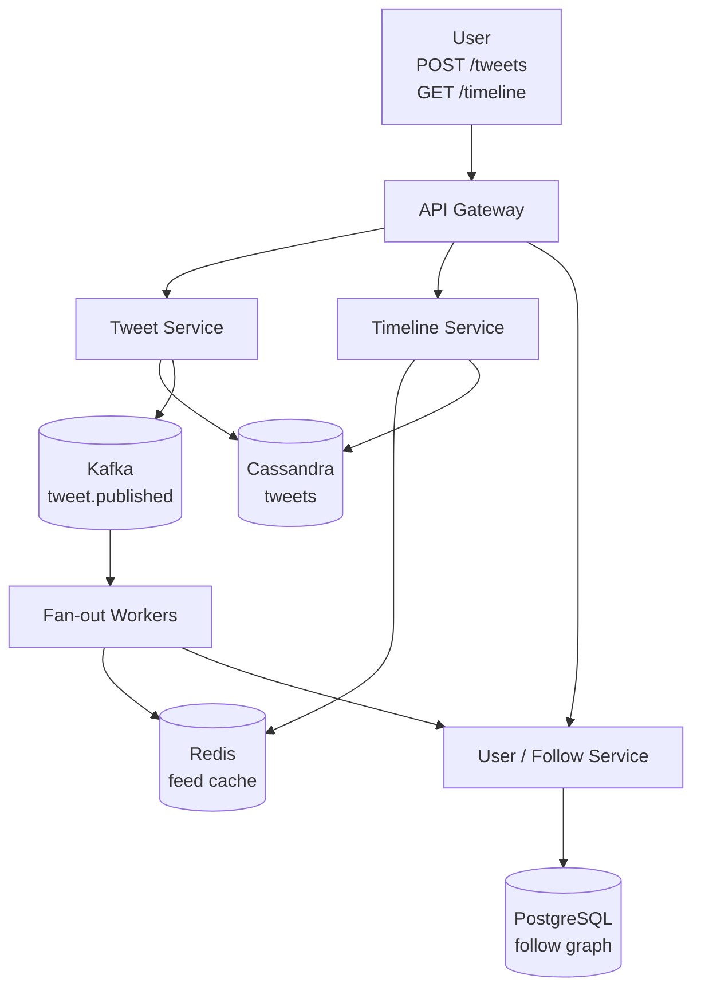

# Twitter / Social Feed

## Содержание

- [Фаза 1: Уточнение требований](#фаза-1-уточнение-требований)
- [Фаза 2: Оценка нагрузки](#фаза-2-оценка-нагрузки)
- [Фаза 3: Ключевое решение — Fan-out Strategy](#фаза-3-ключевое-решение--fan-out-strategy)
- [Фаза 4: Deep Dive](#фаза-4-deep-dive)
- [Сквозные потоки](#сквозные-потоки)
- [Трейдоффы](#трейдоффы)
- [Failure Scenarios](#failure-scenarios)
- [Interview-ready ответ (2 минуты)](#interview-ready-ответ-2-минуты)

Разбор задачи "Спроектируй Twitter". Ключевой challenge — news feed generation: fan-out on write vs fan-out on read, проблема celebrity (аккаунты с 100M+ подписчиков). Проверяет понимание компромиссов между latency и consistency.

---

## Фаза 1: Уточнение требований

### Функциональные требования

```
Вопросы:
  - Что именно: tweet + feed, или полный Twitter с DM, trending, search?
  - Ленту персонализировать (алгоритм) или chronological?
  - Retweet, reply, like — в scope?
  - Уведомления о новых твитах от подписок?
  - Поиск по тексту?
```

**Договорились (scope):**
- Написать твит (текст, до 280 символов)
- Читать home feed (твиты от тех на кого подписан)
- Follow / Unfollow
- Like, Retweet
- Счётчики: likes, retweets, replies
- Базовый поиск по хэштегам

**Out of scope:** DM, trending topics, ads, Spaces, персонализированный алгоритм ранжирования, notifications (есть в кейсе 02).

### Нефункциональные требования

```
- DAU: 200M пользователей
- Timeline read: 200M × 10 reads/day = 2B reads/day ≈ 23K reads/sec
- Tweet write: 200M × 5 tweets/day = 1B tweets/day ≈ 12K writes/sec
- Follow graph: ~300 подписок на среднего пользователя
  Celebrity (Elon Musk, Obama) → 100M+ подписчиков
- Feed freshness: новые твиты должны появляться < 10 сек
- Read latency: feed load < 200ms p99
- Availability: 99.99%
- Storage: твиты хранить вечно
```

---

## Фаза 2: Оценка нагрузки

```
Fan-out при публикации твита:
  Обычный пользователь: 300 подписчиков → 300 feed insertions
  Celebrity: 100M подписчиков → 100M feed insertions на 1 твит!
  
  12K tweets/sec × 300 avg followers = 3.6M feed insertions/sec
  (без учёта celebrity — с ними пики намного выше)

Storage (tweets):
  1 tweet: ~300 bytes (text + metadata)
  1B tweets/day × 365 × 5 лет = 1.825T tweets
  1.825T × 300B ≈ 550 TB → распределённое хранилище

Feed storage (если precomputed):
  Наивно: 200M users × 1000 твитов × 8 B (id) = 1.6 TB

  Но 8 байт на элемент — это размер числа, а не размер записи в Redis.
  Элемент списка хранится строкой, плюс накладные структуры:
  реально ~20-25 B на элемент.

  200M × 1000 × 22 B ≈ 4,4 TB — почти втрое больше наивной оценки
```

**Главная оптимизация fan-out — не рассылать неактивным.** 3,6 млн вставок/с считаются по ВСЕМ подписчикам, но лента нужна только тем, кто зайдёт её прочитать:

```
Типично активны за последние 30 дней — меньшинство подписчиков.
Если это 20%, то:

  вставок:  3,6 млн/с → ~720 тыс./с
  память:   4,4 TB    → ~0,9 TB

Ленту неактивного пользователя строим лениво при его возвращении
(fan-out on read по подпискам), а дальше он снова становится активным.
```

Без этой отсечки система платит и записью, и памятью за ленты, которые никто не откроет — а в соцсети таких большинство.

---

## Фаза 3: Ключевое решение — Fan-out Strategy

Это центральный architectural decision для Twitter.

### Вариант 1: Fan-out on Write (Push model)

```
При публикации твита:
  1. Сохранить твит в Tweets DB
  2. Найти всех подписчиков
  3. Добавить tweet_id в feed каждого подписчика (Redis List)
  
При чтении ленты:
  LRANGE feed:{user_id} 0 99  → мгновенно (список уже готов)
  + fetch tweet content по IDs

Плюсы:
  + Чтение O(1) — просто взять из Redis
  + Низкая latency чтения
  
Минусы:
  - Запись медленная: 1 tweet × 300 followers = 300 writes
  - Celebrity problem: 100M writes при одном твите Илона Маска
  - Memory: хранить precomputed feeds для 200M users
```

### Вариант 2: Fan-out on Read (Pull model)

```
При публикации твита:
  1. Сохранить твит в Tweets DB
  Всё! 

При чтении ленты:
  1. Получить список подписок user → [followed_1, followed_2, ..., followed_300]
  2. Для каждого: SELECT tweet_id FROM tweets WHERE user_id = X ORDER BY created_at DESC LIMIT N
  3. Merge sort (N×300 записей) → топ 100
  4. Fetch tweet content

Плюсы:
  + Запись простая, нет fan-out
  + Нет Memory hotspot для celebrity
  
Минусы:
  - Чтение: N запросов (300 подписок × 1 запрос) = 300 SELECT
  - Latency при 23K reads/sec × 300 queries = 7M queries/sec → нереалистично без кеша
  - Для 300 подписок — ещё приемлемо; для 5000 подписок — нет
```

### Hybrid approach (реальное решение Twitter)

```
Проблема: Fan-out on Write не работает для celebrity
Проблема: Fan-out on Read не работает при большом количестве подписок

Решение: комбинация

Fan-out on Write ДЛЯ:
  - Обычных пользователей (< N followers, например < 1M)
  - Их твиты сразу расталкиваются в feeds подписчиков

Fan-out on Read ДЛЯ:
  - Celebrity-аккаунтов (> 1M followers)
  - При загрузке ленты: fetch recent tweets от celebrity + merge с precomputed feed

При загрузке ленты пользователя:
  1. LRANGE feed:{user_id} 0 99  (precomputed feed, без celebrity твитов)
  2. Определить какие из подписок — celebrity
  3. Для каждой celebrity: GET recent_tweets:{celebrity_id} (кешированы отдельно)
  4. Merge sort: precomputed + celebrity tweets
  5. Вернуть топ 100
```

---

## Фаза 4: Deep Dive

### Архитектура



### Роль каждого компонента

Сквозная идея — **гибридный fan-out из-за асимметрии графа**: обычные авторы расталкиваются on-write, celebrity читаются on-read; precomputed feed и celebrity-твиты мержатся при чтении.

**Tweet Service.**
*Зачем:* пишет твит в Cassandra, публикует `tweet.published` в Kafka.
*Почему отдельно:* запись твита и его доставка подписчикам — разные нагрузки; брокер развязывает их. Профиль — [Kafka](../../07-message-brokers-and-streaming/01-kafka.md).

**Fan-out Workers.**
*Зачем:* по событию расталкивают tweet_id в feed подписчиков (`LPUSH`+`LTRIM`), пропуская celebrity.
*Почему отдельно + асинхронно:* fan-out — самая тяжёлая операция (300–1M вставок на твит); батчи + Redis pipeline, горизонтальный скейл по партициям Kafka. At-least-once и идемпотентность — [reliability / idempotency](../reliability-patterns/06-idempotency.md).

**Timeline Service.**
*Зачем:* собирает ленту — precomputed feed + recent celebrity-твиты, merge по Snowflake.
*Почему отдельно:* read-path с бюджетом 200 мс p99; держим его тонким (3–5 round-trips в Redis).

**Cassandra (tweets).**
*Зачем:* durable-хранилище твитов, партиция по `user_id`, clustering по Snowflake.
*Почему не Postgres:* 1B твитов/день и 550 TB — write-heavy, горизонтальный масштаб. Профиль — [Cassandra](../../06-databases/database-systems-catalog/05-cassandra.md).

**Redis (feed cache + counters).**
*Зачем:* precomputed-ленты (List), отдельно кешированные celebrity-твиты, like-счётчики `INCR`+flush, `liked_by` Set.
*Почему Redis:* `LRANGE`/`MGET` за sub-ms; счётчик вирусного твита иначе стал бы write-hotspot (тот же приём, что в [Avito](./13-avito-classifieds.md)). Профиль — [Redis](../../06-databases/database-systems-catalog/08-redis.md), сценарии — [Redis real scenarios](../../06-databases/database-systems-catalog/08a-redis-real-scenarios.md).

**PostgreSQL (follow graph).**
*Зачем:* рёбра follow, выборка подписчиков для fan-out.
*Почему реляционка:* граф нужен консистентно при follow/unfollow; индекс по `followee_id` даёт быстрый список подписчиков — [postgresql / indexes](../../06-databases/database-systems-catalog/postgresql/02-indexes.md).

---

### Tweet Service и хранилище

**Почему Cassandra?**

```
Требования:
  - 1B tweets/day writes
  - Читать по user_id + time range
  - Огромный объём, горизонтальное масштабирование

Cassandra схема — ДВЕ таблицы, и это не стилистика:
  CREATE TABLE tweets (
    user_id     BIGINT,
    tweet_id    BIGINT,      -- Snowflake ID (time-ordered)
    content     TEXT,
    created_at  TIMESTAMP,
    PRIMARY KEY (user_id, tweet_id)
  ) WITH CLUSTERING ORDER BY (tweet_id DESC);

  -- Счётчики ОБЯЗАНЫ жить отдельно: Cassandra не разрешает
  -- смешивать COUNTER с обычными колонками в одной таблице
  -- ("Cannot mix counter and non counter columns").
  CREATE TABLE tweet_counters (
    tweet_id      BIGINT PRIMARY KEY,
    like_count    COUNTER,
    reply_count   COUNTER,
    retweet_count COUNTER
  );

  Partition key = user_id → все твиты одного пользователя вместе
  Clustering key = tweet_id DESC → новые первыми

  Запрос последних твитов:
    SELECT * FROM tweets WHERE user_id = ? LIMIT 20;
    → O(1) по partition, O(log N) по clustering key
```

**Tweet ID — Snowflake:**
```
64-bit ID:
  41 бит: timestamp ms (69 лет с 2010)
   5 бит: datacenter
   5 бит: machine
  12 бит: sequence

Свойство: сортируется по времени без ORDER BY поля
  Только WHERE tweet_id > {cursor_id} для пагинации
  → Эффективная cursor-based pagination
```

---

### Fan-out Workers

```
При публикации:
  Tweet Service → Kafka: topic=tweet.published
  Key=user_id (партиционирование по автору)

Fan-out Worker (консьюмер):
  1. Получить tweet
  2. Проверить: user имеет > 1M followers? → celebrity flag, не fan-out
  3. Обычный user: получить список подписчиков из Follow DB (или кеш)
  4. Для каждого подписчика:
     LPUSH feed:{follower_id} {tweet_id}
     LTRIM feed:{follower_id} 0 999  // хранить только 1000 последних

Параллельность:
  Для пользователя с 100K followers — разбить на батчи
  Каждый батч → Redis PIPELINE (батч команд за 1 round trip)
  
  100K LPUSH / 1ms RTT = ~100 сек линейно
  Батчи по 1000 + pipeline: ~100 round trips = ~100ms

Горизонтальное масштабирование:
  Несколько consumer groups в Kafka
  Partition per worker → параллельная обработка разных авторов
```

---

### Timeline Service: чтение ленты

```
GET /timeline?user_id=123&cursor=&limit=20

1. Получить precomputed feed:
   tweet_ids = LRANGE feed:{user_id} 0 99  (100 кандидатов)

2. Определить celebrity подписки пользователя:
   celebrity_follows = SMEMBERS celeb_follows:{user_id}  
   // хранить отдельно при follow celebrity

3. Fetch recent celebrity tweets:
   для каждого celebrity:
     LRANGE user_tweets:{celebrity_id} 0 19  // последние 20, кешированы отдельно

4. Merge sort по tweet_id (time-ordered Snowflake):
   merge(precomputed_ids, celebrity_tweet_ids)
   → топ 20

5. Bulk fetch tweet content:
   MGET tweet:{id1} tweet:{id2} ... tweet:{id20}
   (твиты кешированы в Redis после первого чтения)

6. Вернуть список твитов

Total Redis calls: 1 LRANGE + N LRANGE celebrity + 1 MGET
  → 3-5 round trips → ~5ms
```

**Cache warming:**
```
При первом входе пользователя после долгого отсутствия:
  feed:{user_id} пустой
  → Cold start: выполнить fan-out on read, наполнить кеш
  → Async, показать пользователю сначала загрузку
```

---

### Follow Graph

```sql
-- Простая модель
CREATE TABLE follows (
  follower_id  BIGINT NOT NULL,
  followee_id  BIGINT NOT NULL,
  created_at   TIMESTAMPTZ NOT NULL DEFAULT NOW(),
  PRIMARY KEY (follower_id, followee_id)
);

CREATE INDEX idx_follows_followee ON follows(followee_id, created_at DESC);
-- Для получения всех подписчиков (fan-out): O(1) по followee_id
```

**Graph кеш в Redis:**
```
followers:{user_id} → Redis Set (для быстрого fan-out)
  Обновлять при follow/unfollow

celebrity_follows:{user_id} → Redis Set (только celebrity подписки пользователя)
  Обновлять при follow celebrity

Проблема больших Sets:
  100M followers Маска → Redis Set 100M × 8 bytes = 800MB на одну запись
  Решение: для celebrity fan-out использовать PostgreSQL batch query
  + кешировать подписчиков батчами (offset-based)
```

---

### Likes и Counters

**Проблема:** горячий твит (вирусный) получает 100K+ лайков за минуту.

```
Наивный: UPDATE tweets SET like_count += 1 → write hotspot

Решение: Redis INCR + async flush
  INCR like_count:{tweet_id}
  SADD liked_by:{tweet_id} {user_id}  // для проверки "лайкнул ли пользователь"
  
  Batch flush каждые 30 сек:
    Читать all like_count из Redis
    UPDATE tweets SET like_count = ? WHERE tweet_id = ?
    
  Проверка "лайкнул ли пользователь":
    SISMEMBER liked_by:{tweet_id} {user_id}  // O(1)

Альтернатива — Cassandra COUNTER:
  UPDATE tweet_counts SET like_count = like_count + 1 WHERE tweet_id = ?
  Cassandra нативно поддерживает distributed counters → нет hotspot
```

---

### Search по хэштегам

Полнотекстовый/фасетный поиск по 1T+ твитам — отдельный индекс [Elasticsearch / OpenSearch](../../06-databases/database-systems-catalog/09-elasticsearch-and-opensearch.md), наполняемый из потока публикаций (как Outbox→ES в [Avito-кейсе](./13-avito-classifieds.md)).

```
Elasticsearch индекс:
  {
    tweet_id: "1234...",
    content: "Привет #golang #go #programming",
    hashtags: ["golang", "go", "programming"],
    author_id: 456,
    created_at: "2024-01-15T10:00:00Z",
    like_count: 42
  }

Запрос:
  GET /search?q=%23golang&sort=recent
  
  {
    "query": { "term": { "hashtags": "golang" }},
    "sort": [{ "created_at": "desc" }],
    "size": 20
  }

Trending hashtags:
  Kafka Consumer: подсчитывать hashtag frequency в sliding window
  Flink: топ-10 за последний час → Redis
  GET /trending → читать из Redis (обновляется раз в 5 мин)
```

---

## Сквозные потоки

**1. Публикация твита обычного автора.**
`POST /tweets` → Cassandra (INSERT, Snowflake id) → `tweet.published` в Kafka → Fan-out Worker берёт подписчиков → батчами `LPUSH feed:{follower}` + `LTRIM 0 999`.
*Итог:* лента подписчика уже готова к чтению; запись развязана от доставки через брокер.

**2. Публикация твита celebrity.**
INSERT в Cassandra → Fan-out Worker видит флаг `>1M followers` → **не** расталкивает; твит лишь кешируется в `user_tweets:{celebrity}`.
*Итог:* один твит Маска не порождает 100M вставок; стоимость переносится на чтение, где её можно разделить.

**3. Чтение home feed.**
`LRANGE feed:{user}` (precomputed) + `LRANGE user_tweets:{celebrity}` по celebrity-подпискам → merge по Snowflake → `MGET` контента.
*Итог:* 3–5 round-trips в Redis ≈ 5 мс, укладываемся в 200 мс p99; гибрид закрывает обе проблемы.

**4. Лайк вирусного твита.**
`INCR like_count:{tweet}` + `SADD liked_by:{tweet} {user}` → batch-flush в Cassandra раз в 30 сек; «лайкнул ли пользователь» — `SISMEMBER` O(1).
*Итог:* 100K лайков/мин не создают write-hotspot в БД; точность счётчика eventual.

---

## Трейдоффы

| Компонент | Выбор | Альтернатива | Причина |
|---|---|---|---|
| Fan-out | Hybrid (write + read) | Pure push / pure pull | Celebrity problem |
| Порог celebrity | 10-50 тыс. подписчиков | 1M | При 1M «обычный» автор даёт сотни тысяч вставок на твит |
| Кому рассылать | Только активным за 30 дней | Всем подписчикам | 3,6 млн вставок/с → ~720 тыс.; память 4,4 TB → ~0,9 TB |
| Tweet storage | Cassandra | PostgreSQL | Write throughput, horizontal scale |
| Счётчики | Отдельная таблица COUNTER | Колонки в `tweets` | Cassandra запрещает смешивать counter и обычные колонки |
| Feed storage | Redis Sorted Set | Redis List | ZADD идемпотентен: повторный fan-out не плодит дубли |
| Tweet ID | Snowflake | UUID v4 | Time-ordered, sortable |
| Counters | Redis INCR + flush | Cassandra COUNTER | Flexibility, но потеря при Redis crash |
| Search | Elasticsearch | PostgreSQL FTS | Scale: 1T+ indexed tweets |

### Fan-out threshold: почему НЕ 1M

Порог в 1M выглядит естественно («celebrity — это миллионники»), но по бюджету записи он не проходит:

```
Автор с 999 тыс. подписчиков ещё считается «обычным»,
значит один его твит = 999 тыс. вставок.

Даже при отсечке по активным (20%) это ~200 тыс. вставок
на ОДИН твит. Сотня таких авторов, пишущих раз в час:
  100 × 200 000 / 3600 ≈ 5,5 тыс. вставок/с сверху,
  и это ровно те авторы, чьи твиты ждут быстрее всего.

Порог должен считаться от бюджета публикации, а не от красивого числа.
```

```
Рабочий диапазон — 10-50 тыс. подписчиков:
  до порога: вставки укладываются в секунды даже с батчами
  выше:      автор помечается celebrity, его твиты читаются on-read

Чем выше порог → меньше работы на чтении, дольше публикация
Чем ниже порог → быстрая публикация, больше merge при чтении

Порог стоит делать динамическим: растёт лаг fan-out — снижаем,
разгрузились — поднимаем обратно.
```

Сравнение с реальностью: у Twitter порог публично не раскрыт, но по описаниям архитектуры он ближе к десяткам тысяч, а не к миллиону.

---

## Failure Scenarios

```
Fan-out worker упал:
  Kafka: at-least-once, сообщение остаётся в топике
  Worker перезапустится → продолжит с последнего offset
  Возможен повторный fan-out одного и того же твита

  ВАЖНО: LPUSH НЕ идемпотентен — повтор кладёт tweet_id второй раз.
  Список придётся чистить на чтении, и дубли съедают окно LTRIM.

  Поэтому лента — Sorted Set, а не List:
    ZADD feed:{user} {tweet_id} {tweet_id}
    повтор той же записи ничего не меняет → fan-out идемпотентен
    ZREVRANGE feed:{user} 0 99   — та же выборка, тот же порядок
    ZREMRANGEBYRANK feed:{user} 0 -1001  — аналог LTRIM

  Цена: ZSET дороже List по памяти (~2x), но избавляет
  от дедупликации на чтении и делает повтор безопасным.

Redis упал (feed cache):
  Fallback: fan-out on read для всех (медленнее, но работает)
  Rebuild: при восстановлении Redis → warm cache для активных пользователей
  Alert: немедленно, Redis — критичный компонент

Cassandra нода упала:
  Replication factor = 3, quorum reads/writes
  Потеря одной ноды → автоматически переключается на другие реплики
  Consistency level = QUORUM → пишем в 2 из 3, читаем из 2 из 3
```

---

## Interview-ready ответ (2 минуты)

> "Twitter — это задача fan-out. Ключевой вопрос: push или pull для home feed?
>
> Pure push: при 100M followers у celebrity — 100M Redis writes на один твит. Недопустимо.
> Pure pull: 300 подписок × SELECT = 300 запросов на каждое открытие ленты. Не масштабируется.
>
> Hybrid: fan-out on write для обычных пользователей, on-read для celebrity. Порог беру в диапазоне 10-50 тысяч подписчиков, а не миллион: при пороге в миллион автор с 999 тысячами ещё считается обычным и даёт сотни тысяч вставок на один твит.
>
> Вторая оптимизация, без которой цифры не сходятся: рассылать только активным. Лента нужна тем, кто её откроет; если активны 20%, то 3,6 миллиона вставок в секунду превращаются в 720 тысяч, а память с 4,4 терабайт — в 0,9. Вернувшемуся пользователю ленту достраиваем лениво.
>
> Storage: Cassandra, партиционированная по user_id. Счётчики лайков — обязательно отдельной таблицей: Cassandra не разрешает смешивать COUNTER с обычными колонками. Feed держу в Sorted Set, а не в List: fan-out at-least-once, и ZADD повтором не плодит дубликаты, тогда как LPUSH положил бы твит дважды.
>
> Likes: Redis INCR + async flush в Cassandra каждые 30 сек. SISMEMBER для 'лайкнул ли пользователь'.
>
> При чтении ленты: 1 Redis LRANGE + N LRANGE для celebrity + 1 MGET для content = 3-5 round trips ≈ 5ms. Укладываемся в 200ms p99."
