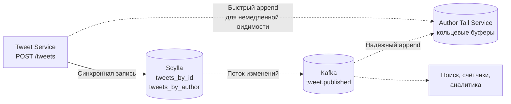
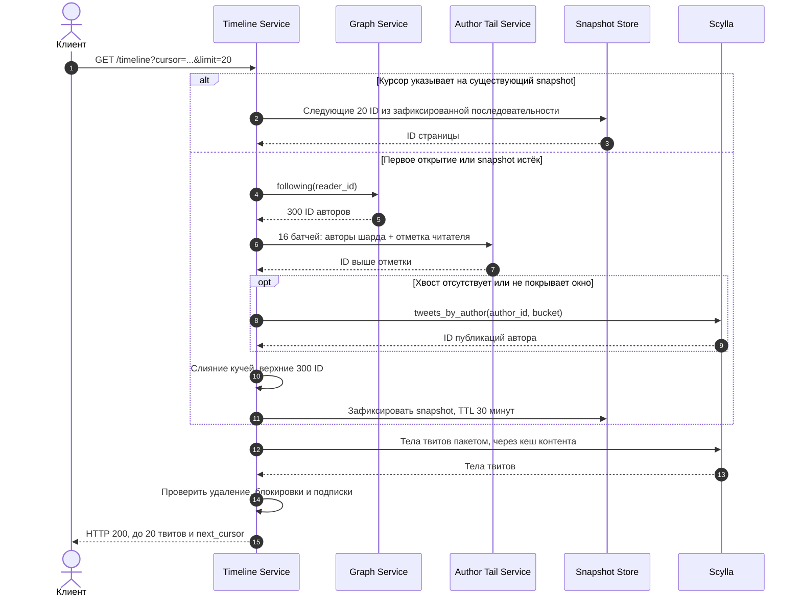
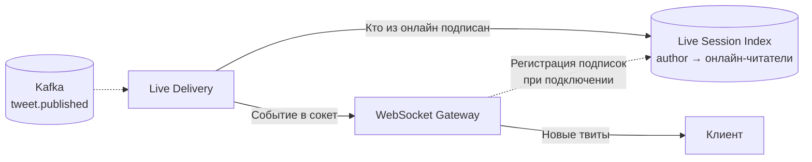

# Twitter / Social Feed: pull-first альтернатива

## Содержание

- [Что проверяет разбор](#что-проверяет-разбор)
- [Фаза 1: те же требования, другая ось решения](#фаза-1-те-же-требования-другая-ось-решения)
- [Фаза 2: оценка нагрузки для pull-first](#фаза-2-оценка-нагрузки-для-pull-first)
- [Фаза 3: ключевое решение — что материализуем](#фаза-3-ключевое-решение--что-материализуем)
- [Архитектура](#архитектура)
- [Роль каждого компонента](#роль-каждого-компонента)
- [Deep dive: Author Tail Service](#deep-dive-author-tail-service)
- [Deep dive: граф только вперёд](#deep-dive-граф-только-вперёд)
- [Deep dive: snapshot вместо материализованной ленты](#deep-dive-snapshot-вместо-материализованной-ленты)
- [Deep dive: индекс онлайн-сессий](#deep-dive-индекс-онлайн-сессий)
- [Запись и согласованность](#запись-и-согласованность)
- [Сквозные потоки](#сквозные-потоки)
- [Что исчезает вместе с push](#что-исчезает-вместе-с-push)
- [Трейдоффы](#трейдоффы)
- [Failure scenarios](#failure-scenarios)
- [Сравнение с базовым разбором](#сравнение-с-базовым-разбором)
- [Типичные ошибки](#типичные-ошибки)
- [Interview-ready ответ (2 минуты)](#interview-ready-ответ-2-минуты)
- [Связанные материалы](#связанные-материалы)

Второй разбор той же задачи «Спроектируй Twitter» на тех же требованиях, что и
[08. Twitter / Social Feed](./08-twitter-social-feed.md), но с противоположным ключевым решением.
Базовый кейс материализует ленту каждого читателя заранее и вводит отдельный режим для авторов
с огромным числом подписчиков. Здесь персональные ленты не материализуются вообще: лента
собирается на чтении над компактным индексом «что нового у автора», который целиком помещается
в память.

Оба разбора допустимы на собеседовании. Ценность второго — в том, что он показывает, какая
часть сложности базовой схемы не является свойством задачи и исчезает при другом выборе.

Как и базовый кейс, это учебный проект, а не описание внутренней архитектуры X. Все объёмы,
пороги и SLO — допущения.

---

## Что проверяет разбор

Разбор проверяет умение задавать вопрос «какую величину мы вообще оптимизируем».

Fan-out на запись (`fan-out on write`, раздача публикации по лентам подписчиков в момент
публикации) ускоряет чтение до одного обращения к готовому списку. Но в принятых допущениях
чтений 69 тыс./с, а порождённых ими вставок в ленты — миллионы в секунду. То есть дешёвая
операция делается ещё дешевле за счёт стократного удорожания дорогой.

Возражение базового кейса против pull-модели — оценка «20,83 млн авторских чтений/с на пике».
Эта цифра верна только при допущении, что «прочитать автора» означает запрос в базу данных.
Если чтение автора — это поиск по ключу в шардированной хеш-таблице в памяти, который
батчируется по два десятка авторов на один вызов, то те же 20,83 млн распадаются на 16 узлов
и превращаются в обычную нагрузку сервиса на Go. Вся альтернатива держится на этом
переопределении стоимости pull, поэтому арифметика ниже разобрана подробно.

---

## Фаза 1: те же требования, другая ось решения

Функциональные и нефункциональные требования берутся из базового кейса без изменений: текстовые
публикации, хронологическая домашняя лента по 20 элементов, follow/unfollow, like, retweet,
поиск по хэштегам. Числа допущений повторены в таблице, чтобы разбор читался самостоятельно.

| Параметр | Допущение |
|---|---|
| Зарегистрированные пользователи | 1 млрд |
| DAU | 200 млн |
| Активные за 30 дней | 400 млн |
| Открытия ленты | 10 на DAU в сутки |
| Публикации | 5 на DAU в сутки |
| Подписки | в среднем 300 на пользователя |
| Большой автор | 100 млн подписчиков |
| Пик | среднее × 3 |
| Свежесть | 99% публикаций видны подписчику за 10 секунд |
| Задержка чтения | p99 серверного ответа менее 200 мс |

Меняется одно продуктовое обещание. Базовый кейс возвращает `202 Accepted` после приёма команды
в журнал, и твит появляется в хранилище позже. Здесь запись синхронная и возвращает
`201 Created`: автор сразу видит собственную публикацию в ленте, потому что хвост автора
обновляется в том же запросе. Почему это стало возможным, разбирается в разделе
[Запись и согласованность](#запись-и-согласованность): нагрузка записи в этой схеме падает
настолько, что асинхронный приём перестаёт быть необходимостью.

**Ось резки.** Базовый кейс делит систему по популярности автора: обычный автор обслуживается
через push, автор выше порога 50 тыс. подписчиков — через pull. Здесь система делится по
размеру списка подписок читателя: обычный читатель обслуживается через pull, читатель с
аномально большим числом подписок получает материализованную ленту.

Выбор оси определяется формой распределения. У авторов число подписчиков растягивается от 300
до 100 млн, то есть на пять с лишним порядков, и граница между режимами проходит по самой
населённой части распределения. У читателей число подписок укладывается в диапазон от единиц
до десятков тысяч, а хвост за 10 тыс. подписок составляет доли процента аккаунтов. Резать
выгоднее там, где хвост короче: тогда исключение остаётся исключением и не требует постоянной
подстройки порога.

---

## Фаза 2: оценка нагрузки для pull-first

### Базовые потоки

Значения совпадают с базовым кейсом, потому что продуктовые допущения те же.

```text
Чтения:
    200 млн × 10 / 86 400 ≈ 23 148 запросов/с в среднем
    пик × 3 ≈ 69 444 запросов/с

Публикации:
    200 млн × 5 / 86 400 ≈ 11 574 записей/с в среднем
    пик × 3 ≈ 34 722 записей/с
```

### Работа на записи

В базовом кейсе одна публикация порождает вставку в ленту каждого активного подписчика; с
отсечкой по 40% активных получателей это 1,39 млн вставок/с в среднем и 4,17 млн/с на пике.

Здесь одна публикация порождает фиксированный объём работы независимо от числа подписчиков:

```text
На одну публикацию:
    2 upsert в Scylla (tweets_by_id и tweets_by_author)
    1 append в хвост автора

На пике:
    34 722 × 2 = 69 444 записей/с в хранилище
    34 722 append/с в память

Сравнение горячего слоя:
    4 170 000 / 34 722 ≈ 120
```

Вставок в горячий слой примерно в 120 раз меньше. Это же снимает требование к пропускной
способности очереди доставки: доставлять по подписчикам больше нечего.

### Память индекса хвостов

Хвост автора (`author tail`) — кольцевой буфер из последних N идентификаторов публикаций
одного автора. Берём N = 64; обоснование выбора — ниже в
[Deep dive: Author Tail Service](#deep-dive-author-tail-service).

```text
На одного автора:
    кольцевой буфер: 64 ID × 8 B = 512 B
    служебные поля записи (последний ID, позиция, длина) = 16 B
    запись в мапе «author_id → индекс в массиве» ≈ 28 B
    итого ≈ 556 B, округляем до 560 B

400 млн активных за 30 дней авторов × 560 B = 224 GB
с одной репликой → 448 GB
при 16 шардах: 224 / 16 = 14 GB на primary-шард
узел, хранящий свой шард и копию соседнего → ≈ 28 GB
```

Сравнение с материализованными лентами базового кейса (40 TB на primary-узлах, 80 TB с
репликой) даёт разницу примерно в 180 раз. Она складывается из двух независимых множителей, и
их полезно разделять:

- **Размер окна.** 64 элемента вместо 1000 дают множитель 15,6. Лента читателя обязана хранить
  весь диапазон его прокрутки, а хвост автора — только то, что может попасть в верх слияния.
- **Плотность кодирования.** Плотный массив `int64` вместо Sorted Set даёт множитель порядка 11:
  8,75 B на элемент с учётом служебных полей против допущения 100 B на элемент Redis.

Второй множитель — следствие специализированной структуры, а не свойство pull-модели: Sorted Set
хранит score, member произвольной длины и индекс skip list, которые здесь не нужны. Первый
множитель — уже свойство модели.

### Фан-ин на чтении

```text
69 444 запросов/с × 300 подписок = 20 833 200 поисков по ключу/с на пике

При 16 шардах:
    20 833 200 / 16 ≈ 1 302 075 поисков/с на узел
    300 / 16 ≈ 19 авторов в одном батче
    69 444 × 16 ≈ 1 111 104 вызовов/с всего
    1 111 104 / 16 ≈ 69 444 вызовов/с на узел
```

Стоимость на узле складывается из двух частей. Поиск по ключу в предварительно разделённой
хеш-таблице занимает порядка 100–200 нс, поэтому 1,3 млн поисков/с расходуют примерно
`1 302 075 × 200 нс ≈ 0,26` ядра. Обработка вызова с сериализацией стоит около 10–20 мкс,
поэтому 69 444 вызовов/с расходуют примерно `69 444 × 15 мкс ≈ 1` ядро. Обе части умещаются в
один узел с большим запасом; узкое место сдвигается в сеть и в хвост задержки, а не в процессор.

Числа в наносекундах — ориентир порядка величины для оценки на собеседовании, а не измерение.
Реальные значения получают профилированием на представительном распределении подписок и с
прогретой кучей.

### Сколько кандидатов реально участвует в слиянии

```text
Доля активных среди подписок принимается равной 0,4:
    300 × 0,4 = 120 активных авторов

Публикации от них за сутки:
    120 × 5 = 600

Интервал между открытиями ленты:
    16 часов бодрствования / 10 открытий = 1,6 часа

Новых публикаций за интервал:
    600 × 1,6 / 24 = 40
```

Между двумя открытиями ленты появляется около 40 новых публикаций примерно от 25–30 авторов, а
страница содержит 20 элементов. Поэтому слияние идёт по десяткам кандидатов, а не по тысячам, и
хвосту достаточно вернуть только идентификаторы выше отметки читателя. Это режет объём ответа,
хотя и не уменьшает число вызовов.

### Прочие структуры

```text
Snapshot сессии (зафиксированный результат слияния для пагинации):
    читатели, открывавшие ленту за последние 30 минут:
        200 млн / 16 часов = 12,5 млн в час → ≈ 6 млн за 30 минут
    6 млн × 300 ID × 8 B ≈ 14,4 GB, с накладными расходами ≈ 25 GB

Индекс онлайн-сессий (author → онлайн-читатели):
    5 млн одновременных соединений × 300 подписок = 1,5 млрд записей
    1,5 млрд × 8 B = 12 GB, с накладными расходами структуры ≈ 24 GB

Граф только вперёд (reader → authors):
    1 млрд × 300 × 8 B = 2,4 TB на диске
    горячая часть 200 млн DAU × 300 × 8 B = 480 GB в памяти узлов
```

Хранилище публикаций совпадает с базовым кейсом: 1,825 трлн записей за 5 лет, около 547,5 TB
логических данных, 1,64 PB при коэффициенте репликации 3. Выбор модели данных не меняется,
поэтому расчёт не повторяется — см. [08. Twitter / Social Feed](./08-twitter-social-feed.md).

Суммарно горячий слой этой схемы — примерно `448 + 25 + 24 + 480 ≈ 977 GB`, то есть около
одного терабайта против 80 TB материализованных лент.

---

## Фаза 3: ключевое решение — что материализуем

Домашнюю ленту можно подготовить в трёх разных точках времени, и выбор точки определяет всё
остальное в архитектуре.

| Когда готовим | Единица хранения | Сколько таких единиц | Что дорого |
|---|---|---|---|
| При публикации | лента читателя | пары «автор, подписчик» | запись и память |
| При открытии ленты | хвост автора | авторы | чтение и хвост задержки |
| Никогда | нет | — | каждое чтение идёт в хранилище |

Базовый кейс выбирает первую строку и лечит её худший случай отдельным режимом для крупных
авторов. Этот разбор выбирает вторую.

Решающий аргумент — число единиц хранения. Материализованная лента существует для каждой пары
«автор, подписчик»: 300 млрд рёбер графа означают 300 млрд потенциальных записей, и именно
поэтому появляется проблема автора со 100 млн подписчиков. Хвост автора существует для каждого
автора: 400 млн активных аккаунтов, и число подписчиков на этот объём не влияет вообще. Автор со
100 млн подписчиков занимает ровно столько же памяти, сколько автор с тремя.

Отсюда следует главное структурное свойство схемы: **проблема celebrity в ней не решается, а не
возникает**. Нет порога, нет режимов автора, нет переключения между ними, нет backfill при
переключении и нет гистерезиса, защищающего от дребезга.

Цена — чтение становится составной операцией. Дальше разбирается, из чего она состоит и чем
ограничивается её хвост задержки.

---

## Архитектура

Система делится на три контура: запись публикации, сборка ленты на чтении и доставка в открытые
соединения. Коробка обозначает кластер, а не один процесс.

**1. Запись.** Tweet Service синхронно записывает публикацию в Scylla и получает подтверждение,
после чего отвечает `201 Created`. Параллельно он делает быстрый append в хвост автора, чтобы
публикация была видна немедленно. Надёжное обновление хвоста и всех производных индексов идёт
через поток изменений (`CDC`, change data capture) из хранилища.



**2. Чтение.** Timeline Service получает список подписок, опрашивает шарды хвостов одним батчем
на шард, сливает результат в кучу и берёт верхние кандидаты. Готовая последовательность
идентификаторов фиксируется как snapshot сессии, после чего загружаются тела твитов.



**3. Доставка в открытые соединения.** При установке соединения список подписок читателя
регистрируется в обратном индексе, который живёт только пока соединение открыто. Публикация
рассылается по этому индексу, поэтому онлайн-читатель получает твит без повторного слияния.



---

## Роль каждого компонента

| Компонент | Что делает и почему выделен |
|---|---|
| API Gateway | Аутентификация, ограничение частоты запросов, маршрутизация; идентификатор читателя берётся из сессии |
| Tweet Service | Проверяет публикацию, присваивает идентификатор, синхронно записывает и отвечает `201` |
| Scylla | Единственный источник истины: тело по идентификатору и история по автору с временным бакетом |
| Author Tail Service | Держит в памяти последние 64 идентификатора каждого активного автора; заменяет собой и материализованные ленты, и кеш публикаций автора |
| Graph Service | Хранит только направление «читатель → авторы»; обратное направление в этой схеме не нужно |
| Timeline Service | Собирает кандидатов, выполняет слияние, фиксирует snapshot, проверяет видимость и формирует страницу |
| Snapshot Store | Хранит зафиксированную последовательность идентификаторов сессии, чтобы страницы 2 и дальше не пересобирались |
| Live Session Index | Обратный индекс подписок, существующий только для открытых соединений |
| Content Cache | Кеширует тела твитов; единственная структура, одинаковая в обоих разборах |
| Kafka | Переносит поток изменений из хранилища к производным индексам; не участвует в приёме запроса |

Author Tail Service объединяет две роли, которые в базовом кейсе разнесены: `feed:{reader_id}`
и `user_tweets:{author_id}`. В базовой схеме кеш публикаций автора нужен для обслуживания
крупных авторов, а ленты — для всех остальных. Здесь остаётся только вторая структура, и она
обслуживает всех авторов одинаково.

---

## Deep dive: Author Tail Service

### Структура записи

На одного автора хранится запись фиксированного размера: кольцевой буфер идентификаторов,
позиция записи, число заполненных элементов и самый старый покрытый идентификатор.

```text
Запись автора 4242, буфер на 8 элементов (в системе 64):

    позиция записи ↓
    [ 905 | 901 | 887 | 0   | 0   | 0   | 0   | 0   ]
      ^новые                  ^свободно

    last_id     = 905   — самая свежая публикация
    len         = 3     — сколько элементов заполнено
    covered_min = 887   — ниже этой границы хвост не отвечает

Автор публикует твит 910:

    [ 910 | 905 | 901 | 887 | 0   | 0   | 0   | 0   ]
    last_id = 910, len = 4, covered_min = 887

После переполнения буфера (len = 8) добавление 950 вытесняет 887:

    [ 950 | ... | 901 ]
    covered_min = 901 — запрос ниже 901 обслуживается из Scylla
```

Поле `covered_min` отличает «у автора нет более старых публикаций» от «хвост их не помнит». Без
него читатель, вернувшийся после долгого перерыва, получил бы неполную ленту молча.

### Почему 64 элемента

Число выбирается из глубины, на которую хвост обязан отвечать без обращения к хранилищу.
Хвост должен покрывать интервал между двумя открытиями ленты у обычного читателя: по расчёту
выше это около 40 публикаций на всю ленту и лишь несколько на одного автора. Запас в 64
покрывает автора, опубликовавшего 64 твита с последнего визита читателя; более активный автор
или более долгий перерыв уводят запрос в `tweets_by_author`, что корректно, но дороже.

Число настраивается по доле обращений в хранилище. Увеличение до 128 удваивает память
(с 224 до 440 GB) и имеет смысл, только если доля промахов заметно влияет на p99.

### Устройство в памяти и сборщик мусора

Наивная реализация `map[int64]*tailEntry` на 400 млн записей создаёт 400 млн указателей,
которые сборщик мусора обязан обходить при каждом цикле. Это делает паузы и загрузку процессора
зависимыми от размера индекса.

Структура строится так, чтобы указателей не было вообще:

```go
type tailEntry struct {
    ids        [64]int64  // массив по значению, не срез
    lastID     int64
    coveredMin int64
    pos        int32
    length     int32
}

type shard struct {
    mu      sync.RWMutex
    index   map[int64]int32 // author_id → позиция в arena
    arena   []tailEntry
}
```

Массив `[64]int64` встроен в структуру по значению, поэтому `arena` не содержит указателей и
сборщик мусора не обходит её содержимое. Мапа `map[int64]int32` также не содержит указателей ни
в ключе, ни в значении, и среда выполнения Go помечает её бакеты как не требующие сканирования.
В результате индекс размером в десятки гигабайт на узел не участвует в работе сборщика.

Если заменить `[64]int64` на срез `[]int64`, свойство теряется: каждая запись получает указатель
на отдельный массив, и появляются те самые 400 млн ссылок. Разница между массивом и срезом здесь
не стилистическая, а определяющая для эксплуатации.

### Обслуживание запроса

```text
Timeline Service:
    1. Разложить 300 авторов по 16 шардам по hash(author_id) % 16.
    2. Отправить 16 вызовов параллельно, каждый с отметкой читателя.
    3. Ограничить общее число одновременных вызовов на процесс.
    4. Для шарда, не ответившего за свой дедлайн, отправить дублирующий
       запрос к реплике.
    5. Собрать ответы, слить кучей, взять верхние 300 ID.
```

Параллелизм ограничивается `errgroup.Group` с `SetLimit`, а не запуском goroutine на автора:
при 69 тыс. запросов/с неограниченный запуск goroutine превращает всплеск нагрузки в рост
потребления памяти. Каждому вызову назначается собственный дедлайн через `context.WithTimeout`,
меньший, чем общий бюджет запроса.

Восстановление хвоста горячего автора из Scylla объединяется через `singleflight`: при промахе
по популярному автору тысячи одновременных запросов порождают один запрос в хранилище, а
остальные ждут его результат. Без этого промах по одному крупному автору превращается в лавину
запросов к одной партиции.

### Слияние

Кандидаты приходят как 300 отсортированных по убыванию последовательностей, из которых
непустыми оказываются примерно 25–30. Слияние выполняется кучей из `container/heap`:

```text
k = число непустых последовательностей ≈ 30
нужно получить 300 верхних ID

стоимость ≈ (k + 300) × log k ≈ 330 × 5 ≈ 1650 сравнений
```

Полторы тысячи сравнений целых чисел — это единицы микросекунд, то есть слияние не является
значимой частью бюджета задержки. Бюджет расходуют сетевые обращения и загрузка тел твитов.

---

## Deep dive: граф только вперёд

В базовом кейсе граф хранится в двух направлениях. Прямое «читатель → авторы» нужно для проверки
подписки и сборки ленты, обратное «автор → подписчики» — для рассылки при публикации. Обратное
направление стоит дорого: это ещё 300 млрд рёбер, отдельная проекция с постраничным чтением для
автора со 100 млн подписчиков, обновление проекции через outbox и согласование версий с кешем.

В pull-first обратное ребро не требуется нигде: публикация не рассылается по подписчикам, а
чтение идёт от читателя к авторам. Остаётся одно направление:

```sql
CREATE TABLE follows (
    reader_id BIGINT,
    author_id BIGINT,
    created_at TIMESTAMP,
    PRIMARY KEY (reader_id, author_id)
);
```

Чтение списка подписок — это одно обращение по ключу партиции. Список из 300 идентификаторов
занимает 2,4 KB и кешируется целиком вместе с версией графа.

**Follow и unfollow.** После подписки новые публикации автора участвуют в следующем же слиянии,
поэтому отдельный backfill не нужен: история автора уже лежит в его хвосте и в
`tweets_by_author`. После отписки автор исчезает из списка подписок, и его публикации перестают
попадать в кандидаты немедленно. Устаревших идентификаторов в чужих структурах не остаётся,
потому что этих структур нет. Единственное исключение — уже зафиксированный snapshot сессии, из
которого отписанный автор отфильтровывается на выдаче.

Это заметно проще, чем в базовом кейсе, где подписка требует ограниченного backfill недавних
публикаций, а отписка оставляет идентификаторы в материализованной ленте до её перестроения.

Обратное направление всё же нужно одному продуктовому сценарию: показать список подписчиков в
профиле. Это не путь чтения ленты, поэтому обслуживается отдельным постраничным запросом по
вторичному индексу или отдельной проекцией с допустимым отставанием. Требование к нему на
порядки мягче, чем к участку критического пути.

---

## Deep dive: snapshot вместо материализованной ленты

Персональная структура в этой схеме тоже есть, но живёт она не от публикации, а от открытия
ленты.

При первом запросе Timeline Service сливает кандидатов и фиксирует верхние 300 идентификаторов
как snapshot сессии с временем жизни 30 минут. Страницы 2, 3 и дальше берутся из этой
зафиксированной последовательности без повторного слияния.

```text
Открытие ленты:
    слияние → [910, 905, 901, 887, ..., 300 ID] → snapshot:{session_id}
    страница 1 = элементы 0..19

Следующая страница:
    cursor = {session_id, offset: 20}
    страница 2 = элементы 20..39, слияние не выполняется

Прокрутка за 300 элементов или истёкший snapshot:
    слияние продолжается от последнего ID вниз, уже по tweets_by_author
```

Такая пагинация решает задачу стабильности выдачи прямее, чем курсор поверх живой ленты.
Публикации, появившиеся после открытия, физически не могут сдвинуть границы страниц, потому что
последовательность уже зафиксирована. Базовому кейсу для того же приходится хранить в курсоре
верхнюю границу сессии и следить, чтобы новые записи её не пересекали.

**Содержимое курсора.** Идентификатор snapshot, смещение, версия формата и отметки по каждому
источнику на случай, если какой-то шард не ответил. Курсор подписывается, иначе его смещение
можно подделать и получить чужую последовательность. Если страница собрана без ответа одного из
шардов, смещение по этому источнику не двигается, и пропущенные авторы попадут в следующее
слияние, а не исчезнут навсегда.

**Стоимость.** Snapshot хранится только для читателей с недавней активностью, поэтому объём
определяется одновременными сессиями, а не общим числом пользователей: около 25 GB против 80 TB
материализованных лент. Потеря snapshot не требует восстановления — следующий запрос просто
выполняет слияние заново.

---

## Deep dive: индекс онлайн-сессий

Pull-модель отвечает на вопрос «что появилось с прошлого визита», но не доставляет твит в
открытое приложение сама. Для этого вводится обратный индекс, ограниченный только текущими
соединениями.

```text
Подключение читателя:
    прочитать его 300 подписок
    для каждого автора добавить reader_id в список онлайн-подписчиков

Публикация:
    для автора взять список онлайн-подписчиков (обычно пустой или короткий)
    отправить событие в их соединения

Отключение:
    удалить reader_id из тех же 300 списков
```

Это тот же fan-out на запись, но с принципиально другим множеством получателей: не 400 млн
активных за месяц, а 5 млн находящихся онлайн прямо сейчас. Даже у автора со 100 млн
подписчиков онлайн в конкретный момент оказывается порядка `100 млн × 5 млн / 1 млрд = 500 тыс.`
читателей при равномерном допущении, и рассылка по ним ограничивается по скорости.

Свойства индекса делают его дешёвым в эксплуатации:

- **Не требует восстановления.** После перезапуска узла клиенты переподключаются и
  регистрируются заново; данных, которые нужно было бы чинить, не существует.
- **Не требует согласованности.** Пропущенное событие означает, что твит появится при следующем
  обновлении ленты, то есть деградирует свежесть, а не полнота.
- **Ограничен по размеру.** Около 24 GB против терабайтов постоянной обратной проекции.

Гарантия свежести в 10 секунд обеспечивается именно этим контуром для онлайн-читателей и
обычным слиянием при открытии ленты для всех остальных.

---

## Запись и согласованность

### Почему синхронная запись стала возможной

Базовый кейс принимает публикацию в журнал команд и отвечает `202`, потому что за приёмом стоит
работа, которую нельзя выполнить в запросе: рассылка по подписчикам. Здесь этой работы нет, и
объём остаётся фиксированным: два upsert в Scylla и один append в память. При пике 34 722
публикаций/с это 69 444 записей/с в хранилище — нагрузка, которую кластер Scylla обслуживает
синхронно.

Синхронная запись даёт `201 Created` и чтение собственной записи без дополнительных механизмов:
хвост автора обновлён в том же запросе, поэтому автор видит публикацию в своей ленте сразу.

### Двойное обновление хвоста

Хвост обновляется из двух источников, и это сделано намеренно:

- **Синхронно из Tweet Service.** Даёт немедленную видимость. Если обновление не удалось,
  запрос всё равно успешен, потому что публикация уже сохранена в хранилище.
- **Асинхронно из потока изменений.** Даёт гарантию. Потерянное синхронное обновление
  восстанавливается за время отставания потока, обычно за единицы секунд.

Обычная проблема двойной записи (`dual write`, когда две независимые записи могут разойтись)
здесь не возникает, потому что источники не равноправны. Хранилище — единственный источник
истины, поток изменений производен от него, а синхронный append — ускорение, потеря которого
самоустраняется. Операция append идемпотентна: идентификатор добавляется, только если он больше
`last_id` и ещё не присутствует в буфере, поэтому повтор из потока изменений безопасен.

Сравните с базовым кейсом: там потерянная вставка в материализованную ленту делает твит
навсегда невидимым для конкретного подписчика, и система не обнаруживает этого сама — требуется
перестроение ленты. Здесь любая производная структура пересчитывается из партиции автора, и
промах лечится на следующем чтении.

### Идентификаторы

Модель идентификаторов совпадает с базовым кейсом: 41 бит миллисекунд, 10 бит узла, 12 бит
последовательности, порядок примерно соответствует времени создания, в JSON передаётся строкой.
Слияние по убыванию идентификатора работает так же.

Одно отличие проявляется на эксплуатации. В push-модели порядок зафиксирован в момент записи в
ленту: если генератор идентификаторов выдал сбойное значение, оно остаётся в лентах подписчиков
до перестроения. В pull-модели порядок вычисляется при каждом слиянии, поэтому исправление
метаданных публикации отражается в лентах сразу.

### Удаление и видимость

Удаление фиксируется в хранилище и распространяется потоком изменений: идентификатор убирается
из хвоста автора, тело удаляется из кеша контента, запись снимается с поискового индекса.
Чистить материализованные ленты не нужно, потому что их нет.

Проверка видимости на выдаче остаётся обязательной в обоих разборах: snapshot и кеш контента
могут содержать идентификатор, который уже удалён или скрыт блокировкой. При недоступности
проверки контент не выдаётся.

---

## Сквозные потоки

**1. Публикация.** `POST /tweets` → Tweet Service присваивает идентификатор → синхронный upsert
в `tweets_by_id` и `tweets_by_author` → append в хвост автора → `201 Created` с идентификатором.
Поток изменений доставляет публикацию в хвост повторно (идемпотентно), в поисковый индекс и в
Live Delivery. Объём работы одинаков для автора с тремя подписчиками и для автора со 100 млн.

**2. Открытие ленты.** `GET /timeline` без курсора → список подписок из Graph Service → 16
параллельных батчей в Author Tail Service с отметкой читателя → слияние кучей → snapshot на 300
идентификаторов с TTL 30 минут → загрузка тел твитов пакетом через кеш контента → проверка
видимости → 20 твитов и курсор.

**3. Прокрутка.** `GET /timeline` с курсором → страница берётся из snapshot без слияния →
загрузка тел → проверка видимости. За пределами snapshot слияние продолжается вниз по
`tweets_by_author` от последнего идентификатора.

**4. Доставка онлайн.** Публикация → Live Delivery читает список онлайн-подписчиков автора →
события уходят в открытые соединения с ограничением скорости. Читатель, который в этот момент
офлайн, увидит публикацию при следующем открытии ленты.

**5. Возврат после долгого отсутствия.** Отдельного механизма нет. Слияние идёт по тем же
хвостам; там, где `covered_min` не покрывает нужную глубину, запрос уходит в `tweets_by_author`
с ограниченным параллелизмом. Состояния «лента не готова» не существует, потому что готовить
нечего.

---

## Что исчезает вместе с push

Основной выигрыш схемы измеряется не в миллисекундах, а в количестве удалённых механизмов. Из
базового разбора уходят:

- порог 50 тыс. подписчиков и его калибровка по стоимости доставки и чтения;
- переключение режима автора push ↔ pull с версиями, границами идентификаторов, гистерезисом и
  минимальным временем в режиме;
- обратная проекция `followers_by_author` с постраничным чтением для крупных авторов и
  проектором на основе outbox;
- холодный старт и восстановление ленты вернувшегося пользователя, очередь перестроений и
  признак покрытия окна;
- ограниченный backfill после подписки и устаревшие идентификаторы после отписки;
- чистка удалённого твита из материализованных лент;
- отдельный сценарий «потеря Redis обрушивает Cassandra»: здесь штатный путь чтения и есть pull,
  поэтому деградация плавная.

Каждый из этих пунктов в базовом разборе занимает абзац или таблицу и требует отдельного
мониторинга. Это и есть аргумент, который стоит произносить на собеседовании: сложность здесь
не размазана по системе, а сосредоточена в одном сервисе с понятным профилем нагрузки.

---

## Трейдоффы

| Решение | Выбор в разборе | Цена и альтернатива |
|---|---|---|
| Модель ленты | Pull-first, материализации нет | Хвост задержки зависит от самого медленного шарда; push даёт одно обращение |
| Единица материализации | Хвост автора | Чтение становится составным; лента читателя дала бы готовый список |
| Исключение | Читатель с большим числом подписок | Нужен второй путь чтения; базовый кейс вместо этого выделяет крупных авторов |
| Приём публикации | Синхронно, `201` | Недоступность хранилища блокирует запись; журнал команд сохранил бы приём |
| Граф | Только вперёд | Список подписчиков в профиле обслуживается отдельно и медленнее |
| Пагинация | Snapshot сессии | Лента внутри сессии не обновляется до истечения TTL |
| Доставка realtime | Индекс онлайн-сессий | Нужен отдельный контур; в push-модели доставка была побочным эффектом |
| Индекс хвостов | Собственный сервис на Go | Своя эксплуатация и репликация вместо готового Redis |

### Порог для исключения по читателю

Стоимость чтения растёт линейно по числу подписок, поэтому исключение определяется этим числом.

```text
Читатель с 300 подписками:    16 батчей по 19 авторов, слияние по ≈30 источникам
Читатель с 5 000 подписок:    16 батчей по 313 авторов, слияние по ≈400 источникам
Читатель с 50 000 подписок:   16 батчей по 3 125 авторов, слияние по ≈4 000 источникам

Начальный порог: 5 000 подписок.
Доля таких читателей принимается равной 0,1% от 400 млн активных = 400 тыс.

Материализованные ленты для них:
    400 тыс. × 1000 ID × 100 B = 40 GB
```

Сорок гигабайт против сорока терабайт при полном push — это и есть выигрыш от выбора оси резки.
Порог настраивается по измеренному p99 слияния, а не берётся как константа; переключение
читателя в материализованный режим требует однократного построения ленты и далее обычного
fan-out по его подпискам.

### Где push остаётся лучше

Честный список случаев, в которых базовый разбор выигрывает:

- **Ранжированная лента с тяжёлыми признаками.** Материализованная лента даёт место, где
  ранжирование можно посчитать заранее. Смягчающее обстоятельство: современные ранжирующие ленты
  и так строятся как «отбор кандидатов, затем оценка на чтении», а pull-first выдаёт готовый
  набор кандидатов ровно в нужный момент.
- **Доступность записи при деградации хранилища.** Приём в журнал позволяет принимать публикации,
  когда база недоступна. Здесь запись в этот момент возвращает ошибку. Если требование важно,
  добавляется резервный журнал, используемый только при отказе хранилища, то есть путь Kafka
  становится исключением, а не нормой.
- **Предсказуемость хвоста задержки чтения.** Одно обращение к готовому списку проще
  бюджетировать, чем 16 параллельных вызовов с дублирующими запросами.

---

## Failure scenarios

| Сбой | Что произойдёт | Восстановление и ограничение |
|---|---|---|
| Узел Author Tail Service потерян | Авторы его шарда отвечают из хранилища | Чтение из `tweets_by_author` с ограниченным параллелизмом и `singleflight`; медленнее, но корректно |
| Шард отвечает дольше дедлайна | Часть авторов не попадает в кандидаты | Дублирующий запрос к реплике; иначе страница помечается частичной, а отметка этого источника в курсоре не двигается |
| Горячий автор перегружает шард | Растёт хвост задержки чтения | Реплики шарда, короткий локальный кеш в Timeline Service, объединение одновременных загрузок |
| Поток изменений отстаёт | Хвост обновлён только синхронным append | Свежесть не страдает; страдает самолечение после потерянного append |
| Синхронный append потерян | Публикация недоступна в ленте до прихода события | Поток изменений добавляет идентификатор идемпотентно |
| Scylla недоступна на запись | Публикация возвращает ошибку | Чтение продолжает работать из хвостов и кеша контента; резервный журнал вводится отдельным решением |
| Snapshot Store потерян | Прокрутка начинается заново | Слияние выполняется повторно; восстанавливать нечего |
| Live Session Index потерян | Прекращается доставка в открытые соединения | Клиенты переподключаются и регистрируются заново; лента обновляется обычным слиянием |

**Полная потеря индекса хвостов.** Это худший сценарий схемы, и его стоит считать честно. Все
69 444 чтений/с уходят в `tweets_by_author`: при 300 подписках и, по расчёту выше, примерно 30
авторах с новыми публикациями это порядка 2 млн запросов/с к Scylla, если запрашивать только
изменившихся авторов, и до 20,83 млн/с, если запрашивать всех. Ни то, ни другое кластер не
обслуживает без подготовки. Защита строится тремя средствами: восстановление хвостов идёт
лениво и только для реально запрашиваемых авторов, число одновременных восстановлений
ограничивается, а на время восстановления допускаются частичные ответы с явным признаком
неполноты.

Отличие от базового кейса здесь количественное, а не качественное: там потеря Redis тоже ведёт
к лавине, но восстанавливать приходится 400 млн лент, а здесь — только хвосты авторов, которых
кто-то читает, то есть десятки миллионов записей по мере обращения.

**Что наблюдаем.** p99 всей загрузки ленты и отдельно p99 фан-ина по шардам, долю дублирующих
запросов, долю обращений в хранилище при промахе хвоста, распределение числа подписок у
читателей, число авторов с новыми публикациями на один запрос, отставание потока изменений,
долю частичных страниц и объём памяти на узел индекса. Цели «10 секунд», «200 мс» и «99,99%»
проверяются раздельно: доступный ответ может оказаться частичным.

---

## Сравнение с базовым разбором

| Ось | [08. Twitter / Social Feed](./08-twitter-social-feed.md) | Этот разбор |
|---|---|---|
| Основная модель | Гибрид по автору, push по умолчанию | Pull-first, push как исключение |
| Единица материализации | Лента читателя | Хвост автора |
| Число единиц хранения | до 300 млрд пар «автор, подписчик» | 400 млн авторов |
| Память горячего слоя | ≈ 80 TB с репликой | ≈ 1 TB суммарно |
| Вставок в горячий слой на пике | до 4,17 млн/с | 34 722/с |
| Граф | Прямой и обратный, проекция через outbox | Только прямой |
| Проблема celebrity | Отдельный режим, порог, переключение | Не возникает |
| Приём публикации | Kafka-first, `202` | Синхронно, `201` |
| Холодный старт ленты | Отдельный механизм с очередью перестроений | Отсутствует как понятие |
| Пагинация | Курсор поверх живой ленты | Зафиксированный snapshot сессии |
| Доставка realtime | Побочный эффект fan-out | Отдельный индекс онлайн-сессий |
| Главный риск | Усиление записи, стоимость памяти, холодный старт | Хвост задержки фан-ина и горячие авторы |
| Где сложность | Размазана по режимам, переключениям и восстановлениям | Сосредоточена в одном сервисе |

Ни один из разборов не является «правильным ответом». Базовая схема ближе к тому, как исторически
развивались крупные социальные ленты, и лучше подходит, когда лента ранжируется тяжёлой моделью.
Схема из этого файла лучше подходит, когда лента хронологическая, требования к свежести умеренные,
а стоимость памяти и эксплуатации имеет значение.

---

## Типичные ошибки

- **Считать pull дорогим, не уточнив, чем читается автор.** Оценка «20,83 млн запросов/с»
  описывает обращения к базе данных. Та же величина, реализованная как поиск по ключу в памяти с
  батчированием, распадается на десятки тысяч вызовов на узел.
- **Сравнивать память лент и хвостов одним множителем.** Разница складывается из размера окна
  (64 против 1000) и плотности кодирования (плотный массив против Sorted Set). Первое относится
  к модели, второе — к выбору структуры данных, и смешивать их при защите решения не нужно.
- **Хранить хвосты как `map[int64]*tailEntry`.** Четыреста миллионов указателей делают паузы
  сборщика мусора функцией размера индекса.
- **Запускать goroutine на каждого автора.** При 300 подписках и 69 тыс. запросов/с это
  20 млн goroutine/с; нужен ограниченный параллелизм по шардам, а не по авторам.
- **Отдавать частичную страницу и двигать курсор целиком.** Если один шард не ответил, его
  публикации исчезнут из ленты навсегда; отметка по этому источнику должна остаться на месте.
- **Считать, что pull снимает вопрос горячего автора.** Автор со 100 млн подписчиков не создаёт
  записи, но его хвост читают все подписчики; нужны реплики шарда и объединение одновременных
  загрузок.
- **Обещать «медленнее, но всё работает» при потере индекса.** Без ограничения восстановления
  и допуска частичных ответов это обещание не выполняется.

---

## Interview-ready ответ (2 минуты)

**1. Почему не fan-out на запись?**

- Суть — fan-out на запись удешевляет 69 тыс. чтений/с ценой миллионов вставок/с и десятков
  терабайт памяти; оптимизируется не та величина.
- Альтернатива — материализуем не ленту читателя, а хвост автора: последние 64 идентификатора,
  400 млн записей по 560 B, около 224 GB вместо 40 TB.
- Следствие — автор со 100 млн подписчиков занимает столько же, сколько автор с тремя, поэтому
  проблема celebrity не решается, а не возникает.

**2. Из чего состоит чтение ленты?**

- Шаг 1 — список подписок читателя, одно обращение по ключу, 300 идентификаторов.
- Шаг 2 — 16 параллельных батчей в индекс хвостов, примерно по 19 авторов, с отметкой читателя.
- Шаг 3 — слияние кучей по 25–30 непустым источникам, около 1650 сравнений, единицы микросекунд.
- Шаг 4 — фиксация snapshot на 300 идентификаторов, затем пакетная загрузка тел и проверка
  видимости.

**3. Почему это не упирается в процессор?**

- Поиск — 20,83 млн обращений по ключу в секунду на 16 узлах дают 1,3 млн на узел, то есть
  примерно 0,26 ядра при 200 нс на поиск.
- Вызовы — 69 444 вызова/с на узел при 15 мкс на вызов дают примерно одно ядро.
- Память — индекс строится без указателей, поэтому десятки гигабайт на узел не участвуют в
  работе сборщика мусора.
- Проверка — числа проверяются нагрузочным тестом на реальном распределении подписок, а не
  принимаются как доказательство.

**4. Где схема ломается и что делаем?**

- Читатель с большим числом подписок — исключение по читателю: при более чем 5 000 подписок
  материализуем ленту, это 0,1% аккаунтов и около 40 GB.
- Горячий автор — реплики шарда, локальный короткий кеш и объединение одновременных загрузок.
- Медленный шард — дублирующий запрос к реплике; иначе частичная страница, и отметка этого
  источника в курсоре не двигается.
- Потеря индекса — ленивое восстановление только читаемых авторов, ограничение числа
  восстановлений и явный признак неполноты ответа.

**5. Что с записью и потерями?**

- Приём — синхронная запись в Scylla и `201 Created`; при 34 722 публикациях/с это обычная
  нагрузка.
- Видимость — быстрый append в хвост в том же запросе даёт автору чтение собственной записи.
- Гарантия — поток изменений повторяет append идемпотентно, поэтому потерянное синхронное
  обновление самоустраняется.
- Отличие — потерянная вставка в push-модели навсегда скрывает твит от подписчика, здесь любая
  производная структура пересчитывается из партиции автора.

---

## Связанные материалы

- [08. Twitter / Social Feed](./08-twitter-social-feed.md) — базовый разбор с гибридным fan-out,
  от которого этот файл отличается ключевым решением
- [04.1 WebSocket Chat at Scale](./04.1-websocket-chat-capacity.md) — родственный расчёт
  доставки в открытые соединения и ограничения fan-out
- [Highload Design Patterns](../highload-design-patterns.md) — каталог использованных приёмов
- [Cassandra](../../06-databases/database-systems-catalog/05-cassandra.md)
- [Redis](../../06-databases/database-systems-catalog/08-redis.md)
- [Kafka](../../07-message-brokers-and-streaming/01-kafka.md)

### Официальные источники

- [Apache Cassandra: logical data modeling](https://cassandra.apache.org/doc/latest/cassandra/developing/data-modeling/data-modeling_logical.html) — моделирование таблиц под известные запросы.
- [ScyllaDB: Change Data Capture](https://docs.scylladb.com/manual/stable/features/cdc/index.html) — поток изменений как источник для производных индексов.
- [Go: container/heap](https://pkg.go.dev/container/heap) — куча для слияния отсортированных последовательностей.
- [Go: golang.org/x/sync/singleflight](https://pkg.go.dev/golang.org/x/sync/singleflight) — объединение одновременных одинаковых запросов.
- [Go: golang.org/x/sync/errgroup](https://pkg.go.dev/golang.org/x/sync/errgroup) — ограниченный параллелизм через `SetLimit`.
