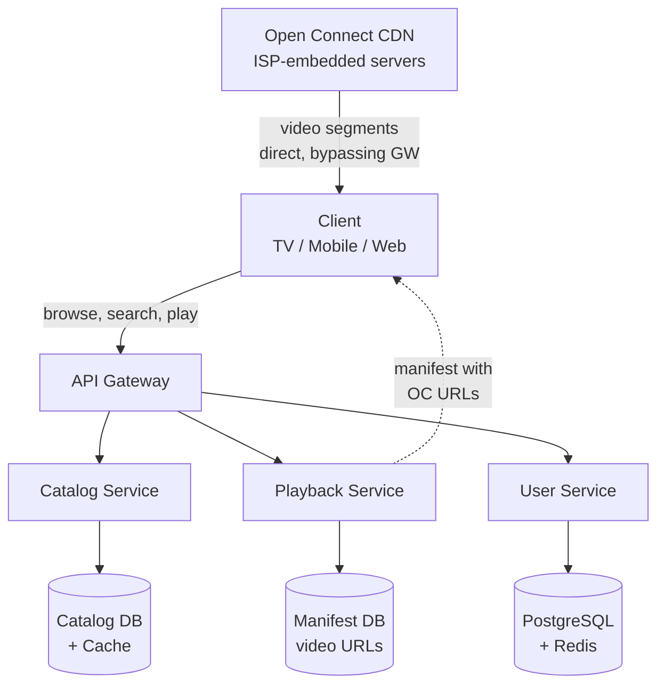

# Netflix / Video Streaming Platform

## Содержание

- [Фаза 1: Уточнение требований](#фаза-1-уточнение-требований)
- [Фаза 2: Оценка нагрузки](#фаза-2-оценка-нагрузки)
- [Фаза 3: Высокоуровневый дизайн](#фаза-3-высокоуровневый-дизайн)
- [Фаза 4: Deep Dive](#фаза-4-deep-dive)
- [Сквозные потоки](#сквозные-потоки)
- [Трейдоффы](#трейдоффы)
- [Interview-ready ответ (2 минуты)](#interview-ready-ответ-2-минуты)

Разбор задачи "Спроектируй Netflix". Похож на YouTube, но акцент другой: Open Connect CDN (собственная сеть доставки), multi-region высокая доступность, content catalog и персонализация. Классика для senior system design.

---

## Фаза 1: Уточнение требований

### Функциональные требования

```
Вопросы:
  - Фокус на streaming или на весь product (поиск, управление контентом, billing)?
  - Multi-device: TV, mobile, web?
  - Offline viewing (download для просмотра без сети)?
  - Live events (типа трансляций) — in scope?
  - Watchlist, history, resume watching?
```

**Договорились (scope):**
- Browse catalog: поиск и карточки контента
- Start playback: выбрать качество, начать воспроизведение
- Resume watching: продолжить с места остановки
- Adaptive bitrate streaming
- Рекомендации (высокоуровневый design без ML деталей)

**Out of scope:** upload контента (внутренний инструмент, не user-facing), billing, DRM deep dive, live events, offline download.

### Нефункциональные требования

```
- MAU: 240M пользователей (реальные данные Netflix)
- Пиковые concurrent streams: 15M одновременно (вечер пятницы)
- Каталог: 15K titles (сериалы + фильмы)
- Availability: 99.99% — стриминг критичен, downtime = churn
- Playback start < 2 сек
- Rebuffering < 0.5% времени просмотра
- Global: 190 стран, нужен CDN
- Трафик: Netflix = ~15% всего интернет-трафика в пиковые часы
```

---

## Фаза 2: Оценка нагрузки

```
Concurrent streams: 15M
  Средний bitrate: 5 Mbps (смесь качеств)
  Исходящий трафик: 15M × 5 Mbps = 75 Tbps

  ← Это невозможно обслуживать из одного датацентра
  ← Нужен distributed CDN максимально близко к пользователям

Content storage:
  Один видеофайл в 5 качествах:
    4K HDR ~50 GB, 1080p ~15 GB, 720p ~5 GB, 480p ~2 GB, 360p ~1 GB
    Итого ~73 GB

  Считать надо не по тайтлам, а по ЭПИЗОДАМ: сериал из 15K каталога —
  это десятки файлов, а не один.
    ~10K фильмов                        = 10K файлов
    ~5K сериалов × ~30 эпизодов         = 150K файлов
                                          ─────────────
                                          ~160K видеофайлов

  160K × 73 GB ≈ 12 PB в ОДНОМ кодеке

  Но кодеков три (H.264 для совместимости, HEVC для 4K, AV1 для новых):
    12 PB × 3 ≈ 35 PB

Metadata (каталог):
  15K titles × ~10 KB = 150 MB
  → Полностью помещается в память → aggressive caching

Browse-трафик:
  240M MAU × ~10 обращений/сутки ≈ 2,4 млрд/сутки ≈ 28K RPS
  пик ×5 ≈ 140K RPS
  → много, но это КЕШИРУЕМОЕ чтение 150 MB данных

Позиция просмотра — самая большая нагрузка записи, её легко упустить:
  15M одновременных стримов, отчёт каждые 10 секунд
  15 000 000 / 10 = 1,5 МЛН записей/с

  Это больше, чем любой другой поток записи в системе.
  Писать такое в PostgreSQL нельзя даже асинхронно.
```

---

## Фаза 3: Высокоуровневый дизайн



### Роль каждого компонента

Сквозная идея — **video plane отделён от control plane**: тяжёлый трафик (75 Tbps) идёт напрямую из Open Connect в обход API, а сервисы лишь возвращают манифест с URL нужного appliance. Каталог read-heavy → агрессивно кешируется; устойчивость — через fallback и chaos.

**Catalog Service.**
*Зачем:* browse/search по 15K тайтлов, метаданные карточек.
*Почему 3-уровневый кеш:* ~140K browse/сек в пике против единиц write/день; 150 MB каталога целиком влезают в in-process cache (L1), Redis (L2) — backup на рестарт, Postgres (L3) — source of truth. Каталог настолько мал, что L1 покрывает практически весь трафик чтения. Кеш-слой — [caching / Redis as cache](../../06-databases/caching/01-redis-as-cache.md).

**Playback Service.**
*Зачем:* при Play проверяет entitlement, подбирает ближайший appliance и codec/quality, отдаёт manifest URL.
*Почему отдельно:* это control-plane решение на старте сессии; сам контент через него не идёт.

**User Service.**
*Зачем:* resume-watching (позиция просмотра), «Continue Watching».
*Почему Redis + флаш по событиям:* 15M стримов с отчётом раз в 10 сек дают **1,5 млн записей/с** — это крупнейший поток записи во всей системе. Горячее состояние живёт в Redis, а в Postgres уходит не каждое обновление, а события (пауза, стоп, смена эпизода) плюс редкий страховочный флаш. Иначе БД просто не примет поток.

**Open Connect CDN (ISP-embedded).**
*Зачем:* раздаёт видеосегменты из приборов внутри сети ISP (< 1 мс), 95%+ трафика не выходит наружу; популярный контент пушится ночью.
*Почему собственный CDN, а не CloudFront/Akamai:* на масштабе Netflix свой CDN дешевле и контролируемее. Общая механика edge-доставки — [CDN / reverse proxy](../../08-networking-and-api/request-lifecycle/04-cdn-load-balancer-reverse-proxy.md), сквозной read-heavy поток — [external flows / read-heavy with CDN](../external-request-flows/02-read-heavy-request-with-cdn-and-cache.md).

**Manifest DB / Catalog DB / UserDB.**
*Зачем:* HLS/DASH-манифесты с OC-URL, метаданные, профили и прогресс.
*Почему разделены:* у каталога (read-mostly) и user-state (write-heavy позиции) разные паттерны; events об изменениях каталога идут через [Kafka](../../07-message-brokers-and-streaming/01-kafka.md) для инвалидации кешей.

---

## Фаза 4: Deep Dive

### Open Connect: Собственный CDN Netflix

Netflix не использует AWS CloudFront или Akamai для видео. Они построили **Open Connect** — собственную CDN-сеть, которая буквально живёт внутри дата-центров интернет-провайдеров.

```
Стандартный CDN:
  User → ISP → CDN PoP (city) → Origin (US)
  Latency: 20-50ms до CDN + трафик тарифицируется

Open Connect:
  User → ISP → Open Connect Appliance (внутри ISP!)
  Latency: < 1ms (локальная сеть ISP)
  Трафик: не выходит наружу → ISP экономит transit costs
  Netflix: ставит железо бесплатно, ISP экономит → win-win
```

**Как работает кеширование в Open Connect:**

Прежде чем говорить о стратегии кеширования, стоит посчитать парк — из этих двух чисел следует всё остальное:

```
Сколько приборов нужно по трафику:
  75 Tbit/с / 10 Gbit/с на прибор = 7 500 приборов при 100% загрузке
  реально при 50% запаса → ~15 000 приборов

Сколько каталога влезает в один прибор:
  100 TB SSD против ~35 PB каталога = 0,3%

Отсюда главное: прибор физически НЕ МОЖЕТ держать каталог.
Он держит лишь то, что почти наверняка посмотрят сегодня —
поэтому вопрос не «как кешировать», а «как заранее угадать,
что положить в эти 100 TB».
```

```
Appliance = специальный сервер с ~100TB SSD + 10Gbps порты
Стратегия: кешировать только популярный контент

Ночью (low traffic, 00:00 - 06:00 local time):
  Netflix Control Plane: "завтра выходит новый сезон Stranger Things"
  → Pre-push топ-1000 популярных видео на все appliances в регионе
  → Push по отдельной backbone сети (не через public internet)

Днём (основной трафик):
  95%+ запросов → из local appliance (< 1ms)
  5% miss → другой appliance в регионе → regional fallback → AWS S3

Cache fill strategy:
  LFU (Least Frequently Used): реже смотримый контент вытесняется
  Новый контент: принудительно кешировать в день выхода
```

---

### Playback Service: как начать воспроизведение

```
Пользователь нажимает Play:

1. GET /api/v1/playback/{video_id}
   Client sends: device_type, network_type, location, supported_codecs

2. Playback Service:
   a. Проверить entitlement (пользователь подписан? контент доступен в его стране?)
   b. Определить оптимальный Open Connect appliance:
      - Клиент в Москве → Moscow ISP → appliance в МТС/Ростелеком
      - Если appliance недоступен → fallback list
   c. Определить supported quality/codec:
      TV 4K + HEVC: 4K/HEVC манифест
      Mobile 4G: 1080p/H264 манифест
   d. Вернуть:
      {
        "manifest_url": "https://msk-oc-01.nflxvideo.net/content/{video_id}/manifest.m3u8",
        "license_url": "...",  // для DRM
        "supported_qualities": ["4k", "1080p", "720p"]
      }

3. Клиент: скачать manifest → начать воспроизведение с низкого качества
   → ABR алгоритм поднимает качество по мере заполнения буфера
```

---

### Video Encoding Pipeline

**Netflix Encoding Ladder — почему не стандартный:**

```
Стандартный подход:
  Все видео → фиксированный набор bitrate/resolution пресетов
  
Netflix подход: per-title encoding
  Мультфильм "Finding Nemo":
    Мало деталей, простые градиенты → хорошее качество при 1 Mbps
    
  "Peaky Blinders":
    Тёмные сцены, зернистость → нужно 4 Mbps для того же качества
    
  Per-title analysis:
    1. Закодировать 2-минутный отрывок при всех bitrates
    2. VMAF (Visual Multimethod Assessment Fusion) оценить quality
    3. Построить оптимальную "лестницу" для данного контента
    4. Сэкономить до 40% bandwidth при том же воспринимаемом качестве

Codec ladder:
  H.264: все устройства → legacy support
  H.265/HEVC: 4K контент → 50% меньше размер при том же качестве
  AV1 (VP9): новые устройства → лучший compression ratio, бесплатный
  
  Netflix encode каждый title в 3 кодеках для разных устройств
```

**Encoding Pipeline:**

```
Content ingestion (внутри Netflix Studios):
  Raw master file (ProRes 4K) → 
  Shot detection → 
  Per-shot encoding optimization →
  Multiple codec × quality variants → S3 (origin) → Open Connect push
  
  Время encoding: 4K фильм × 3 кодека × 5 качеств = ~2-4 часа на HPC кластере
  До выхода в прайм → нет жёстких latency требований
```

---

### Content Catalog Service

```
Каталог: 15K titles, очень читаемый (миллионы browse/sec, единицы write/day)

Стратегия: aggressive caching

L1: In-process cache (каждый Catalog Service инстанс)
  ConcurrentHashMap<title_id, TitleMetadata>
  Размер: 15K × 10KB = 150MB → умещается в heap
  Invalidation: TTL 5 минут (контент меняется редко)
  
L2: Redis Cluster
  Backup если in-process cache cold (рестарт сервиса)
  TTL 1 час

L3: PostgreSQL (source of truth)
  Читается только при L1+L2 miss (очень редко)

При обновлении контента (новый эпизод, изменение описания):
  1. UPDATE PostgreSQL
  2. Publish event → Kafka
  3. Catalog Service консьюмеры: инвалидировать in-process cache
  4. Redis: DEL title:{id}

Структура метаданных:
  title_id, type (movie/series), title, description, genres, cast,
  rating (PG, R...), available_in (list of countries), posters (per locale),
  seasons (for series), episodes
```

---

### Resume Watching: позиция просмотра

```
Клиент каждые 10 секунд:
  POST /api/v1/playback/position
  { "title_id": "...", "position_sec": 1842, "episode_id": "..." }

User Service:
  HSET watch_progress:{user_id}:{title_id} position 1842 updated_at {now}
  // Redis выдержит: 1,5 млн HSET/с распределяются по кластеру

Persistence — НЕ каждое обновление:
  Проводить все 1,5 млн записей/с через Kafka в PostgreSQL нельзя:
  это на порядки больше, чем реляционная БД примет, а 149 из каждых
  150 записей всё равно будут перезаписаны следующим обновлением.

  Сбрасываем в долговременное хранилище по СОБЫТИЯМ, а не по таймеру:
    - пауза, стоп, переключение эпизода, закрытие приложения
    - плюс страховочный флаш раз в ~5 минут для длинных сессий

  1,5 млн/с превращаются в единицы тысяч записей/с — это уже нормально.

  При потере Redis позиция откатывается к последнему сохранённому
  моменту (минуты, а не секунды). Для «продолжить просмотр» приемлемо:
  пользователь перемотает, данные не потеряны безвозвратно.

При запуске нового эпизода:
  Определить следующий эпизод:
  HGET watch_progress:{user_id}:{series_id} → { last_episode, position }
  if position > 0.9 × episode_duration → следующий эпизод
  else → continue from position

"Continue Watching" ряд на главной:
  SELECT title_id, position FROM watch_progress WHERE user_id = ?
  ORDER BY updated_at DESC LIMIT 20
  → агрегировать из PostgreSQL, кешировать в Redis (TTL 30 мин)
```

---

### Рекомендательная система (high-level)

```
Данные для рекомендаций:
  - Что смотрел пользователь (implicit feedback: досмотрел/бросил)
  - Что лайкнул / оценил
  - Демография (страна, устройство, время суток просмотра)
  - Поведение похожих пользователей (collaborative filtering)
  - Контентные характеристики (жанр, актёры, режиссёр)

Netflix реально использует:
  1. Offline batch (раз в день): SVD/ALS матричная факторизация
     → для каждого пользователя: топ-100 кандидатов
  2. Online ranking: лёгкая модель (XGBoost/LightGBM) с актуальными фичами
     → Sort кандидатов с учётом текущего контекста (время дня, устройство)
  3. Diversity: не показывать 20 похожих триллеров → mix genres

Артефакт: user_embedding, title_embedding векторы (latent space)
  HNSW (Approximate Nearest Neighbor): "найти похожие тайтлы"
  Faiss / Vespa для embedding search

Serving:
  Recs Service: читает топ-100 для user → ранжирует → возвращает 20
  Кеш: recommendations:{user_id} TTL 6 часов
```

---

### Availability: что если сервис падает?

Профильные доки: [reliability / circuit breaker](../reliability-patterns/03-circuit-breaker.md), [chaos engineering](../reliability-patterns/10-chaos-engineering.md), бюджет 99.99% — [SLO/SLI](../reliability-patterns/08-slo-sli-error-budgets.md).

```
Circuit Breaker (Hystrix/Resilience4j — Netflix это и придумал):
  
  Scenario: Recommendations Service временно недоступен
    Normal: show personalized recommendations
    Circuit open: show popular titles (trending) — fallback
    → Пользователь всё равно видит что-то разумное, не ошибку
  
  Scenario: Playback Service slow
    Timeout 500ms → fallback: cached last playback config
    → Менее оптимальный CDN, но видео начинается

Chaos Engineering (Netflix Chaos Monkey):
  Регулярно убивать случайные инстансы сервисов в production
  → Убедиться что система resilient
  → Netflix буквально изобрели эту практику

Multi-region:
  3+ regions (US-East, EU-West, AP-Southeast)
  Active-active: трафик идёт в ближайший healthy регион
  Геораспределённая репликация metadata DB
  
  При отказе региона:
    DNS failover < 60 сек → трафик переходит в другой регион
    Пользователи: небольшая задержка при reconnect, но сервис доступен
```

---

### Мониторинг качества воспроизведения (QoE)

```
Клиент собирает и отправляет:
  - Buffer events (когда и сколько буферизовало)
  - Bitrate switches (как часто и в какую сторону)
  - Startup time
  - Error codes
  - CDN appliance с которого идёт контент

Netflix QoE Metrics:
  - Rebuffer rate: % времени в "буферизации" (цель < 0.5%)
  - Playback start time (цель < 2 сек)
  - Highest playback bitrate (качество)
  - Error rate per device/region/ISP

Dashboard:
  Если rebuffer rate в Германии вырос с 0.3% до 2% за 5 минут
  → Automated alert → проблема на немецком Open Connect appliance
  → Трафик переключается на backup appliance
```

---

## Сквозные потоки

**1. Browse каталога.**
Client → Catalog Service → L1 in-process cache (hit ~µs) → при miss L2 Redis → при miss L3 Postgres.
*Итог:* миллионы browse/сек обслуживаются из памяти; БД видит почти ноль трафика.

**2. Старт воспроизведения.**
Play → Playback Service: entitlement + выбор ближайшего Open Connect appliance + codec/quality → manifest URL → клиент тянет сегменты напрямую из appliance (< 1 мс), ABR поднимает качество.
*Итог:* 75 Tbps идут мимо API; control-plane участвует только на старте сессии.

**3. Resume watching.**
Каждые 10 сек `HSET watch_progress` в Redis → async через Kafka в Postgres; при следующем запуске позиция/следующий эпизод из Redis.
*Итог:* частые апдейты не нагружают БД; потеря ≤ 10 сек прогресса при сбое Redis допустима.

**4. Деградация сервиса.**
Recommendations недоступен → circuit open → fallback на trending; Chaos Monkey регулярно убивает инстансы в prod, проверяя устойчивость; отказ региона → DNS failover < 60 сек.
*Итог:* пользователь всегда видит рабочий экран, а не ошибку; устойчивость проверена заранее, а не в инциденте.

---

## Трейдоффы

| Компонент | Netflix подход | Стандартный | Разница |
|---|---|---|---|
| CDN | Open Connect (собственный, в ISP) | CloudFront/Akamai | Netflix: меньше latency, контроль, экономия |
| Encoding | Per-title adaptive | Fixed bitrate ladder | Netflix: 40% bandwidth savings |
| Recs | Two-stage (candidates + ranking) | Simple CF | Scale: 240M users |
| Availability | Chaos Engineering + Circuit Breaker | Alert on failure | Netflix: proactive resilience |
| Cache | 3-level (L1 process + L2 Redis + DB) | Redis only | Catalog: read > write → aggressive |

---

## Interview-ready ответ (2 минуты)

> "Netflix — это прежде всего задача доставки видео в масштабе 75 Tbps. Ключевое отличие от стандартного CDN — Open Connect: Netflix ставит собственные серверы прямо внутри ISP-провайдеров. 95%+ трафика не выходит за пределы local network. Контент предзагружается ночью, пока трафик низкий.
>
> Playback flow: клиент нажимает Play → Playback Service определяет ближайший appliance, поддерживаемые кодеки, geo-entitlement → возвращает manifest URL → клиент делает ABR streaming прямо с appliance.
>
> Per-title encoding: разные видео кодируются с разными bitrate-лесенками — мультфильм хорош при 1 Mbps, тёмный сериал требует 4 Mbps. Экономия 40% bandwidth.
>
> Парк приборов считается из двух чисел: 75 Tbit/с при 10 Gbit/с на прибор дают порядка 7-15 тысяч приборов, а 100 TB SSD против 35 PB каталога — это 0,3%. То есть прибор физически не может держать каталог, и задача не «как кешировать», а «как заранее угадать, что положить в эти 100 терабайт».
>
> Catalog — 15K titles, 150MB данных — полностью в in-process cache, при пиковых ~140 тысячах browse в секунду до базы доходят единицы запросов. Персональные рекомендации кешируются per-user на 6 часов, обновляются батчем раз в день.
>
> Отдельно оговорю самую большую запись в системе, которую легко пропустить: 15 миллионов стримов отчитываются о позиции раз в 10 секунд — это полтора миллиона записей в секунду, больше любого другого потока. Держу их в Redis, а в постоянное хранилище пишу не по таймеру, а по событиям — пауза, стоп, смена эпизода: 149 из каждых 150 обновлений всё равно были бы перезаписаны следующим.
>
> Resilience: Netflix изобрели Chaos Engineering и Circuit Breaker (Hystrix). При падении Recommendations Service — fallback на trending titles. Multi-region active-active, DNS failover < 60 сек."
