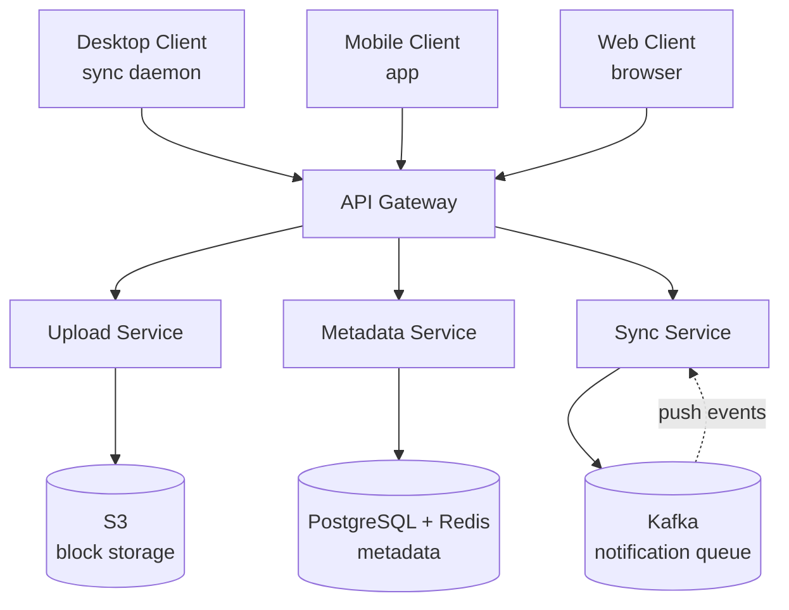

# Google Drive / File Storage System

## Содержание

- [Фаза 1: Уточнение требований](#фаза-1-уточнение-требований)
- [Фаза 2: Оценка нагрузки](#фаза-2-оценка-нагрузки)
- [Фаза 3: Высокоуровневый дизайн](#фаза-3-высокоуровневый-дизайн)
- [Фаза 4: Deep Dive](#фаза-4-deep-dive)
- [Сквозные потоки](#сквозные-потоки)
- [Трейдоффы](#трейдоффы)
- [Interview-ready ответ (2 минуты)](#interview-ready-ответ-2-минуты)

Разбор задачи "Спроектируй Google Drive (Dropbox, iCloud)". Проверяет понимание chunked upload, file deduplication, sync protocol, conflict resolution и версионирования.

---

## Фаза 1: Уточнение требований

### Функциональные требования

```
Вопросы:
  - Upload/download файлов или также редактирование (Google Docs)?
  - Нужна ли sync между устройствами (desktop client)?
  - Sharing: share link или share с конкретным пользователем?
  - Версионирование (восстановить старую версию)?
  - Совместное редактирование (Google Docs-style conflicts)?
  - Offline работа (изменить файл без сети → sync при подключении)?
```

**Договорились (scope):**
- Upload / Download файлов и папок
- Sync: изменение на одном устройстве → появляется на других (< 30 сек)
- Sharing: создать share link (read-only) и share с пользователем (read/write)
- File versioning: хранить последние 30 версий, восстановление
- Конфликты при одновременном редактировании: "conflict copy" (Dropbox-style)

**Out of scope:** collaborative real-time editing (Google Docs), full-text search внутри файлов, streaming медиа.

### Нефункциональные требования

```
- DAU: 50M пользователей
- Storage per user: 15 GB бесплатно (Google Drive реально)
- File size: до 5 GB на файл
- Sync latency: < 30 сек от изменения до появления на другом устройстве
- Availability: 99.99%
- Durability: 99.999999999% (11 nines — данные нельзя терять никогда)
- Bandwidth optimization: не загружать весь файл при маленьком изменении
```

---

## Фаза 2: Оценка нагрузки

```
Storage:
  50M users × 15 GB = 750 PB выделенной квоты
  Реально занято ~20% = 150 PB ЛОГИЧЕСКОГО объёма

  Дедупликация срезает 30-40%:
  150 PB × 0,65 ≈ 100 PB ФИЗИЧЕСКОГО объёма

  Различать обязательно: по логическому считаются квоты пользователей,
  по физическому приходят счета за хранение и планируется железо.

Uploads:
  50M × 1 upload/day × avg 5 MB = 250 TB/day upload
  250 TB / 86400 ≈ 3 GB/sec ingress

Downloads:
  50M × 3 downloads/day × avg 5 MB = 750 TB/day
  ≈ 9 GB/sec egress

Metadata operations (list files, check for updates):
  Sync clients проверяют наличие изменений
  50M × 10 checks/day = 500M/day ≈ 6K metadata ops/sec
  Peak: 5x = 30K ops/sec

Deduplication opportunity:
  Типичные файлы (photo, document) часто дублируются между пользователями
  Одинаковый README.md у 1M разработчиков → хранить один раз
  Экономия: ~30-40% storage
```

---

## Фаза 3: Высокоуровневый дизайн



### Роль каждого компонента

Сквозная идея — **content-addressed chunking**: файл = упорядоченный список SHA-256 хешей чанков. Из этого следует всё — bandwidth-экономия (грузим только новые чанки), cross-user дедупликация и дешёвый diff при изменении.

**Upload Service.**
*Зачем:* приём чанков, проверка «какие хеши уже есть», запись недостающих в S3.
*Почему отдельно:* существенная часть — быстрый existence-check по хешу (Bloom filter / Redis `SISMEMBER`), чтобы не грузить дубликаты; это горячий путь записи.

**Metadata Service.**
*Зачем:* дерево файлов/папок, версии, `file → [chunk_hashes]`, sharing.
*Почему отдельно + Postgres/Redis:* метаданные — это консистентность и частые list-операции; структура папок кешируется в Redis, source of truth в Postgres. Индексы/materialized path — [postgresql / indexes](../../06-databases/database-systems-catalog/postgresql/02-indexes.md).

**Sync Service.**
*Зачем:* принимает push от клиента, сравнивает версии, уведомляет другие устройства.
*Почему отдельно:* sync ≤ 30 сек требует адресной доставки событий онлайн-устройствам через WebSocket/long-polling. Протокол — [networking / WebSocket](../../08-networking-and-api/protocols/04-realtime/01-websocket.md).

**S3 (block storage, content-addressed).**
*Зачем:* durable-хранилище чанков по ключу-хешу, 11 nines из коробки.
*Почему object storage:* ~100 PB физического объёма; content-addressing даёт дедуп и иммутабельность чанков.
*Почему CDN здесь почти не помогает:* у личных файлов нет общей популярности — чанк запрашивают устройства одного владельца, hit rate низкий. Это принципиальное отличие от [YouTube](./07-youtube-video-platform.md) и [Netflix](./09-netflix-streaming.md), где топ-1% контента даёт основную часть трафика. [CDN](../../08-networking-and-api/request-lifecycle/04-cdn-load-balancer-reverse-proxy.md) оправдан только для публичных share-ссылок, а основные 9 GB/s исходящего планируются из региона.

**Kafka (notification queue).**
*Зачем:* `file.changed` → device-notification воркеры → пуш онлайн-устройствам.
*Почему через брокер:* развязывает запись изменения и веерное уведомление множества устройств пользователя. Профиль — [Kafka](../../07-message-brokers-and-streaming/01-kafka.md).

---

## Фаза 4: Deep Dive

### Chunked Upload: ключевая идея

**Проблема:** файл 1 GB. Загружать целиком — надёжно, но:
1. При обрыве сети → начинать заново
2. Изменили 1 строку в конце файла → снова загружать 1 GB
3. Один и тот же файл у 100 пользователей → хранить 100 копий

**Решение: Content-Addressed Storage + Chunking**

```
Алгоритм:
  1. Клиент разбивает файл на chunks (фиксированный или variable size)
  2. Вычислить SHA-256 каждого chunk → chunk_hash
  3. Перед загрузкой: спросить сервер "какие chunk_hash уже есть?"
  4. Загрузить только недостающие chunks
  5. Сообщить серверу: "файл = [chunk_hash_1, chunk_hash_2, ...]"

Хранение:
  Block Store: chunk_hash → binary data
  Metadata: file → ordered list of chunk_hashes

При изменении файла:
  Только изменённые chunks → новые hash → загрузить только их
  Неизменённые chunks → уже есть на сервере → не загружать
```

**Возобновление после обрыва получается бесплатно.** Отдельный `upload_id` и серверное состояние сессии не нужны: клиент повторно спрашивает «каких хешей не хватает» и догружает остаток. Состояние загрузки определяется содержимым, а не сервером — это прямое следствие content-addressing.

**Deduplication:**
```
Иванов загружает photo.jpg (SHA-256 = "abc123...")
Петров загружает ту же photo.jpg

Сервер: chunk с hash "abc123..." уже есть
  → Не хранить второй раз
  → Metadata Петрова просто указывает на те же chunks

Экономия: до 30-40% storage при типичном контенте
```

**Шифрование — две разные модели с противоположными последствиями.** Их часто смешивают, а они дают ровно обратный результат:

```
Серверное (SSE-S3 / SSE-KMS) — используется в этом дизайне:
  сервер видит открытые данные и считает хеш ДО шифрования
  → дедупликация работает полностью
  → шифруется то, что лежит на дисках, а не то, что приходит от клиента

Клиентское E2E (ключ есть только у пользователя):
  один и тот же файл у двух людей шифруется разными ключами
  → хеши получаются разными
  → cross-user дедупликация невозможна В ПРИНЦИПЕ, остаётся только per-user
  → осознанный размен: приватность против 30-40% объёма
```

Тот же content-addressed дедуп на ещё большем масштабе — тела массовых рассылок в [16. Gmail](./16-gmail-email-service.md) (одно тело на 10M получателей).

---

### Variable-Size Chunking (Rabin Fingerprint)

```
Фиксированный размер chunk (e.g., 4 MB) проблема:
  Файл: [AAAA | BBBB | CCCC | DDDD]
  Вставить 1 байт в начало: [XAAA | ABBB | BCCC | CDDD]
  Все chunks изменились! → загрузить весь файл заново

Rabin Fingerprint (Content-Defined Chunking):
  Скользящее окно по байтам файла
  Граница chunk = когда hash(window) % M == 0
  
  Результат: вставка байта сдвигает только ближайшие границы
  Большинство chunks (середина файла) остаются неизменными
  
  Параметры: avg chunk size 4MB (min 512KB, max 32MB)
  Trade-off: мелкие chunks → больше metadata, round trips
             крупные chunks → меньше dedup возможностей
```

---

### Sync Protocol

**Задача:** изменение на устройстве A → появилось на устройстве B.

```
Desktop Sync Client (daemon):
  1. File system watcher (inotify/FSEvents/ReadDirectoryChanges)
     → Событие: файл X изменился
  2. Compute chunk hashes нового состояния
  3. POST /sync/push:
     {
       "path": "/documents/report.docx",
       "version": 42,
       "chunks": ["hash1", "hash2", "hash3_new"],
       "device_id": "laptop-uuid"
     }
  4. Сервер: сравнить с last known version
  5. Ответ: "нужны chunks: hash3_new"
  6. Клиент: загрузить только hash3_new
  7. Сервер: обновить metadata, notify другие устройства

Notification другим устройствам:
  Kafka: topic=file.changed → device notification workers
  Long-polling или WebSocket к каждому online устройству:
    { "type": "file_changed", "path": "/documents/report.docx", "version": 43 }
  
  Устройство получает уведомление → pull новые chunks → применить
```

**Sync State Machine:**
```
Device_A изменяет файл:
  LOCAL_MODIFIED → UPLOADING → UPLOADED → SYNCED

Device_B получает уведомление:
  REMOTE_MODIFIED → DOWNLOADING → DOWNLOADED → SYNCED
```

### Догоняющая синхронизация: курсор изменений

Одних пуш-уведомлений недостаточно. Сообщения в брокере эфемерны, и устройство, отключённое на неделю, их просто не увидит — а `version` у файла локален и не говорит, что ещё поменялось в аккаунте. Нужен **монотонный курсор изменений на пользователя**:

```sql
CREATE TABLE changes (
  user_id   BIGINT      NOT NULL,
  revision  BIGINT      NOT NULL,   -- монотонно растёт в пределах аккаунта
  node_id   UUID        NOT NULL,
  op        TEXT        NOT NULL,   -- CREATE / UPDATE / DELETE / MOVE
  version   INT,
  ts        TIMESTAMPTZ NOT NULL DEFAULT now(),
  PRIMARY KEY (user_id, revision)
);
```

```
Клиент хранит последний применённый revision и при подключении просит дельту:

  GET /sync/delta?cursor=15243
  → { changes: [...], next_cursor: 15310 }

Дальше он тянет недостающие чанки и двигает курсор.
```

**Push — это оптимизация, а не механизм корректности.** WebSocket-уведомление лишь говорит «есть новое, сходи за дельтой» и экономит секунды; гарантию того, что состояние сойдётся, даёт именно курсор. Потерянное уведомление приводит к задержке, а не к рассинхрону.

Тот же приём, что reconnect-синхронизация в [04. Chat](./04-chat-messaging.md): клиент присылает свою позицию, сервер отдаёт всё, что после неё.

Журнал `changes` растёт бесконечно, поэтому его подрезают: записи старше N дней удаляются, а клиент, чей курсор протух, получает `410` и делает полную ресинхронизацию дерева.

---

### Conflict Resolution

**Сценарий:** Ноутбук и телефон оба offline, оба редактируют файл. Что при sync?

```
Dropbox подход (Conflict Copy):
  1. Оба устройства загружают изменения с одинаковым parent version
  2. Первый загружает → становится версия 43
  3. Второй загружает с parent=42 → конфликт!
  
  Conflict Copy:
    - Сохранить обе версии
    - Оригинальное имя: "report.docx" (победитель — первый)
    - Конфликтная копия: "report (Conflicted copy 2024-01-15, John's laptop).docx"
    - Оба файла синхронизируются на все устройства
    - Пользователь вручную мёржит если нужно

Google Drive подход:
  Для Google Docs: operational transformation → merge автоматически
  Для binary files (Word, Excel): то же что Dropbox — conflict copy
```

**Last-Write-Wins (альтернатива):**
```
Самое простое: последнее изменение побеждает (по timestamp)
Проблема: часы на устройствах не синхронизированы (clock skew)
  → Можно потерять более "правильное" изменение

Решение: использовать logical clock (Lamport timestamp) + server-side ordering
  Клиент отправляет: { parent_version: 42, changes: ... }
  Сервер: если parent_version актуален → принять, версия 43
           если parent_version устарел → conflict
```

---

### File Versioning

```sql
CREATE TABLE file_versions (
  file_id     UUID        NOT NULL,
  version     INT         NOT NULL,
  created_at  TIMESTAMPTZ NOT NULL DEFAULT now(),
  created_by  BIGINT,  -- user or device
  size_bytes  BIGINT,
  is_deleted  BOOLEAN     NOT NULL DEFAULT FALSE,
  PRIMARY KEY (file_id, version)
);

-- Связь версии с чанками — ОТДЕЛЬНОЙ таблицей, а не массивом внутри версии
CREATE TABLE file_version_chunks (
  file_id     UUID   NOT NULL,
  version     INT    NOT NULL,
  idx         INT    NOT NULL,   -- порядок чанка в файле
  chunk_hash  BYTEA  NOT NULL,   -- 32 байта, а не 64 hex-символа
  PRIMARY KEY (file_id, version, idx),
  FOREIGN KEY (file_id, version) REFERENCES file_versions(file_id, version)
);

-- Обратный индекс «кто ещё ссылается на этот чанк» — основа сборки мусора
CREATE INDEX idx_fvc_chunk ON file_version_chunks (chunk_hash);

-- Текущая версия (head)
CREATE TABLE files (
  id          UUID    PRIMARY KEY,
  owner_id    BIGINT  NOT NULL,
  parent_id   UUID,   -- папка
  name        VARCHAR(255),
  current_version INT,
  mime_type   VARCHAR(100),
  created_at  TIMESTAMPTZ NOT NULL DEFAULT NOW(),
  updated_at  TIMESTAMPTZ NOT NULL DEFAULT NOW()
);
```

**Почему список чанков вынесен из версии:**

```
1. Иначе невыполним GC. Чтобы понять, ссылается ли кто-то ещё на
   удаляемый чанк, при массиве пришлось бы искать хеш во ВСЕХ массивах
   таблицы. С отдельной таблицей это обычный индексный поиск по хешу.

2. Размер. SHA-256 как TEXT — 64 hex-символа, как BYTEA — 32 байта.
   На десятках миллиардов ссылок разница почти двукратная.

3. TOAST. Файл 5 GB при чанке 4 MB — это 1250 хешей, ~80 KB в одной
   ячейке: строка уходит в TOAST, и чтение версии тянет её целиком.

Цена решения: file_version_chunks — самая большая таблица метаданных,
десятки миллиардов строк. Партиционируется по file_id и шардируется
вместе с деревом файлов.
```

**Retention policy:**
```
Бесплатный план: последние 30 версий
Платный план: неограниченная история (хранить в Glacier)

Cleanup job:
  DELETE FROM file_versions
  WHERE file_id = ?
    AND version < (SELECT MAX(version) - 30 FROM file_versions WHERE file_id = ?)
```

**Сборка мусора для чанков.** Удаление версии убирает только метаданные: чанк может быть нужен другим версиям и другим пользователям. Есть три рабочих подхода, и выбрать нужно явно:

| Подход | Как работает | Цена |
|---|---|---|
| Обратный индекс | `SELECT 1 FROM file_version_chunks WHERE chunk_hash = ? LIMIT 1` | Индекс по хешу на десятки млрд строк, но поиск дешёвый |
| Счётчик ссылок | Таблица `chunk_refs(hash, refcount)`, инкремент/декремент в транзакции с метаданными | Компактно, но любой рассинхрон счётчика = утечка места или потеря данных |
| Mark-and-sweep | Периодический обход всех живых метаданных → множество используемых хешей → удалить остальное | Не ломается от сбоя счётчика, но полный проход по ~25 млрд чанков дорог |

Выбор: **обратный индекс** — он всё равно нужен, и не заводит второй источник правды о том, жив ли чанк.

```
Критично в любом варианте — ОТЛОЖЕННОЕ удаление:

  Между проверкой «ссылок нет» и физическим удалением блока
  другой пользователь может загрузить файл с тем же чанком.
  Дедупликация скажет «такой уже есть» → он не загрузит данные
  → и получит ссылку на блок, который вот-вот исчезнет.

  Защита: чанк помечается кандидатом на удаление и лежит ещё 30 дней,
  а перед физическим удалением проверка ссылок повторяется.
  Любая новая ссылка снимает пометку.
```

---

### Block Storage: S3 с Content-Addressing

```
Структура ключей в S3:
  blocks/{first_2_chars_of_hash}/{full_hash}
  
  Например:
  blocks/ab/abcdef1234567890...
  blocks/cd/cdef1234567890ab...

  Первые 2 символа → распределение по S3 prefix (помогает избежать hotspots)

Размер блока:
  4 MB средний → 1 GB файл = ~250 chunks
  250 chunks × 1 metadata entry ≈ нормально

Upload flow:
  1. PUT blocks/{hash} content-body
  2. S3: хранить с server-side encryption (SSE-S3 или SSE-KMS)
  3. S3 хранит автоматически в 3 AZ (99.999999999% durability нативно)

Download flow:
  1. GET metadata → список chunk hashes
  2. Parallel GET blocks/{hash} × N chunks
  3. Собрать в порядке → отдать файл
  4. CDN перед S3 для часто скачиваемых файлов
```

---

### Metadata Service и индексирование

```sql
-- Filesystem tree (Materialized path или Adjacency List)
CREATE TABLE fs_nodes (
  id          UUID    PRIMARY KEY,
  owner_id    BIGINT  NOT NULL,
  parent_id   UUID    REFERENCES fs_nodes(id),
  name        VARCHAR(255) NOT NULL,
  type        VARCHAR(10) NOT NULL,  -- 'file' или 'dir'
  path        TEXT,   -- /documents/work/report.docx (materialized path)
  
  -- only for files
  current_version_id BIGINT,
  size_bytes  BIGINT,
  mime_type   VARCHAR(100),
  
  created_at  TIMESTAMPTZ,
  updated_at  TIMESTAMPTZ,
  deleted_at  TIMESTAMPTZ   -- NULL = живой узел, иначе лежит в корзине
);

-- Уникальность имени — только среди ЖИВЫХ узлов.
-- Обычный UNIQUE мешал бы создать файл с именем удалённого,
-- пока тот лежит в корзине.
CREATE UNIQUE INDEX idx_fs_name_alive
    ON fs_nodes (owner_id, parent_id, name)
    WHERE deleted_at IS NULL;

CREATE INDEX idx_fs_path ON fs_nodes USING GIN(path gin_trgm_ops);  -- поиск по имени
CREATE INDEX idx_fs_owner_parent ON fs_nodes(owner_id, parent_id)
    WHERE deleted_at IS NULL;                                       -- листинг папки
```

Удаление — мягкое: узел получает `deleted_at`, уходит из листингов, но остаётся восстановимым. Физическая очистка корзины (и, следовательно, освобождение ссылок на чанки) происходит по отдельному расписанию — обычно через 30 дней.

**Caching:**
```
Часто читаемое: структура папок, список файлов
  Redis: HGETALL dir:{user_id}:{dir_id} → список детей
  TTL: 5 минут, инвалидировать при изменении

Chunk existence check (нужно ли загружать чанк?):

  Bloom-фильтр отвечает асимметрично:
    "точно нет"      → чанка гарантированно нет, грузим не проверяя
    "возможно, есть" → ОБЯЗАТЕЛЬНО проверить в хранилище

  Пропускать проверку на положительном ответе нельзя. Ложное
  срабатывание означало бы, что чанк не загружен, хотя его нет,
  и файл будет ссылаться на несуществующий блок. Это не "лишний
  запрос", а разница между рабочим файлом и битым.

  Отсутствие ложноотрицательных даёт БЕЗОПАСНОСТЬ (ответ "нет" —
  это гарантия), а надёжность дедупликации обеспечивает как раз
  проверка положительных ответов.

  Размер на этом объёме:
    100 PB / 4 MB ≈ 25 млрд уникальных чанков
    25e9 × 10 бит ≈ 31 GB — в память сервиса не помещается

  Реальный подход: Redis SISMEMBER по хешу,
  партиционировано по первому байту хеша → распределение нагрузки
```

---

### Sharing

```sql
CREATE TABLE shares (
  id          UUID    PRIMARY KEY,
  node_id     UUID    NOT NULL REFERENCES fs_nodes(id),
  owner_id    BIGINT  NOT NULL,
  share_type  VARCHAR(20) NOT NULL,  -- 'link' или 'user'
  recipient_id BIGINT,               -- NULL для link-shares
  permission  VARCHAR(10) NOT NULL,  -- 'read' или 'write'
  token       VARCHAR(64) UNIQUE,    -- для link-shares
  expires_at  TIMESTAMPTZ,
  created_at  TIMESTAMPTZ
);
```

**Share link доступ:**
```
GET /s/{token} → resolve share → redirect к файлу
  Проверить: token валидный? expires_at не прошёл?
  Rate limit: 100 downloads/час с одного IP для public links
```

---

## Сквозные потоки

**1. Загрузка файла с дедупликацией.**
Клиент режет файл на чанки (Rabin) → SHA-256 каждого → спрашивает сервер, каких хешей нет → грузит только недостающие в S3 → metadata = `[chunk_hashes]`.
*Итог:* одинаковые чанки (cross-user) хранятся один раз; повторная загрузка известного файла почти бесплатна.

**2. Изменение и sync на другие устройства.**
File watcher → пересчёт хешей → POST только изменённых чанков → Metadata обновляет версию и пишет запись в журнал `changes` (revision++) → `file.changed` в Kafka → WebSocket-пуш онлайн-устройствам → те запрашивают дельту по своему курсору и тянут новые чанки.
*Итог:* правка 1 байта в 1 GB файле = один новый чанк; изменение доезжает за ≤ 30 сек.

**2а. Устройство было офлайн неделю.**
Пуши оно пропустило, но при подключении шлёт `GET /sync/delta?cursor=15243` → получает все изменения аккаунта с этой позиции → догружает чанки → двигает курсор. Если курсор протух (журнал подрезан) — `410` и полная ресинхронизация дерева.
*Итог:* корректность держит курсор, а не доставка уведомления; потерянный пуш даёт задержку, а не рассинхрон.

**3. Конфликт при оффлайн-правках.**
Два устройства правят от одной parent-версии → первый push становится v43 → второй приходит с parent=42 → сервер фиксирует конфликт → conflict-copy, обе версии синхронизируются.
*Итог:* данные не теряются; разрешение конфликта отдаётся пользователю, а не угадывается по часам.

**4. Скачивание.**
GET metadata → список хешей → параллельные GET чанков (CDN→S3) → сборка по порядку.
*Итог:* параллелизм по чанкам ускоряет загрузку, популярные файлы отдаёт CDN.

---

## Трейдоффы

| Компонент | Выбор | Альтернатива | Причина |
|---|---|---|---|
| Chunking | Variable (Rabin) | Fixed-size | Лучший dedup при вставках/удалениях |
| Dedup | Cross-user по хешу | Per-user only | 30-40% экономии; невозможен при клиентском E2E |
| Шифрование | Серверное (SSE) | Клиентское E2E | Дедуп сохраняется ценой того, что сервер видит данные |
| Conflict | Conflict copy | Last-write-wins | Нет потери данных; часы устройств не синхронны |
| Storage | S3 content-addressed | Dedicated FS | Durability 11 nines out-of-box |
| Sync | Курсор изменений + push | Только push; только polling | Push без курсора не даёт догнать офлайн-устройство |
| Список чанков | Отдельная таблица связей | Массив `TEXT[]` в версии | Иначе GC неисполним, плюс TOAST и двойной размер хеша |
| GC чанков | Обратный индекс + отложенное удаление | Счётчик ссылок; mark-and-sweep | Один источник правды; отсрочка закрывает гонку с новой ссылкой |
| Versions | Last 30 (free) | Unlimited | Cost control |
| CDN | Только для публичных ссылок | CDN на весь трафик | У личных файлов нет общей популярности — hit rate низкий |

---

## Interview-ready ответ (2 минуты)

> "Google Drive — это задача на chunking, deduplication и sync протокол.
>
> Ключевая идея: Content-Addressed Storage. Файл = список SHA-256 хешей chunk'ов. При загрузке спрашиваем сервер 'какие chunks уже есть' → загружаем только новые. При изменении 1 байта в конце 1GB файла → загружается один chunk, не весь файл. Cross-user deduplication: одинаковые chunks хранятся один раз.
>
> Variable-size chunking через Rabin Fingerprint — границы определяются содержимым файла, поэтому вставка байта не инвалидирует все последующие chunks.
>
> Sync protocol: file watcher → вычислить diff → POST только изменённые chunks. Ключевое здесь — не push, а курсор изменений на аккаунт: каждое изменение метаданных увеличивает revision, клиент хранит последний применённый и при подключении просит дельту. WebSocket-уведомление лишь ускоряет доставку; без курсора устройство, отключённое на неделю, догнать состояние не сможет.
>
> Конфликты: conflict copy (Dropbox-style). При concurrent edit с разных устройств — сохранить обе версии, дать пользователю разрулить вручную. Разрешать по времени нельзя: часы устройств не синхронизированы.
>
> Хранение: S3 с content-addressed ключами. Список чанков версии — отдельной таблицей, а не массивом: иначе сборка мусора неисполнима, потому что для удаления чанка надо знать, ссылается ли на него кто-то ещё. Удаление отложенное — иначе между проверкой «ссылок нет» и стиранием блока кто-то успеет получить на него ссылку через дедупликацию.
>
> Отдельно оговорю CDN: в отличие от видеосервисов, здесь он почти не помогает — у личных файлов нет общей популярности, и кешировать нечего кроме публичных ссылок."
