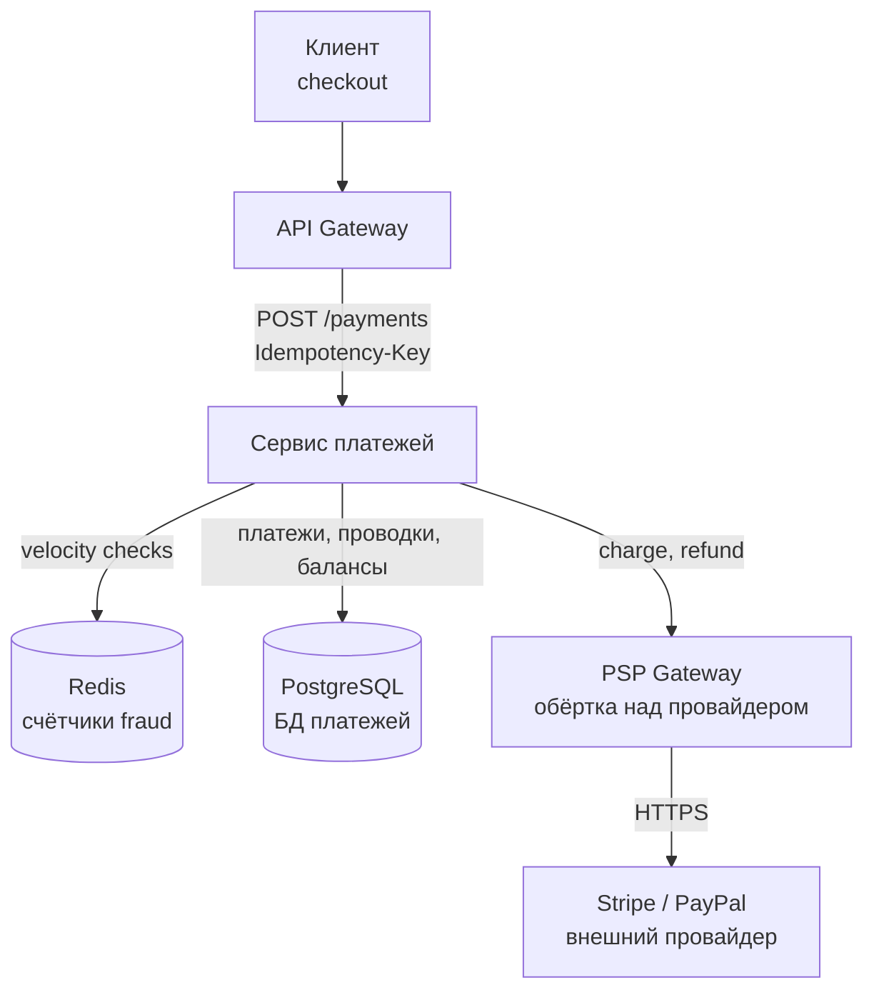
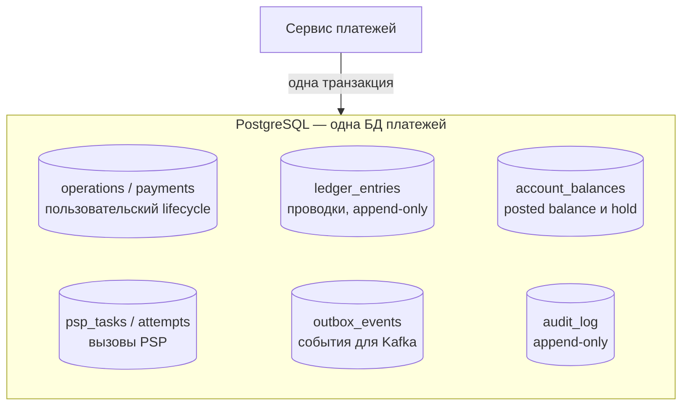
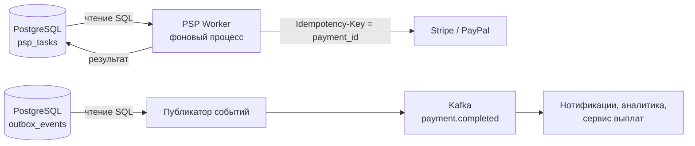
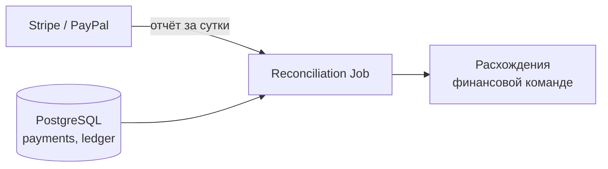
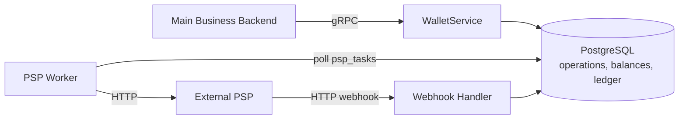
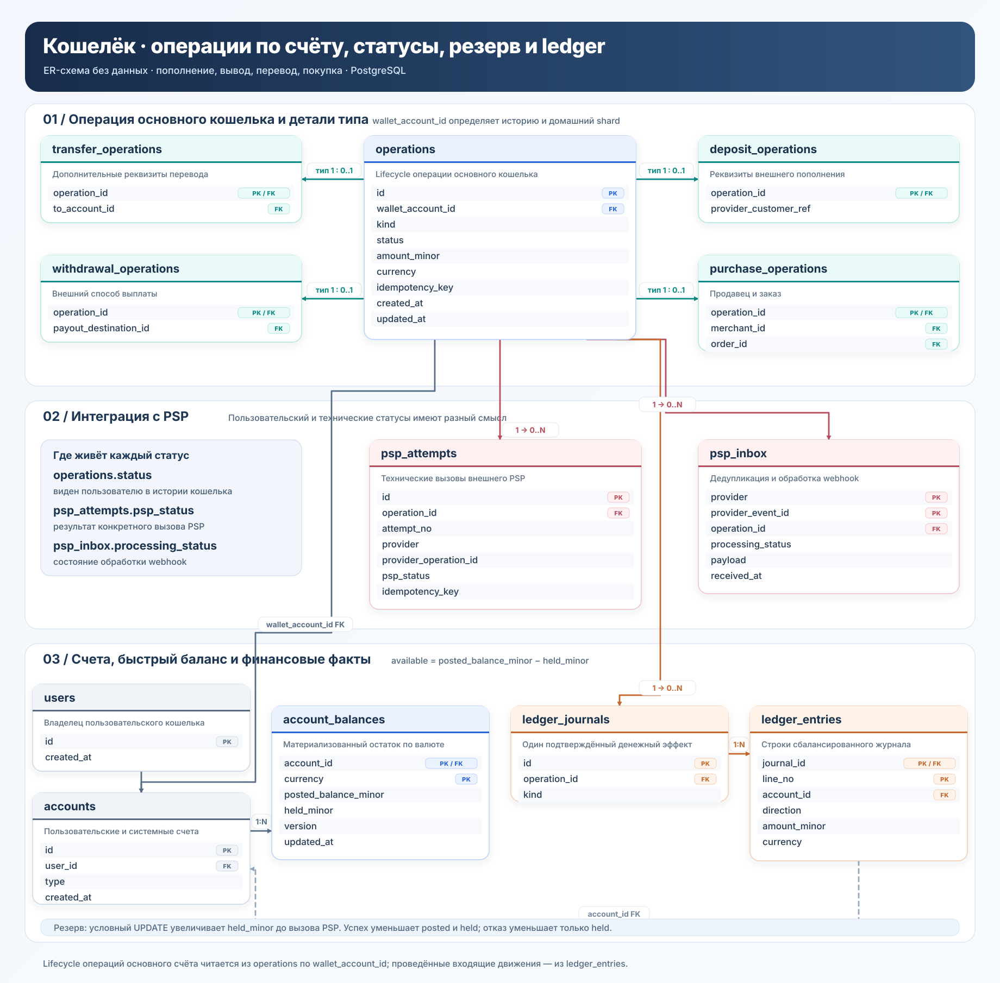

# Payment System

## Содержание

- [Фаза 1: Уточнение требований](#фаза-1-уточнение-требований)
- [Фаза 2: Оценка нагрузки](#фаза-2-оценка-нагрузки)
- [Фаза 3: Ключевые концепции](#фаза-3-ключевые-концепции)
- [Фаза 4: Архитектура](#фаза-4-архитектура)
- [Фаза 5: Deep Dive](#фаза-5-deep-dive)
- [Сквозные потоки](#сквозные-потоки)
- [Трейдоффы](#трейдоффы)
- [Interview-ready ответ (2 минуты)](#interview-ready-ответ-2-минуты)

Разбор задачи "Спроектируй платёжную систему". Проверяет знание ACID транзакций в распределённых системах, idempotency, двойных списаний, reconciliation. Критично для fintech компаний.

---

## Фаза 1: Уточнение требований

### Функциональные требования

```
Вопросы:
  - Это внутренняя система для маркетплейса или платёжный шлюз (как Stripe)?
  - Какие операции: charge, refund, payout?
  - Работа с внешними PSP (Stripe, PayPal) или напрямую с банками?
  - Нужна ли мультивалютность?
  - Recurring payments (подписки)?
  - Fraud detection — в scope?
```

**Договорились (scope):**
- Внутренняя система маркетплейса (как Amazon, Uber, Airbnb)
- Операции: charge пользователя, split между платформой и продавцом, payout продавцу
- Интеграция через внешние PSP (Stripe, PayPal как gateway)
- Мультивалютность: да (базовая конвертация по курсу)
- Базовая fraud prevention (rate limiting + velocity checks)

**Out of scope:** собственный card processing (нужна лицензия), криптовалюты, налоговая отчётность, recurring billing (усложняет на интервью).

### Нефункциональные требования

```
- TPS: 1000 транзакций/сек в пике
- Latency: ответ пользователю < 3 сек (включая внешний PSP вызов)
- Durability: потеря платежа недопустима. НИКОГДА.
- Idempotency: дублирование запроса = одно списание (не два!)
- Consistency: strong consistency для балансов (CAP: CP, не AP)
- Availability: 99.99% (4 минуты downtime/год)
- Audit log: каждая операция должна быть записана неизменяемо
- Compliance: PCI DSS (данные карт не хранить в открытом виде)
```

---

## Фаза 2: Оценка нагрузки

```
TPS:
  Допущение: 1000 операций/с в пике, пик в 3 раза выше среднего
  Среднее: 1000 / 3 ≈ 333 операций/с
  333 × 86400 ≈ 28.8M операций/день

Storage:
  Допущение: ~1 KB на операцию вместе с проводками и индексами, без реплик
  28.8M × 1 KB ≈ 28.8 GB/day
  28.8 GB × 365 × 7 лет ≈ 73.6 TB
  → PostgreSQL или специализированная финансовая DB

Балансы:
  Допущение: ~100 bytes на строку без полного учёта индексов и MVCC
  10M аккаунтов × 100B ≈ 1 GB сырых строк
  Фактический working set будет в несколько раз больше, но история доминирует

Внешние PSP вызовы:
  Пик: до 1000 external calls/sec, если каждой операции нужен PSP
  Среднее: около 333 calls/sec до учёта повторов
  Каждый PSP call: 200-1500ms (нестабильно!)
  → Нужен async flow для large-scale, но sync для UX
```

---

## Фаза 3: Ключевые концепции

Прежде чем архитектура — важные принципы для платёжных систем.

### Ledger и двойная запись

**Ledger** — журнал проводок, из которого выводятся остатки. Отличие от привычной
таблицы с балансом в направлении: не баланс хранится с историей рядом, а наоборот —
хранятся проводки, а баланс есть их сумма.

Поля `status = PAID` не хватает, потому что оно отвечает только на вопрос «прошёл ли
платёж». Оно не отвечает, сколько мы сейчас должны продавцам, где физически лежат
деньги и почему остаток в банке не совпадает с суммой успешных платежей. Статус —
состояние одного объекта, ledger — история перемещений, из которой любой остаток
выводится сложением.

**Правило.** Операция состоит из нескольких записей, и суммы по дебету и кредиту
равны. Дебет и кредит — не «минус» и «плюс», а две стороны записи:

| | Дебет | Кредит |
| --- | --- | --- |
| Актив (у нас есть, нам должны) | увеличивает | уменьшает |
| Пассив (мы должны) | уменьшает | увеличивает |

Пользователь платит 100 ₽, комиссия платформы 5%:

```text
Операция «платёж принят»:
  Дебет   Требование к PSP              100    актив вырос
  Кредит  Обязательство перед продавцом  95    мы должны продавцу
  Кредит  Комиссия платформы              5    наш доход

  дебет 100 = кредит 95 + 5
```

На практике часто хранят одну колонку `amount` со знаком и проверяют `SUM = 0`
внутри операции: `+100, −95, −5`. Это та же двойная запись в другой нотации.
Смешивать их в одной таблице нельзя — подпись `DEBIT` рядом с отрицательной
суммой означает, что автор перепутал сторону записи со знаком числа.

**Два инварианта:**

1. Внутри операции суммы дебета и кредита равны, в одной валюте. Проверяется
   до commit — несбалансированная проводка не должна попасть в журнал.
2. Материализованные остатки сходятся с журналом: баланс счёта обязан равняться
   сумме проводок по нему. Расхождение означает баг, и ловит его сверка.

Второй важнее, чем кажется. Сбалансированная проводка доказывает лишь, что деньги
не потерялись по дороге; она ничего не говорит о том, ту ли сумму списали и у того
ли клиента.

**Проводки не переписывают.** Ошиблись — добавляют компенсирующую запись. Старое
значение уже кто-то прочитал и на его основании отчитался или заплатил, поэтому
правка задним числом делает журнал непригодным для сверки.

**Это не журнал аудита.** Аудит пишется в дополнение к состоянию: удалите его —
система продолжит работать, просто станет непрозрачной. Ledger и есть состояние:
удалите — никто не знает, сколько кому должны. Проверка простая: что именно
сломается, если это удалить.

### Idempotency — ключевое требование

```
Проблема без idempotency:
  1. Клиент → POST /payments (charge $100)
  2. Сервер: списал, но ответ потерялся (network error)
  3. Клиент: ответа не было → повторить!
  4. POST /payments снова → ВТОРОЕ СПИСАНИЕ!
  
Решение: Idempotency Key
  Клиент генерирует UUID ОДИН РАЗ для данного платежа
  POST /payments
    Idempotency-Key: "order-789-charge-attempt-1"
    Body: { "amount": 100, "currency": "RUB", ... }
  
  Сервер:
    IF EXISTS payment WHERE idempotency_key = ?:
      Проверить, что hash запроса совпадает
      RETURN stored_response  // включая прежний FAILED
    ELSE:
      process payment → сохранить с idempotency_key
```

---

## Фаза 4: Архитектура

Сначала показываем, кто принимает платёжный запрос и где лежат деньги. Затем
отдельно — что именно записывается одной транзакцией, и только потом фоновые
процессы, которые доводят платёж до внешнего провайдера и публикуют события.
Так граница ACID-ядра не смешивается с ненадёжными внешними вызовами.

**Путь платёжного запроса:**



Сервис платежей владеет жизненным циклом платежа: проверяет idempotency-ключ,
резервирует средства, пишет проводки и управляет статусами `PENDING`,
`COMPLETED`, `FAILED`. PSP Gateway выделен потому, что внешний провайдер — это
единственная часть потока, которая отвечает 200–1500 мс, иногда не отвечает
вовсе и не умеет участвовать в нашей транзакции.

**Что пишется одной транзакцией:**



Все таблицы лежат в одной БД, поэтому изменение состояния и намерение что-то
сделать снаружи фиксируются одним `COMMIT`. Резерв средств, запись платежа и
задача «вызвать PSP» либо сохраняются вместе, либо не сохраняются вовсе.
Разнести их по разным хранилищам — значит вернуть себе задачу распределённой
атомарности, ради которой всё и затевалось. Детали переходов между
транзакциями — в [Distributed Transactions](#distributed-transactions-проблема-с-psp).

**Фоновые процессы:**



Два фоновых процесса решают разные задачи, и их легко спутать. PSP Worker
доводит до конца зависшие платежи: повторяет вызов провайдера с тем же
idempotency-ключом и записывает результат. Публикатор событий никого не
вызывает — он лишь отправляет уже случившиеся факты в Kafka.

**Сверка:**



Сверка — не резервный механизм на случай багов, а штатная часть дизайна: у нас
и у провайдера свои источники правды, и совпадение нужно подтверждать, а не
предполагать.

### Роль каждого компонента

Сквозная идея — **strong-consistency ядро в PostgreSQL плюс изоляция ненадёжного
внешнего PSP**: всё, что обязано быть верным, живёт внутри ACID-транзакции, а всё
ненадёжное вынесено за её границу и доводится повторами с idempotency-ключом.

**API Gateway** — единая точка входа.

- *Зачем:* терминирует TLS, аутентифицирует пользователя, ограничивает частоту запросов, передаёт `Idempotency-Key` дальше без изменений.
- *Граница ответственности:* право платить конкретным средством платежа проверяет сервис платежей, а не gateway.

**Сервис платежей (Payment Service)** — владелец платежа и его статусов.

- *Зачем:* по `Idempotency-Key` отсекает дубли, проводит fraud-проверки, резервирует средства, вызывает PSP через gateway, пишет проводки и завершает платёж.
- *Почему idempotency-ключ хранится в БД, а не в Redis:* ключ должен пережить перезапуск и отказ узла, иначе повторный запрос спишет деньги второй раз. Паттерн — [reliability-patterns / idempotency](../reliability-patterns/06-idempotency.md).
- *Почему оркестрация в одном месте:* последовательность «резерв → PSP → проводки» и обратные ей компенсации должны быть видны целиком; размазанные по слоям шаги невозможно сверить с реальностью.

**PostgreSQL (БД платежей)** — источник правды.

- *Зачем:* хранит платежи, журнал проводок, материализованные балансы, задачи для PSP и исходящие события. Транзакция даёт то, чего нет ни у какой связки «БД плюс брокер»: состояние и намерение фиксируются вместе.
- *Почему реляционка с синхронной репликацией:* потеря платежа недопустима, инвариант нулевой суммы должен проверяться до commit, а подтверждённая запись обязана пережить отказ узла — [replication](../../06-databases/database-systems-catalog/postgresql/06-replication.md). Блокировки для балансов — [transactions & locking](../../06-databases/database-systems-catalog/postgresql/04-transactions-and-locking.md). Бюджет 99.99% — [SLO/SLI](../reliability-patterns/08-slo-sli-error-budgets.md).
- *Нагрузка:* при допущениях выше получается около 28,8 млн операций в сутки и 73,6 TB за 7 лет до реплик. Это требует временных партиций и холодного архива, но само по себе не требует менять модель данных.

**Ledger (`ledger_journals` + `ledger_entries` + `account_balances`)** — движение денег и остатки.

- *Зачем:* проводки с нулевой суммой внутри каждой валюты и материализованные балансы для быстрого чтения. Проводки только добавляются; исправление — сторнирующая запись.
- *Почему это отдельный модуль внутри транзакции:* корректность денег — инвариант, а не побочный эффект обработчика. Внешние вызовы рядом с ним не стоят: они удлиняют транзакцию и держат блокировки счетов.

**PSP Gateway и внешний провайдер** — единственная ненадёжная часть потока.

- *Зачем:* одна обёртка над Stripe и PayPal: таймауты, повторы, circuit breaker, приведение кодов ошибок к внутренним — [retries & backoff](../reliability-patterns/02-retries-and-backoff.md), [circuit breaker](../reliability-patterns/03-circuit-breaker.md).
- *Почему отдельно:* провайдер отвечает 200–1500 мс, иногда не отвечает вовсе, и его ответ нельзя откатить вместе с нашей транзакцией. Всё, что о нём известно, должно быть в одном месте, включая срок жизни idempotency-ключа на его стороне.

**`psp_tasks` и PSP Worker** — доведение платежа до провайдера.

- *Зачем:* хранить намерение «списать у PSP» атомарно с резервом и платежом, а затем повторять вызов, пока не станет известен результат. Ключ идемпотентности фиксируется до первого вызова, поэтому повтор не создаёт второго списания.
- *Почему не вызывать PSP прямо в транзакции:* транзакция держала бы блокировки на время сетевого вызова, а её откат не отменяет уже сделанное списание. Разбор — [Distributed Transactions](#distributed-transactions-проблема-с-psp).

**`outbox_events` и публикатор** — доставка фактов наружу.

- *Зачем:* `payment.completed` и `payment.failed` записываются в той же транзакции, что и сам факт, а публикатор отправляет их в Kafka и отмечает отправленные.
- *Почему не писать в Kafka напрямую:* dual-write ломается при сбое между двумя вызовами — платёж завершён, а выплата продавцу и уведомление не запущены. Тот же паттерн — в [12. Marketplace Notifications](./12-marketplace-vendor-notifications.md) и [14. Stock Service](./14-stock-inventory-service.md). Брокер — [Kafka](../../07-message-brokers-and-streaming/01-kafka.md).

**`audit_log` (append-only)** — журнал для compliance.

- *Зачем:* неизменяемая запись каждой операции и каждого решения, хранение 7 лет по требованиям PCI DSS.
- *Чем отличается от ledger:* удалите аудит — система продолжит работать, просто станет непрозрачной; удалите ledger — никто не знает, сколько кому должны.

**Redis** — счётчики fraud-проверок.

- *Зачем:* velocity checks до обращения к PSP: частота транзакций на пользователя и на карту — [rate limiters](../../06-databases/database-systems-catalog/08b-redis-rate-limiters.md).
- *Почему здесь допустима потеря данных:* потерянный счётчик означает пропущенную проверку, а не потерянные деньги. Для idempotency-ключей такой компромисс неприемлем.

**Reconciliation Job** — сверка с провайдером.

- *Зачем:* ежедневно сопоставляет отчёт PSP с нашими платежами и эскалирует расхождения; закрывает случаи, где повторы уже бессильны, например истёкший idempotency-ключ на стороне провайдера.
- *Почему отдельный процесс:* это независимый контроль над основным потоком. Проверять себя тем же кодом, который проводит платежи, бессмысленно.

### Минимальный gRPC-контракт для wallet-варианта

Если основная бизнес-система обращается к платёжному backend по внутренней сети,
для исходных требований достаточно одного `WalletService`. Делить каждую
операцию, ledger и фонового worker на отдельные сетевые сервисы не требуется.

```proto
service WalletService {
  rpc CreateAccount(CreateAccountRequest)
      returns (CreateAccountResponse);

  rpc GetAccount(GetAccountRequest)
      returns (GetAccountResponse);

  rpc GetBalance(GetBalanceRequest)
      returns (GetBalanceResponse);

  rpc InitiateDeposit(InitiateDepositRequest)
      returns (InitiateDepositResponse);

  rpc InitiateWithdrawal(InitiateWithdrawalRequest)
      returns (InitiateWithdrawalResponse);

  rpc TransferFunds(TransferFundsRequest)
      returns (TransferFundsResponse);

  rpc PayForPurchase(PayForPurchaseRequest)
      returns (PayForPurchaseResponse);

  rpc GetOperation(GetOperationRequest)
      returns (GetOperationResponse);

  rpc ListAccountOperations(ListAccountOperationsRequest)
      returns (ListAccountOperationsResponse);
}
```

`InitiateDeposit` и `InitiateWithdrawal` названы как запуск процесса: после
таймаута или асинхронного ответа PSP операция может остаться `PENDING`.
`GetOperation` возвращает её актуальное состояние, а
`ListAccountOperations` соответствует главному access pattern — истории
конкретного счёта. Команды создания возвращают операцию с текущим статусом.

`CreateAccount` и `GetAccount` можно убрать, если кошелёк создаётся автоматически
в другой системе. Остальные RPC напрямую следуют из требований задачи; отдельных
универсальных методов вроде `ProcessOperation` или CRUD API для таблиц не нужно.



PSP Worker, webhook handler и ledger остаются внутренними частями Payment
System. Внешний PSP вызывается по его HTTP API, а webhook принимается по HTTP;
gRPC здесь нужен на границе между нашими backend-сервисами. Если Payment System
и основная бизнес-логика развёрнуты одним приложением, сетевой RPC между их
модулями вообще не нужен.

**Interview-ready формулировка:**

> Основная бизнес-система вызывает Payment System по gRPC. Я начну с одного
> `WalletService`: команды пополнения, вывода, перевода и покупки плюс запросы
> баланса, операции и истории счёта. Команда возвращает операцию с текущим
> статусом, поэтому `PENDING` виден сразу. PSP worker, webhook handler и ledger
> оставлю внутренними модулями, пока независимое масштабирование или владение
> разными командами не потребует разделить их на сервисы.

---

## Фаза 5: Deep Dive

### Payment Flow: Sync vs Async

**Sync flow (для простых случаев):**

```
POST /payments
  { "user_id": 123, "amount_minor": 10000, "currency": "RUB", "order_id": "ord-456" }

1. Idempotency check:
   SELECT * FROM payments WHERE idempotency_key = ? FOR UPDATE
   Если нашли: вернуть cached result

2. Fraud check:
   Velocity check: не > 5 транзакций за 1 мин для user_id?
   Amount check: не > 50K за раз?
   Если suspicious → REJECT

3. Reserve balance (pre-authorization) — одна транзакция, внешних вызовов нет:
   BEGIN TRANSACTION
     UPDATE account_balances
        SET held_minor = held_minor + :amount_minor
      WHERE account_id = :wallet_account_id
        AND currency = ?
        AND posted_balance_minor - held_minor >= :amount_minor
      RETURNING posted_balance_minor, held_minor
     Если UPDATE вернул 0 строк: ROLLBACK → insufficient funds
     INSERT INTO payments (id, user_id, amount_minor, status = PENDING, idempotency_key)
     INSERT INTO psp_tasks (payment_id, status = NEW,
       next_attempt_at = now() + 30s)   -- страховка: см. Distributed Transactions
   COMMIT
   -- Тот же двухфазный hold→capture/void, что и резерв остатков:
   -- см. Stock / Inventory Service (./14-stock-inventory-service.md)

4. Call external PSP (Stripe):
   POST https://api.stripe.com/v1/charges
   { "amount": 10000, "currency": "rub", "source": "card_token" }
   
   Idempotency-Key: payment_id   ← фиксирован до вызова
   Timeout 5 сек

   Response: { "id": "ch_xyz", "status": "succeeded" }
   Таймаут или отказ → ветки в Distributed Transactions ниже

5. Complete payment:
   BEGIN TRANSACTION
     UPDATE payments SET status = COMPLETED, psp_id = "ch_xyz"
       WHERE id = ? AND status = PENDING      -- 0 строк → уже завершён, выходим

     -- Double-entry: amount всегда положительный, сторону задаёт direction:
     INSERT INTO ledger_journals (id=:journal_id, operation_id=payment_id,
       kind='PAYMENT_SETTLED')
     INSERT INTO ledger_entries (journal_id=:journal_id, account_id=user,
       amount_minor=:amount_minor, direction='D')
     INSERT INTO ledger_entries (journal_id=:journal_id, account_id=merchant,
       amount_minor=:merchant_minor, direction='C')
     INSERT INTO ledger_entries (journal_id=:journal_id, account_id=platform,
       amount_minor=:fee_minor, direction='C')

     -- Материализованные балансы ВСЕХ трёх счетов, а не только плательщика:
     UPDATE account_balances
        SET posted_balance_minor = posted_balance_minor - :amount_minor,
            held_minor = held_minor - :amount_minor
      WHERE account_id = user
        AND held_minor >= :amount_minor
        AND posted_balance_minor >= :amount_minor
     UPDATE account_balances SET posted_balance_minor = posted_balance_minor + :merchant_minor
       WHERE account_id = merchant
     UPDATE account_balances SET posted_balance_minor = posted_balance_minor + :fee_minor
       WHERE account_id = platform

     UPDATE psp_tasks SET status = DONE WHERE payment_id = ?
     INSERT INTO outbox_events (type = 'payment.completed', payload = ...)
   COMMIT

6. Публикатор событий отправляет outbox_events в Kafka: topic=payment.completed

7. Return 200 { "payment_id": "...", "status": "COMPLETED" }
```

**Проблема sync flow:** PSP может ответить через 2 сек или попасть в установленный
нами таймаут 5 секунд.

**Async flow для высоконагруженных систем:**

```
POST /payments → транзакция 1 (резерв + PENDING + psp_tasks)
  → немедленный ответ: { "payment_id": "...", "status": "PENDING" }

PSP Worker:
  → забирает задачи из psp_tasks (next_attempt_at <= now())
  → вызывает PSP с Idempotency-Key = payment_id
  → фиксирует результат: COMPLETED или компенсация

Client: polling GET /payments/{id} или WebSocket/webhook уведомление

Trade-off:
  Async: лучше throughput, user ждёт подтверждения дольше
  Sync:  user получает ответ сразу, но PSP timeout = проблема

Выбор: sync для UX, с timeout 5 сек.
  Разница только в том, кто делает первый вызов PSP — обработчик запроса
  или воркер. Запись в psp_tasks происходит в обоих вариантах, поэтому
  при таймауте платёж остаётся PENDING и его доводит воркер, а клиент
  получает уведомление через WebSocket.
```

### Operations, история и конкурентный вывод

Таблица `payments` подходит, пока в системе есть только один вид денежного
действия. Кошелёк добавляет пополнение, вывод, внутренний перевод и покупку.
Общее у них — идентификатор, сумма, валюта, idempotency key и lifecycle; реквизиты
различаются. Поэтому модель разделяется на общую `operations` и таблицы деталей
по типам.

Единая `operations` для всех типов здесь как раз нужна, но только как общий
заголовок операции. Она отвечает на вопросы «что пользователь запустил?» и
«каков текущий статус?». Таблица конкретного типа хранит только свои реквизиты,
а ledger отвечает на другой вопрос: «какие движения по счетам уже проведены?».

| Слой | Кардинальность | Можно изменять | Назначение |
| --- | --- | --- | --- |
| `operations` | одна строка на действие | статус меняется | lifecycle и история пользователя |
| `*_operations` | одна строка выбранного типа | до выполнения операции | специфичные реквизиты |
| `ledger_journals` + `ledger_entries` | ноль или несколько журналов и проводок | append-only | бухгалтерский результат |

Связка проходит по `ledger_journals.operation_id → operations.id`. Пока операция
`PENDING`, у неё может не быть проводок. После успешного выполнения одна
транзакция добавляет сбалансированный journal и меняет статус операции на
`COMPLETED`. Поэтому `operations` и ledger не дублируют друг друга.

В остальных примерах этого кейса `payment_id` считается тем же идентификатором,
что `operations.id`, а `payments` — специализированной таблицей покупки. Второго
независимого lifecycle рядом с `operations` нет.



`operations.kind` определяет, в какой таблице находится одна строка деталей:

| `kind` | Таблица деталей | Специфичные связи |
| --- | --- | --- |
| `TRANSFER` | `transfer_operations` | целевой счёт; исходный уже указан в `operations` |
| `DEPOSIT` | `deposit_operations` | реквизиты внешнего пополнения |
| `WITHDRAWAL` | `withdrawal_operations` | способ выплаты |
| `PURCHASE` | `purchase_operations` | продавец и заказ |

```sql
CREATE TABLE operations (
  id                UUID        PRIMARY KEY,
  wallet_account_id UUID        NOT NULL REFERENCES accounts(id),
  kind              TEXT        NOT NULL,
  status            TEXT        NOT NULL,
  amount_minor      BIGINT      NOT NULL CHECK (amount_minor > 0),
  currency          CHAR(3)     NOT NULL,
  idempotency_key   TEXT        NOT NULL,
  request_hash      BYTEA       NOT NULL,
  created_at        TIMESTAMPTZ NOT NULL DEFAULT now(),
  updated_at        TIMESTAMPTZ NOT NULL DEFAULT now(),
  UNIQUE (wallet_account_id, idempotency_key)
);

CREATE INDEX operations_account_history_idx
    ON operations (wallet_account_id, created_at DESC, id DESC);

CREATE TABLE transfer_operations (
  operation_id UUID PRIMARY KEY REFERENCES operations(id),
  to_account_id UUID NOT NULL REFERENCES accounts(id)
);

CREATE TABLE withdrawal_operations (
  operation_id          UUID PRIMARY KEY REFERENCES operations(id),
  payout_destination_id UUID NOT NULL REFERENCES payout_destinations(id)
);
```

Общие поля не дублируются в таблицах деталей. Критичные идентификаторы не
прячутся в `JSONB`: иначе БД не может поставить нормальный FK, а запросы и
миграции начинают зависеть от структуры документа. Обычный FK не проверяет, что
`kind = 'TRANSFER'` сопровождается ровно одной строкой именно в
`transfer_operations`; это обеспечивает сервис в той же транзакции либо
constraint trigger, если такую инварианту нужно закрепить в БД.

#### Незавершённая операция в истории счёта

Историю нельзя строить только по ledger. У операции со статусом `PENDING` уже
есть пользовательский смысл, хотя подтверждённых проводок ещё нет. Для
рассматриваемого кошелька у каждой операции есть один основной счёт:

| `kind` | Что означает `operations.wallet_account_id` |
| --- | --- |
| `DEPOSIT` | счёт, который пополняется |
| `WITHDRAWAL` | счёт, с которого выводятся деньги |
| `TRANSFER` | счёт отправителя |
| `PURCHASE` | счёт плательщика |

Поэтому отдельная таблица участников не нужна. При создании операции одна
транзакция пишет `operations(status = 'PENDING')`, строку деталей и, для внешней
операции, задачу PSP. Вывод или перевод сразу появляется в истории исходного
счёта:

```sql
SELECT id, kind, status, amount_minor, currency, created_at
  FROM operations
 WHERE wallet_account_id = :account_id
 ORDER BY created_at DESC, id DESC
 LIMIT 50;
```

В текущем scope у счёта один владелец, поэтому отдельный
`created_by_user_id` тоже не нужен. Авторизация проверяет принадлежность счёта:

```sql
SELECT id
  FROM accounts
 WHERE id = :account_id
   AND user_id = :authenticated_user_id;
```

Идентификатор действующего пользователя стоит добавить отдельно только для
делегированного доступа: например, когда сотрудник компании создаёт платёж с
общего бизнес-счёта. Тогда это audit-атрибут, а не ключ истории.

У завершённого перевода входящее движение получателя уже находится в ledger и
читается по его `account_id`:

```sql
SELECT o.id, o.kind, o.status,
       e.direction, e.amount_minor, e.currency, e.created_at
  FROM ledger_entries e
  JOIN ledger_journals j ON j.id = e.journal_id
  JOIN operations o ON o.id = j.operation_id
 WHERE e.account_id = :account_id
   AND o.wallet_account_id <> :account_id
 ORDER BY e.created_at DESC, e.journal_id DESC, e.line_no DESC;
```

Условие по `wallet_account_id` оставляет только операции, для которых этот счёт
не был основным, и не дублирует собственные завершённые операции из первого
запроса. API истории объединяет два потока с keyset pagination: собственные
операции из `operations` и проведённые входящие движения из ledger.

Неуспешный исходящий перевод не появляется в истории получателя — деньги к нему
не двигались. Если продукт должен показывать получателю ещё и ожидаемый входящий
перевод, это отдельное требование и отдельная read-модель; для базового кейса
она только усложнит схему.

#### Три разных статуса

| Поле | На какой вопрос отвечает |
| --- | --- |
| `operations.status` | Что показываем пользователю: `PENDING`, `COMPLETED`, `FAILED`? |
| `psp_attempts.psp_status` | Чем закончился конкретный вызов PSP: `SENT`, `UNKNOWN`, `SUCCEEDED`, `FAILED`? |
| `psp_inbox.processing_status` | Обработан ли конкретный webhook: `RECEIVED`, `PROCESSED`, `ERROR`? |

Одна операция может иметь несколько попыток PSP, поэтому статус попытки нельзя
перенести в `operations`. После timeout возможна комбинация
`operations.status = PENDING` и `psp_attempts.psp_status = UNKNOWN`. Записи в
`psp_inbox` в этот момент может ещё не быть.

#### Резерв защищает от двух одновременных выводов

Материализованный баланс хранит подтверждённый остаток и уже обещанную
незавершённым операциям сумму:

```text
available_minor = posted_balance_minor - held_minor
```

Для пользовательского кошелька без овердрафта действует
`0 <= held_minor <= posted_balance_minor`. Системные бухгалтерские счета могут
иметь другую нормальную сторону баланса, поэтому это ограничение применяется по
типу счёта, а не безусловным `CHECK` ко всей таблице.

Если на счёте 100 единиц, первый вывод резервирует 80, то общий подтверждённый
остаток остаётся 100, `held = 80`, а доступно новым операциям 20. Параллельный
вывод 30 должен завершиться отказом ещё до обращения к PSP.

Проверка и резерв выполняются одним условным изменением, а не последовательностью
`SELECT`, проверки в Go и `UPDATE`:

```sql
UPDATE account_balances
   SET held_minor = held_minor + :amount_minor,
       version = version + 1,
       updated_at = now()
 WHERE account_id = :account_id
   AND currency = :currency
   AND posted_balance_minor - held_minor >= :amount_minor
RETURNING posted_balance_minor, held_minor;
```

PostgreSQL сериализует конкурентные изменения одной строки и повторно проверяет
условие относительно актуальной версии. Ноль возвращённых строк означает, что
доступного остатка не хватает. Idempotency key решает другую задачу: защищает от
повтора одного запроса, но не запрещает пользователю отправить два разных вывода.

Резерв, `PENDING`-операция и `psp_tasks` фиксируются одним commit. Только затем
worker обращается к PSP:

| Результат PSP | Изменение баланса | Статус операции |
| --- | --- | --- |
| Успех | `posted -= amount`, `held -= amount` | `COMPLETED` |
| Явный отказ | `held -= amount` | `FAILED` |
| Timeout / неизвестно | резерв не меняется | остаётся `PENDING`; `UNKNOWN` живёт в `psp_attempts` |

При неизвестном результате освобождать резерв нельзя: PSP мог провести выплату,
а ответ мог потеряться. Окончательное решение приходит через webhook, запрос
статуса или reconciliation.

Отдельная `fund_holds` для этой модели не нужна: один вывод создаёт ровно один
резерв на всю `operations.amount_minor`. Она становится полезной при нескольких
резервах, собственном TTL, частичном capture или частичном release.

#### Нагрузка и шардирование по счёту

Количество API-вызовов выводится из пользовательских сценариев, а не напрямую
из MAU:

```text
peak endpoint RPS = peak sessions/s × calls to endpoint per session
                  + webhooks + retries + background jobs
```

Открытие приложения обычно читает счёт, баланс и первую страницу истории; лишь
часть сессий создаёт перевод или вывод. Запросы магазина, webhook PSP и фоновые
повторы считаются отдельными потоками, потому что они не принадлежат
пользовательской сессии. После такого расчёта часто оказывается, что одному
PostgreSQL ещё не требуется шардирование.

Если рост всё же требует шардов, `wallet_account_id` подходит для домашнего
шарда операции. Основной счёт, его баланс, исходящие операции и проверка
`(wallet_account_id, idempotency_key)` остаются локальными. Это соответствует
главному access pattern: показать историю конкретного кошелька.

Целевой счёт перевода может оказаться на другом шарде. Тогда межшардовое
перемещение проводится асинхронным workflow с идемпотентными шагами, а
`operations` на домашнем шарде остаётся источником lifecycle. Для быстрого
чтения проведённых входящих движений можно построить read-модель,
шардированную по `account_id`:

```text
operations home shard
    → outbox operation.created / operation.status_changed
    → history projector
    → account_activity shard by account_id
```

В проекции копируются `operation_id`, домашний shard, направление, сумма,
валюта и статус. Список допускает небольшую задержку, а экран деталей при
необходимости читает точный статус с домашнего шарда. При заявленной нагрузке
начинать стоит с одной PostgreSQL: проекция и межшардовый workflow появляются
только после измеренного упора в один узел.

---

### Distributed Transactions: проблема с PSP

**Сценарий: банк списал деньги, сервер упал до обновления БД**

```
Step 1: BEGIN TRANSACTION
Step 2: UPDATE accounts SET balance -= 100  ← записали
Step 3: INSERT INTO payments ...             ← записали
Step 4: Call Stripe → charge success         ← Stripe списал деньги!
Step 5: COMMIT  ←── CRASH! Транзакция откатилась

Результат: деньги у Stripe списаны, в нашей БД следов НЕТ.
Для системы платежа не существует: заказ не оплачен, продавцу
ничего не начислено, а с карты пользователя деньги ушли.
Это «потерянный платёж» — хуже дубля, потому что о нём
никто не узнает, пока не придёт обращение от клиента.
```

Отсюда правило: **внешний вызов не должен находиться внутри транзакции БД.** Транзакция держит блокировки всё время сетевого вызова (сотни миллисекунд и таймауты по 30 секунд), а её откат не отменяет того, что уже произошло у PSP.

**Решение: транзакционный outbox + компенсация резерва**

Это два разных паттерна, и их часто склеивают в один заголовок:

- **Transactional outbox** отвечает за то, что намерение не потеряется: строка «вызвать PSP» записывается той же транзакцией, что резерв средств и `PENDING`-платёж.
- **Saga** отвечает за то, что происходит дальше: платёж — это цепочка локальных транзакций, и у шага «резерв» есть компенсация «снять резерв», потому что откатить его вместе с внешним списанием невозможно.

Outbox без компенсации даёт платежи, которые вечно висят в `PENDING` после отказа
провайдера. Компенсация без outbox даёт потерянные намерения после падения
процесса. Нужны оба.

**Таблица задач:**

```sql
CREATE TABLE psp_tasks (
  payment_id      UUID        PRIMARY KEY REFERENCES payments(id),
  status          VARCHAR(16) NOT NULL,     -- NEW / IN_PROGRESS / DONE / FAILED / NEEDS_REVIEW
  attempts        INT         NOT NULL DEFAULT 0,
  next_attempt_at TIMESTAMPTZ NOT NULL,     -- когда воркеру можно взять задачу
  locked_until    TIMESTAMPTZ,              -- аренда текущего воркера
  payload         JSONB       NOT NULL      -- сумма, валюта, ссылка на card token
);

CREATE INDEX idx_psp_tasks_due ON psp_tasks (next_attempt_at)
  WHERE status IN ('NEW', 'IN_PROGRESS');
```

Ключ идемпотентности для PSP — это `payment_id`: он известен до первого вызова,
поэтому любой повтор, откуда бы он ни пришёл, попадает в тот же charge у
провайдера.

**Транзакция 1 — резерв и намерение (внешних вызовов нет):**

```sql
BEGIN;
  UPDATE account_balances
     SET held_minor = held_minor + :amount_minor
   WHERE account_id = :user
     AND currency = 'RUB'
     AND posted_balance_minor - held_minor >= :amount_minor
  RETURNING posted_balance_minor, held_minor;
  -- 0 строк → недостаточно средств → ROLLBACK, ответ клиенту 402

  INSERT INTO payments (id, user_id, amount_minor, currency, status, idempotency_key)
       VALUES (:payment_id, :user, :amount_minor, 'RUB', 'PENDING', :key);

  INSERT INTO psp_tasks (payment_id, status, next_attempt_at, payload)
       VALUES (:payment_id, 'NEW', now() + interval '30 seconds', :payload);
COMMIT;
```

`next_attempt_at` со сдвигом в 30 секунд означает: первым вызов делает сам
обработчик запроса, ради latency для пользователя, а воркер подбирает только те
платежи, которые обработчик не довёл. Без сдвига воркер и API дёргали бы PSP
одновременно на каждом платеже — не опасно благодаря ключу идемпотентности, но
это лишняя нагрузка на провайдера.

**Вызов PSP — вне всякой транзакции**, с таймаутом 5 секунд и
`Idempotency-Key: :payment_id`.

**Транзакция 2 — фиксация успеха:**

```sql
BEGIN;
  UPDATE payments SET status = 'COMPLETED', psp_id = :charge_id
   WHERE id = :payment_id AND status = 'PENDING';
  -- 0 строк → платёж уже завершил кто-то другой → ROLLBACK и выход

  INSERT INTO ledger_journals (id, operation_id, kind)
       VALUES (:journal_id, :payment_id, 'PAYMENT_SETTLED');

  INSERT INTO ledger_entries
      (journal_id, line_no, account_id, amount_minor, currency, direction) VALUES
    (:journal_id, 1, :user,     :amount_minor,   'RUB', 'D'),
    (:journal_id, 2, :merchant, :merchant_minor, 'RUB', 'C'),
    (:journal_id, 3, :platform, :fee_minor,      'RUB', 'C');

  UPDATE account_balances
     SET posted_balance_minor = posted_balance_minor - :amount_minor,
         held_minor = held_minor - :amount_minor
   WHERE account_id = :user
     AND currency = 'RUB'
     AND held_minor >= :amount_minor
     AND posted_balance_minor >= :amount_minor;
  UPDATE account_balances
     SET posted_balance_minor = posted_balance_minor + :merchant_minor
   WHERE account_id = :merchant AND currency = 'RUB';
  UPDATE account_balances
     SET posted_balance_minor = posted_balance_minor + :fee_minor
   WHERE account_id = :platform AND currency = 'RUB';

  UPDATE psp_tasks SET status = 'DONE' WHERE payment_id = :payment_id;
  INSERT INTO outbox_events (type, payload) VALUES ('payment.completed', :event);
COMMIT;
```

Условие `AND status = 'PENDING'` здесь не косметика: обработчик запроса и воркер
могут получить ответ провайдера почти одновременно, и переход статуса должен
срабатывать ровно один раз. Проводки и обновление балансов идут в той же
транзакции, что и статус, иначе появляется состояние «платёж завершён, а денег
у продавца нет». Каждый ожидаемый `UPDATE` баланса должен изменить ровно одну
строку; ноль строк означает нарушение инварианта, поэтому транзакция откатывается
и поднимается alert.

**Транзакция 2' — компенсация при отказе провайдера:**

```sql
BEGIN;
  UPDATE payments SET status = 'FAILED', failure_code = :code
   WHERE id = :payment_id AND status = 'PENDING';

  UPDATE account_balances
     SET held_minor = held_minor - :amount_minor
   WHERE account_id = :user
     AND currency = 'RUB'
     AND held_minor >= :amount_minor;

  UPDATE psp_tasks SET status = 'FAILED' WHERE payment_id = :payment_id;
  INSERT INTO outbox_events (type, payload) VALUES ('payment.failed', :event);
COMMIT;
```

Проводок здесь нет: деньги никуда не двигались, двигался только резерв. Ledger
описывает движение денег, а не попытки его совершить.

**Воркер: аренда вместо блокировки на время вызова.**

```sql
-- Транзакция A: захватить задачи. Блокировки живут миллисекунды.
BEGIN;
  UPDATE psp_tasks
     SET status = 'IN_PROGRESS',
         attempts = attempts + 1,
         locked_until = now() + interval '1 minute'
   WHERE payment_id IN (
     SELECT payment_id FROM psp_tasks
      WHERE next_attempt_at <= now()
        AND (status = 'NEW' OR (status = 'IN_PROGRESS' AND locked_until < now()))
      ORDER BY next_attempt_at
      LIMIT 20
      FOR UPDATE SKIP LOCKED     -- иначе два воркера возьмут одну строку
   )
  RETURNING payment_id, payload;
COMMIT;

-- Вне транзакции: вызов PSP с Idempotency-Key = payment_id

-- Транзакция B: тот же блок фиксации, что и у обработчика запроса
--   успех  → транзакция 2
--   отказ  → транзакция 2'
--   неизвестный результат → BEGIN;
--     UPDATE psp_tasks
--        SET status = 'NEW',
--            next_attempt_at = now() + backoff(attempts),
--            locked_until = NULL
--      WHERE payment_id = :payment_id;
--   COMMIT;
```

Почему нельзя было оставить вызов PSP между `SELECT ... FOR UPDATE SKIP LOCKED`
и `COMMIT`:

- `FOR UPDATE` работает только внутри транзакции, и блокировки снимаются лишь на `COMMIT`. Пачка из 20 задач с таймаутом 30 секунд на каждую удерживала бы транзакцию и соединение минутами — ровно то, что запрещает правило абзацем выше.
- Без транзакции `SKIP LOCKED` бесполезен: блокировка снимается сразу после запроса, и вторая копия воркера возьмёт ту же строку.
- Вложенный `BEGIN` внутри уже открытой транзакции в PostgreSQL ничего не открывает: выдаёт предупреждение, и всё остаётся одной транзакцией.

Аренда решает обе задачи. Пока `locked_until` в будущем, задачу никто не
перехватит; если воркер умер, аренда истечёт и задачу возьмёт другой. Если
«умерший» воркер на самом деле жив и висел в сети, два вызова уйдут к
провайдеру одновременно — и это безопасно ровно потому, что ключ идемпотентности
у них общий.

**Неизвестный результат — не повод компенсировать.** Таймаут означает «ответ не
получен», а не «списания не было». Компенсировать резерв в этот момент нельзя:
деньги у провайдера могли уйти. Правильный порядок — повторить вызов с тем же
ключом или запросить у провайдера статус платежа, и только полученный отказ
запускает компенсацию.

**Повторы конечны.** После `attempts` сверх лимита задача переводится в
`NEEDS_REVIEW`, а не ретраится вечно: платёж, который падает всегда, иначе
будет занимать воркеров и мешать живым задачам. Сюда же попадают платежи
старше гарантированного провайдером срока жизни idempotency-ключа. После этой
границы безопасный автоматический повтор уже нельзя предполагать: сначала нужен
запрос статуса или [сверка](#reconciliation-сверка-с-psp).

**Что даёт эта конструкция:**

| Сбой | Состояние в БД | Что происходит дальше |
| --- | --- | --- |
| Падение до транзакции 1 | Ничего не записано | Клиент повторит запрос с тем же `Idempotency-Key` |
| Падение после транзакции 1, до вызова PSP | `PENDING` + задача `NEW` | Воркер заберёт задачу через 30 секунд |
| Падение после вызова PSP, до транзакции 2 | `PENDING` + задача `IN_PROGRESS` | Аренда истечёт, повтор с тем же ключом вернёт тот же charge |
| Провайдер отклонил платёж | `PENDING` + задача `IN_PROGRESS` | Компенсация: резерв снят, статус `FAILED` |
| Ключ у провайдера истёк | `PENDING` + `NEEDS_REVIEW` | Разбирает сверка, повтор запрещён |

At-least-once вызовы плюс идемпотентность на стороне провайдера дают
**exactly-once эффект**: попыток может быть много, списание остаётся одно.
Настоящей exactly-once доставки между двумя системами не существует, и на
собеседовании эту разницу стоит проговорить вслух.

---

### Ledger: неизменяемый лог

```sql
CREATE TABLE ledger_journals (
  id            UUID        PRIMARY KEY,
  operation_id  UUID        NOT NULL REFERENCES operations(id),
  kind          TEXT        NOT NULL,
  created_at    TIMESTAMPTZ NOT NULL DEFAULT now()
);

-- Append-only строки журнала: никогда не UPDATE/DELETE
CREATE TABLE ledger_entries (
  journal_id      UUID        NOT NULL REFERENCES ledger_journals(id),
  line_no         SMALLINT    NOT NULL,
  account_id      UUID        NOT NULL,
  amount_minor    BIGINT      NOT NULL,  -- всегда положительное целое
  currency        CHAR(3)     NOT NULL,
  direction       CHAR(1)     NOT NULL,  -- D / C
  created_at      TIMESTAMPTZ NOT NULL DEFAULT NOW(),
  -- нет updated_at, нет deleted_at — только INSERT

  PRIMARY KEY (journal_id, line_no),
  CHECK (amount_minor > 0),
  CHECK (direction IN ('D', 'C'))
);

-- Для performance: материализованный баланс
CREATE TABLE account_balances (
  account_id           UUID        NOT NULL,
  currency             CHAR(3)     NOT NULL,
  posted_balance_minor BIGINT      NOT NULL DEFAULT 0,
  held_minor           BIGINT      NOT NULL DEFAULT 0,
  version              BIGINT      NOT NULL DEFAULT 0,
  updated_at           TIMESTAMPTZ NOT NULL,
  -- available = posted_balance_minor - held_minor
  -- Баланс ведётся ПО ВАЛЮТЕ: у одного счёта их может быть несколько
  PRIMARY KEY (account_id, currency),
  CHECK (held_minor >= 0)
);
```

**Инвариант нулевой суммы держится ПО КАЖДОЙ ВАЛЮТЕ отдельно.** Для каждого
платежа сумма debit должна равняться сумме credit. Складывать рубли с долларами
бессмысленно: такая проверка либо не сойдётся, либо сойдётся случайно и
замаскирует ошибку.

```sql
-- Правильная проверка: debit = credit внутри платежа и валюты
SELECT journal_id, currency
  FROM ledger_entries
 GROUP BY journal_id, currency
HAVING COALESCE(SUM(amount_minor) FILTER (WHERE direction = 'D'), 0) <>
       COALESCE(SUM(amount_minor) FILTER (WHERE direction = 'C'), 0);
-- должно вернуть 0 строк
```

При конвертации валют платёж порождает записи в двух валютах, и «свести к нулю» их можно только через **отдельный FX-счёт**: списание рублей закрывается зачислением на FX-счёт в рублях, а выдача долларов — списанием с FX-счёта в долларах. Обе валюты сходятся в ноль по отдельности, а курсовая разница оседает на FX-счёте как явная величина, а не растворяется в округлениях.

**Внутренняя сверка — отдельная джоба, а не только сверка с PSP.** Проверять надо два инварианта:

```
1. Ledger сам по себе: debit = credit внутри платежа и валюты
2. Материализованные балансы соответствуют журналу:
     account_balances.posted_balance_minor == apply(entries, account.type)
     для каждой пары (account_id, currency)

Расхождение во втором = баг в коде, который обновляет баланс
мимо журнала. Ловится только такой сверкой: сам по себе
материализованный баланс «выглядит правильно» и ничего не сигналит.
```

Функция `apply` учитывает тип счёта: debit увеличивает актив, но уменьшает
обязательство; credit делает обратное. `held_minor` в эту сверку не входит: это
часть уже существующего остатка, временно недоступная новым операциям.

**Про точность:** `BIGINT amount_minor` хранит целое число минимальных единиц.
Приложение берёт масштаб из справочника валют по ISO 4217: у JPY и KRW знаков
нет, у RUB и USD их два, у KWD и BHD — три. В вычислениях денежного hot path нет
двоичных дробей, а округление происходит только в явно выбранных местах.

**Audit и compliance:**
```
Ledger entries НИКОГДА не изменяются и не удаляются.
Для исправления ошибки → reversing entry:

Ошибочная запись:   account=A, direction=D, amount_minor=10000
Исправление:        account=A, direction=C, amount_minor=10000, reversal_of=#123
Новая корректная:   account=A, direction=D, amount_minor=9000

Так работает бухгалтерия в реальном мире.
```

---

### Reconciliation: сверка с PSP

**Проблема:** наши данные могут расходиться с данными Stripe.

```
Ежедневная reconciliation job:

1. Скачать отчёт от Stripe за вчера:
   GET /v1/balance/history?created[gte]=yesterday&created[lt]=today
   → Список всех charge_id, amount, status, currency

2. Сравнить с нашей БД:
   SELECT psp_id, amount, status FROM payments 
   WHERE created_at BETWEEN yesterday AND today

3. Найти расхождения:
   - В Stripe есть, у нас нет → создать запись со статусом NEEDS_REVIEW
   - У нас есть как COMPLETED, у Stripe как FAILED → alert! потенциальная потеря денег
   - Сумма не совпадает → currency conversion issue?

4. Alert команде финансов для ручной проверки

Автоматическое исправление: только после однозначного результата провайдера
  Старый PENDING без ответа → запросить статус или отправить в NEEDS_REVIEW
  Освобождать резерв только по подтверждённому FAILED / NOT_FOUND

Frequency:
  Hourly mini-reconciliation: сверять последние 1000 транзакций
  Daily full reconciliation: весь день
```

---

### Fraud Prevention (базовый уровень)

```
Velocity checks (до обращения к PSP):
  User-level:
    Rate: > 5 транзакций за 1 мин → block (Redis: INCR + EXPIRE)
    Amount: > 50K RUB за раз → manual review
    
  Card-level:
    Один card_token → > 10 транзакций за 1 час → flag
    
  Geo check:
    Транзакция из России, предыдущая из США 10 минут назад → impossible travel → block

Реализация:
  Redis: rate limit per user_id, per card_token
    (sliding window / token bucket — см. ../../06-databases/database-systems-catalog/08b-redis-rate-limiters.md)
  Rules Engine: конфигурируемые правила (без хардкода)
  
  if fraud_score(transaction) > threshold:
      → Reject with code FRAUD_SUSPECTED
      → Log в fraud_events table
      → Alert fraud team
```

---

### Multi-currency

```
Хранение:
  Все суммы хранятся целым числом минимальных единиц: amount_minor BIGINT
  Валюта хранится отдельным полем CHAR(3) (ISO 4217: RUB, USD, EUR)
  Масштаб берётся из справочника валют: RUB/USD = 2, JPY = 0, KWD = 3

  FLOAT не подходит: двоичная дробь не представляет многие десятичные суммы точно
  1000.10 USD превращается в 100010 центов до записи

Конвертация:
  Exchange Rate Service: кешировать курсы, обновлять раз в час
  При конвертации: сохранять exchange_rate на момент транзакции
  
  1 USD = 89.50 RUB (на момент транзакции) → ЗАФИКСИРОВАТЬ в записи
  Не пересчитывать постфактум по текущему курсу

Рисковая позиция:
  Если маркетплейс держит баланс в разных валютах → forex risk
  Hedging: out of scope для интервью, но упомянуть
```

---

## Сквозные потоки

**1. Успешный платёж.**
`POST /payments` + Idempotency-Key → idempotency check → fraud (velocity) → условный `UPDATE` резерва + PENDING → вызов PSP с idempotency key → complete: ledger entries (debit 100 / credit 95 + 5), статус COMPLETED → `payment.completed` в Kafka.
*Итог:* деньги движутся ровно один раз; повтор запроса возвращает кешированный результат, а не списывает снова.

**2. PSP-таймаут (распределённая транзакция).**
Резерв, PENDING и задача в `psp_tasks` уже закоммичены до вызова. PSP не ответил за 5 сек → результат неизвестен, компенсировать нельзя → клиент получает `PENDING` → PSP Worker берёт задачу по аренде и повторяет вызов с тем же idempotency key → успех обновляет статус, явный отказ запускает компенсацию резерва.
*Итог:* at-least-once вызовы + idempotency на стороне PSP = exactly-once эффект; ни двойного списания, ни потери.

**3. Crash между PSP и БД.**
Транзакция 1 зафиксировала резерв, PENDING и намерение вызвать PSP вместе. Сервис упал после списания у провайдера, но до транзакции 2 → задача осталась `IN_PROGRESS`, её аренда истекает, другой воркер повторяет вызов с тем же ключом и получает тот же charge → статус доводится до COMPLETED.
*Итог:* нет состояния «PSP списал, у нас нет» без механизма восстановления; исчерпание попыток или истёкший ключ уводят платёж в `NEEDS_REVIEW`, а не в молчаливую потерю.

**4. Reconciliation.**
Ежедневная сверка отчёта PSP с нашей БД → расхождение (COMPLETED у нас / FAILED у PSP) → alert финансам; старый `PENDING` → запросить точный статус или отправить в `NEEDS_REVIEW`; резерв освобождается только после подтверждённого отказа.
*Итог:* любое расхождение источников истины обнаруживается и эскалируется, а не теряется молча.

---

## Трейдоффы

| Решение | Принятое | Альтернатива | Причина |
|---|---|---|---|
| Consistency | Strong (CP) | Eventual (AP) | Финансы: нельзя потерять или задвоить |
| Distributed TX | Транзакционный outbox + компенсация | Two-Phase Commit | 2PC: проблемы с доступностью, blocking; PSP в нём не участвует |
| Хранение | PostgreSQL | NoSQL | ACID, SUM(entries) = 0 проверяемо |
| Idempotency | DB unique key | Redis cache | DB: durability, Redis: может упасть |
| PSP | Внешний (Stripe) | Кастомный | PCI DSS: огромные требования |
| Баланс | Материализованный + сверка с журналом | SUM каждый раз | Performance: баланс нужен на каждый запрос; расхождение ловится только сверкой |
| Инвариант нуля | По каждой валюте отдельно | Одна сумма по всем | Складывать рубли с долларами бессмысленно; конвертация — через FX-счёт |
| Точность сумм | `BIGINT amount_minor` + масштаб по ISO 4217 | `NUMERIC(15,2)` для всех | У JPY знаков нет, у KWD их три; целые minor units исключают дробную арифметику в hot path |
| Захват задач воркером | Аренда: `UPDATE ... FOR UPDATE SKIP LOCKED`, затем вызов PSP вне транзакции | Держать `FOR UPDATE` на время вызова PSP | Иначе блокировки и соединение удерживаются весь сетевой вызов, а откат не отменяет списание |
| Неизвестный результат PSP | Повтор с тем же ключом или запрос статуса | Сразу компенсировать резерв | Таймаут не означает, что списания не было |
| Число повторов | Лимит + `NEEDS_REVIEW` | Бесконечный retry | Вечно падающая задача занимает воркеров; после гарантированного срока idempotency автоматический повтор может стать небезопасным |

### Почему не NoSQL?

```
MongoDB, Cassandra: eventual consistency по умолчанию
  Баланс может быть "50 RUB" на одной реплике и "150 RUB" на другой
  → Можно списать с одного, списать с другого → двойное списание

PostgreSQL SERIALIZABLE isolation:
  SELECT ... FOR UPDATE гарантирует что параллельные транзакции
  увидят актуальный баланс → нет двойного списания

ACID нужен там где нарушение = потеря денег / регуляторные штрафы
```

---

## Interview-ready ответ (2 минуты)

> "Платёжная система — это идемпотентность, double-entry bookkeeping и reconciliation.
>
> Идемпотентность обязательна: клиент генерирует UUID один раз для платежа, сервер при повторном запросе возвращает кешированный результат. Без этого network error → retry → двойное списание.
>
> Double-entry: каждый платёж = набор ledger entries с нулевой суммой. Пользователь -100, продавец +95, платформа +5. Entries — append-only, ничего не удаляется, исправления — только сторнирующей записью.
>
> Две оговорки, которые обычно теряют. Первая: ноль сходится **по каждой валюте отдельно** — суммировать рубли с долларами бессмысленно, а конвертация закрывается через отдельный FX-счёт, где курсовая разница видна явной величиной. Вторая: материализованные балансы обновляются для **всех** счетов проводки, а не только для плательщика, и отдельная джоба сверяет их с журналом — расхождение здесь означает код, который меняет баланс мимо ledger, и другим способом оно не ловится.
>
> Распределённые транзакции — транзакционный outbox плюс компенсация. Одной транзакцией сохраняю резерв, PENDING-платёж и задачу «вызвать PSP»; сам вызов идёт **вне** транзакции, иначе блокировки держатся весь сетевой вызов, а откат всё равно не отменяет списание. Воркер забирает задачу по аренде, повторяет вызов с тем же idempotency key, и при успехе одной транзакцией пишет проводки и статус COMPLETED. Явный отказ провайдера запускает компенсацию: резерв снимается, статус FAILED. А вот таймаут компенсацию не запускает — неизвестный результат не равен отказу, поэтому повтор или запрос статуса, и в крайнем случае ручной разбор через сверку. Получается exactly-once эффект, а не exactly-once доставка.
>
> Strong consistency: PostgreSQL с условным `UPDATE` или `SELECT FOR UPDATE`. Конкурентные операции не могут зарезервировать одни деньги дважды.
>
> Reconciliation: ежедневная сверка с PSP отчётом. Любое расхождение → alert финансовой команде. Суммы хранятся как `BIGINT amount_minor`, без float."
