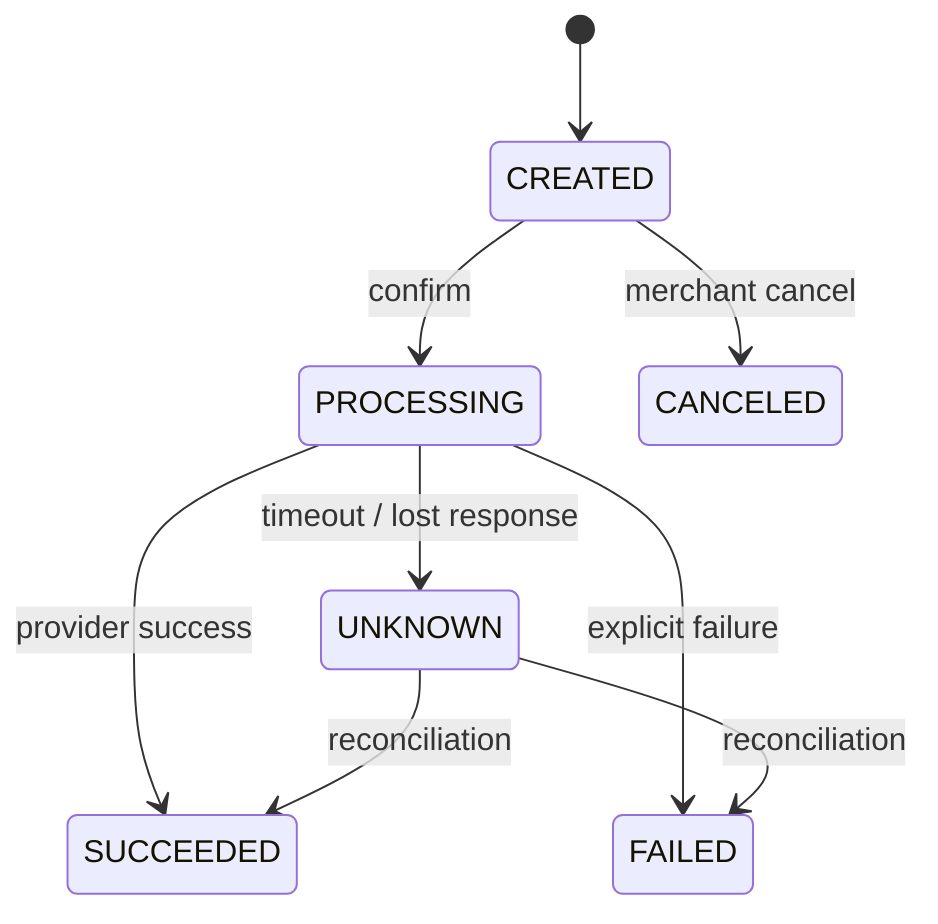
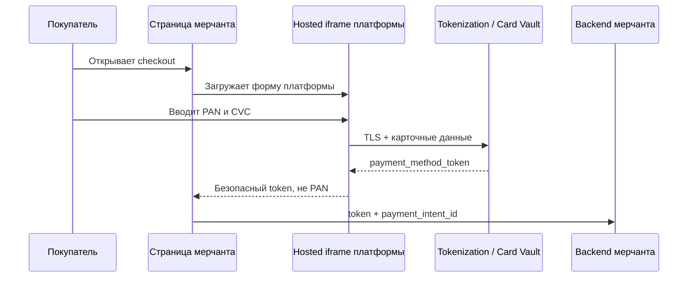
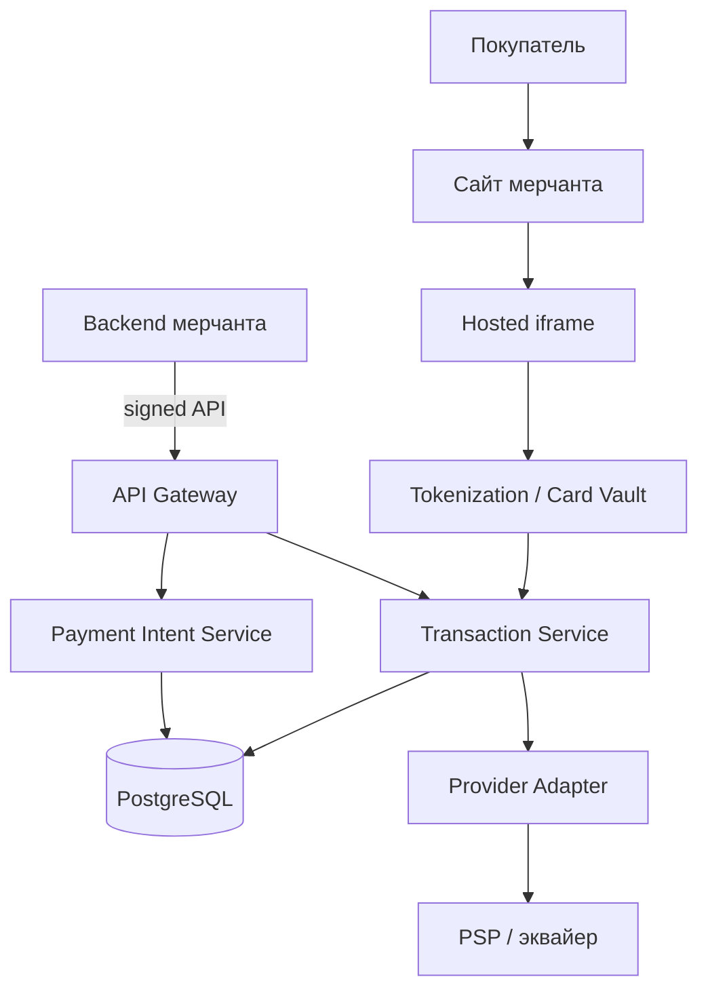
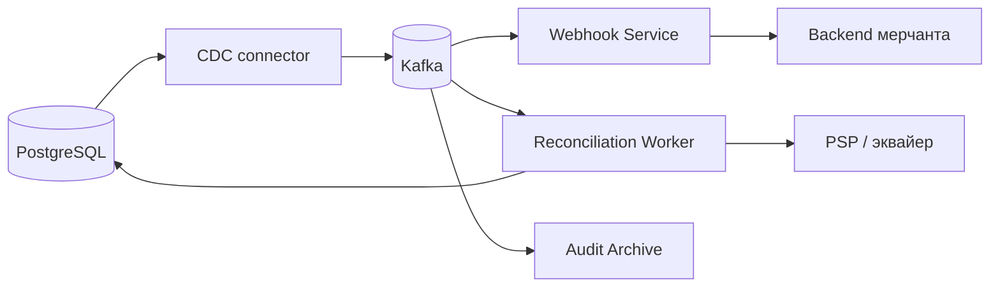

# Payment Gateway для мерчантов

## Содержание

- [Источник и граница задачи](#источник-и-граница-задачи)
- [Фаза 1: уточнение требований](#фаза-1-уточнение-требований)
- [Фаза 2: оценка нагрузки](#фаза-2-оценка-нагрузки)
- [Фаза 3: ключевые сущности](#фаза-3-ключевые-сущности)
- [API и защита запросов мерчанта](#api-и-защита-запросов-мерчанта)
- [Безопасный сбор карточных данных](#безопасный-сбор-карточных-данных)
- [Фаза 4: высокоуровневый дизайн](#фаза-4-высокоуровневый-дизайн)
- [Сквозные потоки](#сквозные-потоки)
- [Аудит и доставка изменений через CDC](#аудит-и-доставка-изменений-через-cdc)
- [Timeout и reconciliation](#timeout-и-reconciliation)
- [Фаза 5: масштабирование](#фаза-5-масштабирование)
- [Отказы, наблюдаемость и эксплуатация](#отказы-наблюдаемость-и-эксплуатация)
- [Трейдоффы](#трейдоффы)
- [Что уточнено по сравнению с видео](#что-уточнено-по-сравнению-с-видео)
- [Interview-ready answer](#interview-ready-answer)
- [Связанные материалы и источники](#связанные-материалы-и-источники)

Этот материал следует ходу видео Матвея Попова
[«System Design — Проектируем Платежный Сервис»](https://www.youtube.com/watch?v=n-R2JX9KwhQ):
сначала граница продукта и сущности, затем безопасность, аудит, работа с
неоднозначным результатом внешнего вызова и масштабирование.

Главное отличие от [основного кейса № 11](./11-payment-system.md) — граница
системы. Основной кейс проектирует внутреннее финансовое ядро маркетплейса со
split, payout и double-entry ledger. Здесь проектируется Stripe/Robokassa-подобный
сервис: мерчант принимает карточный платёж через наше API, а мы скрываем за ним
разные платёжные провайдеры и возвращаем единый статус.

---

## Источник и граница задачи

У системы есть три стороны:

- **мерчант** — бизнес, который продаёт товар или услугу;
- **покупатель** — вводит платёжные реквизиты и подтверждает оплату;
- **внешний платёжный провайдер** — процессинг, эквайер или другой партнёр,
  который связывает нас с банками и карточными сетями.

Платёжная сеть, эквайер и платёжный провайдер — не одно и то же. В видео они
объединены в один внешний `Payment Network` для простоты схемы. На практике
платформа чаще интегрируется с PSP или эквайером, а уже тот работает с Visa,
Mastercard и банком-эмитентом. Собственная прямая интеграция с карточной сетью
требует отдельной сертификации и меняет границу задачи.

### Навигация по видео

| Таймкод | Часть разбора |
| --- | --- |
| [00:00](https://www.youtube.com/watch?v=n-R2JX9KwhQ&t=0s) | Постановка задачи и требования |
| [01:40](https://www.youtube.com/watch?v=n-R2JX9KwhQ&t=100s) | Merchant, PaymentIntent и Transaction |
| [04:51](https://www.youtube.com/watch?v=n-R2JX9KwhQ&t=291s) | Высокоуровневая схема и API Gateway |
| [20:19](https://www.youtube.com/watch?v=n-R2JX9KwhQ&t=1219s) | HMAC, nonce, iframe и PCI DSS |
| [28:58](https://www.youtube.com/watch?v=n-R2JX9KwhQ&t=1738s) | Аудит, WAL, CDC и Kafka |
| [35:49](https://www.youtube.com/watch?v=n-R2JX9KwhQ&t=2149s) | Timeout и reconciliation |
| [43:06](https://www.youtube.com/watch?v=n-R2JX9KwhQ&t=2586s) | Масштабирование и холодный архив |

Простая ментальная модель выглядит так:

```text
Мерчант создаёт намерение получить 1 000 RUB.
Покупатель подтверждает оплату в защищённой форме платформы.
Платформа создаёт попытку и отправляет её внешнему провайдеру.
Провайдер может ответить success, explicit failure или не ответить вовремя.
Платформа хранит всю историю и в итоге приводит локальный статус к статусу провайдера.
```

Пользовательский API остаётся понятным и относительно быстрым, хотя движение
денег за его границей может занимать секунды, минуты или дольше.

---

## Фаза 1: уточнение требований

### Что спросить

```text
- Мы строим платёжный шлюз для мерчантов или внутренний payment service?
- Кто фактически двигает деньги: мы, PSP, эквайер или банк?
- Какие способы оплаты нужны кроме банковских карт?
- Нужны authorization/capture, refund, recurring payments и disputes?
- Как мерчант узнаёт результат: polling, webhook или оба способа?
- Как долго операция может оставаться в неизвестном состоянии?
- Какие страны, валюты и требования PCI DSS входят в scope?
- Нужны ли merchant balance, settlement и payout?
- 10 000 транзакций/с — средняя или пиковая нагрузка?
```

### Зафиксированный scope

- Мерчант создаёт `PaymentIntent` на товар или услугу.
- Покупатель платит банковской картой через форму, которую контролирует наша
  платёжная платформа.
- Для одного логического платежа допускается несколько технических попыток.
- Платформа интегрируется с несколькими внешними провайдерами через адаптеры.
- Мерчант читает статус через API и получает уведомление через webhook.
- Повтор запроса не создаёт второе списание.
- Каждая попытка и каждый переход состояния сохраняются для аудита.
- После сетевого `timeout` платформа восстанавливает результат через
  reconciliation — сверку с внешним провайдером.
- Заявленные в видео 10 000 транзакций/с считаются пиком.

Вне основного flow остаются payouts мерчантам, внутренний double-entry ledger,
конвертация валют, disputes, recurring billing, fraud scoring и собственный
card processing. Refund и cancel присутствуют в модели типов операций, но их
полный жизненный цикл здесь не проектируется.

### Нефункциональные требования

**PAN** (`Primary Account Number`) — основной номер платёжной карты, то есть
цифры на её лицевой стороне. В разговоре его обычно называют просто номером
карты.

**CVC** (`Card Verification Code`) — код проверки карты, обычно состоящий из
трёх или четырёх цифр. У разных платёжных систем встречаются названия `CVV`,
`CVC` и `CID`, но роль у них одна: подтвердить, что при оплате доступны
реквизиты карты.

```text
Peak throughput:       10 000 новых provider attempts/с
Correctness:           подтверждённый платёж нельзя потерять или применить дважды
Durability:            принятые локальные операции переживают отказ узла
Auditability:          каждый переход состояния восстанавливается по истории
External consistency: локальная система в итоге сходится с провайдером
Security:              номер карты (PAN) и код проверки (CVC) не проходят
                       через backend мерчанта
Availability:          сбой одного провайдера не останавливает всё API
```

Видео не задаёт конкретные SLO по latency, RPO и RTO. На интервью их нужно
согласовать отдельно. Например, можно зафиксировать `p99 < 500 мс` на создание
локального `PaymentIntent`, но не обещать тот же SLO для финального ответа банка.

---

## Фаза 2: оценка нагрузки

Числа ниже — учебные допущения. Из видео известно только требование выдерживать
10 000 транзакций/с и оценка одной строки примерно в 500 байт.

### Пиковая пропускная способность

Одна попытка создаёт не одну физическую запись. Обычно появляются:

- строка попытки;
- один или несколько переходов статуса;
- запись outbox или CDC-события;
- индексы и WAL;
- позднее — webhook delivery и результат reconciliation.

Поэтому `10 000 TPS` нельзя напрямую назвать `10 000 write IOPS`. Нагрузочный
тест должен воспроизводить всю транзакцию вместе с индексами, WAL и
синхронной репликацией.

### Одновременные внешние вызовы

По закону Литтла число одновременно выполняющихся запросов равно потоку,
умноженному на длительность:

```text
При 10 000 попыток/с и среднем ответе PSP 0,5 с:
  10 000 × 0,5 = 5 000 одновременных вызовов

Если во время деградации ответ занимает 2 с:
  10 000 × 2 = 20 000 одновременных вызовов
```

Отсюда нужны ограничение конкуренции, отдельные connection pools по
провайдерам, backpressure и короткие сетевые тайм-ауты. Иначе замедлившийся PSP
исчерпает сокеты, память и goroutines раньше, чем сработает autoscaling.

### Накопление данных

Расчёт из видео стоит пересчитать:

```text
Верхняя граница, если пик 10 000 TPS держится круглые сутки:
  10 000 × 500 байт = 5 000 000 байт/с ≈ 5 MB/с
  5 MB/с × 86 400 = 432 GB/день
  432 GB × 365 = 157,68 TB/год
```

Для накопления используют среднюю, а не пиковую нагрузку. Если явно принять
среднее `2 000 TPS`, сырые строки займут:

```text
2 000 × 500 байт × 86 400 = 86,4 GB/день
86,4 GB × 365 = 31,54 TB/год
```

Это нижняя оценка. Индексы, версии строк, WAL, аудит, бэкапы и реплики увеличат
физический объём в несколько раз. Точный коэффициент получают измерением схемы,
а не выбирают на глаз.

---

## Фаза 3: ключевые сущности

### Merchant

`Merchant` представляет бизнес, который использует платформу:

```text
merchant_id
name
status
settlement_profile_ref
api_key_id
signing_secret_ref
metadata
```

В строке не хранят секрет в открытом виде. `signing_secret_ref` указывает на
secret manager или HSM-backed хранилище. Банковские реквизиты для settlement
также лучше хранить как защищённую ссылку на отдельный профиль, а не как
произвольный JSON рядом с API-ключом.

### PaymentIntent

`PaymentIntent` — одна логическая цель платежа. Он связывает сумму, валюту,
мерчанта, покупателя и весь жизненный цикл оплаты:

```text
payment_intent_id   UUIDv7
merchant_id
merchant_order_id
customer_ref
amount_minor        BIGINT
currency            CHAR(3)
status
version
created_at
updated_at
```

Сумма хранится целым числом в минимальных единицах валюты: `10,00 RUB` — это
`1000`, если для валюты используется две десятичные позиции. Одной колонки
`amount` недостаточно: без `currency` число `1000` неоднозначно.

Упрощённая машина состояний:



`UNKNOWN` — не ошибка пользователя и не финальный отказ. Он означает: запрос
мог дойти до провайдера, но локальная система пока не знает результат.

### Transaction и ProviderAttempt

В видео `Transaction` означает конкретное движение денег внутри
`PaymentIntent`: charge, refund или cancel. Для точного разбора полезно отделить
его от сетевой попытки:

| Сущность | Что представляет | Почему не объединять |
| --- | --- | --- |
| `PaymentIntent` | Одну логическую оплату | Живёт дольше отдельного сетевого запроса |
| `Transaction` | Денежную операцию: charge/refund | Один refund не должен менять исходный charge |
| `ProviderAttempt` | Конкретный вызов конкретного PSP | Retry и переключение PSP создают новые попытки, но не новые бизнес-операции |

Минимальная попытка содержит:

```text
attempt_id
transaction_id
provider
provider_idempotency_key
provider_operation_id
status              CREATED | SENT | SUCCEEDED | FAILED | UNKNOWN
request_hash
failure_code
created_at
updated_at
```

Связь получается такой:

```text
Merchant 1 ── N PaymentIntent 1 ── N Transaction 1 ── N ProviderAttempt
```

Это не требует всегда создавать несколько попыток. Модель лишь не ломается,
если первый запрос завис, провайдер разрешил безопасный retry или routing
переключил операцию на другой интеграционный контур.

---

## API и защита запросов мерчанта

Минимальный API:

```http
POST /v1/payment-intents
Idempotency-Key: checkout:order-42
X-Merchant-Key: mk_live_...
X-Timestamp: 1789237200
X-Nonce: 2f73...
X-Signature: v1=...

{
    "merchant_order_id": "order-42",
    "amount": 1000,
    "currency": "RUB"
}
```

```http
POST /v1/payment-intents/{id}/confirm
GET  /v1/payment-intents/{id}
POST /v1/payment-intents/{id}/cancel
```

### Четыре разные защиты

| Механизм | От чего защищает | Чего не гарантирует |
| --- | --- | --- |
| API key | Идентифицирует мерчанта | Целостность запроса и защиту от replay |
| HMAC signature | Подтверждает целостность и знание общего секрета | Однократный бизнес-эффект |
| Timestamp + nonce | Ограничивает окно replay одного подписанного запроса | Дедупликацию осознанного retry |
| Idempotency key | Возвращает один бизнес-результат на повторы | Подлинность отправителя |

Подпись строится над каноническим представлением запроса:

```text
canonical = METHOD + "\n" + PATH + "\n" + TIMESTAMP + "\n" + NONCE + "\n" + SHA256(raw_body)
signature = HMAC-SHA256(merchant_secret, canonical)
```

API Gateway выполняет шаги в следующем порядке:

1. Находит активного мерчанта по `X-Merchant-Key`.
2. Проверяет допустимое отклонение `X-Timestamp`, например пять минут.
3. Атомарно регистрирует nonce через `SET key value NX EX`.
4. Сравнивает HMAC в constant time.
5. Применяет rate limit и маршрутизирует запрос.
6. Сервис резервирует `Idempotency-Key` уникальным ограничением в durable DB.

TTL nonce обязан быть не короче окна допустимого timestamp. Redis подходит для
короткоживущей replay-защиты, но durable idempotency результата платежа должна
оставаться в PostgreSQL. Потеря Redis не должна разрешать второе списание.

Для одного `Idempotency-Key` сохраняют hash значимых полей. Повтор с тем же
ключом и другим `amount` возвращает конфликт, а не старый успешный ответ на
новое тело.

---

## Безопасный сбор карточных данных

Backend мерчанта не должен получать PAN и CVC. Платформа отдаёт hosted fields
или `iframe`, а браузер отправляет карточные данные непосредственно на домен
платёжной платформы:



Все поля, участвующие в сборе карточных данных, должны находиться внутри формы,
которую отдаёт PCI DSS-совместимый провайдер. Это уменьшает PCI scope мерчанта,
но не отменяет его полностью: родительская страница и подключённые скрипты всё
равно могут влиять на безопасность checkout.

TLS защищает данные в канале. Дополнительное шифрование payload публичным
ключом может быть defence in depth, но не исправляет скомпрометированный
JavaScript внутри самой формы: вредоносный код способен прочитать plaintext до
шифрования. Поэтому основная граница доверия — изолированная форма правильного
origin, строгий Content Security Policy, контроль скриптов, токенизация и
отсутствие PAN/CVC в логах.

---

## Фаза 4: высокоуровневый дизайн

Основной платёжный путь:



Контур событий и восстановления:



Сквозная идея — сначала надёжно зафиксировать локальное намерение и попытку,
затем выполнить внешний вызов вне DB-транзакции, а неизвестный результат
разрешить асинхронно. PostgreSQL хранит операционное состояние, поток изменений
доставляет события потребителям, а reconciliation возвращает систему к
согласованному состоянию после тайм-аута или потерянного callback.

### Роль каждого компонента

| Компонент | Зачем нужен | Почему выделен |
| --- | --- | --- |
| `API Gateway` | Аутентификация, HMAC, nonce, rate limit и routing | Отсекает недоверенный трафик до платёжного ядра |
| `Payment Intent Service` | Создаёт логический платёж и хранит его state machine | Мерчант работает с одной стабильной сущностью, а не с provider attempts |
| `Transaction Service` | Создаёт денежные операции и оркестрирует попытки | Здесь находятся timeout policy, idempotency и выбор адаптера |
| `Tokenization / Card Vault` | Принимает PAN/CVC и возвращает token | Изолирует наиболее чувствительные данные и PCI-контур |
| `Provider Adapter` | Переводит внутреннюю модель в протокол PSP | Не даёт особенностям одного провайдера протечь в доменную модель |
| `PostgreSQL` | Source of truth для intents, transactions, attempts и outbox | Нужны транзакции, ограничения уникальности и durable history |
| `CDC connector` | Читает подтверждённые изменения из WAL | Убирает небезопасный dual-write `DB + Kafka` из application code |
| `Kafka` | Раздаёт поток нескольким независимым consumer groups | Webhooks, аудит и reconciliation масштабируются независимо |
| `Webhook Service` | Доставляет мерчанту изменения at-least-once | Retry мерчанта не блокирует payment processing |
| `Reconciliation Worker` | Разрешает `UNKNOWN` и ищет расхождения | Внешний результат нельзя атомарно закоммитить с локальной БД |
| `Audit Archive` | Хранит длинную неизменяемую историю | Старые события не раздувают индексы operational DB |

---

## Сквозные потоки

### 1. Создание PaymentIntent

1. Backend мерчанта генерирует один `Idempotency-Key` для логической операции.
2. API Gateway проверяет API key, timestamp, nonce и HMAC.
3. `Payment Intent Service` в одной транзакции вставляет `PaymentIntent` и
   результат идемпотентного запроса.
4. Уникальность `(merchant_id, idempotency_key)` не даёт создать второй intent.
5. Мерчант получает `payment_intent_id` и короткоживущий client token для
   hosted form.

Итог: повтор из-за потерянного HTTP-ответа возвращает тот же `PaymentIntent`.

### 2. Оплата и успешный ответ провайдера

1. Покупатель вводит карту в hosted `iframe`; Card Vault возвращает token.
2. Мерчант подтверждает созданный `PaymentIntent`.
3. Transaction Service в короткой DB-транзакции создаёт `Transaction`,
   `ProviderAttempt(status=CREATED)` и outbox-запись.
4. После commit executor отправляет PSP запрос с тем же стабильным provider
   idempotency key. Это может быть продолжение текущего request handler или
   асинхронный worker, но сетевая операция не держит DB-транзакцию открытой.
5. PSP отвечает `success`; сервис условно переводит попытку из `SENT` в
   `SUCCEEDED` и обновляет `PaymentIntent`.
6. CDC публикует outbox-событие с ключом `payment_intent_id`.
7. Webhook Service доставляет `payment_intent.succeeded` мерчанту at-least-once.

Итог: локальная попытка существует до внешнего эффекта, а повторная доставка
события не создаёт новое списание.

### 3. Явный отказ

1. PSP возвращает финальный код отказа, например `do_not_honor`.
2. Попытка переходит из `SENT` в `FAILED` условным `UPDATE` по текущей версии.
3. `PaymentIntent` либо становится `FAILED`, либо остаётся доступным для новой
   попытки — это зависит от product policy и типа отказа.
4. Мерчант получает webhook с нормализованной причиной, но без чувствительных
   provider details.

Итог: explicit failure можно считать известным финальным результатом данной
попытки; автоматический retry разрешён только для заранее классифицированных
transient-кодов.

### 4. Потерянный ответ

1. Запрос ушёл в PSP, но локальный timeout сработал раньше ответа.
2. Попытка получает статус `UNKNOWN`, а не `FAILED`.
3. Событие ставит задачу reconciliation; периодический скан DB служит
   страховкой, если событие не было обработано.
4. Worker запрашивает PSP по `provider_operation_id` или стабильному
   idempotency key и применяет найденный результат.
5. Если результат всё ещё неизвестен, worker повторяет проверку с backoff и
   после deadline отправляет операцию на ручное расследование.

Итог: система не сообщает ложный отказ и не создаёт второе списание новым
ключом, пока судьба первой попытки неизвестна.

---

## Аудит и доставка изменений через CDC

Видео предлагает разделить:

- operational state — последнюю удобную для API версию объекта;
- append-only историю — последовательность изменений для аудита и восстановления.

CDC (`Change Data Capture`) читает подтверждённые изменения PostgreSQL через
logical decoding WAL и публикует их в Kafka. Это устраняет риск application
dual-write:

```text
Плохо:
  UPDATE payment;
  publish Kafka;   // crash между двумя действиями создаёт расхождение

Надёжнее:
  BEGIN;
    UPDATE payment;
    INSERT outbox_event;
  COMMIT;

  CDC читает committed outbox row из WAL и публикует её в Kafka.
```

Для аудита raw CDC с `before/after` полезен, но для публичных бизнес-событий
лучше CDC над таблицей outbox. Схема таблицы может меняться, а контракт
`payment_intent.succeeded.v1` должен оставаться стабильным.

CDC не превращает таблицу автоматически в event-sourced систему. При event
sourcing журнал доменных событий является source of truth, а текущее состояние
строится как проекция. В этой архитектуре source of truth — обычные таблицы
PostgreSQL; CDC и outbox доставляют их подтверждённые изменения наружу.

### Гарантии и ограничения

- Logical decoding может повторно отдать недавние изменения после сбоя, поэтому
  consumers обязаны быть идемпотентными.
- Kafka сохраняет порядок только внутри одной partition. Ключ
  `payment_intent_id` удерживает события одного платежа в одном упорядоченном
  потоке.
- Consumer применяет переход только при ожидаемой версии объекта; позднее
  событие не должно откатить `SUCCEEDED` обратно в `PROCESSING`.
- Replication slot удерживает WAL, пока CDC отстаёт. Длительный lag способен
  заполнить диск primary, поэтому нужны алерты на retained WAL bytes и age.
- Недоступность CDC не обязана останавливать приём платежей: изменения остаются
  в PostgreSQL/WAL. Но после исчерпания безопасного лимита WAL система должна
  включить управляемый backpressure, а не ждать заполнения диска.
- Kafka становится durable частью пути только с проверенными настройками
  replication, `acks`, `min.insync.replicas`, retention и восстановлением.

---

## Timeout и reconciliation

Сетевой вызов имеет четыре наблюдаемых результата:

| Локальное наблюдение | Что могло произойти у PSP | Решение |
| --- | --- | --- |
| `success` | Операция подтверждена | Зафиксировать `SUCCEEDED` |
| explicit business failure | Операция отвергнута | Зафиксировать `FAILED` |
| transport error до отправки байтов | PSP, вероятно, не видел запрос | Retry тем же key по policy |
| timeout / connection reset после отправки | PSP мог применить операцию | `UNKNOWN` и reconciliation |

Главный инвариант:

```text
неизвестный результат первой попытки
    != разрешение создать вторую попытку с новым idempotency key
```

Пока первая попытка остаётся `UNKNOWN`, нельзя без отдельного безопасного
протокола переключать тот же charge на другого PSP: второй провайдер не знает
idempotency key первого и может списать деньги ещё раз. Если внешний протокол
вообще не поддерживает идемпотентность или поиск по стабильной ссылке, нужны
его собственный correlation ID, provider report и ручной recovery path.

Reconciliation работает двумя контурами.

### Оперативная сверка

- запускается по событию `provider_attempt.unknown`;
- опрашивает status API провайдера с exponential backoff и jitter;
- пишет результат условным переходом состояния;
- ограничивает число запросов per provider и уважает его rate limits.

### Периодическая сверка

- сканирует зависшие `SENT`, `UNKNOWN` и подозрительно долгие `PROCESSING`;
- сравнивает локальные финальные операции с provider report или settlement file;
- находит кейсы, которые потерялись из-за бага routing, CDC или consumer;
- создаёт incident или compensating operation, но не исправляет деньги слепым
  `UPDATE` без следа в аудите.

Событие ускоряет recovery, а периодический скан доказывает полноту. Только один
из этих механизмов не даёт достаточной страховки.

---

## Фаза 5: масштабирование

### Stateless-сервисы

API Gateway, Payment Intent Service, Transaction Service и workers не держат
критичное состояние в памяти. Их можно горизонтально масштабировать, но
autoscaling не заменяет bounded concurrency: каждый instance имеет лимит
одновременных PSP-вызовов и отдельный bulkhead на каждого провайдера.

### Kafka

События партиционируются по `payment_intent_id`, потому что порядок нужен внутри
одного платежа. Число partitions выводят из измеренной пропускной способности,
параллелизма consumers и времени rebalance. Утверждение «одна partition всегда
держит 5–10 тысяч событий/с» не является контрактом Kafka.

При очень крупном развертывании несколько Kafka clusters могут изолировать
регионы или группы мерчантов, но это не бесплатное «дошардирование»: появляются
межкластерный routing, schema rollout, replay и disaster recovery.

### PostgreSQL

Начать стоит с одного HA-кластера с временными partition таблиц, измерить
полный write path и шардировать только после появления подтверждённого
ограничения.

Видео предлагает shard key `merchant_id`. Он удобен для выборки истории одного
мерчанта и локальных ограничений, но создаёт hot shard, если один крупный
мерчант генерирует заметную долю 10 000 TPS.

| Ключ | Сильная сторона | Цена |
| --- | --- | --- |
| `merchant_id` | История мерчанта локальна | Крупный мерчант становится hotspot |
| `payment_intent_id` | Равномерное распределение | Запрос истории мерчанта делает fan-out |
| `(merchant_id, bucket)` | Ограничивает fan-out и дробит hot merchant | Нужны routing metadata и merge результатов |

Read replicas подходят для истории и backoffice, где допустим replica lag.
Сразу после создания платежа GET либо читается с primary, либо получает
read-your-writes token; иначе мерчант может получить `404` из отставшей реплики.

### Горячие и холодные данные

В PostgreSQL остаются:

- активные intents и attempts;
- недавняя история, необходимая для API и reconciliation;
- idempotency records на согласованный business retention;
- manifests архивных диапазонов.

Закрытые старые события выгружаются в object storage в columnar-формате,
например Parquet. Удалять operational partitions можно только после проверки
count, checksum, доступности архива и требований retention. CDC-событие само по
себе не доказывает, что весь диапазон безопасно архивирован.

Redis используется для nonce, rate limits и кеша merchant metadata. Он не
становится source of truth для статуса платежа, ключа идемпотентности или
аудита.

---

## Отказы, наблюдаемость и эксплуатация

| Отказ | Наблюдаемое поведение | Восстановление |
| --- | --- | --- |
| PSP медленный | Растут inflight и p99 | Bulkhead, timeout, circuit breaker, `UNKNOWN` |
| Ответ PSP потерян | Локально нет финала | Reconciliation тем же operation reference |
| Ответ клиенту потерян | Мерчант повторяет запрос | Durable idempotency возвращает прежний результат |
| CDC остановлен | Kafka lag растёт, API ещё пишет | Перезапуск с replication slot, контроль WAL disk |
| Kafka consumer повторил batch | Дубликаты событий | Inbox/dedup и versioned state transition |
| Webhook endpoint мерчанта недоступен | Payment уже завершён | Retry с backoff, DLQ, polling API остаётся доступным |
| Read replica отстаёт | Старый status или ложный `404` | Primary fallback/read-your-writes |
| Один merchant создаёт hotspot | p99 одного shard растёт | Quota, bucketed sharding, миграция tenant |

### Метрики

```text
API:
  request_rate, p50/p95/p99, auth_failures, idempotency_conflicts

Providers:
  latency и error_rate по provider/operation
  inflight_calls, timeout_rate, circuit_state

Correctness:
  unknown_attempts_total
  oldest_unknown_attempt_age
  invalid_state_transitions
  reconciliation_mismatches

Pipeline:
  CDC lag, retained_wal_bytes
  Kafka consumer lag, duplicate_events
  webhook retry age и DLQ size
```

Логи связываются через `payment_intent_id`, `transaction_id`, `attempt_id` и
provider reference. PAN, CVC, полный hosted-form payload, signing secret и
сырой ответ с чувствительными полями в логи не попадают.

### SLO, которые нужно согласовать

- доля локально принятых команд без потери;
- время создания `PaymentIntent`;
- доля попыток, разрешённых из `UNKNOWN` за 1, 5 и 30 минут;
- максимальный возраст неразрешённой операции;
- задержка CDC и webhook delivery;
- Recovery Point Objective и Recovery Time Objective PostgreSQL/Kafka;
- точность ежедневной сверки с каждым провайдером.

---

## Трейдоффы

| Решение | Альтернатива | Почему выбран текущий вариант | Цена |
| --- | --- | --- | --- |
| Hosted iframe | Форма мерчанта с direct post | PAN/CVC не проходят через backend мерчанта | Зависимость UX от внешнего origin и требования PCI к странице |
| HMAC каждого запроса | Только API key | Защита целостности и ограничение replay | Канонизация, clock skew и ротация секретов |
| PostgreSQL source of truth | Kafka-first payment log | Удобные constraints и транзакции для текущего состояния | Write scaling и обслуживание крупных таблиц |
| Outbox + CDC | Publish из application code | Нет окна между DB commit и Kafka publish | Connector, replication slot и eventual delivery |
| Async webhook | Только polling | Быстрее сообщает изменение без постоянных GET | At-least-once, подпись и retry/DLQ |
| `UNKNOWN` + reconciliation | Сразу `FAILED` по timeout | Не сообщает ложный отказ и не провоцирует double charge | Более сложная state machine и support tooling |
| Архив в object storage | Вся история в OLTP | Дешёвое длительное хранение и компактные hot indexes | Отдельный query path, manifest и restore procedure |

---

## Что уточнено по сравнению с видео

Основная архитектура сохранена, но несколько формулировок нельзя переносить в
production design буквально:

1. `10 000 × 500 байт` даёт 432 GB/день и 157,68 TB/год при постоянной
   нагрузке; объём истории считают по среднему TPS.
2. `timeout` не означает `failed`: внешний эффект мог состояться.
3. CDC над обычными таблицами — не event sourcing. Это поток изменений
   state-based source of truth.
4. CDC может повторять события, а Kafka гарантирует порядок только внутри
   partition; consumers остаются идемпотентными.
5. Hosted iframe уменьшает PCI scope, но не отменяет требования к странице
   мерчанта и её скриптам.
6. Шифрование в браузере не защищает от кода, который читает карточные данные
   до шифрования.
7. Redis годится для nonce и кеша, но не для durable payment idempotency.
8. Универсальной capacity «PostgreSQL выдерживает 10–15 тысяч запросов/с» или
   «Kafka partition выдерживает 5–10 тысяч событий/с» нет. Предел зависит от
   схемы, размера batch, durability settings, оборудования и SLO.
9. Прямая интеграция с Visa/Mastercard — отдельная модель. Обычный gateway чаще
   работает через PSP, processor или эквайер.

Эти уточнения не меняют центральную идею видео: синхронно предоставить
мерчанту простую модель, а сложность, асинхронность и сбои внешних платёжных
контуров поглотить внутри платформы.

---

## Interview-ready answer

**1. Что именно мы проектируем?**

- Граница — Stripe/Robokassa-подобный gateway для мерчантов, а не внутренний
  ledger маркетплейса.
- Основной контракт — создать `PaymentIntent`, подтвердить оплату и узнать
  результат через GET или webhook.

**2. Зачем разделять PaymentIntent, Transaction и ProviderAttempt?**

- `PaymentIntent` — одна логическая оплата и её долгоживущая state machine.
- `Transaction` — отдельное денежное действие: charge, refund или cancel.
- `ProviderAttempt` — конкретный внешний вызов; retries не должны создавать
  новую бизнес-операцию.

**3. Как защищается API мерчанта?**

- Идентификация — API key находит мерчанта.
- Целостность — HMAC подписывает method, path, timestamp, nonce и hash тела.
- Replay-защита — timestamp ограничивает окно, nonce принимается атомарно один раз.
- Бизнес-дедупликация — durable idempotency key возвращает прежний результат.

**4. Почему карточные данные не проходят через backend мерчанта?**

- Граница — hosted fields или iframe отправляют PAN/CVC прямо в Card Vault.
- Результат — мерчант получает token, а его PCI scope уменьшается.
- Ограничение — родительская checkout-страница и скрипты всё равно требуют защиты.

**5. Что делать при timeout внешнего провайдера?**

- Состояние — пометить попытку `UNKNOWN`, потому что списание могло пройти.
- Запрет — не создавать вторую попытку с новым idempotency key.
- Recovery — запросить состояние PSP по стабильной ссылке, повторять с backoff
  и иметь периодическую полную сверку.

**6. Зачем нужны CDC и Kafka?**

- Atomicity — бизнес-изменение и outbox фиксируются одной DB-транзакцией.
- Доставка — CDC читает committed outbox из WAL и публикует его consumers.
- Масштабирование — webhook, аудит и reconciliation работают независимо.
- Ограничение — доставка at-least-once, поэтому нужны dedup и versioned updates.

**7. Как масштабировать систему до 10 000 попыток/с?**

- Приложение — stateless instances с bounded concurrency и bulkhead per provider.
- Kafka — partition key `payment_intent_id` сохраняет порядок одного платежа.
- PostgreSQL — сначала benchmark полного write path, затем partitioning и
  sharding с учётом hot merchants.
- История — operational window остаётся в PostgreSQL, проверенный архив уходит
  в object storage.

**8. Какие сигналы показывают, что деньги могут расходиться?**

- Неоднозначные операции — число и возраст `UNKNOWN` attempts.
- Сверка — mismatches и lag reconciliation по каждому PSP.
- Доставка изменений — CDC lag, retained WAL, Kafka lag и webhook retry age.
- Инварианты — неожиданные state transitions и idempotency conflicts.

---

## Связанные материалы и источники

- [Видео: «System Design — Проектируем Платежный Сервис»](https://www.youtube.com/watch?v=n-R2JX9KwhQ)
  — источник структуры этого разбора.
- [11. Payment System](./11-payment-system.md) — внутренний ledger,
  double-entry bookkeeping, Saga, Outbox и payouts.
- [PaymentIntent и жизненный цикл денег](../../08-networking-and-api/protocols/05-integration-patterns/stripe-payments/01-payment-intent-lifecycle.md)
  — подробная модель intent, charge, refund и статусов.
- [Webhooks, inbox и reconciliation](../../08-networking-and-api/protocols/05-integration-patterns/stripe-payments/03-webhooks-and-reconciliation.md)
  — защита подписи, дедупликация и восстановление потерянных событий.
- [Transactional Outbox и идемпотентность](../../06-databases/database-systems-catalog/postgresql/14-outbox-and-idempotency.md)
  — атомарность DB + broker и CDC через logical decoding.
- [PostgreSQL: Logical Decoding Concepts](https://www.postgresql.org/docs/current/logicaldecoding-explanation.html)
  — committed changes, replication slots и возможность повторной выдачи после сбоя.
- [Apache Kafka: Introduction](https://kafka.apache.org/documentation/)
  — partition key, порядок внутри partition и replication.
- [PCI SSC FAQ 1438: payment page inside iframe](https://www.pcisecuritystandards.org/faqs/1438/)
  — условия, при которых hosted iframe соответствует модели SAQ A.
- [PCI SSC FAQ 1588: ответственность merchant page](https://www.pcisecuritystandards.org/faqs/1588/)
  — требования к защите страницы даже при embedded payment form.
