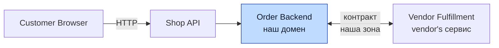
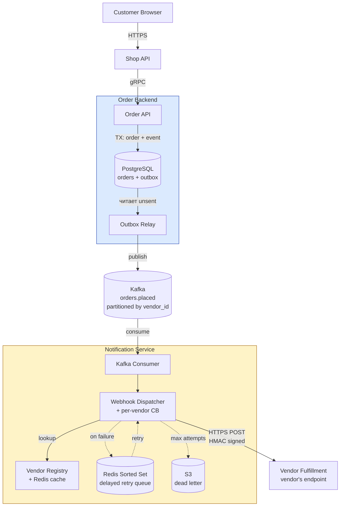
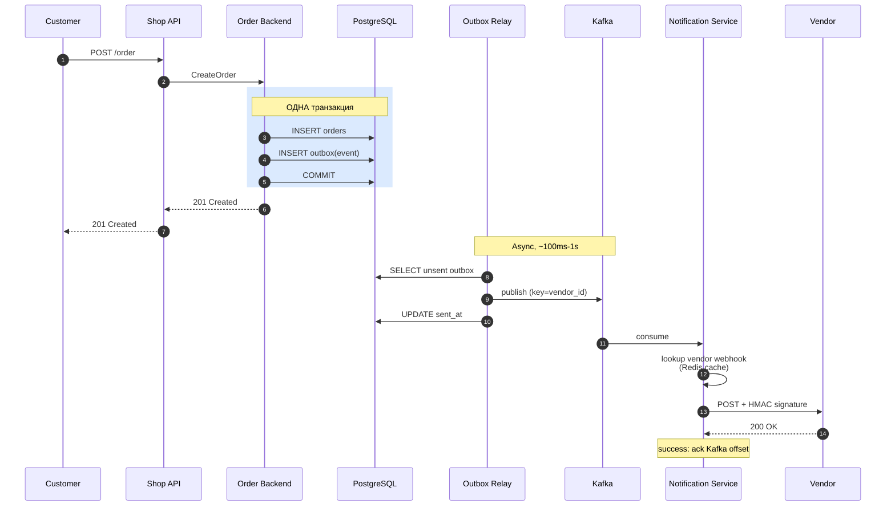
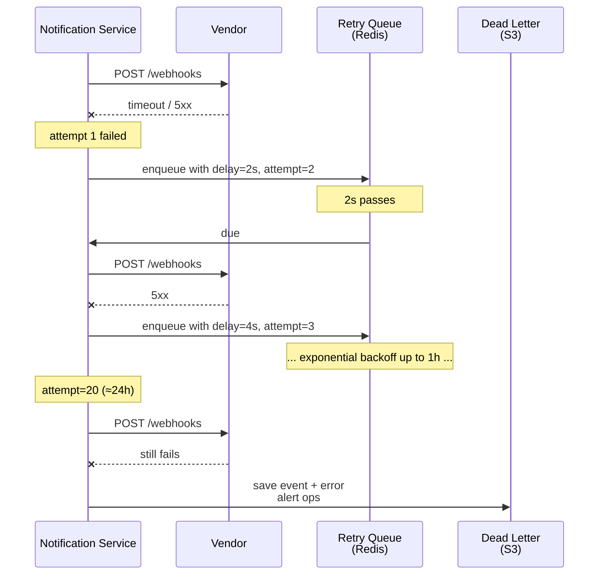

# 12. Marketplace Vendor Notifications

Задача с собеседования. Спроектировать backend-систему которая **уведомляет vendor'ов** о новых заказах. Marketplace типа Amazon: много динамических vendor'ов, customer placed order → vendor должен узнать **как можно быстрее**.

Это **очень популярный** формат задачи: на стыке messaging, reliability и API contract design. Затрагивает все ключевые senior-темы за 45 минут.

## Содержание

- [Формулировка](#формулировка)
- [Уточняющие вопросы](#уточняющие-вопросы)
- [Требования](#требования)
- [Capacity estimation](#capacity-estimation)
- [Выбор механизма доставки](#выбор-механизма-доставки)
- [Рекомендуемая архитектура](#рекомендуемая-архитектура)
- [Контракт API между Backend и Vendor](#контракт-api-между-backend-и-vendor)
- [Order Backend: внутренности](#order-backend-внутренности)
- [Notification Service](#notification-service)
- [Vendor Registration](#vendor-registration)
- [Failure handling](#failure-handling)
- [Security](#security)
- [Observability](#observability)
- [Scaling](#scaling)
- [Стек](#стек)
- [Тradeoffs и альтернативы](#tradeoffs-и-альтернативы)
- [Чек-лист ответа на собеседовании](#чек-лист-ответа-на-собеседовании)

---

## Формулировка

> Marketplace типа Amazon. Vendor'ы листают товары, customer'ы делают заказы. Многие vendor'ы регистрируются динамически.
>
> Спроектировать backend-систему, которая уведомляет vendor'а когда customer сделал заказ на его товар. **Минимизировать** время между placement'ом и notification'ом.
>
> Контроль над **Order Backend** (синий блок) и контрактом между Backend и Vendor Fulfillment.



---

## Уточняющие вопросы

Senior **обязательно** задаёт ~5 вопросов перед началом дизайна. Это signal seniority.

### 1. Сколько vendor'ов и orders?

> "Сотни/тысячи/сотни тысяч vendor'ов? Orders/sec в пик?"

Принципиально влияет на выбор: для 100 vendor'ов WebSocket pool OK. Для миллионов — нужны queue/sharding.

**Assumption:** 100k vendor'ов, 10k orders/sec в пик.

### 2. Какой acceptable latency?

> "100ms / 1s / минута?"

Влияет на push vs poll.

**Assumption:** P99 < 2 секунд от order placement до vendor notification.

### 3. Vendor — это сервис с public endpoint или admin в web UI?

> "Vendor — это другой сервер (B2B integration) или человек смотрит в admin panel?"

Если человек в UI — это другая задача (real-time UI updates через WebSocket). Я предполагаю первое — B2B integration.

**Assumption:** Vendor = другой сервис который сам обрабатывает orders.

### 4. Что если vendor down?

> "Holding orders queue? Retry? Eventually deliver?"

Влияет на персистентность.

**Assumption:** Order **не должен теряться**, vendor должен получить (eventually). Retry с экспоненциальным backoff.

### 5. Какие гарантии delivery?

> "At-least-once OK или нужно exactly-once?"

At-least-once проще, требует idempotency на стороне vendor'а. Exactly-once — намного сложнее.

**Assumption:** At-least-once с идемпотентным API contract.

### 6. Geo distribution?

> "Один регион или global?"

**Assumption:** Один регион пока. Global — extension в конце.

### 7. Vendor controls endpoint URL?

> "Каждый vendor регистрирует свой URL? mTLS? IP allowlist?"

Влияет на vendor onboarding.

**Assumption:** Vendor регистрирует webhook URL + получает signing secret.

---

## Требования

### Functional

- Customer places order → vendor (одного из товаров) узнаёт ASAP
- Если vendor down — retry, eventually deliver
- Vendor может **зарегистрировать** свой endpoint
- Vendor получает enough info чтобы fulfill: order_id, items, shipping address, ...
- Vendor может **acknowledge** receipt (опционально)

### Non-functional

- **Latency:** P99 < 2 секунды от placement до first notification attempt
- **Reliability:** at-least-once delivery; no order lost даже если vendor down
- **Scale:** 10k orders/sec peak, 100k vendor'ов
- **Independence:** один slow vendor не должен влиять на others (bulkheading)
- **Security:** vendor knows что notification от platform (signing), platform validates vendor identity

---

## Capacity estimation

```
10k orders/sec peak
Average 2 items per order, 1.5 vendors per order (some items same vendor)
→ ~15k vendor notifications/sec peak

Notification payload: order_id + items + shipping → ~2 KB
→ 30 MB/s sustained

Storage of order events for retry:
  Keep events for 7 days = 7*86400 = ~600k seconds
  10k/sec × 600k seconds × 2 KB ≈ 12 TB

Active vendor connections:
  Если WebSocket — 100k persistent connections
  Если webhook — пиковые ~15k concurrent HTTP requests
```

Числа показывают что:
- Webhook + queue — easily handle
- WebSocket pool — 100k connections тоже OK (one server can handle 64k-1M)
- Storage 12 TB — OK для object store (S3) с lifecycle

---

## Выбор механизма доставки

Главное архитектурное решение — **как доставлять notification'ы**. Пять вариантов:

### 1. ❌ Polling (vendor запрашивает)

```
Vendor каждые N секунд: GET /api/vendors/{id}/orders?since=...
```

**Плюсы:** простой; работает через любые firewall.
**Минусы:**
- Latency = polling interval (1-5s минимум разумно)
- Wasted requests когда orders нет
- Не масштабируется при 100k vendor'ов polling каждые 5s = 20k req/sec wasted

**Для "минимизировать latency" — плохо.**

### 2. ⚠️ Long polling

```
Vendor: GET /api/orders/wait?vendor=X (HTTP request hangs до 30s)
Backend: возвращает 200 когда appears order, или 204 после timeout
```

**Плюсы:** lower latency чем polling, работает через любую инфру.
**Минусы:**
- N connections для N vendor'ов (load balancer concern)
- Reconnect cycle каждые 30s

Работает, но WebSocket лучше для real-time.

### 3. ⚠️ WebSocket / SSE

```
Vendor подключается WebSocket → backend пушит когда есть order
```

**Плюсы:** lowest latency (~ms).
**Минусы:**
- Persistent connection management (reconnect, heartbeat)
- Sticky sessions / connection routing complexity
- Что если vendor временно down — backend держит queue? Где?
- B2B vendors часто **не любят** держать персистентное соединение

**Хорошо подходит** для interactive admin UI, **не идеально** для B2B vendor services.

### 4. ✅ Webhook (HTTP push)

```
Vendor регистрирует endpoint: POST https://vendor.com/orders/new
Backend POST'ит на этот endpoint когда есть order
```

**Плюсы:**
- Vendor — stateless HTTP service (легко scale)
- Любая инфра / firewall — vendor exposes public HTTPS
- Indistry standard (Stripe, GitHub, Shopify все так делают)

**Минусы:**
- Vendor должен иметь public HTTPS endpoint
- Retry logic complexity (на стороне platform)
- Security: signing, replay attacks

**Recommended для most vendors.**

### 5. ✅ Message Queue (vendor subscribes)

```
Backend publishes в Kafka/SQS per-vendor topic/queue
Vendor consumer SDK reads messages
```

**Плюсы:**
- Persistent storage built-in (retry forever)
- At-least-once semantics
- Vendor scale independently (multiple consumers)

**Минусы:**
- Vendor должен running consumer (нет dynamic вызовов их сервиса)
- Tight coupling: vendor inherits Kafka client
- Большие vendors могут предпочесть push; маленькие — pull

### Гибридный подход (production reality)

Большие marketplaces (Stripe, Shopify, Amazon) предлагают **оба**:

- **Webhook** — default, для most vendors
- **Polling API** — для vendors которые не хотят host endpoint (`GET /orders?since=cursor`)
- **EventBus** (Kafka/Kinesis) — для enterprise vendors с high volume

Главный ответ собеседовщику: **Webhook как основной**, с fallback на pull API.

---

## Рекомендуемая архитектура



### Роль каждого компонента

Сквозная идея — **гарантированная доставка ненадёжному внешнему получателю**: Outbox даёт «не потерять событие» при публикации, а per-vendor circuit breaker изолирует один лежащий vendor-эндпоинт от остальных.

**Order API + PostgreSQL (orders + outbox).**
*Зачем:* в одной транзакции пишет заказ и событие в outbox.
*Почему так:* событие и заказ должны появиться атомарно — иначе «заказ есть, уведомления нет» или наоборот. Транзакционность — [postgresql / transactions & locking](../../06-databases/database-systems-catalog/postgresql/04-transactions-and-locking.md).

**Outbox Relay.**
*Зачем:* читает неотправленные события и публикует в Kafka, помечая `sent_at`.
*Почему отдельно:* развязывает запись заказа и публикацию; at-least-once-публикация переживает падения. Профиль брокера — [Kafka](../../07-message-brokers-and-streaming/01-kafka.md).

**Kafka (partitioned by vendor_id).**
*Зачем:* буфер и порядок событий в рамках vendor'а.
*Почему ключ = vendor_id:* сохраняет порядок уведомлений конкретного vendor'а и даёт параллелизм между vendor'ами.

**Vendor Registry (+ Redis cache).**
*Зачем:* хранит webhook-URL и секрет vendor'а, кешируя в Redis.
*Почему кеш:* lookup происходит на каждом событии — sub-ms из Redis вместо обращения к БД. Профиль — [Redis](../../06-databases/database-systems-catalog/08-redis.md).

**Webhook Dispatcher (+ per-vendor circuit breaker).**
*Зачем:* подписывает payload HMAC, шлёт POST, при сбое — в retry-очередь, после max attempts — в DLQ.
*Почему per-vendor CB:* лежащий эндпоинт одного vendor'а не должен исчерпывать воркеры и тормозить остальных. Паттерн — [reliability / circuit breaker](../reliability-patterns/03-circuit-breaker.md); приём доставки и подпись — [protocols / webhooks](../../08-networking-and-api/protocols/06-webhooks.md).

**Retry Queue (Redis Sorted Set) + DLQ (S3).**
*Зачем:* отложенные повторы с exponential backoff; необработанное после ~24 ч → dead letter + alert.
*Почему ZSet:* score = время следующей попытки — естественная delayed-очередь. Стратегия — [reliability / retries & backoff](../reliability-patterns/02-retries-and-backoff.md).

### Поток — happy path



*Итог:* заказ и событие зафиксированы атомарно; публикация и доставка асинхронны, поэтому ответ покупателю не зависит от доступности vendor'а.

### Поток — vendor unavailable



*Итог:* сбой одного vendor'а не теряет событие и (через per-vendor CB) не задевает остальных; после исчерпания повторов — dead letter с алертом, а не молчаливая потеря.

---

## Контракт API между Backend и Vendor

Это часть задачи которую expressly assigned to нам ("data marshaled between backend and vendors").

### Webhook payload (POST к vendor)

```http
POST https://vendor.example.com/webhooks/orders
Content-Type: application/json
X-Marketplace-Event: order.placed
X-Marketplace-Event-ID: 8a4f...  (UUID, used for dedup)
X-Marketplace-Signature: t=1716220800,v1=hmac_sha256(...)
X-Marketplace-Timestamp: 1716220800
User-Agent: Marketplace-Webhook/1.0

{
  "event_id": "8a4f9b...",
  "event_type": "order.placed",
  "timestamp": "2026-05-21T10:00:00Z",
  "version": "1",
  "order": {
    "id": "ord_1234",
    "vendor_id": "v_5678",
    "customer_id": "cu_9abc",
    "items": [
      {
        "sku": "ABC-123",
        "quantity": 2,
        "price_cents": 1500,
        "currency": "USD"
      }
    ],
    "shipping_address": {
      "name": "Alice Smith",
      "street": "123 Main St",
      "city": "Springfield",
      "country": "US",
      "postal_code": "12345"
    },
    "total_cents": 3000,
    "currency": "USD",
    "placed_at": "2026-05-21T09:59:55Z"
  }
}
```

### Vendor response

```json
HTTP 200 OK
{
  "received": true,
  "vendor_order_id": "v-internal-456"  // опционально
}
```

**Что важно:**
- **`event_id`** — UUID для дедупликации. Vendor сохраняет в Inbox table.
- **HMAC signing** — vendor verifies request from platform (см. [Security](#security))
- **`version`** — для backward compatibility evolution
- **Self-contained** — vendor не нужно дополнительно запрашивать у нас данные
- **Идемпотентный** — повторная отправка с тем же event_id → vendor ignored

### Vendor management API (для регистрации)

```http
POST /api/v1/vendors/{vendor_id}/webhooks
Authorization: Bearer <vendor's API token>

{
  "url": "https://vendor.example.com/webhooks/orders",
  "events": ["order.placed", "order.cancelled"],
  "active": true
}

Response:
{
  "webhook_id": "wh_abc123",
  "secret": "whsec_...",  // показывается ОДИН РАЗ
  "url": "https://vendor.example.com/webhooks/orders"
}
```

Vendor может тестировать webhook через replay/test endpoint:

```http
POST /api/v1/vendors/{vendor_id}/webhooks/{webhook_id}/test
```

---

## Order Backend: внутренности

```sql
-- Order таблица (упрощённая)
CREATE TABLE orders (
    id          UUID PRIMARY KEY,
    customer_id UUID,
    placed_at   TIMESTAMPTZ DEFAULT NOW(),
    status      TEXT,
    -- ...
);

CREATE TABLE order_items (
    id         UUID PRIMARY KEY,
    order_id   UUID REFERENCES orders(id),
    vendor_id  UUID,
    sku        TEXT,
    quantity   INT,
    -- ...
);

-- Outbox для надёжной доставки в Kafka
CREATE TABLE outbox (
    id         UUID PRIMARY KEY DEFAULT gen_random_uuid(),
    aggregate_id UUID,
    event_type TEXT,
    payload    JSONB,
    created_at TIMESTAMPTZ DEFAULT NOW(),
    sent_at    TIMESTAMPTZ
);
CREATE INDEX outbox_unsent_idx ON outbox (created_at) WHERE sent_at IS NULL;
```

### PlaceOrder logic

```go
func (s *OrderService) PlaceOrder(ctx context.Context, req PlaceOrderRequest) (*Order, error) {
    return s.db.Tx(ctx, func(tx pgx.Tx) (*Order, error) {
        // 1. Create order
        order, err := s.createOrder(ctx, tx, req)
        if err != nil {
            return nil, err
        }

        // 2. Group items by vendor → outbox events
        byVendor := groupByVendor(order.Items)
        for vendorID, items := range byVendor {
            event := OrderPlacedEvent{
                EventID:   uuid.New(),
                OrderID:   order.ID,
                VendorID:  vendorID,
                Items:     items,
                Address:   order.ShippingAddress,
                Timestamp: time.Now(),
            }
            if err := s.outbox.SaveInTx(ctx, tx, event); err != nil {
                return nil, err
            }
        }

        return order, nil
    })
}
```

Outbox обеспечивает: либо и order, и event сохранены, либо ни одно (атомарно с DB transaction). Подробнее: [09-saga-and-outbox.md](../../04-architecture-and-patterns/patterns/09-saga-and-outbox.md).

### Outbox relay

Background worker — публикует unprocessed events в Kafka.

```go
func (r *Relay) Run(ctx context.Context) {
    ticker := time.NewTicker(1 * time.Second)
    for {
        select {
        case <-ctx.Done():
            return
        case <-ticker.C:
            r.processBatch(ctx)
        }
    }
}

func (r *Relay) processBatch(ctx context.Context) error {
    // FOR UPDATE SKIP LOCKED — multiple relay workers
    rows, _ := r.db.Query(ctx, `
        SELECT id, event_type, payload FROM outbox
        WHERE sent_at IS NULL
        ORDER BY created_at
        LIMIT 100
        FOR UPDATE SKIP LOCKED
    `)

    for rows.Next() {
        var event Event
        rows.Scan(&event.ID, &event.Type, &event.Payload)

        // Partition по vendor_id для ordering per vendor
        if err := r.kafka.Publish(ctx, "orders.placed", event.VendorID, event.Payload); err != nil {
            continue  // retry в next tick
        }

        r.db.Exec(ctx, "UPDATE outbox SET sent_at = NOW() WHERE id = $1", event.ID)
    }
    return nil
}
```

**Partitioning Kafka по `vendor_id`** — гарантирует **ordering per vendor**. Если vendor получает order1 и order2 — order1 будет первым.

---

## Notification Service

Главный сервис который превращает Kafka events в webhook POSTs.

```go
type NotificationService struct {
    consumer   *kafka.Consumer
    registry   VendorRegistry
    dispatcher *WebhookDispatcher
    retryQueue *DelayedQueue
}

func (s *NotificationService) Run(ctx context.Context) error {
    for {
        msg, err := s.consumer.Read(ctx)
        if err != nil {
            return err
        }

        var event OrderPlacedEvent
        json.Unmarshal(msg.Value, &event)

        go s.process(ctx, &event)  // bounded concurrency через worker pool
    }
}

func (s *NotificationService) process(ctx context.Context, event *OrderPlacedEvent) {
    // 1. Get vendor's webhook config
    webhook, err := s.registry.GetWebhook(ctx, event.VendorID)
    if err != nil {
        // Vendor without webhook → use pull API only. Skip.
        return
    }

    // 2. Build request с signing
    req := s.dispatcher.BuildRequest(webhook, event)

    // 3. Try deliver
    if err := s.dispatcher.Deliver(ctx, req); err != nil {
        // Schedule retry
        s.retryQueue.Enqueue(event, 1, computeBackoff(1))
    }
}
```

### WebhookDispatcher

```go
func (d *WebhookDispatcher) Deliver(ctx context.Context, req *Request) error {
    // Per-vendor circuit breaker (bulkhead) — slow vendor не блокирует others
    cb := d.breakers.Get(req.VendorID)
    return cb.Execute(func() error {
        ctx, cancel := context.WithTimeout(ctx, 10*time.Second)
        defer cancel()

        resp, err := d.httpClient.Do(req.HTTP)
        if err != nil {
            return err
        }
        defer resp.Body.Close()

        if resp.StatusCode >= 200 && resp.StatusCode < 300 {
            return nil  // success
        }

        if resp.StatusCode >= 400 && resp.StatusCode < 500 && resp.StatusCode != 408 && resp.StatusCode != 429 {
            // 4xx non-transient → дальше retry бесполезен
            return PermanentError{Status: resp.StatusCode}
        }

        return TransientError{Status: resp.StatusCode}
    })
}
```

### Retry queue with backoff

После failure — event попадает в **delayed queue**. Когда время retry наступило — снова attempt.

```go
type RetryItem struct {
    Event       *OrderPlacedEvent
    Attempt     int
    NextRetryAt time.Time
}

func (q *DelayedQueue) Enqueue(event *OrderPlacedEvent, attempt int, delay time.Duration) {
    item := RetryItem{
        Event:       event,
        Attempt:     attempt,
        NextRetryAt: time.Now().Add(delay),
    }
    // Save to Redis sorted set (score = NextRetryAt unix)
    q.redis.ZAdd(ctx, "retry-queue", redis.Z{Score: float64(item.NextRetryAt.Unix()), Member: serialize(item)})
}

func (q *DelayedQueue) processDue(ctx context.Context) {
    now := time.Now().Unix()
    // Get items where score < now
    items, _ := q.redis.ZRangeByScore(ctx, "retry-queue", &redis.ZRangeBy{
        Min: "0",
        Max: fmt.Sprint(now),
    }).Result()

    for _, item := range items {
        retry := deserialize(item)
        q.redis.ZRem(ctx, "retry-queue", item)

        if err := q.dispatcher.Deliver(ctx, buildReq(retry.Event)); err != nil {
            if retry.Attempt >= maxAttempts {
                q.deadLetter.Save(retry.Event)
                continue
            }
            q.Enqueue(retry.Event, retry.Attempt+1, computeBackoff(retry.Attempt+1))
        }
    }
}

func computeBackoff(attempt int) time.Duration {
    base := time.Duration(math.Pow(2, float64(attempt))) * time.Second
    if base > 1*time.Hour {
        base = 1 * time.Hour
    }
    // Full jitter
    return time.Duration(rand.Float64() * float64(base))
}
```

**Backoff schedule:**
- Attempt 1: instant
- Attempt 2: ~2s
- Attempt 3: ~4s
- Attempt 4: ~8s
- ... up to 1 hour
- Stop после ~20 attempts (covers ~1 day)
- → Dead letter

---

## Vendor Registration

```sql
CREATE TABLE vendor_webhooks (
    id          UUID PRIMARY KEY DEFAULT gen_random_uuid(),
    vendor_id   UUID NOT NULL,
    url         TEXT NOT NULL,
    secret_hash TEXT NOT NULL,  -- хранится hash, не secret в plain
    events      TEXT[],
    active      BOOLEAN DEFAULT true,
    created_at  TIMESTAMPTZ DEFAULT NOW(),
    updated_at  TIMESTAMPTZ DEFAULT NOW()
);

CREATE INDEX webhooks_vendor_idx ON vendor_webhooks (vendor_id) WHERE active = true;
```

Caching — `VendorRegistry` кэширует в memory (LRU + TTL 5 min). Notification Service делает ~15k lookup/sec — без кэша БД упадёт.

---

## Failure handling

### 1. Vendor's endpoint down

- Retry with exponential backoff up to 24 hours
- После max attempts → dead letter queue (S3 + alert)
- Vendor health metric: `vendor_webhook_success_rate{vendor_id=...}`
- Auto-disable webhook если success rate < 50% за час — alert vendor (email)

### 2. Vendor slow (high latency)

- Per-vendor **circuit breaker** — после N consecutive timeouts circuit opens
- Все следующие messages → retry queue (без trying to deliver)
- Half-open после 1 min для recovery check

### 3. Notification Service down

- Kafka consumer offset не committed → after restart re-process
- Idempotency на стороне vendor через `event_id`

### 4. Order Backend down

- Outbox events не идут в Kafka, но events safe в DB
- After recovery → relay catches up

### 5. Kafka down

- Outbox relay не может publish → events stay в outbox
- Backlog clears after recovery
- Storage в outbox table — capacity для несколько часов backlog

### 6. Dead letters

- Stored в S3 для inspection
- Daily report — какие orders не доставлены
- Manual replay через admin API после fix

---

## Security

### 1. HMAC signing webhooks

Vendor проверяет что request **действительно** от platform:

```
Request:
  POST /webhooks/orders
  X-Marketplace-Timestamp: 1716220800
  X-Marketplace-Signature: t=1716220800,v1=<hmac>

Where:
  signed_payload = "1716220800." + raw_body
  hmac = HMAC-SHA256(secret, signed_payload)
```

Vendor verifies:
```python
expected_hmac = hmac_sha256(secret, f"{timestamp}.{raw_body}")
assert expected_hmac == received_hmac
assert abs(now - timestamp) < 5_minutes  # replay attack защита
```

Это **точно** как Stripe webhooks работают. Industry standard.

### 2. Replay protection

`X-Marketplace-Timestamp` + comparison с current time → reject если > 5 min old.

### 3. mTLS option

Для enterprise vendors — mTLS вместо HMAC. Vendor предоставляет client cert при регистрации. Platform's outbound HTTP client использует это cert.

### 4. URL allowlist

Vendor webhook URL должен быть HTTPS, public. Reject `http://`, `localhost`, private IPs (SSRF protection).

См. [11-security/owasp-top10/03-ssrf.md](../../11-security/owasp-top10/03-ssrf.md).

### 5. Rate limit per vendor

Vendor SLAing 100 webhooks/sec — кладёт их service. Per-vendor rate limit на нашей стороне (token bucket).

### 6. Auth for vendor API

Vendor management API — Bearer token authentication. Token's scope = `vendor:{vendor_id}`.

---

## Observability

### Key metrics

```
# Latency
order_placed_to_webhook_delivered_seconds (histogram)
  labels: {vendor_id, attempt}
  buckets: [0.1, 0.5, 1, 2, 5, 10, 60, 300]

# Success rate
webhook_delivery_total (counter)
  labels: {vendor_id, status}  # success/transient_fail/permanent_fail/dropped

# Retry depth
retry_queue_size (gauge)
retry_attempts_by_attempt_number (counter)

# Dead letter
dead_letter_events_total (counter)
  labels: {vendor_id, reason}

# Per-vendor health
vendor_circuit_breaker_state (gauge)
  labels: {vendor_id}
  values: 0=closed, 1=half-open, 2=open
```

### SLO

```
99% of webhooks delivered успешно within 2 seconds (P99)
99.9% eventually delivered (within 24 hours, or in dead letter)
```

См. [reliability-patterns/08-slo-sli-error-budgets.md](../reliability-patterns/08-slo-sli-error-budgets.md).

### Alerts

- `dead_letter_rate > 0.1%` for 5 min → page
- `webhook_delivery_p99 > 10s` for 5 min → warn
- `vendor_circuit_breaker_state{state="open"} count > 100` → vendor outage incident

### Dashboards

- Per-vendor success rate, latency, retry rate
- System-wide: events/sec, webhook delivery latency histogram, retry queue depth
- Top "problem vendors" — low success rates

---

## Scaling

### Order Backend

- **Horizontal scale** — multiple instances
- **PostgreSQL** — primary + read replicas
- **Outbox table partitioning** — by created_at month, drop старые партиции

### Kafka

- **Partitioning по vendor_id** — гарантирует ordering per vendor
- **Partition count** — определяет concurrent consumer'ов. 64 partitions = 64 parallel notification workers
- **Retention** — 7 days (for replay capability)

### Notification Service

- **Stateless** — добавляем pod'ы при росте load
- **Kafka consumer group** — partitions распределяются между pods
- **Bounded concurrency per pod** — worker pool с лимитом (защита от OOM при burst)

### Vendor Registry

- **In-memory cache в Notification Service** — Redis as L2, PostgreSQL as L3
- TTL 5 min, invalidation через Kafka topic `vendor.webhook.updated`

### Geo distribution (extension)

Если global:
- Per-region Order Backend + Notification Service
- Vendor specifies preferred region
- Cross-region replication для disaster recovery

---

## Стек

| Компонент | Технология | Почему |
|---|---|---|
| Order Backend | Go service | High concurrency, low memory footprint |
| OLTP storage | PostgreSQL | ACID, outbox pattern требует tx + table |
| Message broker | Kafka | At-least-once, retention для replay, partitioning по vendor |
| Retry queue | Redis Sorted Set | Score = next retry timestamp; effective range query |
| Vendor Registry | PostgreSQL + Redis cache | Хранит canonical, кэш в Redis для high-RPS lookup |
| Notification Service | Go service | HTTP client tuning, bounded concurrency, easy K8s deploy |
| Dead letter storage | S3 + DynamoDB index | Cheap, durable |
| Monitoring | Prometheus + Grafana + Loki | Standard stack |
| Tracing | OpenTelemetry | Correlation order → webhook |
| Service mesh (optional) | Istio/Linkerd | mTLS internal, observability |

### Alternative stacks

- **GCP:** Pub/Sub вместо Kafka, Cloud SQL вместо PostgreSQL, GCS вместо S3
- **AWS:** SNS+SQS вместо Kafka, RDS, S3
- **Serverless:** Lambda для notification service (cold start concern для low-volume vendors)

---

## Tradeoffs и альтернативы

### Webhook vs Pull API: что выбрать

**Webhook (push):**
- ✅ Lowest latency
- ✅ Vendor не platform не нужен
- ❌ Vendor должен host endpoint

**Pull API:**
- ✅ Vendor controls когда process
- ✅ Vendor может быть behind firewall
- ❌ Higher latency (depends on poll rate)

**Hybrid (industry standard):** webhook by default, pull endpoint как fallback.

### Outbox vs direct publish

**Direct publish (без outbox):**
```go
db.Insert(order)
kafka.Publish(event)  // ← dual write, может fail
```

**With outbox:**
```go
db.Tx(func(tx) {
    db.Insert(order)
    db.Insert(outbox)  // atomic
})
relay.Publish()  // separate process
```

Outbox **гарантирует** что order не создан без event. См. [outbox-pattern](../../04-architecture-and-patterns/patterns/09-saga-and-outbox.md).

**Trade-off:** outbox adds latency (1-5 sec до event в Kafka). Если P99 < 500ms нужно — реализовать optimistic direct publish + outbox как fallback.

### Single Kafka topic vs per-vendor topic

**Single topic с partitioning по vendor_id:**
- ✅ Standard pattern, scales well
- ✅ Ordering per vendor (через partition key)
- ❌ Slow vendor's events partition'у блокируют consumer

**Per-vendor topic:**
- ✅ Polluted vendor не affect'ит other vendors
- ❌ 100k topics is too many for Kafka

**Решение:** single topic + per-vendor concurrency limit в consumer.

### Sync vs async webhook

**Sync** (POST и wait):
- ✅ Simple
- ❌ Slow vendor blocks worker

**Async** (POST, не wait for response, ack по separate event):
- ✅ Decoupled
- ❌ Complex, vendor должен implement ACK callback

Industry standard: **sync с aggressive timeout** (5-10s) + retry.

---

## Чек-лист ответа на собеседовании

В порядке времени (45 минут):

| Минута | Что делать |
|---|---|
| 0-5 | Уточняющие вопросы (scale, latency, delivery guarantees, vendor type) |
| 5-10 | Capacity estimation, functional/non-functional requirements |
| 10-15 | Обсудить варианты доставки (poll, long poll, ws, webhook, queue) — выбрать webhook + pull fallback |
| 15-25 | Рисовать архитектуру: Shop API → Order Backend (с outbox) → Kafka → Notification Service → Vendor |
| 25-30 | API contract: payload, HMAC signing, versioning |
| 30-35 | Failure handling: retry, dead letter, circuit breaker per vendor |
| 35-40 | Security: HMAC, replay, mTLS, SSRF protection |
| 40-45 | Scaling: Kafka partition, vendor registry cache, geo distribution |

### Уровни ответа

**Junior:** webhook + БД. Не упоминает outbox, retry, security.

**Middle:** webhook + queue, retry с backoff, basic security. Не углубляется в bulkhead/circuit breaker per vendor.

**Senior:** все вышеперечисленное + outbox pattern, per-vendor circuit breaker, HMAC signing pattern Stripe-style, observability, SLO/SLI.

**Strong Senior:** + alternatives (pull API fallback), Kafka partitioning strategy, geo distribution, dead letter inspection process, vendor onboarding flow с test webhook, какие production-grade libraries (`hashicorp/golang-lru` для vendor registry cache, `sony/gobreaker` для CB).

### Что **обязательно** показать

1. **Уточняющие вопросы first** — не сразу рисовать
2. **Outbox pattern** — для надёжного transactional publishing
3. **Webhook как primary mechanism** — industry standard
4. **HMAC signing Stripe-style** — security должен звучать конкретно
5. **Per-vendor circuit breaker** — bulkhead isolation
6. **Retry queue с exponential backoff + jitter**
7. **Dead letter** — куда уходят неудавшиеся
8. **Idempotency через event_id** — at-least-once реальность
9. **Kafka partitioning по vendor_id** — ordering preservation
10. **SSRF protection** при vendor URL validation — security thinking

### Уловки и подвохи

- **"А если нам нужна exactly-once?"** — реалистично at-least-once + idempotency. Exactly-once в distributed system очень дорого.
- **"Что если vendor хочет push несколько endpoints?"** — добавить multiple webhook URLs в vendor config.
- **"Vendor пожаловался что не получил order"** — нужен tracing (correlation_id), audit log webhook attempts, replay endpoint.
- **"Order placed но vendor никогда не получил"** — что в outbox? в Kafka? в dead letter? Каждый этап должен быть visible.

---

## Связки

- [Outbox pattern](../../04-architecture-and-patterns/patterns/09-saga-and-outbox.md) — основа надёжной доставки events
- [Webhooks protocol](../../08-networking-and-api/protocols/06-webhooks.md) — design webhook contracts
- [Idempotency](../reliability-patterns/06-idempotency.md) — at-least-once → idempotent processing
- [Circuit Breaker](../reliability-patterns/03-circuit-breaker.md) — per-vendor isolation
- [Retry с Backoff](../reliability-patterns/02-retries-and-backoff.md)
- [SSRF Protection](../../11-security/owasp-top10/03-ssrf.md) — URL validation
- [Notification Service case](./02-notification-service.md) — близкий case, fan-out push notifications
- [Stripe Webhooks Documentation](https://stripe.com/docs/webhooks) — production reference
- [Shopify Webhooks](https://shopify.dev/docs/apps/webhooks) — другой production reference
