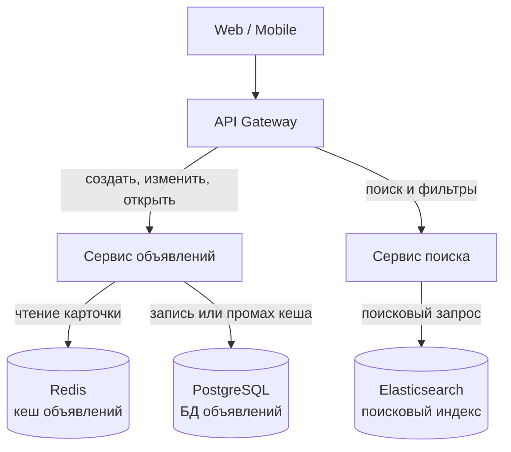
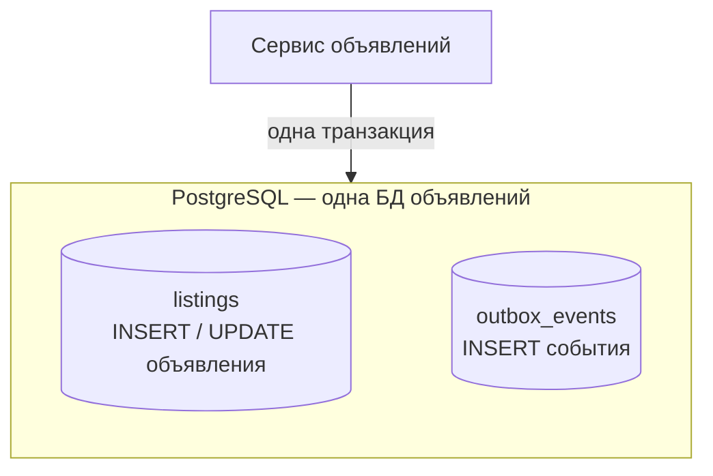
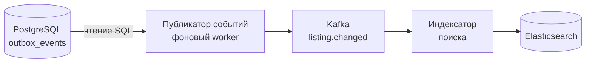

# Avito / Classifieds (доска объявлений)

## Содержание

- [Фаза 1: Уточнение требований](#фаза-1-уточнение-требований)
- [Фаза 2: Оценка нагрузки](#фаза-2-оценка-нагрузки)
- [Фаза 3: Высокоуровневый дизайн](#фаза-3-высокоуровневый-дизайн)
  - [Роль каждого компонента](#роль-каждого-компонента)
  - [Сквозные потоки](#сквозные-потоки)
- [Фаза 4: Deep Dive](#фаза-4-deep-dive)
  - [Категории и динамические атрибуты](#категории-и-динамические-атрибуты)
  - [Поиск с фасетными фильтрами](#поиск-с-фасетными-фильтрами)
  - [Гео-поиск](#гео-поиск)
  - [Карточка объявления: горячее чтение](#карточка-объявления-горячее-чтение)
  - [Медиа-пайплайн: фото и видео](#медиа-пайплайн-фото-и-видео)
  - [Счётчик просмотров](#счётчик-просмотров)
  - [Ранжирование и платное продвижение](#ранжирование-и-платное-продвижение)
  - [Модерация и антифрод](#модерация-и-антифрод)
  - [Жизненный цикл объявления](#жизненный-цикл-объявления)
- [Трейдоффы](#трейдоффы)
  - [Почему Kafka и когда выбрать NATS или RabbitMQ](#почему-kafka-и-когда-выбрать-nats-или-rabbitmq)
- [Failure Scenarios](#failure-scenarios)
- [Фаза 5: финал](#фаза-5-финал)
- [Interview-ready answer](#interview-ready-answer)

Разбор задачи "Спроектируй Avito" — классифайд-площадку: доска объявлений, поиск с фасетными фильтрами, загрузка фото/видео, открытие карточек объявлений под highload. Кейс объединяет три ранее разобранных проблемы: **поиск с фильтрами at scale** (Elasticsearch), **медиа-пайплайн** (как [07. YouTube](./07-youtube-video-platform.md)) и **горячее чтение** карточек (кеш + CDN). Дополнительно проверяет умение спроектировать **категорийно-зависимую схему атрибутов** — то, чего нет в "чистом" Twitter/YouTube.

---

## Фаза 1: Уточнение требований

### Функциональные требования

```
Вопросы:
  - Что именно: подача объявлений + поиск, или весь Avito (чаты, доставка, платежи)?
  - Поиск: полнотекстовый + фильтры? Геопоиск ("рядом со мной")?
  - Фильтры одинаковые для всех или зависят от категории
    (у авто — пробег/год, у квартиры — этаж/площадь)?
  - Медиа: только фото или фото + видео?
  - Платное продвижение объявлений (VAS) в scope?
  - Модерация контента нужна?
```

**Договорились (scope):**

- Подать/редактировать объявление (заголовок, описание, цена, категория, атрибуты, фото/видео)
- Поиск: полнотекстовый + фасетные фильтры + сортировка + гео (город/радиус)
- Открытие карточки объявления (горячее чтение)
- Загрузка и обработка фото/видео
- Категорийно-зависимые атрибуты и фильтры
- Счётчик просмотров
- Ранжирование выдачи + платное продвижение
- Модерация (автоматическая + ручная) и базовый антифрод

**Out of scope:** чат покупатель↔продавец (см. [04. Chat](./04-chat-messaging.md)), платежи и эскроу (см. [11. Payment](./11-payment-system.md)), доставка/логистика, отзывы/рейтинги, рекомендательная ML-лента (упомянём, без deep dive).

### Нефункциональные требования

Ниже — учебные допущения, а не опубликованные показатели Avito.

```
- MAU: 100M пользователей, DAU: 30M
- Активные объявления: 200M одновременно
- Поиск: 50K поисковых запросов/сек в базовом профиле, до 150K/сек в пик
- Открытие карточек: 150K просмотров/сек
- Подача объявлений: ~5M новых объявлений/день ≈ 60/сек (пики ×10)
- Точный Read:Write пока неизвестен: нужны частоты редактирования и смены статуса.
  Для масштаба: (50K + 150K) / 60 ≈ 3333 чтения на создание,
  если сопоставить этот профиль чтения со средней частотой созданий.
- Search latency: p99 < 300ms
- Card open latency: p99 < 150ms
- Свежесть индекса: допущенная к публикации версия видна < 5 сек после commit
- Availability: 99.95% (поиск и карточка — критичны)
- Картинки/видео: глобальная раздача через CDN
```

**Ключевой вывод фазы:** система read-heavy: открытий карточек больше, но поиск сложнее по вычислениям. Архитектурное ядро — отдельный **поисковый индекс** (Elasticsearch), а не запросы в основную БД. Источник правды (PostgreSQL) и индекс синхронизируются асинхронно.

---

## Фаза 2: Оценка нагрузки

```
Объявления (storage в источнике правды):
  200M активных + архив. Одно объявление ~2 KB (текст + атрибуты + метаданные)
  200M × 2 KB = 400 GB полезных данных активных объявлений (десятичные единицы).
  При сохранении всех 5M новых/день: 5M × 365 × 2 KB ≈ 3.65 TB за год.
  Это без индексов, служебных накладных расходов PostgreSQL и реплик.
  → объём сам по себе ещё не доказывает необходимость шардирования
  → начинаем с partitioned PostgreSQL + replicas; шардируем по результатам
    benchmark и требований к времени восстановления

Поисковый индекс (Elasticsearch):
  200M документов. Допустим, измеренный размер в индексе ~3-5 KB/документ
  (включая _source и поисковые структуры; это не просто размер исходного JSON).
  200M × 5 KB ≈ 1 TB на primary shard set
  с одной или двумя replicas = ~2-3 TB суммарно
  → логические индексы по вертикалям; число data nodes и primary shards
    выводим из benchmark пикового search workload и времени восстановления

Медиа (фото/видео):
  В среднем 5 фото на объявление × несколько размеров (thumb/preview/full)
  5M объявлений/день × 5 фото × ~300 KB (после сжатия, все размеры) ≈ 7.5 TB/день
  Видео — опционально, ~10% объявлений × ~20 MB ≈ 10 TB/день
  → object storage (S3) + CDN; 7.5 TB и 10 TB — оценка готовых вариантов.
    Размер сохраняемых оригиналов и срок хранения считаем отдельно.

Трафик чтения:
  150K card opens/sec — данные карточки из Redis, медиа с CDN;
  нагрузка на PostgreSQL зависит от hit rate (расчёт в разделе про карточку)
  50K searches/sec в базовом профиле, до 150K/sec в пик
  → capacity Elasticsearch проверяем на пиковом наборе реальных запросов
    с фасетами, гео и ранжированием, а не на простом match-запросе

Счётчик просмотров:
  150K просмотров/сек × запись = write hotspot
  → нельзя писать в БД на каждый просмотр (см. deep dive)
```

**Выводы, влияющие на архитектуру:**

1. Для сочетания полнотекста, фасетов и гео выбираем Elasticsearch; пригодность конкретной конфигурации подтверждаем нагрузочным тестом.
2. Кеш Redis уменьшает нагрузку точечных чтений на PostgreSQL; CDN разгружает раздачу файлов.
3. Счётчик просмотров нельзя инкрементить в БД синхронно — батчинг через Redis/поток.
4. Медиа — отдельный пайплайн с object storage и CDN, не через приложение.
5. Число PostgreSQL- и Elasticsearch-узлов выводится из benchmark полного
   workload; объём в 400 GB и слово highload не являются расчётом шардов.

---

## Фаза 3: Высокоуровневый дизайн

На собеседовании сначала показываем, кто принимает запросы и где лежат данные.
Затем отдельно раскрываем транзакцию сохранения объявления и асинхронное
обновление поиска. Так границы сервисов не смешиваются с внутренними таблицами
и последовательностью фоновых шагов.

**Запросы пользователя:**



Сервис объявлений владеет сущностью «объявление»: принимает изменения и отдаёт
полное объявление по ID. «Карточка» — представление объявления в интерфейсе,
поэтому отдельный `Card Service` в базовом дизайне не нужен. Поиск выделен:
у него свой язык запросов, ранжирование и производное хранилище.

**Сохранение объявления и события:**



Обе записи завершаются одним `COMMIT`; при ошибке вся транзакция откатывается.
`outbox_events` — обычная таблица в той же БД, а не отдельная база или брокер.
Например, новая цена и событие об этой цене либо сохраняются вместе, либо не
сохраняются вовсе. Отдельные базы потребовали бы другого механизма атомарности.
Это применение обычных [транзакций PostgreSQL](https://www.postgresql.org/docs/current/tutorial-transactions.html).
При шардировании у каждого шарда своя outbox-таблица рядом с его объявлениями.

**Обновление поиска после сохранения объявления:**



Публикатор — обычный фоновый worker, например отдельный Go-процесс. Он
регулярно проверяет outbox-таблицу и отправляет накопившиеся события в Kafka.
Kafka хранит события в пределах retention, а индексатор превращает их в
поисковые документы. Клиент получает ответ после commit, не ожидая этих шагов.

**Как работает публикатор:**

1. Читает через SQL небольшую пачку строк `outbox_events`, у которых
   `published_at IS NULL` — они ещё не отмечены как отправленные.
2. Отправляет события в Kafka и ждёт подтверждения брокера.
3. Для подтверждённых событий записывает `published_at` в PostgreSQL.
4. При ошибке или неизвестном результате отправки оставляет событие
   неотмеченным и повторяет попытку с паузой.

Например, продавец меняет цену: сервис сохраняет цену и outbox-событие одной
транзакцией; worker позже отправляет событие, а индексатор обновляет цену в поиске.
Если worker упал после отправки, но до отметки `published_at`, он отправит событие
повторно. Поэтому индексатор должен безопасно обрабатывать дубли. Отмечать событие
до подтверждения Kafka нельзя: тогда сбой может привести к потере публикации.

Для базового варианта достаточно одного активного публикатора на БД; его
пропускную способность с отправкой пачками проверяем нагрузочным тестом. Несколько
публикаторов требуют распределения работы между ними. Для поиска неотправленных
строк нужен индекс, обработанные строки периодически очищаются. Цена такого
подхода — дополнительные SQL-запросы и задержка до следующего опроса; она входит
в общий бюджет свежести индекса.

Альтернатива — CDC (отслеживание изменений БД): готовый инструмент
[Debezium](https://debezium.io/documentation/reference/stable/transformations/outbox-event-router.html)
читает изменения outbox из журнала PostgreSQL (WAL). Это заменяет SQL-опрос,
но требует эксплуатации CDC-коннектора. В этом кейсе основной вариант — worker
с SQL; для объяснения архитектуры достаточно понимать его цикл выше.

**Медиа:** обработку и раздачу файлов добавляем отдельным контуром после
согласования scope.


### Роль каждого компонента

Главная идея — разделить каноничное состояние объявления, кеш чтения и поисковую
проекцию. Разные пути чтения и записи сами по себе не требуют отдельных
микросервисов: их можно реализовать модулями одного приложения. В этом дизайне
сервис объявлений отвечает за сущность, сервис поиска — за выдачу, а фоновые
процессы — за доставку событий и обновление индекса.

Если нагрузка чтения мешает изменениям объявлений, сначала ограничиваем для них
пулы соединений и параллелизм. Затем можно запускать обработчики чтения и записи
в отдельных группах экземпляров одного сервиса и масштабировать независимо.
Выделение самостоятельного сервиса чтения оправдывается требованиями к изоляции
и ответственности команды; цена — дополнительный API, релизы и эксплуатация.

**API Gateway** — единая точка входа.

- *Зачем:* терминирует TLS, аутентифицирует пользователя, делает rate limiting (защита от скрейперов поиска — он самый дорогой), маршрутизирует запрос в нужный сервис.
- *Граница ответственности:* общие проверки токена и лимиты централизованы, но право менять конкретное объявление проверяет сервис объявлений: пользователь должен быть его владельцем или уполномоченным модератором.

**Сервис объявлений (Listing Service)** — владелец объявления и его жизненного цикла.

- *Изменения:* создание, редактирование, снятие, валидация полей по схеме категории и применение решения модерации. Состояние объявления и outbox-событие сохраняются одной транзакцией. Это называют путём записи (`write path`), но это роль операции, а не название сервиса.
- *Чтение:* получение полной карточки по ID через Redis cache-aside; при промахе — из PostgreSQL. Сервис отдаёт метаданные и ссылки на CDN, а файлы клиент загружает с CDN отдельно.
- *Нагрузка:* около 60 новых объявлений/с в среднем — только создания. Редактирования, переходы статуса и обновления счётчиков считаются дополнительно. Путь чтения проектируется под 150K открытий/с; его изоляция и кеширование не требуют заранее вводить `Card Service`.

**PostgreSQL (Listing DB)** — источник правды.

- *Зачем:* транзакционно и надёжно хранит каноничное состояние объявления. Поисковый индекс и кеш объявлений можно перестроить из каноничных данных объявления и справочников; данные продвижения восстанавливаются из Promotion Service. Оригиналы медиа хранятся в S3: из PostgreSQL фотографии и видео восстановить нельзя.
- *Почему именно он:* нужны транзакции (объявление + outbox атомарно), целостность, и это запись — а не та нагрузка, где реляционка проигрывает. Сначала достаточно partitioning и реплик. Если один primary не проходит benchmark, RTO или окно обслуживания, используем `listing_id → virtual bucket → DB shard`; список объявлений продавца строится отдельной проекцией по `seller_id`.

**Outbox-таблица и публикатор событий** — хранение намерения отправить событие и его доставка.

- *Зачем:* атомарно зафиксировать изменение объявления и намерение опубликовать событие. Запись в `outbox_events` идёт в одной транзакции с самим объявлением. Фоновый публикатор читает неотправленные события через SQL, отправляет в Kafka и после подтверждения отмечает их как опубликованные. Доставка остаётся `at-least-once`: сбой между отправкой и отметкой приводит к повтору.
- *Почему не писать в Kafka напрямую из сервиса:* dual-write (БД + Kafka двумя вызовами) ломается при падении между ними — в БД есть, в поиске нет. Outbox связывает оба факта одной транзакцией. См. [12. Marketplace Vendor Notifications](./12-marketplace-vendor-notifications.md).

**Kafka (`listing.changed`)** — журнал событий и буфер между записью и индексацией.

- *Зачем:* развязать скорость записи от скорости индексации. Краткий всплеск подач (×10) буферизуется в топике. Производительность Indexer должна превышать среднюю скорость поступления, а запас позволяет догнать накопленное; во время отставания цель свежести может нарушаться. Плюс несколько потребителей одного события (индексатор, аналитика, кеш-инвалидатор).
- *Восстановление:* при временном отказе ES можно повторить события в пределах retention. Если отставание превысило срок хранения, нужен rebuild из каноничных данных.

Kafka на схеме — выбранный вариант брокера, а не обязательное следствие нагрузки.
Здесь предполагаем, что события нужны нескольким независимым потребителям и
после обработки сохраняются для повторного чтения. Альтернативы и границы этого
выбора разобраны в [сравнении брокеров](#почему-kafka-и-когда-выбрать-nats-или-rabbitmq).

**Индексатор поиска (Indexer Workers)** — материализует поисковый индекс. Это **свой сервис** (consumer Kafka), а не компонент ES: Elasticsearch сам ничего не тянет из БД/Kafka. Собственный индексатор, готовые коннекторы и Bulk API — в доке [как данные попадают в индекс](../../06-databases/database-systems-catalog/09-elasticsearch-and-opensearch.md).

- *Зачем:* читают `listing.changed`, обогащают (подтягивают схему атрибутов категории, гео и query-independent признаки качества), денормализуют в ES-документ и пишут в Elasticsearch. Для `active` выполняется upsert, для остальных статусов — минимальный versioned tombstone, исключённый из поиска.
- *Почему отдельный шаг:* форма данных для записи (нормализованный JSONB) ≠ форма для поиска (денормализованный плоский документ с типизированными полями под фасеты). Воркеры — место этой трансформации, масштабируются по партициям Kafka.

**Elasticsearch** — поисковый движок (**read path для поиска**). Профильный док: [Elasticsearch / OpenSearch](../../06-databases/database-systems-catalog/09-elasticsearch-and-opensearch.md).

- *Зачем:* обслуживает фасетные фильтры, facet counts, морфологию и гео на 200M документов. Кластер рассчитывается на заявленный пик 150K запросов/с и фактическую смесь тяжёлых и лёгких запросов.
- *Почему производный, а не источник правды:* ES может терять/перестраиваться; каноничное состояние — в PostgreSQL, ES всегда можно переиндексировать.

**Сервис поиска (Search Service)** — фасад над Elasticsearch.

- *Зачем:* превращает пользовательский запрос (текст + выбранные фильтры + сортировка + страница) в ES-запрос, применяет бизнес-правила ранжирования, отдаёт список + facet counts для UI.
- *Откуда краткие карточки выдачи:* из самого Elasticsearch. Документ денормализован и уже содержит поля для строки результата (`title`, `price`, `city`, URL превью, `created_at`) — сервис поиска рендерит выдачу из `_source` найденных документов, **без второго чтения** в БД. Это и есть смысл денормализации в индекс: выдача не делает N дополнительных запросов. Полное объявление (описание, ссылки на все фото, сведения о продавце) отдаёт сервис объявлений по ID.
- *Почему отдельно от ES:* клиент не должен знать о структуре индекса; здесь же — кеш популярных запросов, защита от тяжёлых запросов, A/B ранжирования.

**Redis** — кеш карточек и счётчиков. Профильные доки: [Redis как кэш](../../06-databases/caching/01-redis-as-cache.md) (cache-aside, hot key) и [Redis: реальные сценарии](../../06-databases/database-systems-catalog/08a-redis-real-scenarios.md) (счётчики, HLL).

- *Зачем:* снять 150K rps чтения карточек с PostgreSQL (cache-aside, TTL) и принять инкременты просмотров (INCR + async flush) вместо записи в БД на каждый просмотр.
- *Почему он:* sub-millisecond чтение и атомарные счётчики — ровно то, что нужно горячему read-пути.

**Moderation Service** — допуск контента в публикацию.

- *Зачем:* автоматическая проверка (текст, фото через ML, дубли, антифрод) + очередь ручной модерации. Решает, перейдёт ли объявление в `active` (и попадёт ли в индекс).
- *Почему отдельно:* модерация эволюционирует независимо (новые ML-модели, правила), не должна блокировать релиз сервиса объявлений; тяжёлые проверки идут асинхронно.

**Promotion Service** — платные услуги продвижения (VAS).

- *Зачем:* хранит покупки продвижения как `promotion{listing_id, type, active_until}` и публикует событие. Сервис объявлений применяет его к проекции продвижения, увеличивает `listing_version` и создаёт outbox-событие; Indexer получает согласованную версию документа с `promo_until` и параметрами буста. Query-time ranking перестаёт учитывать промо после `active_until`, не ожидая точного срабатывания таймера.
- *Почему отдельно:* биллинг/каталог тарифов и сроки действия — отдельный домен; не должен смешиваться с подачей объявлений и индексацией.

**Media Service + S3 + Workers + CDN** — медиа-пайплайн. Профильные доки: [AWS: S3 и presigned URLs](../../10-devops-and-observability/cloud/01-aws-core-services.md) (механика подписи, PUT vs POST) и [File Upload Flow](../external-request-flows/05-file-upload-and-background-processing-flow.md) (паттерн целиком).

- *Media Service* выдаёт presigned URL — клиент грузит файл **напрямую в S3**, минуя приложение (не прокачиваем терабайты трафика через сервис).
- *S3 raw* — сырые загрузки; *Workers* — resize/transcode/NSFW/EXIF-strip; *S3 processed* — готовые варианты; *CDN* — глобальная раздача с краёв сети, разгрузка origin.
- *Почему так:* файлы — это объём и латентность; их обработка (фоновая, идемпотентная, масштабируемая воркерами) и раздача (CDN) принципиально отличаются от логики объявлений и не должны её нагружать.

### Сквозные потоки

**1. Подача / редактирование объявления (write path):**

```
Клиент → Gateway (auth, rate limit) → Сервис объявлений
  Сервис объявлений в одной транзакции PostgreSQL:
    INSERT/UPDATE listings, увеличить listing_version
    INSERT outbox_events (listing.changed с состоянием этой версии)
    COMMIT → ответ клиенту
  → фоновый публикатор читает неотправленные outbox-события через SQL
    → отправляет в Kafka → после подтверждения записывает published_at
  → Moderation Service получает требующее проверки объявление
  → результат проверки применяется через сервис объявлений только если
    проверенная версия контента ещё актуальна; иначе нужна новая проверка:
      UPDATE listings (status=active/rejected, новая версия) + INSERT outbox_events
  → Indexer обрабатывает события: active → документ, остальные → tombstone
Итог: ответ означает сохранение, а не прохождение модерации или попадание в поиск.
Цель < 5 сек считается от commit допущенной к публикации версии до видимости в ES;
время ожидания ручной модерации в неё не входит.
```

**2. Поиск с фильтрами (read path):**

```
Клиент → Gateway → Сервис поиска
  строит bool-запрос: must(текст) + filter(active, категория, цена, атрибуты, гео)
  + aggs (facet counts) + query-time ranking
  + PIT + search_after по значениям sort последнего результата
  → Elasticsearch
  → краткие карточки берутся из _source найденных документов (денормализованы:
    title, price, city, превью-URL) + счётчики фасетов для UI
Итог: вся нагрузка на ES, PostgreSQL не задействован; выдача без доп. чтений.
```

**3. Открытие карточки (read path):**

```
Клиент → Gateway → Сервис объявлений
  GET listing:{id} в Redis
    hit  → отдать
    miss → SELECT из PostgreSQL → записать в Redis (TTL) → отдать
  карточка содержит CDN-URL медиа → браузер тянет фото/видео напрямую с CDN
  параллельно: INCR views:{id} в Redis (счётчик, без записи в БД)
Итог: метаданные обычно читаются из кеша, файлы — с CDN; промахи идут в БД.
```

**4. Загрузка медиа:**

```
Клиент → Media Service: запрос presigned URL
  Клиент → S3 raw НАПРЯМУЮ (минуя приложение)
  S3 event → Kafka → Worker: resize/transcode + NSFW + EXIF-strip → S3 processed
  CDN раздаёт processed
  media_id привязывается к объявлению (до готовности — статус processing)
Итог: трафик файлов не идёт через сервисы; обработка асинхронна и идемпотентна.
```

---

## Фаза 4: Deep Dive

На собеседовании из этой фазы достаточно выбрать один-два центральных разбора:
динамические атрибуты и поиск с согласованной пагинацией. Медиа, просмотры,
продвижение и антифрод — follow-up, если интервьюер расширяет scope.

### Категории и динамические атрибуты

**Почему это центральная проблема Avito (а не Twitter/YouTube):** фильтры зависят от категории. У авто — `пробег`, `год`, `КПП`; у квартиры — `этаж`, `площадь`, `количество комнат`; у телефона — `память`, `состояние`. Фиксированная таблица колонок не подходит — категорий тысячи, атрибутов десятки тысяч.

**Вариант A — EAV (Entity-Attribute-Value):**

```sql
CREATE TABLE listing_attributes (
  listing_id  BIGINT,
  attr_id     INT,        -- ссылка на справочник атрибутов
  value_text  TEXT,
  value_num   NUMERIC,    -- для диапазонных фильтров (цена, пробег)
  PRIMARY KEY (listing_id, attr_id)
);
```

- (+) гибко, новые атрибуты без миграций
- (−) фильтрация по нескольким атрибутам в SQL — кошмар (множество self-join), не масштабируется

**Вариант B — JSONB в PostgreSQL:**

```sql
ALTER TABLE listings ADD COLUMN attrs JSONB;
-- {"mileage": 80000, "year": 2018, "gearbox": "automatic"}
CREATE INDEX idx_listings_attrs ON listings USING GIN (attrs);
```

- (+) гибко, один документ, GIN-индекс для contains-запросов
- (−) диапазонные фильтры (`mileage BETWEEN`) по JSONB медленные на больших объёмах

**Решение для этого кейса: источник правды + денормализация в ES.**

```
PostgreSQL хранит attrs как JSONB (источник правды, гибкость).
Elasticsearch — целевой движок фильтрации: денормализуем атрибуты в поля документа.

Схема атрибутов задаётся per-category в справочнике (Category Schema Service):
  category "Автомобили":
    - mileage:  numeric, фильтр-диапазон, фасет
    - year:     numeric, фильтр-диапазон, фасет
    - gearbox:  enum,    фильтр-terms,  фасет
    - vin:      text,    не фильтруется

Indexer читает схему категории и кладёт атрибуты в типизированные ES-поля
(attrs — обычный object; nested-массивы как альтернатива разобраны ниже).
```

**Пример документа Elasticsearch (типы полей задаются отдельным mapping):**

```json
{
  "listing_id": 12345,
  "status": "active",
  "title": "BMW 320i 2018",
  "category_id": 101,
  "price": 1800000,
  "city_id": 1,
  "location": { "lat": 55.75, "lon": 37.61 },
  "created_at": "2026-06-10T10:00:00Z",
  "quality_score": 1.4,
  "promo_until": "2026-06-17T10:00:00Z",
  "listing_version": 17,
  "attrs": {
    "mileage": 80000,
    "year": 2018,
    "gearbox": "automatic"
  }
}
```
Справочник категорий и схема атрибутов — отдельный сервис, кешируется агрессивно (меняется редко). Клиент по `category_id` получает список доступных фильтров и строит UI динамически.

**Ловушка: mapping explosion.** Наивная запись `attrs.mileage`, `attrs.year`, `attrs.floor`… означает, что каждый атрибут каждой категории становится **отдельным полем в маппинге индекса**. При тысячах категорий и десятках тысяч атрибутов — а это ровно условие задачи — упираемся в лимит:

```
index.mapping.total_fields.limit по умолчанию = 1000

Поднять лимит можно, но платить придётся всерьёз:
  - маппинг раздувается и реплицируется в каждый узел кластера
  - растёт heap под field data и метаданные сегментов
  - обновление маппинга становится дорогой операцией
  - разреженность: у «Автомобилей» заполнены поля авто, у «Квартир» — свои,
    и 99% полей в документе пустые
```

Три рабочих выхода:

| Подход | Как | Цена |
|---|---|---|
| Индекс на вертикаль | Отдельные индексы «Авто», «Недвижимость», «Электроника» — в каждом только свои поля | Поиск «по всему сайту» = multi-index запрос; больше индексов в эксплуатации |
| Типизированные nested-массивы | `attrs_num: [{k:"mileage", v:80000}]`, `attrs_str: [{k:"gearbox", v:"automatic"}]` — маппинг фиксированный | Nested-запросы и nested-агрегации заметно дороже плоских полей |
| `flattened`-поле | Один field-тип на весь объект, маппинг не растёт | Нет диапазонных запросов по числам — всё хранится как keyword; для `mileage BETWEEN` не подходит |

**Выбор:** индексы по вертикалям как основа (запрос почти всегда содержит категорию, значит бьём в один индекс), а внутри вертикали — плоские типизированные поля, потому что их там уже десятки, а не десятки тысяч. `flattened` годится только для атрибутов, по которым не нужны диапазоны.

### Поиск с фасетными фильтрами

> Расшифровка терминов **морфология / фасеты / facet counts** — в профильном доке
> [Elasticsearch: ключевые понятия](../../06-databases/database-systems-catalog/09-elasticsearch-and-opensearch.md) (раздел «Ключевые понятия: морфология, фасеты, facet counts»).

**Почему Elasticsearch, а не PostgreSQL:**

```
Требования к поиску:
  - Полнотекст по заголовку/описанию с морфологией (русский язык, стемминг)
  - Фасетные фильтры: цена-диапазон + категорийные атрибуты + гео
  - Facet counts: "Автомат (1240)", "Механика (430)" — счётчики по каждому фильтру
  - Сортировка: релевантность / цена / дата / расстояние
  - 50K запросов/сек в базовом профиле, до 150K/сек в пик

PostgreSQL FTS:
  - поддерживает полнотекстовый поиск и языковые словари
  - фасеты требуют агрегировать найденную выборку; план может использовать индексы,
    bitmap scan или sequential scan — проверяем EXPLAIN ANALYZE и нагрузочный тест

Elasticsearch:
  - инвертированный индекс + doc_values для агрегаций
  - aggregations дают facet counts за один запрос
  - bool query: must (текст со score) + filter (атрибуты без score) + sort
```

**Структура запроса:** текстовая релевантность вычисляется для конкретного запроса
и попадает в `_score`. Заранее в документе хранятся только независимые от запроса
признаки: качество объявления, свежесть исходной даты и срок продвижения.

```json
{
  "query": {
    "function_score": {
      "query": {
        "bool": {
          "must": { "match": { "title": "bmw 320" } },
          "filter": [
            { "term":  { "status": "active" } },
            { "term":  { "category_id": 101 } },
            { "range": { "price": { "lte": 2000000 } } },
            { "range": { "attrs.year": { "gte": 2015 } } },
            { "term":  { "attrs.gearbox": "automatic" } },
            { "geo_distance": { "distance": "50km", "location": { "lat": 55.75, "lon": 37.61 } } }
          ]
        }
      },
      "functions": [
        { "field_value_factor": { "field": "quality_score", "missing": 1.0 } },
        { "gauss": { "created_at": { "origin": "2026-06-10T12:00:00Z", "scale": "14d", "decay": 0.5 } } },
        { "filter": { "range": { "promo_until": { "gt": "2026-06-10T12:00:00Z" } } }, "weight": 1.5 }
      ],
      "boost_mode": "multiply"
    }
  },
  "aggs": {
    "gearbox_facet": { "terms": { "field": "attrs.gearbox" } },
    "year_facet":    { "histogram": { "field": "attrs.year", "interval": 1 } }
  },
  "pit": { "id": "pit-from-first-request", "keep_alive": "1m" },
  "sort": [ { "_score": "desc" }, { "listing_id": "desc" } ],
  "size": 30
}
```

**Почему `filter`, а не `must` для атрибутов:** условие в filter context
отвечает только «подходит или нет» и не вычисляет `_score`. Это и есть основная
причина выбора. На node query cache нельзя рассчитывать как на универсальное
ускорение: Elasticsearch решает применимость по истории запросов и размеру
сегмента, а `term` queries в актуальной
[документации node query cache](https://www.elastic.co/docs/reference/elasticsearch/configuration-reference/node-query-cache-settings)
вообще не относятся к кешируемым. Эффект проверяется профилированием; одинаковые популярные выдачи при
необходимости кеширует сервис поиска отдельным response cache.

**Пагинация:** первые короткие страницы могут использовать `from/size`, но для
глубокой пагинации нужен `search_after` — курсор из массива `sort` последнего
результата.

Курсор обязан состоять ровно из тех значений, которые вернул Elasticsearch для
объявленного `sort`. Для стабильного снимка выдачи сервис поиска открывает
[point in time (PIT)](https://www.elastic.co/docs/reference/elasticsearch/rest-apis/paginate-search-results),
передаёт последний полученный `pit_id` на следующих страницах и продлевает `keep_alive`.
Без PIT refresh между запросами может изменить порядок и привести к пропуску или
повтору результата.

В курсоре также фиксируется `ranking_time`, выбранный для первой страницы. На
следующих страницах именно этот timestamp, а не новое значение `now`, используется
в freshness decay и проверке `promo_until`. Иначе query-time score изменится даже
при одном PIT.

PIT удерживает старые сегменты и живёт ограниченное время. Поэтому `keep_alive`
задаётся только с запасом до следующей страницы, cursor имеет срок действия, а
после его истечения клиент начинает новый поиск вместо бесконечного продления
старого снимка. Facet counts обычно считаются на первой странице, а не повторяются
на каждой следующей.

```
Первая страница:
  PIT = открыть снимок индекса на 1 минуту
  ranking_time = 2026-06-10T12:00:00Z
  sort = [_score desc, listing_id desc]

Последний hit вернул:
  sort = [8.731, 12345, 4294967298]

Следующая страница повторяет query и sort, использует последний pit_id:
  search_after = [8.731, 12345, 4294967298]

listing_id задаёт однозначный порядок. PIT дополнительно автоматически
добавляет _shard_doc: в этом примере 4294967298 — условное возвращённое значение.
В search_after передаётся весь массив sort, включая этот третий элемент.
```

`_score` использовать можно: он выражает релевантность именно текущему текстовому
запросу. Нельзя заранее «записать текстовую релевантность в `boost_score`», потому
что для запросов «BMW 320» и «экономичный седан» один документ получит разные
оценки. Стабильность страниц обеспечивает PIT, а однозначный порядок — tie-breaker.

**Распределение Elasticsearch:** логические индексы делятся по вертикалям, чтобы
контролировать mapping. Внутри каждого индекса Elasticsearch распределяет primary
shards по узлам. Custom routing по региону добавляется только если почти каждый
запрос содержит регион и benchmark показывает выигрыш: иначе cross-region поиск
делает fan-out, а крупные города создают неравномерные шарды.

### Гео-поиск

```
Сценарии:
  - "Квартиры в Москве" → фильтр по city_id (term, дёшево)
  - "В радиусе 10 км от меня" → geo_distance
  - сортировка по расстоянию → geo_distance sort

Elasticsearch geo_point + geo_distance — встроенный механизм:
  - индексация координат как geo_point (BKD-дерево)
  - фильтр geo_distance + сортировка по расстоянию

Альтернатива при экстремальной нагрузке — гео-хеши (geohash / H3, см. кейс 06 Uber):
  сначала выбрать ячейки, покрывающие радиус, затем проверить точное расстояние.
  Выигрыш зависит от плотности и числа ячеек; подтверждаем benchmark.
  Для этого дизайна оставляем city_id + geo_distance в ES.
```
Если пользователь явно ограничил поиск городом, добавляем `city_id`. Для поиска по радиусу через границы городов такой фильтр исключит подходящие объявления, поэтому оставляем только географическое условие. Сокращение выборки зависит от распределения данных.

### Карточка объявления: горячее чтение

**Проблема:** 150K открытий/сек. Кеш снижает нагрузку на БД; при hit rate 99% остаётся 150K × 0.01 = 1.5K чтений/сек, при 95% — 7.5K. Эти значения требуют проверки на выбранной конфигурации PostgreSQL.

```
Сервис объявлений — cache-aside (Redis):
  1. GET listing:{id} в Redis
  2. hit  → отдать (TTL 5-10 мин)
  3. miss → SELECT из PostgreSQL → SET в Redis → отдать

Что в кеше: денормализованная карточка (заголовок, описание, цена,
  атрибуты, ссылки на медиа в CDN, продавец-краткое). Один JSON.

Статика (фото/видео) НЕ проходит через приложение:
  карточка содержит CDN-URL → браузер тянет напрямую с CDN.

Инвалидация: при редактировании/снятии — DEL listing:{id}
  (через то же событие listing.changed, что и для индексатора).
```

Один `DEL` не гарантирует свежесть: читатель может прочитать старую версию из
БД, затем обработчик события удалит кеш, а читатель запишет старую версию обратно.
В базовом варианте допускаем устаревшую карточку до истечения TTL; это ограничение
отдельно от цели свежести поискового индекса. Для более строгой свежести нужны
согласованные проверки версии при заполнении и инвалидации кеша. Критичные права
доступа и блокировки проверяются отдельно от кешируемого JSON.

#### Кэш в Redis: что включить для Avito

Карточка — классический cache-aside; общие приёмы и Go-код вынесены в профильный док [Redis как кэш](../../06-databases/caching/01-redis-as-cache.md). Здесь — что критично именно под эту нагрузку:

- **Значение** — денормализованная карточка одним blob (String), сериализация [MessagePack/Protobuf](../../06-databases/caching/01-redis-as-cache.md) (память дорогая при 200M объявлений);
- **TTL с джиттером** — иначе синхронное истечение пачки ключей даёт залп в PostgreSQL ([cache stampede](../../06-databases/caching/01-redis-as-cache.md));
- **single-flight / distributed lock** на перестройку популярного ключа при промахе;
- **negative caching** снятых/несуществующих id — боты перебирают id, короткий TTL гасит их до БД;
- **hot listing** (вирусное объявление) — это [горячий ключ](../../06-databases/caching/01-redis-as-cache.md): локальный in-process LRU перед Redis + при необходимости реплики/key splitting;
- **eviction** `allkeys-lfu` — кеш держит реально популярные карточки.

### Медиа-пайплайн: фото и видео

Архитектурно повторяет [07. YouTube](./07-youtube-video-platform.md), упрощённо для фото и адаптировано под объявления.

> Как именно presigned URL даёт клиенту грузить напрямую в S3 минуя backend (механика подписи, PUT vs POST, детект завершения) — в доке [AWS: presigned URLs](../../10-devops-and-observability/cloud/01-aws-core-services.md) и [File Upload Flow](../external-request-flows/05-file-upload-and-background-processing-flow.md).

```
Upload (фото):
  1. Клиент → Media Service: POST /media/upload-url (получить presigned S3 URL)
  2. Клиент грузит файл НАПРЯМУЮ в S3 (минуя приложение — не нагружаем сервис)
  3. S3 event / клиент-коллбэк → Kafka topic media.uploaded
  4. Image Worker:
       - валидация (формат, размер, EXIF strip — приватность)
       - resize в набор размеров: thumb (200px), preview (600px), full (1280px)
       - WebP/AVIF для современных браузеров + JPEG fallback
       - NSFW / запрещённый контент: ML-классификатор (модерация)
       - кладёт обработанные в S3 (processed bucket)
  5. CDN раздаёт обработанные с processed bucket

Upload (видео):
  - chunked / resumable upload (как YouTube)
  - транскод FFmpeg: 480p/720p, генерация постера (poster frame)
  - HLS для адаптивного воспроизведения (опционально)
```

**Связь медиа с объявлением:** объявление публикуется со ссылками на `media_id`. До завершения обработки медиа — статус `processing`, объявление можно показать с плейсхолдером или придержать публикацию до готовности (продуктовое решение). EXIF-геоданные вырезаются обязательно — иначе утечка адреса продавца.

### Счётчик просмотров

**Проблема:** 150K просмотров/сек × `UPDATE listings SET views = views+1` = write hotspot, блокировки строк, деградация БД.

```
Решение — батчинг через Redis:
  На просмотр:  INCR views:{listing_id}   (атомарно, in-memory, дёшево)
  Дедуп "уникальные просмотры":
    PFADD views_hll:{listing_id} {user_id|ip}  (HyperLogLog — память O(1) на айтем)

  Async flush каждые 30-60 сек — слив дельты должен быть АТОМАРНЫМ:
    GETDEL views:{listing_id}   ← прочитать и обнулить одной командой
    → batch UPDATE в PostgreSQL

    Последовательность «GET → UPDATE в БД → SET 0» теряет просмотры:
    инкременты, пришедшие между чтением и обнулением, затираются.
    GETDEL закрывает это окно.

    Обратная сторона: если UPDATE в БД упадёт уже ПОСЛЕ GETDEL,
    дельта потеряна безвозвратно. Для счётчика просмотров приемлемо;
    если нужна точность — поток просмотров в Kafka и агрегация
    отдельным консьюмером. Обновление счётчика и сохранение обработанного
    offset/идентификатора батча атомарны в БД; затем коммитится offset Kafka.
    Один лишь commit offset после UPDATE не предотвращает повторный инкремент
    при сбое между этими шагами.

Отображение в карточке: views = БД-значение + текущая Redis-дельта.

Потеря при падении Redis: счётчик не финансовый — допустима оговорённая
  неточность (eventual). Для точной аналитики — отдельный event-stream в Kafka.
```
Это тот же паттерн, что лайки в [08. Twitter](./08-twitter-social-feed.md): Redis INCR + периодический flush. Реализация с кодом (GETDEL для атомарного слива дельты, HLL для уникальных) — в доке [Redis: счётчики и аналитика](../../06-databases/database-systems-catalog/08a-redis-real-scenarios.md).

### Ранжирование и платное продвижение

```
Что влияет на итоговый query-time score:
  - релевантность текущему тексту: _score из Elasticsearch
  - свежесть: decay function от created_at
  - quality_score: фото, заполненность атрибутов, рейтинг продавца
  - платное продвижение: вес действует только пока promo_until > now

Реализация:
  function_score на запросе объединяет _score с независимыми признаками.
  quality_score, created_at и promo_until лежат в ES-документе.
  Изменение качества или покупка промо вызывает versioned reindex.
  Freshness и окончание промо не требуют переиндексации по таймеру.

Платные услуги (VAS) — отдельный Promotion Service:
  покупка → строка promotion{listing_id, type, active_until}
  → событие → сервис объявлений обновляет проекцию промо и listing_version
  → outbox → Indexer записывает promo_until и параметры продвижения.
```

`quality_score` — производное, а не дельта. Indexer не «прибавляет балл», а
пересчитывает значение целиком из актуального состояния объявления. Повтор одного
события поэтому безопасен. Текстовая релевантность сюда не входит: она существует
только относительно конкретного поискового запроса.

События Promotion Service применяются идемпотентно: его версия продвижения
проверяется вместе с обновлением проекции в транзакции сервиса объявлений.
Это задаёт общий порядок изменений поискового документа: независимый consumer
промо не перезапишет более новую цену или статус старым снимком объявления.

**Как продвижение протухает:** query-time условие `promo_until > now` перестаёт
давать дополнительный вес автоматически. Фоновая sweeper-джоба всё равно полезна
для очистки каноничных истёкших записей и reconcile, но корректность порядка
выдачи не зависит от точности таймера. Цена — более тяжёлый scoring, который нужно
проверить на пиковых 150K запросов/с.

Важно для интервью: продвижение **не** должно полностью ломать релевантность (продвинутый утюг не показывают по запросу «автомобиль»). Boost применяется внутри уже отфильтрованной по категории/тексту выборки.

### Модерация и антифрод

```
Поток модерации (до или сразу после публикации):
  1. Автомат (синхронно/быстро):
     - текст: запрещённые слова, контакты в обход платформы, спам-паттерны
     - фото: NSFW-классификатор, water-mark/stock-detection, дубли (perceptual hash)
     - правила категории (цена-выброс, подозрительные атрибуты)
  2. ML-скоринг риска → low/medium/high
     - low   → публикуется сразу
     - medium→ публикуется, ставится в очередь ручной проверки
     - high  → придерживается до ручной модерации

Антифрод:
  - дубли объявлений: perceptual hash фото + шингл текста → дедуп/бан
  - мошеннические продавцы: граф связей (телефон, устройство, IP, карта)
  - аномалии: резкий всплеск объявлений с одного аккаунта → rate limit + ревью
```
Связь с индексацией: полный поисковый документ создаётся для статуса `active`.
Для остальных статусов индексатор сохраняет минимальный tombstone с ID, версией
и неактивным статусом. Поэтому поисковый запрос обязательно содержит
`status=active`: tombstone хранится в индексе, но не попадает в выдачу и фасеты.
При смене статуса уже открытый PIT сохраняет старый снимок; критичные блокировки
нельзя обеспечивать только обновлением поискового индекса.

### Жизненный цикл объявления

```
draft → pending_moderation → active → (archived | sold | rejected | expired)

active:   в индексе, ищется и открывается
sold/archived/expired: полный документ заменяется минимальным tombstone
  (историю можно хранить в отдельном индексе архива)
expired:  TTL объявления (например 30 дней) → авто-архивация фоновой джобой

Каждый переход → versioned event listing.changed → синхронизация ES
и инвалидация кеша.
```
Архив не держим в горячем ES-кластере — выносим в отдельный (или в холодное хранилище), чтобы не раздувать индекс активных 200M объявлений.

Событие содержит `event_id`, `listing_id`, монотонный `listing_version`, состояние
объявления этой версии и операцию `UPSERT` или `TOMBSTONE`. Публикатор отправляет его `at-least-once`, а Indexer применяет
только более новую версию; повтор той же версии считается уже применённым. Поэтому запоздавший `UPSERT(version=16)`
не воскресит объявление после `TOMBSTONE(version=17)`. Tombstone исключается из
поиска и хранит последнюю версию не меньше максимального времени повтора и
восстановления consumer. Удаление допустимо только когда старые события больше
не могут прийти, включая ручной replay; одна выборочная сверка этого не доказывает.

---

## Трейдоффы

| Компонент | Выбор | Альтернатива | Причина |
|---|---|---|---|
| Поиск/фильтры | Elasticsearch | PostgreSQL FTS | Фасет-каунты + морфология + до 150K peak rps |
| Источник правды | PostgreSQL; shard только после benchmark/RTO-обоснования | сразу в ES | ACID, транзакции, ES — производный индекс |
| Атрибуты | JSONB + денорм в ES | EAV / фикс. колонки | Гибкость per-category без миграций |
| Раскладка атрибутов в ES | Индексы по вертикалям, внутри — плоские поля | Все категории в одном индексе; `flattened` | Один индекс упирается в mapping explosion (лимит 1000 полей); `flattened` не умеет диапазоны по числам |
| Курсор пагинации | PIT + `search_after` по `_score` и tie-breaker | Глубокий `from/size` | PIT фиксирует снимок, tie-breaker делает порядок однозначным |
| Слив счётчика | `GETDEL` (атомарно) | GET → UPDATE → SET 0 | Инкременты между чтением и обнулением теряются |
| Синхронизация PG→ES | Versioned outbox + Kafka + идемпотентный Indexer | dual-write | Факт события атомарен с DB; повторы и перестановка не воскрешают tombstone |
| Брокер событий | Kafka при необходимости истории и независимого повторного чтения | NATS JetStream; RabbitMQ queues или Streams | Выбираем по модели доставки, сроку хранения и опыту команды; поисковые rps не определяют нагрузку брокера |
| Карточка | Redis cache-aside | прямой SELECT | 150K rps, read-heavy |
| Медиа upload | presigned S3 (direct) | через приложение | Не нагружаем сервис трафиком файлов |
| Раздача медиа | CDN | из object storage | Глобальная latency, разгрузка origin |
| Просмотры | Redis INCR + flush | UPDATE на просмотр | Write hotspot |
| Гео | ES geo_point + city_id | PostGIS | Уже в поисковом движке, не нужен второй стор |
| Пагинация | search_after (cursor) | from/offset | Deep pagination деградирует |

### Почему Kafka и когда выбрать NATS или RabbitMQ

Kafka не обязательна для передачи изменений из outbox в Elasticsearch. В брокер
идут события изменений, а поисковые запросы обслуживает сам Elasticsearch.
Около 60 созданий/с в среднем, плюс ещё не оценённые редактирования и переходы
статуса, сами по себе не доказывают необходимость Kafka. Поток просмотров для
аналитики, если он нужен, оценивается отдельно.

Сначала различаем две задачи:

- Доставить обновление индексатору: он применил его, подтвердил обработку,
  после чего сообщение больше не нужно.
- Сохранить историю изменений: индексатор, аналитика и будущий потребитель
  читают её независимо, а после исправления ошибки могут прочитать повторно.

| Вариант | Как подходит этому кейсу | Цена и ограничения |
|---|---|---|
| Kafka | Хранит события после чтения; независимые группы потребителей могут повторно прочитать сохранённую историю | Нужно обслуживать партиции, репликацию, место на диске и отставание потребителей; оправданность зависит от требований и имеющейся платформы |
| NATS JetStream | Даёт сохраняемый поток событий, подтверждения и независимых потребителей; также подходит для повторного чтения | Для истории выбираем хранение по лимитам времени/объёма, а не удаление после обработки; нужны настройки дискового хранения, реплик и consumers |
| RabbitMQ с quorum queues | Подходит для надёжной очереди обновлений: индексатор подтверждает сообщение после записи в ES | Подтверждённое сообщение удаляется из очереди. Для индексации и аналитики нужны отдельные очереди; повтор уже обработанной истории требует другого источника или RabbitMQ Streams |

У [Kafka](https://kafka.apache.org/intro/) чтение не удаляет событие.
У [NATS JetStream](https://docs.nats.io/learn/jetstream/retention-policies)
это зависит от политики хранения: `LimitsPolicy` сохраняет историю в пределах
лимитов независимо от подтверждений. Core NATS без JetStream не сохраняет
сообщения для отключённого потребителя — для этого потока он не подходит.
Различие Core NATS и JetStream описано в [официальной документации](https://docs.nats.io/concepts/jetstream).
У [RabbitMQ Streams](https://www.rabbitmq.com/docs/streams) есть хранение и
повторное чтение журнала, поэтому утверждение «RabbitMQ не умеет replay» неверно;
ограничение выше относится к обычной модели очередей.

Например, ошибка индексатора испортила цены в поиске. После исправления Kafka
или JetStream с сохранённой историей позволяют заново прочитать события нужного
периода. Из RabbitMQ quorum queue уже подтверждённые сообщения не вернуть;
можно восстановить состояние из PostgreSQL. Для полного восстановления индекса
журнала за ограниченный период недостаточно — нужен снимок каноничных данных
и согласованное применение последующих изменений.

**Выбор для кейса:** оставляем Kafka как вариант общей платформы событий с
историей и независимыми потребителями. Если команда уже эксплуатирует JetStream,
описанных требований недостаточно, чтобы вводить ещё и Kafka. Если задача
ограничена доставкой обновлений, а восстановление из PostgreSQL приемлемо,
RabbitMQ с quorum queues также подходит. Во всех вариантах сохраняются outbox,
подтверждение публикации и защита индексатора от дублей и устаревших версий.

### Почему Outbox, а не dual-write

```
Dual-write (записать в PostgreSQL И в Kafka/ES напрямую):
  если упало между записями → рассинхрон (в БД есть, в поиске нет)

Outbox:
  в одной транзакции PostgreSQL: INSERT/UPDATE listings + INSERT outbox_events
  фоновый публикатор читает неотправленные строки через SQL → Kafka → Indexer
  после подтверждения Kafka публикатор отмечает событие как отправленное
  → одна транзакция определяет факт; публикация и обработка at-least-once
  → event_id дедуплицирует повтор, listing_version отсекает устаревшее событие
```
Тот же паттерн, что в [12. Marketplace Vendor Notifications](./12-marketplace-vendor-notifications.md).

---

## Failure Scenarios

```
Elasticsearch недоступен (поиск лежит):
  - degrade: отдать кеш популярных запросов (Redis) / последнюю выдачу категории
  - карточка по прямой ссылке всё ещё открывается (сервис объявлений не зависит от ES)
  - после временного сбоя догнать события; при потере индекса — reindex из PostgreSQL

Indexer отстаёт (лаг Kafka):
  - объявления появляются в поиске с задержкой — деградация свежести, не потеря
  - мониторить consumer lag; масштабировать воркеры по партициям

Redis (card cache) упал:
  - cache-aside fallback в PostgreSQL → рост latency, но работает
  - риск: 150K rps хлынут в БД (cache stampede) → защита:
    request coalescing (single-flight) + локальный кеш на инстансах;
    лимит параллельных fallback-запросов и отказ части запросов при перегрузке.
    Single-flight объединяет только запросы одного ключа, разные ID всё ещё
    могут перегрузить PostgreSQL.

Media Worker упал / очередь растёт:
  - фото в статусе processing, объявление с плейсхолдером
  - at-least-once: сообщение в Kafka, воркер догонит после рестарта
  - идемпотентность по media_id (повторная обработка перезапишет тот же объект)

Рассинхрон PG↔ES:
  - периодический reconcile-job: сверка checksum выборок PG vs ES → переиндексация дельты
  - versioned UPSERT/TOMBSTONE не даёт старому событию воскресить снятое объявление
```

---

## Фаза 5: финал

### Двухминутное резюме

> "Avito — read-heavy классифайд: доминирует поиск (50K rps) и открытие карточек (150K rps), при 200M активных объявлений. Поэтому я с самого начала разделяю источник правды и поисковый движок.
>
> Источник правды — PostgreSQL. Атрибуты объявлений храню в JSONB, потому что фильтры зависят от категории: у авто пробег/год, у квартиры этаж/площадь — фиксированные колонки тут не работают. Схему атрибутов задаю per-category в справочнике. Шардирование добавляю только если один primary не проходит benchmark, RTO или окно обслуживания; тогда маршрутизирую `listing_id` через virtual buckets.
>
> Поиск — Elasticsearch, рассчитанный на пик 150K запросов/с. Денормализую атрибуты в типизированные поля документа: фасетные фильтры + facet counts + морфология + гео. Структурные ограничения кладу в filter context без вычисления `_score`; пользу cache доказываю метриками, а не предполагаю для всех term queries.
>
> Здесь главная ловушка, о которой стоит сказать самому: десятки тысяч атрибутов нельзя раскладывать плоскими полями в один индекс — это mapping explosion, лимит полей по умолчанию тысяча, а сам маппинг реплицируется на каждый узел. Поэтому режу индексы по вертикалям: запрос почти всегда содержит категорию, значит идём в один индекс, и полей внутри него уже десятки.
>
> Синхронизация PostgreSQL → ES идёт через outbox: фоновый worker читает неотправленные строки через SQL и публикует в Kafka, идемпотентный Indexer обновляет поиск. Публикация at-least-once, поэтому `event_id` закрывает дубли, а `listing_version` не даёт старому upsert воскресить удалённое объявление. Глубокая пагинация — PIT + `search_after` по `_score` и уникальному tie-breaker.
>
> Карточку под 150K rps отдаю из Redis (cache-aside), статику — фото/видео — с CDN, минуя приложение. Загрузка медиа: клиент грузит напрямую в S3 по presigned URL, воркеры делают resize/transcode, NSFW-модерацию и вырезают EXIF.
>
> Счётчик просмотров — Redis INCR + async flush, иначе write hotspot. Ранжирование совмещает query-time `_score` с `quality_score`, freshness decay и действующим `promo_until`. Модерация: автоматика (ML по фото/тексту) + ручная очередь; в выдачу попадают только active-объявления, tombstone сохраняет версию снятых.
>
> Если ES падает — карточки по прямым ссылкам живут, а индекс восстанавливается из PostgreSQL как источника правды."

---

## Interview-ready answer

**1. Как разделены запись, поиск и открытие карточки?**

- Запись — сервис объявлений меняет listings и добавляет outbox_events одной транзакцией PostgreSQL.
- Поиск — сервис поиска читает денормализованный Elasticsearch index.
- Карточка — тот же сервис объявлений читает по ID через Redis cache-aside; файлы отдаёт CDN.

**2. Как моделируются разные атрибуты категорий?**

- Источник правды — PostgreSQL хранит проверенный JSONB по category schema.
- Поиск — Indexer раскладывает атрибуты в типизированные поля Elasticsearch.
- Mapping — индексы по вертикалям ограничивают число полей и mapping explosion.

**3. Как устроены ранжирование и пагинация?**

- Релевантность — `_score` вычисляется относительно текущего текста запроса.
- Бизнес-сигналы — `function_score` добавляет качество, свежесть и активное промо.
- Курсор — PIT фиксирует снимок, а `search_after` повторяет `_score` и tie-breaker последнего hit.

**4. Почему outbox не означает exactly-once?**

- Атомарность — listing и намерение отправить событие фиксируются одной DB-транзакцией.
- Публикация — worker читает outbox через SQL, отправляет в Kafka и после подтверждения отмечает отправку.
- Повторы — сбой после отправки, но до отметки в БД приводит к повторной публикации.
- Защита — `event_id` дедуплицирует повтор, а `listing_version` отбрасывает старый upsert/tombstone.

**5. Когда нужен PostgreSQL sharding?**

- Старт — 400 GB активных данных сами по себе допускают partitioned PostgreSQL с репликами.
- Триггер — shard добавляется после benchmark, если один primary не выполняет throughput, RTO или окно обслуживания.
- Routing — `listing_id` проходит через virtual bucket; список продавца строится отдельной проекцией.

**6. Что деградирует при отказах?**

- Elasticsearch — поиск временно использует ограниченный cache, а карточки продолжают открываться.
- Redis — сервис объявлений защищает PostgreSQL через local cache, single-flight и ограничение запросов.
- Indexer — события остаются в broker, consumer догоняет и reconcile исправляет остаточное расхождение.

**7. Почему Kafka, а не NATS или RabbitMQ?**

- Требование — нужен либо журнал для независимого повторного чтения, либо очередь доставки обновлений.
- Kafka — выбранный вариант журнала; NATS JetStream и RabbitMQ Streams тоже поддерживают сохранение истории и replay.
- RabbitMQ quorum queues — подходят для доставки обновлений, если обработанная история не нужна и индекс можно восстановить из PostgreSQL.
- Решение — определяется сроком хранения, потребителями и опытом команды; поисковые rps не являются нагрузкой брокера.
