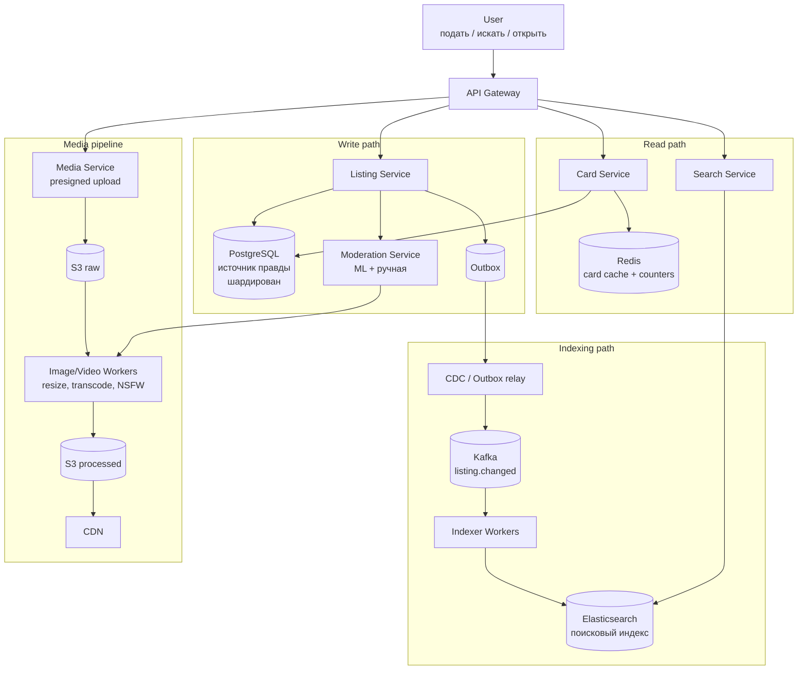

# Avito / Classifieds (доска объявлений)

Разбор задачи "Спроектируй Avito" — классифайд-площадку: доска объявлений, поиск с фасетными фильтрами, загрузка фото/видео, открытие карточек объявлений под highload. Кейс объединяет три ранее разобранных проблемы: **поиск с фильтрами at scale** (Elasticsearch), **медиа-пайплайн** (как [07. YouTube](./07-youtube-video-platform.md)) и **горячее чтение** карточек (кеш + CDN). Дополнительно проверяет умение спроектировать **категорийно-зависимую схему атрибутов** — то, чего нет в "чистом" Twitter/YouTube.

## Содержание
- [Фаза 1: Уточнение требований](#фаза-1-уточнение-требований)
- [Фаза 2: Оценка нагрузки](#фаза-2-оценка-нагрузки)
- [Фаза 3: Высокоуровневый дизайн](#фаза-3-высокоуровневый-дизайн)
  - [Роль каждого компонента](#роль-каждого-компонента)
  - [Сквозные потоки](#сквозные-потоки)
- [Фаза 4: Deep Dive](#фаза-4-deep-dive)
  - [Категории и динамические атрибуты](#категории-и-динамические-атрибуты)
  - [Поиск с фасетными фильтрами](#поиск-с-фасетными-фильтрами)
  - [Гео-поиск](#гео-поиск)
  - [Карточка объявления: горячее чтение](#карточка-объявления-горячее-чтение)
  - [Медиа-пайплайн: фото и видео](#медиа-пайплайн-фото-и-видео)
  - [Счётчик просмотров](#счётчик-просмотров)
  - [Ранжирование и платное продвижение](#ранжирование-и-платное-продвижение)
  - [Модерация и антифрод](#модерация-и-антифрод)
  - [Жизненный цикл объявления](#жизненный-цикл-объявления)
- [Трейдоффы](#трейдоффы)
- [Failure Scenarios](#failure-scenarios)
- [Interview-ready ответ](#interview-ready-ответ-2-минуты)

---

## Фаза 1: Уточнение требований

### Функциональные требования

```
Вопросы:
  - Что именно: подача объявлений + поиск, или весь Avito (чаты, доставка, платежи)?
  - Поиск: полнотекстовый + фильтры? Геопоиск ("рядом со мной")?
  - Фильтры одинаковые для всех или зависят от категории
    (у авто — пробег/год, у квартиры — этаж/площадь)?
  - Медиа: только фото или фото + видео?
  - Платное продвижение объявлений (VAS) в scope?
  - Модерация контента нужна?
```

**Договорились (scope):**
- Подать/редактировать объявление (заголовок, описание, цена, категория, атрибуты, фото/видео)
- Поиск: полнотекстовый + фасетные фильтры + сортировка + гео (город/радиус)
- Открытие карточки объявления (горячее чтение)
- Загрузка и обработка фото/видео
- Категорийно-зависимые атрибуты и фильтры
- Счётчик просмотров
- Ранжирование выдачи + платное продвижение
- Модерация (автоматическая + ручная) и базовый антифрод

**Out of scope:** чат покупатель↔продавец (см. [04. Chat](./04-chat-messaging.md)), платежи и эскроу (см. [11. Payment](./11-payment-system.md)), доставка/логистика, отзывы/рейтинги, рекомендательная ML-лента (упомянём, без deep dive).

### Нефункциональные требования

```
- MAU: 100M пользователей, DAU: 30M
- Активные объявления: 200M одновременно
- Поиск: высокая доля трафика — 50K поисковых запросов/сек (пики ×3)
- Открытие карточек: 150K просмотров/сек
- Подача объявлений: ~5M новых объявлений/день ≈ 60/сек (пики ×10)
- Read:Write ≈ 1000:1 — это read-heavy система, оптимизируем чтение
- Search latency: p99 < 300ms
- Card open latency: p99 < 150ms
- Свежесть индекса: новое/изменённое объявление в поиске < 5 сек
- Availability: 99.95% (поиск и карточка — критичны)
- Картинки/видео: глобальная раздача через CDN
```

**Ключевой вывод фазы:** система read-heavy с доминирующим поиском. Архитектурное ядро — отдельный **поисковый индекс** (Elasticsearch), а не запросы в основную БД. Источник правды (PostgreSQL) и индекс синхронизируются асинхронно.

---

## Фаза 2: Оценка нагрузки

```
Объявления (storage в источнике правды):
  200M активных + архив. Одно объявление ~2 KB (текст + атрибуты + метаданные)
  200M × 2 KB = 400 GB активных. С архивом за годы — единицы TB.
  → шардированный PostgreSQL по seller_id / category

Поисковый индекс (Elasticsearch):
  200M документов. Документ ~3-5 KB (денормализованный: + атрибуты для фасетов)
  200M × 5 KB ≈ 1 TB на primary shard set, ×2 реплики = ~2-3 TB
  → кластер ES на десятки нод, шардирование по гео-региону/категории

Медиа (фото/видео):
  В среднем 5 фото на объявление × несколько размеров (thumb/preview/full)
  5M объявлений/день × 5 фото × ~300 KB (после сжатия, все размеры) ≈ 7.5 TB/день
  Видео — опционально, ~10% объявлений × ~20 MB ≈ 10 TB/день
  → object storage (S3) + CDN, хранение оригинала + транскодов

Трафик чтения:
  150K card opens/sec — карточку отдаём из кеша/CDN, в БД почти не ходим
  50K searches/sec — целиком на ES (не на PostgreSQL!)

Счётчик просмотров:
  150K просмотров/сек × запись = write hotspot
  → нельзя писать в БД на каждый просмотр (см. deep dive)
```

**Выводы, влияющие на архитектуру:**
1. Поиск нельзя обслуживать из реляционной БД — нужен Elasticsearch.
2. Карточку нельзя на каждый просмотр читать из БД — нужен кеш (Redis) + CDN на статику.
3. Счётчик просмотров нельзя инкрементить в БД синхронно — батчинг через Redis/поток.
4. Медиа — отдельный пайплайн с object storage и CDN, не через приложение.

---

## Фаза 3: Высокоуровневый дизайн



### Роль каждого компонента

Главная идея дизайна — **разделение по типу нагрузки** (CQRS-подобное): запись (подача объявлений) и чтение (поиск + карточки) идут разными путями через разные хранилища, оптимизированные под свою задачу. Поэтому компонентов несколько, а не один монолит с одной БД.

**API Gateway** — единая точка входа.
- *Зачем:* терминирует TLS, аутентифицирует пользователя, делает rate limiting (защита от скрейперов поиска — он самый дорогой), маршрутизирует запрос в нужный сервис.
- *Почему отдельно:* сервисы не должны каждый сам заниматься авторизацией и лимитами; на gateway это централизованно. Здесь же — защита от ботов, которые парсят выдачу.

**Listing Service** — владелец жизненного цикла объявления (**write path**).
- *Зачем:* единственный, кто пишет в источник правды. Создание/редактирование/снятие, валидация полей по схеме категории, запуск модерации, запись `outbox`-события в той же транзакции.
- *Почему отдельно от поиска:* запись редкая (~60 rps) и требует ACID и консистентности; чтение частое (200K rps) и требует масштабирования реплик. Их нельзя масштабировать вместе — разные паттерны нагрузки.

**PostgreSQL (Listing DB)** — источник правды.
- *Зачем:* транзакционно и надёжно хранит каноничное состояние объявления. Всё остальное (ES, Redis, CDN) — производные, которые можно перестроить из него.
- *Почему именно он:* нужны транзакции (объявление + outbox атомарно), целостность, и это запись — а не та нагрузка, где реляционка проигрывает. Шардирование по `seller_id`/категории под объём.

**Outbox + CDC relay** — мост из БД в шину событий.
- *Зачем:* гарантировать, что каждое изменение объявления **ровно один раз** превратится в событие, без рассинхрона. Запись в `outbox` идёт в одной транзакции с самим объявлением; отдельный relay (Debezium/чтение WAL) вычитывает её и публикует в Kafka.
- *Почему не писать в Kafka напрямую из сервиса:* dual-write (БД + Kafka двумя вызовами) ломается при падении между ними — в БД есть, в поиске нет. Outbox связывает оба факта одной транзакцией. См. [12. Marketplace Vendor Notifications](./12-marketplace-vendor-notifications.md).

**Kafka (`listing.changed`)** — буфер и развязка между записью и индексацией.
- *Зачем:* развязать скорость записи от скорости индексации. Всплеск подач (×10) не должен ронять ES — события копятся в топике, Indexer разбирает в своём темпе. Плюс несколько потребителей одного события (индексатор, аналитика, кеш-инвалидатор).
- *Почему очередь:* при отказе ES события не теряются (retention), индексация догонит после восстановления.

**Indexer Workers** — материализуют поисковый индекс. Это **свой сервис** (consumer Kafka), а не компонент ES: Elasticsearch сам ничего не тянет из БД/Kafka. Самопис vs готовые коннекторы (Kafka Connect/Debezium) и Bulk API — в доке [как данные попадают в индекс](../../06-databases/database-systems-catalog/09-elasticsearch-and-opensearch.md).
- *Зачем:* читают `listing.changed`, обогащают (подтягивают схему атрибутов категории, гео, boost), денормализуют в ES-документ и пишут в Elasticsearch. Здесь же — фильтрация по `status`: в индекс попадают только `active`.
- *Почему отдельный шаг:* форма данных для записи (нормализованный JSONB) ≠ форма для поиска (денормализованный плоский документ с типизированными полями под фасеты). Воркеры — место этой трансформации, масштабируются по партициям Kafka.

**Elasticsearch** — поисковый движок (**read path для поиска**). Профильный док: [Elasticsearch / OpenSearch](../../06-databases/database-systems-catalog/09-elasticsearch-and-opensearch.md).
- *Зачем:* единственный, кто умеет фасетные фильтры + facet counts + морфологию + гео на 200M документов под 50K rps. Реляционка так не может.
- *Почему производный, а не источник правды:* ES может терять/перестраиваться; каноничное состояние — в PostgreSQL, ES всегда можно переиндексировать.

**Search Service** — фасад над Elasticsearch.
- *Зачем:* превращает пользовательский запрос (текст + выбранные фильтры + сортировка + страница) в ES-запрос, применяет бизнес-правила ранжирования, отдаёт список + facet counts для UI.
- *Откуда краткие карточки выдачи:* из самого Elasticsearch. Документ денормализован и уже содержит поля для строки результата (`title`, `price`, `city`, URL превью, `created_at`) — Search Service рендерит выдачу из `_source` найденных документов, **без второго чтения** в БД. Это и есть смысл денормализации в индекс: выдача не делает N дополнительных запросов. Полную карточку (всё описание, все фото, продавец) отдаёт уже Card Service при открытии объявления — это отдельный путь.
- *Почему отдельно от ES:* клиент не должен знать о структуре индекса; здесь же — кеш популярных запросов, защита от тяжёлых запросов, A/B ранжирования.

**Card Service** — отдаёт полную карточку (**read path для открытия**).
- *Зачем:* обслуживает 150K открытий/сек через Redis (cache-aside), в PostgreSQL ходит только при промахе. Метаданные отдаёт сам, а тяжёлую статику (фото/видео) — ссылками на CDN.
- *Почему отдельно от Search:* разные паттерны — поиск это агрегации по многим документам, карточка это точечное чтение одного по ID. Разные кеши, разное масштабирование.

**Redis** — кеш карточек и счётчиков. Профильные доки: [Redis как кэш](../../06-databases/caching/01-redis-as-cache.md) (cache-aside, hot key) и [Redis: реальные сценарии](../../06-databases/database-systems-catalog/08a-redis-real-scenarios.md) (счётчики, HLL).
- *Зачем:* снять 150K rps чтения карточек с PostgreSQL (cache-aside, TTL) и принять инкременты просмотров (INCR + async flush) вместо записи в БД на каждый просмотр.
- *Почему он:* sub-millisecond чтение и атомарные счётчики — ровно то, что нужно горячему read-пути.

**Moderation Service** — допуск контента в публикацию.
- *Зачем:* автоматическая проверка (текст, фото через ML, дубли, антифрод) + очередь ручной модерации. Решает, перейдёт ли объявление в `active` (и попадёт ли в индекс).
- *Почему отдельно:* модерация эволюционирует независимо (новые ML-модели, правила), не должна блокировать релиз Listing Service; тяжёлые проверки идут асинхронно.

**Promotion Service** — платные услуги продвижения (VAS).
- *Зачем:* хранит покупки продвижения как `promotion{listing_id, type, active_until}`, эмитит событие на (пере)индексацию, чтобы Indexer пересчитал `boost_score`. Протухание промо — через sweeper-джобу/`function_score`, а не доверием к таймеру (детали в разделе «Ранжирование и платное продвижение»).
- *Почему отдельно:* биллинг/каталог тарифов и сроки действия — отдельный домен; не должен смешиваться с подачей объявлений и индексацией.

**Media Service + S3 + Workers + CDN** — медиа-пайплайн. Профильные доки: [AWS: S3 и presigned URLs](../../10-devops-and-observability/cloud/01-aws-core-services.md) (механика подписи, PUT vs POST) и [File Upload Flow](../external-request-flows/05-file-upload-and-background-processing-flow.md) (паттерн целиком).
- *Media Service* выдаёт presigned URL — клиент грузит файл **напрямую в S3**, минуя приложение (не прокачиваем терабайты трафика через сервис).
- *S3 raw* — сырые загрузки; *Workers* — resize/transcode/NSFW/EXIF-strip; *S3 processed* — готовые варианты; *CDN* — глобальная раздача с краёв сети, разгрузка origin.
- *Почему так:* файлы — это объём и латентность; их обработка (фоновая, идемпотентная, масштабируемая воркерами) и раздача (CDN) принципиально отличаются от логики объявлений и не должны её нагружать.

### Сквозные потоки

**1. Подача / редактирование объявления (write path):**
```
Клиент → Gateway (auth, rate limit) → Listing Service
  Listing Service в ОДНОЙ транзакции PostgreSQL:
    INSERT/UPDATE listing
    INSERT outbox_event (listing.changed)
  → запускает модерацию (Moderation Service)
  → CDC relay читает outbox → публикует в Kafka
  → Indexer обогащает + денормализует → пишет в Elasticsearch (status=active)
Итог: запись атомарна и надёжна; поиск догоняет eventual (< 5 сек).
```

**2. Поиск с фильтрами (read path):**
```
Клиент → Gateway → Search Service
  строит bool-запрос: must(текст) + filter(категория, цена, атрибуты, гео)
  + aggs (facet counts) + sort (boost_score, _score) + search_after
  → Elasticsearch
  → краткие карточки берутся из _source найденных документов (денормализованы:
    title, price, city, превью-URL) + счётчики фасетов для UI
Итог: вся нагрузка на ES, PostgreSQL не задействован; выдача без доп. чтений.
```

**3. Открытие карточки (read path):**
```
Клиент → Gateway → Card Service
  GET listing:{id} в Redis
    hit  → отдать
    miss → SELECT из PostgreSQL → записать в Redis (TTL) → отдать
  карточка содержит CDN-URL медиа → браузер тянет фото/видео напрямую с CDN
  параллельно: INCR views:{id} в Redis (счётчик, без записи в БД)
Итог: 150K rps обслуживаются кешем и CDN, БД почти не трогается.
```

**4. Загрузка медиа:**
```
Клиент → Media Service: запрос presigned URL
  Клиент → S3 raw НАПРЯМУЮ (минуя приложение)
  S3 event → Kafka → Worker: resize/transcode + NSFW + EXIF-strip → S3 processed
  CDN раздаёт processed
  media_id привязывается к объявлению (до готовности — статус processing)
Итог: трафик файлов не идёт через сервисы; обработка асинхронна и идемпотентна.
```

---

## Фаза 4: Deep Dive

### Категории и динамические атрибуты

**Почему это центральная проблема Avito (а не Twitter/YouTube):** фильтры зависят от категории. У авто — `пробег`, `год`, `КПП`; у квартиры — `этаж`, `площадь`, `количество комнат`; у телефона — `память`, `состояние`. Фиксированная таблица колонок не подходит — категорий тысячи, атрибутов десятки тысяч.

**Вариант A — EAV (Entity-Attribute-Value):**
```sql
CREATE TABLE listing_attributes (
  listing_id  BIGINT,
  attr_id     INT,        -- ссылка на справочник атрибутов
  value_text  TEXT,
  value_num   NUMERIC,    -- для диапазонных фильтров (цена, пробег)
  PRIMARY KEY (listing_id, attr_id)
);
```
- (+) гибко, новые атрибуты без миграций
- (−) фильтрация по нескольким атрибутам в SQL — кошмар (множество self-join), не масштабируется

**Вариант B — JSONB в PostgreSQL:**
```sql
ALTER TABLE listings ADD COLUMN attrs JSONB;
-- {"mileage": 80000, "year": 2018, "gearbox": "automatic"}
CREATE INDEX idx_listings_attrs ON listings USING GIN (attrs);
```
- (+) гибко, один документ, GIN-индекс для contains-запросов
- (−) диапазонные фильтры (`mileage BETWEEN`) по JSONB медленные на больших объёмах

**Решение (реальное): источник правды + денормализация в ES.**
```
PostgreSQL хранит attrs как JSONB (источник правды, гибкость).
Elasticsearch — целевой движок фильтрации: денормализуем атрибуты в поля документа.

Схема атрибутов задаётся per-category в справочнике (Category Schema Service):
  category "Автомобили":
    - mileage:  numeric, фильтр-диапазон, фасет
    - year:     numeric, фильтр-диапазон, фасет
    - gearbox:  enum,    фильтр-terms,  фасет
    - vin:      text,    не фильтруется

Indexer читает схему категории и кладёт атрибуты в типизированные ES-поля
(или в nested-объект attrs.* с маппингом по типу).
```

**Маппинг в Elasticsearch (типизированные поля под фильтры):**
```json
{
  "listing_id": 12345,
  "title": "BMW 320i 2018",
  "category_id": 101,
  "price": 1800000,
  "city_id": 1,
  "location": { "lat": 55.75, "lon": 37.61 },
  "created_at": "2026-06-10T10:00:00Z",
  "boost_score": 1.4,
  "attrs": {
    "mileage": 80000,
    "year": 2018,
    "gearbox": "automatic"
  }
}
```
Справочник категорий и схема атрибутов — отдельный сервис, кешируется агрессивно (меняется редко). Клиент по `category_id` получает список доступных фильтров и строит UI динамически.

---

### Поиск с фасетными фильтрами

> Расшифровка терминов **морфология / фасеты / facet counts** — в профильном доке
> [Elasticsearch: ключевые понятия](../../06-databases/database-systems-catalog/09-elasticsearch-and-opensearch.md) (раздел «Ключевые понятия: морфология, фасеты, facet counts»).

**Почему Elasticsearch, а не PostgreSQL:**
```
Требования к поиску:
  - Полнотекст по заголовку/описанию с морфологией (русский язык, стемминг)
  - Фасетные фильтры: цена-диапазон + категорийные атрибуты + гео
  - Facet counts: "Автомат (1240)", "Механика (430)" — счётчики по каждому фильтру
  - Сортировка: релевантность / цена / дата / расстояние
  - 50K запросов/сек

PostgreSQL FTS:
  - тянет морфологию, но фасет-каунты на 200M строк × 50K rps — нереалистично
  - агрегации (facet counts) на лету = full scan по фильтрам

Elasticsearch:
  - инвертированный индекс + doc_values для агрегаций
  - aggregations дают facet counts за один запрос
  - bool query: must (текст) + filter (атрибуты, кешируется) + sort
```

**Структура запроса:**
```json
{
  "query": {
    "bool": {
      "must":   { "match": { "title": "bmw 320" } },
      "filter": [
        { "term":  { "category_id": 101 } },
        { "range": { "price": { "lte": 2000000 } } },
        { "range": { "attrs.year": { "gte": 2015 } } },
        { "term":  { "attrs.gearbox": "automatic" } },
        { "geo_distance": { "distance": "50km", "location": { "lat": 55.75, "lon": 37.61 } } }
      ]
    }
  },
  "aggs": {
    "gearbox_facet": { "terms": { "field": "attrs.gearbox" } },
    "year_facet":    { "histogram": { "field": "attrs.year", "interval": 1 } }
  },
  "sort": [ { "boost_score": "desc" }, { "_score": "desc" } ],
  "from": 0, "size": 30
}
```

**Почему `filter`, а не `must` для атрибутов:** clause в `filter` не считает релевантность (scoring) и **кешируется** Elasticsearch (filter cache) — повторные «Москва + Автомобили + Автомат» отдаются мгновенно. `must` нужен только для текстового скоринга.

**Пагинация:** не `from/offset` глубоко (деградирует на больших страницах — deep pagination), а `search_after` по `[boost_score, listing_id]` — cursor-based, стабильная.

**Шардирование ES:** по гео-региону или категории. Большинство запросов содержат `city`/`region` → routing по региону позволяет бить только в нужные шарды, а не во весь кластер.

---

### Гео-поиск

```
Сценарии:
  - "Квартиры в Москве" → фильтр по city_id (term, дёшево)
  - "В радиусе 10 км от меня" → geo_distance
  - сортировка по расстоянию → geo_distance sort

Elasticsearch geo_point + geo_distance — встроенный механизм:
  - индексация координат как geo_point (BKD-дерево)
  - фильтр geo_distance + сортировка по расстоянию

Альтернатива при экстремальной нагрузке — гео-хеши (geohash / H3, см. кейс 06 Uber):
  предвычислять geohash-префиксы как term-фильтры (дешевле, чем geo_distance).
  Но для классифайда city_id + geo_distance в ES обычно достаточно.
```
Чаще всего пользователь сначала выбирает город (грубый term-фильтр сокращает выборку в сотни раз), и только потом — радиус. Поэтому `city_id` — первый и самый дешёвый фильтр.

---

### Карточка объявления: горячее чтение

**Проблема:** 150K открытий/сек. Бить в PostgreSQL на каждое открытие нельзя.

```
Card Service — cache-aside (Redis):
  1. GET listing:{id} в Redis
  2. hit  → отдать (TTL 5-10 мин)
  3. miss → SELECT из PostgreSQL → SET в Redis → отдать

Что в кеше: денормализованная карточка (заголовок, описание, цена,
  атрибуты, ссылки на медиа в CDN, продавец-краткое). Один JSON.

Статика (фото/видео) НЕ проходит через приложение:
  карточка содержит CDN-URL → браузер тянет напрямую с CDN.

Инвалидация: при редактировании/снятии — DEL listing:{id}
  (через то же событие listing.changed, что и для индексатора).
```

#### Кэш в Redis: что включить для Avito

Карточка — классический cache-aside; общие приёмы и Go-код вынесены в профильный док [Redis как кэш](../../06-databases/caching/01-redis-as-cache.md). Здесь — что критично именно под эту нагрузку:

- **Значение** — денормализованная карточка одним blob (String), сериализация [MessagePack/Protobuf](../../06-databases/caching/01-redis-as-cache.md) (память дорогая при 200M объявлений);
- **TTL с джиттером** — иначе синхронное истечение пачки ключей даёт залп в PostgreSQL ([cache stampede](../../06-databases/caching/01-redis-as-cache.md));
- **single-flight / distributed lock** на перестройку популярного ключа при промахе;
- **negative caching** снятых/несуществующих id — боты перебирают id, короткий TTL гасит их до БД;
- **hot listing** (вирусное объявление) — это [горячий ключ](../../06-databases/caching/01-redis-as-cache.md): локальный in-process LRU перед Redis + при необходимости реплики/key splitting;
- **eviction** `allkeys-lfu` — кеш держит реально популярные карточки.

---

### Медиа-пайплайн: фото и видео

Архитектурно повторяет [07. YouTube](./07-youtube-video-platform.md), упрощённо для фото и адаптировано под объявления.

> Как именно presigned URL даёт клиенту грузить напрямую в S3 минуя backend (механика подписи, PUT vs POST, детект завершения) — в доке [AWS: presigned URLs](../../10-devops-and-observability/cloud/01-aws-core-services.md) и [File Upload Flow](../external-request-flows/05-file-upload-and-background-processing-flow.md).

```
Upload (фото):
  1. Клиент → Media Service: POST /media/upload-url (получить presigned S3 URL)
  2. Клиент грузит файл НАПРЯМУЮ в S3 (минуя приложение — не нагружаем сервис)
  3. S3 event / клиент-коллбэк → Kafka topic media.uploaded
  4. Image Worker:
       - валидация (формат, размер, EXIF strip — приватность)
       - resize в набор размеров: thumb (200px), preview (600px), full (1280px)
       - WebP/AVIF для современных браузеров + JPEG fallback
       - NSFW / запрещённый контент: ML-классификатор (модерация)
       - кладёт обработанные в S3 (processed bucket)
  5. CDN раздаёт обработанные с processed bucket

Upload (видео):
  - chunked / resumable upload (как YouTube)
  - транскод FFmpeg: 480p/720p, генерация постера (poster frame)
  - HLS для адаптивного воспроизведения (опционально)
```

**Связь медиа с объявлением:** объявление публикуется со ссылками на `media_id`. До завершения обработки медиа — статус `processing`, объявление можно показать с плейсхолдером или придержать публикацию до готовности (продуктовое решение). EXIF-геоданные вырезаются обязательно — иначе утечка адреса продавца.

---

### Счётчик просмотров

**Проблема:** 150K просмотров/сек × `UPDATE listings SET views = views+1` = write hotspot, блокировки строк, деградация БД.

```
Решение — батчинг через Redis:
  На просмотр:  INCR views:{listing_id}   (атомарно, in-memory, дёшево)
  Дедуп "уникальные просмотры":
    PFADD views_hll:{listing_id} {user_id|ip}  (HyperLogLog — память O(1) на айтем)

  Async flush каждые 30-60 сек:
    собрать дельты из Redis → batch UPDATE в PostgreSQL → обнулить дельты
    (либо писать поток просмотров в Kafka → агрегация во Flink → БД)

Отображение в карточке: views = БД-значение + текущая Redis-дельта.

Потеря при падении Redis: счётчик не финансовый — допустима небольшая
  неточность (eventual). Для точной аналитики — отдельный event-stream в Kafka.
```
Это тот же паттерн, что лайки в [08. Twitter](./08-twitter-social-feed.md): Redis INCR + периодический flush. Реализация с кодом (GETDEL для атомарного слива дельты, HLL для уникальных) — в доке [Redis: счётчики и аналитика](../../06-databases/database-systems-catalog/08a-redis-real-scenarios.md).

---

### Ранжирование и платное продвижение

```
Что влияет на порядок выдачи (boost_score):
  - релевантность тексту (_score из ES)
  - свежесть (freshness decay — новое выше)
  - качество объявления (есть фото, заполнены атрибуты, рейтинг продавца)
  - платное продвижение (VAS): "поднять", "XL", "до 10 раз больше просмотров"

Реализация:
  boost_score — числовое поле в ES-документе, пересчитывается:
    - при подаче/редактировании (качество, фото)
    - при покупке продвижения (boost множитель на TTL)
    - фоновой джобой (freshness decay со временем)

  sort: [ boost_score desc, _score desc ]
  либо function_score: совмещение текстового score с boost-факторами.

Платные услуги (VAS) — отдельный Promotion Service:
  покупка → строка promotion{listing_id, type, active_until}
  → событие → Indexer ПЕРЕСЧИТЫВАЕТ boost_score (не дельта!) с учётом активного продвижения.
```

**boost_score — производное, а не дельта.** Indexer не «прибавляет/убавляет», а пересчитывает значение целиком из входов: качество + свежесть + есть ли сейчас активное продвижение. Идемпотентно, согласуется с его ролью денормализатора.

**Как продвижение протухает** (нельзя полагаться на «таймер выстрелит ровно в `active_until`» — на миллионах промо таймеры теряются):
- **Sweeper-джоба (надёжный backstop):** периодически спрашивает Promotion Service, какие промо истекли с прошлого прогона → эмитит `listing.changed` на эти `listing_id` → Indexer пересчитывает `boost_score` уже без продвижения. Батчево, идемпотентно, переживает рестарты. Та же механика, что `expired` в жизненном цикле объявления.
- **Отложенное событие при покупке:** запланировать `promotion.expired` на `active_until` (delayed-сообщение). Проще, но в одиночку хрупко — как дополнение к sweeper, не вместо.
- **Query-time (чистый вариант для time-bound буста):** хранить в документе `promo_until` (timestamp), а буст применять на запросе через `function_score` (`now() < promo_until`). Тогда продвижение само перестаёт действовать — ES переиндексировать не надо; цена — тяжелее scoring.

На практике часто комбинируют: дешёвый `boost_score` в документе для сортировки + sweeper как страховка.

Важно для интервью: продвижение **не** должно полностью ломать релевантность (продвинутый утюг не показывают по запросу «автомобиль»). Boost применяется внутри уже отфильтрованной по категории/тексту выборки.

---

### Модерация и антифрод

```
Поток модерации (до или сразу после публикации):
  1. Автомат (синхронно/быстро):
     - текст: запрещённые слова, контакты в обход платформы, спам-паттерны
     - фото: NSFW-классификатор, water-mark/stock-detection, дубли (perceptual hash)
     - правила категории (цена-выброс, подозрительные атрибуты)
  2. ML-скоринг риска → low/medium/high
     - low   → публикуется сразу
     - medium→ публикуется, ставится в очередь ручной проверки
     - high  → придерживается до ручной модерации

Антифрод:
  - дубли объявлений: perceptual hash фото + шингл текста → дедуп/бан
  - мошеннические продавцы: граф связей (телефон, устройство, IP, карта)
  - аномалии: резкий всплеск объявлений с одного аккаунта → rate limit + ревью
```
Связь с индексацией: объявление попадает в Elasticsearch только после прохождения модерации (статус `active`). `pending`/`rejected` в поиске не видны — это управляется фильтром по `status` при индексации, а не на стороне запроса.

---

### Жизненный цикл объявления

```
draft → pending_moderation → active → (archived | sold | rejected | expired)

active:   в индексе, ищется и открывается
sold/archived/expired: убирается из активного индекса
  (либо отдельный индекс архива для "проданных" историй)
expired:  TTL объявления (например 30 дней) → авто-архивация фоновой джобой

Каждый переход → событие listing.changed → синхронизация ES и инвалидация кеша.
```
Архив не держим в горячем ES-кластере — выносим в отдельный (или в холодное хранилище), чтобы не раздувать индекс активных 200M объявлений.

---

## Трейдоффы

| Компонент | Выбор | Альтернатива | Причина |
|---|---|---|---|
| Поиск/фильтры | Elasticsearch | PostgreSQL FTS | Фасет-каунты + морфология + 50K rps |
| Источник правды | PostgreSQL (шард) | сразу в ES | ACID, транзакции, ES — производный индекс |
| Атрибуты | JSONB + денорм в ES | EAV / фикс. колонки | Гибкость per-category без миграций |
| Синхронизация PG→ES | Outbox + Kafka | dual-write | Без рассинхрона при сбое (atomic с транзакцией) |
| Карточка | Redis cache-aside | прямой SELECT | 150K rps, read-heavy |
| Медиа upload | presigned S3 (direct) | через приложение | Не нагружаем сервис трафиком файлов |
| Раздача медиа | CDN | из object storage | Глобальная latency, разгрузка origin |
| Просмотры | Redis INCR + flush | UPDATE на просмотр | Write hotspot |
| Гео | ES geo_point + city_id | PostGIS | Уже в поисковом движке, не нужен второй стор |
| Пагинация | search_after (cursor) | from/offset | Deep pagination деградирует |

### Почему Outbox, а не dual-write
```
Dual-write (записать в PostgreSQL И в Kafka/ES напрямую):
  если упало между записями → рассинхрон (в БД есть, в поиске нет)

Outbox:
  в одной транзакции PostgreSQL: INSERT listing + INSERT outbox_event
  отдельный relay (CDC, напр. Debezium) читает outbox/WAL → Kafka → Indexer
  → ровно одна транзакция определяет факт; индекс догоняет eventual
```
Тот же паттерн, что в [12. Marketplace Vendor Notifications](./12-marketplace-vendor-notifications.md).

---

## Failure Scenarios

```
Elasticsearch недоступен (поиск лежит):
  - degrade: отдать кеш популярных запросов (Redis) / последнюю выдачу категории
  - карточка по прямой ссылке всё ещё открывается (Card Service не зависит от ES)
  - reindex из PostgreSQL после восстановления (источник правды цел)

Indexer отстаёт (лаг Kafka):
  - объявления появляются в поиске с задержкой — деградация свежести, не потеря
  - мониторить consumer lag; масштабировать воркеры по партициям

Redis (card cache) упал:
  - cache-aside fallback в PostgreSQL → рост latency, но работает
  - риск: 150K rps хлынут в БД (cache stampede) → защита:
    request coalescing (single-flight) + локальный кеш на инстансах

Media Worker упал / очередь растёт:
  - фото в статусе processing, объявление с плейсхолдером
  - at-least-once: сообщение в Kafka, воркер догонит после рестарта
  - идемпотентность по media_id (повторная обработка перезапишет тот же объект)

Рассинхрон PG↔ES:
  - периодический reconcile-job: сверка checksum выборок PG vs ES → переиндексация дельты
```

---

## Interview-ready ответ (2 минуты)

> "Avito — read-heavy классифайд: доминирует поиск (50K rps) и открытие карточек (150K rps), при 200M активных объявлений. Поэтому я с самого начала разделяю источник правды и поисковый движок.
>
> Источник правды — шардированный PostgreSQL. Атрибуты объявлений храню в JSONB, потому что фильтры зависят от категории: у авто пробег/год, у квартиры этаж/площадь — фиксированные колонки тут не работают. Схему атрибутов задаю per-category в справочнике.
>
> Поиск — Elasticsearch. Денормализую атрибуты в типизированные поля документа: фасетные фильтры + facet counts + морфология + гео. Атрибуты кладу в `filter`-clause — без скоринга и с кешированием. Синхронизация PostgreSQL → ES через Outbox + Kafka + Indexer, чтобы не было рассинхрона. Пагинация — search_after, не offset.
>
> Карточку под 150K rps отдаю из Redis (cache-aside), статику — фото/видео — с CDN, минуя приложение. Загрузка медиа: клиент грузит напрямую в S3 по presigned URL, воркеры делают resize/transcode, NSFW-модерацию и вырезают EXIF.
>
> Счётчик просмотров — Redis INCR + async flush, иначе write hotspot. Ранжирование — поле boost_score (релевантность + свежесть + платное продвижение). Модерация: автоматика (ML по фото/тексту) + ручная очередь; в индекс попадают только active-объявления.
>
> Если ES падает — карточки по прямым ссылкам живут, а индекс восстанавливается из PostgreSQL как источника правды."
