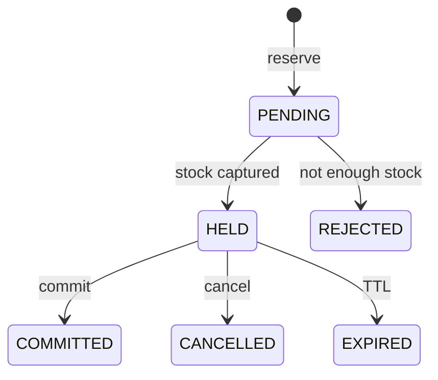
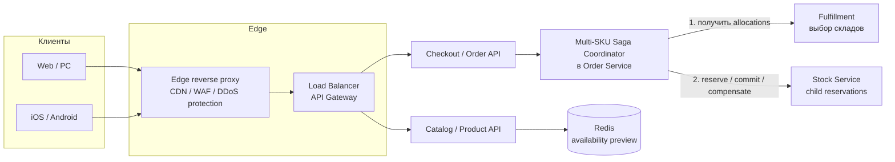
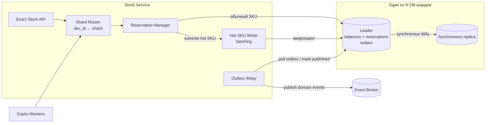
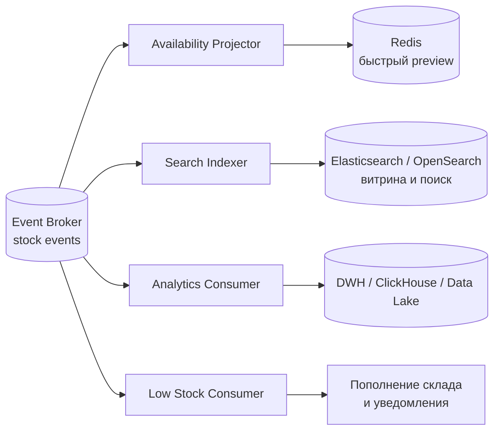

# Stock / Inventory Service — interview case

## Содержание

- [Что проверяет задача](#что-проверяет-задача)
- [Фаза 1: уточнение требований](#фаза-1-уточнение-требований)
- [Фаза 2: числа, которые определяют дизайн](#фаза-2-числа-которые-определяют-дизайн)
- [Ключевая концепция: модель остатков](#ключевая-концепция-модель-остатков)
- [Фаза 3: высокоуровневый дизайн](#фаза-3-высокоуровневый-дизайн)
- [Фаза 4: deep dive](#фаза-4-deep-dive)
- [Сквозные сценарии](#сквозные-сценарии)
- [Отказы и пограничные случаи](#отказы-и-пограничные-случаи)
- [Трейдоффы](#трейдоффы)
- [Фаза 5: финал](#фаза-5-финал)
- [Interview-ready ответ](#interview-ready-ответ-2-минуты)
- [Разбор по вопросам](#разбор-по-вопросам)
- [Связанные материалы](#связанные-материалы)

Практический разбор задачи для 45–60-минутного system design interview.
Цель — показать ход рассуждения, а не спроектировать production-систему до
последней таблицы и метрики.

Подробные расчёты, альтернативы и эксплуатационные нюансы вынесены в
[расширенный design document](./14.1-stock-inventory-service.md).

## Что проверяет задача

В условии есть несколько сигналов:

| Признак | Архитектурный ход | Цена |
| --- | --- | --- |
| Нельзя резервировать закончившийся товар | Условная атомарная запись | Записи одного ключа сериализуются |
| Остаток должен быть актуальным | Точный read с leader | Leader получает критичную read-нагрузку |
| Витринных чтений много | Отдельная асинхронная проекция | Число на карточке может отставать |
| Retry не должен удваивать резерв | Idempotency в транзакции balance-шарда | Нужно хранить ключ, hash и результат |
| Один SKU получает экстремальный пик | Считать capacity строки и шарда | Нужен отдельный hot path |
| Корзина пересекает шарды | Дочерние резервы + saga | Временно возможны partial holds |

На интервью достаточно выбрать два deep dive:

1. Как доказать отсутствие overselling.
2. Как обслужить hot SKU, не перегрузив весь шард.

## Фаза 1: уточнение требований

### Что спросить

```text
1. Остаток нужен по складу или суммарно по всем складам?
2. Кто выбирает склад: Stock Service или Fulfillment Service?
3. Один SKU можно разделить между несколькими складами?
4. Корзина из нескольких SKU должна резервироваться "всё или ничего"?
5. Есть ли TTL у резерва?
6. Что означает commit: продажу и физическое списание?
7. Разрешены ли backorder и отрицательный остаток?
8. Один регион или глобальное active-active развёртывание?
```

### Зафиксированный scope

- физических складов много;
- Fulfillment Service выбирает склады по адресу, сроку и стоимости доставки;
- один stock-резерв относится к одному SKU, но может содержать несколько
  складских распределений;
- разные SKU заказа резервируются дочерними операциями;
- `reserve` создаёт hold, `commit` списывает товар, `cancel` освобождает hold;
- TTL выбирается серверной политикой;
- backorder запрещён;
- рабочий регион один, внутри него несколько зон доступности.

### Контракт

```text
Correctness:
  успешный reserve возможен только при available >= quantity

Consistency:
  точные операции линеаризуемы для одного SKU

Durability:
  подтверждённый резерв переживает отказ одного узла

Availability:
  99,99% в принятой модели отказов

Latency:
  p99 < 200 мс для exact get / reserve / commit / cancel
```

При потере кворума сервис возвращает `503`, а не отвечает по устаревшей копии.
Это осознанный fail-closed выбор ради корректности.

## Фаза 2: числа, которые определяют дизайн

Чисел в условии нет, поэтому на интервью их нужно согласовать. Например:

```text
Каталог:
  50 млн SKU × 4 склада = 200 млн balance-строк

Обычный пик:
  5 000 заказов/с
  3 SKU в заказе
  5 000 × 3 = 15 000 резервов SKU/с

Multi-warehouse:
  в среднем 1,2 складской строки на SKU
  15 000 × 1,2 = 18 000 balance mutations/с на reserve

Commit/cancel:
  ещё примерно 18 000 balance mutations/с

Итого:
  около 36 000 balance mutations/с

Чтение:
  до 15 000 точных get-stock/с для checkout/Fulfillment
  50 000 preview/с для каталога — не с leader

Hotspot:
  до 10 000 успешных mutations/с на один SKU
```

### Сколько DB-шардов

Допустим, нагрузочный тест полной транзакции с синхронной репликацией даёт:

```text
raw capacity шарда = 5 000 mutations/с
рабочая загрузка 60% = 3 000 mutations/с

ceil(36 000 / 3 000) = 12 шардов
запас ×2 = 24 физических DB-шарда
```

Это пример метода расчёта. Настоящее число определяется benchmark, размером
данных, временем восстановления и mixed read/write workload.

Главный вывод: в этом примере `3 000 mutations/с` — безопасный бюджет не одной
таблицы, а суммы всех операций и buckets, оставшихся на этом шарде.

## Ключевая концепция: модель остатков

Для каждого `(sku_id, warehouse_id)`:

```text
on_hand   — физически найдено на складе
reserved  — удерживается живыми резервами
available = max(on_hand - reserved, 0)
shortage  = max(reserved - on_hand, 0)
```

Обычный жизненный цикл:

```text
Исходно:
  on_hand=10, reserved=3, available=7

reserve(2):
  on_hand=10, reserved=5, available=5

commit(2):
  on_hand=8, reserved=3, available=5

cancel(2) вместо commit:
  on_hand=10, reserved=3, available=7
```

`commit` не меняет `available`: товар исключён из продажи ещё при `reserve`.



## Фаза 3: высокоуровневый дизайн

### Контекст системы



`Cloudflare / Edge`, load balancer и API Gateway — логические роли, а не
обязательно три отдельных продукта. Edge защищает публичный периметр, но
конечные клиенты не обращаются к Stock Service напрямую: резерв инициирует
Checkout. Saga Coordinator получает от Fulfillment распределение по складам,
создаёт в Stock по одному child reservation на SKU и отменяет уже созданные
holds при частичном отказе.

### Внутри Stock Service



На схеме показан один выбранный шард. В системе их `N`; `Shard Router`
направляет конкретный `sku_id` ровно в один из них. У каждого шарда собственные
leader, synchronous replica и одинаковый набор таблиц.

PostgreSQL не отправляет события самостоятельно. `Reservation Manager`
фиксирует изменение balance и domain event в `outbox` одной транзакцией, а
`Outbox Relay` читает неопубликованные строки, отправляет их в broker и
записывает результат публикации. Relay может быть отдельным процессом, но
логически принадлежит Stock Service.

Redis здесь не является источником истины. Он хранит асинхронную витринную
проекцию для каталога, поэтому его отсутствие или отставание не влияет на
корректность `reserve`: точные чтения и все mutations идут в leader выбранного
DB-шарда.

### Для чего нужен Event Broker

Stock Service сохраняет изменение остатка и запись в `outbox` одной
DB-транзакцией. Outbox relay публикует событие в broker уже после commit, а
несколько независимых потребителей строят свои представления данных:



Примеры событий:

```text
StockReserved
ReservationCommitted
ReservationCancelled
ReservationExpired
StockAdjusted
StockBecameUnavailable
StockBecameAvailable
```

Broker нужен для асинхронного распространения изменений, но не участвует в
решении о резерве. Redis, поисковый индекс и аналитика могут отставать или
временно быть недоступны — Stock Service всё равно фиксирует корректный
результат в своей БД.

Доставка событий обычно `at-least-once`, поэтому каждый consumer дедуплицирует
их по `event_id`. События одного `sku_id` отправляются в одну partition, если
для конкретной проекции важен их порядок.

### Роли компонентов

| Компонент | Роль |
| --- | --- |
| Edge reverse proxy / CDN / WAF | Защищает публичный периметр от DDoS и может кешировать статический контент |
| Load Balancer / API Gateway | Распределяет внешний трафик, маршрутизирует API, применяет auth и rate limits |
| Checkout / Order API | Принимает пользовательскую команду и запускает оформление заказа |
| Multi-SKU Saga Coordinator | Координирует child reservations и выполняет компенсацию при частичном отказе |
| Fulfillment | Выбирает физические склады; Stock повторно проверяет остаток |
| Stock API | Даёт exact read и меняет жизненный цикл резерва |
| DB Shard Router | Находит технический шард по `sku_id`; склад не выбирает |
| Reservation Manager | Выполняет balance, reservation и outbox одной транзакцией |
| Outbox Relay | Читает сохранённые domain events и публикует их в broker |
| DB leader + sync replica | Источник истины и RPO=0 в принятой модели отказа |
| Hot SKU Writer | Микропакетами уменьшает число sync commits и balance updates |
| Expiry Workers | Освобождают просроченные holds через `SKIP LOCKED` |
| Event Broker | Рассылает stock events независимым асинхронным потребителям |
| Availability Projector + Redis | Обслуживает приблизительные чтения витрины; не участвует в решении о reserve |
| Search Indexer + Elasticsearch | Обновляет фильтры и наличие в поиске; не подтверждает возможность покупки |
| Analytics Consumer | Загружает историю изменений в аналитическое хранилище |

### Два read-контракта

```text
Exact Stock API:
  клиенты: Checkout, Fulfillment
  источник: leader
  гарантия: линеаризуемое чтение
  SLO: p99 < 200 мс

Availability Preview:
  клиенты: каталог, поиск, карточка товара
  источник: кеш / проекция
  гарантия: приблизительное значение с as_of
  пример SLO: p99 < 50 мс, freshness < 2 с
```

Витрина может показать «в наличии», а конкурентный `reserve` вернуть
`OUT_OF_STOCK`. Это допустимо только для preview; Exact Stock API обязан
вернуть канонический balance.

## Фаза 4: deep dive

### 4.1 Корректный резерв

#### API

Один SKU можно разделить между физическими складами:

```http
POST /v1/stocks/sku-100/reservations
Idempotency-Key: checkout-789-line-1
```

```json
{
  "order_id": "order-789",
  "allocations": [
    {"warehouse_id": 42, "quantity": 2},
    {"warehouse_id": 77, "quantity": 1}
  ],
  "reservation_policy": "CHECKOUT"
}
```

Все склады одного SKU хранятся на одном DB-шарде. Физический склад и DB-шард —
разные сущности.

#### Минимальная модель данных

```text
stock_balances:
  (sku_id, warehouse_id) → on_hand, reserved, state, version

reservations:
  reservation_id, sku_id, status, idempotency_key,
  request_hash, expires_at

reservation_allocations:
  reservation_id, warehouse_id, quantity

outbox:
  event_id, aggregate_id, event_type, payload
```

Idempotency — не отдельное хранилище перед routing. Сначала `sku_id` определяет
шард, затем уникальный ключ фиксируется в `reservations` в той же транзакции,
что и balance.

#### Защита от overselling

Опасный вариант:

```text
T1: SELECT available → 1
T2: SELECT available → 1
T1: reserved += 1
T2: reserved += 1
```

Правильный вариант объединяет проверку и изменение:

```sql
UPDATE stock_balances
SET reserved = reserved + :quantity,
    version = version + 1
WHERE sku_id = :sku_id
  AND warehouse_id = :warehouse_id
  AND state = 'OK'
  AND on_hand - reserved >= :quantity;
```

Если изменено ноль строк — `OUT_OF_STOCK`. Конкурентные обновления одной строки
сериализуются, поэтому второй запрос повторно проверяет условие уже после
изменения первого.

#### Транзакция reserve

```text
BEGIN

1. INSERT reservation(PENDING, idempotency_key, request_hash).
2. INSERT allocations.
3. SAVEPOINT stock_attempt.
4. В порядке warehouse_id выполнить условные UPDATE balance.
5. Если один склад не прошёл:
   ROLLBACK TO SAVEPOINT;
   reservation → REJECTED;
   сохранить OUT_OF_STOCK;
   COMMIT.
6. Если прошли все:
   reservation → HELD;
   записать movements и outbox;
   COMMIT.
```

Savepoint одновременно даёт:

- «все склады одного SKU или ни одного»;
- сохранённый идемпотентный результат `OUT_OF_STOCK`.

`commit`, `cancel` и expiry сначала блокируют reservation row и разрешают
только один переход из `HELD`. Повтор достигнутого перехода возвращает прежний
результат без второго изменения balance.

#### Несколько SKU в заказе

```text
SKU 100 → child reservation на shard 7
SKU 200 → child reservation на shard 3
```

Order/Fulfillment Service хранит aggregate-сагу:

1. параллельно создаёт дочерние holds;
2. если все успешны — подтверждает aggregate;
3. если один неуспешен — отменяет успешные holds.

Это не мгновенная межшардовая атомарность: во время компенсации часть товара
временно недоступна. Настоящая атомарность потребовала бы 2PC или
распределённой SQL-транзакции.

### 4.2 Hot SKU

Здесь нужно проверить два потолка.

#### Capacity одной строки

Row lock удерживается до завершения synchronous commit:

```text
C_row ≈ 1 / t_lock_hold

t_lock_hold=5 мс:
  C_row_theoretical≈200/с

при рабочей загрузке 50%:
  C_row_safe≈100/с
```

#### Capacity всего шарда

Из benchmark выше:

```text
C_shard_safe=3 000 mutations/с
λ_hot=10 000 mutations/с

10 000 > 3 000
```

Отсюда три режима:

| Нагрузка SKU | Решение |
| --- | --- |
| `λ <= C_row_safe` | Одна balance-строка |
| `C_row_safe < λ <= C_shard_safe` | Escrow buckets внутри шарда |
| `λ > C_shard_safe` | Batch writer или cross-shard hot group |

#### Почему buckets внутри шарда не подходят для 10K

Сто buckets уберут row contention, но сохранят около
10 000 транзакций/с на одном шарде:

```text
10 000 tx/с > C_shard_raw=5 000 > C_shard_safe=3 000
```

Выделенный шард защитит соседние SKU, но не увеличит принятую по benchmark
capacity одного DB-узла.

Cross-shard escrow потребовал бы:

```text
ceil(10 000 / 3 000) = 4 hot-шарда
```

Это усложняет exact total, routing reservation, replenishment и recovery.

#### Выбранный ход: batch writer

Writer упорядочивает команды одного hot SKU и фиксирует их микропакетами:

```text
10 000 команд/с
batch size B=50

10 000 / 50 = 200 DB-транзакций/с
```

Одна batch-транзакция:

1. определяет, какие команды получают `HELD`, а какие `OUT_OF_STOCK`;
2. сохраняет 50 idempotency results;
3. меняет balance агрегированно;
4. записывает durable результат до ответа клиентам.

Так исчезают 10 000 sync commits и 10 000 balance updates. Но остаются
10 000 reservation rows и соответствующий WAL, поэтому batch writer обязательно
проверяется отдельным benchmark.

## Сквозные сценарии

### 1. Последняя единица

```text
on_hand=1, reserved=0

T1 reserve(1) → HELD
T2 reserve(1) → UPDATE затронул 0 строк → OUT_OF_STOCK
```

**Итог:** overselling невозможен.

### 2. Один SKU с двух складов

```text
warehouse 42 → reserve 2
warehouse 77 → reserve 1
```

Обе строки находятся на одном DB-шарде и меняются одной транзакцией. Если на
складе 77 товара нет, savepoint откатывает hold склада 42.

**Итог:** наружу не выходит частичный резерв одного SKU.

### 3. Таймаут после commit

```text
1. COMMIT зафиксирован.
2. Ответ потерялся.
3. Клиент повторяет запрос.
4. Сервис возвращает уже сохранённый COMMITTED.
```

**Итог:** сетевой timeout не вызывает второе списание.

## Отказы и пограничные случаи

| Ситуация | Поведение |
| --- | --- |
| Падает экземпляр Stock Service | Запрос принимает другой stateless-инстанс |
| Падает DB leader после commit до ответа | Failover, retry возвращает результат по idempotency |
| Теряется кворум | `503`, а не запись по устаревшей копии |
| Недоступен брокер | Outbox накапливается, Stock API продолжает работать до лимита |
| Expiry workers отстают | `available` временно занижен; overselling не возникает |
| Инвентаризация находит `on_hand < reserved` | `SHORTAGE`, reserve/commit блокируются, затем reallocation/cancel |
| Корзина пересекает шарды | Saga компенсирует успешные дочерние holds |
| Hot SKU превышает capacity шарда | Batch writer либо специальная hot-shard group |

### TTL как бизнес-параметр

```text
500 резервов/с × 65% брошенных checkout × TTL 900 с
= 292 500 активных брошенных holds
```

Длинный TTL помогает медленному клиенту завершить оплату, но замораживает
продаваемый остаток. Поэтому клиент выбирает policy, а конкретный TTL ограничен
сервером. При явном отказе оплаты Order Service сразу вызывает `cancel`.

## Трейдоффы

| Выбор | Альтернатива | Почему и чем платим |
| --- | --- | --- |
| Exact read с leader | Все reads из кеша | Корректность checkout ценой нагрузки на leader |
| Preview из проекции | Все reads с leader | Низкая latency ценой окна устаревания |
| Условный `UPDATE` | `SELECT`, затем `UPDATE` | Нет race, но один row сериализуется |
| Idempotency на balance-шарде | Отдельный global guard | Нет dual-write, но сначала нужен routing |
| Sync replica | Async replica | RPO=0 ценой commit latency |
| Saga для multi-SKU | Двухфазный commit (Two-Phase Commit) | Выше availability ценой временных partial holds |
| Batch writer для 10K hot SKU | Buckets на одном шарде | Меньше commits; нужен ordered writer и batch benchmark |
| Явный `SHORTAGE` | `CHECK (reserved <= on_hand)` | База принимает физическую реальность, но нужен resolver |

## Фаза 5: финал

### Что осталось за scope

- алгоритм Fulfillment для выбора складов, стоимости и срока доставки;
- команды приёмки, возврата, брака и разрешение состояния `SHORTAGE`;
- multi-region active-active и глобальное распределение запасов;
- детальные схемы мониторинга, disaster recovery и нагрузочного тестирования.

### Что менять при росте ×10

При росте обычной нагрузки с `36K` до `360K mutations/с` сначала повторяем
benchmark на реальном mixed workload. При той же безопасной capacity потребуется
120 рабочих DB-шардов и около 240 с запасом ×2; виртуальные buckets позволят
перебалансировать SKU без изменения публичного API.

Горячий SKU нельзя лечить только добавлением обычных шардов: весь его поток
по-прежнему попадёт в одну точку. Для него нужно независимо масштабировать
партиции ordered writers, при необходимости выносить inventory в несколько
hot-шардов и заранее определить протокол exact total и восстановления.
Параллельно придётся партиционировать историю reservations, масштабировать
outbox relay и архивировать завершённые операции.

## Interview-ready ответ (2 минуты)

> Я разделил выбор склада и учёт остатков. Fulfillment может собрать один SKU
> с нескольких физических складов, а Stock Service атомарно проверяет и
> резервирует переданные allocations. Для каждой пары `(sku_id, warehouse_id)`
> он хранит `on_hand` и `reserved`, а доступный остаток считает как
> `max(on_hand-reserved, 0)`.
>
> На обычном пути stateless-инстансы маршрутизируют все данные одного SKU на
> один DB-шард. Reserve выполняется условным `UPDATE`, поэтому два клиента не
> смогут забрать последнюю единицу. Reservation, idempotency result, balance и
> outbox фиксируются одной транзакцией. Checkout читает точное значение с
> leader, а витрина использует отдельную приблизительную проекцию.
>
> В согласованном примере оценка общего пика равна `36 000 mutations/с`.
> Предположим, benchmark полной транзакции показал `5 000 mutations/с` на
> шард; при целевой загрузке 60% для расчёта берём `3 000 mutations/с`. Тогда
> нужно 12 рабочих шардов, а с запасом ×2 — 24. Это метод sizing, а не
> универсальная capacity PostgreSQL. Для hot SKU с `10 000 mutations/с`
> обычные buckets внутри одного шарда не помогут:
> нагрузка выше capacity всего шарда. Поэтому я направлю такой SKU в ordered
> batch writer. При batch size 50 он создаст около 200 DB-транзакций/с, но этот
> путь нужно отдельно проверить по WAL и объёму reservation rows.
>
> Корзина из нескольких SKU резервируется сагой: по одному child reservation
> на шард, с компенсацией успешных holds при частичном отказе. Для сохранности
> commit подтверждается после синхронной репликации; при потере quorum система
> временно отказывает в записи, а неопределённый результат клиент повторяет с
> тем же idempotency key.

## Разбор по вопросам

После устного финала этот блок можно использовать как тренажёр уточняющих
вопросов.

**1. Как представить остаток?**

`available=max(on_hand-reserved, 0)`. Reserve увеличивает `reserved`, commit
уменьшает `on_hand` и `reserved`, cancel/expiry уменьшают только `reserved`.

**2. Как исключить overselling?**

Одним условным `UPDATE ... WHERE state='OK' AND on_hand-reserved>=quantity`.
Проверка и запись происходят атомарно под row lock.

**3. Как обеспечить актуальное чтение?**

Checkout и Fulfillment читают leader. Каталог использует явно приблизительную
Availability Projection и не принимает по ней решение о reserve.

**4. Где хранить idempotency?**

После routing по `sku_id`, в `reservations` того же DB-шарда и в одной
транзакции с balance. Отдельный guard создал бы dual-write.

**5. Как масштабировать обычную нагрузку?**

Stateless Stock Service и шардирование по `sku_id`. В примере
`36K / 3K = 12` рабочих шардов, с запасом — 24.

**6. Что делать с 10K mutations/с одного SKU?**

Сначала проверить `C_row_safe`, затем `C_shard_safe`. Buckets внутри одного
шарда не проходят его capacity. Batch size 50 уменьшает поток до примерно
200 DB-транзакций/с; альтернативой являются минимум четыре hot-шарда.

**7. Как резервировать корзину из нескольких SKU?**

Один child reservation на SKU, а Order/Fulfillment Service координирует их
сагой и отменяет уже созданные holds при частичном отказе.

**8. Как пережить отказ оборудования?**

Подтверждать commit после записи на синхронную реплику, использовать fencing
при failover и повторять неопределённый запрос с тем же idempotency key.

## Связанные материалы

- [Расширенный Stock / Inventory design document](./14.1-stock-inventory-service.md)
- [Как проходить System Design Interview](./00-how-to-approach.md)
- [Транзакции и блокировки PostgreSQL](../../06-databases/database-systems-catalog/postgresql/04-transactions-and-locking.md)
- [Репликация PostgreSQL](../../06-databases/database-systems-catalog/postgresql/06-replication.md)
- [Шардирование PostgreSQL](../../06-databases/database-systems-catalog/postgresql/12-sharding.md)
- [Idempotency](../reliability-patterns/06-idempotency.md)
- [Saga и Transactional Outbox](../../04-architecture-and-patterns/patterns/09-saga-and-outbox.md)
