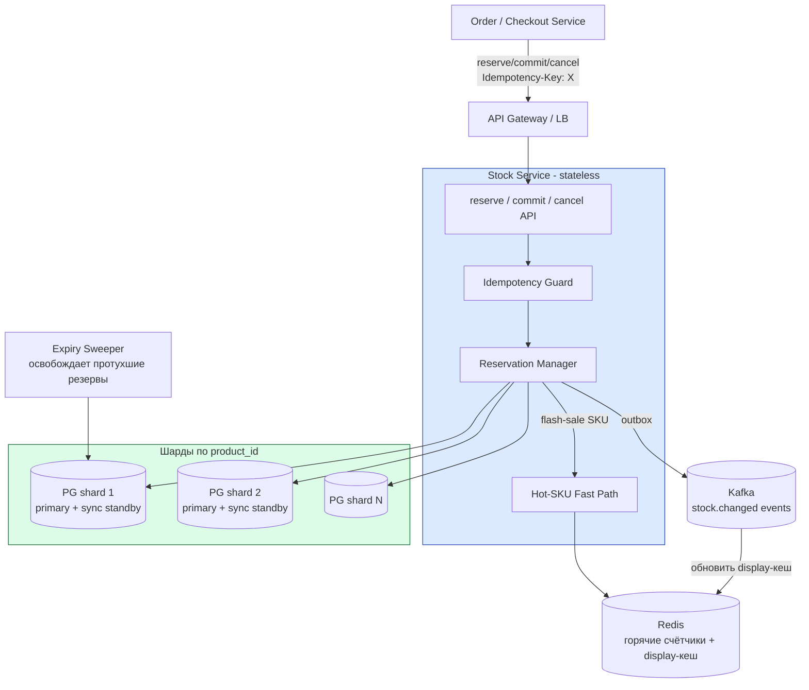

# Stock / Inventory Service

Разбор задачи "Спроектируй сервис управления остатками товаров на складах". Проверяет понимание strong consistency на горячей строке, защиты от overselling (продать больше, чем есть), двухфазного резерва и того, как масштабировать запись при flash sale на один SKU.

> **SKU** (Stock Keeping Unit) — единица складского учёта, конкретный товар на конкретном складе. Дальше «SKU» и «товар на складе» взаимозаменяемы.

---

## Фаза 1: Уточнение требований

### Функциональные требования

```
Вопросы:
  - Один склад или много (товар лежит на N складах)?
  - Резерв — это «холд» под заказ или сразу списание?
  - Кто вызывает: checkout/order service (внутренний клиент) или внешний API?
  - Резерв многотоварный (корзина из N позиций) — атомарный (всё или ничего)?
  - Есть ли TTL у резерва (брошенная корзина) или висит вечно?
  - Нужна ли история движений (audit) остатков?
  - Допустим ли отрицательный сток / backorder (предзаказ)?
```

**Договорились (scope):**
- Много складов; у товара остаток на каждом складе свой (`on_hand` per `(sku, warehouse)`).
- Резерв — **двухфазный**: `reserve` (холд) → `commit` (закрытие = продажа) **или** `cancel` (отмена холда). Прямое списание из корзины запрещено.
- Клиент — внутренний order/checkout service.
- Резерв многотоварный и **атомарный**: либо зарезервированы все позиции, либо ни одной.
- У резерва есть **TTL** (брошенная корзина → авто-освобождение).
- Три публичных интерфейса: `reserve`, `commit` (закрытие резерва), `cancel` (отмена резерва).

**Out of scope:** backorder/предзаказ, перемещения между складами (replenishment), прогноз спроса, ценообразование, мультивалютность.

### Нефункциональные требования

```
- Корректность: НИКОГДА не зарезервировать больше, чем есть (no overselling).
                Чтение всегда отдаёт актуальный остаток.
- Availability: 99.99% (≈ 52 минуты downtime/год) → см. SLO-доку
- Durability:   подтверждённый резерв нельзя потерять при отказе железа
- Latency:      p99 < 200 мс на reserve / commit / cancel
- Scalability:  горизонтальный рост по числу товаров и транзакций
- Consistency:  per-SKU strong (linearizable); разные SKU независимы
```

> **Главный конфликт.** «Никогда не оверселлить» требует строгой консистентности на одной строке остатка, а «p99 < 200 мс при flash sale» требует огромного write-throughput на эту же строку. Весь дизайн — про то, как совместить.

---

## Фаза 2: Оценка нагрузки

```
Каталог:
  50M SKU (товаров) × ~4 склада на товар = ~200M строк остатков
  1 строка остатка: ~80 B + индексы → ~200M × 200B ≈ 40 GB
  → влезает в один узел, но шардируем ради write-throughput и HA

Транзакции (резервы):
  Норма пик:      ~5 000 reserve/сек
  reserve обычно → commit или cancel → ~2-3 stock-операции на заказ
  → ~15 000 stock-операций/сек в пике

  Flash sale (дроп, Чёрная пятница):
    один SKU собирает 10 000+ reserve/сек → ГОРЯЧАЯ СТРОКА
    → это не средняя нагрузка, это точечный hotspot на 1 строке

История резервов:
  ~5K/сек × 86400 ≈ 432M записей/день в пике (в среднем меньше)
  hot-окно 90 дней → партиционирование по времени + архив в холодное хранилище

Latency-бюджет p99 < 200 мс:
  reserve = один индексированный atomic UPDATE (sub-ms в БД) + сеть
  → легко укладывается... ПОКА нет contention на горячей строке
  → весь tail-риск концентрируется в hot-SKU сценарии
```

**Выводы, влияющие на архитектуру:**
1. **Overselling недопустим → CP per SKU**, атомарный условный декремент (не `SELECT` потом `UPDATE`).
2. **Разные SKU независимы → шардируем** по `product_id`; весь сток одного товара (все его склады) — на одном шарде, чтобы многотоварный/многоскладской резерв был single-shard транзакцией.
3. **Tail-latency живёт только в hot-SKU** → отдельный fast-path (Redis / бакетирование), а не «ускоряем всё подряд».
4. **Подтверждённый резерв durable → синхронная репликация** на каждом шарде.

---

## Фаза 3: Ключевые концепции

Прежде чем архитектура — модель, на которой держится корректность.

### Available = on_hand − reserved

```
on_hand   — физически лежит на складе
reserved  — захолдено под незакрытые резервы
available = on_hand − reserved   ← вот это можно ещё зарезервировать

reserve:  reserved += qty                      (available уменьшился)
commit:   on_hand  −= qty,  reserved −= qty     (товар уехал, available не меняется)
cancel:   reserved −= qty                       (available вернулся)
```

Ключ: **резерв трогает только `reserved`**, физический `on_hand` уменьшается лишь при `commit`. Это и есть двухфазность.

### Двухфазный резерв = pre-auth/capture из платежей

Прямая аналогия с [платёжной системой](./11-payment-system.md) (раздел «Payment Flow» и pre-authorization):

| Платежи | Сток | Смысл |
|---|---|---|
| pre-authorization (hold) | `reserve` | заморозили, но не списали |
| capture | `commit` | списали окончательно |
| void / release | `cancel` | разморозили |
| auth expiry | TTL резерва | холд протух — отпустить |

### Защита от overselling — атомарный условный декремент

```
ОПАСНО (race → oversell):
  available = SELECT on_hand - reserved FROM stock WHERE sku=?   -- читаем: 1
  IF available >= qty:                                           -- два потока видят 1
      UPDATE stock SET reserved = reserved + qty                 -- оба резервируют → reserved=2 > on_hand
  → продали 2 штуки при остатке 1

ПРАВИЛЬНО (single atomic statement):
  UPDATE stock SET reserved = reserved + :qty
    WHERE sku=:sku AND warehouse=:wh
      AND on_hand - reserved >= :qty           -- условие проверяется под row-lock
  → если 0 строк затронуто → OUT_OF_STOCK
```

Проверка и инкремент — **одна** SQL-команда. БД берёт row-lock на время `UPDATE`, поэтому условие `on_hand - reserved >= qty` вычисляется на актуальном значении. Никакого `SELECT ... FOR UPDATE` + ручной проверки не нужно — это и медленнее, и легче ошибиться. См. [транзакции и блокировки в PostgreSQL](../../06-databases/database-systems-catalog/postgresql/04-transactions-and-locking.md), раздел про row-level locks.

### Идемпотентность всех трёх операций

`reserve`/`commit`/`cancel` вызываются по сети → retry при таймауте неизбежен. Без идемпотентности retry `reserve` = двойной холд. Каждый запрос несёт `idempotency_key`; повтор возвращает прежний результат, а не делает операцию заново. Детали — [reliability-patterns / idempotency](../reliability-patterns/06-idempotency.md).

---

## Фаза 4: Архитектура



### Роль каждого компонента

**API / Stock Service (stateless).**
*Зачем:* принимает три операции, валидирует, маршрутизирует на нужный шард по `product_id`.
*Почему отдельно / stateless:* всё состояние — в БД и Redis, поэтому сервис масштабируется простым добавлением инстансов за LB (нужно для 99.99% — любой инстанс взаимозаменяем).

**Idempotency Guard.**
*Зачем:* по `idempotency_key` отсекает повторные `reserve`/`commit`/`cancel`.
*Почему отдельно:* retry по сети неизбежен, а каждая из трёх операций изменяет остаток — без дедупликации retry искажает сток. Ключ хранится в той же БД (durability), не только в Redis.

**Reservation Manager.**
*Зачем:* выполняет двухфазную логику — атомарный условный декремент при `reserve`, перенос `reserved→on_hand` при `commit`, возврат при `cancel`; пишет запись резерва с `expires_at`.
*Почему именно так:* резерв и движение остатка должны меняться **в одной транзакции** на одном шарде — иначе рассинхрон «резерв есть, остаток не тронут».

**PG-шарды (primary + sync standby).**
*Зачем:* source of truth остатков и резервов. Шард = хэш `product_id`; весь сток товара по всем складам — на одном шарде.
*Почему PostgreSQL и шардирование:* нужен ACID на декремент (overselling недопустим), а независимость SKU позволяет линейно растить запись добавлением шардов. Синхронный standby → подтверждённый резерв переживает отказ узла. См. [репликацию](../../06-databases/database-systems-catalog/postgresql/06-replication.md) и [шардирование](../../06-databases/database-systems-catalog/postgresql/12-sharding.md).

**Hot-SKU Fast Path + Redis.**
*Зачем:* при flash sale тысячи `reserve/сек` бьют в **одну строку** — Postgres сериализует их row-lock'ом, p99 взрывается. Fast-path обслуживает горячий счётчик атомарно в Redis.
*Почему отдельно:* это исключение, а не норма; выносим точечный hotspot, не трогая основной путь. Детали ниже.

**Expiry Sweeper.**
*Зачем:* находит `HELD`-резервы с истёкшим `expires_at` и освобождает `reserved` (как `cancel`).
*Почему отдельно:* брошенные корзины иначе навсегда заблокируют сток. Важно: протухший резерв лишь **занижает** `available` до подметания — это безопасное направление (ложное «нет в наличии»), оверселла не вызывает.

**Kafka (outbox).**
*Зачем:* публикует `stock.changed` для обновления display-кеша и downstream (поиск, аналитика).
*Почему через outbox:* событие пишется в той же транзакции, что и изменение остатка → не теряется при сбое. Паттерн как в [платёжной](./11-payment-system.md) и [marketplace-notifications](./12-marketplace-vendor-notifications.md) кейсах.

---

## Фаза 5: Deep Dive

### Модель данных

```sql
CREATE TABLE stock (
  product_id   BIGINT      NOT NULL,
  warehouse_id INT         NOT NULL,
  on_hand      INT         NOT NULL CHECK (on_hand >= 0),
  reserved     INT         NOT NULL CHECK (reserved >= 0),
  updated_at   TIMESTAMPTZ NOT NULL DEFAULT now(),
  PRIMARY KEY (product_id, warehouse_id),
  CHECK (reserved <= on_hand)          -- инвариант: нельзя захолдить больше, чем лежит
);

CREATE TABLE reservations (
  id              UUID         PRIMARY KEY,
  idempotency_key TEXT         NOT NULL UNIQUE,    -- дедупликация
  order_id        BIGINT       NOT NULL,
  status          TEXT         NOT NULL,           -- HELD / COMMITTED / CANCELLED / EXPIRED
  expires_at      TIMESTAMPTZ  NOT NULL,
  created_at      TIMESTAMPTZ  NOT NULL DEFAULT now()
);

CREATE TABLE reservation_items (
  reservation_id UUID   NOT NULL REFERENCES reservations(id),
  product_id     BIGINT NOT NULL,
  warehouse_id   INT    NOT NULL,
  qty            INT    NOT NULL CHECK (qty > 0)
);

-- частичный индекс для sweeper'а: только живые резервы
CREATE INDEX idx_resv_expiry ON reservations (expires_at) WHERE status = 'HELD';
```

`CHECK (reserved <= on_hand)` — последняя линия обороны от overselling на уровне БД: даже при баге в коде транзакция упадёт, а не оверселлит.

### Операция reserve (многотоварная, всё-или-ничего)

```
POST /reservations
  Idempotency-Key: "order-789-attempt-1"
  { "order_id": 789, "ttl_sec": 900,
    "items": [ {"sku": 100, "wh": 1, "qty": 2}, {"sku": 205, "wh": 1, "qty": 1} ] }

BEGIN
  -- 1. идемпотентность
  INSERT INTO reservations(id, idempotency_key, order_id, status, expires_at)
    VALUES (:id, :key, :order, 'HELD', now() + :ttl)
    ON CONFLICT (idempotency_key) DO NOTHING;
  IF not inserted:
      SELECT ... вернуть существующий резерв (повтор) → 200

  -- 2. сортируем позиции по (sku, wh) — детерминированный порядок против deadlock
  FOR item IN sorted(items):
      UPDATE stock SET reserved = reserved + :qty, updated_at = now()
        WHERE product_id = :sku AND warehouse_id = :wh
          AND on_hand - reserved >= :qty;          -- атомарный условный декремент
      IF rows_affected = 0:
          ROLLBACK → 409 { "error": "OUT_OF_STOCK", "sku": :sku }

  INSERT INTO reservation_items ...
COMMIT
→ 201 { "reservation_id": :id, "status": "HELD", "expires_at": ... }
```

Два важных момента:
- **Детерминированный порядок блокировок** (сортировка по `(sku, wh)`): две корзины с пересекающимися товарами иначе словят deadlock (A держит X ждёт Y, B держит Y ждёт X).
- **Всё-или-ничего**: первый же `OUT_OF_STOCK` откатывает уже захолдённые позиции — частичный резерв недопустим.

### Операции commit и cancel (идемпотентны через guard статуса)

```
-- commit (закрытие резерва = продажа)
BEGIN
  UPDATE reservations SET status='COMMITTED'
    WHERE id=:id AND status='HELD';               -- guard: повтор/после отмены → 0 строк
  IF rows_affected = 0:
      SELECT ... вернуть текущий статус (идемпотентно) → 200
  FOR item IN items:
      UPDATE stock SET on_hand = on_hand - qty, reserved = reserved - qty
        WHERE product_id=:sku AND warehouse_id=:wh;
COMMIT

-- cancel (отмена резерва)
BEGIN
  UPDATE reservations SET status='CANCELLED' WHERE id=:id AND status='HELD';
  IF rows_affected = 0: вернуть текущий статус → 200
  FOR item IN items:
      UPDATE stock SET reserved = reserved - qty
        WHERE product_id=:sku AND warehouse_id=:wh;
COMMIT
```

`WHERE ... status='HELD'` — идемпотентность без отдельной таблицы: повторный `commit` уже закоммиченного резерва меняет 0 строк и возвращает текущее состояние. Терминальные статусы (`COMMITTED`/`CANCELLED`/`EXPIRED`) необратимы.

### Expiry Sweeper — освобождение брошенных корзин

```
LOOP каждые N секунд:
  SELECT id FROM reservations
    WHERE status='HELD' AND expires_at < now()
    ORDER BY expires_at LIMIT 500
    FOR UPDATE SKIP LOCKED;                -- несколько воркеров не дерутся за одни строки
  FOR each → выполнить как cancel, но status='EXPIRED'
```

`FOR UPDATE SKIP LOCKED` — стандартный приём «очереди в БД»: воркеры разбирают разные пачки без блокировок друг друга. Частичный индекс `WHERE status='HELD'` держит скан дешёвым даже при сотнях миллионов исторических резервов.

**Почему sweeper, а не lazy-проверка `expires_at` при чтении:** иначе `available` пришлось бы считать как `on_hand - reserved + (протухшие)` на каждом чтении — дорого и хрупко. Sweeper держит `reserved` всегда «честным».

### Горячий SKU (flash sale) — главный челлендж

```
Проблема: 10 000 reserve/сек в ОДНУ строку stock.
  - Postgres сериализует их row-lock'ом → реальный throughput ~сотни/сек,
    очередь ожидающих растёт → p99 пробивает 200 мс.
  - MVCC: каждый UPDATE строки = новая версия кортежа → 10K dead tuples/сек
    → bloat + давление на autovacuum. См. ../../06-databases/.../postgresql/01-mvcc-and-vacuum.md
```

Три решения (по нарастанию сложности):

**1. Бакетирование остатка (sharded counter в Postgres).** Разбить `N` единиц SKU на `K` под-строк-бакетов; резерв хэшируется в случайный бакет → contention падает в `K` раз; при пустом бакете — пробуем следующий. `available = SUM(buckets)`. Остаёмся в Postgres → durability сохранена. Так делают тикетинг-системы.

```
stock_bucket(product_id, warehouse_id, bucket_id, on_hand, reserved)  -- K строк на SKU
reserve: bucket = hash(reservation_id) % K
         UPDATE ... WHERE bucket_id=:b AND on_hand-reserved>=:qty
         если не вышло → перебрать остальные бакеты
```

**2. Redis fast-path (экстремальный flash sale).** На время распродажи горячий счётчик живёт в Redis; атомарный декремент через Lua (`DECRBY`, при уходе в минус — откат и reject). Один ключ держит 100K+ ops/сек, sub-ms. Постоянное состояние периодически чекпойнтится в Postgres, который остаётся source of truth до/после окна. Риск durability Redis закрывается AOF + тем, что окно распродажи ограничено. Подробно — [Redis](../../06-databases/database-systems-catalog/08-redis.md), атомарные счётчики и Lua.

**3. Сериализация через очередь per-SKU.** Один writer на горячий SKU разбирает очередь резервов → нулевой lock-contention, но +latency и сложность. Применять только при экстремальной горячести.

**Выбор:** бакетирование как дефолт для умеренно горячих SKU (durable, в Postgres); Redis fast-path подключается для заранее известных дропов с последующей сверкой в БД.

### Чтение остатка — разделение «отображение» vs «решение»

```
GET /stock/{sku}?warehouse=1   → "осталось N штук"

Display (витрина):  из Redis display-кеша, обновляется по stock.changed (Kafka).
                    Eventually consistent — для показа «осталось N» это ок.
Решение (reserve):  ТОЛЬКО атомарный UPDATE ... WHERE on_hand-reserved>=qty.
                    Кешу для решения не доверяем НИКОГДА.
```

Это ключевой принцип: **корректность обеспечивается на записи, скорость — на чтении**. Витрина может на секунды показать «осталось 3», а резерв честно вернёт `OUT_OF_STOCK` — пользователь увидит это на чекауте. Так read-path не нагружает primary и легко кешируется, а строгий инвариант живёт в одной atomic-команде. (Тот же CQRS-мотив, что в [Avito-кейсе](./13-avito-classifieds.md): горячее чтение отдельно от записи.)

### Доступность 99.99% и durability

```
Durability подтверждённого резерва:
  synchronous_commit = on (или remote_write) + синхронный standby
  → COMMIT не вернётся клиенту, пока запись не на двух узлах
  → отказ primary не теряет резерв. См. репликацию PostgreSQL.

Failover:
  Patroni + etcd, авто-промоут standby, мульти-AZ.

Error budget 99.99% ≈ 52 мин/год:
  - stateless сервис за LB (любой инстанс взаимозаменяем)
  - пул соединений (pgbouncer) — см. .../postgresql/09-connection-pooling.md
  - каждый шард: свой primary+standby; отказ одного шарда роняет лишь его товары
  → SLO/SLI и бюджет ошибок: ../reliability-patterns/08-slo-sli-error-budgets.md
```

---

## Сквозные потоки

**1. Успешный заказ (reserve → commit).**
`reserve` холдит позиции (atomic декремент, `reserved += qty`) → пользователь оплачивает → checkout зовёт `commit` → `on_hand -= qty, reserved -= qty`, резерв `COMMITTED` → `stock.changed` в Kafka обновляет витрину.
*Итог:* физический остаток уменьшился ровно один раз; повтор `commit` (retry) ничего не меняет.

**2. Отмена / таймаут оплаты (reserve → cancel или expire).**
`reserve` прошёл, оплата не случилась. Явный `cancel` или Sweeper по `expires_at` возвращает `reserved -= qty`, статус `CANCELLED`/`EXPIRED`.
*Итог:* `available` восстановлен; брошенная корзина не держит сток вечно.

**3. Гонка за последней единицей (overselling-защита).**
Двое одновременно резервируют последнюю штуку. Оба исполняют `UPDATE ... WHERE on_hand-reserved>=1`; row-lock сериализует — первый увеличивает `reserved`, второму условие уже не выполняется → `0 строк` → `409 OUT_OF_STOCK`.
*Итог:* продано ровно столько, сколько было. Оверселла нет без единого явного лока в коде.

**4. Flash sale на один SKU.**
Тысячи `reserve/сек` на горячую строку → Reservation Manager уводит их в Hot-SKU Fast Path: Redis-счётчик (или бакеты в Postgres) обслуживает декремент атомарно, p99 держится; БД-state чекпойнтится/сверяется.
*Итог:* tail-latency под контролем, overselling по-прежнему исключён.

---

## Трейдоффы

| Решение | Принятое | Альтернатива | Причина |
|---|---|---|---|
| Consistency per SKU | Strong (linearizable) | Eventual | Overselling недопустим — нельзя продать чего нет |
| Защита от оверселла | Atomic `UPDATE … WHERE available>=qty` | `SELECT` потом `UPDATE` | Read-then-write → гонка → оверселл; условный декремент атомарен |
| Модель резерва | Двухфазная (hold→commit/cancel) + TTL | Прямое списание из корзины | Брошенные корзины иначе блокируют сток навсегда |
| Хранилище | PostgreSQL, шард по `product_id` | NoSQL eventual | Нужен ACID на декремент; SKU независимы → линейный шардинг |
| Co-location | Весь сток товара на одном шарде | Шард по `(sku, warehouse)` | Многоскладской резерв = single-shard транзакция |
| Горячий SKU | Redis fast-path / бакетирование | Одна строка в Postgres | Row-lock сериализует; MVCC → bloat на горячей строке |
| Durability | Синхронная репликация | Async | Потеря подтверждённого резерва недопустима |
| Чтение остатка | Кеш best-effort (витрина) | Strong read каждый раз | Показу «осталось N» точность не нужна; корректность — на записи |

### Почему не NoSQL / eventual consistency?

```
Cassandra/Mongo (eventual): reserved=0 на одной реплике, reserved=1 на другой
  → оба клиента резервируют последнюю единицу → оверселл.
Атомарный INCR в Redis быстрый, но Redis не source of truth для всего каталога
  (durability и память) → Redis только для точечных горячих SKU.
PostgreSQL: один atomic UPDATE с условием + CHECK(reserved<=on_hand)
  → инвариант остатка гарантирован на источнике истины.
```

---

## Interview-ready ответ (2 минуты)

> "Stock-сервис — это про две вещи, которые тянут в разные стороны: строгая консистентность на одной строке остатка (чтобы не оверселлить) и высокий write-throughput на эту же строку при flash sale.
>
> Модель: `available = on_hand − reserved`. Резерв двухфазный, как pre-auth/capture в платежах: `reserve` холдит (`reserved += qty`), `commit` списывает (`on_hand -= qty`), `cancel`/TTL возвращает. Прямого списания из корзины нет — иначе брошенные корзины блокируют сток.
>
> Защита от оверселла — один атомарный условный декремент: `UPDATE stock SET reserved=reserved+qty WHERE on_hand-reserved>=qty`. Если 0 строк — OUT_OF_STOCK. Никакого read-then-write, гонки исключены row-lock'ом, плюс `CHECK(reserved<=on_hand)` как страховка. Все три операции идемпотентны по ключу и через guard статуса.
>
> Хранилище — PostgreSQL, шард по `product_id`; весь сток товара по всем складам на одном шарде, так что многоскладской резерв — single-shard ACID-транзакция. Durability — синхронная репликация: подтверждённый резерв переживает отказ узла. 99.99% — stateless сервис за LB, у каждого шарда свой standby.
>
> Главный челлендж — горячий SKU на распродаже: тысячи резервов в одну строку, Postgres сериализует их row-lock'ом и плодит MVCC-bloat. Решаю бакетированием счётчика по K под-строк либо Redis fast-path на время дропа со сверкой в БД.
>
> И разделяю чтение: витринное «осталось N» — из кеша, eventually consistent; решение о резерве — только атомарный UPDATE на источнике истины. Корректность на записи, скорость на чтении."
