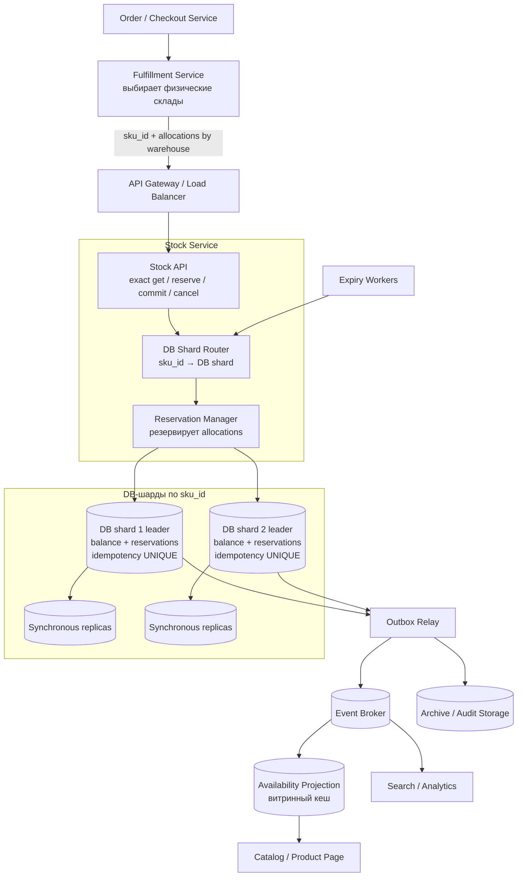
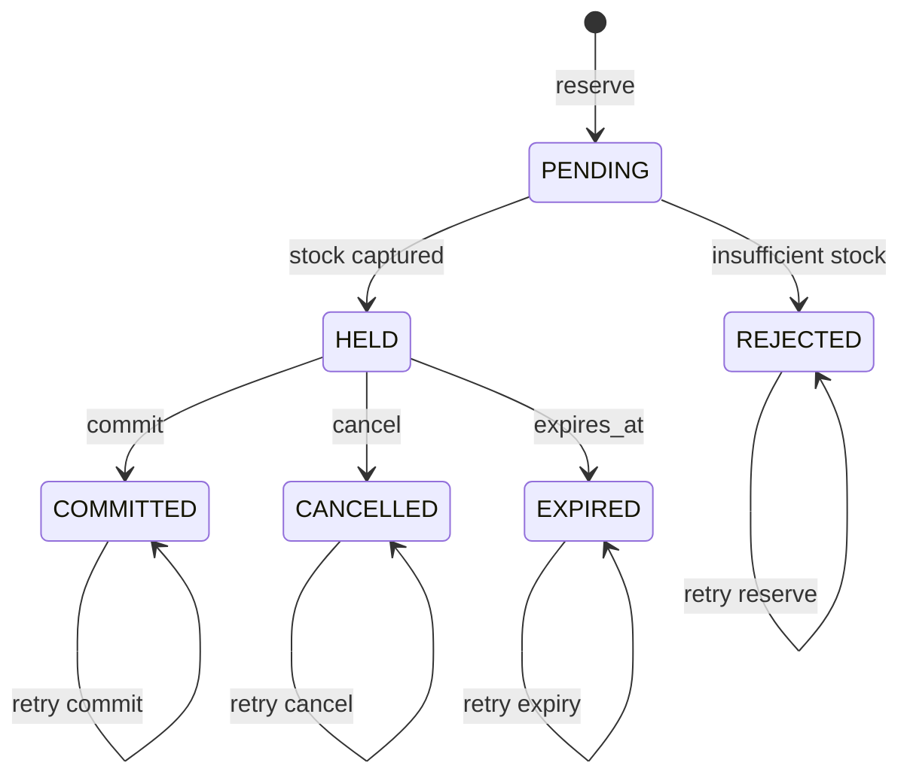

# Stock / Inventory Service — расширенный design document

## Содержание

- [Постановка задачи](#постановка-задачи)
- [Фаза 1: уточнение требований](#фаза-1-уточнение-требований)
- [Фаза 2: оценка нагрузки](#фаза-2-оценка-нагрузки)
- [Фаза 3: модель остатков и гарантии](#фаза-3-модель-остатков-и-гарантии)
- [Фаза 4: высокоуровневый дизайн](#фаза-4-высокоуровневый-дизайн)
- [Фаза 5: API и модель данных](#фаза-5-api-и-модель-данных)
- [Фаза 6: механика операций](#фаза-6-механика-операций)
- [Фаза 7: масштабирование и горячий SKU](#фаза-7-масштабирование-и-горячий-sku)
- [Сквозные потоки](#сквозные-потоки)
- [Отказы и восстановление](#отказы-и-восстановление)
- [SLO, latency budget и наблюдаемость](#slo-latency-budget-и-наблюдаемость)
- [Трейдоффы](#трейдоффы)
- [Типичные ошибки](#типичные-ошибки)
- [Interview-ready ответ](#interview-ready-ответ-2-минуты)
- [Разбор по вопросам](#разбор-по-вопросам)
- [Связанные материалы](#связанные-материалы)

> Это расширенный справочный разбор. Для подготовки ответа на 45–60 минут
> начните с [основного interview-case](./14-stock-inventory-service.md).

Этот кейс разбирает сервис управления остатками товаров на складах. Его
главная сложность — совместить строгую корректность резерва, быстрый ответ и
доступность при отказах.

Здесь недостаточно поставить кеш перед базой данных. Если два запроса увидят
последнюю единицу товара и оба успешно зарезервируют её, система совершит
`overselling` — пообещает клиентам больше товара, чем есть на складе.

## Постановка задачи

Нужно спроектировать Stock Service со следующими требованиями:

- возвращать актуальное количество доступного товара;
- не допускать резерв товара, который закончился;
- обеспечить доступность 99,99% и не терять подтверждённые изменения при
  отказе оборудования;
- горизонтально масштабироваться по числу товаров и операций;
- укладываться в `p99 < 200 мс`;
- поддерживать резерв, закрытие и отмену резерва.

В этом кейсе под **актуальным остатком** понимается состояние относительно
всех операций, подтверждённых Stock Service. Если склад физически принял товар,
но Warehouse Management System ещё не отправила это изменение, Stock Service
не может знать о нём. Свежесть интеграции с физическим складом — отдельный SLO.

> **SKU** (`Stock Keeping Unit`) — конкретная товарная позиция. Остаток хранится
> для ключа `(sku_id, warehouse_id)`, потому что один SKU может находиться на
> нескольких складах.

## Фаза 1: уточнение требований

На интервью сначала нужно убрать неоднозначность слова «остаток» и границ
операции.

### Что спросить

```text
1. "Актуальное количество" — физический on_hand или доступный для резерва available?
2. Остаток нужен по конкретному складу или суммарно по всем складам?
3. Склад уже выбран до вызова Stock Service?
4. Один резерв содержит одну позицию или всю корзину?
5. Если в корзине несколько SKU, требуется атомарность "всё или ничего"?
6. Есть ли срок жизни резерва?
7. Что означает закрытие: успешную продажу и физическое списание?
8. Разрешены ли backorder и отрицательный остаток?
9. Кто меняет физический остаток при приёмке, списании брака и инвентаризации?
10. Какова география: один регион, несколько регионов или active-active?
```

### Зафиксированный scope

Для основного дизайна принимаем следующие решения:

- физических складов много; один заказ и даже одна позиция SKU могут быть
  распределены между несколькими складами;
- выбор складов делает отдельный Fulfillment Service по адресу покупателя,
  сроку доставки, стоимости логистики и доступности;
- Stock Service получает готовые строки распределения
  `(sku_id, warehouse_id, quantity)` и повторно проверяет остаток при записи;
- один локальный stock-резерв относится к одному `sku_id`, но может содержать
  несколько `warehouse_id`: все склады этого SKU находятся на одном DB-шарде;
- `reserve` создаёт временный hold с TTL;
- `commit` закрывает резерв и окончательно списывает товар;
- `cancel` освобождает резерв;
- повтор любого сетевого запроса не должен менять остаток второй раз;
- Stock Service возвращает точный `available` по одному складу и точную сумму
  по складам одного SKU;
- отрицательный остаток и backorder запрещены;
- изменения от приёмки, возврата, брака и инвентаризации приходят отдельными
  идемпотентными командами, но их подробный API находится вне scope;
- рабочий регион один, внутри него используется несколько зон доступности.

Здесь важно не смешивать физический склад и DB-шард. Физических складов могут
быть тысячи. DB-шард — технический узел хранения, на котором лежат строки
многих складов для некоторого набора SKU.

Корзина из нескольких SKU рассмотрена отдельно: разные SKU могут пересечь
DB-шарды и требуют выбора между сагой, распределённой транзакцией и более узкой
гарантией API.

### Функциональные требования

| Операция | Результат |
| --- | --- |
| Получить остаток | Вернуть `on_hand`, `reserved` и `available` по складам SKU |
| Создать резерв | Атомарно захолдить один SKU на одном или нескольких складах |
| Закрыть резерв | Уменьшить физический `on_hand` во всех строках распределения ровно один раз |
| Отменить резерв | Вернуть количество во все затронутые склады ровно один раз |
| Просрочить резерв | Автоматически выполнить безопасный аналог отмены |

### Нефункциональные требования

```text
Correctness:  новый reserve успешен только при available >= quantity;
              физическая недостача отражается явно, а не скрывается
Consistency: linearizable read/write для одного SKU
Availability: 99,99% в пределах принятой модели отказов
Durability:   RPO = 0 для подтверждённых операций при отказе одного узла
Latency:      p99 < 200 мс для точного get/reserve/commit/cancel
Scalability:  stateless-приложение + шарды данных
Auditability: каждое изменение остатка имеет неизменяемую запись в журнале
```

`OUT_OF_STOCK`, конфликт терминальных состояний и ошибка валидации являются
корректными бизнес-ответами, а не недоступностью сервиса.

## Фаза 2: оценка нагрузки

Точных чисел в условии нет, поэтому на интервью их нужно согласовать. Ниже —
пример допущений, а не свойства любого stock-сервиса.

```text
Каталог:
  50 млн SKU
  в среднем 4 склада на SKU
  50 млн × 4 = 200 млн ключей (sku_id, warehouse_id)

Трафик:
  5 000 reserve/с в обычный пик
  около 3 SKU-позиций в заказе
  5 000 × 3 = 15 000 локальных резервов по SKU/с

  часть SKU делится между двумя складами
  допустим, в среднем 1,2 allocation на SKU
  15 000 × 1,2 = 18 000 обновлений balance-строк/с

  Почти каждый hold завершается commit или cancel:
  ещё примерно 18 000 изменений balance-строк/с

  Итого:
  около 36 000 изменений stock balance/с
  плюс журнал движений и outbox

Чтение:
  витрина: 50 000 availability-preview/с
    → кеш / асинхронная проекция, число может немного отставать

  checkout и Fulfillment:
    до одного точного чтения на SKU перед reserve
    5 000 заказов/с × 3 SKU = до 15 000 точных get-stock/с
    → leader DB-шарда

Hotspot:
  flash sale может дать 10 000 reserve attempts/с
  не на весь кластер, а на один SKU

  Пока товара достаточно, worst case:
  до 10 000 успешных balance mutations/с на этот SKU

  После исчерпания:
  основная нагрузка — корректные OUT_OF_STOCK и idempotency results
```

Если одна текущая строка с индексами и служебными накладными расходами занимает
порядка 200 байт, нижняя оценка равна:

```text
200 млн × 200 байт = 40 ГБ
```

На практике нужны место для индексов, журнал предзаписи, запас под обслуживание
и реплики, поэтому физический объём будет в несколько раз больше. Главная
причина шардирования здесь всё равно не объём одной таблицы, а пропускная
способность записи и изоляция отказов.

Историю нельзя оценивать по пиковым 5 000 заказов/с, как будто пик длится весь
день. Если среднее равно 500 резервов/с:

```text
500 × 86 400 = 43,2 млн резервов/день
```

Журнал быстро становится крупнее таблицы текущих остатков. Поэтому текущий
balance и неизменяемая история имеют разные политики хранения: свежая история
партиционируется по времени, старая архивируется.

### Оценка количества DB-шардов

Число шардов выводится не из абстрактного «PostgreSQL выдерживает много», а из
нагрузочного теста полной транзакции с `reservations`, balance, ledger, outbox и
синхронной репликацией.

Допустим, тест одного шарда на равномерно распределённых SKU показывает:

```text
5 000 изменений balance/с при требуемом p99

Целевая загрузка 60%:
  5 000 × 0,60 = 3 000 изменений/с на шард

Для обычного пика:
  ceil(36 000 / 3 000) = 12 шардов

Запас ×2 на рост, отказ шарда и перенос данных:
  12 × 2 = 24 физических DB-шарда

Точное чтение:
  15 000 / 24 ≈ 625 get-stock/с на leader шарда в среднем
```

Это пример расчёта, а не универсальная рекомендация «нужно 24 шарда».
Финальное число подтверждается смешанным тестом чтения и записи, объёмом
данных, временем восстановления и допустимым blast radius. Витринные
50 000 чтений/с в этот расчёт leader не входят.

`3 000 изменений/с` — также рабочий предел **суммы всех buckets**, оставшихся
на одном DB-шарде. Разбиение одной balance-строки на 100 строк убирает row
contention, но не превращает шард с capacity 3 000/с в шард на 10 000/с.

### Архитектурные выводы из чисел

1. Независимые SKU распределяются по шардам.
2. Точный checkout-read нельзя читать из асинхронной реплики или обычного кеша,
   а витринный preview не должен конкурировать с записью на leader.
3. Для hot SKU есть два разных потолка: capacity одной строки и capacity всего
   DB-шарда. Escrow внутри шарда лечит только первый; для заявленных
   10 000 mutations/с нужно уменьшать число транзакций через batching либо
   распределять buckets по нескольким специальным hot-шардам.
4. История движений и события не должны раздувать критический путь.
5. Неограниченная очередь запросов разрушит `p99`; нужны лимиты конкуренции и
   быстрое отклонение перегрузки.

## Фаза 3: модель остатков и гарантии

### Простая ментальная модель

Для каждого `(sku_id, warehouse_id)` храним два числа:

```text
on_hand   — физически числится на складе
reserved  — удерживается незавершёнными резервами
available = max(on_hand - reserved, 0)
shortage  = max(reserved - on_hand, 0)
```

Пример:

```text
До reserve:
  on_hand = 10
  reserved = 3
  available = 10 - 3 = 7

reserve(2):
  reserved = 3 + 2 = 5
  available = 10 - 5 = 5

commit(2):
  on_hand = 10 - 2 = 8
  reserved = 5 - 2 = 3
  available = 8 - 3 = 5

available при commit не меняется:
  товар уже был исключён из продажи на этапе reserve
```

При отмене вместо `commit`:

```text
cancel(2):
  on_hand = 10
  reserved = 5 - 2 = 3
  available = 10 - 3 = 7
```

Для обычных `reserve`, `commit` и `cancel` выполняется:

```text
0 <= reserved <= on_hand
```

Но физическая инвентаризация может обнаружить недостачу и сделать
`reserved > on_hand`. Это уже не программный overselling, а факт: склад обещал
больше товара, чем физически нашёл. Система обязана сохранить новое
`on_hand`, выставить состояние `SHORTAGE`, вернуть `available = 0` и запустить
перераспределение или отмену затронутых резервов. Отвергать физический факт
через `CHECK (reserved <= on_hand)` нельзя.

### Что означает «всегда актуальный»

Контракт точного чтения задаём через **линеаризуемость**:

> Если изменение успешно завершилось до начала чтения, чтение обязано увидеть
> это изменение.

Операция, которая ещё выполняется параллельно с чтением, может оказаться до или
после него в едином порядке. Это не ошибка: у конкурентных операций нет
объективного общего момента завершения.

Точный `GET` направляется лидеру шарда. Асинхронная реплика может отставать, а
обычный кеш может не получить инвалидирующее событие, поэтому они не подходят
для заявленного контракта.

### Консистентность против доступности

Требования «не допускать overselling» и «отвечать актуально» означают
**fail-closed** при потере кворума: сервис временно возвращает `503`, а не
угадывает остаток по устаревшей копии.

Это не противоречит SLO 99,99%. SLO означает, что благодаря репликации,
автоматическому переключению и безопасным развёртываниям периоды недоступности
должны уложиться примерно в 52,6 минуты в год. Он не означает, что система
может одновременно сохранить строгую консистентность и обслуживать обе стороны
произвольного сетевого разделения.

## Фаза 4: высокоуровневый дизайн



Fulfillment Service выбирает **физические склады**. `DB Shard Router` решает
другую задачу: находит **технический шард базы**, где хранятся balance-строки
этого SKU для выбранных складов.

Точное чтение и все решения о резерве идут в leader нужного DB-шарда.
Витринное «примерно осталось N» обслуживает отдельная асинхронная проекция.
Шина событий находится после транзакции и не участвует в проверке доступности
товара.

### Роль каждого компонента

**API Gateway / Load Balancer.**

- *Зачем:* терминирует TLS, проверяет аутентификацию, ограничивает нагрузку и
  распределяет запросы по экземплярам Stock Service.
- *Почему отдельно:* отказ или развёртывание одного экземпляра приложения не
  должны делать сервис недоступным.

**Fulfillment Service.**

- *Зачем:* выбирает один или несколько физических складов для каждой позиции
  заказа с учётом адреса, обещанного срока, стоимости доставки, вместимости и
  доступного остатка.
- *Почему не внутри Stock Service:* управление остатком отвечает на вопрос
  «можно ли захолдить это количество», а планирование доставки — «откуда выгодно
  и возможно везти». Прочитанный Fulfillment-ом остаток может измениться, поэтому
  Stock Service обязательно повторяет проверку атомарно в `reserve`.

**Stock API.**

- *Зачем:* предоставляет точное чтение и три команды жизненного цикла резерва.
  Один reserve-запрос может содержать несколько складских распределений
  (`allocations`) для одного SKU.
- *Почему витрина не использует этот API на каждый показ:* карточке товара
  достаточно приблизительной доступности, а 50 000 витринных чтений/с не должны
  конкурировать на leader с транзакциями checkout.
- *Почему stateless:* состояние запроса хранится в источнике истины, поэтому
  экземпляры приложения масштабируются горизонтально.

**DB Shard Router.**

- *Зачем:* по `sku_id` находит leader технического DB-шарда. Он не выбирает
  физический склад и не принимает логистических решений.
- *Почему нужен каталог маршрутов:* количество шардов меняется, а клиенты не
  должны знать физическое размещение данных. Диапазоны или виртуальные бакеты
  позволяют переносить часть ключей без изменения API.

**Идемпотентность внутри транзакции шарда.**

- *Зачем:* уникальный ключ в `reservations` связывает повтор с hash запроса и
  сохранённым результатом.
- *Почему после маршрутизации:* сначала `sku_id` определяет DB-шард, затем
  проверка ключа, запись reservation и изменение balance выполняются одной
  транзакцией на этом же шарде.
- *Почему это не отдельное хранилище Idempotency Guard:* отдельная запись перед
  маршрутизацией создала бы dual-write и новый сценарий рассинхронизации.
  Подробнее — в материале про
  [идемпотентность](../reliability-patterns/06-idempotency.md).

**Reservation Manager.**

- *Зачем:* в одной транзакции меняет balance всех переданных складов одного
  SKU, состояние резерва, журнал движений и outbox.
- *Почему это одна граница транзакции:* иначе возможны состояния «hold создан,
  но остаток не уменьшен», частичный hold только на одном складе и «остаток
  изменён, но событие потеряно».

**Шардированный PostgreSQL-кластер.**

- *Зачем:* хранит канонический balance, резервы, журнал и outbox.
- *Почему реляционное хранилище:* условное обновление, ограничения целостности и
  переход состояния удобно выполнять ACID-транзакцией. Шардирование PostgreSQL
  разобрано [отдельно](../../06-databases/database-systems-catalog/postgresql/12-sharding.md).

**Синхронные реплики и управляющий кворум.**

- *Зачем:* подтверждённая транзакция находится более чем на одном узле, а при
  отказе leader выбирается единственный новый leader.
- *Почему важно fencing-ограждение старого leader:* два одновременно пишущих
  primary создадут split-brain и нарушат остаток. Механика репликации описана в
  [профильном материале](../../06-databases/database-systems-catalog/postgresql/06-replication.md).

**Expiry Workers.**

- *Зачем:* освобождают просроченные holds небольшими параллельными пачками.
- *Почему несколько воркеров безопасны:* строки выбираются через
  `FOR UPDATE SKIP LOCKED`, а переход `HELD -> EXPIRED` идемпотентен.

**Outbox Relay и брокер событий.**

- *Зачем:* доставляют `stock.changed` в поиск, каталог и аналитику.
- *Почему outbox:* изменение balance и событие фиксируются одной транзакцией.
  Брокер может быть временно недоступен, не блокируя резерв. См.
  [Saga и Outbox](../../04-architecture-and-patterns/patterns/09-saga-and-outbox.md).

**Availability Projection.**

- *Зачем:* обслуживает витринное чтение с низкой latency из кеша или read
  replicas и снимает 50 000 preview-запросов/с с leader.
- *Гарантия:* значение может отставать и используется только для показа.
  `reserve` никогда не доверяет этой проекции и повторяет условную проверку на
  source of truth.

**Archive / Audit Storage.**

- *Зачем:* хранит старую историю дешевле и позволяет сверять текущие агрегаты.
- *Почему отдельно:* бесконечный журнал на диске лидера ухудшает резерв и
  обслуживание индексов.

## Фаза 5: API и модель данных

### Точное и витринное чтение

У двух read-path разные контракты:

| Read-path | Клиенты | Источник | Гарантия |
| --- | --- | --- | --- |
| `GET /v1/stocks/{sku}` | Checkout, Fulfillment, support | Leader DB-шарда | Линеаризуемый точный balance |
| `GET /v1/stock-previews/{sku}` | Каталог, поиск, карточка товара | Кеш / асинхронная проекция | Приблизительное значение с `as_of` |

Точный внутренний запрос:

```http
GET /v1/stocks/sku-100?warehouse_id=42
```

```json
{
  "sku_id": "sku-100",
  "warehouse_id": 42,
  "on_hand": 10,
  "reserved": 3,
  "available": 7,
  "shortage": 0,
  "state": "OK",
  "version": 81
}
```

Если `warehouse_id` не передан, сервис может вернуть точную сумму по всем
складам SKU, потому что строки одного `sku_id` размещены на одном шарде. Нужно
оговорить, что суммарная доступность ещё не означает возможность отгрузить всё
количество с одного склада.

```http
GET /v1/stocks/sku-100
```

```json
{
  "sku_id": "sku-100",
  "available_total": 11,
  "warehouses": [
    {
      "warehouse_id": 42,
      "available": 7
    },
    {
      "warehouse_id": 77,
      "available": 4
    }
  ]
}
```

Fulfillment использует распределение по складам как один из входов для
планирования доставки. Между этим `GET` и `reserve` остаток может измениться,
поэтому чтение помогает выбрать кандидатов, но не заменяет условную запись.

Витринный запрос может отвечать так:

```json
{
  "sku_id": "sku-100",
  "availability": "IN_STOCK",
  "available_approx": 11,
  "as_of": "2026-07-27T12:00:02Z"
}
```

Витрина не обещает, что следующее `reserve` обязательно будет успешным. Если
проекция показала товар, а конкурентные клиенты уже разобрали остаток,
канонический ответ `reserve` — `OUT_OF_STOCK`.

`version` помогает диагностировать порядок изменений и поддерживать
оптимистическое обновление во внутренних командах. Клиент не должен принимать
решение о резерве по ранее прочитанной версии: окончательная проверка всё равно
происходит в `reserve`.

### Создание резерва

```http
POST /v1/stocks/sku-100/reservations
Idempotency-Key: checkout-789-line-1
Content-Type: application/json
```

```json
{
  "order_id": "order-789",
  "allocations": [
    {
      "warehouse_id": 42,
      "quantity": 2
    },
    {
      "warehouse_id": 77,
      "quantity": 1
    }
  ],
  "reservation_policy": "CHECKOUT"
}
```

Fulfillment Service решил доставить три одинаковые единицы SKU с двух
физических складов. Stock Service не доверяет прочитанному ранее остатку и
атомарно перепроверяет обе строки. Поскольку они имеют одинаковый `sku_id`, обе
строки находятся на одном DB-шарде.

Область действия ключа идемпотентности — `(client_id, sku_id)`. Для разных SKU
одного заказа Fulfillment создаёт отдельные ключи дочерних резервов.
`request_hash` считается от канонического тела, где allocations отсортированы
по `warehouse_id`: другой порядок тех же строк не должен выглядеть новым
запросом.

Успех:

```http
201 Created
```

```json
{
  "reservation_id": "9dcfe140-70b4-4f4b-bf83-53950393c087",
  "status": "HELD",
  "sku_id": "sku-100",
  "quantity_total": 3,
  "allocations": [
    {
      "warehouse_id": 42,
      "quantity": 2
    },
    {
      "warehouse_id": 77,
      "quantity": 1
    }
  ],
  "expires_at": "2026-07-27T12:15:00Z"
}
```

Основные ответы:

| Код | Значение |
| --- | --- |
| `201` | Резерв создан |
| `200` | Вернулся результат повтора с тем же ключом и телом |
| `409 OUT_OF_STOCK` | Доступного количества недостаточно; результат сохранён для повтора |
| `409 IDEMPOTENCY_CONFLICT` | Ключ уже использован с другим телом |
| `422` | Количество, reservation policy или другой параметр некорректен |
| `503` | Нельзя безопасно связаться с leader/кворумом |

### Закрытие и отмена

```http
POST /v1/stocks/sku-100/reservations/9dcfe140-70b4-4f4b-bf83-53950393c087:commit
```

```http
POST /v1/stocks/sku-100/reservations/9dcfe140-70b4-4f4b-bf83-53950393c087:cancel
```

Повтор той же операции возвращает уже достигнутое состояние. Попытка
`commit` после `CANCELLED` или `EXPIRED`, как и `cancel` после `COMMITTED`,
возвращает конфликт и ничего не меняет. Отдельный ключ здесь не обязателен:
идемпотентность обеспечивает условный переход состояния конкретного ресурса.

`sku_id` присутствует в пути не только ради REST-структуры: по нему
`DB Shard Router` находит технический шард для `commit` и `cancel`. Сервис
проверяет, что найденный `reservation_id` действительно принадлежит этому SKU.
Альтернатива — кодировать виртуальный bucket в непрозрачном
`reservation_reference` или держать отдельный каталог `reservation → shard`.

### Состояния резерва



`PENDING` — внутреннее состояние на время транзакции. `REJECTED` сохраняет
детерминированный отказ, например `OUT_OF_STOCK`, чтобы повтор с тем же ключом
не превратился в успешный резерв после replenishment. `COMMITTED`, `CANCELLED`,
`EXPIRED` и `REJECTED` — терминальные состояния. Гонку между `commit`, `cancel`
и expiry разрешает блокировка одной строки резерва: победит ровно одна
транзакция.

### Основные таблицы

```sql
CREATE TABLE stock_balances (
    sku_id        BIGINT      NOT NULL,
    warehouse_id  BIGINT      NOT NULL,
    on_hand       BIGINT      NOT NULL CHECK (on_hand >= 0),
    reserved      BIGINT      NOT NULL CHECK (reserved >= 0),
    state         TEXT        NOT NULL DEFAULT 'OK'
                              CHECK (state IN ('OK', 'SHORTAGE')),
    version       BIGINT      NOT NULL DEFAULT 0,
    updated_at    TIMESTAMPTZ NOT NULL DEFAULT now(),
    PRIMARY KEY (sku_id, warehouse_id)
);

CREATE TABLE reservations (
    reservation_id  UUID        PRIMARY KEY,
    client_id       TEXT        NOT NULL,
    idempotency_key TEXT        NOT NULL,
    request_hash    TEXT        NOT NULL,
    order_id        TEXT        NOT NULL,
    sku_id          BIGINT      NOT NULL,
    status          TEXT        NOT NULL
                                CHECK (status IN (
                                    'PENDING', 'HELD', 'COMMITTED',
                                    'CANCELLED', 'EXPIRED', 'REJECTED'
                                )),
    failure_code    TEXT,
    expires_at      TIMESTAMPTZ NOT NULL,
    created_at      TIMESTAMPTZ NOT NULL DEFAULT now(),
    updated_at      TIMESTAMPTZ NOT NULL DEFAULT now(),
    UNIQUE (client_id, sku_id, idempotency_key)
);

CREATE TABLE reservation_allocations (
    reservation_id UUID   NOT NULL REFERENCES reservations(reservation_id),
    warehouse_id   BIGINT NOT NULL,
    quantity       BIGINT NOT NULL CHECK (quantity > 0),
    PRIMARY KEY (reservation_id, warehouse_id)
);

CREATE INDEX reservations_expiry_idx
    ON reservations (expires_at)
    WHERE status = 'HELD';

CREATE TABLE inventory_movements (
    movement_id     UUID        PRIMARY KEY,
    reservation_id  UUID,
    sku_id          BIGINT      NOT NULL,
    warehouse_id    BIGINT      NOT NULL,
    kind            TEXT        NOT NULL,
    on_hand_delta   BIGINT      NOT NULL,
    reserved_delta  BIGINT      NOT NULL,
    created_at      TIMESTAMPTZ NOT NULL DEFAULT now()
);

CREATE TABLE outbox (
    event_id       UUID        PRIMARY KEY,
    aggregate_id   TEXT        NOT NULL,
    event_type     TEXT        NOT NULL,
    payload        JSONB       NOT NULL,
    created_at     TIMESTAMPTZ NOT NULL DEFAULT now(),
    published_at   TIMESTAMPTZ
);
```

`stock_balances` хранит быстрый текущий срез. `inventory_movements` нужен для
аудита и сверки, но не пересчитывается целиком на каждом чтении. Это разные
роли: balance оптимизирован для команд и запросов, ledger — для расследования и
восстановления.

Ограничения `CHECK (reserved <= on_hand)` намеренно нет. При штатных
stock-операциях условные команды сохраняют это отношение, но физическая
инвентаризация может обнаружить `on_hand < reserved`. Такое состояние
фиксируется как `SHORTAGE`, а не отвергается базой данных.

`reservations` описывает hold одного SKU, а `reservation_allocations` — с каких
физических складов взято количество. `sku_id` хранится в родительской строке,
поэтому весь резерв маршрутизируется на один DB-шард. Ограничение «все
allocation-строки принадлежат SKU родителя» дополнительно проверяется сервисом;
при необходимости его можно усилить составными внешними ключами.

## Фаза 6: механика операций

### Reserve: условное обновление каждой складской строки

Опасный вариант:

```text
T1: SELECT available → 1
T2: SELECT available → 1
T1: reserved += 1
T2: reserved += 1

Результат:
  on_hand = 1
  reserved = 2
  инвариант нарушен
```

Для одной строки `(sku_id, warehouse_id)` корректный вариант объединяет
проверку и изменение:

```sql
UPDATE stock_balances
SET reserved = reserved + :quantity,
    version = version + 1,
    updated_at = now()
WHERE sku_id = :sku_id
  AND warehouse_id = :warehouse_id
  AND state = 'OK'
  AND on_hand - reserved >= :quantity
RETURNING on_hand, reserved, version;
```

PostgreSQL сериализует конкурентные обновления одной строки. После ожидания
второй запрос повторно проверяет условие на новой версии строки. Если товара уже
нет, `UPDATE` изменяет ноль строк.

Если один SKU распределён между несколькими складами, Reservation Manager
выполняет такую команду для каждой allocation-строки в одной транзакции. Строки
всегда сортируются по `warehouse_id`, чтобы конкурентные транзакции брали
блокировки в одинаковом порядке и реже попадали в deadlock.

Полная транзакция:

```text
BEGIN

1. INSERT reservation со status=PENDING и idempotency_key.
   INSERT всех reservation_allocations.
   При конфликте ключа:
   - сравнить request_hash;
   - вернуть сохранённый результат, если тело совпадает;
   - вернуть IDEMPOTENCY_CONFLICT, если тело отличается.

2. Создать SAVEPOINT stock_attempt.

3. Для allocations, отсортированных по warehouse_id:
   выполнить условный UPDATE stock_balances.

4. Если хотя бы один UPDATE изменил 0 строк:
   - ROLLBACK TO SAVEPOINT stock_attempt, чтобы отменить уже взятые holds;
   - установить reservation.status=REJECTED;
   - сохранить failure_code=OUT_OF_STOCK или UNKNOWN_WAREHOUSE_STOCK;
   - COMMIT без изменения balance;
   - вернуть сохранённый бизнес-отказ.

5. Если все UPDATE успешны, установить reservation.status=HELD.

6. Для каждой allocation вставить:
   INSERT inventory_movement(kind=RESERVE,
                             warehouse_id=allocation.warehouse_id,
                             on_hand_delta=0,
                             reserved_delta=+allocation.quantity).

7. INSERT outbox(event_type=stock.reserved,
                 payload={sku_id, allocations, ...}).

COMMIT
```

`SAVEPOINT` нужен, чтобы совместить две гарантии:

- hold является «всё или ничего» по складам одного SKU;
- детерминированный `OUT_OF_STOCK` сохраняется для повтора с тем же ключом.

Без savepoint откат частично обновлённых складов удалил бы и запись
идемпотентного результата. При успехе reservation, все balance-строки, audit и
событие фиксируются вместе. Проверки `on_hand >= 0`, `reserved >= 0` и условный
`UPDATE` не позволяют новой штатной операции создать отрицательный остаток или
overselling. Состояние физической недостачи обрабатывается отдельно.

Транзакционные блокировки подробнее разобраны в
[материале о PostgreSQL](../../06-databases/database-systems-catalog/postgresql/04-transactions-and-locking.md).

### Commit

```text
BEGIN

1. SELECT reservation FOR UPDATE.
2. Если status=COMMITTED → вернуть прежний успех.
3. Если status=CANCELLED или EXPIRED → вернуть конфликт.
4. Если expires_at <= database_now() → выполнить переход в EXPIRED,
   освободить reserved во всех allocations и вернуть RESERVATION_EXPIRED.
5. Иначе:
   для allocations в порядке warehouse_id:
     stock.on_hand  -= allocation.quantity
     stock.reserved -= allocation.quantity
   reservation.status = COMMITTED
6. Записать movement для каждого склада и общий outbox event.

COMMIT
```

Каждое SQL-обновление balance дополнительно проверяет защитные условия:

```sql
UPDATE stock_balances
SET on_hand = on_hand - :quantity,
    reserved = reserved - :quantity,
    version = version + 1,
    updated_at = now()
WHERE sku_id = :sku_id
  AND warehouse_id = :warehouse_id
  AND state = 'OK'
  AND on_hand >= :quantity
  AND reserved >= :quantity;
```

Если эта команда неожиданно меняет ноль строк для живого резерва, это не
повторный успех. Причиной может быть `SHORTAGE` после инвентаризации или
нарушение другой защитной проверки: транзакция откатывается, commit
блокируется, а reservation передаётся на разбор дефицита.

### Cancel и expiry

`cancel` блокирует строку резерва и для каждой allocation выполняет:

```text
stock[sku_id, warehouse_id].reserved -= allocation.quantity
если новый reserved <= on_hand:
  stock.state = OK
reservation.status = CANCELLED
movement.reserved_delta = -allocation.quantity
```

Expiry Worker делает тот же переход, но устанавливает `EXPIRED`:

```sql
SELECT reservation_id
FROM reservations
WHERE status = 'HELD'
  AND expires_at <= now()
ORDER BY expires_at
LIMIT 500
FOR UPDATE SKIP LOCKED;
```

Несколько воркеров получают разные пачки. Время сравнивается по часам базы
данных, а не по часам экземпляра приложения, чтобы clock skew не закрывал
резервы преждевременно.

Если воркер опаздывает, `available` временно занижен: система может безопасно
отказать в резерве, но не сделает overselling. При `commit` срок проверяется
синхронно, поэтому просроченный hold нельзя успешно закрыть только из-за лага
воркера.

### TTL — бизнес-компромисс

TTL определяет не только частоту работы expiry workers. Пока hold жив, товар
нельзя продать другому клиенту. Длинный TTL повышает шанс, что медленный клиент
успеет оплатить, но уменьшает эффективный `available`.

Допустим:

```text
средняя скорость создания резервов = 500/с
доля брошенных checkout = 65%
TTL = 900 с

Активные брошенные holds в установившемся режиме:
  500 × 0,65 × 900 = 292 500 резервов

При среднем quantity=1,2:
  292 500 × 1,2 = 351 000 временно замороженных единиц
```

Если сократить TTL с 900 до 300 секунд, объём брошенных holds уменьшается
примерно втрое, но часть клиентов не успеет завершить оплату.

Поэтому произвольный `ttl_seconds` не должен полностью контролироваться
клиентом API. Клиент передаёт тип сценария, например `CHECKOUT`, а Stock Service
выбирает ограниченный политикой TTL. Для flash sale он может быть короче, для
долгой внешней оплаты — длиннее. При явном отказе платежа Order Service сразу
вызывает `cancel`, не ожидая expiry.

Выбор проверяется по данным:

- распределению времени успешной оплаты;
- доле `EXPIRED` и последующих повторных checkout;
- количеству единиц в HELD и возрасту holds;
- lost sales из-за временно замороженного товара;
- отдельным классам SKU и способам оплаты.

### Инвентаризация и физическая недостача

Инвентаризация должна иметь возможность зафиксировать реальность, даже если
она нарушает обещания:

```text
До инвентаризации:
  on_hand=10, reserved=8, state=OK

Физически найдено:
  on_hand=5

После команды:
  on_hand=5, reserved=8
  available=max(5-8, 0)=0
  shortage=max(8-5, 0)=3
  state=SHORTAGE
```

Команда корректировки в одной транзакции:

1. блокирует `stock_balances`;
2. записывает фактический `on_hand=5` и `state=SHORTAGE`;
3. добавляет `inventory_movement(kind=INVENTORY_CORRECTION)`;
4. создаёт outbox-событие `stock.shortage_detected`.

Пока ключ находится в `SHORTAGE`, новые `reserve` и `commit` блокируются.
Shortage Resolver сначала пытается перенести затронутые allocations на другие
склады того же SKU. Если товара нет, он по бизнес-приоритету выбирает резервы
для отмены и уведомляет Order/Fulfillment Service. Когда
`reserved <= on_hand`, состояние возвращается в `OK`.

Блокировать все commits на время разбора — консервативная и простая политика.
Более сложный вариант помечает конкретные allocations как `AT_RISK`, позволяя
закрывать остальные. Но молча отвергнуть новое физическое значение или
продолжать commits в случайном порядке нельзя: физическая недостача означает,
что выполнить все прежние обещания уже математически невозможно.

### Корзина из нескольких SKU

Один пользовательский заказ не обязан совпадать с одной транзакцией Stock
Service. Например:

```text
order-789
  SKU 100:
    warehouse 42 → 2 шт.
    warehouse 77 → 1 шт.

  SKU 200:
    warehouse 15 → 1 шт.
```

Строки SKU 100 находятся на одном DB-шарде и входят в один локальный
stock-резерв. SKU 200 может находиться на другом DB-шарде и получает отдельный
дочерний резерв (`child reservation`).

Иными словами:

- **один SKU с нескольких физических складов** — локальная ACID-транзакция;
- **несколько разных SKU** — потенциально межшардовая операция.

Поэтому утверждение «любая корзина является single-shard транзакцией» неверно.

Есть три честных варианта:

| Вариант | Гарантия | Цена |
| --- | --- | --- |
| Независимые дочерние резервы по SKU | Каждый SKU корректен, но заказ может принять частичный результат | Нет гарантии «вся корзина или ничего» |
| Сага в Order/Fulfillment Service | Все SKU зарезервированы либо успешные child holds компенсируются | Компенсация не мгновенна, временно занижает доступность |
| Распределённая транзакция / 2PC | Атомарность между шардами | Выше latency, ниже availability, сложное восстановление |

Для исходных требований достаточно первого варианта. Если интервьюер добавляет
гарантию «вся корзина или ничего», разумный выбор — durable saga. Её
aggregate-состояние хранит Order/Fulfillment Service, а Stock Service остаётся
владельцем дочерних резервов по SKU:

```text
1. Создать aggregate reservation заказа в PENDING в надёжном workflow-хранилище.
2. Сгруппировать allocations сначала по sku_id, затем по DB-шарду.
3. Параллельно создать child hold для каждого SKU на его DB-шарде.
4. Все child holds успешны → aggregate становится HELD.
5. Один child hold неуспешен → идемпотентно отменить успешные child holds.
6. Клиент получает успех только после шага 4.
```

Во время компенсации часть товара временно недоступна, но overselling
по-прежнему невозможен. Для небольших корзин параллельный fan-out может
уложиться в 200 мс, однако это нужно доказать нагрузочным тестом и ограничить
максимальное число позиций. Если обязательна настоящая атомарность между
шардами, требование меняет выбор хранилища или протокола, а не решается словом
«сага».

### Outbox и повторная доставка

Relay публикует событие как минимум один раз. Поэтому каждый consumer хранит
`event_id` или последнюю версию balance и игнорирует повтор.

Потеря связи с брокером не откатывает уже подтверждённый резерв: событие
остаётся в outbox и будет отправлено позже. При этом данные downstream могут
отставать, но Stock API продолжает читать канонический balance, а не их
проекции.

## Фаза 7: масштабирование и горячий SKU

### Обычное горизонтальное масштабирование

Приложение не хранит локальное состояние, поэтому экземпляры Stock Service
добавляются за балансировщиком. Пул соединений ограничивает число сессий к
каждому шарду; его роль разобрана в материале про
[connection pooling](../../06-databases/database-systems-catalog/postgresql/09-connection-pooling.md).

Данные распределяются по `sku_id` через диапазоны или виртуальные бакеты:

```text
sku_id → virtual bucket → DB shard leader
```

Например:

```text
hash(sku_id=100) → virtual bucket 27 → DB shard 7

На DB shard 7 лежат:
  (sku=100, warehouse=42, on_hand=10, reserved=3)
  (sku=100, warehouse=77, on_hand=5,  reserved=1)
  (sku=100, warehouse=91, on_hand=8,  reserved=0)
```

Склады 42, 77 и 91 остаются разными физическими складами. Их строки лишь
технически совместно размещены на одном DB-шарде. На том же шарде находятся
строки множества других SKU, попавших в тот же набор виртуальных бакетов.

Так можно переносить виртуальные бакеты между DB-шардами. Все склады одного SKU
остаются вместе, поэтому точное суммарное чтение и резерв одного SKU с
нескольких складов не требуют межшардовой транзакции.

Цена выбора — большой SKU со множеством складов нельзя разделить обычным
шардированием. Перенос SKU на выделенный шард изолирует его от соседей, но не
повышает capacity самого узла. Если нагрузка SKU выше capacity шарда, нужна
отдельная стратегия: batching или специальная hot-shard group, нарушающая
обычное правило размещения ради этого SKU.

### Почему не шардировать только по складу

Идеального ключа шардирования нет:

| Ключ | Что становится локальным | Что усложняется |
| --- | --- | --- |
| `sku_id` | Все склады одного SKU, точный total и split одного SKU | Корзина из разных SKU |
| `warehouse_id` | Все товары одного физического склада | Крупный склад создаёт перекос; один SKU с нескольких складов требует fan-out |
| `(sku_id, warehouse_id)` | Лучше равномерность по отдельным balance-строкам | И total по SKU, и multi-warehouse reserve становятся распределёнными |

В выбранном scope Fulfillment часто делит одну позицию между складами, а Stock
Service обещает точный total по SKU. Поэтому `sku_id` — осознанный компромисс,
а не утверждение, что у SKU существует только один склад.

### Почему обычное добавление шардов не лечит hot key

Если 10 000 запросов/с меняют одну строку, все они маршрутизируются на одного
владельца этой строки. Дополнительные экземпляры приложения и шарды помогают
другим SKU, но не этой строке.

Row lock удерживается до конца транзакции, включая ожидание синхронного
подтверждения WAL.

Это влияние synchronous replication на время удержания блокировок отдельно
отмечено в [официальной документации PostgreSQL](https://www.postgresql.org/docs/current/warm-standby.html).

Верхняя оценка пропускной способности одной строки:

```text
C_row ≈ 1 / t_lock_hold

Если t_lock_hold = 35 мс:
  C_row ≈ 1 / 0,035 ≈ 28 транзакций/с

Даже если t_lock_hold = 5 мс:
  C_row ≈ 1 / 0,005 = 200 транзакций/с
```

`35 мс` из latency budget — tail-оценка, а не среднее время каждой транзакции,
поэтому по ней нельзя точно предсказать steady-state throughput. Но обе
подстановки доказывают главное: одна строка не обслужит 10 000 успешных
резервов/с.

Group commit амортизирует flush между транзакциями на разных строках, но не
устраняет сериализацию одного hot row: следующая транзакция этого SKU ждёт
освобождения блокировки предыдущей.

Теперь есть два независимых потолка:

```text
C_row_safe   — безопасная capacity одной balance-строки
C_shard_safe — безопасная capacity всего DB-шарда

В числовом примере:
  C_row_safe   ≈ 100 mutations/с
                 (5 мс и целевая загрузка 50%)
  C_shard_safe = 3 000 mutations/с
                 (benchmark 5 000 × загрузка 60%)
```

Из них получается не один универсальный hot path, а три режима:

| Нагрузка одного SKU | Подход | Почему |
| --- | --- | --- |
| `λ_sku <= C_row_safe` | Одна balance-строка | Нет значимой очереди на row lock |
| `C_row_safe < λ_sku <= C_shard_safe` | Escrow buckets внутри текущего шарда | Параллелит строки и ещё помещается в capacity шарда |
| `λ_sku > C_shard_safe` | Batch writer или cross-shard hot group | Buckets внутри одного шарда уже не спасают его общую capacity |

Заявленные `10 000 mutations/с` относятся к третьему режиму:

```text
10 000 > C_shard_safe=3 000
```

Следовательно, специальный hot-SKU mode обязателен, но escrow buckets **только
внутри исходного шарда** для этого числа недостаточны.

### Базовая защита от перегрузки

До усложнения модели нужны:

- лимит одновременных транзакций на шард и SKU;
- короткий `lock_timeout`, меньший клиентского deadline;
- ограниченная очередь вместо бесконечного ожидания;
- быстрый `OUT_OF_STOCK`, когда остаток исчерпан;
- отключение бессмысленных автоматических retry без того же
  `idempotency_key`;
- отдельные метрики ожидания блокировок по hot SKU.

Это защищает `p99` и соседние товары, но само по себе не увеличивает пропускную
способность одного balance.

### Escrow buckets для flash sale

Для заранее известной распродажи количество можно распределить по нескольким
независимым строкам — escrow buckets. Минимальное число активных buckets
оценивается из нагрузки, а не выбирается «четыре для удобства»:

```text
K_theoretical >= λ_hot × t_lock_hold

Для λ_hot = 10 000 reserve/с и t_lock_hold = 5 мс:
  K_theoretical >= 10 000 × 0,005 = 50 buckets

При целевой загрузке bucket не выше 50%:
  K_capacity >= 50 / 0,50 = 100 buckets

Если фактический t_lock_hold ближе к 35 мс:
  K_theoretical >= 10 000 × 0,035 = 350
  при 50% загрузке понадобилось бы около 700 buckets
```

В формуле `λ_hot` — скорость успешных операций, которые действительно меняют
balance. Если на распродаже всего 1 000 единиц, успешных операций будет не
больше 1 000; после durable-перехода в sold-out остальные attempts можно быстро
отклонять. Но пока товар есть, capacity должна выдержать целевой burst без
очереди, нарушающей `p99`.

Расчёт `K` проверяет только row contention. После него обязательна вторая
проверка — capacity физического DB-шарда:

```text
100 buckets внутри одного DB-шарда:
  λ_transactions ≈ 10 000 транзакций/с

Измерено:
  C_shard_raw  = 5 000/с
  C_shard_safe = 3 000/с

10 000 > 5 000 > 3 000
```

Следовательно, 100 buckets уберут очередь на отдельных строках, но перегрузят
весь шард и ухудшат `p99` соседних SKU. Выделенный шард изолирует соседей, однако
сам по себе не превращает измеренные 5 000/с в 10 000/с. Он подходит только
если отдельный benchmark более мощного узла доказывает нужную capacity.

Если сохранять escrow для 10 000 mutations/с, buckets придётся распределить по
специальной группе физических шардов:

```text
N_hot_shards >= ceil(λ_hot / C_shard_safe)

N_hot_shards >= ceil(10 000 / 3 000) = 4
```

Например, 100 buckets можно распределить по четырём hot-шардам: примерно по
25 buckets и 2 500 mutations/с на шард. Но это уже исключение из базового
правила `sku_id → один virtual bucket → один DB-шард`.

Cross-shard escrow усложняет систему:

- точный `available` требует fan-out по hot-шардам;
- reservation должен сохранять `bucket_id` и его shard route;
- перераспределение квот, replenishment и shortage становятся межшардовыми;
- отказ одного hot-шарда временно делает недоступной часть квоты.

Поэтому для заявленных 10 000/с обычный escrow внутри текущего шарда не является
рабочим вариантом. Реальные кандидаты — cross-shard hot group или batch writer.
Числа `t_lock_hold`, `C_shard_safe` и размер группы берутся из нагрузочного
теста конкретной конфигурации.

Для `on_hand=1 000` и `K=100` начальная квота составляет всего 10 единиц на
bucket:

```text
100 buckets × 10 units = 1 000 units
```

Запрос детерминированно выбирает bucket по `reservation_id` и выполняет внутри
него условное обновление.

Корректность сохраняется, потому что каждый bucket расходует только заранее
выделенную квоту, а сумма квот не превышает физический остаток. Contention
уменьшается примерно пропорционально числу активно используемых buckets.

Но наивный алгоритм «попробовать один bucket и вернуть `OUT_OF_STOCK`» нарушает
семантику: ближе к концу распродажи одни buckets пусты, пока в других ещё есть
товар. При маленькой квоте ложные отказы становятся частыми.

Чтобы возвращать `OUT_OF_STOCK` только при реальном исчерпании, нужен один из
slow-path вариантов:

- попробовать другие непустые buckets и сделать exact fallback;
- перераспределять квоты между buckets;
- поддерживать versioned directory непустых buckets;
- передать финальный хвост одному writer, который сериализует оставшуюся квоту.

У каждого варианта есть цена:

- точный `available` равен сумме по buckets;
- exact fallback и перебор buckets повышают tail latency;
- directory или rebalancer сами могут стать горячей точкой;
- перенос квоты между buckets сам требует транзакции;
- commit, cancel и replenishment должны знать bucket резерва.

Поэтому buckets внутри обычного шарда подходят только для диапазона
`C_row_safe < λ_sku <= C_shard_safe`. Выше него нужно либо уменьшать число
транзакций batching-ом, либо менять размещение SKU и распределять buckets по
hot-shard group.

### Single-writer как альтернатива

Для экстремально горячего SKU запросы можно упорядочить одним логическим
writer на partition. Writer микропакетами применяет команды и выдаёт результат
в едином порядке.

Если одна синхронная фиксация занимает `t_commit`, а транзакция подтверждает
пакет из `B` независимых reservation-команд, грубая верхняя оценка:

```text
C_batch ≈ B / t_commit

B=50, t_commit=5 мс:
  50 / 0,005 = 10 000 команд/с

Число DB-транзакций:
  λ_batch_tx = 10 000 / 50 = 200 транзакций/с

Сравнение с capacity шарда:
  200 < C_shard_safe=3 000
```

Writer внутри пакета определяет, какие команды получают `HELD`, а какие
`OUT_OF_STOCK`, вставляет их idempotency results и меняет агрегированный
остаток одной транзакцией. Ответ клиенту уходит только после durable commit.

Batching убирает оба прежних ограничения: вместо 10 000 sync commits и
10 000 обновлений balance получается около 200 commit и 200 balance updates/с.
Однако транзакция стала тяжелее: она всё ещё записывает 50 reservations,
idempotency results, ledger/outbox payload. Поэтому сравнение `200 < 3 000`
доказывает запас по числу транзакций и hot balance, но не заменяет отдельный
batch benchmark по WAL, CPU и размеру индексов.

Реальный размер пакета ограничивают `p99 < 200 мс`, временем набора batch,
размером WAL и тестами восстановления.

Плюсы:

- нет конкуренции нескольких транзакций за одну строку;
- легко доказать порядок и отсутствие overselling;
- пакетирование уменьшает число sync commits и balance updates.

Минусы:

- очередь добавляет latency;
- writer становится пределом пропускной способности partition;
- нужен durable log, fencing и восстановление результата по idempotency key;
- синхронный API сложнее уложить в 200 мс под перегрузкой.

### Почему Redis не является простым решением

Атомарный Lua-скрипт в Redis может быстро уменьшать счётчик, но перенос
канонического остатка в отдельный Redis fast path создаёт вопросы:

- что подтверждено клиенту, но ещё не попало в PostgreSQL;
- какой узел Redis имеет право отвечать после failover;
- как исключить split-brain и потерю подтверждённого декремента;
- как атомарно связать счётчик, запись резерва и audit.

При заданных требованиях Redis можно использовать для rate limiting или
необязательной витринной проекции, но не как источник точного остатка без
отдельного доказанного протокола консистентности и durability.

## Сквозные потоки

### 1. Гонка за последнюю единицу

```text
Исходно:
  on_hand=1, reserved=0, available=1

T1 reserve(1):
  получает row lock
  условие 1 - 0 >= 1 истинно
  reserved становится 1

T2 reserve(1):
  ждёт T1
  после commit повторно проверяет 1 - 1 >= 1
  условие ложно, изменено 0 строк

Результат:
  T1 → HELD
  T2 → OUT_OF_STOCK
```

**Итог:** два конкурентных чтения перед записью не используются; последняя
единица зарезервирована ровно один раз.

### 2. Один SKU доставляется с двух складов

```text
Fulfillment подготовил:
  SKU 100, warehouse 42 → 2 шт.
  SKU 100, warehouse 77 → 1 шт.

До reserve:
  warehouse 42: on_hand=10, reserved=3, available=7
  warehouse 77: on_hand=5,  reserved=1, available=4

После атомарного reserve:
  warehouse 42: on_hand=10, reserved=5, available=5
  warehouse 77: on_hand=5,  reserved=2, available=3

После commit:
  warehouse 42: on_hand=8, reserved=3, available=5
  warehouse 77: on_hand=4, reserved=1, available=3
```

Обе складские строки одного SKU находятся на одном DB-шарде. Если на складе 77
не хватает одной единицы, savepoint откатывает и hold склада 42: частичного
успеха наружу нет.

**Итог:** одинаковый товар действительно может приехать с разных физических
складов. Он исключается из продажи на каждом выбранном складе при `reserve`, а
физически списывается при `commit`. Повтор `commit` возвращает `COMMITTED` без
второго списания.

### 3. Отмена или истечение TTL

```text
До:
  on_hand=10, reserved=5, available=5

cancel(2) или expire(2):
  on_hand=10, reserved=3, available=7
```

**Итог:** hold освобождён один раз. Гонка между cancel и expiry разрешается
состоянием резерва под блокировкой.

### 4. Таймаут после успешного commit

```text
1. База данных фиксирует COMMITTED.
2. Ответ теряется в сети.
3. Клиент не знает результат и повторяет запрос с тем же ключом.
4. Сервис читает сохранённое состояние COMMITTED.
5. Balance второй раз не меняется.
```

**Итог:** неопределённый сетевой исход не превращается в двойное списание.

### 5. Точное чтение после резерва

```text
1. reserve получает успешный COMMIT на leader.
2. Следующий GET маршрутизируется на leader того же шарда.
3. GET видит увеличенный reserved и уменьшенный available.
```

**Итог:** lag follower или кеша не влияет на контракт Stock API.

### 6. Инвентаризация обнаруживает недостачу

```text
1. Было on_hand=10, reserved=8.
2. Инвентаризация атомарно записывает on_hand=5, state=SHORTAGE.
3. Точный GET возвращает available=0, shortage=3.
4. Новые reserve и commit этой строки блокируются.
5. Resolver переносит или отменяет минимум 3 единицы reservations.
6. Когда reserved<=on_hand, balance возвращается в state=OK.
```

**Итог:** база сохраняет физический факт и явно запускает восстановление
обещаний, а не отвергает корректировку неудобным `CHECK`.

## Отказы и восстановление

| Сбой | Поведение | Почему корректно |
| --- | --- | --- |
| Падает экземпляр Stock Service | Балансировщик направляет запрос другому | Приложение stateless |
| Падает leader шарда до commit | Транзакция не подтверждена; клиент повторяет с тем же ключом | Незавершённая транзакция откатывается |
| Падает leader после commit, но до ответа | После failover повтор возвращает сохранённый результат | Идемпотентность + синхронная репликация |
| Сеть разделяет кластер | Сторона без права leader возвращает `503` | Fail-closed не допускает два источника истины |
| Отстаёт follower | Точный GET его не использует | Чтение идёт с leader |
| Недоступен брокер | Outbox накапливается, резерв продолжает работать до лимита | Событие уже durable в той же БД |
| Остановлены expiry workers | `available` занижается, растёт expiry lag | Безопасный отказ: false negative, не overselling |
| Гонка commit/cancel/expire | Одна транзакция блокирует reservation row | Разрешён только один переход из `HELD` |
| Повтор события consumer-у | Consumer дедуплицирует `event_id`/`version` | Доставка at-least-once не искажает проекцию |
| Инвентаризация находит `on_hand < reserved` | Balance принимает факт, переходит в `SHORTAGE`, reserve/commit блокируются | Система не скрывает недостачу и запускает reallocation/cancel |

Для автоматического failover мало «иметь реплику». Нужны:

- нечётное число участников управляющего кворума;
- проверка здоровья;
- fencing старого leader;
- синхронное сохранение подтверждённых операций;
- протестированная процедура переключения;
- регулярные учения восстановления и проверки резервных копий.

Синхронная реплика в том же регионе защищает от отказа оборудования, но не
заменяет backup от логической ошибки или удаления данных.

## SLO, latency budget и наблюдаемость

### Что означает 99,99%

```text
Допустимая недоступность за год:
  365,25 × 24 × 60 × 0,0001 ≈ 52,6 минуты

В среднем за 30 дней:
  30 × 24 × 60 × 0,0001 ≈ 4,3 минуты
```

Доступность нужно считать отдельно по критическим операциям. Успешный
`OUT_OF_STOCK` не является ошибкой, а `503`, timeout и внутренний `5xx`
являются.

Детали формулирования SLI и error budget находятся в
[материале про SLO](../reliability-patterns/08-slo-sli-error-budgets.md).

Read-SLO разделяются:

```text
Exact Stock API:
  p99 < 200 мс
  линеаризуемое чтение с leader

Availability Preview:
  например, p99 < 50 мс
  freshness lag < 2 с для 99% обновлений
  число явно помечено как приблизительное
```

### Пример latency budget для p99

| Этап | Целевой бюджет p99 |
| --- | ---: |
| Gateway и сеть до сервиса | 15 мс |
| Валидация и shard routing | 10 мс |
| Ожидание пула соединений | 15 мс |
| Транзакция и ожидание блокировки | 70 мс |
| Синхронная запись WAL на реплику | 35 мс |
| Ответ и сетевой запас | 15 мс |
| Резерв на вариативность | 40 мс |
| **Итого** | **200 мс** |

Это не обещание конкретных задержек PostgreSQL. Таблица показывает, где
появятся измеримые бюджеты. Если ожидание row lock занимает 150 мс, оптимизация
JSON-сериализации уже не спасёт SLO.

Для cross-region synchronous replication 35 мс может быть недостижимо.
Требование `p99 < 200 мс` подталкивает держать критический путь в одном регионе,
а межрегиональную защиту обсуждать отдельно через её RPO/RTO.

### Ключевые метрики

- `request_duration_seconds` по операции, шарду и коду результата;
- доля успешных запросов и расход error budget;
- `t_lock_hold`, время ожидания row lock и число lock timeout;
- очередь и время ожидания пула соединений;
- RPS и число конкурирующих запросов на hot SKU;
- число активных buckets, их загрузка и распределение остатка;
- доля `C_shard_safe`, которую потребляет самый горячий SKU;
- размер batch, скорость batch-транзакций и время ожидания набора пакета;
- `OUT_OF_STOCK` отдельно от технических ошибок;
- lag синхронной/асинхронной реплики и длительность failover;
- lag витринной Availability Projection;
- возраст самой старой записи outbox;
- `reservation_expiry_lag_seconds`;
- количество и возраст HELD, доля `EXPIRED`, lost sales из-за holds;
- число balance-строк в `SHORTAGE` и время их разрешения;
- доля повторов по idempotency key и конфликтов хеша;
- число нарушений защитных условий balance;
- расхождение balance с периодической сверкой ledger.

Трассировка должна связывать `order_id`, `reservation_id`, `idempotency_key`,
шард и `event_id`, но не помещать высококардинальные идентификаторы в labels
метрик.

## Трейдоффы

| Решение | Выбрано | Альтернатива | Цена выбора |
| --- | --- | --- | --- |
| Консистентность | Линеаризуемость per SKU | Eventual consistency | При partition часть запросов отклоняется |
| Чтение | Точный checkout-read с leader; витрина из проекции | Все чтения с leader или все из кеша | Два явных SLA и две модели свежести |
| Защита от overselling | Условный `UPDATE` | `SELECT`, затем `UPDATE` | Записи одного ключа сериализуются |
| Идемпотентность | `UNIQUE` в `reservations` на balance-шарде | Отдельный global guard | Сначала нужен shard routing, зато нет dual-write |
| Физическая недостача | `SHORTAGE`, блокировка reserve/commit, resolver | `CHECK (reserved <= on_hand)` | Реальность сохраняется, но нужен reallocation/cancel |
| Хранилище | Шардированный PostgreSQL | Redis / eventual NoSQL | Нужно управлять шардами и failover |
| Ключ шарда | `sku_id` | `(sku_id, warehouse_id)` | Один очень крупный SKU нельзя распределить, зато его склады совместно размещены |
| Репликация | Синхронная внутри региона | Асинхронная | Выше write latency, зато RPO=0 в принятой модели отказа |
| История | Balance + append-only ledger | Считать остаток из всех событий | Дублируется представление состояния, нужна сверка |
| События | Transactional outbox | Синхронная запись в БД и брокер | Consumer видит событие с задержкой |
| Multi-SKU корзина | Отдельные holds / saga | 2PC | Временно возможен partial hold |
| Умеренно горячий SKU | Escrow при `C_row_safe < λ_sku <= C_shard_safe` | Одна balance-строка | Убирается row contention, но capacity шарда не растёт |
| Экстремальный SKU | Batch writer или cross-shard hot group | Escrow только внутри исходного шарда | Batching уменьшает транзакции; hot group усложняет точный total и routing |
| TTL | Серверная бизнес-политика + `SKIP LOCKED` workers | Произвольный TTL клиента | Компромисс между конверсией и замороженным стоком |

### Когда выбрать другое хранилище

Реляционная БД — не единственный допустимый ответ. Распределённая SQL-система
может упростить автоматическое шардирование и serializable-транзакции между
ключами. Цена — более сложная эксплуатация, сетевые раунды консенсуса,
предсказуемость tail latency и стоимость.

NoSQL-хранилище подходит, если оно предоставляет нужную условную запись или
транзакцию для одного inventory key и его модель отказов действительно
соответствует контракту. Название категории хранилища само по себе ничего не
доказывает: на интервью важна конкретная гарантия операции.

## Типичные ошибки

1. **Сначала прочитать, потом записать.** Между командами другой запрос меняет
   остаток.
2. **Проверять наличие по Redis-кешу.** Инвалидация может опоздать или
   потеряться.
3. **Отдавать «точный» GET с асинхронной реплики.** Replica lag прямо нарушает
   обещание актуальности.
4. **Направлять все витринные чтения на leader.** Приблизительный preview
   начинает конкурировать с checkout-транзакциями.
5. **Не использовать idempotency key.** Таймаут ответа превращается в повторный
   резерв или commit.
6. **Хранить Idempotency Guard отдельно до shard routing.** Появляется
   dual-write между хранилищем ключей и balance-шардом.
7. **Не хранить hash исходного запроса.** Один ключ с другим количеством
   ошибочно возвращает старый результат.
8. **Разрешить commit, cancel и expiry без единой state machine.** Две операции
   могут освободить или списать один hold.
9. **Считать TTL только техническим таймером.** Слишком длинный hold замораживает
   значительную часть продаваемого остатка.
10. **Считать, что TTL сам освобождает balance.** Удаление записи резерва без
   уменьшения `reserved` навсегда блокирует товар.
11. **Оставлять `CHECK (reserved <= on_hand)` для физической
    инвентаризации.** База начинает отвергать реальную недостачу вместо её
    регистрации и разбора.
12. **Обещать availability на обеих сторонах partition.** Это создаёт два
   источника истины.
13. **Смешивать физический склад и DB-шард.** Один DB-шард хранит строки многих
   физических складов; он ничего не говорит о месте фактической отгрузки.
14. **Называть multi-SKU резерв single-shard при шардинге по SKU.** Разные
    товары могут принадлежать разным шардам.
15. **Лечить hot key добавлением экземпляров приложения.** Владельцем одной
    строки всё равно остаётся один шард.
16. **Считать buckets только по row contention.** Сто buckets на одном шарде
    всё равно создадут 10 000 транзакций/с при `C_shard_safe=3 000`.
17. **Считать Redis fast path автоматически durable.** Нужно отдельно доказать
    failover, fencing и атомарность со state machine резерва.
18. **Делать бесконечные retry и очереди.** Под перегрузкой это увеличивает
    работу и разрушает p99.

## Interview-ready ответ (2 минуты)

> Stock-сервис — это про то, как совместить строгую корректность резерва с
> жёстким бюджетом задержки, когда один SKU способен собрать весь трафик
> распродажи.
>
> Модель: для каждой пары `(sku_id, warehouse_id)` храню `on_hand` и
> `reserved`, доступный остаток считаю как `max(on_hand - reserved, 0)`. Резерв
> двухфазный: `reserve` увеличивает `reserved`, `commit` уменьшает оба поля,
> `cancel` и expiry возвращают только `reserved`. Товар исключается из продажи
> уже на `reserve`, поэтому `commit` не меняет `available`.
>
> Overselling исключаю одним условным `UPDATE ... WHERE state='OK' AND
> on_hand - reserved >= qty`: проверка и запись атомарны под row lock, а ноль
> изменённых строк — это корректный `OUT_OF_STOCK`, а не отказ сервиса.
> Reservation, idempotency-результат, balance и outbox фиксируются одной
> транзакцией на том же шарде; отдельное хранилище ключей создало бы dual-write.
>
> Чтение разделяю на два контракта: checkout и Fulfillment читают точное
> значение с leader шарда, каталог — приблизительную проекцию с `as_of`. Иначе
> 50 тысяч витринных чтений в секунду конкурировали бы с транзакциями checkout.
>
> Шардирую по `sku_id`, поэтому все физические склады одного товара лежат на
> одном DB-шарде и мультискладской резерв остаётся локальной ACID-транзакцией.
> Физический склад и DB-шард — разные сущности: первый определяет, откуда
> отгружают, второй — где лежат строки. Корзина из разных SKU шарды пересекает,
> там дочерние резервы и сага с компенсацией, а не 2PC.
>
> Sizing: 36 тысяч изменений баланса в секунду при безопасных 3 тысячах на шард
> дают 12 рабочих шардов и 24 с запасом. Для горячего SKU считаю два потолка —
> строки и шарда. Escrow buckets убирают contention на строке, но остаются
> внутри того же шарда и в его capacity не проходят, поэтому 10 тысяч операций
> в секунду отдаю ordered batch writer: пакет из 50 команд превращает их
> примерно в 200 DB-транзакций.
>
> Durability — синхронная реплика и fencing при failover, при потере кворума
> сервис отвечает `503`, а не пишет по устаревшей копии. Два эксплуатационных
> решения, о которых обычно забывают: TTL резерва — бизнес-параметр, потому что
> при 65% брошенных корзин и 15-минутном удержании замораживаются сотни тысяч
> единиц; а физическая недостача при инвентаризации фиксируется явным
> состоянием `SHORTAGE`, а не отвергается ограничением базы.

## Разбор по вопросам

**1. Как моделировать остаток?**

Хранить `on_hand` и `reserved`, а `available` вычислять как
`max(on_hand - reserved, 0)`. `reserve` увеличивает `reserved`, `commit`
уменьшает оба поля, `cancel` и expiry уменьшают только `reserved`. Если
инвентаризация обнаруживает `reserved > on_hand`, появляется явный
`SHORTAGE`.

**2. Как исключить overselling?**

Выполнять проверку и изменение одной условной командой:
`UPDATE ... WHERE state='OK' AND on_hand - reserved >= qty`. Конкурентные
обновления одной строки сериализуются. БД запрещает отрицательные значения, но
не отвергает реальную физическую недостачу.

**3. Как обеспечить актуальное чтение?**

Разделить два контракта: checkout и Fulfillment читают точный balance с leader,
а каталог получает приблизительный preview из асинхронной проекции. Поэтому
витринные 50 000 reads/с не конкурируют с reserve/commit.

**4. Как сделать reserve, commit и cancel идемпотентными?**

Сначала по `sku_id` выбрать DB-шард, затем в той же транзакции сохранить
reservation с уникальным ключом, hash запроса, результатом и изменить balance.
Отдельный guard storage создал бы dual-write. `commit`, `cancel` и expiry
допускают только один переход из `HELD`.

**5. Как пережить отказ оборудования без потери подтверждённого резерва?**

Фиксировать транзакцию локально и на синхронной реплике до ответа, использовать
единственный leader, кворум и fencing при failover. Backup дополнительно
защищает от логических ошибок, но не находится в критическом пути.

**6. Как горизонтально масштабировать систему?**

Сделать приложение stateless, распределить `sku_id` по виртуальным бакетам и
DB-шардам, а старую историю вынести из горячих таблиц. Строки всех физических
складов одного SKU находятся на одном DB-шарде, но multi-SKU корзина требует
отдельной координации. Число шардов выводится из benchmark: в примере
`36 000 / 3 000 = 12`, после двукратного запаса — 24. Для SKU выше capacity
одного шарда базовое размещение нарушается через hot-shard group либо поток
команд с batching.

**7. Чем DB-шард отличается от физического склада?**

Физический склад — место хранения и отгрузки товара. DB-шард — технический
узел базы. Например, строки `(sku=100, warehouse=42)` и
`(sku=100, warehouse=77)` относятся к разным складам, но при шардировании по
`sku_id` находятся на одном DB-шарде и могут резервироваться одной транзакцией.

**8. Что делать с flash sale на один SKU?**

Проверить оба потолка. При 5 мс `C_row_safe≈100/с`, поэтому row contention
потребовал бы около 100 buckets. Но все они на одном шарде, где
`C_shard_safe=3 000/с`, поэтому 10 000/с всё равно не помещаются. Нужен batch
writer: при `B=50` останется около 200 DB-транзакций/с, либо минимум четыре
hot-шарда: `ceil(10 000/3 000)=4`. Batch всё равно проверяется отдельно по WAL
и 10 000 reservation rows/с.

**9. Можно ли одновременно гарантировать строгую консистентность и 99,99%?**

Да, в измеряемом SLO и принятой модели отказов — через multi-AZ репликацию,
быстрый failover и безопасные развёртывания. Но при потере кворума система
обязана fail closed; нельзя обещать корректные записи на обеих сторонах
сетевого разделения.

**10. Как резервировать товар с нескольких складов и корзину из нескольких SKU?**

Несколько строк распределения одного SKU совместно размещены на одном DB-шарде
и резервируются локальной ACID-транзакцией. Разные SKU могут попасть на разные
DB-шарды, поэтому корзина использует несколько идемпотентных дочерних holds и
сагу с компенсацией. Для настоящей межшардовой атомарности нужны 2PC или
распределённая SQL-транзакция.

**11. Почему TTL является бизнес-параметром?**

Длинный TTL повышает шанс завершить оплату, но замораживает продаваемый остаток.
При 500 резервов/с, 65% брошенных checkout и TTL 900 секунд получится около
292 500 активных брошенных holds. Поэтому TTL задаётся серверной политикой по
сценарию, а явный отказ оплаты сразу вызывает `cancel`.

**12. Что делать, если инвентаризация нашла меньше товара, чем уже зарезервировано?**

Принять физическое `on_hand`, выставить `SHORTAGE`, вернуть `available=0` и
временно блокировать reserve/commit. Resolver пытается перенести allocations на
другие склады, а если это невозможно — отменяет выбранные резервы по
бизнес-приоритету. `CHECK (reserved <= on_hand)` здесь скрывал бы реальность.

## Связанные материалы

- [Транзакции и блокировки PostgreSQL](../../06-databases/database-systems-catalog/postgresql/04-transactions-and-locking.md)
- [Репликация PostgreSQL](../../06-databases/database-systems-catalog/postgresql/06-replication.md)
- [Connection pooling](../../06-databases/database-systems-catalog/postgresql/09-connection-pooling.md)
- [Шардирование PostgreSQL](../../06-databases/database-systems-catalog/postgresql/12-sharding.md)
- [Outbox и idempotency в PostgreSQL](../../06-databases/database-systems-catalog/postgresql/14-outbox-and-idempotency.md)
- [Saga и Transactional Outbox](../../04-architecture-and-patterns/patterns/09-saga-and-outbox.md)
- [Idempotency](../reliability-patterns/06-idempotency.md)
- [SLO, SLI и error budget](../reliability-patterns/08-slo-sli-error-budgets.md)
