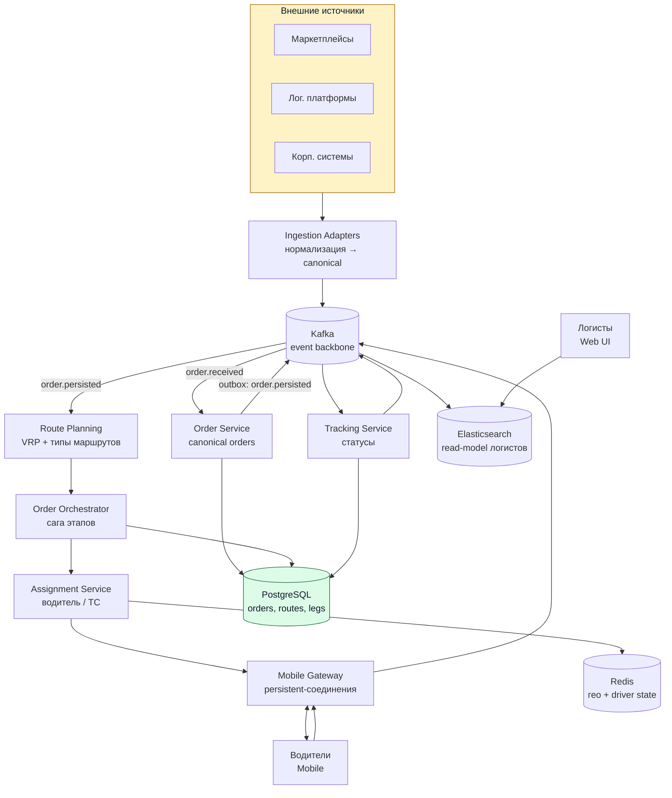

# TMS / Transport Management System

## Содержание

- [Фаза 1: Уточнение требований](#фаза-1-уточнение-требований)
- [Фаза 2: Оценка нагрузки](#фаза-2-оценка-нагрузки)
- [Фаза 3: Ключевые концепции](#фаза-3-ключевые-концепции)
- [Фаза 4: Архитектура](#фаза-4-архитектура)
- [Фаза 5: Deep Dive](#фаза-5-deep-dive)
- [Сквозные потоки](#сквозные-потоки)
- [Трейдоффы](#трейдоффы)
- [Двухминутное резюме](#двухминутное-резюме)

Разбор задачи «спроектируй систему управления перевозками (ТМС)». Проверяет умение собрать событийный пайплайн поверх разнородных источников: нормализация входящих заказов, многоэтапная доставка через хабы как бизнес-сага, консолидация заказов в маршруты через VRP и трекинг тысяч водителей в реальном времени.

> **Термины.** **ТМС** (Transport Management System) — система управления перевозками. **Хаб** — промежуточный узел (склад/РЦ), где груз передаётся с одного этапа на другой. **Маршрут (грузоперевозка)** — отрезок пути с одним исполнителем; «поездка по маршруту» = грузоперевозка. **Составной маршрут** — цепочка связанных этапов одного заказа (A→X→Y→B). **Миля** — отрезок относительно хаба (первая — сбор к хабу, последняя — развоз от хаба). **VRP** (Vehicle Routing Problem) — задача маршрутизации транспорта (NP-трудная).

---

## Фаза 1: Уточнение требований

### Функциональные требования

```text
Вопросы:
  - Источники заказов фиксированы или открытый набор интеграций?
  - Заказ = один груз или может дробиться на этапы через хабы?
  - Один маршрут везёт один заказ или консолидирует много?
  - Кто строит маршрут — система автоматически или логист вручную?
  - Назначение водителя автоматическое или это делает логист?
  - Трекинг — только статусы по этапам или ещё live-гео на карте?
```

**Договорились (scope):**
- **Приём** заказов от разнородных внешних источников (маркетплейсы, лог. платформы, корп. системы) → нормализация в единую модель.
- **Построение маршрутов**: заказ A→B, возможны хабы (A→X→Y→B); каждый этап — отдельный маршрут со своим типом и исполнителем.
- **Типы маршрутов**: магистральная (line-haul), первая миля, последняя миля, смешанный (курьерский).
- **Составной заказ**: несколько связанных этапов; согласованность и статусы этапов + заказа в целом.
- **Консолидация**: один маршрут — несколько заказов; один заказ — несколько маршрутов (many-to-many).
- **Назначение исполнителя** (водитель/ТС) на каждый маршрут.
- **Статусы и трекинг**: водители шлют статусы из мобильного приложения, система показывает текущий статус.

**Out of scope:** тарификация/биллинг, документооборот (ТТН/ЭДО), claims/страхование, складские операции внутри хаба, ML-прогноз спроса.

### Нефункциональные требования

```text
- Приём:     до 20M заказов/сутки (write-heavy, спайки от источников)
- Маршруты:  до 15K активных грузоперевозок/сутки
- Водители:  до 10K одновременно онлайн (mobile, persistent-соединение)
- Latency:   подтверждение приёма заказа < 1 сек; планирование может быть async
- Согласованность: этапы составного заказа не должны рассинхрониться
- Idempotency: повтор заказа от источника = один заказ, не дубль
- Availability: высокая (логистика операционно-критична)
- Scale:     горизонтальное масштабирование компонентов без деградации
```

---

## Фаза 2: Оценка нагрузки

```text
Приём заказов:
  20M/сутки / 86400 ≈ 231 заказ/сек в среднем
  Источники дают дневные волны → пик ×4 ≈ ~900 заказов/сек
  1 заказ ~2 KB (адреса, груз, метаданные) → 20M × 2KB = 40 GB/сутки
  → ~14.6 TB/год → партиционирование по времени + архив

Маршруты:
  15K/сутки ≈ 0.17 маршрута/сек по частоте создания — мизер,
  но планирование — VRP (NP-трудная); расчёт развоза
  на сотни точек занимает секунды-минуты процессорного времени

  Консолидация: 20M заказов / 15K маршрутов ≈ ~1300 заказов на маршрут

  Это число проверяется вслух, а не принимается молча:
    курьер на последней миле развозит 100-200 посылок в день,
    а не 1300 — физически не успеет объехать столько адресов.

  Значит 15K маршрутов — это не последняя миля:
    магистральная фура между хабами реально везёт тысячи посылок,
    и 1300 заказов на рейс для неё нормально.

  Вывод: либо в 15K считаются только магистральные и первая миля,
  а последняя миля живёт вне этих чисел (её понадобилось бы
  20M / 150 ≈ 130 тысяч маршрутов в сутки), либо «заказ» здесь —
  не отдельная посылка. Это первый вопрос интервьюеру.

  Дальше проектируем по первому прочтению: 15K — магистраль и сбор,
  а планировщик собирает заказы в пакеты по гео и временно́му окну.

Водители (10K онлайн):
  Live-гео каждые ~15 сек: 10K / 15 ≈ ~670 апдейтов/сек → Redis
  Статусные события (прибыл/загрузил/выехал), ~10/водителя/час: 10K×10/3600 ≈ ~28/сек → Kafka
```

**Выводы, влияющие на архитектуру:**
1. **Приём тяжёлый на запись и рваный.** Асинхронный буфер (Kafka) плюс адаптеры-нормализаторы, идемпотентность по `(source, external_id)`. Нормализация развязана с планированием.
2. **Планирование редкое, но упирается в процессор.** Отдельный пул воркеров вне критического пути приёма, консолидация пакетами по географии и временно́му окну.
3. **Трекинг асимметричен.** Много гео-обновлений (Redis) против мизера статусных событий (Kafka); 10 тысяч долгоживущих соединений обслуживает шлюз без состояния с маршрутизацией в Redis.
4. **Горизонтальное масштабирование.** Сервисы без состояния, партиции Kafka, партиционирование и шардирование PostgreSQL по `order_id` и времени.

---

## Фаза 3: Ключевые концепции

### Заказ ≠ маршрут: many-to-many

```text
Заказ дробится на упорядоченные этапы (legs):  A→X, X→Y, Y→B
Каждый этап исполняется ровно одним маршрутом.
Один маршрут консолидирует этапы многих заказов (один исполнитель везёт ~1300 заказов).

  Заказ ──(1:N)── Этап(leg) ──(N:1)── Маршрут(грузоперевозка) ── Исполнитель
```

Этап — это связь «заказ ↔ маршрут» с точкой погрузки, точкой разгрузки и собственным статусом.

### Типы маршрутов → разная логика планирования

| Тип | Геометрия | Логика планирования | Пример |
|---|---|---|---|
| Магистральная (line-haul) | хаб → хаб, 1→1 | фикс. точки, FTL, расписание | склад → РЦ |
| Первая миля | N погрузок → 1 разгрузка | VRP-сбор по поставщикам | сбор у поставщиков → хаб |
| Последняя миля | 1 погрузка → N разгрузок | VRP-развоз, плотная консолидация | хаб → клиенты |
| Смешанный (курьер/такси) | N ↔ N, динамически | онлайн-VRP, переназначение на лету | курьерская доставка |

Планировщик выбирает стратегию по типу этапа: общий контракт «спланируй этап» и разные реализации под ним — паттерн «стратегия» (`strategy`). Добавление нового типа маршрута не трогает существующие.

### Составной маршрут = бизнес-сага, а не транзакция

```text
A→X→Y→B — это DAG этапов с зависимостями:
  этап X→Y НЕ может стартовать, пока груз физически не передан на хабе X (этап A→X завершён).

Это долгоживущая сага (часы и сутки), а не ACID-транзакция:
  - оркестратор продвигает этапы по мере завершения предыдущих
  - компенсации при сбое (груз застрял на хабе → перепланировать остаток)
```

Идея саги/оркестрации та же, что в [11. Payment](./11-payment-system.md) и [14. Stock](./14-stock-inventory-service.md), но здесь шаги — длительные физические операции, поэтому 2PC/распределённая транзакция неприменимы.

---

## Фаза 4: Архитектура



### Роль каждого компонента

Сквозная идея — событийный пайплайн поверх единой модели заказа, где нагрузки разного характера разведены и масштабируются независимо: рваный приём (20 млн в сутки), тяжёлое планирование (редкое, но упирающееся в процессор) и трекинг в реальном времени.

**Ingestion Adapters.**
*Зачем:* по адаптеру на источник — проверяют входящие данные и переводят разные форматы в единую модель заказа, отсекают повторы по `(source, external_id)`.
*Почему отдельно:* это защитный слой (`anti-corruption layer`). Форматы источников нельзя пускать вглубь системы, иначе их различия протекут во все сервисы сразу, и добавление шестого источника потребует правок в пяти местах. Принципы контракта — [моделирование ресурсов](../../08-networking-and-api/api-design/04-resource-modeling.md), дедупликация — [идемпотентность](../reliability-patterns/06-idempotency.md).

**Kafka (event backbone).**
*Зачем:* буфер приёма (сглаживает пик ~900/сек) и шина событий между всеми сервисами.
*Почему брокер:* приём нельзя терять при спайках, а сервисы должны быть развязаны; партиции дают горизонтальный параллелизм. Профиль — [Kafka](../../07-message-brokers-and-streaming/01-kafka.md), backpressure при перегрузе — [reliability / backpressure](../reliability-patterns/05-backpressure-and-shedding.md).

**Order Service.**
*Зачем:* хранит заказы в единой модели и статус уровня заказа, выведенный из этапов. Источник правды по заказу.
*Почему PostgreSQL с партициями:* 14,6 ТБ в год требуют партиционирования по времени, а смена статуса — транзакций. См. [партиционирование](../../06-databases/database-systems-catalog/postgresql/05-partitioning.md) и [шардирование](../../06-databases/database-systems-catalog/postgresql/12-sharding.md).

**Route Planning Service (VRP).**
*Зачем:* строит этапы (через хабы), присваивает тип каждому, консолидирует заказы в маршруты (батч по гео+окну).
*Почему отдельный compute-пул:* VRP NP-трудная и тяжёлая; нельзя блокировать ею приём. Раздача расчётов — через очередь, как в [05. Task Queue](./05-task-queue.md).

**Order Orchestrator (сага).**
*Зачем:* продвигает этапы составного заказа по зависимостям (хаб-передача), агрегирует order-status, запускает компенсации.
*Почему отдельно:* это долгоживущий workflow; оркестратор — единственное место, где живёт логика «когда можно стартовать следующий этап».

**Assignment Service.**
*Зачем:* подбирает водителя/ТС под маршрут (тип, вместимость, гео, расписание), атомарно «занимает» исполнителя.
*Почему отдельно + Redis geo:* подбор по близости и предотвращение двойного назначения — та же механика, что в [06. Uber](./06-uber-ride-sharing.md) (H3 + `SET NX`). Профиль — [Redis](../../06-databases/database-systems-catalog/08-redis.md).

**Tracking Service.**
*Зачем:* принимает статусные события водителей, ведёт статус этапа, пересчитывает статус заказа, публикует события.
*Почему отдельно:* статус заказа выводится из статусов этапов, а не вводится вручную. Единственный источник правды — этапы; всё остальное считается от них.

**Mobile Gateway.**
*Зачем:* persistent-соединения с 10K водителей — пуш назначений и приём статусов/гео.
*Почему без состояния и с маршрутизацией через Redis:* 10 тысяч соединений не помещаются на один узел, а таблица `driver → узел` в Redis делает узлы взаимозаменяемыми — так же устроен слой соединений в [04. Chat](./04-chat-messaging.md). Протокол — [networking / WebSocket](../../08-networking-and-api/protocols/04-realtime/01-websocket.md).

**Elasticsearch — модель для чтения логистов.**
*Зачем:* поиск и мониторинг заказов и маршрутов в веб-интерфейсе логистов.
*Почему отдельный индекс:* логистам нужны произвольные фильтры по большому объёму, а основная база занята транзакциями по статусам. Индекс наполняется из событий, как Outbox → Elasticsearch в [13. Avito](./13-avito-classifieds.md). Профиль — [Elasticsearch](../../06-databases/database-systems-catalog/09-elasticsearch-and-opensearch.md).

---

## Фаза 5: Deep Dive

### Нормализация в единую модель заказа

```text
Каждый источник → свой Adapter:
  - валидация по схеме источника
  - маппинг в Canonical Order (единые поля: origin, destination, cargo, constraints)
  - идемпотентность: UNIQUE (source, external_id) → повтор не создаёт дубль

  INSERT INTO orders (id, source, external_id, origin, destination, cargo, status='RECEIVED')
    ON CONFLICT (source, external_id) DO NOTHING;   -- повтор от источника безопасен
```

Адаптер работает как защитный слой (`anti-corruption layer`): добавление нового источника сводится к новому адаптеру, ядро системы не меняется.

### Модель данных: заказ, этап, маршрут

```sql
CREATE TABLE orders (
  id           UUID PRIMARY KEY,
  source       TEXT NOT NULL,
  external_id  TEXT NOT NULL,
  origin       JSONB NOT NULL,        -- точка A
  destination  JSONB NOT NULL,        -- точка B
  cargo        JSONB NOT NULL,        -- вес/объём/позиции
  status       TEXT NOT NULL,         -- RECEIVED→PLANNED→IN_TRANSIT→DELIVERED/CANCELLED (производный)
  created_at   TIMESTAMPTZ NOT NULL DEFAULT now(),
  UNIQUE (source, external_id)
);

CREATE TABLE routes (                  -- грузоперевозка
  id            UUID PRIMARY KEY,
  type          TEXT NOT NULL,         -- LINE_HAUL / FIRST_MILE / LAST_MILE / MIXED
  status        TEXT NOT NULL,         -- PLANNED→ASSIGNED→IN_PROGRESS→COMPLETED
  driver_id     UUID, vehicle_id UUID,
  planned_at    TIMESTAMPTZ
);

CREATE TABLE order_legs (              -- этап = связь заказ↔маршрут (many-to-many)
  id           UUID PRIMARY KEY,
  order_id     UUID NOT NULL REFERENCES orders(id),
  route_id     UUID REFERENCES routes(id),
  leg_index    INT  NOT NULL,          -- порядок этапа в составном заказе
  pickup       JSONB NOT NULL,         -- где грузим (A или хаб)
  dropoff      JSONB NOT NULL,         -- где разгружаем (хаб или B)
  status       TEXT NOT NULL,          -- PENDING→ASSIGNED→PICKED_UP→DROPPED_OFF
  UNIQUE (order_id, leg_index)
);
```

`order_legs` — стержень модели: даёт и дробление заказа на этапы (`leg_index`), и консолидацию (много `order_legs` ссылаются на один `route_id`).

### Оркестрация составного заказа

```text
Этапы заказа A→X→Y→B = упорядоченный DAG: leg[i] зависит от leg[i-1] (хаб-передача).

Orchestrator (реагирует на события статусов):
  on leg[i].DROPPED_OFF at hub:
      mark leg[i] = DONE
      if exists leg[i+1]:
          leg[i+1].status = READY        -- разблокировать
          publish leg.ready(leg[i+1])    -- Assignment подхватит
      else:
          order.status = DELIVERED

  Компенсация (груз застрял / исполнитель сорвался на хабе):
      перепланировать оставшиеся этапы (Planner), не трогая уже доставленные
```

Статус заказа всегда выводится из статусов этапов, руками его не выставляет никто.

### Консолидация и планирование (VRP)

```text
Planner работает пакетами, а не по одному заказу — иначе консолидации не будет:
  1. Накопить заказы за временно́е окно (напр. cut-off для зоны)
  2. Сгруппировать по гео-зоне и хабу
  3. Для каждой группы — VRP по типу этапа:
       last-mile: 1 хаб → N клиентов, минимизировать пробег/время
  4. Сформировать routes + привязать order_legs

Масштаб: ~1300 заказов/маршрут → VRP на сотни-тысячи точек.
  Решается эвристиками (Clarke-Wright, OR-Tools), не точным перебором.
  Тяжёлый расчёт → отдельный воркер-пул, очередь задач (см. кейс 05).
```

### Назначение исполнителя

```text
Для этапа в статусе READY:
  Кандидаты по жёстким ограничениям:
    - тип ТС подходит грузу (рефрижератор/тент/габариты)
    - вместимость >= груз
    - гео-близость к точке погрузки  → Redis geo (как H3 в Uber)
    - расписание/смена водителя
  Выбор лучшего по стоимости/ETA → атомарно занять на время принятия:
    SET driver:{id}:offer {route_id} NX EX 60   -- нет двойного предложения
  Пуш назначения водителю через Mobile Gateway.

Логист может override автоматическое назначение через Web UI.
```

**Занятость на рейс — не Redis-лок, а статус в БД.** Здесь та же ловушка, что в [06. Uber](./06-uber-ride-sharing.md): короткий `NX`-ключ закрывает лишь окно принятия предложения (десятки секунд), а рейс длится часы. Если полагаться только на него, водитель через минуту снова окажется «свободным» для планировщика, находясь в дороге.

```text
Два состояния с разным временем жизни:

1. driver:{id}:offer   — Redis, TTL ~60 с
   Чтобы два маршрута не предложили одного водителя одновременно.

2. driver_status       — PostgreSQL, меняется вместе со статусом маршрута
   AVAILABLE | OFFERED | ON_ROUTE | OFF_SHIFT
   Освобождает не таймер, а завершение рейса.

Планировщик отбирает только AVAILABLE. Потеря Redis не «отпускает»
занятых: статусы восстанавливаются из активных маршрутов в БД.
```

Геопоиск кандидатов и механика `NX`-лока — детально в [06. Uber](./06-uber-ride-sharing.md).

### Трекинг и статусы

```text
Водитель (Mobile) → Mobile Gateway:
  - статусные события: «прибыл», «загрузил», «выехал», «разгрузил» → Kafka (надёжно)
  - живое гео каждые ~15 сек                                      → Redis (можно терять)

Tracking Service (консьюмер Kafka):
  - переводит статус этапа по конечному автомату
  - публикует leg.status_changed → Orchestrator (двигает сагу) + ES (read-model)

Конечный автомат этапа:
  ASSIGNED → EN_ROUTE_PICKUP → AT_PICKUP → PICKED_UP
           → EN_ROUTE_DROPOFF → AT_DROPOFF → DROPPED_OFF
```

Гео живёт в Redis и теряется без последствий: пропажа пары точек на карте ничего не меняет. Статусы идут через Kafka надёжно, потому что двигают бизнес-процесс: пропущенное «разгрузил» на хабе остановит всю цепочку этапов. То же разделение «отображение против решения», что в [14. Stock](./14-stock-inventory-service.md).

### Масштабирование

```text
- Приём:        партиции Kafka по source/region; адаптеры stateless, скейлятся по lag
- Order/Route:  PostgreSQL — партиции по времени (orders), шард по order_id
- Планирование: воркер-пул, автоскейл по глубине очереди задач
- Mobile GW:    stateless ноды + Redis routing; 10K соединений / ~50K на ноду
- Трекинг:      гео в Redis Cluster (шард по driver_id), статусы через Kafka
```

---

## Сквозные потоки

**1. Приём и нормализация заказа.**
Источник → адаптер проверяет данные и переводит их в единую модель → `ON CONFLICT (source, external_id) DO NOTHING` → событие `order.received` в Kafka → быстрое подтверждение источнику.
*Итог:* разные форматы сведены к единой модели; повтор от источника не создаёт дубль; пик приёма поглощён брокером.

**2. Планирование составного маршрута.**
Order Service сохранил заказ и выпустил через outbox `order.persisted` → Planner батчит заказы по гео+окну → строит этапы A→X→Y→B, присваивает типы, VRP-консолидирует в маршруты → создаёт `routes` + `order_legs`, заказ → PLANNED.
*Итог:* заказ разбит на связанные этапы; географически близкие заказы консолидированы в общие грузоперевозки.

> **Почему Planner слушает `order.persisted`, а не `order.received`.** Если оба сервиса читают одно и то же событие приёма параллельно, планировщик может начать работу с заказом, которого ещё нет в базе — и сослаться на несуществующую строку. Порядок обязан быть таким: сначала Order Service надёжно сохраняет заказ, и уже сам факт сохранения — через outbox в той же транзакции — порождает событие для планирования.

**3. Назначение исполнителя и старт этапа.**
Этап в READY (первый — сразу, прочие — после разблокировки) → Assignment подбирает водителя/ТС по ограничениям+гео → `SET NX` занимает → пуш в Mobile Gateway водителю.
*Итог:* каждый этап получает подходящего исполнителя без двойного назначения; зависимые этапы ждут своей очереди.

**4. Передача на хабе и продвижение саги.**
Водитель этапа A→X шлёт «разгрузил» на хабе X → Tracking → `leg.DROPPED_OFF` → Orchestrator закрывает этап и переводит X→Y в READY → Assignment назначает исполнителя следующего этапа.
*Итог:* следующий этап стартует только после физической передачи груза; согласованность этапов держит оркестратор, а не распределённая транзакция.

**5. Трекинг и агрегация статуса.**
Статусы водителей → Kafka → Tracking обновляет статусы этапов → статус заказа пересчитывается из этапов → событие → индекс Elasticsearch для чтения.
*Итог:* логисты и клиенты видят актуальный статус заказа, всегда производный от этапов — без ручного рассинхрона.

---

## Трейдоффы

| Решение | Принятое | Альтернатива | Причина |
|---|---|---|---|
| Приём заказов | Асинхронно через Kafka и адаптеры | Синхронный REST прямо в планирование | 20 млн в сутки с пиками; нормализация развязана с расчётом |
| Нормализация | Единая модель заказа, защитный слой | Работать с форматами источников напрямую | Различия источников иначе протекают во все сервисы |
| Многоэтапность | Бизнес-сага, оркестратор над графом этапов | Распределённая транзакция | Этапы длятся часами, двухфазный коммит неприменим |
| Заказ ↔ маршрут | Связь «многие ко многим» через `order_legs` | Один заказ = один маршрут | Консолидация ~1300 заказов на маршрут |
| Планирование | Отдельный пул воркеров, пакетами | Планировать в потоке приёма | VRP относится к NP-трудным, приём блокировать нельзя |
| Триггер планирования | `order.persisted` из outbox | `order.received` напрямую | Иначе планировщик увидит заказ раньше, чем тот сохранён |
| Занятость водителя | Статус в БД по жизненному циклу рейса | Только ключ в Redis с TTL | Ключ на минуту истечёт посреди многочасового рейса |
| Статус заказа | Выводится из статусов этапов | Хранить и выставлять вручную | Единственный источник правды — этапы, рассинхрона нет |
| Хранилище | PostgreSQL с партициями по времени | Один экземпляр или NoSQL | 14,6 ТБ в год плюс транзакции на смену статуса |
| Трекинг водителей | Шлюз без состояния, маршруты в Redis | Липкие сессии на узле | 10 тысяч соединений, отказоустойчивость |
| Гео против статусов | Гео в Redis, статусы в Kafka | Всё в одном хранилище | Потеря точки на карте безобидна, потеря статуса останавливает цепочку этапов |

---

## Двухминутное резюме

> ТМС — это событийный пайплайн с тремя разными по характеру нагрузками, которые я развожу: рваный приём 20 млн заказов в сутки, тяжёлое планирование маршрутов и трекинг 10 тысяч водителей в реальном времени.
>
> Приём: на каждый внешний источник — адаптер, защитный слой, который нормализует формат в единую модель заказа и отсекает дубли по `(source, external_id)`. Всё льётся в Kafka: буфер поглощает пик около 900 заказов в секунду и развязывает приём с планированием.
>
> Прежде всего проверю числа вслух: 20 миллионов заказов на 15 тысяч маршрутов дают 1300 заказов на рейс. Для последней мили это невозможно — курьер развозит 100-200 посылок в день; а вот для магистральной фуры между хабами тысяча посылок нормальна. Значит либо 15 тысяч — это магистраль и первая миля, а последняя миля потребует порядка 130 тысяч маршрутов, либо «заказ» здесь не отдельная посылка. Это первый вопрос интервьюеру.
>
> Модель: заказ дробится на упорядоченные этапы (A→X→Y→B), каждый этап исполняет один маршрут, а один маршрут консолидирует этапы многих заказов. Стержень — таблица `order_legs`, связь «многие ко многим» между заказом и маршрутом. Тип этапа — магистраль, первая миля, последняя миля или смешанный — выбирает стратегию планирования. VRP относится к NP-трудным, поэтому считается в отдельном пуле воркеров пакетами по гео и временному окну.
>
> Составной заказ — это долгоживущая бизнес-сага, а не транзакция: оркестратор продвигает этап X→Y только после того, как груз физически передан на хабе X. Двухфазный коммит здесь неприменим, потому что этапы длятся часами.
>
> Назначение водителя устроено как подбор в Uber: кандидаты по вместимости, типу транспорта и близости через гео-индекс в Redis, атомарный `SET NX` против двойного назначения. Занятость на рейс при этом хранится не в Redis, а статусом в базе: короткий ключ с TTL истечёт посреди многочасовой поездки.
>
> Трекинг разделён по цене потери: статусы водителей идут надёжно через Kafka, потому что двигают сагу, а живое гео живёт в Redis и теряется без последствий. Статус заказа всегда выводится из статусов этапов.
>
> Масштабирование — сервисы без состояния, партиции Kafka, партиционирование и шардирование PostgreSQL, WebSocket-шлюз с маршрутизацией через Redis.
