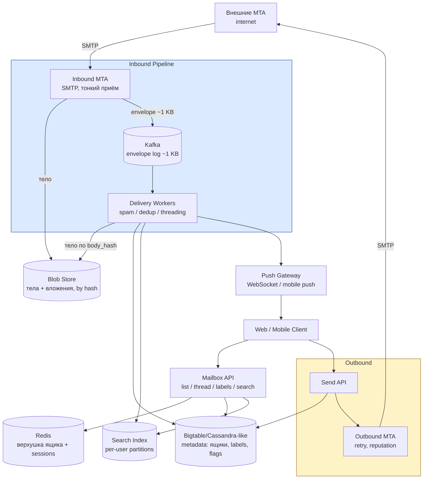

# Gmail / Email Service

## Содержание

- [Фаза 1: Уточнение требований](#фаза-1-уточнение-требований)
- [Фаза 2: Оценка нагрузки](#фаза-2-оценка-нагрузки)
- [Фаза 3: Ключевые концепции](#фаза-3-ключевые-концепции)
- [Фаза 4: Архитектура](#фаза-4-архитектура)
- [Фаза 5: Deep Dive](#фаза-5-deep-dive)
- [Сквозные потоки](#сквозные-потоки)
- [Трейдоффы](#трейдоффы)
- [Interview-ready ответ (2 минуты)](#interview-ready-ответ-2-минуты)

Разбор задачи "Спроектируй Gmail (email-сервис)". Проверяет работу с write-heavy пайплайном приёма, хранилищем экзабайтного масштаба со строгой per-user локальностью, разделением immutable-контента и mutable-метаданных, дедупликацией массовых рассылок и per-user поиском.

> **Термины.** **SMTP** (Simple Mail Transfer Protocol) — протокол передачи почты между серверами. **MTA** (Mail Transfer Agent) — сервер, принимающий/отправляющий почту по SMTP. **MX-запись** — DNS-запись, указывающая, какой MTA принимает почту домена. **IMAP** — протокол доступа клиента к ящику (legacy-клиенты; веб/мобильный Gmail ходят через API). **Тред (conversation)** — цепочка связанных писем. **Blob store** (blob = Binary Large OBject) — хранилище больших неизменяемых бинарных объектов по схеме «ключ → байты» (`PUT`/`GET` по ключу, без запросов внутрь). Content-addressed = ключ есть хеш содержимого (SHA-256), отсюда автодедуп (одинаковое тело → один ключ) и иммутабельность. На практике — object storage ([S3/GCS/Azure Blob](../../10-devops-and-observability/cloud/01-aws-core-services.md)).

---

## Фаза 1: Уточнение требований

### Функциональные требования

```
Вопросы:
  - Полный Gmail или ядро: приём, отправка, чтение, поиск?
  - Папки или labels (Gmail-модель: письмо в нескольких ярлыках сразу)?
  - Треды (conversation view) — в scope?
  - Спам-фильтрация — в scope (хотя бы как компонент)?
  - Вложения: лимит размера, хранение?
  - Поддержка сторонних клиентов (IMAP/POP3) или только свои?
```

**Договорились (scope):**
- Приём входящей почты (SMTP от внешних MTA) и отправка исходящей.
- Чтение: список ящика, тред-view, пагинация.
- **Labels вместо папок**: письмо может иметь несколько ярлыков (Inbox, Work, Starred).
- Флаги read/unread, star; треды (conversation threading).
- Поиск по своей почте (from/to/subject/body).
- Вложения до 25 MB.
- Спам-фильтр как компонент пайплайна (без ML deep dive).
- Push нового письма в открытый клиент (web/mobile).

**Out of scope:** IMAP/POP3-совместимость (упомянуть), календарь/контакты, end-to-end шифрование, snooze/schedule send, фильтры-правила пользователя.

### Нефункциональные требования

```
- Аккаунты: 1B; DAU 500M
- Durability: письмо, за которое ответили 250 OK по SMTP, НЕЛЬЗЯ потерять
- Latency: открытие inbox < 300 мс p99; поиск < 1 сек; новое письмо в клиенте < 5 сек
- Availability: 99.99% — почта операционно-критична
- Consistency: сильная в рамках одного ящика (пометил read → не «отпрыгивает»),
  между ящиками — независимость (шардинг по пользователю)
- Privacy: доступ строго к своему ящику
```

---

## Фаза 2: Оценка нагрузки

```
Входящие:
  500M DAU × 40 писем/день = 20B писем/день
  20B / 86400 ≈ 230K писем/сек, пик ×3 ≈ 700K/сек
  → это доминирующая write-нагрузка; принимать синхронно всё нельзя — нужен буфер

Исходящие:
  500M × 5 = 2.5B/день ≈ 29K/сек — на порядок меньше приёма

Storage:
  Среднее письмо ~75 KB (заголовки+тело; вложения амортизированно)
  20B × 75KB ≈ 1.5 PB/день сырого потока
  1B аккаунтов × ~5 GB занято в среднем = ~5 EB (экзабайты!) суммарно
  → но ~60-70% входящего — РАССЫЛКИ: одно и то же тело у миллионов получателей
  → content-addressed дедупликация тел/вложений режет объём в разы

Через Kafka (важно: это НЕ 700K сообщений, а 700K × 75 KB):
  сырое письмо × пик = 700K × 75KB ≈ 52 GB/сек — гнать ТАКОЕ через Kafka нельзя
  (× RF3 репликация + чтение консьюмерами → сотни GB/сек сети, ~180 TB/час на диск)
  → claim-check: тело → Blob Store, в Kafka только envelope ~1 KB
    {msg_id, recipient, body_hash, from, subject}
  → 700K × 1KB ≈ 700 MB/сек — комфортно для скромного кластера

  ЧЕСТНАЯ ОГОВОРКА: claim-check убирает не 52 GB/сек как таковые,
  а их УСИЛЕНИЕ. Сами 52 GB/сек всё равно приходят на MTA — это то,
  что шлют отправители, и от нас не зависит. Экономим мы на другом:
    - Kafka не хранит и не реплицирует тела (×3 по RF)
    - консьюмеры не вычитывают их повторно
    - тело пишется в Blob один раз на хеш, а не на каждого получателя
  Итого: сеть на приёме остаётся, исчезает многократное копирование.

Запись метаданных — считать обязательно, это устойчивая нагрузка:
  на каждую доставку пишем messages_by_user + label_index + threads_by_user
  700K/сек × ~3 записи ≈ 2,1 млн записей/сек в пик

  → реляционная БД такое не примет; отсюда wide-column и шард по user_id

Индексация для поиска:
  каждое доставленное письмо надо проиндексировать: те же 700K/сек,
  и это дороже обычной записи (токенизация + обновление posting lists)
  → индексатор асинхронный и отстающий: поиск догоняет за секунды,
    это допустимо, а вот блокировать им доставку нельзя

Чтение:
  500M DAU × 20 открытий списка/день ≈ 115K reads/сек — read-heavy metadata
  Паттерн: 90% обращений — к последним ~50 письмам ящика → кеш «верхушки» ящика

Поиск:
  500M × 2 поиска/день ≈ 11K запросов/сек, каждый — СТРОГО в рамках одного ящика
  → глобальный индекс не нужен, per-user партиционирование индекса
```

**Выводы, влияющие на архитектуру:**
1. **700K × 75 KB ≈ 52 GB/сек** — сырые письма через Kafka гнать нельзя. Claim-check: тело → Blob Store (durable), в Kafka только envelope ~1 KB (~700 MB/сек). MTA отвечает `250 OK` после двух быстрых durable-записей (Blob + envelope); тяжёлый пайплайн асинхронный.
2. **Экзабайты, но данные строго per-user** → шардинг по `user_id`, wide-column хранилище; все письма пользователя вместе (локальность чтения).
3. **Рассылки → дедуп**: тело письма immutable → хранить один раз по хешу, у получателей — ссылки + личные метаданные.
4. **Письмо immutable, состояние mutable** → разделить: blob (тело) никогда не меняется, метаданные (labels, read, star) меняются часто и весят байты.
5. **Поиск per-user** → индекс шардируется вместе с ящиком, запрос трогает один шард.

---

## Фаза 3: Ключевые концепции

### Immutable blob + mutable metadata

```
Письмо после приёма НЕ меняется никогда (тело, заголовки, вложения).
Меняется только СОСТОЯНИЕ письма в ящике получателя: labels, read/unread, star.

  Blob Store (immutable):   body_hash → тело письма (дедуплицировано)
  Metadata Store (mutable): (user_id, message_id) → {labels, flags, thread_id, ссылка на blob}

Зачем разделять:
  + запись состояния (пометить read) — байты, а не перезапись 75 KB
  + дедуп рассылок возможен ТОЛЬКО для immutable-тела
  + кеш блобов не инвалидируется — они не меняются
```

Тот же принцип, что content-addressed chunks в [10. Google Drive](./10-google-drive.md): неизменяемый контент по хешу + изменяемые метаданные отдельно.

### Labels вместо папок

```
Папка: письмо лежит РОВНО в одном месте (иерархия ФС).
Label:  письмо имеет НАБОР ярлыков → одно письмо видно в Inbox И в Work И в Starred.

Модель: Inbox, Sent, Spam, Trash — это тоже labels (системные).
  «Удалить из Inbox» = снять label INBOX, письмо остаётся в All Mail.
  → все виды ящика — это ЗАПРОСЫ ПО LABEL, единая модель чтения:
     список ящика = «письма пользователя с label X, отсортированные по времени»
```

### Дедупликация рассылок

```
Newsletter уходит 10M получателей:
  Наивно: 10M × 75 KB = 750 GB на ОДНО письмо рассылки
  Дедуп:  body_hash = SHA-256(канонизированное тело)
          тело хранится ОДИН раз; у каждого получателя — метаданные (~200 B) со ссылкой
          10M × 200 B = 2 GB метаданных + 75 KB тела
  → экономия ×375; на 60-70% трафика (рассылки) это режет экзабайты
```

---

## Фаза 4: Архитектура



### Роль каждого компонента

Сквозная идея — **тонкий durable-приём + асинхронный пайплайн доставки**: MTA кладёт тело в Blob Store и envelope (~1 KB) в Kafka, отвечает `250 OK` — а спам/threading/индексация/пуш происходят потом; чтение обслуживается metadata-хранилищем с per-user локальностью.

**Inbound MTA (SMTP)** — тонкий приём по SMTP.
- *Зачем:* принимает соединения внешних MTA, базовые проверки (SPF/DKIM-подписи, rate limit по IP); вычисляет `body_hash`, durable-кладёт тело в Blob Store, а в Kafka пишет только envelope (~1 KB) — и отвечает `250 OK`.
- *Почему так (claim-check):* сырые письма — это ~52 GB/сек (700K × 75 KB), через Kafka их гнать нельзя. Тело едет в Blob напрямую, Kafka несёт лёгкий указатель; `250 OK` = обещание durability, поэтому синхронны только две быстрые durable-записи (Blob + envelope), а тяжёлое — потом.

**Kafka (envelope log)** — очередь указателей, не тел.
- *Зачем:* несёт envelope-события `{msg_id, recipient, body_hash, from, subject}` (~1 KB) между приёмом и обработкой; сглаживает пики, даёт replay при сбое воркеров.
- *Почему только envelope:* тело через Kafka = ~52 GB/сек, и это ещё до умножения на RF3 и на чтение консьюмерами. Envelope-поток — ~700 MB/сек. Оговорка: сами 52 GB/сек всё равно приходят на MTA от отправителей — claim-check убирает не приём, а многократное копирование тела внутри системы. Durability держат запись тела в Blob + `acks=all`/RF3 на envelope. Профиль — [Kafka](../../07-message-brokers-and-streaming/01-kafka.md), поглощение пиков — [reliability / backpressure](../reliability-patterns/05-backpressure-and-shedding.md).

**Delivery Workers** — асинхронная обработка письма.
- *Зачем:* по envelope из Kafka подтягивают тело из Blob по `body_hash`, делают спам-скоринг, threading (привязка к треду), пишут метаданные, триггерят индексацию и пуш.
- *Почему асинхронно:* эти шаги тяжёлые (спам-ML, парсинг MIME) и не влияют на гарантию приёма; воркеры скейлятся по lag'у. Идемпотентность по `Message-ID` — replay из Kafka не создаёт дублей: [reliability / idempotency](../reliability-patterns/06-idempotency.md).

**Blob Store (immutable, content-addressed)** — хранилище тел и вложений.
- *Зачем:* тела писем и вложения по `body_hash`, один раз на всех получателей; запись — уже на приёме (MTA), дедуп здесь же (`PUT if absent`).
- *Почему отдельно от метаданных:* блобы immutable и огромны (PB/день), метаданные mutable и крошечны — у них разные хранилища и жизненные циклы; ref-count + GC при удалении у всех получателей (как chunks в [10. Google Drive](./10-google-drive.md)).

**Metadata Store (Bigtable/Cassandra-like)** — mutable-состояние ящиков.
- *Зачем:* состояние ящиков — `(user_id, ...)` → письма, labels, flags, треды.
- *Почему wide-column с шардингом по user_id:* экзабайтный суммарный объём при строгой per-user локальности — row key `user_id` кладёт весь ящик на один шард, чтение списка = один range-scan. Профиль — [Cassandra](../../06-databases/database-systems-catalog/05-cassandra.md).

**Search Index (per-user)** — per-user поисковый индекс.
- *Зачем:* полнотекстовый поиск по своему ящику.
- *Почему партиции по пользователю:* запрос всегда ограничен одним ящиком — глобальный индекс не нужен, per-user партиция даёт изоляцию и дешёвый запрос. Механика инвертированного индекса — [Elasticsearch / OpenSearch](../../06-databases/database-systems-catalog/09-elasticsearch-and-opensearch.md).

**Redis (верхушка ящика)** — кеш горячего чтения.
- *Зачем:* кеш последних ~50-100 записей Inbox активных пользователей + сессии.
- *Почему:* 90% чтений — «открыть inbox» по последним письмам; кеш верхушки снимает основной read-трафик с metadata-хранилища. Профиль — [Redis](../../06-databases/database-systems-catalog/08-redis.md), паттерн — [caching / Redis as cache](../../06-databases/caching/01-redis-as-cache.md).

**Outbound MTA** — исходящая SMTP-доставка.
- *Зачем:* отправка во внешний мир: DKIM-подпись, поиск MX получателя, SMTP-доставка, retry при временных отказах, управление IP-репутацией.
- *Почему отдельно:* внешние MTA медленные и капризные (greylisting, 4xx) — ретраи с backoff часами живут в своей очереди, не трогая приём: [reliability / retries & backoff](../reliability-patterns/02-retries-and-backoff.md).

**Push Gateway** — real-time-доставка в клиент.
- *Зачем:* мгновенное «новое письмо» в открытые web/mobile-клиенты (WebSocket/SSE; закрытым — mobile push).
- *Почему stateless + routing в Redis:* тот же connection-слой, что в [04. Chat](./04-chat-messaging.md); протоколы — [WebSocket](../../08-networking-and-api/protocols/04-realtime/01-websocket.md), [SSE](../../08-networking-and-api/protocols/04-realtime/02-sse.md).

**Mailbox API** — чтение ящика для клиентов.
- *Зачем:* list/thread/labels/search/flags для клиентов.
- *Почему отдельно от приёма:* read-path со своим бюджетом (300 мс p99) и кешами; масштабируется независимо от inbound-пика.

---

## Фаза 5: Deep Dive

### Модель данных (wide-column)

```
Row key = user_id → весь ящик на одном шарде (локальность!)

messages_by_user:
  (user_id) | msg_id DESC (time-ordered id) →
      thread_id, body_hash, from, to, subject_snippet,
      labels: {INBOX, WORK}, flags: {unread, starred}, size, ts

threads_by_user:
  (user_id) | thread_last_ts DESC, thread_id →
      subject, participants, msg_count, unread_count, label_set

label_index (для списков по label):
  (user_id, label) | msg_id DESC → thread_id
  → «открыть Inbox» = range-scan (user_id, INBOX) LIMIT 50 — один шард, один scan
```

`msg_id` — time-ordered (Snowflake-подобный, как в [04. Chat](./04-chat-messaging.md)): сортировка по времени без отдельного поля, cursor-пагинация «старее чем».

### Inbound-пайплайн: от SMTP до ящика

```
1. Внешний MTA → SMTP-сессия с Inbound MTA
   MTA: SPF/DKIM-проверка, rate limit по IP отправителя
   → body_hash = SHA-256 считается ПОТОКОМ, пока письмо принимается
   → проверка существования: есть ли уже блоб с таким хешем?
       есть  → тело НЕ пишем (рассылка: 10M получателей, один блоб)
       нет   → PUT в Blob Store
   → envelope {msg_id, recipient_user_id, body_hash, from, subject, size} в Kafka,
     key = recipient_user_id
   → 250 OK  (только после ack Blob + Kafka — durability!)

   Existence-check здесь не оптимизация, а необходимость: без него
   рассылка на 10M адресов запишет один и тот же блоб 10M раз.
   Проверка идёт по индексу хешей (Redis/метаданные блобов) —
   это дёшево, в отличие от самой записи 75 KB.

2. Delivery Worker (консьюмер envelope):
   a. Идемпотентность: Message-ID + recipient уже обработан? → skip (replay-safe)
   b. GET тело из Blob по body_hash (для спама и парсинга MIME)
   c. Спам-скоринг → label SPAM вместо INBOX (письмо ВСЁ РАВНО доставляется — в спам)
   d. Threading: References/In-Reply-To заголовки → найти thread_id, иначе новый тред
   e. Записать метаданные: messages_by_user, label_index, threads_by_user (+unread)
   f. Индексация: терм-документы в per-user партицию поискового индекса
   g. Push: событие в Push Gateway → «новое письмо» в открытый клиент
```

Партиционирование Kafka по получателю сохраняет порядок писем одного ящика и раскладывает нагрузку.

### Threading (conversation)

```
Стандартные заголовки RFC 5322:
  Message-ID:   уникальный id письма (генерирует отправитель)
  In-Reply-To:  id письма, на которое отвечают
  References:   цепочка id всех предков

Алгоритм: lookup References/In-Reply-To в ящике получателя
  → нашли тред → привязать; не нашли → fallback по нормализованному Subject
  ("Re: Re: Отчёт" → "Отчёт") в окне времени; иначе — новый тред.

Важно: thread_id — PER-USER. Одно и то же письмо у разных получателей
может лечь в разные треды (у каждого своя история переписки).
```

### Отправка и ретраи (SMTP наружу)

```
POST /send → Send API:
  1. Записать в Sent ящика отправителя (metadata + blob) — мгновенно видно в UI
  2. Внутренним получателям (@gmail): напрямую в их ящики через тот же delivery-пайплайн
     (не гонять по SMTP через интернет!)
  3. Внешним: задача Outbound MTA в очередь

Outbound MTA:
  MX-lookup домена → SMTP-сессия → DKIM-подпись
  Ответ 2xx → доставлено
  Ответ 4xx (greylisting, временная ошибка) → retry с backoff: 1м → 5м → 30м → 2ч... до ~24ч
  Ответ 5xx / истёк срок → bounce-письмо отправителю (DSN)

IP-репутация: прогрев IP, отдельные пулы для «чистого» и bulk-трафика,
  rate limit per-домен получателя (Gmail сам режет спамящих).
```

Очередь ретраев с backoff — та же механика delayed-задач, что в [05. Task Queue](./05-task-queue.md).

### Поиск

```
Индексация (в delivery-пайплайне, асинхронно, < секунд после доставки):
  Токенизация from/to/subject/body → posting lists в партиции user_id

Запрос: "from:boss отчёт has:attachment"
  → парсинг операторов + термы → intersect posting lists ОДНОЙ партиции
  → ранжирование по времени (почта — не web: recency важнее relevance)

Партиция per-user маленькая (тысячи-миллионы документов) → intersect за мс.
Шардится ВМЕСТЕ с ящиком → поиск не покидает шард пользователя.
```

### Чтение ящика и консистентность

```
GET /inbox:
  1. Redis: верхушка label_index (последние ~50) активного пользователя → hit: собрать ответ
  2. Miss: range-scan label_index (user_id, INBOX) LIMIT 50 → прогреть кеш

Пометить read / поставить label:
  Запись flags/labels в metadata (байты) + инвалидация верхушки кеша
  Синхронизация ВКЛАДОК одного пользователя: событие через Push Gateway
  → пометил read на телефоне → бейдж на десктопе обновился

Консистентность в рамках ящика — сильная (все операции на одном шарде,
quorum-запись); между ящиками согласовывать нечего.
```

---

## Сквозные потоки

**1. Приём входящего письма.**
Внешний MTA → Inbound MTA (SPF/DKIM, rate limit) → тело в Blob Store (дедуп по `body_hash`) + envelope ~1 KB в Kafka → `250 OK` → Delivery Worker: тянет тело из Blob → спам-скоринг → threading → метаданные + индекс → push в открытый клиент.
*Итог:* durability — в момент `250 OK` (тело в Blob + envelope в Kafka); через Kafka идёт ~1 KB на письмо, не 75 KB, а весь тяжёлый пайплайн асинхронный; письмо в клиенте < 5 сек.

**2. Рассылка на 10M получателей.**
Первый экземпляр кладёт тело в Blob Store; остальные 10M доставок находят `body_hash` существующим → пишут только ~200 B метаданных на получателя.
*Итог:* 750 GB превращаются в ~2 GB; дедуп работает потому, что тело immutable.

**3. Открытие Inbox и работа с письмом.**
`GET /inbox` → Redis-верхушка (hit) или range-scan `(user_id, INBOX)` на одном шарде → пометка read пишет байты флагов → push синхронизирует другие вкладки/устройства.
*Итог:* p99 < 300 мс за счёт локальности ящика и кеша верхушки; состояние не «отпрыгивает» — ящик консистентен.

**4. Отправка внешнему получателю.**
Send API мгновенно кладёт письмо в Sent → Outbound MTA: MX-lookup → SMTP → при 4xx ретраи с backoff до ~24ч → при окончательном отказе bounce (DSN) отправителю.
*Итог:* UI не ждёт внешний мир; временные отказы чужих серверов рассасываются ретраями, о невозможности доставки пользователь узнаёт явно.

**5. Поиск.**
Запрос с операторами → intersect posting lists в per-user партиции (на том же шарде, что ящик) → ранжирование по recency.
*Итог:* < 1 сек, потому что запрос никогда не покидает партицию одного пользователя.

---

## Трейдоффы

| Решение | Принятое | Альтернатива | Причина |
|---|---|---|---|
| Приём | Тонкий MTA + durable-запись, пайплайн async | Синхронная полная обработка | 700K/сек пик; 250 OK = обещание, дальше можно async |
| Что кладём в Kafka | Envelope ~1 KB (claim-check), тело → Blob | Сырое письмо 75 KB в Kafka | 52 GB/с × RF3 × чтение консьюмерами; сам приём при этом не уменьшается |
| Запись тела | Existence-check по хешу перед PUT | Всегда PUT | Рассылка на 10M иначе запишет один блоб 10M раз |
| Индексация поиска | Асинхронная, догоняющая | Синхронно при доставке | 700K/с токенизации нельзя ставить на путь доставки |
| Организация ящика | Labels (набор) | Папки (иерархия) | Одно письмо в N представлениях; все view = запрос по label |
| Хранение письма | Immutable blob + mutable metadata | Единый mutable-документ | Дедуп возможен только для immutable; флаги — байты, не 75 KB |
| Дедуп | Cross-user по body_hash | Хранить каждому копию | 60-70% трафика — рассылки; экономия в разы на EB-масштабе |
| Metadata store | Wide-column, шард по user_id | Реляционная БД | EB-масштаб + строгая per-user локальность чтения |
| Поиск | Per-user партиции индекса | Глобальный индекс | Запрос всегда в одном ящике; изоляция и приватность |
| Threading | Заголовки RFC (References) + fallback | Только по Subject | Subject ненадёжен (переводы, «Re:»); заголовки — стандарт |
| Новая почта | Push (WS/SSE + mobile push) | Polling клиента | < 5 сек до клиента; 500M поллеров задушили бы API |
| Внешняя доставка | Retry с backoff до 24ч + bounce | Fail fast | SMTP-мир полон временных 4xx (greylisting) — это норма |

### Почему не реляционная БД для ящиков?

```
20B вставок/день + EB суммарного объёма → за пределами вертикали любой SQL.
Но ключевое — паттерн доступа: ВСЕ запросы замкнуты на user_id.
  → wide-column с row key = user_id: ящик на одном шарде,
    список = один range-scan, никаких cross-shard JOIN'ов не существует в природе.
Транзакционность нужна только в рамках одного ящика → quorum-запись на его шарде.
```

---

## Interview-ready ответ (2 минуты)

> "Email — это write-heavy пайплайн приёма плюс хранилище с идеальной шардируемостью: все данные и запросы замкнуты на пользователя.
>
> Приём: тонкий SMTP-MTA — проверил SPF/DKIM, посчитал body_hash потоком, проверил, нет ли уже такого блоба, положил тело в Blob Store, а в Kafka — только envelope ~1 KB (claim-check), ответил 250 OK. Тело через Kafka не гоню: 700K × 75 KB это ~52 GB/с. Оговорюсь честно: эти 52 GB/с всё равно приходят на MTA, их шлют отправители — claim-check убирает не приём, а трёхкратную репликацию в Kafka и повторное вычитывание консьюмерами.
>
> Отдельно назову две нагрузки, которые легко упустить. Первая — метаданные: на каждую доставку три записи, это порядка двух миллионов записей в секунду в пик, и уже поэтому реляционка не подходит. Вторая — индексация для поиска: те же 700 тысяч в секунду, и она дороже обычной записи, поэтому индексатор асинхронный и догоняющий, а не на пути доставки. Обещание «не потеряем» держат две быстрые durable-записи (Blob + envelope); спам-скоринг, threading, индексация и push — асинхронные воркеры, скейлятся по lag'у, идемпотентны по Message-ID.
>
> Хранение: разделяю immutable и mutable. Тело письма после приёма не меняется никогда — храню один раз по SHA-256; 60-70% трафика — рассылки, и дедуп превращает 10M копий newsletter в одно тело плюс по 200 байт метаданных на получателя. Метаданные (labels, read, star) — в wide-column хранилище с row key = user_id: весь ящик на одном шарде, открытие Inbox = один range-scan, сверху Redis-кеш верхушки ящика.
>
> Labels вместо папок: Inbox, Spam, Trash — это ярлыки, любой вид ящика — запрос по label, единая модель чтения. Треды — по заголовкам References/In-Reply-To, thread_id per-user.
>
> Поиск — per-user партиции инвертированного индекса, шардятся вместе с ящиком: запрос никогда не покидает шард, отсюда < 1 сек.
>
> Отправка: в Sent мгновенно, внутренним получателям — напрямую через свой пайплайн, внешним — Outbound MTA с ретраями по backoff до суток (4xx/greylisting — норма SMTP) и bounce при окончательном отказе. Новая почта в клиент — push через WebSocket/mobile push, не polling."
