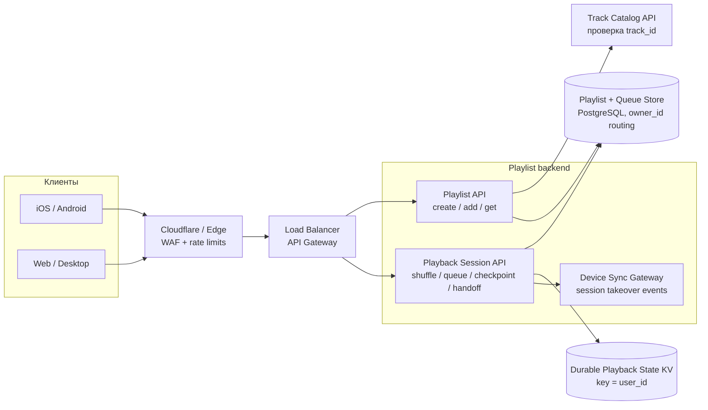

# Music Playlist Service

## Содержание

- [Что проверяет задача](#что-проверяет-задача)
- [Фаза 1: уточнение требований](#фаза-1-уточнение-требований)
- [Фаза 2: оценка нагрузки](#фаза-2-оценка-нагрузки)
- [Ключевая модель: плейлист и playback session](#ключевая-модель-плейлист-и-playback-session)
- [Фаза 3: высокоуровневый дизайн](#фаза-3-высокоуровневый-дизайн)
- [Фаза 4: deep dive](#фаза-4-deep-dive)
- [Сквозные потоки](#сквозные-потоки)
- [Отказы и пограничные случаи](#отказы-и-пограничные-случаи)
- [Трейдоффы](#трейдоффы)
- [Фаза 5: финал](#фаза-5-финал)
- [Interview-ready answer](#interview-ready-answer)
- [Связанные материалы](#связанные-материалы)

Практический разбор backend-механики плейлистов для музыкального сервиса.
Загрузка и стриминг аудио уже реализованы: здесь проектируются плейлисты,
случайная очередь, состояние воспроизведения и перенос сессии между устройствами.

---

## Что проверяет задача

Задача состоит не столько в хранении списка треков, сколько в разделении двух
похожих сущностей:

| Сущность | Что означает | Может меняться |
| --- | --- | --- |
| Playlist | Пользовательская коллекция треков | Да: добавляются новые элементы |
| Playback session | Конкретная очередь воспроизведения | Нет: порядок фиксируется при старте |
| Playback state | Текущая позиция внутри очереди | Да: часто обновляется с разных устройств |

Если при каждом открытии страницы снова перемешивать плейлист, очередь изменится
после паузы. Если принимать checkpoints от двух устройств без версии, старый
телефон сможет затереть прогресс нового. Эти две гонки определяют основной дизайн.

---

## Фаза 1: уточнение требований

### Что спросить

```text
- Плейлист приватный или им могут пользоваться другие люди?
- Разрешены ли одинаковые треки несколько раз?
- Нужны ли удаление и ручная перестановка элементов?
- Какой максимальный размер плейлиста?
- Изменения плейлиста должны менять уже начатую очередь?
- Сколько активных playback sessions может быть у пользователя?
- Какая погрешность допустима при продолжении на другом устройстве?
- Нужно ли продолжать воспроизведение при временном отсутствии сети?
```

### Зафиксированный scope

- Пользователь создаёт приватный плейлист и добавляет существующий трек в конец.
- Один трек можно добавить несколько раз: это разные элементы плейлиста.
- Максимум — 10 000 элементов; обычный плейлист содержит около 100.
- `Shuffle` создаёт новую playback session со снимком текущей версии плейлиста.
- Изменения плейлиста не меняют уже сгенерированную очередь.
- У пользователя одна активная session, но она доступна с нескольких устройств.
- Pause и явный handoff сохраняются до ответа API; при аварийном обрыве допустима
  потеря не более последнего 10-секундного интервала.
- Содержимое плейлиста и очередь выдаются страницами.

Вне scope: загрузка и доставка аудио, рекомендации, совместное редактирование,
публичные плейлисты знаменитостей, удаление и ручная перестановка элементов.

### Нефункциональные требования

```text
create / add / get playlist: p99 < 200 мс
start shuffle:               p99 < 500 мс для обычного плейлиста
pause / handoff:             p99 < 300 мс
availability:                99.99%
durability:                  подтверждённая pause-позиция не теряется
consistency:                 очередь session неизменна на всех устройствах
```

---

## Фаза 2: оценка нагрузки

Чисел в условии нет. На интервью их нужно согласовать. Ниже не характеристики
реального Spotify, а учебные допущения для выбора архитектуры:

```text
DAU (daily active users):       10 млн пользователей
прослушивание:                  2 часа на DAU в день
чтение плейлистов:              10 запросов на DAU в день
создание / добавление:          1 mutation на DAU в день
start shuffle:                  2 раза на DAU в день
  checkpoint (сохранение позиции): каждые 10 секунд воспроизведения
обычная очередь:                100 элементов
```

### API-нагрузка

```text
Чтение плейлистов:
  10 млн × 10 = 100 млн запросов/день
  100 млн / 86 400 ≈ 1 157 запросов/с в среднем
  согласованный пик ×5 ≈ 5 800 запросов/с

Создание и добавление:
  10 млн × 1 / 86 400 ≈ 116 mutations/с в среднем
  пик ×5 ≈ 580 mutations/с

Start shuffle:
  10 млн × 2 / 86 400 ≈ 231 session/с в среднем
  пик ×5 ≈ 1 160 session/с

Queue item writes при среднем размере 100:
  1 160 × 100 ≈ 116 000 ссылок/с в пик
  → писать одной batch-операцией на session, а не 100 round trips
```

### Checkpoint-нагрузка

```text
10 млн × 2 часа × 3 600 / 10 секунд
  = 7,2 млрд checkpoints/день

7,2 млрд / 86 400
  ≈ 83 300 updates/с в среднем

согласованный пик ×3
  ≈ 250 000 updates/с
```

Средняя одновременность следует из доли суток, проведённой за прослушиванием:

```text
10 млн DAU × 2 / 24 ≈ 833 000 активных слушателей в среднем
условный пик ×2 ≈ 1,7 млн
```

Именно checkpoint-поток, а не редактирование плейлистов, определяет write-path.
Записывать каждое обновление позиции как обычную реляционную транзакцию невыгодно:
для активного состояния нужен горизонтально масштабируемый key-value store с
условным обновлением одного ключа.

### Объём materialized queues

Materialized queue — это сгенерированный порядок, сохранённый как данные, а не
повторно вычисляемый при каждом чтении.

```text
20 млн sessions/день × 100 элементов
  = 2 млрд ссылок на playlist items в день

если логическая ссылка с ordinal занимает около 32 B:
  2 млрд × 32 B ≈ 64 GB/день сырого payload

30 дней хранения:
  64 GB × 30 ≈ 1,92 TB сырого payload
```

Это нижняя оценка без индексов, row overhead и репликации. Она показывает, что
очередь можно материализовать, но завершённым sessions нужен срок хранения.
Количество DB-шардов из этих чисел не следует: его определяет benchmark полной
операции на выбранной схеме и целевой конфигурации.

---

## Ключевая модель: плейлист и playback session

Плейлист хранит элементы, а не уникальное множество `track_id`:

```text
Playlist P1, version=42:
  item-10 → track-A
  item-11 → track-B
  item-12 → track-A
```

`item-10` и `item-12` нужны отдельно: пользователь намеренно добавил один трек
дважды. Очередь ссылается на `playlist_item_id`, поэтому не теряет дубликаты.

При `Shuffle` создаётся неизменяемый снимок:

```text
Playback session S9:
  source_playlist_id = P1
  source_version     = 42
  queue              = [item-12, item-10, item-11]

Playback state:
  queue_index        = 1
  position_ms        = 43 200
  playback_epoch     = 7
  active_device_id   = laptop-2
```

Добавление `track-C` создаст `playlist version=43`, но session `S9` продолжит
играть прежнюю очередь. Новый `Shuffle` создаст новую session из version 43.

---

## Фаза 3: высокоуровневый дизайн



### Роль компонентов

| Компонент | Зачем нужен | Почему отдельно |
| --- | --- | --- |
| Cloudflare / Edge + API Gateway | Защищает публичный API, проверяет auth и распределяет запросы | Публичный периметр не смешивается с бизнес-логикой плейлистов |
| Playlist API | Создаёт плейлист, добавляет и читает элементы | Низкочастотные транзакционные операции отделены от progress-потока |
| Track Catalog API | Проверяет существование и доступность `track_id` | Каталог треков уже принадлежит другому домену; межсервисный foreign key невозможен |
| Playback Session API | Создаёт очередь, отдаёт её и принимает checkpoints | Здесь живут правила снимка, shuffle и handoff |
| Playlist + Queue Store | Хранит версии плейлистов и materialized queues | Нужны транзакции, cursor pagination и долговечность очереди |
| Playback State KV | Хранит активную session, индекс, позицию, epoch и client sequence | До 250K условных updates/с по независимым ключам пользователей |
| Device Sync Gateway | Сообщает старому устройству, что session перехвачена | Доставка события не должна блокировать успешный handoff |

Один кластер PostgreSQL с leader и replica подходит только если benchmark полного
пика, включая около 116K queue item inserts/с, оставляет нужный запас. Иначе
естественный routing key — `owner_id`: плейлисты, sessions и очереди одного
пользователя остаются вместе. Число шардов меняется через виртуальные buckets,
а не через `hash(owner_id) % shard_count`.

---

## Фаза 4: deep dive

### 4.1 API

```http
POST /v1/playlists
Idempotency-Key: create-road-trip-2026

POST /v1/playlists/{playlist_id}/items
Idempotency-Key: add-item-781
{"track_id":"track-42"}

GET /v1/playlists/{playlist_id}/items?after=item-100&limit=100

POST /v1/playback-sessions
Idempotency-Key: shuffle-click-991
{"playlist_id":"playlist-7","mode":"SHUFFLE","device_id":"phone-1"}

GET /v1/playback-sessions/{session_id}/queue?after=200&limit=100

PUT /v1/playback-sessions/{session_id}/checkpoint
{"device_id":"phone-1","epoch":7,"client_seq":81,
 "queue_index":12,"position_ms":43200,"state":"PAUSED"}

POST /v1/playback-sessions/{session_id}/activate
{"device_id":"laptop-2"}
```

`Idempotency-Key` у добавления нельзя заменять уникальностью
`(playlist_id, track_id)`: одинаковый трек разрешено добавить несколько раз.

### 4.2 Минимальная модель данных

```text
playlists:
  playlist_id, owner_id, name, version, next_ordinal, created_at

playlist_items:
  playlist_id, item_id, ordinal, track_id, added_at

playback_sessions:
  session_id, owner_id, source_playlist_id, source_version,
  status, created_at, expires_at

playback_queue_items:
  session_id, queue_ordinal, playlist_item_id, track_id

idempotency_keys:
  owner_id, operation, idempotency_key → request_hash, result_id, expires_at

active_playback_state (durable KV):
  user_id → session_id, queue_index, position_ms, state,
            active_device_id, playback_epoch, client_seq, updated_at
```

При добавлении элемента транзакция сначала создаёт idempotency guard, затем
блокирует playlist row, увеличивает `version` и `next_ordinal` и вставляет item.
Так два параллельных `add` получают разные позиции, а два retry одной команды —
один item.

Очередь можно писать batch-вставкой и читать cursor-пагинацией по
`(session_id, queue_ordinal)`. Для плейлиста в 10 000 элементов создание может
иметь отдельный SLA: сервис перемешивает ограниченный массив и пишет очередь
частями через batch-операции. Если benchmark не укладывается в допустимое время, это основание
добавить асинхронную генерацию с `202 GENERATING`, но не исходное допущение.

### 4.3 Равномерный shuffle

Для `N` элементов применяется Fisher–Yates:

```text
for i = N-1 ... 1:
  j = random integer from [0, i]
  swap(items[i], items[j])
```

Пример:

```text
начало:              [A, B, C, D]
i=3, j=1, swap D/B:  [A, D, C, B]
i=2, j=0, swap C/A:  [C, D, A, B]
i=1, j=1:            [C, D, A, B]
```

`ORDER BY random()` не нужен: он связывает алгоритм с БД и заставляет сортировать
весь набор. API читает согласованный снимок элементов, перемешивает их в памяти и
batch-вставкой сохраняет итоговый порядок.

Хранить только random seed дешевле, но тогда воспроизведение зависит от версии
алгоритма и генератора. Materialized queue проще читать, показывать пользователю
и переносить между устройствами, поэтому для заданного среднего размера выбран
именно этот вариант.

### 4.4 Согласованный снимок плейлиста

Создание session читает `playlist.version` и элементы в одной транзакции уровня
`REPEATABLE READ`: оба запроса видят один snapshot, даже если параллельно идёт
`add`. Сервис перемешивает полученные элементы и сохраняет session с
`source_version`.

Инициализация active state происходит в другом хранилище, поэтому это не одна
распределённая транзакция:

```text
1. PostgreSQL transaction:
   idempotency result + session + materialized queue → COMMIT.
2. State KV:
   CAS user_id:
     ключа нет → session, epoch=1, index=0, position=0;
     другая session активна → заменить её и увеличить epoch;
     уже записана эта session → вернуть прежнее состояние.
3. Только после обоих шагов вернуть READY клиенту.
```

Если процесс падает после первого шага, retry находит тот же `session_id` и
идемпотентно завершает второй. Клиент не получает успешный ответ, пока active
state не создан. Reconciler удаляет или доинициализирует давно зависшие sessions.

Параллельное добавление получает следующую версию плейлиста, но не меняет уже
созданную queue. Повтор `start shuffle` с тем же idempotency key возвращает тот
же `session_id` и тот же порядок, а не генерирует новую случайную очередь.

### 4.5 Handoff между устройствами

`playback_epoch` защищает состояние от старого устройства:

```text
До handoff:
  phone-1, epoch=7, client_seq=81

laptop-2 вызывает activate:
  State KV делает conditional update epoch 7 → 8
  active_device_id = laptop-2

После handoff:
  laptop-2 пишет checkpoints с epoch=8
  поздний checkpoint phone-1 с epoch=7 отклоняется
```

Внутри одной epoch принимается только больший `client_seq`. Сравнивать только
`position_ms` нельзя: пользователь может вручную перемотать трек назад, поэтому
позиция не обязана монотонно расти.

Pause считается подтверждённой после durable conditional update. При внезапной
потере сети последним остаётся checkpoint не старше согласованного интервала в
10 секунд. Формулировка «с того же места» означает последнее подтверждённое
состояние, а не позицию, которую сервер физически не успел получить.

---

## Сквозные потоки

### 1. Добавление трека

Playlist API проверяет владельца → Track Catalog подтверждает `track_id` →
транзакция вставляет новый `playlist_item` и увеличивает `playlist.version` →
повтор с тем же idempotency key возвращает прежний item.

Итог: намеренные дубликаты разрешены, сетевой retry не создаёт случайный дубль.

### 2. Shuffle

Playback API читает снимок playlist version 42 → Fisher–Yates → сохраняет session
и materialized queue → создаёт active state с epoch 1 → возвращает первую страницу.

Итог: все устройства видят один и тот же порядок; последующие edits его не меняют.

### 3. Pause на телефоне, продолжение на ноутбуке

Телефон durable-сохраняет `PAUSED`, index и position → ноутбук вызывает
`activate` → conditional update увеличивает epoch → получает session, queue и
checkpoint → старый телефон получает takeover event и больше не может писать.

Итог: очередь не генерируется заново, а старая вкладка не откатывает прогресс.

---

## Отказы и пограничные случаи

| Сбой | Поведение |
| --- | --- |
| Ответ `start shuffle` потерялся | Retry с тем же idempotency key возвращает ту же session и queue |
| Queue сохранена, State KV не инициализирован | Session остаётся неактивной; retry или reconciler завершает `PUT IF ABSENT` |
| Трек удалён из каталога после генерации | Queue сохраняет item, при воспроизведении Track Catalog возвращает unavailable; клиент пропускает его |
| Устройство прислало старый checkpoint | Несовпавшая epoch или меньший `client_seq` отклоняются |
| Device Sync Gateway недоступен | Handoff успешен; старое устройство остановится после следующего rejected checkpoint |
| Playback State KV недоступен | Новые pause/handoff не подтверждаются; очередь и плейлисты остаются доступны |
| Плейлист пуст | `start shuffle` возвращает `EMPTY_PLAYLIST`, session не создаётся |
| Плейлист содержит 10 000 элементов | Работает отдельный SLA и пакетная запись частями; async path добавляется только после benchmark |

---

## Трейдоффы

| Выбор | Альтернатива | Почему и чем платим |
| --- | --- | --- |
| Materialized queue | Хранить только seed | Стабильность между версиями алгоритма и простое чтение ценой места |
| Снимок playlist version | Живая ссылка на текущий плейлист | Очередь не меняется посреди сессии ценой копирования ссылок |
| Fisher–Yates в приложении | `ORDER BY random()` | Линейная работа без DB-sort, но API временно держит массив в памяти |
| Durable State KV | Redis cache + периодический flush | Подтверждённая pause не теряется ценой более дорогих записей |
| Epoch + conditional update | Последняя запись побеждает | Старое устройство не откатывает состояние; нужен handoff-протокол |
| Checkpoint каждые 10 секунд | Запись каждую секунду | В 10 раз меньше write-load ценой до 10 секунд прогресса при crash |
| Routing по owner_id | Routing по playlist_id | Данные пользователя локальны; публичный hot playlist потребует отдельного read-cache |

---

## Фаза 5: финал

### Двухминутное резюме

> Я разделяю изменяемый playlist и неизменяемую playback session. Shuffle читает
> согласованный снимок версии плейлиста, выполняет Fisher–Yates и материализует
> очередь по playlist item IDs, поэтому дубликаты сохраняются, а последующие edits
> не меняют уже начатое воспроизведение.
>
> Плейлисты и очереди храню в PostgreSQL. Один кластер допустим, только если
> benchmark полного queue-write пика оставляет запас; иначе использую routing по
> owner_id через virtual buckets. Количество шардов заранее не угадываю. Главная
> нагрузка находится не
> здесь: при 10 млн условных DAU, двух часах прослушивания и checkpoint каждые
> 10 секунд получается около 83 тысяч updates/с в среднем и 250 тысяч в
> согласованный пик. Поэтому активный playback state лежит в durable distributed
> KV и обновляется условно по одному user key.
>
> Для handoff новое устройство атомарно увеличивает playback epoch. Старое
> устройство продолжает иметь queue, но его checkpoints с прежней epoch
> отклоняются. Внутри epoch порядок задаёт client sequence, а не position:
> пользователь имеет право перемотать назад. Pause подтверждается только после
> durable update; внезапный обрыв ограничен последним 10-секундным checkpoint.
>
> Retry `start shuffle` использует idempotency key и возвращает ту же случайную
> очередь. При росте в 10 раз сначала отдельно benchmark'аю queue generation,
> PostgreSQL и State KV; прогресс масштабируется по user_id, а генерацию очень
> больших очередей перевожу в асинхронные workers.

### За пределами scope и следующий шаг

- Публичные и совместные плейлисты добавят ACL, hot reads и конфликты edits.
- Offline playback потребует локального журнала checkpoints и conflict policy.
- Рекомендации и endless radio создают расширяемую очередь, а не immutable snapshot.
- Следующий benchmark воспроизводит 250K conditional state updates/с и одновременно
  проверяет p99 handoff, а не измеряет одиночный синтетический `SET`.

---

## Interview-ready answer

**1. Чем playlist отличается от playback session?**

- Playlist — изменяемая коллекция пользователя с версией.
- Playback session — неизменяемый снимок конкретной версии и порядка.
- Playback state — часто меняющиеся index, position, device и epoch.

**2. Как сохранить одинаковую shuffle-очередь на устройствах?**

- Генерация — Fisher–Yates выполняется один раз при старте session.
- Хранение — итоговый порядок материализуется и читается по `session_id`.
- Retry — один idempotency key возвращает прежнюю session, а не новый shuffle.

**3. Что происходит при редактировании плейлиста во время прослушивания?**

- Изоляция — существующая session продолжает играть свой `source_version`.
- Новая версия — следующий shuffle увидит добавленный трек.

**4. Как не дать старому устройству откатить прогресс?**

- Handoff — условно увеличивает `playback_epoch`.
- Отсечение старого устройства — checkpoints со старой epoch отклоняются.
- Порядок — внутри epoch используется `client_seq`, потому что position может уменьшаться.

**5. Что определяет масштабирование?**

- Контрольный путь — до примерно 5,8K playlist reads/с и 1,2K shuffle starts/с в условный пик.
- Горячий путь — около 250K progress updates/с в условный пик.
- Решение — durable State KV масштабируется по `user_id`; DB-шарды выбираются только после benchmark.

**6. Почему не хранить progress только в Redis?**

- Гарантия — подтверждённая pause-позиция не должна зависеть от потери cache state.
- Альтернатива — Redis допустим как ускоритель перед durable store, но не как единственная подтверждённая копия.

---

## Связанные материалы

- [Как проходить System Design Interview](./00-how-to-approach.md)
- [Idempotency](../reliability-patterns/06-idempotency.md)
- [WebSocket](../../08-networking-and-api/protocols/04-realtime/01-websocket.md)
- [PostgreSQL: транзакции и блокировки](../../06-databases/database-systems-catalog/postgresql/04-transactions-and-locking.md)
- [PostgreSQL: шардирование](../../06-databases/database-systems-catalog/postgresql/12-sharding.md)
