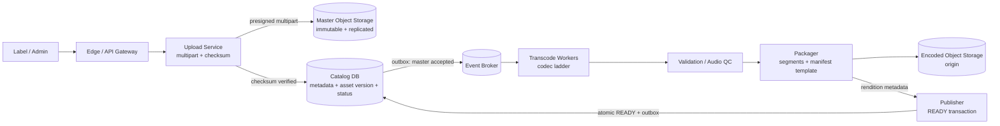
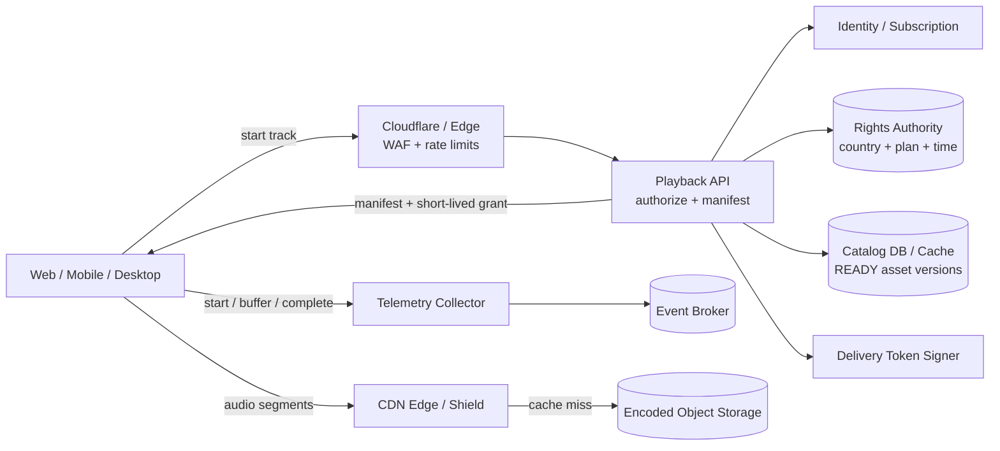

# Music Streaming Delivery

## Содержание

- [Что проверяет задача](#что-проверяет-задача)
- [Фаза 1: уточнение требований](#фаза-1-уточнение-требований)
- [Фаза 2: оценка нагрузки](#фаза-2-оценка-нагрузки)
- [Ключевая модель: control plane и data plane](#ключевая-модель-control-plane-и-data-plane)
- [Фаза 3: высокоуровневый дизайн](#фаза-3-высокоуровневый-дизайн)
- [Фаза 4: deep dive](#фаза-4-deep-dive)
- [Сквозные потоки](#сквозные-потоки)
- [Отказы и деградация](#отказы-и-деградация)
- [Трейдоффы](#трейдоффы)
- [Фаза 5: финал](#фаза-5-финал)
- [Interview-ready answer](#interview-ready-answer)
- [Связанные материалы](#связанные-материалы)

Практический разбор задачи «Спроектируй доставку музыки». Здесь проектируются
приём master-файла, кодирование, разрешение на воспроизведение и доставка аудио
через CDN. Плейлисты, shuffle и перенос позиции между устройствами разобраны
отдельно в [Music Playlist Service](./17-music-playlist-service.md).

---

## Что проверяет задача

Главный архитектурный ход — не пропускать аудиобайты через обычный backend.
Backend решает, **можно ли** слушать трек, и выдаёт короткоживущее разрешение;
CDN и object storage доставляют сами сегменты. Иначе тысячи API-инстансов
превращаются в дорогой proxy для сотен гигабит в секунду.

Вторая часть задачи — отделить неизменяемые media assets от изменяемых метаданных:

| Данные | Пример | Требуемая семантика |
| --- | --- | --- |
| Master | исходный lossless-файл | immutable, durable |
| Rendition | AAC 64/128/256 kbps | immutable и versioned |
| Metadata | title, artist, duration | обычная DB-запись |
| Rights | страны, тарифы, период лицензии | точная проверка до выдачи playback grant |
| Playback telemetry | start, buffer, complete | асинхронно, возможны дубли |

---

## Фаза 1: уточнение требований

### Что спросить

```text
- Проектируем загрузку каталога, playback или оба пути?
- Какие устройства и codecs поддерживаем?
- Нужен ли adaptive bitrate или достаточно одного качества?
- Требуются gapless playback, seek и offline mode?
- Есть ли ограничения лицензий по стране и тарифу?
- Через сколько должна стать доступна загруженная композиция?
- Как быстро нужно отозвать права на уже опубликованный трек?
- Нужны ли рекомендации, поиск и royalty accounting?
```

### Зафиксированный scope

- Правообладатель загружает master и metadata.
- Система асинхронно валидирует, кодирует и публикует несколько renditions.
- Клиент запрашивает начало воспроизведения и получает manifest с разрешёнными
  вариантами качества и короткоживущим delivery token.
- Клиент забирает аудиосегменты через CDN, умеет менять bitrate и делать seek.
- Переход между соседними треками может быть gapless.
- Поддерживается зашифрованная offline-копия с ограниченным сроком лицензии.
- Playback telemetry поступает в аналитику и биллинг прослушиваний асинхронно.

Вне scope: загрузка пользовательского контента, рекомендации, поиск, плейлисты,
социальные функции и финансовый расчёт выплат правообладателям.

### Нефункциональные требования

```text
Playback API:             p99 < 200 мс
Начало звука:             p99 < 1 секунды на нормальной сети
Доступность playback:     99,99%
Потеря опубликованного master: недопустима
Rights consistency:       после вступления отзыва в силу нельзя выдавать новый grant
Telemetry:                at-least-once, задержка в минуты допустима
```

Остановка уже загруженного CDN-сегмента не может быть мгновенной без дорогого
purge и очень короткого TTL. Поэтому отдельно фиксируем: после подтверждённого
обновления Rights Authority новые playback grants не выдаются, а уже выданный
grant живёт, например, не более пяти минут. Это бизнес-компромисс, а не свойство
CDN.

---

## Фаза 2: оценка нагрузки

Чисел в условии нет. Ниже учебные допущения, а не сведения о конкретном сервисе:

```text
DAU:                         10 млн
прослушивание на DAU:         2 часа/день
средний effective bitrate:    160 kbps
длительность сегмента:        5 секунд
стартов трека на DAU:         30/день
каталог:                      100 млн треков
средняя длительность трека:   4 минуты
```

### Одновременность и трафик

По закону Литтла среднее число одновременных слушателей равно доле суток,
которую пользователи проводят в playback:

```text
10 млн × 2 / 24 ≈ 833 000 concurrent listeners в среднем
условный пик ×2 ≈ 1,7 млн
```

Payload-трафик в среднем за сутки:

```text
10 млн × 7 200 секунд × 160 000 бит/с / 8
  = 1,44 PB/день
```

Пиковая скорость отдачи payload:

```text
1,7 млн × 160 kbps ≈ 272 Gbps
```

TLS, HTTP и container overhead увеличат физический трафик, поэтому capacity
планируют с запасом. Но уже payload показывает, почему audio delivery должен
идти через CDN, а не через Playback API.

### Segment requests и Playback API

При пятисекундном сегменте каждый активный клиент делает в среднем один запрос
раз в пять секунд:

```text
1,7 млн / 5 ≈ 340 000 segment requests/с в пик
```

Playback starts — другой, гораздо меньший поток:

```text
10 млн × 30 / 86 400 ≈ 3 472 starts/с в среднем
условный пик ×3 ≈ 10 400 starts/с
```

Значит, Playback API проектируется примерно на десятки тысяч RPS, а CDN — на
сотни тысяч requests/s и сотни Gbps.

### Origin egress

Пусть измеренный byte hit ratio CDN равен 95%:

```text
272 Gbps × (1 - 0,95) ≈ 13,6 Gbps origin payload в пик
```

Это только предварительная оценка: cache hit по популярным трекам обычно выше,
а новый релиз и длинный хвост дают разные профили. Capacity origin проверяют
load test и отдельно закладывают miss storm после purge.

### Объём media storage

Учебная лестница качеств: `64 + 128 + 256 = 448 kbps`.

```text
Encoded renditions одного трека:
  448 000 бит/с × 240 секунд / 8 ≈ 13,44 MB

100 млн треков:
  100 млн × 13,44 MB ≈ 1,344 PB encoded payload

Master при среднем размере 30 MB:
  100 млн × 30 MB = 3 PB

Итого до replication, metadata и packaging overhead:
  ≈ 4,34 PB
```

Для накопления используется средний размер каталога, а не пиковый upload rate.
Replication factor и cross-region copies применяются к каждому классу данных
отдельно: master обычно защищают сильнее, чем пересоздаваемые renditions.

---

## Ключевая модель: control plane и data plane

**Control plane** обрабатывает маленькие, но значимые запросы:

- metadata и состояние публикации;
- entitlement пользователя и региональные права;
- выбор codecs и manifest;
- выдача короткоживущего delivery grant;
- отзыв прав и audit.

**Data plane** переносит основной объём байтов:

- immutable audio segments;
- CDN edge и regional shield;
- object storage как origin;
- range или segment requests клиента.

```text
Control plane:  ~10K playback starts/s, точные rights decisions
Data plane:     ~340K segment requests/s, ~272 Gbps payload
```

Такое разделение локализует отказы: деградация аналитики не мешает слушать, а
cache miss не требует увеличивать число инстансов API пропорционально bitrate.

Media asset адресуется неизменяемой версией:

```text
/audio/{track_id}/{asset_version}/{codec}/{bitrate}/{segment_no}
```

Исправленный файл публикуется как новая `asset_version`; перезапись уже
закешированного URL запрещена. Это устраняет спор между старым CDN cache и новым
origin-содержимым.

---

## Фаза 3: высокоуровневый дизайн

Одна огромная схема скрыла бы различие write-heavy ingestion и read-heavy
playback, поэтому показываем их отдельно.

### Ingestion и публикация



### Playback и доставка



### Роль компонентов

**Upload Service.**
*Зачем:* создаёт upload session, выдаёт presigned part URLs и после завершения
проверяет размер/checksum.
*Почему отдельно:* большие master-файлы идут напрямую в object storage; API не
держит соединение и память на весь upload.

**Catalog DB.**
*Зачем:* authority для metadata, правовой привязки, версии asset и статуса
`UPLOADING → PROCESSING → READY / REJECTED`.
*Почему реляционное хранилище:* публикация версии и outbox должны стать видимы
атомарно. Аудиобайты в DB не хранятся.

**Event Broker и workers.**
*Зачем:* durable очередь кодирования, QC и packaging; один master порождает
несколько независимо повторяемых jobs.
*Почему async:* transcode длится намного дольше HTTP request. Retry не должен
создавать дубликат rendition, поэтому ключ job включает `track_id`,
`asset_version`, `codec` и `bitrate`.

**Object Storage.**
*Зачем:* durable master и origin для immutable renditions.
*Почему не shared filesystem:* нужны большой объём, checksum, versioning и
дешёвое горизонтальное масштабирование, а не POSIX locking.

**Playback API.**
*Зачем:* проверяет identity, subscription, country/time rights и формирует
manifest только из разрешённых renditions.
*Почему не отдаёт аудио:* его нагрузка определяется starts/s, а не количеством
прослушанных секунд и bitrate.

**Delivery Token Signer.**
*Зачем:* подписывает путь/версию, user или session scope и expiration.
*Почему короткий TTL:* утёкший URL не должен давать длительный доступ; это также
задаёт верхнюю границу задержки отзыва нового playback.

**CDN Edge и Shield.**
*Зачем:* держит популярные immutable segments рядом с пользователем, а shield
схлопывает одновременные miss из нескольких edge-узлов.
*Почему отдельно от API cache:* CDN оптимизирован для больших байтов и range
requests; metadata cache — для маленьких объектов и точной invalidation.

**Telemetry Collector.**
*Зачем:* быстро принимает события клиента, валидирует envelope и пишет их в
broker для QoE, аналитики и расчёта прослушиваний.
*Почему async:* потеря доступности downstream analytics не должна останавливать
playback. Дубликаты дедуплицируются по `playback_session_id + event_seq`.

---

## Фаза 4: deep dive

### 1. Ingestion state machine

```text
CREATED → UPLOADING → UPLOADED → PROCESSING → READY
                                  │             │
                                  └→ REJECTED ←─┘
```

1. Клиент создаёт `upload_id` с idempotency key.
2. Части master загружаются напрямую в storage.
3. Complete разрешён только после checksum всех parts и итогового object.
4. DB-транзакция переводит asset в `UPLOADED` и пишет outbox event.
5. Workers создают временные объекты, сверяют duration/loudness/codec.
6. Publisher проверяет наличие всей обязательной codec ladder и одной
   транзакцией переключает новую версию в `READY`.

Старый asset остаётся активным, пока новый не готов целиком. Нельзя сначала
переключить Catalog, а затем по очереди догружать сегменты: CDN получит manifest
с несуществующими objects.

### 2. Идемпотентный transcode

Логический job имеет детерминированный ключ:

```text
job_id = hash(track_id, asset_version, codec, bitrate, pipeline_version)
```

Worker может быть доставлен повторно. Он пишет во временный путь, проверяет
checksum и атомарно регистрирует результат через `INSERT ... ON CONFLICT`.
Повтор не должен ещё раз публиковать тот же rendition или увеличивать счётчик
готовности.

`pipeline_version` важен: изменение encoder settings должно создать новый
результат, а не молча принять старый файл как уже выполненную работу.

### 3. Manifest и delivery grant

Playback API возвращает не вечный публичный URL, а небольшой ответ:

```json
{
  "playback_session_id": "ps_123",
  "track_id": "track_42",
  "asset_version": 7,
  "expires_at": "2026-08-27T12:05:00Z",
  "renditions": [
    {"codec": "aac", "bitrate_kbps": 64},
    {"codec": "aac", "bitrate_kbps": 128},
    {"codec": "aac", "bitrate_kbps": 256}
  ],
  "delivery_token": "signed-token"
}
```

В подпись входят path prefix, asset version, expiration и при необходимости
регион или session. CDN валидирует подпись на edge и не вызывает Playback API на
каждый сегмент.

Ключ CDN cache не должен включать уникальный user token, иначе одинаковый
сегмент разных пользователей не разделит cache. Обычно подпись проверяется
отдельно, а cache key нормализуется до immutable asset path.

### 4. Segments, range requests и adaptive bitrate

Два разумных варианта:

| Вариант | Плюсы | Минусы |
| --- | --- | --- |
| Короткие segments | Простая смена bitrate, retry малого куска, предсказуемый cache | Больше HTTP requests и metadata |
| Один файл + byte ranges | Меньше объектов, хороший CDN range cache | Сложнее безопасно менять качество и вычислять seek offsets |

Для interview-case выбираем **пятисекундные** segments. Они дают понятный ABR,
ограничивают повторную загрузку после packet loss и сохраняют приемлемый request
overhead. Реальный размер подбирают по замерам startup latency и эффективности
codec.

Клиент оценивает throughput и buffer occupancy. Он выбирает следующую rendition,
но не переключает уже загруженный segment посередине. Backend не принимает это
решение в realtime: лишний round trip ухудшил бы playback.

### 5. Быстрый старт и prefetch

Минимальный путь старта:

```text
start request → rights/cache lookup → signed manifest → ближайший CDN edge
```

- DNS/TLS соединения к CDN переиспользуются.
- Первый segment может быть короче либо начинаться с более низкого bitrate.
- Клиент не ждёт загрузки всего трека; небольшой startup buffer защищает от jitter.
- Следующий track из уже известной очереди prefetch-ится ближе к концу текущего.

Prefetch ограничивают: пользователь может сделать skip, поэтому слишком большой
буфер тратит CDN egress и мобильный трафик впустую.

### 6. Gapless playback

Простого соединения двух MP3/AAC-файлов недостаточно: encoder может добавить
delay и padding. Packager сохраняет точные sample boundaries и gapless metadata.
Клиент заранее получает manifest следующего трека, prefetch-ит первый segment и
обрезает encoder padding при декодировании.

Это client + packaging feature. Playback API лишь выдаёт совместимые metadata;
попытка синхронно склеивать два трека на backend уничтожила бы CDN caching.

### 7. Offline mode

Offline download — не бессрочная публичная копия:

1. Клиент получает offline manifest и device-bound license.
2. Renditions скачиваются через CDN и сохраняются зашифрованными.
3. Ключ доступен только приложению/защищённому хранилищу устройства.
4. License содержит expiration и требует периодического online renewal.
5. Logout, окончание подписки или истечение прав запрещают новое renewal.

Полностью исключить копирование на контролируемом пользователем устройстве
невозможно. Цель DRM — управлять обычным доступом и повышать стоимость обхода,
а не обещать математическую невозможность извлечения аудио.

### 8. Rights и отзыв доступа

Rights decision зависит минимум от:

```text
track_id + asset_version + country + subscription_tier + current_time
```

Rights store — authority. При выбранном строгом требовании Playback API проверяет
разрешение точным чтением authority; 10,4K starts/s намного меньше media-потока и
шардируется по `track_id`. Кешировать положительный ответ можно только если
бизнес явно согласовал bounded-staleness окна отзыва. При экстренном отзыве
publisher:

- помечает asset недоступным для новых grants;
- инвалидирует rights cache;
- при необходимости запускает CDN purge;
- не продлевает offline licenses.

Если бизнес требует мгновенный отзыв каждого уже выданного token, self-contained
подписи недостаточно: CDN понадобится online introspection или очень короткий TTL.
Это снижает availability и увеличивает нагрузку control plane.

### 9. Playback telemetry

Клиент отправляет `START`, `HEARTBEAT`, `BUFFER`, `SEEK`, `COMPLETE` с монотонным
`event_seq`. Collector подтверждает событие после durable broker ack.

```text
QoE consumer         → startup latency, rebuffer ratio, errors
Analytics consumer   → продуктовые воронки
Royalty input        → очищенные qualifying listens
Fraud consumer       → аномальные устройства и повторения
```

Broker delivery at-least-once означает, что consumers обязаны дедуплицировать
события. Но telemetry не является authority текущей позиции между устройствами:
это отдельная задача Playback State из playlist-case.

---

## Сквозные потоки

**1. Публикация трека.** Label загружает master напрямую в storage → checksum
подтверждается → outbox запускает transcode → QC и packager создают все обязательные
renditions → Publisher атомарно делает новую версию `READY`.
*Итог:* в Catalog никогда не виден наполовину опубликованный asset.

**2. Начало playback.** Клиент вызывает Playback API → сервис проверяет аккаунт,
региональные права и `READY` version → подписывает короткий grant → клиент
запрашивает segments у CDN.
*Итог:* точная авторизация остаётся в control plane, основной трафик — в CDN.

**3. Смена качества.** Клиент измеряет throughput → выбирает bitrate следующего
segment → CDN отдаёт тот же segment number другой rendition.
*Итог:* ABR реагирует без синхронного решения backend на каждый кусок.

**4. Завершение и аналитика.** Клиент отправляет sequenced telemetry → Collector
фиксирует её в broker → независимые consumers строят QoE и qualifying listens.
*Итог:* сбой аналитики не прерывает музыку, а дубли устраняются downstream.

---

## Отказы и деградация

| Сбой | Поведение |
| --- | --- |
| Upload API упал | Multipart session продолжается в storage; complete можно безопасно повторить |
| Worker упал во время transcode | Broker redelivery; детерминированный job не публикует дубль |
| Один rendition не прошёл QC | Новая версия не становится `READY`; старая остаётся активной |
| Catalog cache недоступен | Playback читает authority с rate limit; latency растёт |
| Rights authority недоступен | Для нового grant fail closed; уже выданный короткий token работает до expiration |
| CDN edge miss | Запрос идёт через shield к origin; request coalescing защищает от stampede |
| Origin region недоступен | CDN использует другой replicated origin; immutable key совпадает |
| Telemetry broker недоступен | Ограниченный client buffer и retry; playback не блокируется |
| Клиент слишком медленный | Понижает bitrate; при пустом buffer ставит playback на rebuffering |

Для master recovery нужна регулярная проверка restore, а не только наличие
replication. Для CDN/origin отдельно тестируют новый релиз, purge storm и отказ
целого региона.

---

## Трейдоффы

| Решение | Альтернатива | Почему выбрано |
| --- | --- | --- |
| CDN data plane | Отдавать audio через backend | 272 Gbps не должны проходить через API fleet |
| Immutable versioned path | Перезаписывать тот же URL | Нет конфликта старого cache и нового origin |
| Короткие segments | Один большой файл | Удобнее ABR, seek и retry малого диапазона |
| Async transcode | Кодировать внутри upload request | Долгая работа, независимые retry и fan-out renditions |
| Signed grant на edge | Auth request на каждый segment | Меньше latency и ~340K calls/s не попадают в API |
| Exact read Rights Authority при старте | Положительный rights cache | Выполняет запрет новых grants после подтверждённого отзыва; цена — зависимость старта от authority |
| Client-side ABR | Server выбирает каждый segment | Нет лишнего RTT; клиент видит свою сеть и buffer |
| At-least-once telemetry | Distributed exactly-once | Дедуп дешевле глобальной транзакции с аналитикой |
| Replicated masters | Хранить только renditions | Master нужен для новой codec ladder и восстановления |

---

## Фаза 5: финал

### Двухминутное резюме

> Я разделяю систему на control plane и data plane. При допущениях 10 млн DAU и
> двух часах музыки в день получаем около 833 тысяч concurrent listeners в
> среднем и 1,7 млн в пике. При 160 kbps это примерно 272 Gbps payload и около
> 340 тысяч запросов пятисекундных сегментов в секунду. Поэтому Playback API
> только проверяет права и выдаёт manifest с короткоживущим grant, а immutable
> segments доставляют CDN и object storage.
>
> Ingestion идёт отдельно: master загружается прямо в replicated object storage,
> outbox запускает идемпотентные transcode jobs, QC проверяет результаты, а новая
> asset version становится READY только после полной codec ladder. Старый asset
> работает до атомарной публикации нового.
>
> Клиент сам выбирает bitrate следующего segment по throughput и buffer, заранее
> получает следующий track для gapless playback и отправляет telemetry
> асинхронно. Rights authority не выдаёт новый grant после отзыва, а короткий TTL
> задаёт явную верхнюю границу жизни уже выданного доступа.

### За пределами scope и рост ×10

- Рекомендации и поиск получают Catalog events, но не входят в playback hot path.
- При росте data plane масштабируется CDN-контрактом и origin regions, control
  plane — stateless instances и partitioning rights/catalog caches.
- Popularity-aware prewarming снижает miss storm перед крупным релизом.
- Новые codecs добавляются новой `pipeline_version`, не перезаписывая старые assets.
- Royalty accounting строится отдельным проверяемым pipeline поверх telemetry.

---

## Interview-ready answer

**1. Где хранятся сами треки?**

- Master и encoded renditions лежат в object storage.
- Catalog DB хранит только metadata, права, status и immutable asset paths.
- Популярные segments кешируются на CDN edge и regional shield.

**2. Почему аудио не отдаёт Playback Service?**

- API имеет около 10K starts/s, а media plane — около 340K segment requests/s.
- API принимает точное решение о правах один раз на короткую session.
- CDN переносит ~272 Gbps payload и масштабируется независимо.

**3. Как публиковать новую версию без битых ссылок?**

- Workers сначала создают всю codec ladder под новым immutable prefix.
- Publisher проверяет объекты и одной DB-транзакцией переключает `READY` version.
- Уже выданные manifests продолжают ссылаться на старую существующую версию.

**4. Как работает adaptive bitrate?**

- Один временной segment существует в нескольких bitrate renditions.
- Клиент оценивает сеть и buffer и выбирает качество следующего segment.
- Переключение не требует round trip к backend.

**5. Как обеспечить gapless playback?**

- Packager сохраняет encoder delay, padding и sample boundaries.
- Клиент prefetch-ит начало следующего трека.
- Decoder обрезает padding и соединяет PCM без искусственной паузы.

**6. Что происходит при отзыве прав?**

- Rights authority сразу прекращает новые grants и инвалидирует cache.
- Уже выданный signed grant живёт до короткого expiration.
- Более строгий мгновенный отзыв потребует CDN introspection или purge и ухудшит
  latency/availability.

**7. Почему telemetry допускает дубли?**

- Она не участвует в разрешении playback.
- Durable at-least-once delivery проще переживает временный сбой consumers.
- `playback_session_id + event_seq` позволяет дедуплицировать downstream.

---

## Связанные материалы

- [Music Playlist Service](./17-music-playlist-service.md) — плейлисты, shuffle,
  playback state и handoff между устройствами
- [Netflix / Streaming](./09-netflix-streaming.md) — похожее разделение control и
  media plane для видео
- [YouTube / Video Platform](./07-youtube-video-platform.md) — upload и transcode
  pipeline
- [Live Streaming Platform](./19-live-streaming-platform.md) — доставка контента,
  которого ещё нет в origin до запроса
- [Read-heavy request with CDN](../external-request-flows/02-read-heavy-request-with-cdn-and-cache.md)
- [CDN deep dive](../../08-networking-and-api/request-lifecycle/08-cdn-deep-dive.md)
- [Kafka](../../07-message-brokers-and-streaming/01-kafka.md)
