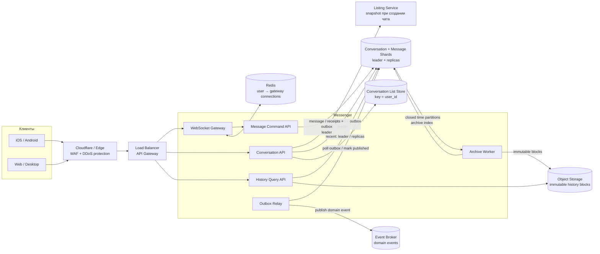
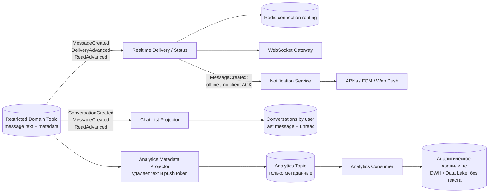

# Marketplace Messenger

## Содержание

- [Что проверяет задача](#что-проверяет-задача)
- [Фаза 1: уточнение требований](#фаза-1-уточнение-требований)
- [Фаза 2: оценка нагрузки](#фаза-2-оценка-нагрузки)
- [Ключевые концепции](#ключевые-концепции)
- [Фаза 3: высокоуровневый дизайн](#фаза-3-высокоуровневый-дизайн)
- [Фаза 4: deep dive](#фаза-4-deep-dive)
- [Сквозные потоки](#сквозные-потоки)
- [Отказы и пограничные случаи](#отказы-и-пограничные-случаи)
- [Трейдоффы](#трейдоффы)
- [Фаза 5: финал](#фаза-5-финал)
- [Interview-ready answer](#interview-ready-answer)
- [Связанные материалы](#связанные-материалы)

Разбор мессенджера торговой площадки: личный чат покупателя и продавца,
привязанный к объявлению. В отличие от общего кейса [Chat / Messaging](./04-chat-messaging.md),
здесь нет групп и медиа, зато важны независимость истории от жизненного цикла
объявления, уведомления и рост долговременного хранилища.

---

## Что проверяет задача

В этой системе три разных пути:

| Путь | Требуемая гарантия | Основной механизм |
| --- | --- | --- |
| Приём сообщения | После `SENT` сообщение не теряется | DB transaction: message + outbox |
| Realtime-доставка | Низкая задержка, повтор допустим | Event Broker + WebSocket routing |
| История | Всегда доступна участникам | Шардированное append-only хранилище + архив |

Сообщение сначала сохраняется, а уже затем доставляется онлайн и отправляется в
push. Если поставить WebSocket раньше durable-записи, получатель увидит текст,
которого после сбоя не окажется в истории.

---

## Фаза 1: уточнение требований

### Данные из условия

```text
DAU (daily active users):    3 млн
MAU (monthly active users):  30 млн
рост за 3 года:              до 10 млн DAU
размер сообщения:            до 10 KB
сообщений на DAU в день:     10 сообщений × 3 чата = 30
чтение / запись:             1:1 по числу запросов
активность:                  8 часов в день
чатов на пользователя:       15 в среднем
участников:                  ровно 2
```

### Что уточнить

```text
- Один buyer-seller чат на объявление или можно создать несколько?
- Нужны ли sent / delivered / read статусы?
- Что означает «история всегда»: одинаковый SLA для сообщения пятилетней давности?
- Можно ли редактировать или удалять отправленные сообщения?
- Нужен ли полнотекстовый поиск?
- Одно или несколько одновременно подключённых устройств?
- Какой SLA у отправки, realtime-доставки и истории?
```

### Зафиксированный scope

- Один чат на тройку `(listing_id, buyer_id, seller_id)`.
- Только текст до 10 KB; редактирование, удаление и поиск вне scope.
- Сообщение имеет состояния `SENT` и `DELIVERED`; unread считается через
  watermark — максимальный прочитанный `seq`, а не отдельный флаг на сообщении.
- Онлайн-пользователь получает сообщение по WebSocket; офлайн-пользователь — push.
- Недавняя история выдаётся с p99 < 300 мс, архивная — с p99 < 2 секунд.
- Чат сохраняет snapshot объявления и не удаляется вместе с Listing.
- Idempotency retry window — семь дней плюс запас на clock skew; более старая
  неподтверждённая команда сначала сверяется с историей и не переотправляется автоматически.
- «Храним всегда» означает продуктовую retention policy; обязательное удаление по
  юридическому запросу проектируется отдельным процессом.

### Нефункциональные требования

```text
send ACK после durable commit:  p99 < 300 мс
online delivery:                p99 < 500 мс
recent history page:            p99 < 300 мс
availability:                   99.99%
durability:                     подтверждённое сообщение не теряется
ordering:                       строгий seq внутри одного чата
delivery semantics:             at-least-once: событие может повториться,
                                dedup по message_id
```

«Условно бесконечно денег» позволяет держать большой запас, но не отменяет
ограничения одного журнала предзаписи (write-ahead log, WAL), время восстановления,
сетевые задержки и сложность
перебалансировки шардов.

---

## Фаза 2: оценка нагрузки

### Сообщения и RPS сейчас

```text
3 млн DAU × 30 сообщений
  = 90 млн сообщений/день

90 млн / 86 400
  ≈ 1 042 writes/с в среднем

согласованный пик ×5
  ≈ 5 210 writes/с
```

Соотношение read/write `1:1` трактуем как такое же число запросов страниц истории:

```text
history reads:
  ≈ 1 042 запросов/с в среднем
  ≈ 5 210 запросов/с в условный пик
```

Если одна страница содержит 20 максимальных сообщений по 10 KB, верхняя оценка
ответа равна 200 KB:

```text
90 млн pages/day × 200 KB
  = 18 TB/day исходящего payload

18 TB / 86 400
  ≈ 208 MB/с в среднем

условный пик ×5
  ≈ 1,04 GB/с
```

Это верхняя граница: 10 KB — лимит, а не подтверждённый средний размер.

### Рост до 10 млн DAU

```text
10 млн × 30 = 300 млн сообщений/день
300 млн / 86 400 ≈ 3 472 writes/с в среднем
пик ×5 ≈ 17 360 writes/с

payload при 10 KB на каждое сообщение:
300 млн × 10 KB = 3 TB/день
3 TB × 365 = 1,095 PB/год сырого текста
```

Одна send-транзакция меняет примерно четыре строки: conversation sequence,
message, idempotency result и outbox. В целевой пик это не четыре транзакции,
а одна транзакция примерно с четырьмя row mutations:

```text
17 360 send transactions/с × 4
  ≈ 69 440 core row mutations/с

chat-list projection для двух участников:
  17 360 × 2 ≈ 34 720 async upserts/с

ReadAdvanced обновляет projection только читающего участника:
  ещё до 17 360 async upserts/с до coalescing
```

Delivery и read watermarks создают отдельный write-path. Верхняя оценка без
coalescing — один delivery ACK на сообщение и один `read_up_to` на history read:

```text
send:                17 360 транзакций/с
delivery watermark:  до 17 360 транзакций/с
read watermark:      до 17 360 транзакций/с
итого:               до 52 080 write-транзакций/с на leaders

receipt transaction = member watermark + outbox:
17 360 × 2 mutations × 2 типа receipt
  ≈ 69 440 дополнительных row mutations/с

вместе с send-path:
69 440 + 69 440 ≈ 138 880 core row mutations/с
```

Это консервативная capacity-оценка. Устройство подтверждает диапазон `up_to_seq`,
поэтому ACK нескольких сообщений можно объединить; фактический коэффициент
coalescing измеряется на production-подобном профиле. Ещё примерно 17 360
history reads/с в будущем пике идут отдельным query-path через leaders, replicas
и archive и в число write-транзакций выше не входят.

Если `MessageCreated` несёт максимальный текст, поток в broker до репликации:

```text
17 360 × 10 KB ≈ 174 MB/с

при replication factor 3:
  около 522 MB/с broker write traffic до чтения consumers
```

Это верхняя оценка именно для `MessageCreated`. Небольшие receipt events добавят
metadata-трафик, который измеряется отдельно. Расчёт требует benchmark broker и
строгих прав на delivery topic. Привилегированный Metadata Projector удаляет
текст и выпускает отдельное событие, поэтому Analytics Consumer видит только
метаданные.

Для накопления нельзя умножать будущий пик на все три года. Если рост DAU
примерно линейный, среднее значение за период равно `(3 + 10) / 2 = 6,5 млн`:

```text
6,5 млн × 30 = 195 млн сообщений/день в среднем за период роста
195 млн × 1 095 дней = 213,525 млрд сообщений
213,525 млрд × 10 KB ≈ 2,14 PB сырого payload за 3 года

при replication factor 3:
  около 6,41 PB до индексов, WAL и служебных данных
```

Это верхняя оценка при заполненных 10 KB и трёх полных копиях. Реальное Object
Storage может использовать избыточное кодирование (`erasure coding`) вместо
трёх копий, поэтому его физический overhead измеряется отдельно. Вывод не
меняется: «хранить всегда» требует многоуровневого хранения (`tiered storage`),
а не одной бесконечно растущей таблицы.

### Одновременные соединения

При допущении «одна WebSocket-сессия всё активное время» средняя одновременность:

```text
сейчас:
  3 млн DAU × 8 / 24 = 1 млн соединений в среднем
  условный пик ×2 = 2 млн

через 3 года:
  10 млн × 8 / 24 ≈ 3,33 млн в среднем
  условный пик ×2 ≈ 6,67 млн
```

Число Gateway-нод выводится только из нагрузочного теста. Если benchmark целевой
конфигурации покажет 50 000 стабильных соединений на ноду с нужным запасом CPU и
памяти, пример расчёта даст `2 млн / 50 000 = 40` нод сейчас. Значение 50 000 —
допущение benchmark, а не универсальный предел Go или Linux.

### Количество чатов

Если каждый пользователь состоит в 15 чатах, а у каждого чата два участника:

```text
30 млн MAU × 15 membership edges / 2
  = около 225 млн уникальных чатов
```

### Партиции брокера и потребители доставки

Realtime Delivery ничего не спрашивает у DB: он потребитель топика, куда Outbox
Relay публикует события с partition key `conversation_id`. Текст едет прямо в
событии, поэтому цикл потребителя — принять событие, найти маршруты в Redis,
отправить на Gateway.

Число партиций выбирается заранее и от целевого потока, а не от текущего: смена
числа партиций меняет отображение `conversation_id` на партицию и на время
перехода ломает порядок внутри чата.

```text
поток сейчас:        5 210 событий/с в пик
поток через 3 года: 17 360 событий/с в пик

если один consumer переваривает ~5 000 событий/с
(поиск в Redis и gRPC-вызов — ввод-вывод, не процессор):
  17 360 / 5 000 ≈ 4 consumer'а минимум

потребителей не может быть больше партиций → 32–64 партиции
дают запас на рост без перепартиционирования
```

Пропускная способность здесь не ограничитель: пары экземпляров хватает уже
сегодня, а шесть держат ради отказоустойчивости и запаса по consumer lag.

Партиционирование событий и размещение сокетов совместить нельзя: события
разложены по `conversation_id` ради порядка, а сокеты лежат там, куда клиент
случайно подключился, и два участника чата могут сидеть на разных Gateway.
Поэтому каждый экземпляр Delivery обязан доставать до любого Gateway, что даёт
`12 Delivery × 40 Gateway = 480` gRPC-соединений — величина незаметная. Разбор
самого механизма — в [WebSocket](../../08-networking-and-api/protocols/04-realtime/01-websocket.md),
раздел про таблицу маршрутизации.

Rebalance consumer group при добавлении или падении экземпляра останавливает
доставку на секунды: партиции переезжают между потребителями. Здесь это
безвредно по той же причине, по которой допустима потеря push — сообщение уже
durable, и клиент дочитает пропущенное по `seq`.

---

## Ключевые концепции

### Durable-first, realtime-second

```text
Неправильно:
  WebSocket deliver → DB insert
  crash между шагами → сообщение было на экране, но исчезло из истории

Правильно:
  DB transaction(message + outbox) → ACK sender → async realtime delivery
```

Outbox — таблица доменных событий, записываемая в одной транзакции с сообщением.
Отдельный relay читает её и публикует события в broker. PostgreSQL сам в broker
ничего не отправляет.

### Conversation принадлежит Messenger, а не Listing

В чате сохраняются `listing_id` и snapshot заголовка объявления. Это ссылка на
бизнес-контекст, а не ownership:

```text
Listing удалён:
  live lookup возвращает NOT_FOUND
  listing_snapshot остаётся
  conversation и messages остаются
```

Каскадного foreign key из Messenger в Listing нет. Иначе удаление объявления
нарушит прямое требование хранить переписку.

### Порядок и идемпотентность

Каждый send содержит созданный клиентом `client_message_id`. Внутри одного чата
сервис под блокировкой короткой conversation row выдаёт следующий `seq`, а
уникальный idempotency key не позволяет сетевому retry создать второе сообщение.

Нагрузка одного чата мала: в условии около 10 сообщений в день, участников двое.
Поэтому сериализация одной conversation row не является глобальным bottleneck:
разные чаты обновляются независимо.

---

## Фаза 3: высокоуровневый дизайн

### Основной request path



### Потребители событий



### Роль компонентов

| Компонент | Зачем нужен | Почему отдельно |
| --- | --- | --- |
| Cloudflare / Edge + API Gateway | Защищает публичный периметр, проверяет auth и маршрутизирует HTTP/WebSocket | DDoS и connection routing не относятся к хранению сообщений |
| WebSocket Gateway | Держит миллионы соединений и принимает клиентские команды | Connection lifecycle масштабируется независимо от DB writes |
| Conversation API | Создаёт и читает чат, сохраняет listing snapshot | Жизненный цикл чата отделён от сообщений и Listing Service |
| Listing Service | Возвращает seller и snapshot при создании чата | Messenger не копирует каталог и не удаляет чат вместе с Listing |
| Message Command API | Пишет message, delivery/read watermarks и outbox | `SENT`, `DELIVERED` и `READ` опираются на durable state, а не на состояние сокета |
| History Query API | Читает recent и archive history единым cursor API | Горячие и старые данные имеют разные latency и storage |
| Conversation List Store | Отдаёт список чатов по `user_id`, last message и unread | Async projection избегает cross-shard scan по `conversation_id` |
| DB shards | Хранят conversation, recent messages, idempotency, outbox и archive index | Routing по `conversation_id` оставляет порядок и транзакцию на одном шарде |
| Outbox Relay | Публикует сохранённые domain events | Убирает dual-write между DB и broker |
| Archive Worker | Переносит проверенные закрытые диапазоны в Object Storage | Архивирование масштабируется независимо и не блокирует history reads |
| Redis routing | Хранит connections пользователя с отдельным `expires_at` | Потеря Redis рвёт realtime routing, но не историю |
| Event Broker | Делает fan-out событий независимым consumers | Push, realtime, chat list и аналитика не блокируют send ACK; topic с текстом закрыт ACL |
| Broker consumers | Доставляют realtime/push, строят список чатов и аналитику | Каждый поток масштабируется и повторяется независимо |
| Analytics Metadata Projector | Выпускает отдельное событие без текста и push token | Обычный Analytics Consumer не получает доступ к закрытому delivery-topic |
| Object Storage | Хранит старые immutable blocks | История растёт до PB, а старые сообщения читаются реже |

---

## Фаза 4: deep dive

### 4.1 API

```http
POST /v1/conversations
Idempotency-Key: open-listing-42
{"listing_id":"listing-42"}

GET /v1/conversations?after=cursor&limit=30

GET /v1/conversations/{conversation_id}/messages?limit=20
Consistency-After-Seq: 9002

GET /v1/conversations/{conversation_id}/messages?before_seq=9001&limit=20
```

Команда через WebSocket:

```json
{
  "type": "send_message",
  "conversation_id": "conv-7",
  "client_message_id": "0195a3e7-7b1c-7a21-8c4d-123456789abc",
  "text": "Объявление ещё актуально?"
}
```

Ответ после DB commit:

```json
{
  "type": "message_sent",
  "message_id": "msg-9002",
  "seq": 9002,
  "client_message_id": "0195a3e7-7b1c-7a21-8c4d-123456789abc"
}
```

Получатель подтверждает не сокет, а обработанный на устройстве диапазон:

```json
{"type":"delivered_up_to","conversation_id":"conv-7","seq":9002}
{"type":"read_up_to","conversation_id":"conv-7","seq":9002}
```

Повтор или запоздавший ACK безопасен: server-side watermark может только расти.

### 4.2 Модель данных

```text
conversations:
  conversation_id, buyer_id, seller_id,
  listing_id, listing_title_snapshot,
  next_seq, created_at,
  UNIQUE (listing_id, buyer_id, seller_id)

messages:
  conversation_id, time_bucket, seq, message_id,
  sender_id, client_message_id, text, created_at

conversation_members:
  conversation_id, user_id, last_delivered_seq, last_read_seq

message_idempotency:
  conversation_id, sender_id, client_message_id →
    request_hash, message_id, seq, created_at, expires_at

outbox:
  event_id, aggregate_id=conversation_id,
  event_type, payload, created_at, published_at

archive_index:
  conversation_id, first_seq, last_seq →
    object_key, byte_offset, byte_length, checksum, status

conversations_by_user (async projection):
  user_id, last_message_at, conversation_id →
    other_user, listing_snapshot, last_message_snippet, unread_count
```

Внутри DB-шарда `messages` партиционируется по времени для обслуживания и
архивации. Routing остаётся по `conversation_id`: партиция — часть одного DB-шарда,
а не замена физическому шардингу.

Статус сообщения не обновляется в каждой message row. Для двух участников он
вычисляется относительно watermark получателя: `seq <= last_delivered_seq`
означает `DELIVERED`, а `seq <= last_read_seq` — `READ`. Это превращает ACK
диапазона из тысяч updates в одну монотонную запись.

### 4.3 Транзакция отправки

```text
BEGIN

1. Проверить, что sender — участник conversation.
2. INSERT idempotency guard со status=PENDING и request_hash,
   ON CONFLICT DO NOTHING.
3. При конфликте вернуть сохранённые message_id и seq;
   другой request_hash с тем же ключом отклонить.
4. Заблокировать короткую conversation row.
5. Увеличить next_seq и получить новый seq.
6. Вставить message и записать result в idempotency guard.
7. Вставить MessageCreated в outbox.

COMMIT
→ только теперь вернуть message_sent отправителю
```

Конкурирующий `INSERT` одного guard ждёт завершения первой транзакции, поэтому
два одновременных retry не получают два `seq`. Если ответ потерялся после commit,
клиент повторяет ту же команду и получает прежнее сообщение.

`client_message_id` — UUIDv7 со временем создания. Фиксируем retry window в семь
дней плюс запас на clock skew и держим guard не меньше этого срока. Команда с ID
старше окна отклоняется как `IDEMPOTENCY_WINDOW_EXPIRED` до попытки вставить
message. Клиент после такого ответа синхронизирует историю и не создаёт новый ID
для той же неподтверждённой отправки автоматически. Поэтому очистка guard не
превращает очень поздний retry в дубликат, а hot dedup index остаётся ограниченным.

Commit подтверждается только после принятой в системе durable-записи на реплику.
Поэтому capacity шарда измеряется на полной транзакции с 10 KB payload, outbox,
индексами и репликацией, а не на одиночном `INSERT`.

Outbox relay доставляет событие `at-least-once`. Realtime Delivery, Notification
Service и projector дедуплицируют его по `event_id` или `message_id`. Metadata
Projector удаляет text и секретные delivery-поля, после чего публикует отдельное
событие в analytics topic. Обычный Analytics Consumer читает только этот topic.
События публикуются с partition key `conversation_id`, чтобы изменения одного
чата обрабатывались по `seq`; при обнаружении gap клиент дочитывает History API.

### 4.4 Leader, replicas и read-after-write

Команды `send`, `delivered_up_to` и `read_up_to` всегда идут на leader выбранного
DB-шарда. После `message_sent` клиент уже знает `seq` и может сразу показать
собственное сообщение, но History API всё равно предоставляет явную гарантию:
запрос новейшей страницы с `Consistency-After-Seq: 9002` маршрутизируется на
leader и не возвращает состояние старее этого `seq`.

Обычные страницы более старой recent history можно читать с replicas. Их lag
допустим, потому что новые сообщения не меняют уже существующие `seq`. Архивные
диапазоны читаются через `archive_index` из Object Storage. Выбор leader или
replica выполняет Messenger по типу операции и consistency token, а не сам SQL.

### 4.5 Realtime, delivery ACK и push

Gateway хранит в Redis не одну строку `user → server`, а sorted set подключений:

```text
ws_conns:user-42:
  member=gate-3|phone-conn, score=expires_at
  member=gate-8|web-conn,   score=expires_at
```

Каждый heartbeat обновляет `expires_at` только своего member через `ZADD`.
Lookup сначала удаляет элементы с истёкшим score через `ZREMRANGEBYSCORE`, затем
читает живые connections. Один TTL на весь Set здесь неверен: heartbeat ноутбука
будет продлевать ключ и навсегда оставит в нём мёртвый connection телефона.
При disconnect Gateway удаляет только собственный member.

После `MessageCreated` Realtime Delivery отправляет событие во все активные
connections получателя. Между ним и сокетом лежит ещё один сетевой переход, и его
стоит проговорить отдельно.

Доставка адресная, а не широковещательная: элемент `gate-3|phone-conn` называет и под,
и сокет внутри него, поэтому событие уходит на один Gateway, а не на все сорок. Соединения
к Gateway'ям держатся открытыми независимо от потока сообщений, так что поиск в Redis не
требует ни резолва имени, ни установки соединения. Устройство механизма — в
[WebSocket](../../08-networking-and-api/protocols/04-realtime/01-websocket.md), раздел про
таблицу маршрутизации.

По ёмкости этот переход незаметен: `5 210 сообщений/с × ~1,3 соединения ≈ 6 800 отправок/с`
против 67 000 `ZADD`/с от heartbeat'ов.

Терять события здесь допустимо, потому что сообщение уже зафиксировано в DB и получило
`seq`: непрошедшая отправка означает лишь, что получатель увидит сообщение при следующем
чтении истории. Тем же закрывается гонка, когда получатель переподключился на `gate-8`,
пока событие летело на `gate-3`: клиент присылает свой последний `seq`, Gateway отдаёт
разрыв.

Delivery ACK означает, что хотя бы одно клиентское
устройство обработало сообщение, а не только то, что Gateway записал bytes в
socket. Команда обновляет `last_delivered_seq = max(current, incoming)` и вместе
с `DeliveryAdvanced` outbox event фиксируется на leader. `read_up_to` так же
монотонно обновляет `last_read_seq` и создаёт `ReadAdvanced`.

Устройство подтверждает только наибольший непрерывно обработанный `seq`. Сервер
проверяет, что incoming `seq` не больше текущего `conversation.next_seq - 1`:
иначе ошибочный или злонамеренный ACK мог бы заранее пометить будущие сообщения
как доставленные и прочитанные.

Если connections нет или клиентский delivery ACK не пришёл в короткое
согласованное окно, Notification Service отправляет push. Из-за гонки ACK и
таймера push иногда может прийти уже прочитавшему сообщение пользователю — это
допустимый at-least-once сигнал. Push дедуплицируется по `message_id` на стороне
сервиса и клиента.

### 4.6 История без удаления

Recent history хранится в DB и читается по `conversation_id` и cursor `before_seq`.
Offset pagination не используется: на большой истории `OFFSET` становится всё
дороже и нестабилен при новых вставках.

После согласованного hot-retention, например 90 дней, Archive Worker:

```text
1. Берёт закрытую time partition.
2. Группирует сообщения в immutable blocks по conversation и диапазону seq.
3. Пишет blocks в Object Storage с checksum.
4. Записывает archive index: conversation + seq range → object key.
5. Проверяет копию и только затем удаляет hot partition.
```

`archive_index` остаётся в durable DB-шарде conversation. Query использует
только записи со status `READY`; `COPYING` после сбоя безопасно повторяется по
тому же object key. `byte_offset` и `byte_length` позволяют упаковывать несколько
небольших conversation ranges в крупный object и не создавать миллиарды мелких
файлов.

`History Query API` по cursor понимает, читать DB или archive block. Недавняя
история сохраняет p99 < 300 мс, старая укладывается в отдельный бюджет до 2 секунд.
Если бизнес требует одинаковые 300 мс для десятилетней истории, архивирование
нужно заменить дорогим постоянно online distributed store.

### 4.7 Объявление удалено

При создании conversation сервис получает seller и snapshot заголовка из Listing
Service. Дальнейшее чтение чата не требует успешного запроса в Listing:

```text
listing_id:             listing-42
listing_title_snapshot: "Велосипед Trek 2025"
live Listing lookup:    NOT_FOUND
```

История продолжает открываться за счёт snapshot. Событие `ListingRemoved` можно
использовать как необязательное UI-украшение, но корректность и сохранность чата
от его доставки не зависят. Message send можно оставить разрешённым или запретить
после удаления объявления — это бизнес-решение; в данном scope новые сообщения
разрешены.

### 4.8 Мониторинг и аналитика

```text
SLO:
  send_commit_latency p50/p95/p99
  online_delivery_latency p99
  history_latency recent/archive

Насыщение:
  active_websocket_connections
  DB CPU / WAL / disk / connection pools
  outbox_unpublished_age
  broker_consumer_lag
  archive_backlog_bytes

Ошибки:
  message_commit_errors
  duplicate_send_rate
  websocket_reconnect_rate
  push_provider_errors
```

Trace связывается через `client_message_id`, `message_id` и `event_id`: от команды
к DB commit, outbox, realtime и push. В аналитику передаются размеры, timestamps,
listing category и delivery outcomes, но не текст сообщения и не push token.

---

## Сквозные потоки

### 1. Создание чата по объявлению

Conversation API проверяет Listing и получает seller + snapshot → вычисляет
стабильный непрозрачный `conversation_id` как криптографический hash канонической
тройки `(listing_id, buyer_id, seller_id)` → по этому ID выбирает DB-шард → одной
транзакцией выполняет `INSERT ON CONFLICT` и при создании пишет
`ConversationCreated` в outbox → relay публикует событие → Chat List Projector
добавляет conversation обоим участникам.

Hash нужен для повторяемого routing без глобального lookup. Это не механизм
авторизации: каждый API-вызов всё равно проверяет участника, а DB сверяет полный
tuple и `UNIQUE (listing_id, buyer_id, seller_id)`. Случайный UUID тоже возможен,
но тогда понадобится отдельный directory, находящий существующий чат по tuple.

Итог: retry не плодит чаты, а удаление Listing позже не стирает snapshot.
Между API-ответом и обновлением eventual projection клиент временно показывает
полученный conversation локально.

### 2. Отправка сообщения онлайн-получателю

WebSocket Gateway → Message Command API → DB transaction message + outbox → ACK
отправителю → relay → broker → Realtime Delivery → Redis routing → все WebSocket
connections получателя → клиентский delivery ACK → монотонное обновление
`last_delivered_seq` + outbox → статус доставляется отправителю.

Итог: получатель видит только уже сохранённое сообщение; повтор события безопасен.

### 3. Получатель офлайн

Durable send проходит тем же путём → routing не находит connection → Notification
Service отправляет push → при открытии приложения History API читает сообщение из
DB, а не доверяет payload уведомления → клиент отправляет `delivered_up_to` и при
открытии чата `read_up_to`.

Итог: push является сигналом открыть приложение, а не копией истории.

### 4. Чтение старой истории

History API получает `before_seq` → archive index находит immutable block → range
read из Object Storage → декодируется только нужная страница.

Итог: продукт хранит историю всегда, но старые данные не занимают дорогой hot tier.

---

## Отказы и пограничные случаи

| Сбой | Поведение |
| --- | --- |
| DB commit успешен, ACK потерян | Retry с тем же `client_message_id` возвращает прежнее сообщение |
| Retry пришёл после idempotency window | Старый UUIDv7 отклоняется с `IDEMPOTENCY_WINDOW_EXPIRED`; клиент синхронизирует историю и не делает автоматический resend с новым ID |
| Broker недоступен | Send продолжает писать outbox; доставка задерживается, relay повторяет публикацию |
| Event доставлен дважды | Consumers дедуплицируют по `event_id` / `message_id` |
| Delivery/read ACK повторился или пришёл не по порядку | `max(current, incoming)` не создаёт новый переход и не уменьшает watermark |
| WebSocket Gateway упал | Клиент reconnect'ится, missed messages читает после последнего `seq` |
| Redis routing потерян | История цела; клиенты reconnect'ятся, push служит запасным сигналом |
| Replica отстаёт после send | Запрос с consistency token идёт на leader и видит как минимум подтверждённый `seq` |
| Chat List Projector недоступен | Conversation и messages сохранены; outbox/broker replay позже достраивает eventual projection |
| Listing удалён или недоступен | Live-карточка не открывается, но snapshot, чат и история остаются доступны |
| Архивация оборвалась | Hot partition не удаляется до checksum и durable archive index |
| Один DB-шард потерял quorum | Записи его conversations временно fail-closed; другие шарды работают |

---

## Трейдоффы

| Выбор | Альтернатива | Почему и чем платим |
| --- | --- | --- |
| DB-first + outbox | Kafka-first acceptance | History read-after-write проще; send зависит от DB latency |
| Текст в закрытом delivery event | В broker только `message_id`, затем DB read | Ниже realtime latency ценой до 174 MB/с сырого event payload в целевой пик |
| Shard по conversation_id | Shard по user_id | Весь чат и порядок локальны; список чатов требует async per-user projection |
| Conversation row sequence | Временная метка клиента | Строгий порядок ценой короткой row lock, приемлемой для 2 участников |
| Delivery/read watermarks | Status update каждой message row | Один монотонный update подтверждает диапазон, но статус вычисляется относительно member state |
| At-least-once delivery | Попытка exactly-once end-to-end | Retry надёжен, но все consumers обязаны дедуплицировать |
| Async conversation list | Синхронный dual-write в отдельный store | Send/create не зависят от projection, но список чатов временно eventual consistent |
| WebSocket + push fallback | Только опрос по таймеру | Низкая realtime latency ценой миллионов соединений и connection routing; расчёт границы — ниже |
| Redis только для routing | Redis как message store | Потеря Redis не теряет историю; нужен отдельный durable DB path |
| Hot DB + cold Object Storage | Вся история в DB | PB-retention дешевле, но старая история имеет отдельный SLA |
| Listing snapshot | Живая обязательная ссылка | Чат переживает удаление объявления ценой возможной устарелости snapshot |
| Аналитика без текста | Полный payload в DWH | Меньше риск утечки персональных данных, но content-аналитика невозможна |

### WebSocket против опроса: где проходит граница

Ответ «нужен realtime, значит WebSocket» на собеседовании не засчитывается: опрос по таймеру тоже даёт realtime, вопрос только в том, какой бюджет задержки объявлен. Если требование сформулировано как «до 3 секунд», опрос раз в 2 секунды формально его выполняет, и выбор приходится защищать числами.

Оба подхода упираются в одну и ту же величину — сколько запросов в секунду порождает флот клиентов:

```text
опрос:      RPS = онлайн / интервал опроса
WebSocket:  RPS = онлайн / интервал heartbeat  (плюс постоянная память под соединения)
```

Разница в том, что интервал опроса задаётся бюджетом задержки, а интервал heartbeat от него не зависит: доставка идёт push'ем, а сердцебиение нужно лишь чтобы заметить мёртвое соединение.

Подставим числа этого кейса — 2 млн соединений в условный пик, поток 5 210 отправок в секунду:

```text
Опрос раз в 2 с (бюджет 3 с):
  2 000 000 / 2 = 1 000 000 запросов/с
  полезных из них: 5 210 → 0,5%
  остальные 99,5% возвращают «новых сообщений нет»

  при 0,5 мс процессорного времени на пустой запрос
  (TLS-возобновление, проверка токена, поиск по watermark):
  1 000 000 × 0,0005 = 500 ядер только на пустые ответы

WebSocket с heartbeat раз в 30 с:
  2 000 000 / 30 ≈ 67 000 кадров/с — в 15 раз меньше,
  и кадр ping дешевле HTTP-запроса с авторизацией

  цена: 2 000 000 × 20 КБ = 40 ГБ состояния соединений по флоту
        плюс таблица маршрутизации user → gateway в Redis
```

Отсюда видно, где именно проходит граница, и она не в слове «realtime»:

- **Бюджет задержки против интервала heartbeat.** Опрос сравнивается с WebSocket по числу запросов, когда интервал опроса дорастает до интервала сердцебиения, то есть при бюджете около 30 секунд. При 3 секундах опрос дороже в 10 раз, при секунде — в 30, ниже секунды он неприменим вовсе.
- **Число одновременных пользователей.** При 50 тысячах онлайн опрос раз в 2 секунды даёт 25 000 запросов/с — это одна небольшая группа подов, а 50 тысяч соединений и так помещаются на один узел. Инфраструктура маршрутизации соединений не нужна ни там, ни там, и выигрывает более простой вариант. Разница появляется на миллионах.
- **Доля непустых ответов.** 0,5% полезных ответов — свойство именно этого профиля: 15 чатов на человека и 30 сообщений в день. В нагрузке, где сообщения идут постоянно, опрос почти всегда возвращает данные, и его накладные расходы перестают быть заметными.

Длинный опрос (long polling) промежуточным вариантом не является: он удерживает соединение так же, как WebSocket, то есть платит той же памятью, но не даёт двусторонности и хуже переживает промежуточные прокси.

Отдельно: push-уведомления не заменяют ни то, ни другое. У них нет гарантии по задержке, они не работают в вебе и служат способом разбудить офлайн-клиента, а не каналом доставки.

---

## Фаза 5: финал

### Двухминутное резюме

> Это marketplace messenger только для двух участников. Conversation создаётся
> на `(listing, buyer, seller)`, сохраняет listing snapshot и принадлежит домену
> Messenger, поэтому удаление объявления не удаляет историю.
>
> При текущих 3 млн DAU получаем 90 млн сообщений в день, около 1 042 sends/с
> в среднем и 5 210 в согласованный пик. При росте до 10 млн DAU — 300 млн в
> день и около 17 360 sends/с в пик. С delivery и read watermarks верхняя оценка
> достигает 52 080 write-транзакций/с на leaders, но ACK диапазонов можно
> объединять. Десять KB — верхний лимит: при линейном росте он даёт около
> 2,14 PB сырого payload за три
> года, поэтому recent history держу в шардированной DB, а закрытые time
> partitions после проверки переношу в immutable blocks Object Storage.
>
> Send идёт durable-first: на shard по conversation_id одной транзакцией пишутся
> message, idempotency result и outbox, затем отправитель получает `SENT`.
> Conversation row выдаёт строгий seq; при двух участниках и десяти сообщениях в
> чат в день её contention невелик. `DELIVERED` и `READ` вычисляются через
> монотонные member watermarks. Relay публикует события at-least-once; realtime,
> push и chat-list projector дедуплицируют их, а аналитика получает отдельный
> metadata event без текста.
>
> До двух миллионов условных peak WebSocket connections сейчас и 6,67 миллиона
> через три года обслуживают stateless gateways. Redis хранит только routing
> `user → connections`; сообщения там не лежат. Online-получателю событие идёт
> через WebSocket, offline — push, а источником истории всегда остаётся DB или
> archive. Число gateways и DB-шардов определяю benchmark целевого mixed workload,
> а не назначаю по общему правилу.

### За пределами scope и рост ×10

- Группы потребуют другой fan-out и перестанут иметь фиксированные две записи.
- Медиа потребуют object storage и claim-check, но не изменения message ordering.
- Полнотекстовый поиск добавит асинхронный per-user индекс и privacy controls.
- При ×10 отдельно масштабируются gateways по соединениям, DB virtual buckets по
  benchmark capacity, consumers по lag и archive workers по backlog bytes.

---

## Interview-ready answer

**1. Что происходит при отправке сообщения?**

- Проверка — отправитель должен быть участником conversation.
- Durable commit — message, idempotency result и outbox пишутся одной транзакцией.
- Ответ — `SENT` возвращается только после commit.
- Доставка — relay публикует событие для realtime, push и projections.

**2. Как сохраняется порядок?**

- Локальность — все сообщения чата маршрутизируются по `conversation_id` на один shard.
- Sequence — короткая conversation row выдаёт следующий `seq` внутри транзакции.
- Допущение — два участника и около 10 сообщений в чат в день не создают hot row.

**3. Как обрабатывается retry отправителя?**

- Идентификатор — клиент создаёт стабильный `client_message_id`.
- Повтор — idempotency lookup возвращает прежние `message_id` и `seq`.
- Окно — UUIDv7 старше retry window отклоняется до вставки, даже если guard уже очищен.
- Гарантия — потерянный ACK не создаёт второе сообщение.

**4. Зачем нужны и WebSocket, и push?**

- WebSocket — доставляет online-пользователю с низкой задержкой.
- Push — будит offline-клиент или страхует недоставленное realtime-событие.
- Источник истины — клиент после открытия читает History API, а не доверяет push payload.

**5. Как работают статусы `DELIVERED` и `READ`?**

- ACK — его отправляет клиентское устройство после обработки сообщения, а не WebSocket Gateway.
- Watermark — у участника хранятся `last_delivered_seq` и `last_read_seq`.
- Монотонность — повтор обновляет значение через `max(current, incoming)` и не откатывает статус.
- Экономия — один ACK подтверждает диапазон сообщений, а не обновляет каждую message row.

**6. Почему чат не удаляется вместе с объявлением?**

- Ownership — conversation принадлежит Messenger, а не Listing Service.
- Snapshot — заголовок и контекст сохраняются при создании.
- Удаление — недоступность live-карточки не влияет на snapshot, сообщения и отправку в чате.

**7. Как хранить историю всегда?**

- Recent tier — newest read с consistency token идёт на leader, старые страницы можно читать с replicas.
- Archive tier — закрытые time partitions превращаются в проверенные immutable blocks с durable index.
- Контракт — старая история остаётся доступной, но получает отдельный latency budget.

**8. Откуда берётся масштаб?**

- Отправка — 90 млн сообщений/день сейчас и 300 млн/день при 10 млн DAU.
- Leader writes — до 52 080 транзакций/с в будущем пике вместе с delivery/read watermarks до coalescing.
- Соединения — около 2 млн в условный текущий пик и 6,67 млн после роста.
- Хранилище — верхняя оценка около 2,14 PB сырого payload за три года линейного роста.
- Sizing — число узлов определяется benchmark полной транзакции и mixed workload.

---

## Связанные материалы

- [Chat / Messaging System](./04-chat-messaging.md) — группы, presence и общий messaging-case
- [Avito / Classifieds](./13-avito-classifieds.md) — жизненный цикл объявлений
- [Notification Service](./02-notification-service.md) — push, retry и dead letter queue
- [Kafka](../../07-message-brokers-and-streaming/01-kafka.md)
- [WebSocket](../../08-networking-and-api/protocols/04-realtime/01-websocket.md)
- [Redis](../../06-databases/database-systems-catalog/08-redis.md)
- [Object Storage в AWS core services](../../10-devops-and-observability/cloud/01-aws-core-services.md)
- [PostgreSQL: outbox и idempotency](../../06-databases/database-systems-catalog/postgresql/14-outbox-and-idempotency.md)
- [PostgreSQL: partitioning](../../06-databases/database-systems-catalog/postgresql/05-partitioning.md)
- [PostgreSQL: sharding](../../06-databases/database-systems-catalog/postgresql/12-sharding.md)
- [RFC 9562: UUID Version 7](https://www.rfc-editor.org/rfc/rfc9562.html#section-5.7)
