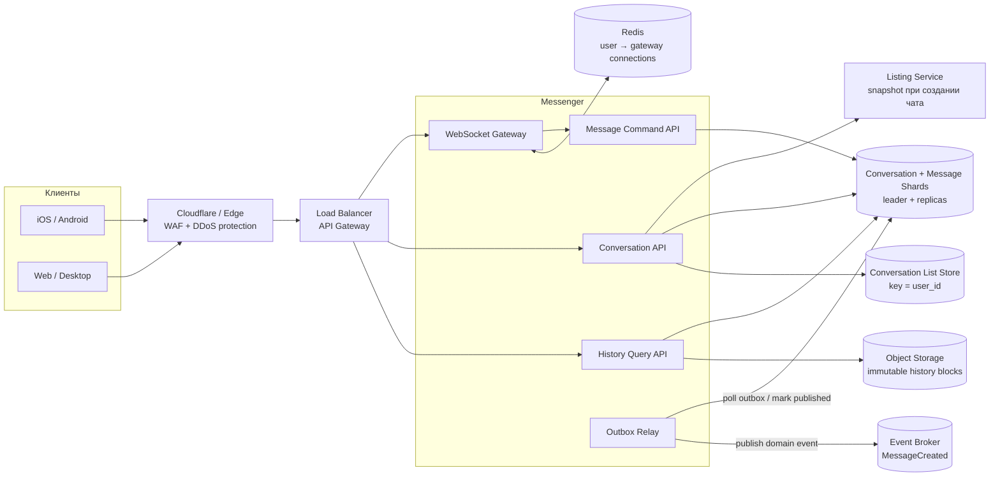
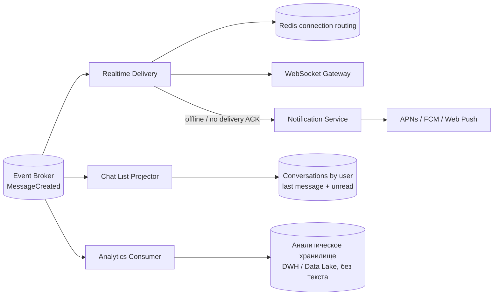

# Marketplace Messenger

## Содержание

- [Что проверяет задача](#что-проверяет-задача)
- [Фаза 1: уточнение требований](#фаза-1-уточнение-требований)
- [Фаза 2: оценка нагрузки](#фаза-2-оценка-нагрузки)
- [Ключевые концепции](#ключевые-концепции)
- [Фаза 3: высокоуровневый дизайн](#фаза-3-высокоуровневый-дизайн)
- [Фаза 4: deep dive](#фаза-4-deep-dive)
- [Сквозные потоки](#сквозные-потоки)
- [Отказы и пограничные случаи](#отказы-и-пограничные-случаи)
- [Трейдоффы](#трейдоффы)
- [Фаза 5: финал](#фаза-5-финал)
- [Interview-ready answer](#interview-ready-answer)
- [Связанные материалы](#связанные-материалы)

Разбор мессенджера торговой площадки: личный чат покупателя и продавца,
привязанный к объявлению. В отличие от общего кейса [Chat / Messaging](./04-chat-messaging.md),
здесь нет групп и медиа, зато важны независимость истории от жизненного цикла
объявления, уведомления и рост долговременного хранилища.

---

## Что проверяет задача

В этой системе три разных пути:

| Путь | Требуемая гарантия | Основной механизм |
| --- | --- | --- |
| Приём сообщения | После `SENT` сообщение не теряется | DB transaction: message + outbox |
| Realtime-доставка | Низкая задержка, повтор допустим | Event Broker + WebSocket routing |
| История | Всегда доступна участникам | Шардированное append-only хранилище + архив |

Сообщение сначала сохраняется, а уже затем доставляется онлайн и отправляется в
push. Если поставить WebSocket раньше durable-записи, получатель увидит текст,
которого после сбоя не окажется в истории.

---

## Фаза 1: уточнение требований

### Данные из условия

```text
DAU (daily active users):    3 млн
MAU (monthly active users):  30 млн
рост за 3 года:              до 10 млн DAU
размер сообщения:            до 10 KB
сообщений на DAU в день:     10 сообщений × 3 чата = 30
чтение / запись:             1:1 по числу запросов
активность:                  8 часов в день
чатов на пользователя:       15 в среднем
участников:                  ровно 2
```

### Что уточнить

```text
- Один buyer-seller чат на объявление или можно создать несколько?
- Нужны ли sent / delivered / read статусы?
- Что означает «история всегда»: одинаковый SLA для сообщения пятилетней давности?
- Можно ли редактировать или удалять отправленные сообщения?
- Нужен ли полнотекстовый поиск?
- Одно или несколько одновременно подключённых устройств?
- Какой SLA у отправки, realtime-доставки и истории?
```

### Зафиксированный scope

- Один чат на тройку `(listing_id, buyer_id, seller_id)`.
- Только текст до 10 KB; редактирование, удаление и поиск вне scope.
- Сообщение имеет состояния `SENT` и `DELIVERED`; unread считается через
  watermark — максимальный прочитанный `seq`, а не отдельный флаг на сообщении.
- Онлайн-пользователь получает сообщение по WebSocket; офлайн-пользователь — push.
- Недавняя история выдаётся с p99 < 300 мс, архивная — с p99 < 2 секунд.
- Чат сохраняет snapshot объявления и не удаляется вместе с Listing.
- «Храним всегда» означает продуктовую retention policy; обязательное удаление по
  юридическому запросу проектируется отдельным процессом.

### Нефункциональные требования

```text
send ACK после durable commit:  p99 < 300 мс
online delivery:                p99 < 500 мс
recent history page:            p99 < 300 мс
availability:                   99.99%
durability:                     подтверждённое сообщение не теряется
ordering:                       строгий seq внутри одного чата
delivery semantics:             at-least-once: событие может повториться,
                                dedup по message_id
```

«Условно бесконечно денег» позволяет держать большой запас, но не отменяет
ограничения одного журнала предзаписи (write-ahead log, WAL), время восстановления,
сетевые задержки и сложность
перебалансировки шардов.

---

## Фаза 2: оценка нагрузки

### Сообщения и RPS сейчас

```text
3 млн DAU × 30 сообщений
  = 90 млн сообщений/день

90 млн / 86 400
  ≈ 1 042 writes/с в среднем

согласованный пик ×5
  ≈ 5 210 writes/с
```

Соотношение read/write `1:1` трактуем как такое же число запросов страниц истории:

```text
history reads:
  ≈ 1 042 запросов/с в среднем
  ≈ 5 210 запросов/с в условный пик
```

Если одна страница содержит 20 максимальных сообщений по 10 KB, верхняя оценка
ответа равна 200 KB:

```text
90 млн pages/day × 200 KB
  = 18 TB/day исходящего payload

18 TB / 86 400
  ≈ 208 MB/с в среднем

условный пик ×5
  ≈ 1,04 GB/с
```

Это верхняя граница: 10 KB — лимит, а не подтверждённый средний размер.

### Рост до 10 млн DAU

```text
10 млн × 30 = 300 млн сообщений/день
300 млн / 86 400 ≈ 3 472 writes/с в среднем
пик ×5 ≈ 17 360 writes/с

payload при 10 KB на каждое сообщение:
300 млн × 10 KB = 3 TB/день
3 TB × 365 = 1,095 PB/год сырого текста
```

Одна send-транзакция меняет примерно четыре строки: conversation sequence,
message, idempotency result и outbox. В целевой пик это не четыре транзакции,
а одна транзакция примерно с четырьмя row mutations:

```text
17 360 send transactions/с × 4
  ≈ 69 440 core row mutations/с

chat-list projection для двух участников:
  17 360 × 2 ≈ 34 720 async upserts/с
```

Если `MessageCreated` несёт максимальный текст, поток в broker до репликации:

```text
17 360 × 10 KB ≈ 174 MB/с

при replication factor 3:
  около 522 MB/с broker write traffic до чтения consumers
```

Это верхняя оценка. Она требует отдельного benchmark broker и строгих прав на
delivery topic; Analytics Consumer отбрасывает текст и сохраняет только метаданные.

Для накопления нельзя умножать будущий пик на все три года. Если рост DAU
примерно линейный, среднее значение за период равно `(3 + 10) / 2 = 6,5 млн`:

```text
6,5 млн × 30 = 195 млн сообщений/день в среднем за период роста
195 млн × 1 095 дней = 213,525 млрд сообщений
213,525 млрд × 10 KB ≈ 2,14 PB сырого payload за 3 года

при replication factor 3:
  около 6,41 PB до индексов, WAL и служебных данных
```

Это верхняя оценка при заполненных 10 KB и трёх полных копиях. Реальное Object
Storage может использовать избыточное кодирование (`erasure coding`) вместо
трёх копий, поэтому его физический overhead измеряется отдельно. Вывод не
меняется: «хранить всегда» требует многоуровневого хранения (`tiered storage`),
а не одной бесконечно растущей таблицы.

### Одновременные соединения

При допущении «одна WebSocket-сессия всё активное время» средняя одновременность:

```text
сейчас:
  3 млн DAU × 8 / 24 = 1 млн соединений в среднем
  условный пик ×2 = 2 млн

через 3 года:
  10 млн × 8 / 24 ≈ 3,33 млн в среднем
  условный пик ×2 ≈ 6,67 млн
```

Число Gateway-нод выводится только из нагрузочного теста. Если benchmark целевой
конфигурации покажет 50 000 стабильных соединений на ноду с нужным запасом CPU и
памяти, пример расчёта даст `2 млн / 50 000 = 40` нод сейчас. Значение 50 000 —
допущение benchmark, а не универсальный предел Go или Linux.

### Количество чатов

Если каждый пользователь состоит в 15 чатах, а у каждого чата два участника:

```text
30 млн MAU × 15 membership edges / 2
  = около 225 млн уникальных чатов
```

---

## Ключевые концепции

### Durable-first, realtime-second

```text
Неправильно:
  WebSocket deliver → DB insert
  crash между шагами → сообщение было на экране, но исчезло из истории

Правильно:
  DB transaction(message + outbox) → ACK sender → async realtime delivery
```

Outbox — таблица доменных событий, записываемая в одной транзакции с сообщением.
Отдельный relay читает её и публикует события в broker. PostgreSQL сам в broker
ничего не отправляет.

### Conversation принадлежит Messenger, а не Listing

В чате сохраняются `listing_id` и snapshot заголовка объявления. Это ссылка на
бизнес-контекст, а не ownership:

```text
Listing удалён:
  listing_state = DELETED
  listing_snapshot остаётся
  conversation и messages остаются
```

Каскадного foreign key из Messenger в Listing нет. Иначе удаление объявления
нарушит прямое требование хранить переписку.

### Порядок и идемпотентность

Каждый send содержит созданный клиентом `client_message_id`. Внутри одного чата
сервис под блокировкой короткой conversation row выдаёт следующий `seq`, а
уникальный idempotency key не позволяет сетевому retry создать второе сообщение.

Нагрузка одного чата мала: в условии около 10 сообщений в день, участников двое.
Поэтому сериализация одной conversation row не является глобальным bottleneck:
разные чаты обновляются независимо.

---

## Фаза 3: высокоуровневый дизайн

### Основной request path



### Потребители MessageCreated



### Роль компонентов

| Компонент | Зачем нужен | Почему отдельно |
| --- | --- | --- |
| Cloudflare / Edge + API Gateway | Защищает публичный периметр, проверяет auth и маршрутизирует HTTP/WebSocket | DDoS и connection routing не относятся к хранению сообщений |
| WebSocket Gateway | Держит миллионы соединений и принимает клиентские команды | Connection lifecycle масштабируется независимо от DB writes |
| Conversation API | Создаёт и читает чат, сохраняет listing snapshot | Жизненный цикл чата отделён от сообщений и Listing Service |
| Listing Service | Возвращает seller и snapshot при создании чата | Messenger не копирует каталог и не удаляет чат вместе с Listing |
| Message Command API | Проверяет участника и транзакционно пишет message + outbox | `SENT` означает durable commit, а не успешную отправку в сокет |
| History Query API | Читает recent и archive history единым cursor API | Горячие и старые данные имеют разные latency и storage |
| Conversation List Store | Отдаёт список чатов по `user_id`, last message и unread | Async projection избегает cross-shard scan по `conversation_id` |
| DB shards | Хранят conversation, recent messages, idempotency и outbox | Routing по `conversation_id` оставляет порядок и транзакцию на одном шарде |
| Outbox Relay | Публикует сохранённые domain events | Убирает dual-write между DB и broker |
| Redis routing | Хранит connections пользователя с отдельным `expires_at` | Потеря Redis рвёт realtime routing, но не историю |
| Event Broker | Делает fan-out события независимым consumers | Push, realtime, chat list и аналитика не блокируют send ACK |
| Broker consumers | Доставляют realtime/push, строят список чатов и аналитику | Каждый поток масштабируется и повторяется независимо |
| Object Storage | Хранит старые immutable blocks | История растёт до PB, а старые сообщения читаются реже |

---

## Фаза 4: deep dive

### 4.1 API

```http
POST /v1/conversations
Idempotency-Key: open-listing-42
{"listing_id":"listing-42"}

GET /v1/conversations?after=cursor&limit=30

GET /v1/conversations/{conversation_id}/messages?before_seq=9001&limit=20
```

Команда через WebSocket:

```json
{
  "type": "send_message",
  "conversation_id": "conv-7",
  "client_message_id": "phone-1-781",
  "text": "Объявление ещё актуально?"
}
```

Ответ после DB commit:

```json
{
  "type": "message_sent",
  "message_id": "msg-9002",
  "seq": 9002,
  "client_message_id": "phone-1-781"
}
```

### 4.2 Модель данных

```text
conversations:
  conversation_id, buyer_id, seller_id,
  listing_id, listing_title_snapshot, listing_state,
  next_seq, created_at

messages:
  conversation_id, time_bucket, seq, message_id,
  sender_id, client_message_id, text, created_at

conversation_members:
  conversation_id, user_id, last_read_seq

message_idempotency:
  conversation_id, sender_id, client_message_id →
    request_hash, message_id, seq, expires_at

outbox:
  event_id, aggregate_id=conversation_id,
  event_type=MessageCreated, payload, created_at, published_at

conversations_by_user (async projection):
  user_id, last_message_at, conversation_id →
    other_user, listing_snapshot, last_message_snippet, unread_count
```

Внутри DB-шарда `messages` партиционируется по времени для обслуживания и
архивации. Routing остаётся по `conversation_id`: партиция — часть одного DB-шарда,
а не замена физическому шардингу.

### 4.3 Транзакция отправки

```text
BEGIN

1. Проверить, что sender — участник conversation.
2. INSERT idempotency guard со status=PENDING и request_hash,
   ON CONFLICT DO NOTHING.
3. При конфликте вернуть сохранённые message_id и seq;
   другой request_hash с тем же ключом отклонить.
4. Заблокировать короткую conversation row.
5. Увеличить next_seq и получить новый seq.
6. Вставить message и записать result в idempotency guard.
7. Вставить MessageCreated в outbox.

COMMIT
→ только теперь вернуть message_sent отправителю
```

Конкурирующий `INSERT` одного guard ждёт завершения первой транзакции, поэтому
два одновременных retry не получают два `seq`. Если ответ потерялся после commit,
клиент повторяет ту же команду и получает прежнее сообщение. Guard можно хранить
в течение явно заданного окна повторов, например семи дней; после него клиент
обязан создать новый `client_message_id`.

Commit подтверждается только после принятой в системе durable-записи на реплику.
Поэтому capacity шарда измеряется на полной транзакции с 10 KB payload, outbox,
индексами и репликацией, а не на одиночном `INSERT`.

Outbox relay доставляет событие `at-least-once`. Realtime Delivery, Notification
Service, projector и аналитика дедуплицируют его по `event_id` или `message_id`.

### 4.4 Realtime и push

Gateway хранит в Redis не одну строку `user → server`, а sorted set подключений:

```text
ws_conns:user-42:
  member=gate-3|phone-conn, score=expires_at
  member=gate-8|web-conn,   score=expires_at
```

Каждый heartbeat обновляет `expires_at` только своего member через `ZADD`.
Lookup сначала удаляет элементы с истёкшим score через `ZREMRANGEBYSCORE`, затем
читает живые connections. Один TTL на весь Set здесь неверен: heartbeat ноутбука
будет продлевать ключ и навсегда оставит в нём мёртвый connection телефона.
При disconnect Gateway удаляет только собственный member.

После `MessageCreated` Realtime Delivery отправляет событие во все активные
connections получателя. Если connections нет или delivery ACK не пришёл в
короткое согласованное окно, Notification Service отправляет push. Push может
прийти повторно, поэтому дедуплицируется по `message_id` на стороне сервиса и
клиента.

### 4.5 История без удаления

Recent history хранится в DB и читается по `conversation_id` и cursor `before_seq`.
Offset pagination не используется: на большой истории `OFFSET` становится всё
дороже и нестабилен при новых вставках.

После согласованного hot-retention, например 90 дней, Archive Worker:

```text
1. Берёт закрытую time partition.
2. Группирует сообщения в immutable blocks по conversation и диапазону seq.
3. Пишет blocks в Object Storage с checksum.
4. Записывает archive index: conversation + seq range → object key.
5. Проверяет копию и только затем удаляет hot partition.
```

`History Query API` по cursor понимает, читать DB или archive block. Недавняя
история сохраняет p99 < 300 мс, старая укладывается в отдельный бюджет до 2 секунд.
Если бизнес требует одинаковые 300 мс для десятилетней истории, архивирование
нужно заменить дорогим постоянно online distributed store.

### 4.6 Объявление удалено

При создании conversation сервис получает seller и snapshot заголовка из Listing
Service. После события `ListingRemoved` обновляется только `listing_state`:

```text
listing_id:             listing-42
listing_state:          DELETED
listing_title_snapshot: "Велосипед Trek 2025"
```

История продолжает открываться. Message send можно оставить разрешённым или
запретить после удаления объявления — это бизнес-решение; в данном scope чат
остаётся доступным для чтения, а новые сообщения разрешены.

### 4.7 Мониторинг и аналитика

```text
SLO:
  send_commit_latency p50/p95/p99
  online_delivery_latency p99
  history_latency recent/archive

Насыщение:
  active_websocket_connections
  DB CPU / WAL / disk / connection pools
  outbox_unpublished_age
  broker_consumer_lag
  archive_backlog_bytes

Ошибки:
  message_commit_errors
  duplicate_send_rate
  websocket_reconnect_rate
  push_provider_errors
```

Trace связывается через `client_message_id`, `message_id` и `event_id`: от команды
к DB commit, outbox, realtime и push. В аналитику передаются размеры, timestamps,
listing category и delivery outcomes, но не текст сообщения и не push token.

---

## Сквозные потоки

### 1. Создание чата по объявлению

Conversation API проверяет Listing и получает seller + snapshot → вычисляет
стабильный непрозрачный `conversation_id` через HMAC — криптографический хеш
с серверным ключом — от
`(listing_id, buyer_id, seller_id)` → `INSERT ON CONFLICT` возвращает существующий
чат или создаёт новый → проекция добавляет conversation обоим участникам.

Итог: retry не плодит чаты, а удаление Listing позже не стирает snapshot.

### 2. Отправка сообщения онлайн-получателю

WebSocket Gateway → Message Command API → DB transaction message + outbox → ACK
отправителю → relay → broker → Realtime Delivery → Redis routing → все WebSocket
connections получателя → delivery ACK.

Итог: получатель видит только уже сохранённое сообщение; повтор события безопасен.

### 3. Получатель офлайн

Durable send проходит тем же путём → routing не находит connection → Notification
Service отправляет push → при открытии приложения History API читает сообщение из
DB, а не доверяет payload уведомления.

Итог: push является сигналом открыть приложение, а не копией истории.

### 4. Чтение старой истории

History API получает `before_seq` → archive index находит immutable block → range
read из Object Storage → декодируется только нужная страница.

Итог: продукт хранит историю всегда, но старые данные не занимают дорогой hot tier.

---

## Отказы и пограничные случаи

| Сбой | Поведение |
| --- | --- |
| DB commit успешен, ACK потерян | Retry с тем же `client_message_id` возвращает прежнее сообщение |
| Broker недоступен | Send продолжает писать outbox; доставка задерживается, relay повторяет публикацию |
| Event доставлен дважды | Consumers дедуплицируют по `event_id` / `message_id` |
| WebSocket Gateway упал | Клиент reconnect'ится, missed messages читает после последнего `seq` |
| Redis routing потерян | История цела; клиенты reconnect'ятся, push служит запасным сигналом |
| Listing удалён | Snapshot и чат остаются, `listing_state=DELETED` |
| Архивация оборвалась | Hot partition не удаляется до checksum и durable archive index |
| Один DB-шард потерял quorum | Записи его conversations временно fail-closed; другие шарды работают |

---

## Трейдоффы

| Выбор | Альтернатива | Почему и чем платим |
| --- | --- | --- |
| DB-first + outbox | Kafka-first acceptance | History read-after-write проще; send зависит от DB latency |
| Текст в закрытом delivery event | В broker только `message_id`, затем DB read | Ниже realtime latency ценой до 174 MB/с сырого event payload в целевой пик |
| Shard по conversation_id | Shard по user_id | Весь чат и порядок локальны; список чатов требует async per-user projection |
| Conversation row sequence | Временная метка клиента | Строгий порядок ценой короткой row lock, приемлемой для 2 участников |
| At-least-once delivery | Попытка exactly-once end-to-end | Retry надёжен, но все consumers обязаны дедуплицировать |
| WebSocket + push fallback | Только polling | Низкая realtime latency ценой миллионов соединений и connection routing |
| Redis только для routing | Redis как message store | Потеря Redis не теряет историю; нужен отдельный durable DB path |
| Hot DB + cold Object Storage | Вся история в DB | PB-retention дешевле, но старая история имеет отдельный SLA |
| Listing snapshot | Живая обязательная ссылка | Чат переживает удаление объявления ценой возможной устарелости snapshot |
| Аналитика без текста | Полный payload в DWH | Меньше риск утечки персональных данных, но content-аналитика невозможна |

---

## Фаза 5: финал

### Двухминутное резюме

> Это marketplace messenger только для двух участников. Conversation создаётся
> на `(listing, buyer, seller)`, сохраняет listing snapshot и принадлежит домену
> Messenger, поэтому удаление объявления не удаляет историю.
>
> При текущих 3 млн DAU получаем 90 млн сообщений в день, около 1 042 writes/с
> в среднем и 5 210 в согласованный пик. При росте до 10 млн DAU — 300 млн в
> день и около 17 360 writes/с в пик. Десять KB — верхний лимит: при линейном
> росте он даёт верхнюю оценку около 2,14 PB сырого payload за три года, поэтому
> recent history держу в шардированной DB, а закрытые time partitions после
> проверки переношу в immutable blocks Object Storage.
>
> Send идёт durable-first: на shard по conversation_id одной транзакцией пишутся
> message, idempotency result и outbox, затем отправитель получает `SENT`.
> Conversation row выдаёт строгий seq; при двух участниках и десяти сообщениях в
> чат в день её contention невелик. Relay публикует `MessageCreated` at-least-once,
> а realtime, push, chat-list projector и аналитика дедуплицируют события.
>
> До двух миллионов условных peak WebSocket connections сейчас и 6,67 миллиона
> через три года обслуживают stateless gateways. Redis хранит только routing
> `user → connections`; сообщения там не лежат. Online-получателю событие идёт
> через WebSocket, offline — push, а источником истории всегда остаётся DB или
> archive. Число gateways и DB-шардов определяю benchmark целевого mixed workload,
> а не назначаю по общему правилу.

### За пределами scope и рост ×10

- Группы потребуют другой fan-out и перестанут иметь фиксированные две записи.
- Медиа потребуют object storage и claim-check, но не изменения message ordering.
- Полнотекстовый поиск добавит асинхронный per-user индекс и privacy controls.
- При ×10 отдельно масштабируются gateways по соединениям, DB virtual buckets по
  benchmark capacity, consumers по lag и archive workers по backlog bytes.

---

## Interview-ready answer

**1. Что происходит при отправке сообщения?**

- Проверка — отправитель должен быть участником conversation.
- Durable commit — message, idempotency result и outbox пишутся одной транзакцией.
- Ответ — `SENT` возвращается только после commit.
- Доставка — relay публикует событие для realtime, push и projections.

**2. Как сохраняется порядок?**

- Локальность — все сообщения чата маршрутизируются по `conversation_id` на один shard.
- Sequence — короткая conversation row выдаёт следующий `seq` внутри транзакции.
- Допущение — два участника и около 10 сообщений в чат в день не создают hot row.

**3. Как обрабатывается retry отправителя?**

- Идентификатор — клиент создаёт стабильный `client_message_id`.
- Повтор — idempotency lookup возвращает прежние `message_id` и `seq`.
- Гарантия — потерянный ACK не создаёт второе сообщение.

**4. Зачем нужны и WebSocket, и push?**

- WebSocket — доставляет online-пользователю с низкой задержкой.
- Push — будит offline-клиент или страхует недоставленное realtime-событие.
- Источник истины — клиент после открытия читает History API, а не доверяет push payload.

**5. Почему чат не удаляется вместе с объявлением?**

- Ownership — conversation принадлежит Messenger, а не Listing Service.
- Snapshot — заголовок и контекст сохраняются при создании.
- Удаление — событие Listing только меняет `listing_state`.

**6. Как хранить историю всегда?**

- Recent tier — шардированная DB обеспечивает быстрые cursor reads.
- Archive tier — закрытые time partitions превращаются в проверенные immutable blocks.
- Контракт — старая история остаётся доступной, но получает отдельный latency budget.

**7. Откуда берётся масштаб?**

- Записи — 90 млн сообщений/день сейчас и 300 млн/день при 10 млн DAU.
- Соединения — около 2 млн в условный текущий пик и 6,67 млн после роста.
- Хранилище — верхняя оценка около 2,14 PB сырого payload за три года линейного роста.
- Sizing — число узлов определяется benchmark полной транзакции и mixed workload.

---

## Связанные материалы

- [Chat / Messaging System](./04-chat-messaging.md) — группы, presence и общий messaging-case
- [Avito / Classifieds](./13-avito-classifieds.md) — жизненный цикл объявлений
- [Notification Service](./02-notification-service.md) — push, retry и dead letter queue
- [Kafka](../../07-message-brokers-and-streaming/01-kafka.md)
- [WebSocket](../../08-networking-and-api/protocols/04-realtime/01-websocket.md)
- [Redis](../../06-databases/database-systems-catalog/08-redis.md)
- [Object Storage в AWS core services](../../10-devops-and-observability/cloud/01-aws-core-services.md)
- [PostgreSQL: outbox и idempotency](../../06-databases/database-systems-catalog/postgresql/14-outbox-and-idempotency.md)
- [PostgreSQL: partitioning](../../06-databases/database-systems-catalog/postgresql/05-partitioning.md)
- [PostgreSQL: sharding](../../06-databases/database-systems-catalog/postgresql/12-sharding.md)
