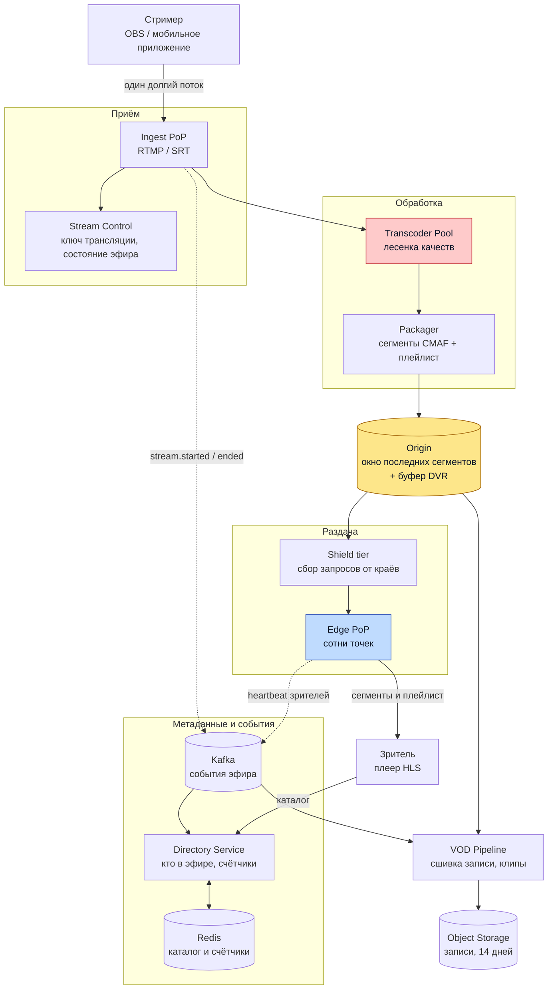

# Twitch / Live Streaming Platform

## Содержание

- [Что проверяет задача](#что-проверяет-задача)
- [Фаза 1: уточнение требований](#фаза-1-уточнение-требований)
- [Фаза 2: оценка нагрузки](#фаза-2-оценка-нагрузки)
- [Ключевые концепции](#ключевые-концепции)
- [Фаза 3: высокоуровневый дизайн](#фаза-3-высокоуровневый-дизайн)
- [Фаза 4: deep dive](#фаза-4-deep-dive)
- [Сквозные потоки](#сквозные-потоки)
- [Трейдоффы](#трейдоффы)
- [Отказы и пограничные случаи](#отказы-и-пограничные-случаи)
- [Фаза 5: финал](#фаза-5-финал)
- [Interview-ready answer](#interview-ready-answer)
- [Связанные материалы](#связанные-материалы)

Разбор задачи «спроектируй платформу живых трансляций»: десятки тысяч стримеров одновременно в эфире, миллионы зрителей, задержка от камеры до экрана в несколько секунд.

> **Термины.** **Эфир** (stream) — непрерывный поток от одного стримера. **Лесенка качеств** (transcoding ladder, ABR ladder) — набор версий одного эфира в разных разрешениях и битрейтах, между которыми плеер переключается по скорости сети. **Glass-to-glass** — задержка от момента съёмки до появления кадра у зрителя. **Сегмент** — кусок видео фиксированной длительности, который плеер скачивает отдельным запросом. **Точка присутствия** (PoP, point of presence) — площадка провайдера сети доставки, географически близкая к зрителю.

---

## Что проверяет задача

Задача выглядит как «ещё одно видео», но проверяет другое, чем [YouTube](07-youtube-video-platform.md) и [Netflix](09-netflix-streaming.md). Там контент существует до запроса: его можно перекодировать в фоне, разложить по точкам присутствия заранее и кэшировать навсегда. Здесь контента ещё нет в момент, когда зритель нажимает «смотреть».

Отсюда четыре вещи, которые интервьюер хочет услышать:

- **Транскодирование как основной расход**, а не как этап пайплайна. Оно идёт непрерывно, быстрее реального времени, для каждого активного эфира — и его нельзя ни отложить, ни поставить в очередь.
- **Экономика длинного хвоста.** Медианный канал смотрят единицы человек, а стоит он столько же, сколько канал с сотней тысяч зрителей.
- **Задержка как предмет торга.** Три секунды вместо пятнадцати покупаются десятикратным ростом числа запросов к сети доставки.
- **Асимметрия приёма и раздачи.** Входит 600 Гбит/с, выходит 24 Тбит/с — оптимизировать имеет смысл только одну сторону.

Чат во время эфира — отдельная большая задача, её разбор в [04.1 WebSocket Chat at Scale](04.1-websocket-chat-capacity.md); здесь только точка стыковки.

---

## Фаза 1: уточнение требований

### Функциональные требования

- Стример начинает и заканчивает эфир, отдавая поток с одного устройства.
- Зритель открывает канал и смотрит с минимальной задержкой, плеер сам подбирает качество под скорость сети.
- Каталог «кто сейчас в эфире» с категориями и счётчиком зрителей.
- Перемотка внутри эфира назад на несколько минут (DVR).
- Запись эфира доступна после его окончания ограниченное время.
- Клипы: короткий фрагмент, вырезанный зрителем из эфира.

### Что уточнить

- **Одно устройство на эфир или несколько?** Ответ определяет, нужен ли протокол склейки потоков. Считаем — одно.
- **Нужна ли сверхнизкая задержка (менее секунды)?** Это другой протокол и другая цена. Считаем — нет, целевая задержка 3–5 секунд.
- **Все ли эфиры получают полную лесенку качеств?** Это главный вопрос по стоимости, и по умолчанию ответ «нет».
- **Сколько живёт запись?** Определяет объём хранилища. Считаем — 14 дней.
- **Гео-охват.** Один континент или весь мир: от этого зависит, нужна ли иерархия в сети доставки.

Вне разбора: монетизация, права на контент, рекомендации, модерация видео.

### Нефункциональные требования

| Требование | Значение | Что из него следует |
|---|---|---|
| Задержка glass-to-glass | 3–5 с | Сегменты режутся на части, обычный HLS не подходит |
| Старт воспроизведения | < 2 с | Плейлист и первый сегмент отдаёт край сети, не origin |
| Доступность приёма | 99.9% | Обрыв приёма = обрыв эфира, повторить его нельзя |
| Доступность раздачи | 99.99% | Зритель переживёт секунду пропуска, но не отказ |
| Согласованность каталога | Eventual, 5–10 с | Счётчик зрителей и список эфиров — приблизительные |

Асимметрия требований к приёму и раздаче важна: приём — это одно долгоживущее соединение на эфир, и его потеря необратима. Раздача — миллионы независимых коротких запросов, каждый из которых можно повторить.

---

## Фаза 2: оценка нагрузки

Исходные допущения (на собеседовании их проговаривают вслух и записывают):

```text
100 000 эфиров одновременно на пике, ~40 000 в среднем
8 000 000 зрителей одновременно на пике, ~3 000 000 в среднем
стример отдаёт 1080p60 при 6 Мбит/с
средний зритель получает 3 Мбит/с (смесь качеств)
```

### Приём

```text
100 000 эфиров × 6 Мбит/с = 600 000 Мбит/с = 600 Гбит/с = 75 ГБ/с
```

Величина скромная: при 20 точках приёма это 30 Гбит/с на точку, то есть несколько машин с картами 10–25 Гбит/с. Приём — не то место, где система ломается.

### Транскодирование

Лесенка из пяти вариантов (1080p60, 720p60, 720p30, 480p30, 360p30) кодируется быстрее реального времени непрерывно, пока идёт эфир.

```text
допущение: одна лесенка ≈ 2 ядра CPU при аппаратном кодировании
           (программное кодирование той же лесенки — 8–10 ядер)

100 000 эфиров × 2 ядра = 200 000 ядер
при 64 ядрах на сервер: 200 000 / 64 ≈ 3 100 серверов
```

Три тысячи серверов, занятых только перекодированием, — это и есть главная статья расходов, и цифру «2 ядра» обязательно надо заменить бенчмарком своего кодировщика: разброс между программным и аппаратным путём здесь четырёхкратный, то есть от 800 до 3 100 серверов.

### Длинный хвост

Распределение зрителей по каналам степенное: несколько процентов каналов собирают почти всю аудиторию.

```text
допущение: 5% каналов собирают ~95% зрителей

полная лесенка только им:
  5% × 100 000 = 5 000 каналов × 2 ядра = 10 000 ядер ≈ 160 серверов

остальные 95 000 эфиров — пропуск исходного потока без перекодирования:
  стоимость ≈ 0 ядер, только упаковка в сегменты
```

Экономия двадцатикратная — с 3 100 серверов до 160. Это не микрооптимизация, а решение, вокруг которого строится вся экономика продукта. Именно поэтому на реальных платформах полная лесенка качеств — привилегия партнёрских каналов, а не общее свойство.

Цена решения: зритель маленького канала получает только исходное качество. На слабом мобильном канале связи ему не на что переключиться, и вместо ухудшения картинки он получит остановку воспроизведения.

### Раздача

```text
пик:     8 000 000 зрителей × 3 Мбит/с = 24 000 000 Мбит/с = 24 Тбит/с
среднее: 3 000 000 зрителей × 3 Мбит/с =  9 000 000 Мбит/с =  9 Тбит/с

асимметрия к приёму: 24 000 / 600 = 40 раз
```

Месячный объём считается по среднему, а не по пику:

```text
9 Тбит/с ÷ 8 = 1,125 ТБ/с
1,125 ТБ/с × 2 592 000 с = 2 916 000 ТБ ≈ 2,9 ЭБ/мес

по оптовой цене сети доставки $0,005/ГБ:
2,9 млрд ГБ × $0,005 ≈ $14,6 млн/мес
```

Пятнадцать миллионов долларов в месяц за один только трафик объясняют, почему платформы такого масштаба строят собственную сеть доставки и договариваются о прямых стыках с провайдерами. Логика та же, что у Open Connect в разборе [Netflix](09-netflix-streaming.md), но с важным отличием: там своя сеть ещё и заранее наполняется контентом, а живой эфир наполнить заранее нечем — экономится только транзит, не прогрев кэша.

### Запросы к сети доставки

Число запросов задаёт длина сегмента, и здесь прячется цена низкой задержки:

```text
сегменты по 4 с:      8 000 000 / 4   =  2 000 000 запросов/с
части по 400 мс:      8 000 000 / 0,4 = 20 000 000 запросов/с
```

Переход к низкой задержке умножает нагрузку на край сети на десять при том же объёме байт. Это не проблема канала, это проблема числа соединений и обработки запросов на краю.

### Хранение записей

Накопление считается по среднему числу эфиров:

```text
40 000 эфиров × 6 Мбит/с = 240 Гбит/с = 30 ГБ/с
30 ГБ/с × 86 400 = 2 592 000 ГБ ≈ 2,6 ПБ/сутки

14 дней хранения: 2,6 × 14 ≈ 36 ПБ
```

Тридцать шесть петабайт — и это только исходное качество. Хранить рядом всю лесенку означало бы удвоить объём ради данных, которые почти никто не откроет. Отсюда решение: запись хранится в одном качестве, а варианты для перемотки делаются пакетно и только для тех записей, которые действительно смотрят.

Здесь же ответ на вопрос «почему записи живут 14 дней, а не вечно»: каждый дополнительный день хранения стоит 2,6 ПБ.

---

## Ключевые концепции

### Живой контент нельзя предразместить

Сеть доставки для видео по запросу работает на предсказании: популярный фильм заливается в точки присутствия заранее, и первый же зритель получает попадание в кэш. Живой эфир существует только в момент запроса, поэтому первый зритель в каждой точке присутствия всегда вызывает обращение к источнику.

Доля попаданий здесь зависит не от истории обращений, а от того, сколько человек смотрят один канал в одной точке одновременно:

```text
сегмент живёт 4 с и запрашивается всеми зрителями канала в этой точке

500 зрителей канала в точке: 1 обращение к источнику + 499 из кэша = 99,8%
2 зрителя:                   1 + 1                                  = 50%
```

Длинный хвост бьёт дважды: сначала по транскодированию, потом по кэшу. Девяносто пять тысяч малопопулярных эфиров дают почти нулевую долю попаданий и превращают край сети в прокси к источнику.

Лечится это промежуточным слоем (shield, mid-tier): края обращаются не к источнику напрямую, а к небольшому числу промежуточных узлов, которые собирают запросы со всех краёв региона.

```text
без промежуточного слоя: 200 краёв × 1 обращение = 200 запросов к источнику на сегмент
с промежуточным слоем:   200 краёв → 4 узла → 1 запрос к источнику на сегмент
```

### Задержка торгуется против кэшируемости

```text
Обычный HLS:
  сегменты по 4 с, плеер держит буфер в 3 сегмента
  задержка ≈ 3 × 4 = 12 с буфера + кодирование и сеть → 15–30 с

Low-Latency HLS:
  сегмент режется на части по 200–500 мс, плеер начинает играть,
  не дожидаясь готовности целого сегмента
  задержка ≈ 3–5 с

WebRTC:
  отдельное соединение до каждого зрителя, без сегментов
  задержка < 1 с, но кэшировать нечего — раздача не масштабируется сетью доставки
```

Чем короче кусок, тем свежее картинка и тем больше запросов. WebRTC доводит это до предела: задержка минимальна, а стоимость раздачи растёт линейно по зрителям, потому что общего кэшируемого объекта не существует. Поэтому он уместен там, где зрителей сотни и важна интерактивность (аукцион, видеозвонок), и неуместен там, где их миллионы.

### Плейлист — самая горячая точка

Плеер перечитывает плейлист каждые несколько сотен миллисекунд, чтобы узнать о новой части. При 8 млн зрителей это тот же порядок в 20 млн запросов в секунду, что и за самими частями, но по одному и тому же ключу на канал.

Решается механизмом самого протокола: плеер шлёт блокирующий запрос с указанием, какой части он ждёт, а край сети держит соединение открытым и отвечает в момент появления. Один запрос вместо десяти опросов вхолостую.

---

## Фаза 3: высокоуровневый дизайн



### Роль каждого компонента

**Ingest PoP** — принимает поток от стримера по RTMP или SRT.

- *Зачем:* терминирует одно долгоживущее соединение, проверяет ключ трансляции, отдаёт поток дальше.
- *Почему отдельно:* это единственный компонент, где обрыв необратим. Его размещают географически близко к стримеру и держат тонким — вся тяжёлая работа вынесена, чтобы отказ обработки не ронял приём.

**Stream Control** — состояние эфира: кто в эфире, с какого момента, по какому ключу.

- *Зачем:* один источник правды о том, жив ли эфир, и защита от одновременного подключения двух устройств с одним ключом.
- *Почему отдельно:* приёмных точек десятки, а решение «этот эфир уже идёт» должно быть одно на всех.

**Transcoder Pool** — строит лесенку качеств быстрее реального времени.

- *Зачем:* даёт плееру варианты для переключения по скорости сети.
- *Почему отдельно:* это 95% стоимости системы и единственный компонент, которым управляют по признаку популярности канала. Отдельный пул позволяет включать и выключать лесенку для конкретного эфира на лету.

**Packager** — режет закодированный поток на сегменты и части, ведёт плейлист.

- *Зачем:* превращает непрерывный поток в набор объектов, которые умеет кэшировать обычная сеть доставки по HTTP.
- *Почему отдельно:* именно здесь задаётся длина части, то есть бюджет задержки. Менять её независимо от кодировщика удобнее.

**Origin** — окно последних сегментов и буфер перемотки.

- *Зачем:* источник для сети доставки и для перемотки на несколько минут назад.
- *Почему отдельно:* хранит скользящее окно (например, последние 5 минут), а не всю запись, поэтому это быстрое хранилище фиксированного размера, а не архив.

**Shield и Edge** — двухуровневая сеть доставки. Разбор общего устройства — в [04-cdn-load-balancer-reverse-proxy.md](../../08-networking-and-api/request-lifecycle/04-cdn-load-balancer-reverse-proxy.md).

- *Зачем:* раздают 24 Тбит/с и держат 20 млн запросов в секунду.
- *Почему отдельно от Origin:* без промежуточного слоя сотни краёв обращаются к источнику независимо, и для непопулярных каналов источник получает нагрузку, пропорциональную числу точек присутствия.

**Directory Service** — каталог живых эфиров и счётчики зрителей.

- *Зачем:* отвечает на запрос «кто сейчас в эфире», который делает каждый зритель при заходе.
- *Почему отдельно:* это чтение, а не видео. Держится в [Redis](../../06-databases/caching/01-redis-as-cache.md) с коротким TTL и не должно зависеть от доступности видеотракта.

**Kafka** — шина событий эфира. См. [01-kafka.md](../../07-message-brokers-and-streaming/01-kafka.md).

- *Зачем:* переносит `stream.started`, `stream.ended` и агрегированные счётчики зрителей ко всем потребителям.
- *Почему отдельно:* каталог, аналитика, уведомления подписчикам и запуск сшивки записи — четыре независимых потребителя одного события.

**VOD Pipeline** — сшивает сегменты в запись, готовит клипы.

- *Зачем:* превращает скользящее окно в постоянный объект.
- *Почему отдельно:* работает по факту завершения эфира, не в реальном времени, и его отставание никого не задерживает.

Сквозная идея — разделение по времени жизни данных. Приём и обработка живут секундами, origin — минутами, записи — днями. Компонент, который смешивает два масштаба, становится узким местом: именно поэтому origin не хранит записи, а VOD не участвует в раздаче живого.

---

## Фаза 4: deep dive

### 4.1 Приём и защита от двойного подключения

Стример подключается по RTMP или SRT с ключом трансляции. Ключ определяет канал, но не гарантирует, что подключение одно: при обрыве клиент переподключается, и старое соединение может ещё не считаться закрытым.

```text
Ingest PoP получает соединение с ключом K
  SET stream:live:{channel_id} = {pop_id, session_id} NX EX 30
  успех      → это единственный эфир, начинаем
  отказ NX   → эфир уже идёт; сравниваем session_id
                 тот же → это переподключение, перехватываем
                 другой → отклоняем со сроком, чтобы не было двух картинок
```

Ключ продлевается сердцебиением приёмной точки. Тридцать секунд выбраны как компромисс: меньше — и кратковременный сетевой сбой оборвёт эфир, больше — и стример после падения приёмной точки не сможет вернуться в эфир полминуты.

Совмещать перехват с проверкой одним запросом важно: чтение с последующей записью здесь даёт гонку, при которой две приёмные точки одновременно решают, что эфир свободен.

### 4.2 Кому достаётся лесенка качеств

Решение принимается не один раз при старте, а пересматривается по ходу эфира: канал может стать популярным за минуту.

```text
при старте эфира:
  партнёрский канал        → полная лесенка сразу
  обычный канал            → пропуск исходного потока

во время эфира, по счётчику зрителей раз в 30 с:
  зрителей > 200 и лесенки нет   → включить лесенку
  зрителей < 50 дольше 5 мин     → выключить лесенку
```

Пороги разнесены намеренно: если включать и выключать по одному и тому же числу, канал на границе будет переключаться каждые полминуты, а каждое переключение — это новая сессия кодирования и разрыв в вариантах плейлиста.

Включение лесенки на ходу не должно ломать воспроизведение: новые варианты добавляются в мастер-плейлист, уже играющие плееры продолжают на исходном качестве и подхватят остальные при следующем перечитывании.

### 4.3 Сегменты, части и бюджет задержки

Из чего складывается задержка от камеры до экрана:

```text
кодирование у стримера          0,5–1 с
сеть до приёмной точки          0,05–0,2 с
транскодирование                0,2–0,5 с
упаковка в часть 400 мс         0,4 с
доставка через сеть             0,05–0,2 с
буфер плеера (2–3 части)        0,8–1,2 с
                                --------
итого                           2–3,5 с
```

Видно, где вообще есть запас: уменьшать имеет смысл длину части и буфер плеера, всё остальное занимает доли секунды. Уменьшение части с 400 до 200 мс срезает около секунды и удваивает число запросов — те самые 20 млн в секунду превращаются в 40 млн.

Буфер плеера меньше двух частей делать опасно: любой всплеск задержки в сети приводит к остановке воспроизведения. Зритель прощает лишнюю секунду задержки, но не прощает подвисание.

### 4.4 Счётчик зрителей

Точный счётчик на канале с 500 тысячами зрителей — классический горячий ключ (см. [highload-design-patterns.md](../highload-design-patterns.md), раздел про hot key problem). Инкремент на каждое подключение и декремент на каждое отключение не выдержат ни хранилища, ни здравого смысла: зритель, переключившийся между качествами, не перестал смотреть.

Считается не событиями, а сердцебиениями:

```text
плеер шлёт heartbeat раз в 10 с:
  8 000 000 / 10 = 800 000 событий/с — слишком много для одного счётчика

агрегация в два уровня:
  край сети складывает свои сердцебиения по каналам за окно 10 с
    → 200 краёв × 100 000 живых каналов, но реально каждый край видит их сотни
  Kafka → Directory Service суммирует частичные значения по каналу
    → одна запись в Redis на канал раз в 10 с
```

Счётчик получается приблизительным и отстающим на 10–20 секунд. Для витрины этого достаточно; для выплат стримерам и рекламы считают отдельно, по журналу событий, пакетно и с задержкой.

Тот же приём с частичными счётчиками и периодической выгрузкой описан в [13-avito-classifieds.md](13-avito-classifieds.md), раздел про счётчик просмотров.

### 4.5 Каталог живых эфиров

Каталог читают все, кто заходит на платформу, а меняется он от событий `stream.started` и `stream.ended` — порядка сотен в секунду при 100 тысячах эфиров и средней длительности эфира в пару часов.

```text
100 000 эфиров / 7200 с ≈ 14 запусков и столько же остановок в секунду
```

Соотношение чтений к записям здесь на несколько порядков в пользу чтений, поэтому каталог целиком материализуется в Redis: отсортированные множества по категориям, где вес — число зрителей. Обновляется тем же потребителем, что считает зрителей.

Запрос «топ каналов в категории» превращается в один `ZREVRANGE` вместо сортировки в базе. База остаётся источником правды о каналах, но в горячем пути не участвует.

### 4.6 Запись, перемотка и клипы

Три разных потребности с разным временем жизни:

- **Перемотка внутри эфира** — окно последних минут, живёт в origin. Плеер просто запрашивает сегменты, которые ещё не вытеснены.
- **Запись эфира** — после `stream.ended` VOD Pipeline сшивает сегменты из origin в один объект и кладёт в объектное хранилище. Хранится 14 дней в одном качестве.
- **Клип** — фрагмент в 30–60 секунд, вырезанный зрителем прямо во время эфира. Здесь важно, что сегменты ещё лежат в origin: клип нарезается из них немедленно, не дожидаясь окончания эфира.

Клипы хранятся дольше записей и занимают несравнимо меньше: минута видео против нескольких часов. Это единственный контент платформы, который имеет смысл раздавать как обычный видео по запросу, с предразмещением и долгим кэшем.

### 4.7 Стыковка с чатом

Чат канала — независимая подсистема, но у неё две точки связи с видеотрактом:

- **Событие эфира.** `stream.started` и `stream.ended` приходят в чат через Kafka, чтобы комната открывалась и закрывалась вместе с эфиром.
- **Синхронизация по времени.** У зрителей разная задержка — от 3 секунд на быстром соединении до 20 на медленном. Сообщение «смотрите, что сейчас произошло» приходит к части зрителей раньше, чем сама картинка. Полностью это не лечится; частично — привязкой сообщения к позиции в эфире при повторном просмотре записи.

Расчёт нагрузки на чат при 100 тысячах комнат и больших каналах — в [04.1 WebSocket Chat at Scale](04.1-websocket-chat-capacity.md).

---

## Сквозные потоки

### 1. Стример выходит в эфир

```text
1. OBS подключается к ближайшей приёмной точке по RTMP с ключом трансляции
2. Ingest PoP проверяет ключ в Stream Control и ставит SET NX на канал
3. Поток идёт в Transcoder Pool; для обычного канала — только упаковка
4. Packager режет на части по 400 мс и пишет плейлист в origin
5. Ingest PoP публикует stream.started в Kafka
6. Directory Service добавляет канал в отсортированное множество категории
```

Итог: через 2–3 секунды после нажатия «начать эфир» канал появляется в каталоге, и первый зритель уже может его открыть.

### 2. Зритель открывает канал

```text
1. Плеер запрашивает мастер-плейлист у ближайшего края сети
2. Промах в кэше → запрос к промежуточному узлу → к origin
3. Плеер выбирает вариант по скорости сети и запрашивает части
4. Первая часть приходит из кэша, если канал в этой точке уже смотрят
5. Плеер шлёт heartbeat раз в 10 с, край агрегирует их по каналам
```

Итог: старт воспроизведения занимает меньше двух секунд, если сегмент уже в кэше края, и на 50–150 мс дольше при обращении к источнику.

### 3. Канал внезапно становится популярным

```text
1. Крупный стример отправляет свою аудиторию на маленький канал
2. За 30 с счётчик зрителей растёт с 20 до 30 000
3. Directory Service видит превышение порога и просит включить лесенку
4. Transcoder Pool берёт свободный слот, начинает кодирование вариантов
5. Packager добавляет новые варианты в мастер-плейлист
6. Плееры подхватывают их при следующем перечитывании
```

Итог: около минуты аудитория смотрит только исходное качество, потом появляются варианты. Провала в воспроизведении нет, потому что исходный поток не прерывался.

### 4. Эфир заканчивается

```text
1. Стример отключается, сердцебиение приёмной точки прекращается
2. Через 30 с ключ stream:live истекает, Stream Control помечает эфир завершённым
3. stream.ended уходит в Kafka
4. Directory Service убирает канал из каталога
5. VOD Pipeline сшивает сегменты из origin в запись и кладёт в объектное хранилище
6. Origin вытесняет сегменты канала по своему обычному окну
```

Итог: канал исчезает из каталога в пределах минуты, запись появляется через несколько минут после окончания.

---

## Трейдоффы

| Решение | Выбор | Альтернатива | Почему так |
|---|---|---|---|
| Лесенка качеств | Только популярным каналам | Всем эфирам | 3 100 серверов против 160; лесенка для канала с тремя зрителями стоит столько же, сколько для канала со ста тысячами |
| Протокол раздачи | LL-HLS, части по 400 мс | WebRTC | WebRTC даёт задержку меньше секунды, но раздача не кэшируется и растёт линейно по зрителям — на 8 млн это неприемлемо |
| Длина части | 400 мс | 200 мс | Вдвое короче даёт минус секунду задержки и плюс 20 млн запросов/с к краю сети |
| Сеть доставки | Двухуровневая, со shield | Края напрямую к origin | 95 тысяч непопулярных каналов дают почти нулевую долю попаданий; без промежуточного слоя источник получает нагрузку, кратную числу краёв |
| Счётчик зрителей | Приблизительный, по сердцебиениям | Точный, по подключениям | Точный — горячий ключ на 800 тысяч операций в секунду, и он всё равно врёт при переключении качества |
| Хранение записей | Одно качество, 14 дней | Вся лесенка бессрочно | Каждый день хранения — 2,6 ПБ; лесенка удваивает объём ради данных, которые почти не читают |
| Каталог | Материализован в Redis | Запрос в базу | Чтений на порядки больше записей: 14 изменений в секунду против миллионов чтений |

### Почему не одна сеть доставки для живого и записей

Соблазнительно раздавать всё через один слой, но у живого и записей противоположные свойства кэша. Сегмент живого эфира запрашивается всеми зрителями в течение четырёх секунд и больше не нужен никогда. Запись запрашивается редко, зато годами, и её выгодно держать долго.

Общий кэш с одной политикой вытеснения обслуживает плохо и то, и другое: живые сегменты вытесняют записи, а записи занимают место, которое нужно живым. Поэтому политики разводят по разным пулам, даже если физически это одна сеть.

---

## Отказы и пограничные случаи

| Сценарий | Что происходит | Реакция системы |
|---|---|---|
| Обрыв у стримера | Поток прекращается, сегменты кончаются | Ключ `stream:live` держится 30 с, за это время стример успевает вернуться в тот же эфир; плеер показывает буферизацию, а не ошибку |
| Отказ приёмной точки | Эфир обрывается необратимо | Клиент переподключается к другой точке; ключ с прежним `session_id` позволяет перехватить эфир, не дожидаясь истечения |
| Отказ транскодера | Варианты качества пропадают | Исходный поток идёт мимо транскодера, поэтому эфир продолжается в одном качестве; лесенка восстанавливается на свободном слоте |
| Отказ origin | Сеть доставки не может обновить сегменты | Края отдают то, что в кэше, — зритель видит несколько секунд и останавливается. Origin резервируется в паре, packager пишет в оба |
| Всплеск зрителей | Кэш края холодный, обращения к источнику растут | Промежуточный слой схлопывает их в одно; лесенка включается по порогу с запаздыванием в минуту |
| Отказ сети доставки целиком | Часть зрителей теряет поток | Плеер переключается на резервного провайдера по доменному имени с несколькими адресами; это единственный отказ, который зритель заметит |
| Отставание VOD Pipeline | Записи появляются позже | Никого не блокирует; сегменты держатся в origin дольше обычного окна до завершения сшивки |

Ключевое различие с системами, разобранными раньше: здесь нельзя «повторить попытку». В [очереди задач](05-task-queue.md) или [платежах](11-payment-system.md) повтор — основной инструмент восстановления. Живой эфир повторить нельзя: секунды, которые не доехали, потеряны навсегда. Поэтому вся отказоустойчивость здесь строится на резервировании и деградации качества, а не на повторах.

---

## Фаза 5: финал

### Двухминутное резюме

> Платформа живых трансляций отличается от видео по запросу тем, что контента
> не существует до момента запроса: его нельзя ни перекодировать в фоне, ни
> разложить по точкам присутствия заранее.
>
> Из требований: 100 тысяч эфиров одновременно, 8 миллионов зрителей на пике,
> задержка 3–5 секунд. Приём даёт 600 Гбит/с и проблемой не является. Раздача
> даёт 24 Тбит/с на пике — асимметрия в сорок раз, и почти 3 эксабайта в месяц,
> то есть порядка 15 миллионов долларов только за трафик. Это и объясняет
> собственную сеть доставки.
>
> Главная статья расходов — транскодирование: оно идёт непрерывно и быстрее
> реального времени для каждого эфира. Полная лесенка на все 100 тысяч эфиров
> потребовала бы около 3 100 серверов. Поскольку 5% каналов собирают почти всю
> аудиторию, лесенку получают только они — 160 серверов вместо 3 100, — а
> остальные идут пропуском исходного потока. Порог включения пересматривается
> по ходу эфира с разнесёнными границами, чтобы канал на границе не переключался
> каждую минуту.
>
> Задержку задаёт длина куска видео. Обычный HLS с сегментами по 4 секунды
> даёт 15–30 секунд, LL-HLS с частями по 400 миллисекунд — 3–5 секунд ценой
> роста числа запросов к краю сети с 2 до 20 миллионов в секунду. WebRTC дал бы
> меньше секунды, но его нечего кэшировать, и стоимость росла бы линейно по
> зрителям.
>
> Приём защищён от двойного подключения через SET NX с сердцебиением. Счётчик
> зрителей приблизительный: он собирается из сердцебиений плееров с агрегацией
> на краю, потому что точный — это горячий ключ на 800 тысяч операций в секунду.
> Каталог живых эфиров целиком материализован в Redis: изменений 14 в секунду,
> чтений — миллионы.
>
> Записи хранятся 14 дней в одном качестве: каждый день стоит 2,6 петабайта.
> Главное отличие от остальных разборов — здесь нет повторов: не доехавшие
> секунды потеряны навсегда, поэтому отказоустойчивость строится на
> резервировании и деградации качества.

### За пределами scope

- **Сверхнизкая задержка для интерактивных форматов.** Аукционы и совместный просмотр требуют менее секунды, а значит другого протокола для небольшой аудитории поверх той же обработки.
- **Мультибитрейтный приём.** Стример отдаёт сразу несколько качеств со своей машины, снимая часть нагрузки с транскодирования, — но упирается в его канал связи.
- **Рекомендации и разогрев.** Предсказание, какой канал вот-вот станет популярным, позволяет включить лесенку заранее, а не через минуту после всплеска.
- **Модерация видео в реальном времени.** Отдельная задача с собственным бюджетом задержки.

---

## Interview-ready answer

**1. Чем задача отличается от YouTube или Netflix?**

- Суть — контента не существует до запроса, поэтому предразместить его в сети доставки нечем.
- Транскодирование — не этап пайплайна, а непрерывный процесс быстрее реального времени на каждый эфир.
- Кэш — доля попаданий зависит не от истории обращений, а от числа одновременных зрителей канала в одной точке.
- Повторы — невозможны: не доехавшие секунды эфира потеряны, восстановление идёт только резервированием.

**2. Что здесь стоит дороже всего и как это уменьшить?**

- Раздача — 24 Тбит/с на пике и около 2,9 ЭБ в месяц, порядка 15 млн долларов только за трафик.
- Транскодирование — 100 тысяч эфиров с полной лесенкой потребовали бы около 3 100 серверов.
- Рычаг — лесенка только популярным каналам: 5% каналов собирают 95% зрителей, что даёт 160 серверов вместо 3 100.
- Цена — зритель маленького канала не может переключить качество и на слабой сети получит остановку вместо ухудшения картинки.

**3. Как выбирается протокол и длина сегмента?**

- Выбор — LL-HLS с частями по 400 мс: задержка 3–5 с при сохранении кэшируемости.
- Отказ от WebRTC — задержка меньше секунды, но общего кэшируемого объекта нет, и стоимость растёт линейно по зрителям.
- Цена низкой задержки — число запросов к краю сети растёт с 2 до 20 млн в секунду при том же объёме байт.
- Предел — буфер плеера меньше двух частей делать нельзя: всплеск задержки превратится в остановку воспроизведения.

**4. Почему сеть доставки двухуровневая?**

- Причина — 95 тысяч непопулярных каналов дают почти нулевую долю попаданий на краю.
- Без промежуточного слоя — каждый из сотен краёв обращается к источнику независимо: 200 запросов на один сегмент.
- С промежуточным слоем — запросы схлопываются до одного на сегмент.
- Побочный эффект — живое и записи разводят по разным пулам: у них противоположные политики вытеснения.

**5. Как считается число зрителей?**

- Механизм — сердцебиения плееров раз в 10 с, а не события подключения и отключения.
- Агрегация — край складывает свои сердцебиения по каналам, Directory Service суммирует частичные значения.
- Почему не точно — точный счётчик это горячий ключ на 800 тысяч операций в секунду, и он всё равно врёт при переключении качества.
- Где точность нужна — выплаты и реклама считаются отдельно, пакетно по журналу событий.

**6. Что защищает от двух эфиров с одним ключом?**

- Механизм — `SET stream:live:{channel_id} NX EX 30` при подключении, продление сердцебиением приёмной точки.
- Переподключение — совпадение `session_id` позволяет перехватить свой же эфир, не дожидаясь истечения.
- Почему одним запросом — чтение с последующей записью даёт гонку, при которой две приёмные точки решают, что канал свободен.
- Выбор 30 секунд — меньше оборвёт эфир при сетевом сбое, больше задержит возврат после отказа приёмной точки.

**7. Что происходит при внезапном всплеске зрителей?**

- Кэш — холодный на краях, обращения к источнику схлопывает промежуточный слой.
- Лесенка — включается по порогу зрителей, с запаздыванием около минуты.
- Без провала — исходный поток не прерывался, новые варианты добавляются в мастер-плейлист и подхватываются при перечитывании.
- Гистерезис — пороги включения и выключения разнесены, иначе канал на границе переключается каждые полминуты.

---

## Связанные материалы

- [07. YouTube / Video Platform](07-youtube-video-platform.md) — загрузка, пакетное транскодирование, ABR и счётчик просмотров для видео по запросу
- [09. Netflix / Streaming](09-netflix-streaming.md) — собственная сеть доставки и предразмещение контента
- [04.1 WebSocket Chat at Scale](04.1-websocket-chat-capacity.md) — расчёт чата на большие комнаты
- [13. Avito / Classifieds](13-avito-classifieds.md) — частичные счётчики и материализованные витрины
- [05. Task Queue](05-task-queue.md) — как выглядит восстановление там, где повтор возможен
- [Highload Design Patterns](../highload-design-patterns.md) — горячий ключ, fan-out, backpressure, стоимость на масштабе
- [CDN, балансировщики и обратные прокси](../../08-networking-and-api/request-lifecycle/04-cdn-load-balancer-reverse-proxy.md)
- [Redis как кэш](../../06-databases/caching/01-redis-as-cache.md)
- [Kafka](../../07-message-brokers-and-streaming/01-kafka.md)
- [Как проходить System Design Interview](00-how-to-approach.md) — фреймворк, тайминг и техника прикидок
