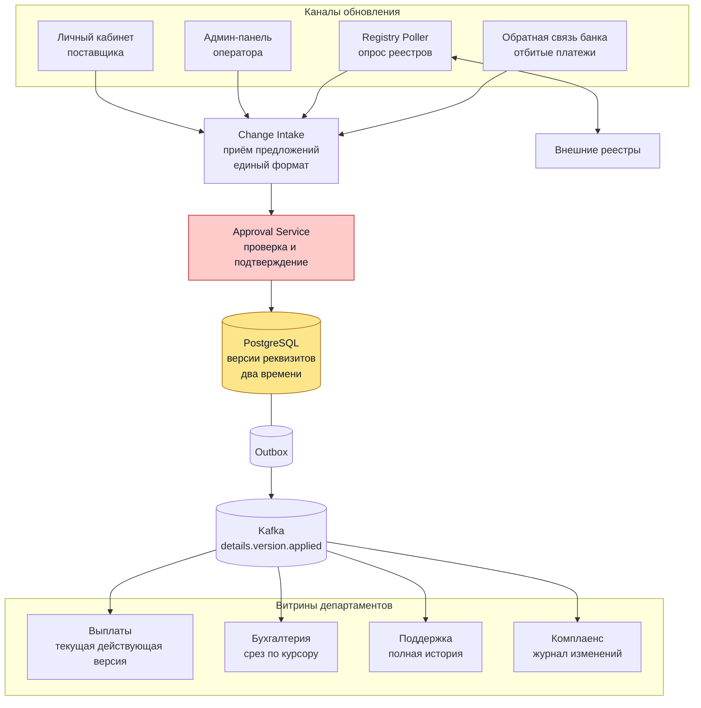
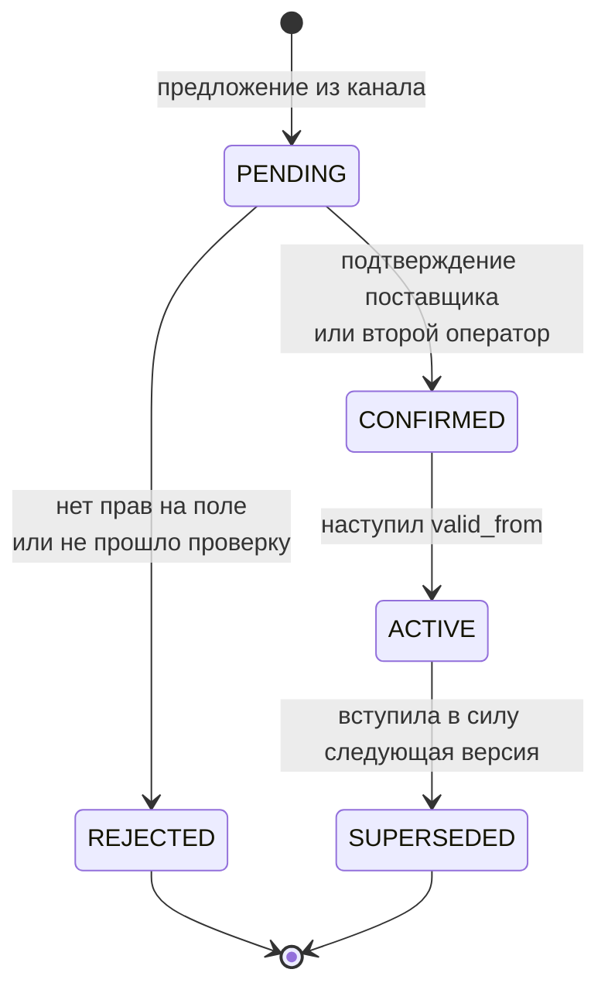

# Банковские реквизиты поставщиков

## Содержание

- [Что проверяет задача](#что-проверяет-задача)
- [Фаза 1: уточнение требований](#фаза-1-уточнение-требований)
- [Фаза 2: оценка нагрузки](#фаза-2-оценка-нагрузки)
- [Ключевые концепции](#ключевые-концепции)
- [Фаза 3: высокоуровневый дизайн](#фаза-3-высокоуровневый-дизайн)
- [Фаза 4: deep dive](#фаза-4-deep-dive)
- [Сквозные потоки](#сквозные-потоки)
- [Трейдоффы](#трейдоффы)
- [Отказы и пограничные случаи](#отказы-и-пограничные-случаи)
- [Двухминутное резюме](#двухминутное-резюме)
- [Связанные материалы](#связанные-материалы)

Разбор задачи «спроектируйте хранение и обновление банковских реквизитов поставщиков на маркетплейсе». Реквизиты меняются из трёх источников с разными правами, расходятся по департаментам с разными потребностями, и на время сдачи отчётности бухгалтерия должна видеть неподвижную картину — но обновления при этом терять нельзя.

> **Термины.** **Реквизиты** — набор данных для перечисления денег поставщику: расчётный счёт, БИК банка, наименование получателя, налоговые идентификаторы. **Витрина** (`read model`) — отдельное представление данных под конкретного потребителя. **Бизнес-время** (`valid time`) — период, когда факт верен в реальном мире. **Системное время** (`transaction time`) — момент, когда система об этом узнала. Модель, хранящая оба, называется **битемпоральной**. **Отчётный период** — интервал, за который сдаётся отчётность; после его закрытия цифры менять нельзя.

---

## Что проверяет задача

Это не задача про нагрузку. Поставщиков сотни тысяч, реквизиты меняются у процента в месяц — поток измеряется единицами изменений в час, и любая база справится. Проверяют другое:

- **Умение не свести три источника к «кто последний, тот и прав».** У личного кабинета, оператора и внешнего реестра разные права на разные поля, и разрешение конфликтов по времени записи здесь приводит к потере денег.
- **Понимание, что изменение реквизитов — это операция с деньгами.** Подменённый счёт уводит выплаты, поэтому изменение проходит проверку и вступает в силу отложенно, а не применяется по `UPDATE`.
- **Различение блокировки и среза.** Формулировка «данные заморожены» звучит как запрет записи, но запрещать запись нельзя — обновления не перестают приходить оттого, что у бухгалтерии отчётность.
- **Работу с двумя временами.** Отличать «когда мы узнали» от «с какого момента верно» приходится ровно в задачах такого типа, и без этого различия доп. задача не решается вовсе.

---

## Фаза 1: уточнение требований

### Функциональные требования

- Хранить банковские реквизиты поставщика и всю историю их изменений.
- Принимать обновления из трёх каналов: личный кабинет поставщика, админ-панель оператора, автоматический опрос внешних источников.
- Отдавать актуальные реквизиты департаментам: выплаты, бухгалтерия, поддержка, комплаенс.
- Показывать, кто, когда и на основании чего изменил данные.
- Позволять бухгалтерии работать с неподвижным срезом на период сдачи отчётности.

### Что уточнить

- **Кто главный при расхождении?** Реестр говорит одно, поставщик — другое. Это первый вопрос: без ответа модель конфликтов не строится.
- **Изменение применяется сразу или после проверки?** Для реквизитов выплат ответ почти всегда «после», но подтвердить стоит.
- **Есть ли обратная связь от банка?** Отклонённый платёж («счёт закрыт») — это тоже источник данных, и часто самый достоверный.
- **Что означает «заморожены» для бухгалтерии?** Запрет на запись в систему или неподвижность их собственной отчётной картины. Разница принципиальная.
- **Что делать с изменением, которое не может ждать?** Счёт закрыт, выплаты отбиваются — нужен ли путь в обход заморозки.
- **Сколько внешних источников и какие у них лимиты?** От этого зависит, можно ли опрашивать всех.

Вне разбора: сам перевод денег (это [11. Payment System](./11-payment-system.md)), проверка поставщика при регистрации, документооборот.

### Нефункциональные требования

| Требование | Значение | Что из него следует |
|---|---|---|
| Сохранность | Потеря изменения недопустима | Версии не перезаписываются, только добавляются |
| Аудит | Полная история с источником и основанием | Источник и ссылка на основание — обязательные поля версии |
| Согласованность выплат | Строгая | Платёж закрепляет конкретную версию, а не читает «текущие» на лету |
| Согласованность витрин | Eventual, секунды | Департаменты получают обновления событиями |
| Задержка чтения | p99 < 100 мс | Витрины материализованы, join'ов по истории на горячем пути нет |
| Доступность записи | Не снижается при заморозке | Заморозка — свойство чтения, а не запрета на запись |

---

## Фаза 2: оценка нагрузки

Допущения проговариваются вслух:

```text
поставщиков на площадке:         500 000
доля меняющих реквизиты:         ~1% в месяц
внешних источников:              1-2 реестра с лимитом обращений
выплаты:                         ежедневный пакет
```

**Поток изменений:**

```text
500 000 × 1% = 5 000 изменений/месяц
5 000 / 30 / 86 400 ≈ 0,002 изменения/с
```

Два изменения на тысячу секунд. Это не опечатка — реквизиты по своей природе почти неподвижны.

**Хранение:**

```text
одна версия ≈ 500 Б (счёт, БИК, наименование, идентификаторы, источник, времена)
за десять лет у поставщика накопится ~20 версий

500 000 × 20 × 500 Б = 5 ГБ
```

Пять гигабайт со всей историей за десятилетие. Ни партиционирования, ни архива не требуется.

**Чтение при выплатах:**

```text
500 000 чтений в пакетном окне
если окно 2 часа: 500 000 / 7 200 ≈ 70 чтений/с
```

**Опрос внешних источников** — единственное место, где есть настоящее ограничение:

```text
если опрашивать всех раз в месяц:
  500 000 / 30 / 86 400 ≈ 0,2 запроса/с — реестр выдержит

если опрашивать всех ежедневно:
  500 000 / 86 400 ≈ 5,8 запроса/с — упрёмся в лимит реестра,
  который обычно измеряется единицами запросов в секунду
```

**Выводы, влияющие на архитектуру:**

1. **Нагрузка не является ограничением.** Одного экземпляра PostgreSQL хватает с многократным запасом. Проектировать под неё нечего, и это надо сказать вслух: сложность здесь в модели данных и в правах, а не в масштабе.
2. **Единственное место с реальным лимитом — внешний реестр.** Опрашивать всех подряд ежедневно нельзя, значит нужен приоритет: перед выплатой, по признаку риска, по давности проверки.
3. **История дешёвая.** При таких объёмах хранить каждую версию вместо перезаписи ничего не стоит, а даёт аудит, разбор инцидентов и решение задачи с заморозкой.
4. **Витрины департаментов можно материализовать целиком.** 500 тысяч записей помещаются в память, поэтому чтение не станет проблемой ни при какой схеме.

---

## Ключевые концепции

### Три канала — это не три писателя одной строки

Соблазн: одна строка `vendor_bank_details`, три источника делают в неё `UPDATE`, побеждает последний. Так делать нельзя, и причина не в гонках, а в правах.

| Источник | Чему авторитетен | Чего не может |
|---|---|---|
| Личный кабинет | Расчётный счёт, банк получателя | Менять юридическое наименование и налоговые идентификаторы |
| Админ-панель оператора | Исправление ошибок, снятие блокировки | Менять без указанного основания и без второго подтверждения |
| Внешний реестр | Юридические факты: наименование, идентификаторы, статус организации | Менять расчётный счёт — его реестр не знает |

Разрешение конфликта идёт по полю, а не по времени. Реестр сообщил о ликвидации организации — выплаты блокируются независимо от того, что поставщик написал в кабинете час назад. Поставщик сменил счёт — реестр этому не противоречит, потому что про счета ничего не знает.

Практический вывод: источник хранится вместе со значением, а не теряется при записи. Без этого поля вопрос «почему тут это наименование» становится неотвечаемым.

### Изменение реквизитов — операция с деньгами

Смена расчётного счёта — это перенаправление денежного потока. Для злоумышленника, получившего доступ к кабинету поставщика, это и есть цель атаки: не украсть данные, а поменять счёт и дождаться выплаты.

Отсюда изменение не является `UPDATE`. Это предложение, которое проходит проверку:

```text
предложено → проверено → вступает в силу с указанного момента
```

Между «предложено» и «вступает в силу» стоит подтверждение и, как правило, выдержка по времени: даже подтверждённая смена счёта начинает действовать не мгновенно. Задержка нужна, чтобы у настоящего владельца было время заметить уведомление и отменить изменение.

### Заморозка — это свойство читателя, а не запрет писателю

Формулировка «бухгалтерия не может обновлять данные пять дней, данные должны быть заморожены» читается как блокировка записи. Блокировать запись нельзя: поставщики продолжают менять счета, реестры продолжают отдавать обновления, банк продолжает отбивать платежи. Остановить это невозможно, а копить в стороне и вливать потом — значит потерять порядок событий.

Настоящее требование другое: у бухгалтерии не должна двигаться картина, на основании которой считается отчётность. Это описывается не блокировкой, а срезом по системному времени: бухгалтерия читает состояние «каким оно было известно на момент закрытия периода», а записи продолжают поступать в общую таблицу.

Отсюда и вторая часть требования — «в этот же период необходимо применить обновления» — перестаёт быть противоречием, но об этом ниже, в отдельном разделе deep dive.

---

## Фаза 3: высокоуровневый дизайн



### Роль каждого компонента

Сквозная идея — разделение записи и чтения по времени: на записи единственная таблица версий с двумя временами, на чтении несколько витрин, каждая со своей временнóй семантикой. Департаменты отличаются не набором полей, а тем, на какой момент они смотрят.

**Change Intake.**
*Зачем:* принимает предложение об изменении из любого канала и приводит его к единому виду — что меняется, у кого, из какого источника, на основании чего.
*Почему отдельно:* каналов четыре и они будут добавляться. Без общей точки входа правила проверки придётся дублировать в кабинете, админке и опросчике, и они разойдутся. Это тот же защитный слой, что и адаптеры источников в [15. TMS](./15-tms-transport-management.md).

**Approval Service.**
*Зачем:* решает, что происходит с предложением: применить сразу, потребовать подтверждения поставщика, потребовать второго оператора, отклонить.
*Почему отдельно:* правила зависят от источника, поля и суммы риска, меняются чаще остального кода и должны быть в одном месте для аудита. Смешав их с приёмом, невозможно ответить на вопрос комплаенса «по какому правилу это прошло».

**Хранилище версий (PostgreSQL).**
*Зачем:* единственный источник правды. Версии добавляются, не перезаписываются.
*Почему реляционная база и одна:* объём — 5 ГБ, нужны транзакции при закрытии предыдущей версии и открытии новой, а запросы «состояние на момент T» естественно ложатся на индексы по времени. Специализированное хранилище здесь было бы усложнением без выигрыша.

**Outbox и брокер.**
*Зачем:* доставить факт «версия вступила в силу» всем департаментам.
*Почему через outbox:* запись версии и публикация события должны быть атомарны, иначе выплаты продолжат платить на старый счёт, потому что событие потерялось. Механика — [09-saga-and-outbox.md](../../04-architecture-and-patterns/patterns/09-saga-and-outbox.md), профиль брокера — [Kafka](../../07-message-brokers-and-streaming/01-kafka.md).

**Registry Poller.**
*Зачем:* обходит внешние реестры и подаёт расхождения в общий приём.
*Почему отдельно:* работает по расписанию, упирается в чужие лимиты и обязан переживать недоступность источника, не влияя на остальную систему. Ограничение частоты — [04-rate-limiting.md](../reliability-patterns/04-rate-limiting.md), предохранитель на недоступный реестр — [03-circuit-breaker.md](../reliability-patterns/03-circuit-breaker.md).

**Витрины департаментов.**
*Зачем:* каждый департамент читает своё представление, а не общую таблицу с историей.
*Почему отдельно для каждого:* у них разная временнáя семантика, и это главное различие. Выплаты смотрят на действующую версию сейчас, бухгалтерия — на срез по своему курсору, поддержка — на всю историю, комплаенс — на журнал решений. Одна таблица не может обслуживать четыре разных вопроса о времени без того, чтобы каждый потребитель писал свои условия и ошибался в них.

---

## Фаза 4: deep dive

### Модель данных: две шкалы времени

```sql
CREATE TABLE bank_details_versions (
  id           UUID PRIMARY KEY,
  vendor_id    UUID        NOT NULL,

  account      TEXT        NOT NULL,        -- расчётный счёт
  bic          TEXT        NOT NULL,        -- БИК банка
  beneficiary  TEXT        NOT NULL,        -- наименование получателя
  tax_ids      JSONB       NOT NULL,        -- налоговые идентификаторы

  source       TEXT        NOT NULL,        -- CABINET | OPERATOR | REGISTRY | BANK_FEEDBACK
  source_ref   TEXT        NOT NULL,        -- заявка, оператор, выписка реестра, отбивка
  approved_by  TEXT,                        -- кто подтвердил, для OPERATOR обязательно

  valid_from   TIMESTAMPTZ NOT NULL,        -- бизнес-время: с какого момента верно
  valid_to     TIMESTAMPTZ,                 -- NULL — действует сейчас
  recorded_at  TIMESTAMPTZ NOT NULL DEFAULT now(),  -- системное время: когда узнали

  status       TEXT        NOT NULL         -- PENDING | ACTIVE | REJECTED | SUPERSEDED
);

CREATE INDEX ON bank_details_versions (vendor_id, valid_from DESC, recorded_at DESC);
CREATE INDEX ON bank_details_versions (recorded_at);          -- для срезов
CREATE UNIQUE INDEX ON bank_details_versions (vendor_id)
  WHERE status = 'ACTIVE' AND valid_to IS NULL;               -- одна действующая версия
```

Два времени отвечают на разные вопросы, и путать их нельзя:

```text
valid_from / valid_to  — «с какого момента реквизиты верны в реальности»
                          поставщик сменил счёт с первого числа, а сообщил третьего:
                          valid_from = 1-е

recorded_at            — «когда мы об этом узнали»
                          recorded_at = 3-е
```

Частичный уникальный индекс — важная деталь: он на уровне базы запрещает существование двух действующих версий у одного поставщика. Без него любая гонка между каналами оставит два счёта, и выбор между ними станет случайным.

Запрос действующих реквизитов:

```sql
SELECT * FROM bank_details_versions
WHERE vendor_id = $1 AND status = 'ACTIVE' AND valid_to IS NULL;
```

Запрос состояния на произвольный момент — тот же индекс, два условия по разным временам:

```sql
SELECT * FROM bank_details_versions
WHERE vendor_id = $1
  AND recorded_at <= $known_at          -- что мы знали на этот момент
  AND valid_from <= $effective_at       -- что действовало на этот момент
  AND (valid_to IS NULL OR valid_to > $effective_at)
  AND status = 'ACTIVE'
ORDER BY valid_from DESC, recorded_at DESC
LIMIT 1;
```

### Разрешение конфликтов между каналами

Побеждает не поздняя запись, а право на поле. Реализуется таблицей правил, а не условиями в коде:

```text
поле         │ CABINET │ OPERATOR │ REGISTRY │ BANK_FEEDBACK
─────────────┼─────────┼──────────┼──────────┼──────────────
account      │   да    │    да    │    нет   │  только блок
bic          │   да    │    да    │    нет   │  только блок
beneficiary  │   нет   │    да    │    да    │      нет
tax_ids      │   нет   │    да    │    да    │      нет
статус       │   нет   │    да    │    да    │       да
```

Предложение, затрагивающее поле вне своих прав, отклоняется с явной причиной, а не применяется частично. Частичное применение хуже отказа: получится версия, которой никто не предлагал.

Отбивка банка попадает в отдельную колонку прав намеренно. Она не может сказать, какой счёт правильный, но её сообщение «счёт закрыт» — самый достоверный сигнал в системе, потому что это результат реальной попытки перевода. Поэтому она блокирует выплаты и поднимает задачу оператору.

### Жизненный цикл изменения



Между `CONFIRMED` и `ACTIVE` стоит выдержка, и это главная защита от подмены счёта:

- Смена счёта из кабинета требует второго фактора и уведомления, которое уходит на прежние контакты. На новые слать бесполезно: их поменял тот же, кто менял счёт.
- Изменение вступает в силу с задержкой (например, сутки), в течение которой поставщик может отменить его по ссылке из уведомления.
- Изменение оператором требует второго оператора и обязательного основания. Оператор с доступом к админ-панели — такой же вектор атаки, как скомпрометированный кабинет, и `approved_by` в схеме именно об этом.
- Проверка счёта копеечным переводом с подтверждением суммы даёт доказательство владения счётом до первой крупной выплаты.

Выплата закрепляет версию: в платёж записывается `version_id`, а не «текущие реквизиты». Иначе разбор инцидента «куда ушли деньги» упирается в то, что реквизиты с тех пор менялись дважды. Механика идемпотентности и закрепления — [11. Payment System](./11-payment-system.md).

### Опрос внешних источников

Ограничение здесь чужое, а не своё: реестр допускает единицы запросов в секунду. Всех подряд ежедневно опросить нельзя (5,8 запроса/с), поэтому очередь опроса приоритизируется:

```text
1. Перед крупной выплатой — точечно, по требованию
2. По давности проверки — кто не проверялся дольше всех
3. По признаку риска — недавняя смена реквизитов, жалобы, отбивки банка
4. Фоном — все остальные, с частотой раз в месяц (0,2 запроса/с)
```

Ключевая деталь реализации в том, что опрос не создаёт версию, если ничего не изменилось. Наивный опросчик пишет новую версию на каждый ответ реестра и за месяц раздувает историю в тридцать раз, делая её нечитаемой.

```text
ответ реестра → нормализовать → hash значимых полей
  hash совпал с действующей версией → записать только факт проверки
  hash отличается                   → создать предложение об изменении
```

Факт проверки («реестр подтвердил те же данные») хранится отдельно от версий — это журнал, а не изменение.

### Витрины департаментов

Все четыре строятся из одного потока событий, но отвечают на разные вопросы:

| Витрина | Вопрос | Что хранит |
|---|---|---|
| Выплаты | «Куда платить сейчас» | Действующая версия, обновляется событием |
| Бухгалтерия | «Что было известно на момент закрытия периода» | Курсор системного времени плюс материализованный на него срез |
| Поддержка | «Почему платёж ушёл на старый счёт» | Полная история версий с источниками |
| Комплаенс | «Кто и на каком основании изменил» | Журнал решений: предложение, правило, подтвердивший |

Выплаты и бухгалтерия смотрят на одни и те же данные, но на разные моменты, и это не дублирование, а разная семантика. Попытка обслужить обе одной таблицей приводит к тому, что условия по времени пишет каждый потребитель сам — и ошибается в них.

### Заморозка на период отчётности

Это доп. задача, и решается она разделением двух времён, которые в наивной модели слиты.

**Что не работает.** Запретить запись на пять дней — обновления не перестанут приходить. Копить их в отдельной очереди и влить после — потеряется порядок и связь с бизнес-временем, а выплаты все эти дни будут идти по устаревшим данным.

**Что работает.** У бухгалтерии есть собственный курсор системного времени:

```sql
-- Курсор бухгалтерии на момент закрытия периода
UPDATE department_cursors
SET known_at = '2026-08-01 00:00:00+00'   -- заморожен
WHERE department = 'accounting';
```

Все её запросы получают `recorded_at <= known_at`. Записи продолжают поступать в общую таблицу и просто невидимы для этой витрины. Никакой блокировки не существует — есть срез.

```text
1 авг: курсор бухгалтерии зафиксирован, отчётность считается по срезу
2 авг: поставщик сменил счёт  → версия записана, recorded_at = 2 авг
3 авг: реестр обновил название → версия записана, recorded_at = 3 авг
        ↑ обе невидимы для бухгалтерии, видимы для выплат

6 авг: отчётность сдана, курсор сдвигается на now()
        бухгалтерия видит обе версии сразу и знает, что именно изменилось:
        SELECT ... WHERE recorded_at BETWEEN '2026-08-01' AND now()
```

**Теперь вторая половина требования** — «в этот же период необходимо применить обновления». На поверхности это противоречие, но его снимает разделение времён. Замораживать нужно не всё, а только то, что влияет на закрываемый период:

```text
изменение с valid_from ПОСЛЕ конца отчётного периода
  → цифры закрываемого периода не трогает
  → применяется сразу, курсор не мешает

изменение с valid_from ВНУТРИ закрываемого периода
  → меняет уже посчитанные цифры
  → требует явного исключения: подтверждение главного бухгалтера
    и отметка в отчётности
```

Большинство изменений попадает в первую категорию: поставщик меняет счёт с сегодняшнего дня, а закрывается прошлый месяц. Они применяются свободно, и никакого конфликта нет вовсе. Вторая категория — редкие исправления задним числом, и по ним нужно ручное решение, а не автоматика.

Отдельно стоит зафиксировать: заморозка бухгалтерии не касается выплат. Их витрина живёт по текущему времени, потому что платить на закрытый счёт нельзя независимо от того, сдаёт ли кто-то отчётность. Это ровно тот случай, когда одно хранилище с разными витринами оказывается дешевле, чем попытка договориться об общем представлении.

Исключения обязаны иметь путь в системе. Если его не сделать, он появится сам — в виде ручных правок в базе в обход всех проверок, и именно на них потом не найдётся аудита.

---

## Сквозные потоки

### 1. Поставщик меняет счёт через кабинет

```text
Кабинет → Change Intake (источник CABINET, поля account+bic — в правах)
  → Approval: требуется второй фактор + уведомление на прежние контакты
  → CONFIRMED, valid_from = завтра (выдержка сутки)
  → наступает valid_from: прежняя версия SUPERSEDED, новая ACTIVE
  → outbox → событие → витрина выплат обновилась
```

*Итог:* счёт меняется не мгновенно, у настоящего владельца есть сутки на отмену, а история сохраняет обе версии с основанием.

### 2. Реестр сообщает о смене наименования

```text
Poller опрашивает реестр → hash значимых полей отличается
  → предложение (источник REGISTRY, поле beneficiary — в правах)
  → Approval: реестр авторитетен для этого поля, подтверждение не нужно
  → ACTIVE сразу, valid_from = дата из выписки реестра, а не now()
  → событие → витрины
```

*Итог:* юридические факты приходят автоматически и с правильным бизнес-временем; расчётный счёт при этом не тронут, потому что реестр не имеет на него прав.

### 3. Банк отбил платёж

```text
Отбивка «счёт закрыт» → Change Intake (источник BANK_FEEDBACK)
  → права позволяют только блокировку → статус реквизитов BLOCKED
  → выплаты этому поставщику останавливаются
  → задача оператору, уведомление поставщику
```

*Итог:* самый достоверный сигнал в системе останавливает деньги немедленно, но не подменяет реквизиты — правильные значения должен подтвердить человек.

### 4. Обновление приходит во время заморозки

```text
2 авг, курсор бухгалтерии стоит на 1 авг
Поставщик меняет счёт с valid_from = 3 авг
  → версия записана, recorded_at = 2 авг
  → витрина выплат: видит и с 3 авг платит на новый счёт
  → витрина бухгалтерии: не видит, отчётность за июль неподвижна
  → valid_from вне закрываемого периода → исключение не требуется
6 авг: отчётность сдана, курсор → now(), бухгалтерия видит изменение
```

*Итог:* запись не блокировалась ни на секунду, отчётность не поехала, обновление применилось вовремя.

---

## Трейдоффы

| Решение | Принятое | Альтернатива | Почему так |
|---|---|---|---|
| Хранение | Версии добавляются | `UPDATE` строки с реквизитами | История стоит 5 ГБ за десять лет и решает аудит, разбор инцидентов и заморозку |
| Конфликты каналов | Права на поле | Побеждает последняя запись | Реестр не знает счетов, кабинет не знает юридических фактов; «последний прав» уводит деньги |
| Применение изменения | Предложение с подтверждением и выдержкой | Прямая запись | Смена счёта — перенаправление денег; выдержка даёт время отменить подмену |
| Реквизиты в платеже | Закрепляется `version_id` | Читаются текущие при исполнении | Иначе разбор «куда ушли деньги» невозможен: реквизиты с тех пор менялись |
| Заморозка | Курсор системного времени у витрины | Запрет записи на пять дней | Обновления не перестают приходить оттого, что идёт отчётность |
| Правки задним числом | Явное исключение с подтверждением | Запретить совсем либо применять молча | Запретить — получить ручные правки в базе; применять молча — сдвинуть сданную отчётность |
| Витрины | Своя на департамент | Одна общая таблица | Различие не в полях, а во времени; общая таблица заставляет каждого писать условия самому |
| Опрос реестров | По приоритету, версия только при изменении | Всех подряд ежедневно | 5,8 запроса/с не пропустит реестр, а запись на каждый ответ раздувает историю в 30 раз |
| Хранилище | Один PostgreSQL | Шардирование, специализированная БД | 5 ГБ и 0,002 записи/с; сложность не окупается ничем |

---

## Отказы и пограничные случаи

| Сценарий | Поведение системы |
|---|---|
| Реестр недоступен | Предохранитель размыкается, опрос откладывается; действующие версии не трогаются — отсутствие ответа не является изменением |
| Два канала предложили изменение одновременно | Частичный уникальный индекс не даст двум версиям стать действующими; вторая получает отказ и уходит на разбор оператору |
| Событие в брокер не доставлено | Outbox повторяет публикацию; витрина выплат отстаёт, но платёж читает витрину с проверкой версии и при расхождении идёт в источник правды |
| Изменение подтверждено, но `valid_from` в прошлом | Требует того же исключения, что и правка задним числом: оно меняет уже посчитанное |
| Поставщик отменил изменение после подтверждения | Версия переходит в `REJECTED` до наступления `valid_from`; после наступления отмена оформляется новой версией, а не удалением |
| Курсор бухгалтерии забыли сдвинуть | Витрина тихо отстаёт — нужен алерт на возраст курсора, иначе расхождение обнаружится через месяц |
| Оператор изменил данные без основания | Не проходит проверку: `approved_by` и `source_ref` обязательны для источника `OPERATOR` |

---

## Двухминутное резюме

> Задача выглядит как CRUD, но нагрузки здесь нет: 500 тысяч поставщиков, около
> процента меняет реквизиты в месяц — это 0,002 записи в секунду и 5 гигабайт
> со всей историей за десять лет. Одного PostgreSQL хватает с запасом, поэтому
> проектировать надо не масштаб, а модель данных и права.
>
> Три канала — это не три писателя одной строки. У каждого свои права на поля:
> кабинет владеет счётом, реестр — юридическими фактами, оператор может
> исправлять, но только со вторым подтверждением и основанием. Отбивка банка
> «счёт закрыт» не меняет реквизиты, но блокирует выплаты, потому что это самый
> достоверный сигнал в системе — результат реальной попытки перевода.
> Разрешение конфликта идёт по праву на поле, а не по времени записи.
>
> Смена счёта — это перенаправление денег, поэтому она не `UPDATE`, а
> предложение: второй фактор, уведомление на прежние контакты, выдержка сутки
> на отмену. Платёж закрепляет конкретный `version_id`, иначе на разборе
> инцидента невозможно сказать, куда ушли деньги.
>
> Версии не перезаписываются, и у каждой два времени: `valid_from` — с какого
> момента реквизиты верны в реальности, `recorded_at` — когда мы об этом узнали.
> Это различие и решает задачу с отчётностью.
>
> Заморозка бухгалтерии — не запрет записи, а срез. У департамента свой курсор
> системного времени: все его запросы получают `recorded_at <= known_at`,
> а записи продолжают поступать в общую таблицу и просто невидимы этой витрине.
> Выплаты при этом живут по текущему времени и платят на новый счёт.
>
> Вторая половина требования — «применить обновления в тот же период» — снимается
> тем же разделением. Изменение с `valid_from` после конца отчётного периода
> цифры не трогает и применяется свободно; таких большинство. Изменение внутри
> закрываемого периода меняет уже посчитанное и требует явного исключения с
> подтверждением. Путь для исключений обязателен: без него появятся ручные
> правки в базе, по которым потом не найдётся аудита.

---

## Связанные материалы

- [11. Payment System](./11-payment-system.md) — исполнение выплат, идемпотентность, сверки
- [12. Marketplace Vendor Notifications](./12-marketplace-vendor-notifications.md) — доставка событий поставщикам
- [15. TMS / Transport Management](./15-tms-transport-management.md) — нормализация разнородных источников защитным слоем
- [Saga и Outbox](../../04-architecture-and-patterns/patterns/09-saga-and-outbox.md) — атомарность записи и события
- [Идемпотентность](../reliability-patterns/06-idempotency.md) — повторы предложений из внешних каналов
- [Ограничение частоты](../reliability-patterns/04-rate-limiting.md) и [circuit breaker](../reliability-patterns/03-circuit-breaker.md) — работа с чужими лимитами при опросе реестров
- [PostgreSQL: партиционирование](../../06-databases/database-systems-catalog/postgresql/05-partitioning.md) — если история всё же вырастет
- [Как проходить System Design Interview](./00-how-to-approach.md) — фреймворк и техника прикидок
