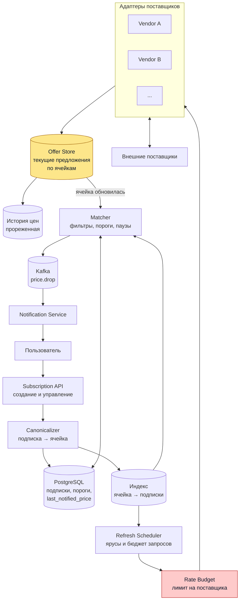

# Подписки на цену авиабилетов

## Содержание

- [Что проверяет задача](#что-проверяет-задача)
- [Фаза 1: уточнение требований](#фаза-1-уточнение-требований)
- [Фаза 2: оценка нагрузки](#фаза-2-оценка-нагрузки)
- [Ключевые концепции](#ключевые-концепции)
- [Фаза 3: высокоуровневый дизайн](#фаза-3-высокоуровневый-дизайн)
- [Фаза 4: deep dive](#фаза-4-deep-dive)
- [Сквозные потоки](#сквозные-потоки)
- [Трейдоффы](#трейдоффы)
- [Отказы и пограничные случаи](#отказы-и-пограничные-случаи)
- [Двухминутное резюме](#двухминутное-резюме)
- [Связанные материалы](#связанные-материалы)

Разбор задачи «спроектируйте систему, в которой пользователь подписывается на поисковый запрос по авиабилетам, отсортированный по цене, и получает уведомление, когда появляется предложение выгоднее». Билеты запрашиваются у нескольких внешних поставщиков.

> **Термины.** **Подписка** — сохранённый поисковый запрос конкретного пользователя со своими фильтрами и порогом. **Ячейка** — канонизированный запрос (направление и дата), единица опроса поставщиков; одна ячейка обслуживает много подписок. **Предложение** (`offer`) — конкретный перелёт с ценой, полученный от поставщика. **Котировка** — цена, действительная в момент ответа поставщика и не гарантированная позже.

---

## Что проверяет задача

Задача выглядит как «поиск плюс уведомления», но обе половины устроены не так, как ожидается.

- **Поиск здесь инвертирован.** Обычный поиск отвечает на вопрос «какие результаты подходят запросу». Здесь нужен обратный: «какие из миллионов сохранённых запросов затронуты новой ценой».
- **Данных у нас нет.** Цены живут у поставщиков и устаревают за минуты. Нельзя проиндексировать то, чем не владеешь, поэтому решение упирается в чужие лимиты обращений, а не в свои индексы.
- **Единица работы не подписка.** Опрашивать поставщика на каждую подписку невозможно арифметически, и это выясняется на первой же прикидке.
- **«Выгоднее» требует определения.** Падение на пятьдесят рублей, возврат к прежней цене после скачка, дешёвый рейс с тремя пересадками — всё это формально «лучше», а по смыслу нет.

---

## Фаза 1: уточнение требований

### Функциональные требования

- Создать подписку на поисковый запрос: направление, диапазон дат, фильтры (пересадки, авиакомпании, класс, багаж).
- Периодически получать предложения от нескольких поставщиков.
- Уведомлять подписчика, когда появилось предложение выгоднее ранее показанного.
- Показывать текущую подборку по подписке, отсортированную по цене.
- Управлять подписками: пауза, удаление, срок жизни.

### Что уточнить

- **Что считается «выгоднее»?** Любое снижение или снижение на порог. Без ответа система будет слать уведомление на каждые десять рублей.
- **Цена в уведомлении гарантирована?** Почти всегда нет: котировка живёт минуты. От ответа зависит, нужна ли перепроверка перед отправкой.
- **Дата точная или диапазон?** «±3 дня» умножает число опрашиваемых комбинаций на семь.
- **Сколько поставщиков, какие у них лимиты и берут ли они деньги за запрос?** Это главное ограничение всей системы.
- **Есть ли у поставщиков выгрузки вместо поиска по запросу?** Если да, часть нагрузки уходит совсем.
- **Сколько живёт подписка?** Дата вылета задаёт естественный срок: после вылета подписка бессмысленна.

Вне разбора: бронирование и оплата, ранжирование по чему-либо кроме цены, персональные рекомендации, кэшбэк и лояльность.

### Нефункциональные требования

| Требование | Значение | Что из него следует |
|---|---|---|
| Свежесть цены | Минуты для популярных направлений, сутки для редких | Ярусное обновление, а не единая частота |
| Задержка уведомления | Минуты после обнаружения | Уведомление асинхронное, на критическом пути ничего нет |
| Лимиты поставщиков | Десятки запросов в секунду суммарно | Бюджет запросов — главный проектный ресурс |
| Точность | Ложное уведомление хуже пропущенного | Порог, перепроверка, защита от повторов |
| Доступность | Отказ поставщика не останавливает систему | Предохранитель, работа на последних известных ценах |
| Согласованность | Eventual | Цена по определению устаревшая |

---

## Фаза 2: оценка нагрузки

```text
активных подписок:     10 000 000
поставщиков:           5
```

### Наивный расчёт, который сразу всё объясняет

```text
опрашивать каждую подписку у каждого поставщика раз в час:
  10 000 000 × 5 / 3600 ≈ 13 900 запросов/с к внешним API
```

Поисковые API авиабилетов отдают десятки запросов в секунду, а не тысячи. Промах на три порядка, и он определяет всю дальнейшую конструкцию: задача не в том, чтобы построить поиск, а в том, чтобы уместиться в чужой лимит.

### Схлопывание подписок в ячейки

Подписки сильно пересекаются: тысячи людей следят за одним направлением на одну дату, различаясь только фильтрами. Фильтры применимы к уже полученной подборке, поэтому опрашивать поставщика нужно не на подписку, а на пару «направление и дата».

```text
допущение: 10 млн подписок схлопываются в 500 тыс. ячеек (коэффициент 20:1)

500 000 × 5 / 3600 ≈ 694 запроса/с
```

Лучше в двадцать раз и всё ещё невозможно.

### Ярусы обновления

Спрос распределён неравномерно: несколько процентов ячеек собирают большую часть подписок. Частота обновления и число опрашиваемых поставщиков задаются ярусом.

```text
горячие  (5%  = 25 000 ячеек):  раз в 15 мин, все 5 поставщиков
  25 000 × 5 / 900    ≈ 139 запросов/с

тёплые   (20% = 100 000):       раз в 2 часа, 2 поставщика
  100 000 × 2 / 7200  ≈  28 запросов/с

холодные (75% = 375 000):       раз в сутки, 1 поставщик
  375 000 × 1 / 86400 ≈   4 запроса/с
                        ─────────────
                        ≈ 171 запрос/с, около 34 на поставщика
```

Тридцать четыре запроса в секунду на поставщика — величина, о которой уже можно договариваться. Снижение дал не только интервал: для холодных ячеек опрашивается один поставщик вместо пяти, и это срезает больше, чем растянутое расписание.

### Хранение

```text
подписки:        10 000 000 × 300 Б      = 3 ГБ
состояние ячеек: 500 000 × 5 × 100 Б     = 250 МБ
```

Объёмы незначительные. История цен по ячейкам нужна отдельно — она отвечает на вопрос «эта цена вообще хорошая или обычная», и её прореживают: минутные точки за неделю, часовые за квартал.

### Поток уведомлений

```text
6 млн подписок приходится на 25 тыс. горячих ячеек
  → 240 подписчиков на горячую ячейку в среднем

за круг обновления (15 мин) значимое падение показывают ~5% горячих ячеек:
  25 000 × 5% = 1 250 ячеек
  1 250 × 240 = 300 000 кандидатов на уведомление
  300 000 / 900 ≈ 333 кандидата/с
```

Триста тридцать три в секунду — это до применения персональных фильтров и порогов. Именно порог и пауза между уведомлениями превращают это число в приемлемое, и без них система становится спам-рассылкой.

**Выводы, влияющие на архитектуру:**

1. **Бюджет запросов к поставщикам — главный ресурс.** Всё остальное подстраивается под него, а не наоборот.
2. **Единица опроса — ячейка, единица уведомления — подписка.** Смешивать их нельзя: между ними отношение «один ко многим» и разная частота.
3. **Свои объёмы ничтожны** (3 ГБ подписок), поэтому хранилище выбирается по удобству запросов, а не по масштабу.
4. **Порог уведомления — не настройка, а часть архитектуры.** Он на порядок снижает исходящий поток.

---

## Ключевые концепции

### Инверсия поиска, но не на уровне документа

Задача «найти все запросы, которым подходит новый документ» решается механизмом перколяции: индексируются не документы, а сами запросы. В Elasticsearch это `percolate`.

Здесь он не подходит напрямую, и причина простая: перколяция требует документа, а документа у нас нет. Цены живут у поставщиков, и узнать их можно только спросив — то есть потратив квоту.

Поэтому инверсия происходит на уровне ячейки, а не документа:

```text
percolate:  новый документ → какие запросы ему подходят
здесь:      ячейка обновилась → какие подписки её слушают
                              → к каждой применить её фильтры и порог
```

Обратный индекс `ячейка → список подписок` строится один раз при создании подписки, а фильтры применяются уже к полученной подборке в памяти.

### Единицу опроса задают лимиты, а не модель данных

Естественная сущность предметной области — подписка. Единица опроса — ячейка. Это расхождение и есть главное решение задачи, и берётся оно из арифметики: 13 900 запросов в секунду против доступных десятков.

Канонизация должна быть агрессивной. Всё, что можно применить к результату локально, из ключа ячейки убирается:

```text
в ключ ячейки входит:      направление, дата вылета, класс обслуживания
применяется к результату:  пересадки, авиакомпании, время вылета,
                           багаж, длительность, порог цены
```

Класс обслуживания оставлен в ключе намеренно: поставщики возвращают экономический и бизнес-класс разными запросами, и склеить их локально нельзя.

### «Выгоднее» — это не «дешевле, чем сейчас»

Три ловушки, каждая из которых даёт ложные уведомления.

**Дребезг цены.** Цена упала на сто рублей, через час вернулась, потом упала снова. Сравнение с текущей ценой даст уведомление на каждом колебании.

**Сравнение с самим собой.** Если хранить только минимум и обновлять его при каждом снижении, порог не сработает никогда: цена сползает по десять рублей, минимум ползёт следом, разница между ними всегда меньше порога.

Поэтому хранятся два разных числа:

```text
best_seen_price      — минимум, который вообще видели по этой подписке
last_notified_price  — цена, при которой в прошлый раз отправили уведомление

уведомляем, когда: new_price <= last_notified_price × (1 - порог)
```

Первое отвечает на вопрос «показывать ли это в интерфейсе как лучшее», второе — «беспокоить ли человека». Слитые в одно, они ломают либо интерфейс, либо уведомления.

**Несравнимые предложения.** Прямой рейс за 20 тысяч и перелёт с двумя пересадками и ночёвкой за 14 тысяч — формально второй дешевле. Сравнивать нужно внутри набора, прошедшего фильтры подписки, а если фильтров нет — сообщать в уведомлении не только цену, но и то, чем за неё платят.

---

## Фаза 3: высокоуровневый дизайн



### Роль каждого компонента

Сквозная идея — разделение по единицам работы: опрос живёт в терминах ячеек и бюджета запросов, уведомления живут в терминах подписок и порогов, а связывает их обратный индекс.

**Subscription API и Canonicalizer.**
*Зачем:* принимают подписку, раскладывают её на ячейки и записывают в обратный индекс.
*Почему канонизация отдельно:* правила «что идёт в ключ, а что применяется к результату» меняются вместе с возможностями поставщиков. Диапазон дат «±3 дня» здесь превращается в семь ячеек — и это единственное место, где такое размножение происходит.

**Refresh Scheduler.**
*Зачем:* решает, какие ячейки обновлять прямо сейчас, исходя из яруса, близости даты вылета и волатильности.
*Почему отдельно:* это планировщик с приоритетами, а не таймер. Ячейка с вылетом через три дня важнее, чем через полгода: цена меняется быстрее, а решение человек принимает срочнее.

**Rate Budget.**
*Зачем:* держит лимит обращений к каждому поставщику и распределяет квоту между ярусами.
*Почему отдельно и почему выделен на схеме:* это дефицитный ресурс всей системы. Без единого учёта планировщик и точечные запросы пользователей начнут конкурировать и выберут квоту непредсказуемо. Механика — [ограничение частоты](../reliability-patterns/04-rate-limiting.md).

**Адаптеры поставщиков.**
*Зачем:* по адаптеру на поставщика, приводят разные форматы к единому предложению.
*Почему отдельно:* тот же защитный слой, что в [15. TMS](./15-tms-transport-management.md), плюс своя политика отказов. Недоступность одного поставщика не должна ни останавливать обновление ячейки, ни выглядеть как исчезновение его предложений.

**Offer Store.**
*Зачем:* текущая подборка по каждой ячейке с отметкой свежести и источника.
*Почему отдельно от истории:* горячее чтение «покажи подборку по подписке» обслуживается отсюда, а история нужна только для оценки, хорошая ли цена, и живёт с другой частотой и другим объёмом.

**Matcher.**
*Зачем:* по обновлённой ячейке находит подписки, применяет их фильтры, сравнивает с `last_notified_price`, учитывает паузу и порождает событие.
*Почему отдельно:* это единственное место, где принимается решение «беспокоить или нет», и оно должно быть одно. Размазав его между адаптерами и уведомлениями, невозможно ни настроить порог, ни объяснить пользователю, почему уведомление пришло.

**Kafka и Notification Service.**
*Зачем:* доставка уведомлений по каналам с ретраями и дедупликацией.
*Почему не делать здесь:* это готовая задача, разобранная в [02. Notification Service](./02-notification-service.md). Matcher выпускает событие `price.drop` и на этом заканчивается.

---

## Фаза 4: deep dive

### Модель данных

```sql
CREATE TABLE subscriptions (
  id                  UUID PRIMARY KEY,
  user_id             UUID        NOT NULL,
  origin              CHAR(3)     NOT NULL,      -- IATA-код
  destination         CHAR(3)     NOT NULL,
  date_from           DATE        NOT NULL,
  date_to             DATE        NOT NULL,      -- равна date_from для точной даты
  cabin               TEXT        NOT NULL,
  filters             JSONB       NOT NULL,      -- пересадки, авиакомпании, багаж
  threshold_pct       NUMERIC(4,2) NOT NULL DEFAULT 5.0,
  best_seen_price     NUMERIC(12,2),             -- минимум за всё время
  last_notified_price NUMERIC(12,2),             -- цена последнего уведомления
  last_notified_at    TIMESTAMPTZ,               -- для паузы между уведомлениями
  expires_at          TIMESTAMPTZ NOT NULL,      -- дата вылета плюс сутки
  status              TEXT        NOT NULL       -- ACTIVE | PAUSED | EXPIRED
);

CREATE INDEX ON subscriptions (expires_at) WHERE status = 'ACTIVE';

-- обратный индекс: одна строка на пару «ячейка — подписка»
CREATE TABLE cell_subscriptions (
  cell_key        TEXT NOT NULL,                 -- 'MOW:LON:2026-08-14:ECONOMY'
  subscription_id UUID NOT NULL REFERENCES subscriptions(id) ON DELETE CASCADE,
  PRIMARY KEY (cell_key, subscription_id)
);

CREATE TABLE cells (
  cell_key      TEXT PRIMARY KEY,
  tier          TEXT        NOT NULL,            -- HOT | WARM | COLD
  subscribers   INT         NOT NULL DEFAULT 0,  -- для пересчёта яруса
  departure_at  DATE        NOT NULL,            -- для приоритета
  last_polled   TIMESTAMPTZ,
  next_poll_at  TIMESTAMPTZ NOT NULL
);

CREATE INDEX ON cells (next_poll_at) WHERE tier IS NOT NULL;
```

Порядок ключей в `cell_subscriptions` выбран под основной запрос: «дай все подписки этой ячейки» после обновления. Обратное направление (`подписка → ячейки`) нужно только при удалении подписки, и его закрывает каскад.

Диапазон дат разворачивается в несколько строк `cell_subscriptions` — по одной на дату. Подписка «±3 дня» порождает семь пар, и это единственный источник размножения в системе. При среднем диапазоне в три дня коэффициент схлопывания 20:1 из фазы 2 уже учитывает это размножение.

### Планировщик и бюджет запросов

Ярус — не константа, а функция спроса и срочности:

```text
tier(cell) определяется по:
  число подписчиков          — сколько людей ждёт
  дней до вылета             — ближе вылет, быстрее меняется цена
  наблюдённая волатильность  — стабильные ячейки можно опрашивать реже

next_poll_at = last_polled + интервал(tier)
```

Планировщик выбирает `WHERE next_poll_at <= now() ORDER BY приоритет LIMIT квота`. Квота приходит от Rate Budget и разная у каждого поставщика.

Ключевая деталь: при исчерпании квоты планировщик не копит очередь, а сдвигает `next_poll_at`. Копить бессмысленно — через час эти цены всё равно устареют, и разбирать накопленное придётся в ущерб свежим ячейкам.

Пересчёт яруса идёт фоном раз в сутки: спрос меняется медленно, а перевод ячейки между ярусами на каждой подписке даст дребезг.

### Обновление ячейки и обнаружение падения

```text
1. Адаптеры опрашивают поставщиков ячейки параллельно, с общим крайним сроком
2. Ответы нормализуются в предложения, объединяются, сортируются по цене
3. Подборка кладётся в Offer Store с отметкой свежести и списком ответивших
4. Если минимальная цена ячейки снизилась — событие в Matcher
```

Условие на четвёртом шаге — грубый предварительный фильтр по ячейке целиком. Он отсекает большую часть работы до разбора подписок: если минимум по ячейке не двигался, ни одна подписка внутри неё не могла увидеть улучшение.

Отказ части поставщиков обрабатывается явно: подборка помечается как неполная. Без этого исчезновение самого дешёвого поставщика выглядит как рост цены, и система разошлёт уведомления «цена выросла» на пустом месте — точнее, промолчит, а потом при его возвращении разошлёт ложное «цена упала».

### Fan-out на подписчиков ячейки

```text
для каждой подписки ячейки:
  применить её фильтры к подборке        → персональный минимум
  если персонального предложения нет     → пропустить
  если new <= last_notified × (1 - порог) и прошла пауза
     → событие price.drop
     → last_notified_price = new, last_notified_at = now()
  best_seen_price = min(best_seen_price, new)   -- обновляется всегда
```

Разница в обновлении двух полей принципиальна: `best_seen_price` двигается при любом улучшении, `last_notified_price` — только вместе с отправкой уведомления. Иначе порог перестаёт работать, как разобрано в ключевых концепциях.

Горячая ячейка имеет порядка 240 подписчиков, и обработка идёт пакетом: одна выборка подписок ячейки, применение фильтров в памяти, один пакет событий. Ходить в базу на подписку при 333 кандидатах в секунду не нужно и незачем.

### Защита от усталости

Порог — не единственный механизм, и по отдельности каждый недостаточен.

| Механизм | От чего защищает |
|---|---|
| Порог в процентах | Уведомления на копеечные колебания |
| Пауза между уведомлениями | Серия падений подряд в один день |
| Тихие часы | Ночные уведомления |
| Дедупликация по предложению | Повтор того же рейса после дребезга |
| Верхняя граница в сутки | Аномалия у поставщика, выдающего мусорные цены |

Последний пункт важнее, чем кажется: сбой формата у поставщика (цена в другой валюте, копейки вместо рублей) выглядит как обвал цен по всем ячейкам сразу. Без ограничения сверху система разошлёт миллионы уведомлений за минуты. Проверка на неправдоподобное отклонение от истории цен ловит это до отправки.

### Цена не гарантирована

Котировка живёт минуты, и к моменту, когда человек откроет уведомление, предложения может уже не быть. Замалчивать это нельзя: уведомление, ведущее в пустоту, обесценивает сервис быстрее, чем его отсутствие.

Что с этим делают:

- Перед отправкой уведомления по горячей подписке делают точечную перепроверку у поставщика — на 333 кандидата в секунду это неподъёмно, поэтому перепроверяют только те, что прошли порог и паузу, а таких на порядок меньше.
- В уведомлении указывают время котировки: «цена на 14:35».
- Переход из уведомления ведёт на страницу, которая выполняет живой поиск, а не показывает сохранённую цену как факт.

Отсюда же ответ на вопрос «зачем в подборке отметка свежести»: интерфейс обязан показывать, насколько давно данные обновлялись, потому что для холодной ячейки это могут быть вчерашние цены.

---

## Сквозные потоки

### 1. Создание подписки

```text
Пользователь задаёт направление, диапазон дат, фильтры и порог
  → Canonicalizer раскладывает на ячейки (диапазон ±3 дня = 7 ячеек)
  → строки в cell_subscriptions, счётчик subscribers у ячеек увеличивается
  → новые ячейки создаются с ярусом COLD и next_poll_at = now()
  → первый опрос идёт вне очереди, чтобы показать подборку сразу
```

*Итог:* пользователь видит результат немедленно, а система получает новую ячейку, ярус которой уточнится при следующем пересчёте.

### 2. Плановое обновление горячей ячейки

```text
Scheduler выбирает ячейки с next_poll_at <= now() в пределах квоты
  → адаптеры опрашивают 5 поставщиков параллельно
  → подборка нормализована и сохранена
  → минимум ячейки снизился → событие в Matcher
  → Matcher: 240 подписок, фильтры, пороги, паузы → ~20 событий price.drop
  → Notification Service доставляет по каналам
```

*Итог:* один запрос к поставщику обслужил 240 подписок, а до пользователей дошло два десятка уведомлений вместо двухсот сорока.

### 3. Поставщик недоступен

```text
Адаптер получает таймауты → предохранитель размыкается
  → ячейка обновляется по оставшимся поставщикам
  → подборка помечена как неполная, отсутствующий источник записан
  → падение минимума, вызванное исчезновением поставщика, не считается улучшением
  → при возвращении поставщика повторное появление его цен тоже не считается ростом
```

*Итог:* временная недоступность источника не превращается в ложные уведомления в обе стороны.

### 4. Подписка истекла

```text
Фоновая задача выбирает subscriptions с expires_at <= now()
  → status = EXPIRED, строки cell_subscriptions удаляются каскадом
  → счётчик subscribers у ячеек уменьшается
  → ячейка без подписчиков перестаёт опрашиваться и удаляется
```

*Итог:* бюджет запросов освобождается автоматически. Без этой уборки квота постепенно уходит на направления, которые уже никого не интересуют.

---

## Трейдоффы

| Решение | Принятое | Альтернатива | Почему так |
|---|---|---|---|
| Единица опроса | Ячейка «направление и дата» | Подписка | 13 900 запросов/с против доступных десятков |
| Фильтры подписки | Применяются к подборке | Входят в ключ ячейки | Иначе схлопывание 20:1 исчезает и всё возвращается к наивному расчёту |
| Частота обновления | Ярусы по спросу и срочности | Единый интервал | Единый интервал либо не влезает в квоту, либо делает горячие направления бесполезными |
| Число поставщиков на ячейку | Зависит от яруса | Все на каждую ячейку | Для холодных ячеек это срезает больше запросов, чем растянутый интервал |
| Порог уведомления | От `last_notified_price` | От текущей или от минимума | От текущей — дребезг; от минимума — порог не срабатывает никогда |
| Переполнение квоты | Сдвиг `next_poll_at` | Очередь отложенных опросов | Накопленные цены устареют раньше, чем до них дойдёт очередь |
| Неполная подборка | Помечается явно | Считается обычным результатом | Иначе отказ поставщика читается как падение и рост цены |
| Уведомление | Перепроверка только прошедших порог | Перепроверять всё или ничего | 333 кандидата/с не перепроверить; отправлять без проверки — вести в пустоту |
| Доставка | Отдельный сервис уведомлений | Отправка из Matcher | Каналы, ретраи и дедупликация — решённая задача, см. кейс 02 |
| Хранилище | Один PostgreSQL | Шардирование | 3 ГБ подписок и 250 МБ состояния ячеек |

---

## Отказы и пограничные случаи

| Сценарий | Поведение системы |
|---|---|
| Поставщик отдаёт цены в другой валюте после релиза | Проверка на неправдоподобное отклонение от истории останавливает рассылку; ячейки помечаются подозрительными, поднимается алерт |
| Поставщик недоступен | Предохранитель, подборка неполная, изменения минимума из-за отсутствия источника не считаются улучшением |
| Квота исчерпана | Планировщик сдвигает `next_poll_at`, горячие ячейки обслуживаются первыми, холодные ждут |
| Цена исчезла к моменту клика | Уведомление содержит время котировки, переход ведёт на живой поиск, а не на сохранённую цену |
| Цена дребезжит около порога | Уведомление привязано к `last_notified_price` и паузе, поэтому повторяется не чаще одного раза за паузу |
| Пользователь создал 500 подписок | Ограничение на пользователя; иначе один человек выкупает заметную долю бюджета запросов |
| Ячейка внезапно стала популярной | Пересчёт яруса раз в сутки даёт отставание до суток; для резкого роста подписчиков предусмотрен немедленный перевод в горячий ярус по порогу |
| Дата вылета прошла | Подписка истекает по `expires_at`, ячейка без подписчиков удаляется вместе с бюджетом |

---

## Двухминутное резюме

> Первое, что я делаю, — считаю. Десять миллионов подписок при пяти поставщиках
> и обновлении раз в час дают почти четырнадцать тысяч запросов в секунду к
> внешним API, которые отдают десятки. Промах на три порядка, и он определяет
> всю конструкцию: задача не про поиск, а про то, как уместиться в чужой лимит.
>
> Поэтому единица опроса — не подписка, а ячейка: направление, дата и класс.
> Фильтры вроде пересадок и авиакомпаний применяются к уже полученной подборке,
> а не входят в ключ, и за счёт этого десять миллионов подписок схлопываются
> примерно в пятьсот тысяч ячеек. Это всё ещё семьсот запросов в секунду,
> поэтому сверху идут ярусы: горячие пять процентов ячеек обновляются раз в
> пятнадцать минут по всем поставщикам, холодные три четверти — раз в сутки по
> одному. Получается около ста семидесяти запросов в секунду, тридцать четыре на
> поставщика — величина, о которой можно договариваться.
>
> Обратный индекс «ячейка — подписки» строится при создании подписки. Когда
> минимум ячейки снизился, Matcher берёт её подписчиков, применяет персональные
> фильтры и сравнивает с порогом.
>
> Порог считается не от текущей цены и не от исторического минимума, а от цены
> последнего уведомления. От текущей — получим уведомление на каждое колебание;
> от минимума — порог не сработает никогда, потому что минимум ползёт вместе с
> ценой. Поэтому храню два разных числа: минимум для интерфейса и цену
> последнего уведомления для решения «беспокоить или нет».
>
> Отдельно закладываю то, что цена не гарантирована: котировка живёт минуты.
> Прошедшие порог перепроверяю точечно, в уведомлении указываю время котировки,
> а переход веду на живой поиск. И ставлю верхнюю границу на число уведомлений в
> сутки — сбой формата у поставщика выглядит как обвал цен по всем ячейкам сразу,
> и без ограничения система разошлёт миллионы сообщений за минуты.
>
> Доставку не проектирую: каналы, ретраи и дедупликация — отдельная решённая
> задача, Matcher выпускает событие и на этом заканчивается.

---

## Связанные материалы

- [33. Оповещения о низких ценах](./33-low-price-alerts.md) — вариант с собственным потоком цен: индекс подписок, массовый fan-out и доставка без устаревших push
- [02. Notification Service](./02-notification-service.md) — доставка уведомлений, каналы, ретраи, дедупликация
- [13. Avito / Classifieds](./13-avito-classifieds.md) — поиск по своим данным, для сравнения с поиском по чужим
- [15. TMS / Transport Management](./15-tms-transport-management.md) — нормализация разнородных внешних источников
- [05. Task Queue](./05-task-queue.md) — планировщик с приоритетами и пул воркеров
- [Ограничение частоты](../reliability-patterns/04-rate-limiting.md) — бюджет запросов к поставщикам
- [Circuit breaker](../reliability-patterns/03-circuit-breaker.md) — отказ внешнего поставщика
- [Кэширование в Redis](../../06-databases/caching/01-redis-as-cache.md) — горячее чтение подборок
- [Kafka](../../07-message-brokers-and-streaming/01-kafka.md) — транспорт событий о падении цены
- [Как проходить System Design Interview](./00-how-to-approach.md) — фреймворк и техника прикидок
