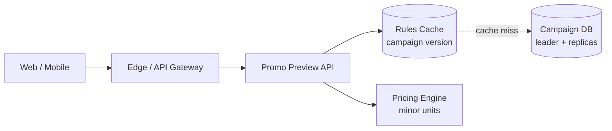
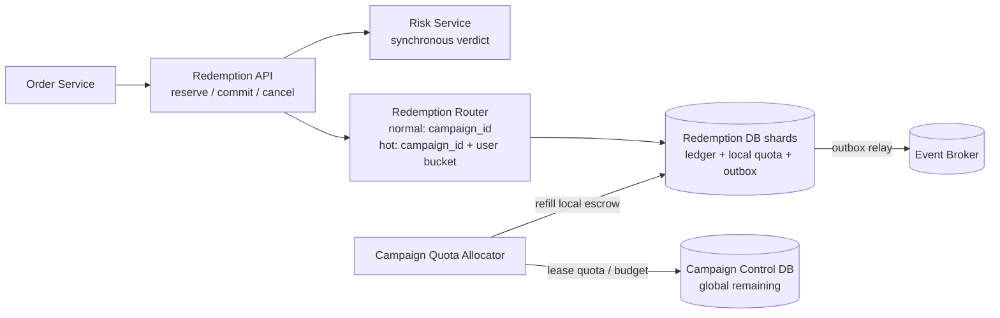

# Promo Code Service

## Содержание

- [Что проверяет задача](#что-проверяет-задача)
- [Фаза 1: уточнение требований](#фаза-1-уточнение-требований)
- [Фаза 2: оценка нагрузки](#фаза-2-оценка-нагрузки)
- [Ключевые концепции](#ключевые-концепции)
- [Фаза 3: высокоуровневый дизайн](#фаза-3-высокоуровневый-дизайн)
- [Фаза 4: deep dive](#фаза-4-deep-dive)
- [Сквозные потоки](#сквозные-потоки)
- [Отказы и пограничные случаи](#отказы-и-пограничные-случаи)
- [Трейдоффы](#трейдоффы)
- [Фаза 5: финал](#фаза-5-финал)
- [Interview-ready answer](#interview-ready-answer)
- [Связанные материалы](#связанные-материалы)

Разбор сервиса промокодов и скидок для marketplace или интернет-магазина.
Основная задача — быстро показывать предварительную скидку, но при оформлении
заказа строго не превысить глобальный бюджет и не применить купон повторно.

---

## Что проверяет задача

В системе есть три похожие, но разные операции:

| Операция | Что обещает | Можно ли читать cache |
| --- | --- | --- |
| `Preview` | «Сейчас код выглядит применимым, скидка примерно такая» | Да; результат не резервирует лимит |
| `Reserve` | «Лимит и бюджет удержаны за этим checkout до deadline» | Нет; нужна точная транзакция |
| `Commit` | «Промокод окончательно использован заказом» | Нет; повтор должен вернуть тот же результат |

Если проверять лимит в cache, а списывать позже, тысячи checkout одновременно
увидят последний доступный купон. Если считать preview окончательным обещанием,
система либо превысит бюджет, либо будет вынуждена оплачивать ошибку из своего
кармана.

---

## Фаза 1: уточнение требований

### Что спросить

- Код общий для кампании или уникальный для каждого пользователя?
- Есть глобальное число использований, денежный бюджет или оба ограничения?
- Сколько раз один пользователь может применить кампанию?
- Можно ли сочетать несколько скидок в одном заказе?
- Когда использование считается окончательным: при создании заказа или оплате?
- Что происходит с лимитом после отмены и возврата заказа?
- Сколько живёт reserve, пока пользователь оплачивает заказ?
- Должен ли preview быть точным или допускается отказ на финальном шаге?

### Зафиксированный scope

- Промокод задаёт процентную или фиксированную скидку с максимальной суммой.
- Кампания имеет период действия, глобальный usage limit, денежный budget и
  per-user limit.
- В одном заказе применяется не больше одного промокода.
- `Preview` не резервирует дефицитный ресурс и может оказаться устаревшим.
- `Reserve` удерживает usage unit и точную сумму скидки на 15 минут.
- Оплаченный заказ вызывает `Commit`; отмена до оплаты — `Cancel`; истёкший hold
  освобождает sweeper.
- После возврата оплаченного заказа использование не возвращается автоматически:
  это отдельная campaign policy, иначе купон можно циклически использовать.
- Pricing передаёт состав корзины и денежные значения в minor units; float для
  денег не используется.
- Сложные ML-модели антифрода вне scope, но синхронный risk verdict может
  запретить reserve.

### Нефункциональные требования

| Требование | Значение | Следствие |
| --- | --- | --- |
| Preview latency | p99 < 100 мс | Read-through cache правил и локальный pricing |
| Reserve/commit latency | p99 < 250 мс | Короткая транзакция без внешних вызовов внутри |
| Correctness | Ни одного использования сверх лимита или бюджета | Exact write path, fail closed |
| Availability | 99,99% preview; 99,9% exact mutations | Preview может деградировать отдельно от ledger |
| Delivery | At-least-once между сервисами | Idempotency для каждой команды |
| Audit | Объяснить каждую скидку | Versioned rules и append-only ledger |

---

## Фаза 2: оценка нагрузки

Все числа ниже — допущения для интервью.

```text
DAU:                         20 млн
promo preview на DAU/день:  5
reserve attempts/день:      10 млн
успешных reserve:            60%
cancel/expire:               30% успешных reserve
```

### Preview path

```text
20 млн × 5 = 100 млн preview/день
100 млн / 86 400 ≈ 1 157 preview/с в среднем
flash-sale peak ×20 ≈ 23 150 preview/с
```

Это read-heavy путь. Правила кампаний меняются редко, поэтому 23K/с не являются
причиной читать leader PostgreSQL на каждый запрос.

### Exact mutation path

```text
10 млн reserve attempts / 86 400 ≈ 116/с в среднем
flash-sale peak ×40 ≈ 4 630 reserve attempts/с

успешные reserve в среднем:
10 млн × 60% / 86 400 ≈ 69/с

cancel/expire в среднем:
6 млн × 30% / 86 400 ≈ 21/с
```

Для capacity берётся пик, но storage накапливается по среднему.

### Hot campaign

Предположим, один промокод создаёт 80% flash-sale reserve attempts:

```text
4 630 × 80% ≈ 3 700 attempts/с на одну campaign
```

Если каждая транзакция блокирует одну строку `campaign_counters` на 5 мс, верхняя
оценка одной строки равна:

```text
1 / 0,005 ≈ 200 транзакций/с
```

Даже десять DB-шардов не помогают, если весь hot campaign маршрутизируется в
одну строку одного шарда. Для обычных кампаний row counter достаточен; для такого
hotspot нужен заранее выделенный escrow budget по redemption shards.

### Ledger storage

```text
6 млн успешных reserve/день × 365
  = 2,19 млрд ledger entries/год

при 300 B на entry до индексов и репликации:
2,19 млрд × 300 B ≈ 657 GB/год raw
```

После индексов, WAL и репликации это уже несколько TB в год, поэтому старый audit
партиционируется по времени и архивируется, а активные holds остаются в hot tier.

---

## Ключевые концепции

### Правило скидки и факт использования — разные данные

`Campaign Rule` отвечает на вопрос, как посчитать скидку. `Redemption Ledger`
отвечает, была ли она фактически удержана или использована:

```text
rules version 17:
  20%, максимум 2 000 RUB, cart >= 5 000 RUB

redemption:
  order-42, user-7, rules_version=17,
  discount=1 640 RUB, status=HELD
```

Если хранить только ссылку на текущую campaign, изменение правил задним числом
поменяет объяснение старого заказа. Поэтому ledger фиксирует версию правил,
входной subtotal и рассчитанную сумму.

### Preview не является reserve

Preview можно вычислить по кешированной конфигурации. Он возвращает expiry и
явный флаг `subject_to_final_validation`. Exact reserve повторяет проверки на
актуальной версии и атомарно удерживает лимит.

### Денежный бюджет сложнее счётчика использований

Usage limit тратится единицами. Budget тратится разными суммами: один заказ
получил 100 рублей, другой — 2 000. Проверять только количество применений
недостаточно:

```text
remaining_uses   >= 1
remaining_budget >= calculated_discount
```

Оба условия должны измениться в одной локальной транзакции.

### TTL — бизнес-параметр

Пятнадцатиминутный hold даёт время оплатить заказ, но временно скрывает бюджет от
других покупателей. При большом abandonment слишком длинный TTL снижает
эффективное число продаж, слишком короткий — отбирает скидку у платящего клиента.

---

## Фаза 3: высокоуровневый дизайн

### Preview path



### Exact redemption path



### Роль компонентов

| Компонент | Зачем нужен | Почему отдельно |
| --- | --- | --- |
| Promo Preview API | Проверяет правила и считает ориентировочную скидку | Масштабируется как read-heavy путь и не блокирует ledger |
| Rules Cache | Хранит versioned campaign configuration | Десятки тысяч preview/с не идут в PostgreSQL |
| Pricing Engine | Детерминированно считает сумму в minor units | Одинаковая версия и cart дают одинаковую скидку |
| Redemption API | Выполняет точные state transitions | Только он обещает удержанный лимит и бюджет |
| Risk Service | Блокирует явно подозрительную попытку до reserve | Risk timeout policy не смешивается с SQL-транзакцией |
| Redemption DB shard | Хранит campaign counter, user usage, holds, local quota и outbox | Обычная campaign целиком локальна; hot campaign делится только специальным routing |
| Campaign Quota Allocator | Раздаёт partitions горячей кампании ограниченные части лимита | Убирает hot row с каждого reserve, сохраняя верхнюю границу |
| Campaign Control DB | Хранит неразданный глобальный остаток и leases | Единственное место, которое не может выдать больше campaign limit |
| Event Broker | Доставляет committed события Order, Analytics и Finance | Consumers не увеличивают latency exact mutation |

---

## Фаза 4: deep dive

### 4.1 API

```http
POST /v1/promotions/preview
{"code":"BLACKFRIDAY","user_id":"user-7","cart":{...}}

POST /v1/promo-redemptions/reserve
Idempotency-Key: order-42-promo-reserve-v1
{"order_id":"order-42","user_id":"user-7","code":"BLACKFRIDAY",
 "cart_hash":"sha256:...","expected_rules_version":17}

POST /v1/promo-redemptions/{redemption_id}/commit
Idempotency-Key: order-42-promo-commit-v1

POST /v1/promo-redemptions/{redemption_id}/cancel
Idempotency-Key: order-42-promo-cancel-v1
```

Reserve возвращает `redemption_id`, точную сумму, rules version и `expires_at`.
Изменившаяся корзина имеет другой `cart_hash`, поэтому старый reserve нельзя
незаметно применить к более дорогому заказу.

### 4.2 Минимальная модель данных

```text
campaigns:
  campaign_id, rules_version, starts_at, ends_at,
  global_usage_limit, global_budget_minor, status

campaign_quota_leases:
  lease_id, campaign_id, redemption_shard,
  granted_uses, granted_budget_minor,
  consumed_uses, consumed_budget_minor, expires_at

redemptions:
  redemption_id, campaign_id, user_id, order_id,
  rules_version, cart_hash, subtotal_minor, discount_minor,
  status, hold_expires_at, idempotency_key, created_at

user_campaign_usage:
  user_id, campaign_id, held_count, committed_count

outbox:
  event_id, aggregate_id=redemption_id, event_type, payload, created_at
```

На shard действуют ограничения:

```text
UNIQUE (campaign_id, order_id)
UNIQUE (user_id, idempotency_key)
CHECK (consumed_uses <= granted_uses)
CHECK (consumed_budget_minor <= granted_budget_minor)
```

### 4.3 Обычная campaign: одна транзакция

Обычная campaign маршрутизируется по `campaign_id` на один shard. Поэтому её
counter, использование конкретного пользователя и redemption изменяются одной
локальной транзакцией. Пока benchmark показывает достаточную capacity, самый
простой путь лучше:

```text
BEGIN
1. INSERT idempotency guard; конфликт возвращает прежний result.
2. SELECT campaign counter FOR UPDATE.
3. Проверить время, rules version, global usage и budget.
4. Заблокировать user_campaign_usage и проверить per-user limit.
5. INSERT redemption status=HELD.
6. Увеличить held counters и записать outbox.
COMMIT
```

Внешний Risk Service вызывается до транзакции. Его verdict привязывается к
короткоживущему request token; держать DB lock во время сетевого вызова нельзя.

### 4.4 Hot campaign: escrow quota leases

Для заранее известной hot campaign Router использует специальный ключ
`(campaign_id, hash(user_id))`: один пользователь всегда попадает в одну
campaign partition, но разные пользователи распределяются по shards. Allocator
атомарно вычитает из глобального остатка campaign ограниченный lease:

```text
global remaining:
  1 000 000 uses, 500 000 000 RUB

lease shard-17:
  5 000 uses, 2 500 000 RUB
```

Reserve на shard-17 меняет только локальные lease и user rows. Сумма всех
выданных leases никогда не превышает global limit и budget, поэтому shards не
могут overspend даже при сетевой изоляции.

Цена подхода — временно неиспользованный escrow. Один shard может вернуть
`PROMO_EXHAUSTED`, пока у другого лежит свободный lease. Allocator делает leases
маленькими около границы, пополняет популярные shards и отзывает только
неиспользованную часть истёкшего lease. Уже созданный hold отозвать нельзя.

### 4.5 Reserve, commit, cancel и expiry

Допустимые переходы:

```text
HELD → COMMITTED
HELD → CANCELED
HELD → EXPIRED
```

Каждая команда выполняет условный update по текущему status. Повтор `commit`
возвращает прежний `COMMITTED`; `cancel` после commit отклоняется как business
conflict. Sweeper выбирает просроченные holds пакетами и вызывает тот же
идемпотентный переход `expire`, а не отдельную обходную логику.

Cancel и expiry возвращают usage unit и budget в тот же lease, пока lease активен.
После закрытия lease возврат сначала попадает в allocator reconciliation, чтобы
одни и те же деньги не были выданы повторно двумя путями.

### 4.6 Согласование с Order Service

Order DB и Promo Ledger нельзя обновить одной локальной транзакцией. Используется
короткая saga:

```text
1. Order создаёт promo reserve.
2. Payment и Order завершают checkout до hold_expires_at.
3. Order отправляет idempotent commit(redemption_id).
4. При отказе checkout отправляет cancel.
5. Если результат commit неизвестен, Order запрашивает redemption status,
   а не создаёт новый reserve.
```

Outbox в обоих сервисах защищает команды от потери. Reconciliation ищет оплаченные
orders с `HELD` redemption и истёкшие holds без финального order state.

### 4.7 Антифрод без ложной точности

Синхронно проверяются дешёвые признаки: заблокированный аккаунт, device velocity,
аномальное число карт или адресов. Сложная аналитика получает ledger events
асинхронно. Если fraud найден после `COMMITTED`, система не переписывает историю,
а создаёт отдельный review/compensation case.

Fail policy зависит от кампании: публичный малорисковый купон может fail open при
недоступности Risk Service, дорогой персональный бонус — fail closed. Это поле
campaign policy, а не глобальный выбор всего сервиса.

---

## Сквозные потоки

### 1. Предварительный расчёт

Client → Preview API → cache rules version 17 → Pricing Engine → ответ с суммой и
`subject_to_final_validation=true`.

Итог: карточка быстро показывает скидку, но не расходует дефицитный лимит.

### 2. Успешный checkout

Order → Risk verdict → Redemption shard атомарно создаёт hold и списывает local
escrow → Payment/Order завершаются → idempotent commit → outbox event.

Итог: один order получает одну скидку, а глобальный budget не превышается.

### 3. Пользователь бросил оплату

Hold достигает `expires_at` → sweeper выполняет conditional `HELD → EXPIRED` →
quota возвращается → событие обновляет аналитику.

Итог: брошенная корзина не замораживает скидочный бюджет навсегда.

---

## Отказы и пограничные случаи

| Сбой | Поведение |
| --- | --- |
| Ответ reserve потерян | Retry с тем же key возвращает прежний redemption и сумму |
| Тот же key пришёл с другим cart hash | `IDEMPOTENCY_CONFLICT`, новый расчёт не выполняется |
| Rules изменились после preview | Reserve пересчитывает или возвращает `RULES_CHANGED`; preview не является обещанием |
| Два checkout одного пользователя | Блокировка `user_campaign_usage` не позволяет превысить per-user limit |
| Hot shard исчерпал lease | Пытается синхронно refill в ограниченном budget; около глобальной границы возможен честный отказ |
| Allocator недоступен | Shard продолжает расходовать уже выданный lease, но не превышает его |
| Commit timeout | Order читает status; новый reserve не создаётся |
| Sweeper запоздал | Hold остаётся недоступным дольше TTL, но budget не overspend; lag вызывает alert |
| Cancel столкнулся с commit | Один conditional transition побеждает, второй видит финальный state |
| Event Broker недоступен | Ledger commit проходит с outbox; downstream effects задерживаются |

---

## Трейдоффы

| Выбор | Альтернатива | Почему и чем платим |
| --- | --- | --- |
| Preview из cache | Всегда читать leader | Ниже latency и нагрузка ценой возможного отказа на reserve |
| Reservation ledger | Сразу помечать купон использованным | Checkout можно отменить, но появляются TTL и sweeper |
| Minor units | Float | Детерминированная сумма без ошибок округления |
| Row counter для обычных campaigns | Всегда escrow | Проще эксплуатация, но hotspot требует переключения стратегии |
| Escrow quota leases | Global counter на каждый reserve | Нет hot row и overspend, но возможен временно недоступный quota на другом shard |
| Обычная campaign по `campaign_id` | Все campaign сразу делить по users | Counter и per-user limit локальны; hotspot требует отдельного routing |
| Hot campaign по `campaign_id + user bucket` | Оставить её на одном shard | Нагрузка распределяется, но нужны quota leases и reconciliation |
| Versioned rules | Читать текущую campaign | Audit воспроизводим ценой хранения snapshot/version |
| Saga с Order | Распределённая транзакция | Нет блокировки двух БД, но нужны idempotency и reconciliation |

---

## Фаза 5: финал

### Двухминутное резюме

> Я разделяю preview, reserve и commit. Preview читает versioned rules из cache и
> быстро считает скидку, но не обещает лимит. Reserve на exact write path
> фиксирует cart hash, rules version и сумму в minor units, атомарно проверяет
> per-user limit и удерживает usage plus budget. Commit, cancel и expiry —
> идемпотентные переходы одного ledger entry.
>
> При допущениях получается около 23 тысяч preview/с и 4,6 тысячи reserve
> attempts/с в flash-sale peak. Если 80% приходится на одну campaign, одна counter
> row получает около 3,7 тысячи attempts/с и становится bottleneck. Обычные
> campaigns целиком маршрутизирую по campaign_id и оставляю на простом row
> counter. Для hot campaign заранее включаю routing по campaign и user bucket,
> а partitions получают escrow quota leases. Сумма leases не превышает глобальный
> usage limit и budget, поэтому overspend невозможен даже при partition.
>
> Order и Promo Ledger связываются saga: reserve перед оплатой, commit после
> успешного checkout, cancel или expiry при отказе. Потерянный ответ восстанавливаю
> чтением status, а outbox и reconciliation закрывают сбои между сервисами. Rules
> и ledger версионируются, поэтому каждую старую скидку можно объяснить.

### За пределами scope и рост ×10

- Персональные одноразовые codes добавят генерацию, безопасное хранение и импорт batches.
- Комбинация нескольких promotions потребует отдельного deterministic optimizer.
- Международные кампании добавят валютный budget и зафиксированный FX rate.
- При росте validation масштабируется cache, обычные campaigns распределяются
  между redemption shards, а hot campaign масштабируется user buckets и leases.

---

## Interview-ready answer

**1. Почему preview не гарантирует применение промокода?**

- Скорость — preview читает кешированные rules и не блокирует global budget.
- Гарантия — только reserve атомарно удерживает usage unit и сумму скидки.
- UX — ответ явно сообщает expiry и возможность финального отказа.

**2. Как не применить купон дважды?**

- Retry — idempotency key возвращает тот же redemption.
- Order — `UNIQUE (campaign_id, order_id)` запрещает второй ledger entry.
- User limit — одна транзакция обновляет `user_campaign_usage` и hold.

**3. Почему нельзя держать глобальный счётчик в Redis cache?**

- Correctness — потеря или failover cache не должны увеличивать денежный budget.
- Atomicity — usage, budget, user limit и ledger меняются согласованно.
- Допустимость — Redis возможен только как durable primary с доказанными гарантиями, а не как необязательный cache.

**4. Как пережить hot промокод?**

- Проблема — одна campaign row сериализует тысячи reserve/с.
- Решение — allocator заранее раздаёт ограниченные quota leases shards.
- Инвариант — сумма выданного escrow никогда не превышает global limit и budget.

**5. Что происходит при отмене заказа?**

- До оплаты — `HELD → CANCELED` возвращает quota согласно lease policy.
- После commit — автоматический возврат не делается без campaign policy.
- Retry — conditional transition не возвращает один лимит дважды.

**6. Зачем хранить версию правил?**

- Audit — старый заказ объясняется правилами, действовавшими при reserve.
- Determinism — одинаковые cart и version дают одинаковую сумму.
- Change safety — обновление campaign не переписывает историю скидок.

---

## Связанные материалы

- [Rate Limiter](./03-rate-limiter.md) — алгоритмы ограничения потока
- [Payment System](./11-payment-system.md) — idempotency, ledger и reconciliation
- [PostgreSQL: транзакции и блокировки](../../06-databases/database-systems-catalog/postgresql/04-transactions-and-locking.md)
- [PostgreSQL: outbox и idempotency](../../06-databases/database-systems-catalog/postgresql/14-outbox-and-idempotency.md)
- [Saga и Outbox](../../04-architecture-and-patterns/patterns/09-saga-and-outbox.md)
- [Kafka](../../07-message-brokers-and-streaming/01-kafka.md)
