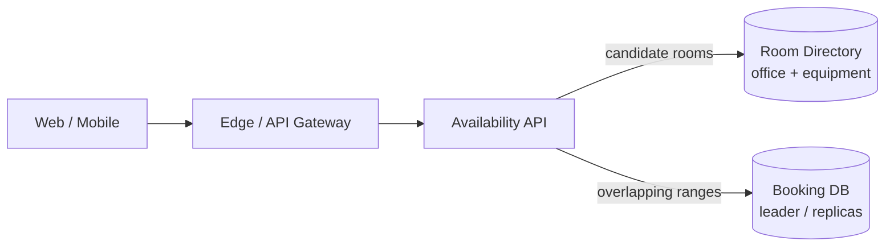
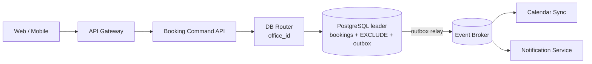

# Meeting Room Booking Service

## Содержание

- [Что проверяет задача](#что-проверяет-задача)
- [Фаза 1: уточнение требований](#фаза-1-уточнение-требований)
- [Фаза 2: оценка нагрузки](#фаза-2-оценка-нагрузки)
- [Ключевые концепции](#ключевые-концепции)
- [Фаза 3: высокоуровневый дизайн](#фаза-3-высокоуровневый-дизайн)
- [Фаза 4: deep dive](#фаза-4-deep-dive)
- [Сквозные потоки](#сквозные-потоки)
- [Отказы и пограничные случаи](#отказы-и-пограничные-случаи)
- [Трейдоффы](#трейдоффы)
- [Фаза 5: финал](#фаза-5-финал)
- [Interview-ready answer](#interview-ready-answer)
- [Связанные материалы](#связанные-материалы)

Разбор сервиса бронирования переговорных. Главный инвариант формулируется
коротко: у одной комнаты не может быть двух активных броней с пересекающимися
интервалами. Availability search помогает выбрать комнату, но только запись в
source of truth окончательно подтверждает слот.

---

## Что проверяет задача

Наивный flow содержит гонку:

```text
User A: SELECT room is free → да
User B: SELECT room is free → да
User A: INSERT booking
User B: INSERT booking
```

Транзакция вокруг каждого `SELECT → INSERT` сама по себе не помогает: оба запроса
могут прочитать отсутствие строк. Инвариант должен защищаться constraint,
блокировкой заранее известного агрегата либо `SERIALIZABLE` с retry.

Для одной комнаты и временного диапазона PostgreSQL уже умеет выразить правило
напрямую через exclusion constraint: одинаковый `room_id` разрешён, пересечение
времени разрешено, но их сочетание запрещено.

---

## Фаза 1: уточнение требований

### Что спросить

- Бронируется одна комната или набор ресурсов атомарно?
- Нужны ли временные holds до подтверждения пользователя?
- Поддерживаются повторяющиеся встречи и сколько occurrence в серии?
- Кто может отменять или изменять чужую бронь?
- Как трактуются границы: встреча до 11:00 и следующая с 11:00 конфликтуют?
- В каком часовом поясе задаётся recurrence и что происходит при DST?
- Нужна ли интеграция с Google Calendar или Microsoft 365?
- Поиск обязан быть строго актуальным или окончательная проверка допустима на create?

### Зафиксированный scope

- Пользователь ищет комнаты по office, времени, capacity и equipment.
- Бронь относится ровно к одной комнате; активный статус — `CONFIRMED`.
- Временных holds нет: создание сразу либо подтверждается, либо получает conflict.
- Интервалы полуоткрытые `[start, end)`: `10:00–11:00` и `11:00–12:00` совместимы.
- Разовая бронь и конечная recurring series до 52 occurrences.
- Создание recurring series работает all-or-nothing: конфликт одного occurrence
  откатывает всю серию и возвращает список конфликтных дат.
- Изменение времени защищается optimistic version; отмена идемпотентна.
- Внешние календари получают события асинхронно и не являются source of truth.
- Multi-room events, approval workflow и desk booking вне scope.

### Нефункциональные требования

| Требование | Значение | Следствие |
| --- | --- | --- |
| Create correctness | Никаких overlapping confirmed bookings | Constraint на leader, fail closed |
| Search latency | p99 < 200 мс | Индекс по room metadata и временным ranges |
| Create/update latency | p99 < 300 мс | Короткая локальная транзакция |
| Availability | 99,99% чтения; 99,9% mutations | Replica reads допустимы только как hint |
| Read-after-write | Создатель сразу видит бронь | Leader или consistency token |
| Audit | История владельца, времени и отмен | State transitions и outbox |

---

## Фаза 2: оценка нагрузки

Все числа — допущения глобального корпоративного SaaS.

```text
employees:                 10 млн
rooms:                     500 тыс.
booking occurrences/day:  5 млн
availability searches:    10 на одну созданную occurrence
average retention:        1 год в hot DB
```

### Reads

```text
5 млн × 10 = 50 млн availability searches/день
50 млн / 86 400 ≈ 579 reads/с в среднем
office-hours peak ×10 ≈ 5 790 reads/с
```

Поиск доминирует, но всегда ограничен конкретным office и фильтрами; сканировать
все 500 тысяч rooms не нужно.

### Writes

```text
5 млн booking occurrences / 86 400
  ≈ 58 inserts/с в среднем

office-hours peak ×20
  ≈ 1 160 inserts/с
```

Update и cancel добавляют нагрузку. Если допустить по 20% каждого:

```text
1 160 create + 232 update + 232 cancel
  ≈ 1 624 mutation/с в условный пик
```

Это не требует шардирования автоматически. Сначала benchmark полной транзакции с
GiST exclusion constraint, индексами, outbox и синхронной репликацией.

### Storage

```text
5 млн occurrences/день × 365
  = 1,825 млрд rows/год

при 250 B raw на booking occurrence:
1,825 млрд × 250 B ≈ 456 GB raw
```

Индексы, MVCC, WAL и репликация увеличат объём в несколько раз. Старые годы можно
переносить в audit archive, но будущие recurring occurrences и текущий год нужны
online.

### Hot room

Общая write-нагрузка распределена по 500 тысячам rooms, но одна популярная
переговорная в 10:00 может получить сотню одновременных попыток. Они не должны
ждать длинный distributed lock: constraint быстро подтверждает одного победителя,
остальные получают `409 SLOT_CONFLICT`.

---

## Ключевые концепции

### Availability — hint, create — решение

Ни один результат поиска не остаётся истинным до клика пользователя. Даже чтение
с leader не закрывает окно между ответом и `POST /bookings`. Поэтому API честно
разделяет:

```text
GET availability → кандидаты на момент as_of
POST booking      → окончательное атомарное решение
```

### Полуоткрытый интервал

Диапазон `[start, end)` включает начало и исключает конец:

```text
[10:00, 11:00) не пересекается с [11:00, 12:00)
[10:00, 11:01) пересекается с     [11:00, 12:00)
```

Эта договорённость должна совпадать в API, PostgreSQL range и клиентском UI.

### Constraint лучше проверки в Go

Проверка `SELECT conflicts`, затем `INSERT` удобна для сообщения пользователю, но
не защищает данные. Exclusion constraint выполняет проверку внутри механизма
индекса и участвует в конкурентной синхронизации PostgreSQL.

### Recurring series — набор обычных occurrences

Хранить только RRULE недостаточно: поиск каждого дня должен заново разворачивать
все серии, а исключения и перенос одного occurrence усложняются. Поэтому series
хранит правило, а ближайшие конечные occurrences материализуются отдельными rows.

---

## Фаза 3: высокоуровневый дизайн

### Availability read path



### Booking mutation path



### Роль компонентов

| Компонент | Зачем нужен | Почему отдельно |
| --- | --- | --- |
| Availability API | Фильтрует rooms и показывает свободные интервалы | Read-heavy hint не должен усложнять exact write path |
| Room Directory | Хранит capacity, equipment, office и access policy | Эти данные меняются реже booking calendar |
| Booking Command API | Создаёт, изменяет и отменяет booking | Все точные mutations проходят один набор инвариантов |
| PostgreSQL leader | Проверяет overlap constraint и фиксирует outbox | Source of truth и конкурентная синхронизация находятся вместе |
| DB Router | При росте направляет office в его shard | Все bookings одной комнаты гарантированно локальны |
| Event Broker | Развязывает commit и внешние эффекты | Calendar/email outage не удерживает DB transaction |
| Calendar Sync | Идемпотентно обновляет внешний календарь | Внешний API может тормозить, повторяться и конфликтовать |
| Notification Service | Отправляет invite/update/cancel | Доставка уведомления не определяет существование брони |

Один HA PostgreSQL cluster остаётся исходным решением. `office_id → virtual
bucket → shard` добавляется только после benchmark; заранее вводить десятки
shards для 1,6K mutations/с нет основания.

---

## Фаза 4: deep dive

### 4.1 API

```http
GET /v1/rooms/availability?office_id=office-7
    &start=2026-10-12T10:00:00+04:00
    &end=2026-10-12T11:00:00+04:00
    &capacity_gte=8&equipment=video

POST /v1/bookings
Idempotency-Key: meeting-42-create-v1
{"room_id":"room-17","start":"2026-10-12T10:00:00+04:00",
 "end":"2026-10-12T11:00:00+04:00","title":"Planning"}

PATCH /v1/bookings/booking-42
Idempotency-Key: meeting-42-move-v2
If-Match: "version-3"
{"start":"2026-10-12T11:00:00+04:00",
 "end":"2026-10-12T12:00:00+04:00"}

POST /v1/bookings/booking-42/cancel
Idempotency-Key: meeting-42-cancel-v1
```

Сервер принимает RFC 3339 timestamps с offset, нормализует их в UTC и возвращает
исходный business timezone для отображения.

### 4.2 PostgreSQL model и constraint

```sql
CREATE EXTENSION IF NOT EXISTS btree_gist;

CREATE TABLE bookings (
    booking_id       uuid PRIMARY KEY,
    series_id        uuid,
    office_id        uuid NOT NULL,
    room_id          uuid NOT NULL,
    organizer_id     uuid NOT NULL,
    during           tstzrange NOT NULL,
    business_tz      text NOT NULL,
    status           text NOT NULL,
    version          bigint NOT NULL,
    created_at       timestamptz NOT NULL,
    CHECK (NOT isempty(during)),
    CHECK (lower(during) IS NOT NULL AND upper(during) IS NOT NULL),
    CHECK (lower_inc(during) AND NOT upper_inc(during))
);

CREATE TABLE booking_requests (
    organizer_id     uuid NOT NULL,
    idempotency_key  text NOT NULL,
    request_hash     text NOT NULL,
    result           jsonb,
    created_at       timestamptz NOT NULL,
    PRIMARY KEY (organizer_id, idempotency_key)
);

ALTER TABLE bookings ADD CONSTRAINT no_active_room_overlap
EXCLUDE USING gist (
    room_id WITH =,
    during WITH &&
)
WHERE (status = 'CONFIRMED');
```

`btree_gist` предоставляет GiST operator class для equality по `room_id`, а
`&&` проверяет пересечение range. Canceled row остаётся для audit, но partial
constraint больше не считает её активной. Idempotency хранится отдельно, потому
что одна команда recurring series создаёт несколько booking rows.

### 4.3 Создание брони

```text
BEGIN
1. INSERT idempotency guard / проверить request hash.
2. Проверить room existence и permission.
3. INSERT booking status=CONFIRMED, during='[start,end)'.
4. INSERT BookingCreated в outbox.
COMMIT
```

Если другой commit уже занял пересекающийся range, exclusion constraint отклоняет
insert. Сервис преобразует конкретную constraint violation в `409 SLOT_CONFLICT`.
Проверка конфликтов перед insert допустима только для понятного UX; решением всё
равно остаётся constraint.

Distributed lock в Redis здесь не нужен. Он создал бы второй источник состояния,
потребовал бы согласовать TTL с транзакцией и всё равно не защитил бы DB от записи
клиента, который обошёл lock.

### 4.4 Изменение и отмена

Move выполняется одной транзакцией:

```sql
UPDATE bookings
SET during = $new_range,
    version = version + 1
WHERE booking_id = $id
  AND organizer_id = $actor
  AND status = 'CONFIRMED'
  AND version = $expected_version;
```

Exclusion constraint проверяет новый range. Если `rows affected = 0`, версия или
state устарели; если нарушен constraint, новый слот уже занят. Старый interval не
теряется, потому что неуспешный statement откатывается.

Cancel меняет `CONFIRMED → CANCELED`, увеличивает version и пишет outbox в одной
транзакции. Повтор cancel возвращает прежний финальный result.

### 4.5 Recurring series и DST

API принимает RRULE, business timezone и предел — `count <= 52` либо `until`.
Сервис сначала разворачивает локальные времена, затем для каждого occurrence
применяет timezone rules и только после этого переводит timestamp в UTC.

```text
Правило: каждый понедельник в 10:00 Europe/Berlin

до DST:  10:00 CET  → 09:00 UTC
после:   10:00 CEST → 08:00 UTC
```

Прибавлять `7 × 24h` к UTC нельзя: встреча сдвинется относительно офисных часов.
Все occurrences серии вставляются в одной ограниченной транзакции. Любой conflict
откатывает весь batch; API возвращает конфликтные локальные даты после отдельной
диагностической проверки.

Изменение одного occurrence создаёт exception, изменение всей серии создаёт новую
series version и пересобирает только будущие occurrences.

### 4.6 Leader, replicas и cache

- Create/update/cancel всегда идут на leader выбранного shard.
- Сразу после mutation клиент получает booking из ответа и consistency token.
- Exact calendar владельца с token читается с leader.
- Availability search может читать replica или короткоживущую projection и
  возвращает `as_of`; результат всё равно не является reserve.
- Старые audit pages читаются с replicas или archive.

### 4.7 Calendar integration

`BookingCreated`, `BookingMoved` и `BookingCanceled` публикуются через outbox.
Calendar Sync хранит mapping `(provider, booking_id) → external_event_id` и
идемпотентно повторяет provider calls.

Если Google/Microsoft недоступен, booking остаётся подтверждённой в нашем сервисе,
а UI показывает `calendar_sync=PENDING`. Импорт изменений из внешнего календаря
является командой с version check; он не может молча перезаписать более свежее
состояние.

---

## Сквозные потоки

### 1. Поиск и конкурентное создание

A и B видят room-17 свободной → оба отправляют create → два insert конкурируют в
GiST exclusion constraint → один commit проходит, второй получает conflict.

Итог: stale availability ухудшает UX, но не создаёт double booking.

### 2. Перенос встречи

Client отправляет expected version 3 → UPDATE проверяет ownership/state/version →
constraint проверяет новый range → transaction пишет `BookingMoved` outbox.

Итог: конфликт не удаляет старый слот, потерянный ответ безопасно повторяется.

### 3. Отмена

Command API выполняет `CONFIRMED → CANCELED` → constraint освобождает range →
outbox запускает calendar cancel и уведомления.

Итог: слот свободен сразу после DB commit, даже если email ещё не отправлен.

---

## Отказы и пограничные случаи

| Сбой | Поведение |
| --- | --- |
| Availability показала свободный room, но create конфликтует | Возвращается `409 SLOT_CONFLICT` и свежие alternatives |
| Ответ create потерян | Retry с тем же key возвращает прежний booking |
| Два запроса двигают одну booking | Только expected version побеждает, второй получает `VERSION_CONFLICT` |
| Move попал в занятый range | Statement откатывается, прежний interval остаётся |
| Cancel повторился | Возвращается прежний `CANCELED`, второй outbox event не создаётся |
| Один occurrence recurring series конфликтует | Весь create batch откатывается, пользователь видит конфликтные даты |
| Calendar provider недоступен | Booking остаётся source of truth, sync retry идёт асинхронно |
| Replica отстаёт | Create всё равно защищён constraint; consistency token направляет критичное чтение на leader |
| Leader потерян | Mutations fail closed до promotion; confirmed данные сохраняются синхронной replica |

---

## Трейдоффы

| Выбор | Альтернатива | Почему и чем платим |
| --- | --- | --- |
| PostgreSQL exclusion constraint | Distributed lock | Инвариант живёт рядом с данными; цена — GiST write cost |
| `[start,end)` | Закрытые интервалы | Соседние встречи не конфликтуют, но контракт должен быть единым в UI/API/DB |
| Availability как hint | Пытаться резервировать каждый search | Нет множества брошенных holds, но create иногда получает conflict |
| Материализованные occurrences | Хранить только RRULE | Быстрый overlap query ценой дополнительных rows |
| All-or-nothing series | Частично создать свободные даты | Предсказуемый результат ценой более частых отказов серии |
| Optimistic version | Долгая блокировка edit form | Нет locks на время действий человека, но возможен version conflict |
| Async calendar sync | Provider call внутри transaction | Booking не зависит от внешнего API, но sync временно eventual |
| Shard по office_id после benchmark | Shard по user_id | Все интервалы комнаты локальны; личный календарь собирается projection |

---

## Фаза 5: финал

### Двухминутное резюме

> Я разделяю availability hint и окончательный create. Даже точный search
> устаревает до клика, поэтому double booking защищает PostgreSQL exclusion
> constraint по `(room_id =, tstzrange &&)`, а не проверка в приложении и не Redis
> lock. Интервалы полуоткрытые `[start,end)`, поэтому соседние встречи совместимы.
>
> При допущениях получаю около 5,8 тысячи availability reads/с и 1,6 тысячи
> mutations/с в пике. Начинаю с одного HA PostgreSQL cluster и измеряю полную
> транзакцию с GiST, outbox и synchronous replica. Если потребуется sharding,
> маршрутизирую по office_id через virtual buckets, чтобы все интервалы комнаты
> оставались на одном shard.
>
> Create идемпотентен, move использует expected version, cancel — монотонный state
> transition. Recurring series материализуется максимум в 52 occurrences внутри
> одной транзакции; правило вычисляется в business timezone, иначе DST сдвинет
> локальное время. Calendar и уведомления получают события через outbox, поэтому
> их отказ не влияет на существование брони.

### За пределами scope и рост ×10

- Multi-room event потребует атомарности нескольких resources или orchestration policy.
- Approval workflow добавит `PENDING`, deadline и правила участия pending range в constraint.
- Бесконечная recurrence потребует rolling materialization horizon.
- При росте сначала масштабируются availability replicas/cache; write sharding
  вводится только после benchmark и по office locality.

---

## Interview-ready answer

**1. Как не допустить двойную бронь?**

- Инвариант — active ranges одной комнаты не пересекаются.
- Механизм — PostgreSQL `EXCLUDE USING GiST (room_id WITH =, during WITH &&)`.
- Результат — один конкурентный insert проходит, второй получает conflict.

**2. Почему сначала проверить availability недостаточно?**

- Гонка — другой пользователь занимает слот между search и create.
- Контракт — search возвращает hint на момент `as_of`.
- Решение — только atomic insert на leader подтверждает booking.

**3. Нужен ли Redis lock?**

- Нет — constraint уже синхронизирует конкурирующие записи рядом с source of truth.
- Риск — внешний lock требует TTL и может разойтись с DB transaction.
- Исключение — lock может снижать лишнюю работу, но не заменяет DB invariant.

**4. Как безопасно перенести встречу?**

- Concurrency — клиент передаёт expected version.
- Atomicity — один UPDATE меняет interval, а constraint проверяет новый slot.
- Failure — при conflict весь statement откатывается и старый slot сохраняется.

**5. Как хранить recurring meetings?**

- Rule — series хранит RRULE и business timezone.
- Query model — будущие occurrences материализуются отдельными booking rows.
- DST — локальное время вычисляется раньше перевода в UTC.

**6. Куда направлять чтения?**

- Mutations — всегда leader.
- Read-after-write — leader по consistency token.
- Search — replica/cache допустимы, потому что create всё равно повторяет exact check.

---

## Связанные материалы

- [PostgreSQL: индексы](../../06-databases/database-systems-catalog/postgresql/02-indexes.md) — GiST и exclusion constraint
- [PostgreSQL: транзакции и блокировки](../../06-databases/database-systems-catalog/postgresql/04-transactions-and-locking.md)
- [PostgreSQL: outbox и idempotency](../../06-databases/database-systems-catalog/postgresql/14-outbox-and-idempotency.md)
- [Notification Service](./02-notification-service.md)
- [System Design Interview: database cases](../../06-databases/database-fundamentals/04-interview-cases.md)
