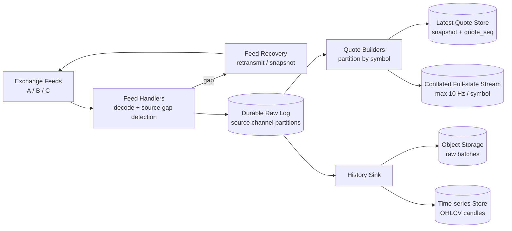
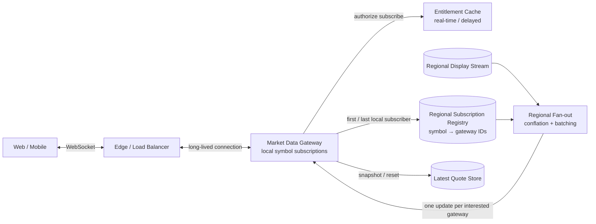

# Stock Market Data Service

## Содержание

- [Что проверяет задача](#что-проверяет-задача)
- [Фаза 1: уточнение требований](#фаза-1-уточнение-требований)
- [Фаза 2: оценка нагрузки](#фаза-2-оценка-нагрузки)
- [Ключевые концепции](#ключевые-концепции)
- [Фаза 3: высокоуровневый дизайн](#фаза-3-высокоуровневый-дизайн)
- [Фаза 4: deep dive](#фаза-4-deep-dive)
- [Сквозные потоки](#сквозные-потоки)
- [Отказы и пограничные случаи](#отказы-и-пограничные-случаи)
- [Трейдоффы](#трейдоффы)
- [Фаза 5: финал](#фаза-5-финал)
- [Interview-ready answer](#interview-ready-answer)
- [Связанные материалы](#связанные-материалы)

Разбор backend-системы, которая принимает биржевые market-data feeds и отдаёт
котировки миллионам пользователей. Это не matching engine и не торговая система:
ордера, позиции, расчёты и исполнение сделок находятся вне scope.

> **Термины.** **Quote** — текущие bid/ask и связанное состояние инструмента.
> **Trade** — факт сделки. **Snapshot** — полное состояние на определённом
> sequence. **Delta** — изменение после snapshot. **Conflation** — схлопывание
> нескольких промежуточных quote updates в последнее актуальное состояние.

---

## Что проверяет задача

Здесь нельзя нарисовать один `Kafka → WebSocket` и закончить. Нужно закрыть четыре
разных вопроса:

1. Как понять, что upstream feed потерял пакет или прислал дубль?
2. Как совместить snapshot с одновременно приходящими updates и не откатить state?
3. Как не умножить каждый update на миллионы central subscription records?
4. Что делать с клиентом, который читает медленнее, чем меняется рынок?

Главное разделение проходит между raw market events и пользовательским display
state. Raw events нужны для audit/replay и не теряются намеренно. Экрану обычно
нужно последнее актуальное состояние: промежуточные quotes можно conflated.
Upstream source gap всегда требует recovery; display `quote_seq` при этом может
законно перескакивать, потому что каждый update несёт полное заменяемое состояние.

---

## Фаза 1: уточнение требований

### Что спросить

- Нужны top-of-book quotes, trades или полный order book?
- Клиент обязан получить каждый tick или только актуальное состояние?
- Какой бюджет end-to-end latency: 50 мс, 250 мс или несколько секунд?
- Сколько instruments и одновременных subscribers?
- Есть real-time и delayed тарифы? Кто проверяет entitlement?
- Требуется исторический tick replay или только свечи OHLCV?
- Один exchange или несколько feeds с разными sequence semantics?
- Что показывать при gap или остановке feed: последнюю цену или `STALE`?
- Нужна работа вне market hours и календарь торговых сессий?

### Зафиксированный scope

- 50 тысяч instruments, несколько upstream venues.
- Пользователь подписывается и отписывается динамически через WebSocket.
- Отдаём consolidated top-of-book, last trade, exchange timestamp и freshness.
- UI получает snapshot, затем full-state updates с монотонным внутренним
  `quote_seq` на symbol; после conflation sequence не обязан быть непрерывным.
- Display channel допускает conflation до одного update на symbol за 100 мс.
- Raw normalized events сохраняются для replay; minute candles доступны отдельно.
- После reconnect, reset или нарушения порядка клиент получает новый snapshot.
- Entitlement определяет real-time либо 15-minute delayed stream.
- Медленный клиент получает последнее состояние либо reconnect, но не
  неограниченную очередь старых quotes.
- Full depth order book, order placement, portfolio и billing вне scope.

### Нефункциональные требования

| Требование | Значение | Следствие |
| --- | --- | --- |
| Source-to-client latency | p99 < 250 мс для real-time display | Региональные delivery hubs, bounded batching |
| Snapshot latency | p99 < 200 мс | In-memory latest state store |
| Availability | 99,99% delivery | Multi-region и reconnect/resume |
| Integrity | Не скрывать source gaps и потерю connection state | Source sequence, checksum и snapshot reset |
| Freshness | Явный `exchange_ts`, `received_ts`, `STALE` | Последняя цена без freshness недостаточна |
| Backpressure | Bounded memory на connection | Conflation, batch frames, disconnect policy |
| Precision | Цена не хранится в binary float | Fixed-point ticks/decimal representation |

---

## Фаза 2: оценка нагрузки

Все значения — допущения для capacity planning.

```text
одновременных клиентов:           5 млн
подписок на клиента:              20 instruments
instruments:                      50 тыс.
raw updates:                      250 тыс./с average, 1 млн/с peak
normalized raw record:            120 B
display event:                    200 B
display cadence:                  не чаще 10 updates/с на symbol
```

### Subscription edges

```text
5 млн clients × 20 symbols
  = 100 млн logical subscription edges

при 48 B логических данных на edge:
100 млн × 48 B ≈ 4,8 GB на весь Gateway fleet до map overhead
```

Подписки не нужно писать в центральную SQL-таблицу: они живут столько же, сколько
WebSocket connection. Gateway хранит local `symbol → connections`, а Regional
Fan-out знает только `symbol → gateway IDs`.

### Raw ingest

```text
average:
250 000 records/с × 120 B ≈ 30 MB/с

peak:
1 000 000 × 120 B ≈ 120 MB/с producer payload

peak при broker replication factor 3:
≈ 360 MB/с broker write traffic до protocol overhead
```

Число partitions и brokers выводится из benchmark с реальным envelope,
compression, replication и consumer lag.

### Raw history

Для накопления используется среднее:

```text
250 000 × 86 400 × 120 B
  ≈ 2,592 TB raw/day

30 дней:
2,592 × 30 ≈ 77,76 TB raw до compression и replication
```

Держать это как 30-дневный Kafka retention дорого. Broker хранит короткое окно
replay, например сутки, а immutable raw batches уходят в Object Storage. Для UI
строятся компактные minute candles.

### Client egress

Даже с 20 subscriptions пользователь не обязательно получает 200 updates/с:
часть symbols спокойна, а updates conflated. Допустим в market peak средний client
получает 10 display events/с суммарно:

```text
5 млн clients × 10 events/с
  = 50 млн client events/с

50 млн × 200 B
  = 10 GB/с ≈ 80 Gbit/с payload egress
```

Это доминирующая capacity. Протокольный overhead, TLS и multi-region duplication
увеличат число.

### Gateway fleet

Если benchmark покажет 25 тысяч стабильных connections на Gateway с нужным CPU,
memory, egress и failure headroom:

```text
5 млн / 25 тыс. = 200 Gateway instances

subscription edges на Gateway:
25 тыс. × 20 = 500 тыс.
```

`25K` — результат будущего benchmark, а не предел Go/Linux. Fleet дополнительно
держит запас, чтобы пережить потерю failure domain и reconnect storm.

### Почему двухуровневый fan-out меняет арифметику

Пусть горячий symbol подписан у пользователей на всех 200 Gateway и display
stream выпускает 10 updates/с:

```text
между Regional Fan-out и Gateway:
10 × 200 = 2 000 batched symbol deliveries/с

Gateway локально размножает update своим connections
```

Центральный слой работает по Gateway, а не по миллионам пользователей.

---

## Ключевые концепции

### Source sequence и quote sequence — не одно число

Exchange обычно нумерует packets или channel messages, в которых лежат данные
многих symbols. Этот `source_seq` нужен Feed Handler для gap detection.

После нормализации Quote Builder назначает внутренний `quote_seq` отдельно на
symbol. Он нужен Gateway и клиенту, чтобы не применить старое состояние поверх
нового:

```text
source channel: packet 9001 → AAPL, MSFT, NVDA changes
internal state: AAPL quote_seq=781, MSFT=455, NVDA=912
```

Нельзя проверять upstream packet gap по per-symbol seq и наоборот. До conflation
`quote_seq` растёт на каждое изменение state; display stream вправе выдать 101,
затем 105, если update 105 содержит полное состояние и заменяет 101.

### Snapshot и updates образуют один state stream

Snapshot без watermark бесполезен: пока он загружается, рынок продолжает
меняться. Клиент должен применять только full-state updates с `quote_seq` больше
snapshot и никогда не откатывать состояние более старым update.

### Display state и raw audit имеют разные delivery semantics

Raw pipeline хранит каждое принятое нормализованное событие. Display pipeline
может заменить три ещё не отправленных quotes одним последним:

```text
pending: seq 101 price 100
arrives: seq 102 price 101
arrives: seq 103 price  99

slow client получает full-state update seq 103 price 99
```

Это корректно только для latest-state contract. Trade tape или regulatory audit,
где важна каждая сделка, требует отдельного non-conflated channel.

### Таймер не создаётся на каждую подписку

Сто миллионов subscription edges не должны означать сто миллионов timers.
Market Calendar управляет session transitions централизованно, Feed Health следит
за десятками channels, а Gateway обслуживает connection heartbeat через buckets
или timing wheel. Freshness вычисляется из timestamps состояния.

---

## Фаза 3: высокоуровневый дизайн

### Ingestion и state plane



### Subscription и delivery plane



### Роль компонентов

| Компонент | Зачем нужен | Почему отдельно |
| --- | --- | --- |
| Feed Handler | Декодирует venue protocol и проверяет source sequence | Ошибка feed не должна становиться «обычным» quote update |
| Feed Recovery | Запрашивает retransmit или fresh venue snapshot | Продолжать после gap без repair нельзя |
| Durable Raw Log | Даёт replay и независимых consumers | State, history и analytics не блокируют ingestion |
| Quote Builder | Строит состояние и внутренний per-symbol sequence | Snapshot и updates рождаются из одного ordered owner |
| Latest Quote Store | Отдаёт быстрый snapshot с watermark | Reconnect не перечитывает raw log |
| Display Stream | Ограничивает частоту UI updates | Raw burst не превращается в unbounded client egress |
| Gateway | Держит connections и local subscription map | Fan-out к пользователям выполняется рядом с socket |
| Regional Registry | Хранит только symbol-to-gateway routing | Hot path не содержит 100 млн central user edges |
| Regional Fan-out | Отправляет один batched update каждому interested Gateway | Снижает central amplification и изолирует регионы |
| Entitlement Cache | Проверяет real-time/delayed доступ при subscribe | Лицензирование не проверяется на каждый tick |
| Object Storage | Хранит полный raw history дёшево | Десятки TB не остаются в broker |
| Time-series Store | Отдаёт candles и агрегаты | Аналитические range queries отделены от latest-state path |

---

## Фаза 4: deep dive

### 4.1 WebSocket protocol

```json
{"type":"subscribe","request_id":"r-17","symbols":["AAPL","MSFT"]}

{"type":"snapshot","symbol":"AAPL","quote_seq":781,
 "bid_ticks":18942,"ask_ticks":18943,"last_ticks":18942,
 "exchange_ts":"2026-08-27T10:15:00.123456Z",
 "status":"LIVE"}

{"type":"quote_update","symbol":"AAPL","quote_seq":782,
 "bid_ticks":18943,"ask_ticks":18944,
 "last_ticks":18943,
 "exchange_ts":"2026-08-27T10:15:00.167221Z"}
```

Price хранится как integer ticks плюс instrument tick-size metadata либо как
fixed-point decimal. Binary float не подходит для точного сравнения и UI.
`quote_update` содержит всё display state инструмента, а не patch одного поля:
тогда более новый update безопасно заменяет предыдущий после conflation.

Одна WebSocket subscription command удобнее SSE, потому что клиент динамически
меняет watchlist внутри существующего connection. Для статической публичной
ленты server-to-client SSE остаётся разумной альтернативой.

### 4.2 Upstream gap recovery

Feed Handler хранит `last_source_seq` на channel:

```text
ожидался 9002, пришёл 9004
→ channel state = RECOVERING
→ updates 9004+ временно buffer с жёстким лимитом
→ запросить venue retransmit 9002..9003 или полный snapshot
→ применить recovery в source order
→ state = LIVE
```

Если buffer переполнен или retransmit недоступен, handler отбрасывает сомнительное
локальное состояние и загружает полный snapshot. Last known quote помечается
`STALE`; нельзя продолжать публиковать его как live.

Primary и standby feed connections сравниваются по source sequence. Дедупликация
использует `(venue, channel_id, source_seq)`, а переключение не должно повторно
применять один packet.

### 4.3 Snapshot без гонки

При первой локальной подписке Gateway сначала регистрирует symbol у Regional
Fan-out и начинает bounded buffering latest-state updates, затем читает Latest
Store:

```text
1. register(AAPL), начать buffer.
2. GET snapshot → quote_seq=781.
3. Отбросить buffered seq <= 781.
4. Оставить самый новый full-state update с seq > 781.
5. Отправить snapshot 781, затем накопившийся более новый state.
```

Скачок с 781 на 785 нормален: conflation намеренно убрал промежуточные полные
states. Если routing ещё не был подтверждён, buffer потерян или connection
пересоздан, Gateway повторяет snapshot. На reconnect клиент может передать
последний seq; короткий regional replay buffer отдаёт более новый full state, а
при его отсутствии возвращается новый snapshot.

### 4.4 Двухуровневые subscriptions

Gateway хранит:

```text
symbol → set(connection_id)
connection_id → set(symbol)
```

При появлении первого local subscriber он публикует `GatewayInterested(symbol)`;
при уходе последнего — `GatewayUninterested(symbol)`. Registry хранит не каждого
user, а set Gateway IDs. События имеют `gateway_epoch`, поэтому запоздалый
unsubscribe от старого процесса не удаляет интерес уже перезапущенного Gateway.

Heartbeat Gateway обновляет lease всего его registry state. После crash lease
истекает, и fan-out перестаёт отправлять в мёртвую ноду. Клиенты reconnect с
backoff и jitter и восстанавливают watchlist.

### 4.5 Slow consumers и conflation

На connection нельзя заводить обычную очередь каждого quote: медленный browser
накопит гигабайты и увеличит latency до минут. Gateway держит bounded map последнего
неотправленного состояния по symbol и собирает batch frame каждые 50–100 мс.

```text
buffer normal       → отправить latest states batch
buffer saturated    → заменить старое pending state новым того же symbol
socket долго blocked → отправить RESET_REQUIRED или закрыть connection
```

Trade events не проходят через этот conflated buffer, если контракт обещает
каждую сделку. Для них нужен отдельный тариф/endpoint, лимиты подписок и
достаточная клиентская пропускная способность.

### 4.6 Entitlements и delayed feed

Gateway проверяет подписку при `subscribe`, а не на каждом update. Signed
entitlement snapshot содержит plan, разрешённые exchanges и expiry. Короткий cache
уменьшает зависимость от Billing/Auth, но отзыв доступа доставляется отдельным
событием и закрывает запрещённые subscriptions.

Delayed users не должны получать live event с локальным `sleep(15m)` на каждом
connection. Региональный delay buffer один раз удерживает display stream по
event-time и публикует отдельный delayed topic, который fan-out масштабирует так
же, как real-time.

### 4.7 Market calendar, timers и stale state

Market Calendar публикует `PRE_OPEN`, `OPEN`, `HALT`, `CLOSED` по venue. Feed
Health имеет timers на feed channels, а не на users. Quote содержит:

```text
exchange_ts  — когда событие создала venue
received_ts  — когда его приняла наша система
published_ts — когда display stream выпустил update
status       — LIVE / HALTED / CLOSED / STALE / RECOVERING
```

Gateway heartbeat обслуживается timing wheel или периодическими buckets. Закрытие
connection удаляет весь local watchlist одной операцией; per-symbol TTL не нужен.

### 4.8 History и candles

History Sink складывает raw records крупными immutable objects, partitioned по
`venue/date/hour`, с manifest и checksum. Запись manifest происходит только после
проверки object; повтор sink использует тот же deterministic object key.

Candle Builder по event-time формирует OHLCV:

```text
open  = первая trade price окна
high  = maximum
low   = minimum
close = последняя trade price окна
volume = sum quantity
```

Позднее событие в пределах watermark обновляет ещё открытое окно. После closure
correction создаёт новую candle version, а не молча переписывает уже выданную
историю.

---

## Сквозные потоки

### 1. Нормальный quote update

Exchange packet → Feed Handler проверяет source seq → Raw Log → Quote Builder
обновляет snapshot и quote_seq → Display Stream conflates → Regional Fan-out
находит Gateway IDs → Gateway локально рассылает subscribers.

Итог: central fan-out работает по Gateway, а не по миллионам users.

### 2. Новая подписка

Client subscribe → Gateway проверяет entitlement → при первом local subscriber
регистрирует symbol и buffer latest state → читает snapshot с watermark →
отправляет snapshot и накопившееся более новое состояние.

Итог: update, пришедший во время snapshot read, не теряется.

### 3. Feed gap

Handler обнаруживает source sequence gap → помечает channel `RECOVERING` →
останавливает live publication сомнительного state → retransmit или full snapshot
→ Quote Builder выпускает reset state.

Итог: пользователю лучше явно показать stale, чем тихо показать неверную цену.

### 4. Медленный клиент

Gateway заменяет pending quotes последним state → batch остаётся bounded → при
долгой блокировке закрывает connection → reconnect получает fresh snapshot.

Итог: один browser не удерживает память и не создаёт backpressure всему region.

---

## Отказы и пограничные случаи

| Сбой | Поведение |
| --- | --- |
| Exchange packet пропущен | Channel переходит в `RECOVERING`, quote помечается stale до retransmit/snapshot |
| Standby повторил уже применённый packet | Дедуп по venue/channel/source_seq не меняет state второй раз |
| Snapshot прочитан во время update | Gateway buffer применяет только full state новее snapshot watermark |
| Connection прерван или output state сброшен | Короткий replay latest state, иначе `RESET_REQUIRED` и fresh snapshot |
| Gateway упал | Registry lease истекает, clients reconnect с jitter и восстанавливают watchlist |
| Registry недоступен | Existing routes живут до lease; новые first subscriptions могут fail/retry, quotes не искажаются |
| Slow consumer | Pending states conflated; после лимита connection закрывается |
| Entitlement Service недоступен | Действующий signed cache живёт до expiry; новый доступ fail closed для real-time tier |
| Broker lag растёт | Raw ingestion throttling/extra capacity; display может сильнее conflate, но не выдумывает state |
| Market закрыт или halted | Последний quote остаётся с явным `CLOSED/HALTED`, а не выглядит live |
| History sink повторил batch | Deterministic object key и manifest не создают двойную историю |

---

## Трейдоффы

| Выбор | Альтернатива | Почему и чем платим |
| --- | --- | --- |
| WebSocket | SSE | Динамические subscribe/unsubscribe без reconnect ценой более сложного connection lifecycle |
| Snapshot + full-state updates | Только latest polling | Ниже latency и трафик, но нужны watermark и reset protocol |
| Conflated display | Каждый raw tick каждому UI | Bounded egress ценой пропуска промежуточных quotes |
| Raw durable log отдельно | Хранить только latest quote | Audit/replay возможны ценой десятков TB истории |
| Symbol → Gateway registry | Central symbol → users | В сотни раз меньше routing edges, но нужен второй local fan-out |
| Local Gateway subscriptions | Durable SQL subscriptions | Connection lifecycle дешёвый, но watchlist восстанавливается после reconnect |
| Latest in memory/KV | Читать time-series DB | Snapshot укладывается в миллисекунды ценой отдельной state projection |
| Delayed regional stream | Timer на client update | Одна задержка вместо миллионов timers, но нужен дополнительный stream tier |
| Explicit stale | Показывать last known как live | Честная freshness ценой заметной деградации UI |
| Home region per feed | Global synchronous state | Низкая ingestion latency, но regions получают асинхронную копию display stream |

---

## Фаза 5: финал

### Двухминутное резюме

> Я разделяю raw ingestion, latest quote state и display delivery. Feed Handler
> проверяет exchange channel sequence и при gap делает retransmit или snapshot,
> а не продолжает на сомнительных данных. Durable Raw Log нужен для replay;
> Quote Builder владеет per-symbol state и назначает внутренний quote sequence.
> Latest Store отдаёт snapshot, Display Stream conflates UI updates до 10 Hz.
>
> При допущениях upstream даёт 250 тысяч records/с в среднем и миллион в пике,
> то есть около 2,6 TB raw в день. Но главный масштаб — egress: пять миллионов
> клиентов по десять display events/с дают 50 миллионов events/с и около 80 Gbit/с
> payload. Поэтому Regional Fan-out хранит `symbol → gateway IDs`, отправляет один
> update на заинтересованный Gateway, а тот размножает его local connections.
>
> Subscribe сначала включает bounded latest-state buffer, затем читает snapshot с
> watermark и применяет только более новый full state. Скачки quote_seq после
> conflation допустимы; пропуск source_seq — нет. Медленный клиент не
> получает бесконечную очередь: pending quotes схлопываются до latest state, а при
> невозможности догнать выполняется snapshot reset. Каждая цена несёт source time,
> receive time, quote sequence и `LIVE/STALE/HALTED/CLOSED`, поэтому доступность не
> достигается показом устаревшей цены как актуальной.

### За пределами scope и рост ×10

- Full order book требует book builder, более строгого snapshot protocol и намного большего egress.
- Tick-by-tick premium channel не может использовать quote conflation.
- Trading path требует risk checks, order state machine и регуляторный audit отдельно.
- При росте ingestion масштабируется source channels/symbol partitions, delivery —
  regions и Gateways, а history — Object Storage prefixes и independent query tier.

---

## Interview-ready answer

**1. Как обнаружить потерю данных от биржи?**

- Source sequence — Feed Handler отслеживает номер packet/channel message.
- Gap — channel переходит в `RECOVERING`, а last state становится `STALE`.
- Repair — применяется retransmit либо полный venue snapshot до возврата в `LIVE`.

**2. Как соединить snapshot с текущими updates?**

- Watermark — snapshot содержит per-symbol `quote_seq`.
- Buffer — Gateway начинает принимать full-state updates до чтения snapshot.
- Merge — states до watermark отбрасываются, самый новый state применяется поверх snapshot.

**3. Как раздать горячий symbol миллионам пользователей?**

- Уровень 1 — Regional Registry хранит `symbol → gateway IDs`.
- Уровень 2 — Gateway хранит local `symbol → connections`.
- Эффект — central layer отправляет один update на Gateway, а не на каждого user.

**4. Что делать с медленным клиентом?**

- Bound — output buffer имеет жёсткий предел.
- Conflation — несколько pending quotes одного symbol заменяются последним.
- Recovery — если connection не догоняет, он получает reset или reconnect со snapshot.

**5. Почему нельзя хранить только последнюю цену?**

- Recovery — raw log позволяет пересобрать state после ошибки.
- Audit — можно объяснить происхождение quote и проверить feed handling.
- History — candles и исследования строятся из event-time records.

**6. SSE или WebSocket?**

- WebSocket — подходит для динамической watchlist внутри одного connection.
- SSE — проще для статической однонаправленной публичной ленты.
- Решение — определяется subscription protocol, latency и proxy constraints, а не словом realtime.

**7. Какие timestamps отдавать клиенту?**

- Exchange time — когда событие возникло у venue.
- Receive/publish time — где задержка появилась внутри нашей системы.
- Status — `LIVE`, `STALE`, `HALTED` или `CLOSED` не даёт принять старую цену за текущую.

---

## Связанные материалы

- [WebSocket Chat at Scale](./04.1-websocket-chat-capacity.md) — connection fleet и двухуровневый fan-out
- [Twitch / Live Streaming](./19-live-streaming-platform.md) — региональная доставка большого realtime workload
- [SSE и realtime-протоколы](../../08-networking-and-api/protocols/04-realtime/02-sse.md)
- [WebSocket](../../08-networking-and-api/protocols/04-realtime/01-websocket.md)
- [Kafka](../../07-message-brokers-and-streaming/01-kafka.md)
- [Redis Pub/Sub](../../07-message-brokers-and-streaming/05-redis-pubsub.md)
- [MongoDB time series](../../06-databases/database-systems-catalog/04-mongodb.md)
- [Подписки на цену авиабилетов](./21-flight-price-alerts.md) — другой класс price subscriptions с минутной freshness
