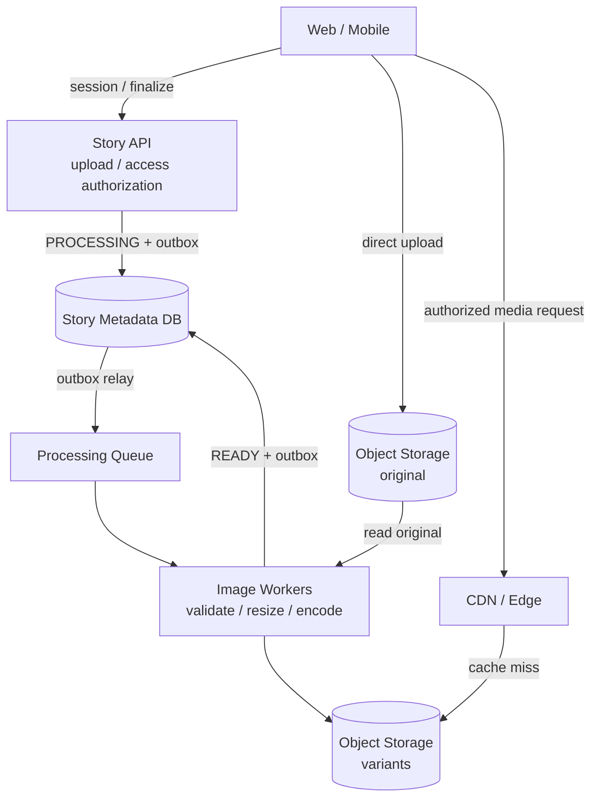
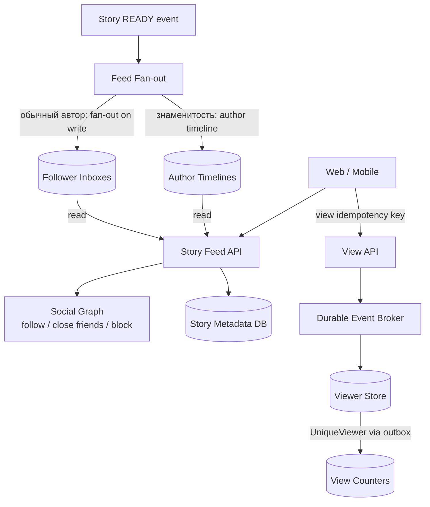

# Photo / Stories Service

## Содержание

- [Что проверяет задача](#что-проверяет-задача)
- [Фаза 1: уточнение требований](#фаза-1-уточнение-требований)
- [Фаза 2: оценка нагрузки](#фаза-2-оценка-нагрузки)
- [Ключевая модель](#ключевая-модель)
- [Фаза 3: высокоуровневый дизайн](#фаза-3-высокоуровневый-дизайн)
- [Фаза 4: deep dive](#фаза-4-deep-dive)
- [Сквозные потоки](#сквозные-потоки)
- [Отказы и пограничные случаи](#отказы-и-пограничные-случаи)
- [Трейдоффы](#трейдоффы)
- [Фаза 5: финал](#фаза-5-финал)
- [Interview-ready answer](#interview-ready-answer)
- [Связанные материалы](#связанные-материалы)

Практический разбор Stories: пользователь публикует фотографию на 24 часа,
подписчики видят её в ленте, а автор получает список зрителей. Главное — не
пропустить за разговорами о CDN две разные системы: управление метаданными и
массовую доставку медиаконтента.

---

## Что проверяет задача

| Признак | Архитектурный ход | Цена |
| --- | --- | --- |
| Фотографии намного тяжелее метаданных | Прямая загрузка в object storage | Нужны upload token и финализация |
| Оригинал нельзя раздавать всем | Асинхронная обработка и варианты размеров | Публикация проходит несколько состояний |
| Story живёт 24 часа | Логический deadline + асинхронное физическое удаление | Некоторое время остаются технические копии |
| Автор видит зрителей | Идемпотентное событие просмотра | Счётчик обновляется не строго синхронно |
| У автора миллионы подписчиков | Гибридный fan-out | Read-path знаменитости дороже |
| Privacy и block должны применяться быстро | Проверка доступа до выдачи короткой CDN-ссылки | Уже выданная ссылка живёт до своего TTL |

На интервью достаточно подробно разобрать два пути:

1. Загрузка `client -> object storage -> processing -> CDN`.
2. Формирование ленты и учёт просмотров без fan-out-взрыва.

---

## Фаза 1: уточнение требований

### Что спросить

```text
1. Story содержит фото, видео или оба типа?
2. Сколько живёт публикация и нужно ли хранить архив автора?
3. Кто может смотреть: все, подписчики, close friends?
4. Нужен точный список уникальных зрителей или только счётчик?
5. Как быстро должны применяться block и delete?
6. Нужны ли реакции, ответы и ранжирование ленты?
7. Один регион или глобальная аудитория?
```

### Зафиксированный scope

- Story содержит одну фотографию; видео и обычные постоянные посты вне scope.
- Клиент загружает оригинал до 10 MB, сервис создаёт несколько JPEG/WebP-вариантов.
- Story видна подписчикам 24 часа и может быть удалена автором раньше.
- Режимы доступа: `FOLLOWERS`, `CLOSE_FRIENDS`, `PUBLIC`.
- Автор получает приблизительный счётчик и страницу уникальных зрителей.
- Повторный просмотр одного пользователя не создаёт второго viewer.
- После block или delete новые открытия запрещаются сразу после чтения актуальных
  метаданных; уже выданная CDN-ссылка может работать ещё до 5 минут.
- Лента использует гибридный fan-out: обычных авторов раскладываем по inbox,
  знаменитостей подмешиваем при чтении.
- Аутентификацию, социальный граф и push-уведомления считаем готовыми сервисами.

### Нефункциональные требования

```text
создать upload session: p99 < 200 мс
открыть metadata feed: p99 < 200 мс
выдать media URL:       p99 < 150 мс без учёта скачивания изображения
публикация после upload: обычно < 10 секунд
availability metadata: 99.99%
durability:             подтверждённый оригинал не теряется
```

Для ленты и счётчика допустима eventual consistency в несколько секунд. Для
privacy, block и delete выбираем fail-closed: если нельзя проверить доступ,
защищённый медиаресурс не выдаётся.

---

## Фаза 2: оценка нагрузки

Чисел в условии нет. Ниже учебные допущения, а не характеристики конкретной
социальной сети:

```text
DAU:                             20 млн
публикаций на пользователя:      2 Story/день
просмотров на пользователя:      50 Story/день
средний оригинал:                2 MB
оригинал + готовые варианты:     3 MB на Story
средний отданный вариант:        500 KB
metadata одной Story:            около 600 B
сырое viewer-событие:            около 64 B
обычная Story среди публикаций:  99%
eligible followers обычной Story: в среднем 200
логическая ссылка в inbox:       около 32 B
```

### Публикации и хранение

```text
20 млн × 2 = 40 млн Story/день
40 млн / 86 400 ≈ 463 публикации/с в среднем
согласованный пик ×5 ≈ 2 315 публикаций/с

Входящий медиатрафик:
  40 млн × 2 MB = 80 TB/день
  80 TB / 86 400 ≈ 926 MB/с в среднем
  пик ×5 ≈ 4,63 GB/с

Объём оригиналов и вариантов:
  40 млн × 3 MB = 120 TB/день
  при удалении не позднее 48 часов ≈ 240 TB рабочего набора

Metadata:
  40 млн × 600 B = 24 GB/день сырого payload
```

`240 TB` — не годовое накопление: это рабочий набор при двух сутках физического
хранения. Если продукт добавляет постоянный архив автора, объём надо пересчитать
от фактического retention.

### Просмотры и исходящий трафик

```text
20 млн × 50 = 1 млрд просмотров/день
1 млрд / 86 400 ≈ 11 574 просмотров/с в среднем
согласованный пик ×8 ≈ 92 600 просмотров/с

Медиатрафик к клиентам:
  1 млрд × 500 KB = 500 TB/день
  500 TB / 86 400 ≈ 5,79 GB/с ≈ 46,3 Gbit/s в среднем
  пик ×8 ≈ 370 Gbit/s

При CDN hit ratio 95% средняя нагрузка чтения на origin:
  5,79 GB/с × 5% ≈ 290 MB/с
```

Основной bandwidth обслуживает CDN. Backend выдаёт метаданные и авторизованные
ссылки, поэтому масштабировать его от `370 Gbit/s` было бы ошибкой.

### Viewer events

```text
1 млрд событий/день × 64 B = 64 GB/день сырого payload
1 млрд / 86 400 ≈ 11 574 events/с в среднем
пик ×8 ≈ 92 600 events/с
```

Количество строк будет большим, хотя число байт умеренное. Поэтому просмотры
принимаются через журнал событий, дедуплицируются по `(story_id, viewer_id)` и
записываются пакетами. Точное число партиций и узлов выводится из benchmark, а не
из одной оценки RPS.

### Feed fan-out

Даже лёгкие ссылки могут создать больше внутренних записей, чем Story metadata:

```text
Обычные Story:
  40 млн × 99% = 39,6 млн/день

Inbox references:
  39,6 млн × 200 = 7,92 млрд ссылок/день
  7,92 млрд / 86 400 ≈ 91 700 записей/с в среднем
  согласованный пик ×5 ≈ 458 300 записей/с

Сырой payload ссылок:
  7,92 млрд × 32 B ≈ 253 GB/день
```

Это оценка внутреннего fan-out, а не клиентского RPS. Ссылки пишутся пакетами
через partitioned log и хранятся с коротким retention. Публикации знаменитостей
исключены из расчёта: для них используется fan-out on read, иначе несколько hot
authors определили бы всю write-capacity системы.

---

## Ключевая модель

### Story — метаданные, Media Asset — файл

```text
Story:
  story_id, author_id, media_id
  audience, created_at, expires_at
  status = UPLOADING | PROCESSING | READY | REJECTED | DELETED | EXPIRED

Media Asset:
  media_id, original_object_key
  variants[{format, width, height, object_key}]
  checksum, processing_status

Viewer:
  story_day, story_id, viewer_id, first_viewed_at
  UNIQUE(story_day, story_id, viewer_id)
```

`Story` отвечает на вопрос «можно ли сейчас показать публикацию». `Media Asset`
описывает физические объекты. Удаление Story мгновенно закрывает новый доступ к
метаданным, но очистка объектов и CDN выполняется асинхронно.

### Deadline важнее TTL хранилища

```text
visible = status == READY
       && now < expires_at
       && audience_allows(viewer)
       && !blocked(author, viewer)
```

Истечение ключа в Redis или object lifecycle нельзя использовать как
единственную бизнес-проверку: очистка работает не в точную миллисекунду.
Истиной служит `expires_at`, а TTL лишь освобождает место.

---

## Фаза 3: высокоуровневый дизайн

### Загрузка и доставка media



Клиент не прокачивает фотографию через Story API. API создаёт ожидаемый
`media_id`, ограничивает размер и MIME type в upload policy, а после загрузки
worker повторно проверяет реальный формат, checksum и декодируемость файла.

### Лента, доступ и просмотры



Inbox хранит ссылки на `story_id`, а не фотографии. При чтении Feed API
объединяет inbox с timeline знаменитостей, удаляет expired/deleted элементы,
повторно применяет privacy и формирует ранжированный ответ.

### Роль компонентов

| Компонент | Ответственность |
| --- | --- |
| Story API | Создаёт upload session, финализирует Story, проверяет доступ |
| Object Storage | Хранит оригиналы и готовые варианты |
| Image Workers | Валидируют, меняют размер и кодируют изображения |
| Metadata DB | Хранит авторитетное состояние Story и deadline |
| Feed Fan-out | Раскладывает ссылки обычных авторов, сохраняет timeline знаменитостей |
| Social Graph | Отвечает на follow, close friends и block |
| CDN | Отдаёт тяжёлый media payload рядом с пользователем |
| View API и broker | Быстро принимают просмотры и сглаживают пик |
| Viewer Store | Дедуплицирует зрителей и выдаёт страницу автору |

---

## Фаза 4: deep dive

### 4.1 Direct upload без потерянной публикации

```text
POST /v1/story-uploads
  -> {story_id, media_id, upload_url, upload_deadline}

POST /v1/stories/{story_id}/finalize
  Idempotency-Key: publish-42
  -> {status: PROCESSING}

GET /v1/stories/{story_id}
GET /v1/story-feed?cursor=...
DELETE /v1/stories/{story_id}
POST /v1/stories/{story_id}/views
  Idempotency-Key: view-session-42
  {view_token: ...}
```

Создание заранее фиксирует владельца и ожидаемый object key. Финализация
проверяет ownership и наличие объекта, а повтор с тем же ключом возвращает тот же
результат. Незавершённые uploads удаляет lifecycle rule после короткого срока.

Финализация одной транзакцией переводит Story в `PROCESSING` и пишет в outbox
событие `ProcessingRequested`. Задача из очереди доставляется как минимум один
раз, поэтому worker делает `upsert(media_id, processing_version)` и пишет
варианты по детерминированным ключам. Повторная обработка не создаёт вторую
Story.

### 4.2 Публикация только готового media

Состояние `READY` устанавливается после записи обязательных вариантов. Изменение
metadata и событие `StoryReady` фиксируются одной локальной транзакцией через
outbox. Feed fan-out никогда не разносит `PROCESSING` Story.

Если часть необязательных размеров не собралась, можно опубликовать базовый
вариант и достроить остальные. Если не прошли validation или moderation,
состояние становится `REJECTED`, а клиент получает объяснимый результат через
polling или push.

### 4.3 Normal author и celebrity

Пусть у обычного автора 200 eligible подписчиков. Одна публикация создаёт 200 лёгких
ссылок в inbox; чтение становится дешёвым. У знаменитости 50 млн подписчиков та
же стратегия создаст 50 млн записей и будет часами догонять публикацию.

Гибридное правило:

```text
followers < threshold:
  StoryReady -> append story_id во follower inbox

followers >= threshold:
  StoryReady -> append только в author timeline
  Feed read  -> merge inbox + timelines знаменитостей, на которых подписан viewer
```

Threshold выбирается по измеренной стоимости fan-out и read amplification. Это
не вечное свойство аккаунта: смена режима версионируется, иначе во время
переключения появятся дубли или пропуски. Feed API дедуплицирует по `story_id`.

### 4.4 Viewer tracking

Ответ на `view` означает «событие принято в durable broker», а не «счётчик уже
виден автору». Consumer вставляет уникальную пару `(story_id, viewer_id)`:

```sql
INSERT INTO story_viewers(story_day, story_id, viewer_id, first_viewed_at)
VALUES ($1, $2, $3, $4)
ON CONFLICT (story_day, story_id, viewer_id) DO NOTHING
RETURNING viewer_id;
```

В той же транзакции consumer пишет `UniqueViewer` в локальный outbox, но только
если `INSERT` действительно создал новую пару. Отдельный consumer идемпотентно
применяет это событие к приблизительному счётчику; периодическая сверка
пересчитывает его из viewer-строк. Так повтор клиента, повторная доставка и сбой
между viewer store и counter не создают необъяснимый dual write. `story_day`
вычисляется из `Story.created_at` в UTC, а не из времени просмотра: все просмотры
одной Story попадают в одну суточную партицию, и уникальный ключ включает ключ
партиционирования. Партиция удаляется после expiry всех созданных в этот день
Stories и дополнительного продуктового retention.

`viewer_id` берётся из аутентифицированного контекста, а не из тела запроса.
Вместе с media URL клиент получает короткий подписанный `view_token`, связанный со
Story и viewer: иначе злоумышленник мог бы накрутить просмотры произвольных
публикаций, не имея права их открыть.

### 4.5 Privacy, block и delete

Privacy нельзя реализовать только «секретным URL»: его можно переслать. Перед
выдачей короткоживущей CDN-ссылки API проверяет:

1. Story в состоянии `READY` и не истекла.
2. Viewer входит в разрешённую аудиторию.
3. Между автором и viewer нет block.

После delete metadata немедленно меняется на `DELETED`, из inbox асинхронно
удаляются ссылки, CDN получает purge, а object storage удаляет файлы. До
завершения purge уже выданная ссылка может жить не более своего TTL — в scope это
5 минут. Требование мгновенной криптографической ревокации потребовало бы edge
authorization на каждый media request и повысило бы задержку и связанность.

### 4.6 Expiry и очистка

Read-path всегда фильтрует `now >= expires_at`, даже если sweeper опаздывает.
Фоновая очистка делает три независимые вещи:

- помечает Story как `EXPIRED` и выпускает событие;
- удаляет устаревшие ссылки из feed inbox;
- запускает CDN purge и удаление media по lifecycle.

Каждый шаг идемпотентен. Отставание очистки расходует место, но не делает Story
видимой после deadline.

---

## Сквозные потоки

### 1. Успешная публикация

1. Клиент получает upload URL и напрямую пишет оригинал в object storage.
2. Клиент вызывает finalize; транзакция фиксирует `PROCESSING` и outbox event.
3. Worker валидирует файл, создаёт варианты и переводит Story в `READY`.
4. Outbox публикует `StoryReady`; обычный автор fan-out-ится в inbox.
5. Клиент читает feed, проходит актуальную проверку доступа и получает CDN URL.

### 2. Story знаменитости

1. `StoryReady` добавляет одну ссылку в author timeline.
2. Feed API знает список celebrity-подписок пользователя.
3. При чтении он объединяет timeline с обычным inbox и дедуплицирует `story_id`.

### 3. Просмотр и удаление

1. View API принимает идемпотентное событие и отвечает после durable enqueue.
2. Consumer вставляет уникального viewer и одной транзакцией пишет outbox event.
3. Counter consumer применяет `UniqueViewer`; счётчик обновляется асинхронно.
4. Автор удаляет Story; новые запросы сразу получают `404/410`.
5. Inbox, CDN и media очищаются асинхронно.

---

## Отказы и пограничные случаи

| Сбой | Поведение |
| --- | --- |
| Клиент загрузил файл, но не вызвал finalize | Lifecycle удалит orphan после upload deadline |
| Worker получил событие дважды | Детерминированные keys и processing version делают retry безопасным |
| Один вариант изображения не записался | Story остаётся `PROCESSING`, задача повторяется |
| Fan-out отстал | Story появится позже; celebrity timeline не зависит от fan-out |
| Viewer event доставлен дважды | Unique pair и outbox появляются один раз; counter consumer дедуплицирует событие |
| Sweeper опоздал | `expires_at` на read-path всё равно скрывает Story |
| Social Graph недоступен | Защищённый media URL не выдаётся; публичную политику оговариваем отдельно |
| CDN purge задержался | Новые URL не выдаются, старый истекает максимум через 5 минут |
| Автор сменил privacy | Metadata проверяется при следующей выдаче URL; inbox не является ACL |

---

## Трейдоффы

| Решение | Плюс | Минус |
| --- | --- | --- |
| Direct upload | API не прокачивает гигабайты | Сложнее lifecycle незавершённых uploads |
| Короткая signed URL | CDN остаётся эффективным | Ревокация не быстрее TTL ссылки |
| Fan-out on write | Быстрый feed обычных пользователей | Write amplification |
| Fan-out on read для знаменитостей | Нет миллионов записей на публикацию | Дороже merge при чтении |
| Durable viewer events | View-path выдерживает пик | Счётчик отстаёт |
| Точный unique viewer | Корректный список зрителей | Много мелких записей |
| Логический deadline + lifecycle | Корректность не зависит от sweeper | Временный мусор в storage |

---

## Фаза 5: финал

### Двухминутное резюме

> Я разделяю систему на metadata plane и media plane. Story API хранит владельца,
> аудиторию, состояние и точный `expires_at`, а клиент загружает оригинал напрямую
> в object storage по ограниченной signed URL. Асинхронные workers валидируют файл,
> создают варианты и только после этого одной транзакцией переводят Story в READY
> и пишут outbox event. Изображения раздаёт CDN: при наших допущениях это до
> 370 Gbit/s в пике, тогда как metadata API обслуживает десятки тысяч запросов в
> секунду.
>
> Для ленты использую гибридный fan-out. Ссылки Stories обычного автора заранее
> попадают в inbox подписчиков; публикации знаменитости остаются в её timeline и
> подмешиваются при чтении. Доступ проверяется заново перед выдачей media URL,
> поэтому inbox не заменяет privacy и block. Просмотры поступают в durable broker,
> а consumer идемпотентно создаёт уникальную пару story/viewer и обновляет
> eventual counter. После 24 часов read-path скрывает Story по deadline независимо
> от sweeper, а feed-ссылки, CDN и объекты очищаются асинхронно.

### За пределами scope и рост ×10

За пределами scope остаются видео, рекомендации, ответы, постоянный архив и
глобальная active-active запись. При росте ×10 сначала отдельно проверяем CDN
egress, пропускную способность viewer broker и размер follower inbox. Metadata DB
шардируем по `author_id`. Обычные viewer-данные удобно локализовать по `story_id`,
а для одной экстремально горячей Story вводим детерминированные
`viewer_bucket = hash(viewer_id)`: запись распределяется, а список зрителей
собирается из ограниченного числа buckets. Celebrity timeline уже изолирует
самый опасный feed fan-out hotspot.

---

## Interview-ready answer

**1. Почему фотография не проходит через backend приложения?**

- Причина — медиатрафик на порядки тяжелее metadata-запросов.
- Решение — backend выдаёт ограниченную signed upload URL, а клиент пишет прямо в object storage.
- Проверка — worker всё равно валидирует реальный формат, размер и checksum после загрузки.

**2. Почему Story нельзя публиковать сразу после upload?**

- Инвариант — в feed попадает только Story с обязательными готовыми вариантами изображения.
- Механика — worker завершает обработку, переводит запись в `READY` и пишет outbox event.
- Retry — processing version и детерминированные object keys не создают дубликаты.

**3. Как Story исчезает ровно через 24 часа?**

- Истина — каждый read проверяет `expires_at`, поэтому задержка sweeper не продлевает видимость.
- Очистка — worker позже удаляет feed-ссылки, CDN cache и физические объекты.
- Цена — некоторое время после expiry storage содержит уже невидимые данные.

**4. Как обслужить автора с миллионами подписчиков?**

- Обычный автор — fan-out on write создаёт лёгкие ссылки в follower inbox.
- Знаменитость — Story остаётся в author timeline и подмешивается при чтении.
- Защита — feed дедуплицирует `story_id` во время переключения режима.

**5. Как получить уникальных зрителей без двойного счёта?**

- Приём — View API быстро сохраняет событие в durable broker.
- Дедупликация — consumer вставляет уникальную пару `(story_id, viewer_id)`.
- Счётчик — увеличивается только для новой пары и может отставать на несколько секунд.

**6. Что происходит после block или delete?**

- Новый доступ — metadata API перестаёт выдавать media URL сразу после актуальной проверки.
- Старый доступ — уже выданная ссылка может жить до своего короткого TTL.
- Физическая очистка — inbox, CDN и object storage очищаются асинхронно и идемпотентно.

---

## Связанные материалы

- [Как проходить System Design Interview](./00-how-to-approach.md)
- [Upload и фоновая обработка файла](../external-request-flows/05-file-upload-and-background-processing-flow.md)
- [Read-heavy запрос с CDN и кешем](../external-request-flows/02-read-heavy-request-with-cdn-and-cache.md)
- [Twitter / Social Feed](./08-twitter-social-feed.md)
- [Kafka](../../07-message-brokers-and-streaming/01-kafka.md)
- [Idempotency](../reliability-patterns/06-idempotency.md)
