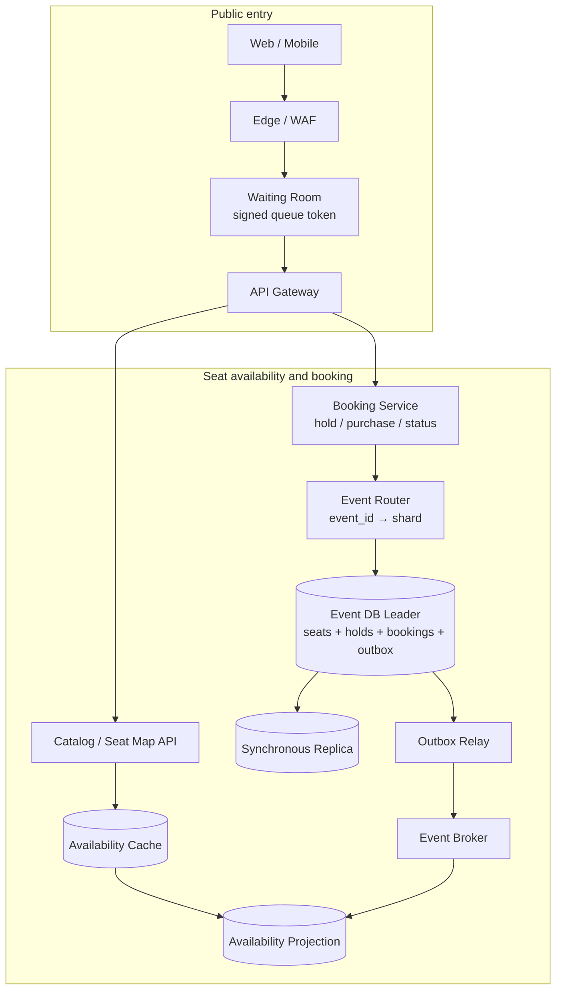
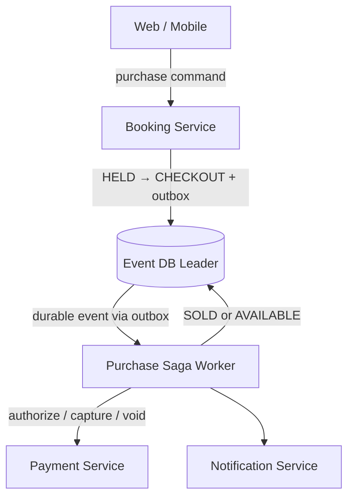

# Ticket Booking Service

## Содержание

- [Что проверяет задача](#что-проверяет-задача)
- [Фаза 1: уточнение требований](#фаза-1-уточнение-требований)
- [Фаза 2: оценка нагрузки](#фаза-2-оценка-нагрузки)
- [Ключевая модель](#ключевая-модель)
- [Фаза 3: высокоуровневый дизайн](#фаза-3-высокоуровневый-дизайн)
- [Фаза 4: deep dive](#фаза-4-deep-dive)
- [Сквозные потоки](#сквозные-потоки)
- [Отказы и пограничные случаи](#отказы-и-пограничные-случаи)
- [Трейдоффы](#трейдоффы)
- [Фаза 5: финал](#фаза-5-финал)
- [Interview-ready answer](#interview-ready-answer)
- [Связанные материалы](#связанные-материалы)

Практический разбор продажи билетов с выбором мест. Сложность задачи создаёт не
каталог мероприятий, а короткий интервал, когда тысячи клиентов одновременно
пытаются забрать последние места и часть запросов повторяется после timeout.

---

## Что проверяет задача

| Признак | Архитектурный ход | Цена |
| --- | --- | --- |
| Search read-heavy и может отставать | Availability projection и cache | Свободное место на карте ещё не гарантировано |
| Hold должен быть точным | Условная транзакция на leader | Конкуренты сериализуются на одной seat-строке |
| Место удерживается ограниченное время | Серверный deadline и idempotent sweeper | Нужно разрешить гонку expiry с purchase |
| Платёж и билет в разных системах | Saga с авторизацией и компенсацией | Нет общей атомарной транзакции |
| Ответ после commit может потеряться | Idempotency key и status API | Результаты операций нужно хранить |
| Старт продаж создаёт огромный пик | Waiting room и admission control | Не все клиенты сразу попадают в backend |

Главная формулировка на интервью: карта мест показывает подсказку, `hold`
принимает точное решение, а `purchase` превращает временное право в проданный
билет.

---

## Фаза 1: уточнение требований

### Что спросить

```text
1. Места нумерованные или продаём только квоту сектора?
2. Можно ли одним запросом удержать несколько соседних мест?
3. Каков TTL hold и можно ли его продлевать?
4. Ответ purchase должен быть синхронным или допустим PROCESSING?
5. Как работают отмена, возврат и повторная продажа?
6. Насколько stale может быть карта доступности?
7. Нужна ли строгая очередность при старте продаж?
8. Один event хранится на одном DB-шарде?
```

### Зафиксированный scope

- Продаём нумерованные места на мероприятие.
- Один запрос удерживает до 8 мест и работает по принципу «все или ни одного».
- Hold живёт 10 минут; deadline задаёт сервер и не продлевается клиентскими retry.
- Карта мест может отставать до 2 секунд и не обещает успешный hold.
- Purchase идёт асинхронной Saga: API быстро возвращает `PROCESSING`, а клиент
  читает статус или получает push.
- Платёж сначала авторизуется, затем место фиксируется как `SOLD`, после чего
  выполняется capture. Покупка становится `CONFIRMED` и билет отправляется только
  после успешного capture; до `SOLD` неуспешная Saga освобождает место и снимает
  авторизацию.
- Повтор с тем же `Idempotency-Key` возвращает прежнюю операцию.
- Возвраты и secondary market оставляем за scope.
- Данные одного мероприятия находятся на одном shard, поэтому group hold остаётся
  локальной транзакцией.

### Нефункциональные требования

```text
search / seat map:       p99 < 200 мс
create hold:             p99 < 500 мс после допуска из waiting room
purchase command:        p99 < 500 мс до ответа PROCESSING
финальный purchase:      обычно < 5 секунд
availability:            99.99%
correctness:             одно место нельзя продать двум покупателям
durability:              подтверждённый SOLD переживает отказ узла
```

При потере leader/quorum exact mutation возвращает `503`. Продажа по устаревшей
реплике повысила бы availability ответа ценой двойной продажи, что нарушает
главный инвариант.

---

## Фаза 2: оценка нагрузки

Числа ниже — согласованные учебные допущения:

```text
DAU:                              5 млн
поисков и обновлений seat map:    20 на DAU в день
hold attempts:                    5 млн/день
purchase attempts:                2 млн/день
средний hold:                     2 места
размер записи завершённой покупки: около 1 KB
```

### Обычный агрегированный пик

```text
Search:
  5 млн × 20 = 100 млн запросов/день
  100 млн / 86 400 ≈ 1 157 запросов/с в среднем
  согласованный пик ×10 ≈ 11 600 запросов/с

Hold:
  5 млн / 86 400 ≈ 58 attempts/с в среднем
  согласованный пик ×20 ≈ 1 160 attempts/с
  1 160 × 2 места ≈ 2 320 seat mutations/с

Purchase:
  2 млн / 86 400 ≈ 23 attempts/с в среднем
  согласованный пик ×20 ≈ 460 attempts/с
```

Read-path масштабируется cache и replicas. Exact hold остаётся на leader, но
обычная нагрузка распределяется между event-shards по `event_id`.

### Старт продаж

```text
1 млн пользователей нажали Buy за 10 секунд:
  1 000 000 / 10 = 100 000 admission requests/с на edge

Допустим, benchmark event-shard даёт безопасно:
  1 000 hold attempts/с при целевом p99

Admission limit:
  не более 1 000 допущенных hold attempts/с для этого event-shard
```

`1 000 attempts/с` — явно помеченный результат предполагаемого benchmark, а не
универсальная capacity PostgreSQL. Waiting room нужен даже при небольшом числе
мест: он поглощает `100 000 requests/с` снаружи и не даёт очереди блокировок
разрушить весь shard.

### Накопление

```text
до 2 млн завершённых purchase operations/день × 1 KB
  = до 2 GB/день сырого payload
2 GB × 365 = до 730 GB/год
```

По числу operations это верхняя граница: предполагается, что сохраняются все
успешные и неуспешные purchase attempts. По физическим байтам это нижняя оценка,
потому что она не включает индексы, аудит и репликацию. Holds не умножаются на
год: это временные данные, а завершённые операции архивируются отдельно.

---

## Ключевая модель

### Три разных обещания

| Операция | Что обещает | Источник данных |
| --- | --- | --- |
| Availability | «Недавно место выглядело свободным» | Cache / read projection |
| Hold | «До `expires_at` место принадлежит этой попытке» | Exact transaction на leader |
| Purchase | «Билет продан и имеет стабильный booking ID» | Booking Saga + durable state |

Нельзя возвращать успешную продажу на основании cache. Между показом карты и
нажатием кнопки другой пользователь вправе создать hold.

### Состояние места

```text
AVAILABLE --hold--> HELD
HELD --cancel or expiry--> AVAILABLE
HELD --purchase accepted before deadline--> CHECKOUT
CHECKOUT --authorization succeeded, booking committed--> SOLD
CHECKOUT --payment failed, authorization voided--> AVAILABLE
```

`CHECKOUT` отделяет принятую до deadline покупку от медленного внешнего payment
call. Обычный hold-sweeper уже не освобождает такое место; у checkout есть свой
короткий deadline и компенсация.

---

## Фаза 3: высокоуровневый дизайн

### Search, hold и обновление projection



Waiting room стоит только перед горячими событиями. Обычный трафик может пройти
через тот же логический admission-компонент без ожидания. Search читает проекцию,
а `hold`, `cancel` и переходы purchase всегда маршрутизируются на leader shard,
выбранного по `event_id`.

### Роль компонентов

| Компонент | Ответственность |
| --- | --- |
| Waiting Room | Ограничивает допуск на горячее мероприятие и выдаёт подписанный queue token |
| Seat Map API | Быстро показывает приблизительную доступность |
| Booking Service | Выполняет идемпотентные exact mutations |
| Event Router | Сохраняет все места одного event в одной транзакционной границе |
| Event DB Leader | Обеспечивает инвариант seat state и хранит результат операции |
| Availability Projection | Строит read-модель из committed outbox events |
| Purchase Saga Worker | Координирует Payment и переходы booking |
| Notification Service | Сообщает окончательный статус после асинхронной Saga |

---

## Фаза 4: deep dive

### 4.1 API

```text
GET  /v1/events/{event_id}/seats
POST /v1/events/{event_id}/holds
  Idempotency-Key: hold-client-42
  {seat_ids: [A-10, A-11]}

GET    /v1/holds/{hold_id}
DELETE /v1/holds/{hold_id}

POST /v1/holds/{hold_id}/purchase
  Idempotency-Key: purchase-client-42
  {payment_method_token: ...}

GET /v1/purchases/{purchase_id}
```

Ответ hold содержит серверный `expires_at`. Ответ purchase содержит стабильный
`purchase_id` и состояние `PROCESSING`; timeout клиента не означает неуспех.

### 4.2 DB invariant и seat contention

Авторитетная строка места:

```sql
CREATE TABLE event_seats (
    event_id          UUID        NOT NULL,
    seat_id           TEXT        NOT NULL,
    status            TEXT        NOT NULL,
    hold_id           UUID,
    hold_expires_at   TIMESTAMPTZ,
    booking_id        UUID,
    version           BIGINT      NOT NULL DEFAULT 0,
    PRIMARY KEY (event_id, seat_id),
    CHECK (status IN ('AVAILABLE', 'HELD', 'CHECKOUT', 'SOLD')),
    CHECK (status <> 'AVAILABLE' OR
           (hold_id IS NULL AND hold_expires_at IS NULL AND booking_id IS NULL)),
    CHECK (status <> 'HELD' OR booking_id IS NULL),
    CHECK (status NOT IN ('HELD', 'CHECKOUT') OR
           (hold_id IS NOT NULL AND hold_expires_at IS NOT NULL)),
    CHECK (status <> 'CHECKOUT' OR booking_id IS NOT NULL),
    CHECK (status <> 'SOLD' OR booking_id IS NOT NULL)
);
```

Для group hold сервис сортирует `seat_id`, блокирует строки в одном порядке и в
одной транзакции проверяет каждое место. Затем выполняет условное изменение:

```sql
UPDATE event_seats
SET status = 'HELD',
    hold_id = $hold_id,
    hold_expires_at = $expires_at,
    version = version + 1
WHERE event_id = $event_id
  AND seat_id = $seat_id
  AND (
      status = 'AVAILABLE'
      OR (status = 'HELD' AND hold_expires_at < statement_timestamp())
  );
```

Если обновлено не каждое запрошенное место, транзакция откатывается. Сортировка
снижает риск deadlock для пересекающихся наборов. Инвариант обеспечивают
условная запись и row lock на одном leader, а не Redis lock.
Переход обратно в `AVAILABLE` обязан одновременно очищать `hold_id`,
`hold_expires_at` и `booking_id`, что дополнительно проверяет `CHECK`.

### 4.3 Idempotency в той же транзакции

В таблице операций хранится `(operation_scope, user_id, idempotency_key,
request_hash, result)` с уникальным ограничением по первым трём полям. Для hold
scope включает `event_id`, для purchase — `hold_id`. Запись операции создаётся в
той же транзакции, что изменение seat rows:

- тот же ключ и тот же hash возвращают прежний `hold_id` или `purchase_id`;
- тот же ключ с другим payload возвращает `409`;
- новая попытка после бизнес-отказа получает новый ключ.

Отдельный глобальный idempotency cache создал бы dual write и не защитил бы от
сбоя между записью cache и commit мест.

### 4.4 TTL, sweeper и гонка с purchase

Deadline проверяется внутри транзакции, а не по клиентским часам. Purchase
сначала делает условный переход:

```text
HELD --[hold_id matches && now < hold_expires_at]--> CHECKOUT
```

Только победивший переход начинает Payment Saga. Sweeper освобождает лишь
`HELD` с истёкшим deadline и использует условие `status='HELD' AND expires_at <
now`; он не затрагивает `CHECKOUT`. Поэтому expiry и purchase не могут оба
успешно владеть одним seat state.

Sweeper нужен для очистки и выпуска событий, но correctness от его пунктуальности
не зависит: новый hold может атомарно забрать уже истёкшую `HELD`-строку.
Просроченный `CHECKOUT` восстанавливает отдельный Saga worker: сначала выясняет
состояние Payment, затем завершает `SOLD` либо делает void и только после этого
освобождает место. Слепо освобождать `CHECKOUT` по таймеру нельзя.

### 4.5 Purchase Saga



```text
1. Booking DB: HELD -> CHECKOUT, set booking_id, create purchase=PENDING, outbox
2. Payment: authorize amount with purchase_id as idempotency key
3. Booking DB: CHECKOUT -> SOLD, purchase=CAPTURE_PENDING, outbox
4. Payment: capture authorization idempotently
5. Booking DB: purchase=CONFIRMED, outbox
6. Notification: send ticket / status
```

Если authorization не прошла, Saga возвращает места в `AVAILABLE`. Если booking
commit после authorization не подтверждён, worker сначала читает purchase status:
при `CAPTURE_PENDING` продолжает capture, при `CONFIRMED` завершает Saga, а при
оставшемся `PENDING/CHECKOUT` повторяет условный booking commit. Только доказанный
rollback или исчерпанный policy deadline разрешает void и возврат места. Timeout
не является доказательством rollback.

Capture после `SOLD` означает короткое состояние «место продано, деньги ещё не
захвачены», поэтому клиент всё ещё видит `PROCESSING`, а билет не отправляется.
Состояние закрывают retry и reconciliation; окончательный отказ требует
ручной/бизнес-компенсации согласно сроку до события. Альтернатива «capture раньше
SOLD» создаёт обратное состояние «деньги списаны, места нет» и требует refund.

### 4.6 Потерянный ответ после commit

Сценарий:

```text
DB COMMIT hold H7
server отправляет 201
соединение обрывается
клиент видит timeout
```

Клиент повторяет тот же запрос с прежним idempotency key. Booking Service читает
зафиксированный результат и возвращает `H7` с исходным deadline, не создавая
новый hold и не продлевая старый. Дополнительно `GET /holds/H7` и
`GET /purchases/P9` позволяют восстановить состояние после перезапуска клиента.

### 4.7 Waiting room и fairness

Edge создаёт очередь до Booking Service, хранит позицию вне request connection и
выдаёт короткоживущий подписанный token допуска. Admission Controller знает
безопасный бюджет конкретного event-shard и ограничивает скорость входа.

Token содержит `event_id`, `queue_entry_id`, окно допуска и nonce. Backend
проверяет подпись, event и окно, а nonce потребляет атомарно либо привязывает к
одной идемпотентной hold-операции. Иначе один token можно было бы переиспользовать
для обхода admission limit. Это обеспечивает
контролируемую приблизительную очередность, но не обещает, что пользователь с
позицией 100 обязательно купит место раньше позиции 101: после допуска остаются
сетевые задержки и выбор разных seats.

---

## Сквозные потоки

### 1. Карта мест и успешный hold

1. Seat Map API отдаёт stale projection с пометкой, что это preview.
2. Клиент после допуска отправляет список мест и idempotency key.
3. Booking Service на leader атомарно меняет все места `AVAILABLE -> HELD`.
4. Outbox обновляет availability projection асинхронно.

### 2. Два пользователя выбрали одно место

1. Оба видят `A-10` свободным в cache.
2. Первый условный `UPDATE` меняет строку на `HELD`.
3. Второй после ожидания row lock обновляет ноль строк и получает conflict.
4. Сервис предлагает перечитать карту, но не обещает прежнее место.

### 3. Успешная покупка

1. До deadline hold переходит в `CHECKOUT`, API возвращает `PROCESSING`.
2. Saga авторизует платёж, фиксирует `SOLD`, захватывает деньги.
3. Клиент по `purchase_id` получает `CONFIRMED`; notification дублирует результат.

---

## Отказы и пограничные случаи

| Сбой | Поведение |
| --- | --- |
| Два hold на одно место | Один условный commit побеждает, второй получает conflict |
| Group hold захватил не все места | Вся локальная транзакция откатывается |
| Клиент повторил hold после timeout | Тот же idempotency key возвращает прежний hold |
| Sweeper и purchase пришли одновременно | Условный state transition разрешает победить только одному |
| Payment timeout | Saga читает статус или повторяет с тем же ключом, не считает timeout отказом |
| Authorization успешна, worker упал | Durable Saga state продолжит commit или void |
| Capture после SOLD временно не проходит | Purchase остаётся `CAPTURE_PENDING`; retry и reconciliation закрывают расхождение, билет не отправляется |
| Projection отстала | Карта врёт только как hint; exact hold остаётся корректным |
| Event shard недоступен | Exact mutations получают `503`, search может показать stale данные |
| Waiting room потеряла позицию | Durable queue entry восстанавливает token; место заранее не обещано |

---

## Трейдоффы

| Решение | Плюс | Минус |
| --- | --- | --- |
| Один event на одном shard | Multi-seat hold остаётся ACID-транзакцией | Горячий event нельзя размазать обычным hash-sharding |
| Stale availability projection | Дешёвое массовое чтение | Пользователь иногда проигрывает на hold |
| Row-level conditional update | Простой доказуемый инвариант | Один seat — последовательная точка contention |
| Waiting room | Защищает DB и сохраняет управляемую очередь | Добавляет ожидание и состояние admission |
| Асинхронный purchase | Переживает медленный Payment | Клиенту нужен status flow |
| Authorization перед capture | Можно компенсировать без refund | Требуются void, retry и reconciliation |

---

## Фаза 5: финал

### Двухминутное резюме

> Я разделяю три контракта. Карта мест — быстрая eventual projection и только
> подсказка. Hold — точная транзакция на leader event-shard: строки мест
> блокируются в стабильном порядке и условно переходят из AVAILABLE в HELD все
> вместе. Purchase — идемпотентная Saga. До истечения hold атомарно переходит в
> CHECKOUT, затем Payment авторизуется, место фиксируется как SOLD, а деньги
> захватываются. Timeout любого внешнего вызова считается неизвестным состоянием,
> а не отказом; worker читает durable status и повторяет шаг с тем же ключом.
>
> На старте продаж edge waiting room принимает внешний пик и допускает в Booking
> Service не больше измеренной capacity конкретного event-shard. Idempotency key и
> результат операции хранятся в той же БД-транзакции, поэтому потерянный ответ
> после commit не создаёт второй hold. Expiry проверяется условным переходом в DB:
> sweeper освобождает место асинхронно, но его задержка не нарушает корректность.

### За пределами scope и рост ×10

За scope остаются возвраты, resale, general-admission sectors, динамические цены
и multi-region write. При росте ×10 измеряем capacity одного event-shard и
изолируем особо горячее мероприятие на выделенный shard. Делить места event по
секторам можно только после явного решения, как покупать набор из разных
секторов без одной локальной транзакции.

---

## Interview-ready answer

**1. Почему свободное место на карте ещё не гарантирует покупку?**

- Карта — eventual projection, оптимизированная для массового чтения.
- Решение — только условная транзакция hold на leader определяет победителя.
- UX — при конфликте клиент перечитывает карту и выбирает другое место.

**2. Как не продать одно место дважды?**

- Инвариант — одна авторитетная seat-строка имеет ровно одно текущее состояние.
- Механика — `UPDATE` меняет `AVAILABLE -> HELD` под row lock и только при допустимом прежнем состоянии.
- Group hold — все места изменяются в одной транзакции или вся операция откатывается.

**3. Зачем состояние CHECKOUT?**

- Гонка — Payment может отвечать дольше, чем остаток TTL hold.
- Решение — принятая до deadline покупка атомарно замораживает место в `CHECKOUT`.
- Компенсация — неуспешная Saga возвращает его в `AVAILABLE` по отдельному deadline.

**4. Как работает Payment Saga?**

- Шаг 1 — зафиксировать purchase и перевести место в `CHECKOUT`.
- Шаг 2 — идемпотентно авторизовать платёж.
- Шаг 3 — зафиксировать `SOLD`, выполнить capture и только затем подтвердить покупку; ранний отказ приводит к void и освобождению места.

**5. Что делать, если ответ hold или purchase потерялся?**

- Правило — timeout означает неизвестный результат, а не гарантированный rollback.
- Повтор — тот же idempotency key возвращает уже записанный `hold_id` или `purchase_id`.
- Восстановление — клиент читает durable status по стабильному идентификатору.

**6. Зачем waiting room, если мест всё равно мало?**

- Причина — внешний пик может быть в сто раз выше безопасной capacity event-shard.
- Действие — edge держит очередь и ограничивает число допущенных exact requests.
- Fairness — token задаёт контролируемый допуск, но не гарантирует абсолютный порядок покупки после допуска.

---

## Связанные материалы

- [Как проходить System Design Interview](./00-how-to-approach.md)
- [Stock / Inventory Service](./14-stock-inventory-service.md)
- [Payment System](./11-payment-system.md)
- [Saga и Outbox](../../04-architecture-and-patterns/patterns/09-saga-and-outbox.md)
- [Idempotency](../reliability-patterns/06-idempotency.md)
- [PostgreSQL: транзакции и блокировки](../../06-databases/database-systems-catalog/postgresql/04-transactions-and-locking.md)
- [Rate limiting](../reliability-patterns/04-rate-limiting.md)
