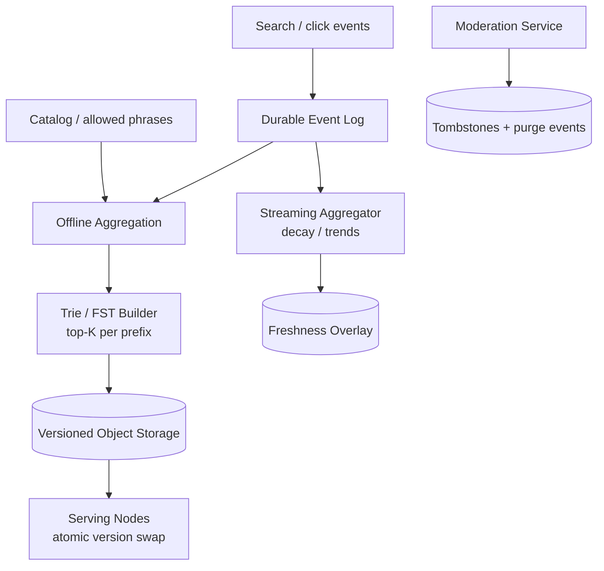
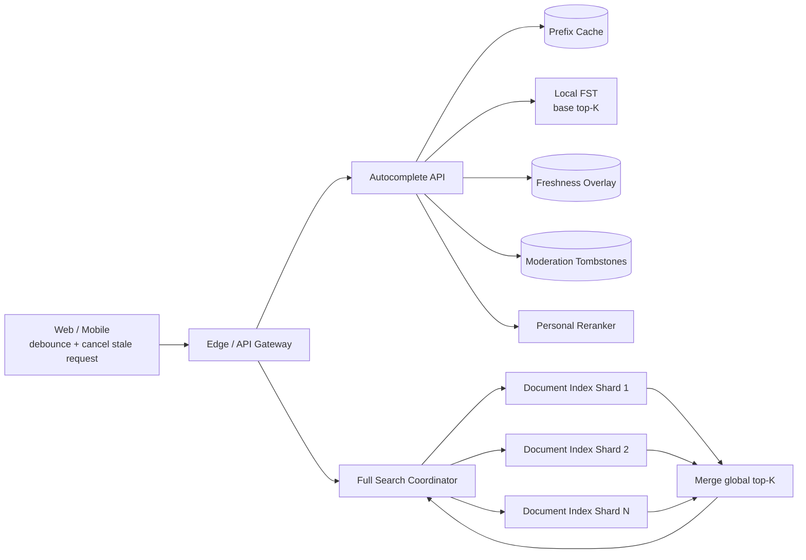

# Search / Autocomplete Service

## Содержание

- [Что проверяет задача](#что-проверяет-задача)
- [Фаза 1: уточнение требований](#фаза-1-уточнение-требований)
- [Фаза 2: оценка нагрузки](#фаза-2-оценка-нагрузки)
- [Ключевая модель](#ключевая-модель)
- [Фаза 3: высокоуровневый дизайн](#фаза-3-высокоуровневый-дизайн)
- [Фаза 4: deep dive](#фаза-4-deep-dive)
- [Сквозные потоки](#сквозные-потоки)
- [Отказы и пограничные случаи](#отказы-и-пограничные-случаи)
- [Трейдоффы](#трейдоффы)
- [Фаза 5: финал](#фаза-5-финал)
- [Interview-ready answer](#interview-ready-answer)
- [Связанные материалы](#связанные-материалы)

Практический разбор поисковых подсказок. Autocomplete отвечает после каждой
напечатанной буквы и возвращает небольшой заранее рассчитанный top-K. Полный
поиск запускается после выбора подсказки или отправки запроса и ищет документы;
это другой workload и другой индекс.

---

## Что проверяет задача

| Признак | Архитектурный ход | Цена |
| --- | --- | --- |
| Запрос приходит на каждую букву | Низкая latency, debounce и многоуровневый cache | Результат может немного отставать |
| Нужны лучшие K продолжений prefix | Trie или FST с top-K в узлах | Индекс строится заранее |
| Популярность меняется быстрее snapshot | Маленький streaming overlay | Merge усложняет read-path |
| Опечатки расширяют множество кандидатов | Отдельный bounded fuzzy path | Выше CPU и latency |
| Короткие prefixes очень горячие | Репликация и отдельный hot-prefix cache | Не всё решается шардированием |
| Запрещённая подсказка должна исчезнуть быстро | Serving-time tombstone + cache purge | Дополнительная проверка каждого ответа |

Ключевое различие: autocomplete ищет фразы по prefix, а full search ищет документы
по термам и фильтрам. Попытка обслуживать оба сценария одним API и одним способом
шардирования обычно скрывает важные trade-offs.

---

## Фаза 1: уточнение требований

### Что спросить

```text
1. Подсказываем популярные запросы, товары или оба типа?
2. Сколько результатов нужно вернуть и с какой минимальной длины prefix?
3. Нужны ли typo tolerance и transliteration?
4. Насколько быстро новая популярная фраза должна попасть в top-K?
5. Нужна ли персонализация и можно ли использовать историю пользователя?
6. Есть ли locale, market, age restrictions и moderation?
7. Как быстро обязаны исчезать удалённые и запрещённые подсказки?
8. Проектируем только autocomplete или также полный поиск документов?
```

### Зафиксированный scope

- Подсказываем до 10 поисковых фраз по введённому prefix.
- Минимальная длина prefix — 2 нормализованных символа.
- Учитываем locale и market; нормализуем регистр, пробелы и Unicode.
- Базовая популярность пересобирается каждый час.
- Потоковый overlay отражает тренды с задержкой до одной минуты.
- Для prefix длиной от 3 символов запускаем bounded typo fallback, только если
  exact path не набрал достаточно результатов.
- Персонализация выполняется как лёгкий rerank общего candidate set; общие cache
  entries не содержат `user_id`.
- Moderation и legal removal должны скрывать фразу не позднее одной минуты.
- В конце отдельно показываем границу с full search, но не проектируем crawler,
  document ingestion и сложный ML-ranking.

### Нефункциональные требования

```text
autocomplete exact:        p99 < 50 мс
autocomplete typo fallback: p99 < 100 мс
full search:               p99 < 300 мс
availability:              99.99%
freshness trends:          < 1 минуты
freshness base snapshot:   < 1 часа
```

При недоступности personalization сервис возвращает общий top-K. При сомнении в
актуальности moderation он отфильтровывает спорный candidate, а не показывает
его ради availability.

---

## Фаза 2: оценка нагрузки

Числа в условии отсутствуют. Зафиксируем учебные допущения:

```text
DAU:                                  100 млн
поисковых сессий на DAU:              20 в день
autocomplete requests на сессию:      5 после client debounce
full search requests на сессию:       1
число candidate phrases:              100 млн
active phrases после policy/pruning:   20 млн
средний исходный candidate record:    80 B
autocomplete response:                около 1 KB
analytics event:                      около 32 B
```

### Autocomplete RPS

```text
100 млн × 20 × 5 = 10 млрд requests/день
10 млрд / 86 400 ≈ 115 741 requests/с в среднем
согласованный пик ×5 ≈ 579 000 requests/с

При 80% cache hit ratio обращение к FST требуется для:
  579 000 × 20% ≈ 115 800 requests/с в пик
```

Все запросы всё равно проходят через API и актуальные policy-слои. Hit ratio
означает, что только 20% запросов читают FST: cache хранит base candidates, но не
финальный персонализированный ответ.

Пять запросов на сессию уже предполагают debounce на клиенте. Без него десять
нажатий могли бы дать десять запросов, и backend пришлось бы масштабировать
ошибку клиента.

### Full search RPS

```text
100 млн × 20 = 2 млрд searches/день
2 млрд / 86 400 ≈ 23 148 searches/с в среднем
согласованный пик ×5 ≈ 115 700 searches/с
```

Autocomplete получает примерно в пять раз больше запросов, но каждый из них
должен читать готовый top-K, а не выполнять полноценный document ranking.

### Индекс и сеть

```text
Исходные candidate records:
  100 млн × 80 B = 8 GB сырого payload

Допустим, после quality/policy pruning остаётся 20 млн active phrases, а
benchmark конкретного FST/top-K artifact показывает:
  12 GB resident memory на одну полную serving-копию

Пиковый клиентский egress autocomplete:
  579 000 × 1 KB ≈ 579 MB/с ≈ 4,63 Gbit/s
```

`12 GB` — помеченное допущение по результату будущего benchmark, а не свойство
любого FST. Если полная копия помещается в память узла, репликация индекса проще
prefix-sharding и устраняет межшардовый запрос.

### Analytics events

```text
10 млрд requests/день × 32 B = 320 GB/день сырого payload
```

Логировать каждую клавишу синхронно в OLTP-базу нельзя. События отправляются
асинхронно, чувствительные данные очищаются, а для обучения может применяться
sampling. Для popularity важнее выбранный запрос и успешное действие, чем каждый
промежуточный prefix.

---

## Ключевая модель

### Candidate и top-K prefix

```text
Suggestion candidate:
  suggestion_id
  display_text
  normalized_text
  locale, market
  status = ACTIVE | BLOCKED | DELETED
  base_score

Prefix entry:
  normalized_prefix
  top_candidates[(suggestion_id, base_score)]
  artifact_version
```

Вместо обхода всех фраз `LIKE 'iph%'` serving index сразу хранит лучшие
продолжения для prefix:

```text
"ip"  -> [iphone, ipad, ip camera, ...]
"iph" -> [iphone, iphone 16, iphone case, ...]
```

Trie хранит символы в явных узлах. Finite State Transducer (FST) — компактное
представление общих prefix/suffix-путей; на интервью достаточно сказать, что это
неизменяемый memory-mapped artifact с предрассчитанным top-K.

### Итоговый score — merge нескольких сигналов

```text
final_score = base_popularity
            + freshness_overlay
            + context_score(locale, market)
            + personal_rerank
```

Не нужно переписывать большой FST после каждого клика. Hourly snapshot даёт
устойчивую базу, потоковый overlay добавляет небольшой top-K трендов, а
персонализация меняет порядок уже выбранных кандидатов.

---

## Фаза 3: высокоуровневый дизайн

### Построение и обновление индекса



Builder публикует неизменяемую версию только после validation. Serving node
скачивает artifact, проверяет checksum, прогревает его и атомарно меняет ссылку;
текущие запросы завершаются на старой версии.
`Catalog / allowed phrases` здесь означает durable-проекцию каталога вместе с
актуальной moderation policy: следующий build читает уже отфильтрованный набор.
Tombstone остаётся отдельным быстрым путём для немедленного удаления между
сборками.

### Autocomplete и полный поиск



Autocomplete обычно делает локальный lookup полной FST-копии. Full Search
рассылает запрос по document shards, получает локальные top-K и сливает их в
глобальный ranking. Эти пути могут использовать общий Gateway, но не общий
индекс и не одинаковый latency budget.

### Роль компонентов

| Компонент | Ответственность |
| --- | --- |
| Offline Aggregation | Считает устойчивую popularity из окна событий |
| Trie/FST Builder | Создаёт версионированный top-K artifact |
| Serving Node | Держит read-only artifact локально и обслуживает lookup |
| Prefix Cache | Хранит base candidates и поглощает lookup горячих prefixes |
| Streaming Aggregator | Считает небольшой freshness/trend overlay |
| Tombstone Store | Немедленно скрывает blocked/deleted кандидатов |
| Personal Reranker | Переставляет общий candidate set для пользователя |
| Full Search Coordinator | Делает scatter-gather и сливает document top-K |

---

## Фаза 4: deep dive

### 4.1 API и нормализация

```text
GET /v1/autocomplete?q=iph&locale=ru-RU&market=GE&limit=10
  -> {artifact_version, suggestions:[...]}

GET /v1/search?q=iphone&filters=...&cursor=...
  -> {hits:[...], next_cursor}
```

Клиент ждёт 100–150 ms после последней клавиши, отменяет предыдущий запрос и
игнорирует ответ, если его `query_id` уже устарел. Backend ограничивает длину
строки и нормализует её одинаково при build и serve:

- Unicode normalization;
- приведение регистра с учётом locale;
- схлопывание пробелов;
- допустимая продуктом работа с диакритикой и transliteration.

Несовпадение normalization version между builder и serving превращает
существующие подсказки в невидимые, поэтому версия входит в artifact metadata.

### 4.2 Offline top-K и атомарная публикация

Builder не берёт простой счётчик «сколько раз запросили». Score учитывает окно
времени, decay, уникальных пользователей и сигналы качества, иначе бот быстро
поднимет вредную фразу.

```text
events -> aggregate -> policy filters -> score -> top-K per prefix
       -> validate coverage/size -> upload version V43 -> publish manifest V43
```

Serving node продолжает использовать `V42`, пока полностью не загрузит и не
проверит `V43`. Manifest переключается только после canary. При плохом качестве
rollback — это возврат указателя на прежний immutable artifact.

### 4.3 Freshness overlay

Streaming Aggregator считает короткие временные buckets, применяет decay и
хранит только небольшой top-K для затронутых prefixes. Serving path получает,
например, 20 кандидатов из FST и 20 из overlay, дедуплицирует и пересчитывает
итоговый порядок.

Overlay не становится второй полной поисковой базой. Его размер ограничен,
записи имеют TTL, а следующий offline snapshot поглощает устойчивые тренды. При
отказе overlay система деградирует к часовому base snapshot, сохраняя latency и
availability.

### 4.4 Cache key и персонализация

Безопасный общий ключ включает все параметры, влияющие на общий ответ:

```text
autocomplete:{artifact_version}:{normalization_version}:
             {locale}:{market}:{safe_mode}:{normalized_prefix}
```

Если забыть `market` или `safe_mode`, пользователь увидит запрещённый для его
контекста результат. `user_id` не добавляем в общий cache: это разрушило бы hit
ratio и смешало бы privacy с shared data. Персональный rerank применяется после
получения общего candidate set; при его timeout порядок остаётся общим.

Кешируется только base candidate set из FST. На каждом запросе поверх него
накладываются текущие freshness overlay и moderation tombstones, затем выполняется
персональный rerank. Поэтому base-cache можно версионировать по artifact version
и держать дольше минуты, не нарушая SLA трендов и удаления. Targeted purge всё
равно ускоряет удаление кандидата и освобождает место.

### 4.5 Typo tolerance с ограниченным бюджетом

Fuzzy search нельзя запускать безусловно на каждую букву. Применяем последовательность:

1. Ищем exact prefix в FST.
2. Если найдено K хороших результатов, возвращаем их.
3. Если prefix имеет хотя бы 3 символа и результатов мало, запускаем typo path с
   ограничением edit distance, числа кандидатов и CPU deadline.
4. При timeout возвращаем неполный exact result, а не задерживаем весь запрос.

Для частых ошибок можно заранее хранить aliases. Для длинного хвоста typo path
использует n-gram/delete index или ограниченный обход автомата. Конкретный
алгоритм выбирается benchmark по языкам: морфология и раскладка клавиатуры меняют
качество сильнее, чем название структуры данных.

### 4.6 Почему prefix трудно шардировать

Hash-sharding candidate phrases по `suggestion_id` равномерно распределяет
данные, но все shards могут содержать продолжения `iph`. Тогда каждый
autocomplete становится scatter-gather, а координатор сливает N локальных top-K.

Range-sharding по prefix направляет запрос в один shard, но prefixes распределены
неравномерно: `a`, `s` или популярный бренд образуют hot shard. Смена диапазонов
также требует пересборки маршрутизации.

Порядок решений:

1. Если измеренный artifact помещается в RAM, реплицируем полную FST на каждый
   serving node.
2. Горячие короткие prefixes держим в отдельном replicated cache.
3. Если полная копия больше разумной памяти, делим длинные prefixes по диапазонам
   и реплицируем самые горячие диапазоны независимо.
4. Scatter-gather оставляем крайней альтернативой для autocomplete, потому что
   его p99 зависит от самого медленного shard.

### 4.7 Autocomplete и full search

| Свойство | Autocomplete | Full search |
| --- | --- | --- |
| Ищет | Лучшие фразы-продолжения | Подходящие документы |
| Основной индекс | Trie/FST top-K | Inverted index |
| Запрос к shard | Желательно один local lookup | Scatter-gather допустим |
| Ranking | Popularity, freshness, context | Text relevance, filters, business/ML signals |
| Latency | Десятки миллисекунд | Сотни миллисекунд |
| Результат | Около 10 коротких строк | Страница документов |

Document index удобно hash-шардировать по `document_id`: каждый shard вычисляет
локальный top-K, coordinator собирает кандидатов и пересчитывает глобальный
ranking. Для autocomplete тот же подход умножил бы каждый keystroke на число
shards, поэтому сначала выбираем компактный replicated index.

### 4.8 Moderation и удаление

Hourly rebuild недостаточно быстр для legal removal. Moderation Service
публикует tombstone по `suggestion_id`; serving nodes применяют его до возврата
ответа и удаляют затронутые cache entries. Следующий artifact уже не содержит
кандидата.

Tombstone хранится дольше максимального времени жизни старого artifact. Иначе
отставший node может загрузить прежнюю версию и снова показать запрещённую фразу.
Метрика `oldest_active_artifact_version` позволяет понять, когда tombstone можно
безопасно удалить.

---

## Сквозные потоки

### 1. Обычный autocomplete

1. Клиент после debounce отправляет нормализуемый prefix и `query_id`.
2. API получает base candidates из общего cache, а на miss читает local FST.
3. API добавляет текущий overlay, применяет tombstones и personal rerank.
4. Клиент применяет ответ только если `query_id` всё ещё актуален.

### 2. Новый тренд

1. Выборы и успешные search actions поступают в durable log.
2. Streaming Aggregator видит рост, обновляет top-K нужных prefixes.
3. Serving merge показывает тренд в течение минуты.
4. Hourly build позже переносит устойчивый сигнал в base artifact.

### 3. Удаление подсказки

1. Moderation публикует tombstone и purge event.
2. Serving nodes перестают возвращать `suggestion_id`, даже имея старый FST.
3. Cache очищается, следующий offline artifact исключает фразу окончательно.

### 4. Полный поиск

1. Клиент выбирает подсказку и отправляет search request.
2. Coordinator рассылает запрос по document index shards.
3. Каждый shard возвращает local top-K с ranking features.
4. Coordinator сливает кандидатов и возвращает страницу документов.

---

## Отказы и пограничные случаи

| Сбой | Поведение |
| --- | --- |
| Новый artifact повреждён | Checksum/validation не дают переключиться; node остаётся на прошлой версии |
| Часть fleet на старой версии | Версия видна в ответе и метриках; tombstones защищают removal |
| Freshness overlay недоступен | Возвращается base top-K с меньшей свежестью |
| Personal service timeout | Возвращается неперсонализированный порядок |
| Typo path не уложился в deadline | Возвращается exact result, возможно меньше K элементов |
| Cache содержит удалённую фразу | Tombstone фильтрует её после cache lookup; purge ускоряет очистку |
| Один full-search shard недоступен | Ответ помечается partial или запрос падает согласно продуктовой политике |
| Очень горячий prefix | Edge/local cache и реплики serving artifact поглощают hotspot |
| Клиент получил ответы не по порядку | `query_id` не даёт старому ответу заменить новый prefix |

---

## Трейдоффы

| Решение | Плюс | Минус |
| --- | --- | --- |
| Полностью replicated FST | Один локальный lookup без scatter-gather | RAM умножается на число serving nodes |
| Hourly immutable snapshot | Простые rollout и rollback | Базовая popularity отстаёт |
| Streaming overlay | Тренды появляются быстро | Merge и контроль размера усложняют путь |
| Shared prefix cache | Высокий hit ratio на коротких prefixes | Cache key обязан учитывать policy context |
| Personal rerank после cache | Не разрушает общий cache | Персонализация ограничена candidate set |
| Bounded typo fallback | Контролируемый p99 | Иногда возвращается неполный exact result |
| Serving-time tombstone | Быстрое удаление из старых artifacts | Нужны purge и lifecycle tombstones |

---

## Фаза 5: финал

### Двухминутное резюме

> Autocomplete я отделяю от полного поиска. Для подсказок offline pipeline каждый
> час строит immutable Trie/FST с готовым top-K для каждого prefix. При нашем
> допущении artifact занимает 12 GB resident memory, поэтому его проще полностью
> реплицировать на serving nodes и выполнять один local lookup, чем делать
> scatter-gather на каждую букву. Горячие prefixes дополнительно поглощает cache.
> Streaming overlay добавляет минутную freshness, затем base и overlay
> дедуплицируются и ранжируются вместе. Персонализация применяется только после
> общего cache, а moderation tombstones фильтруют удалённые фразы даже на старой
> версии индекса.
>
> Exact prefix обслуживается первым. Ограниченный typo path запускается только
> при нехватке результатов и имеет собственный CPU deadline. Full search — другой
> путь: document index hash-шардирован, каждый shard считает локальный top-K, а
> coordinator делает scatter-gather и глобальный merge. Так autocomplete сохраняет
> p99 до 50–100 ms, а полный поиск получает более дорогой ranking в своём бюджете.

### За пределами scope и рост ×10

За scope остаются crawler, document ingestion, semantic/vector search, сложный
learning-to-rank и рекламные позиции. При росте ×10 сначала проверяем client
debounce и edge hit ratio, затем увеличиваем число полных FST-реплик. Если
artifact перестаёт помещаться в память, вводим range-shards для длинных prefixes,
но самые горячие короткие prefixes оставляем реплицированными.

---

## Interview-ready answer

**1. Почему не выполнять SQL `LIKE 'prefix%'` на каждую букву?**

- Нагрузка — один search session порождает несколько autocomplete requests.
- Решение — immutable Trie/FST заранее хранит top-K продолжений prefix.
- Результат — serving path делает ограниченный lookup вместо сортировки большого диапазона.

**2. Как одновременно получить стабильность и свежие тренды?**

- База — hourly artifact содержит устойчивую popularity и легко откатывается по версии.
- Свежесть — streaming overlay хранит небольшой top-K с временным decay.
- Merge — serving node объединяет кандидатов, а следующий build поглощает устойчивый тренд.

**3. Почему в этом дизайне выбираем полную FST-копию вместо prefix-sharding?**

- Условие — измеренный artifact должен помещаться в память serving node.
- Плюс — каждый запрос обслуживается локально и не зависит от самого медленного shard.
- Цена — память умножается на число реплик; при росте нужны range-shards и репликация hotspots.

**4. Как не разрушить cache персонализацией?**

- Общий cache — ключ включает prefix, locale, market, safe mode и версии, но не `user_id`.
- Персонализация — применяется как rerank общего candidate set после cache lookup.
- Деградация — при timeout возвращается общий порядок.

**5. Как поддержать опечатки и не испортить p99?**

- Первый путь — всегда дешёвый exact prefix.
- Fallback — fuzzy lookup запускается только для prefix от трёх символов и при нехватке результатов.
- Ограничение — edit distance, число кандидатов и CPU deadline имеют жёсткий бюджет.

**6. Как быстро убрать запрещённую подсказку?**

- Немедленный слой — moderation tombstone фильтрует candidate на serving path.
- Cache — purge ускоряет удаление уже рассчитанных ответов.
- Постоянный слой — следующий artifact не содержит фразу, а tombstone живёт дольше старых версий.

**7. Чем autocomplete отличается от full search?**

- Autocomplete — возвращает top-K фраз из prefix index за десятки миллисекунд.
- Full search — ищет документы в inverted index и применяет фильтры и ranking.
- Шардирование — full search допускает scatter-gather, autocomplete старается сделать один local lookup.

---

## Связанные материалы

- [Как проходить System Design Interview](./00-how-to-approach.md)
- [Elasticsearch и OpenSearch](../../06-databases/database-systems-catalog/09-elasticsearch-and-opensearch.md)
- [Redis как cache](../../06-databases/caching/01-redis-as-cache.md)
- [Kafka](../../07-message-brokers-and-streaming/01-kafka.md)
- [Backpressure и shedding](../reliability-patterns/05-backpressure-and-shedding.md)
- [Read-heavy запрос с CDN и кешем](../external-request-flows/02-read-heavy-request-with-cdn-and-cache.md)
