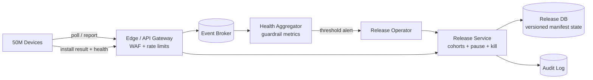
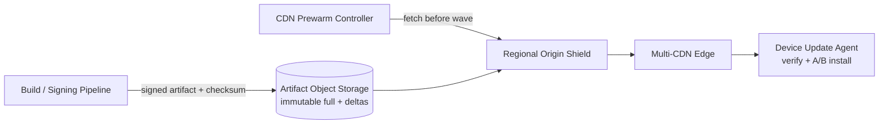

# Emergency App Rollout: 50 млн устройств за 6 часов

## Содержание

- [Что проверяет задача](#что-проверяет-задача)
- [Фаза 1: уточнение требований](#фаза-1-уточнение-требований)
- [Фаза 2: оценка нагрузки](#фаза-2-оценка-нагрузки)
- [Фаза 3: высокоуровневый дизайн](#фаза-3-высокоуровневый-дизайн)
- [Фаза 4: deep dive](#фаза-4-deep-dive)
- [Сквозные потоки](#сквозные-потоки)
- [Отказы и деградация](#отказы-и-деградация)
- [Трейдоффы](#трейдоффы)
- [Фаза 5: финал](#фаза-5-финал)
- [Interview-ready answer](#interview-ready-answer)
- [Связанные материалы](#связанные-материалы)

Практический drill: нужно безопасно доставить критическое обновление на 50 млн
устройств не позднее чем за 6 часов. Здесь важны не только CDN и bandwidth, но и
управление волнами, защита origin, проверяемая установка и возможность остановить
плохой релиз быстрее, чем он распространится на весь парк.

---

## Что проверяет задача

У задачи два независимых потока:

- **control plane** решает, кому, когда и какую версию можно устанавливать;
- **data plane** доставляет большой immutable artifact через CDN.

Если смешать их, запрос статуса релиза начнёт конкурировать с сотнями гигабит
скачиваний. Если выдать всем устройствам один URL без управления cohort, ошибка
в бинарнике за несколько минут получит глобальный blast radius.

---

## Фаза 1: уточнение требований

### Что спросить

```text
- Размер полного artifact и delta update?
- Устройства постоянно online или часть проснётся позже?
- Есть push-канал или только периодический polling?
- Поддерживают ли устройства A/B installation и rollback?
- Обновление обязательное или пользователь может отложить его?
- Есть ли минимальная версия, ниже которой delta неприменима?
- Какие регионы и CDN-провайдеры уже доступны?
- Что означает «за 6 часов»: download, install или healthy confirmation?
```

### Зафиксированный scope

- 50 млн online-устройств должны успешно установить и подтвердить healthy
  версию в течение 6 часов.
- Полный artifact — 200 MB, типичный delta artifact — 20 MB.
- Устройства проверяют цифровую подпись и checksum до установки.
- Поддерживаются staged cohorts, regional throttling, pause, kill switch и
  откат на предыдущий A/B slot.
- Push ускоряет обнаружение релиза, но source of truth — pull-запрос manifest.
- Уже скачанный, но не начавший установку клиент обязан повторно проверить
  состояние release перед install.

Вне scope: разработка самого патча, магазины мобильных приложений, юридические
ограничения принудительного обновления и устройства, которые offline все 6 часов.

### Нефункциональные требования

```text
deadline healthy confirmation: 6 часов
availability control plane:     99,99%
artifact integrity:             только подписанный artifact с верным checksum
rollback decision:              < 5 минут после превышения safety threshold
origin protection:              CDN miss storm не должен положить storage
```

---

## Фаза 2: оценка нагрузки

### Минимальный темп завершений

```text
50 000 000 / (6 × 3 600)
  ≈ 2 315 успешных install/с в среднем
```

Это нижняя граница, а не требуемый RPS API: устройства обновляются неравномерно,
часть повторяет запросы, а первые волны специально маленькие. Capacity data plane
закладываем минимум с 30% запасом к требуемому среднему и проверяем региональные
пики отдельно.

### Full update против delta

Полная доставка:

```text
50 млн × 200 MB = 10 PB payload
10 PB × 8 / 21 600 секунд ≈ 3,70 Tbps в среднем
с запасом 30% ≈ 4,81 Tbps CDN capacity
```

Delta-доставка:

```text
50 млн × 20 MB = 1 PB payload
1 PB × 8 / 21 600 секунд ≈ 370 Gbps в среднем
с запасом 30% ≈ 481 Gbps CDN capacity
```

Delta уменьшает egress в десять раз, но не заменяет full artifact: часть
устройств имеет неизвестную базовую версию или не сможет применить patch.

### Control-plane polling

Если все устройства проверяют manifest раз в 15 минут:

```text
50 млн / 900 секунд ≈ 55 600 checks/с в среднем
```

Без случайного смещения таймеров 50 млн клиентов создадут периодический spike.
Клиент сохраняет назначенный server-side `next_check_at` и добавляет jitter;
push лишь просит сделать раннюю проверку.

### Origin egress

При измеренном CDN byte hit ratio 99% для delta artifact:

```text
370 Gbps × 1% ≈ 3,7 Gbps от shield/origin в среднем
```

На старте нового immutable URL hit ratio равен нулю, поэтому перед открытием
волны artifact prewarm-ится в regional shields. Одного среднего `99%` недостаточно:
нужно отдельно нагрузочно проверить cold-start и потерю shield-region.

### Стоимость

Стоимость зависит от контрактов, поэтому на интервью лучше дать формулу. Например,
при **учебном допущении** `$0,02/GB` только за egress:

```text
full:  10 000 000 GB × $0,02 ≈ $200 000
delta:  1 000 000 GB × $0,02 ≈  $20 000
```

Это не рыночная котировка и не включает multi-CDN, requests, origin transfer и
налоги. Вывод устойчив без точной цены: delta экономит примерно порядок байтов.

---

## Фаза 3: высокоуровневый дизайн

### Control plane



### Data plane



### Роль компонентов

**Release Service.**
*Зачем:* хранит state machine релиза, вычисляет cohort по стабильному device hash,
выдаёт manifest и применяет regional rate policy.
*Почему отдельно:* маленькое решение «разрешена ли установка» требует точного
audit, а большие байты должны идти независимо через CDN.

**Release DB.**
*Зачем:* authority версий, обязательных base versions, cohort percentages,
deadline и состояний `DRAFT / ACTIVE / PAUSED / KILLED / COMPLETE`.
*Почему durable:* повтор запроса после failover не должен назначить устройству
другой artifact или забыть kill switch.

**Health Aggregator.**
*Зачем:* считает crash-free devices, boot failure, install error, download error
и latency по версии/региону/model.
*Почему async:* индивидуальная telemetry не блокирует установку; решение о новой
волне использует агрегаты с известной задержкой и минимальным sample size.

**Object Storage.**
*Зачем:* origin для immutable signed artifacts.
*Почему immutable:* один version URL всегда соответствует одному checksum; CDN
не спорит с origin после замены файла.

**Multi-CDN и Origin Shield.**
*Зачем:* edge несёт до сотен Gbps/Tbps, shield схлопывает concurrent misses, а
второй CDN ограничивает blast radius провайдера.
*Почему не один CDN по умолчанию:* emergency deadline нельзя привязывать к одному
глобальному failure domain; долю traffic переключают только после проверки.

**Device Update Agent.**
*Зачем:* делает resumable download, проверяет signature/checksum, повторно читает
manifest перед install, пишет inactive A/B slot и подтверждает healthy boot.
*Почему логика на клиенте:* сервер не может атомарно установить бинарник на
устройство и обязан переживать потерю сети/питания между шагами.

---

## Фаза 4: deep dive

### 1. Release manifest

```json
{
  "release_id": "rel_2026_08_27_1",
  "target_version": "8.14.2",
  "state": "ACTIVE",
  "cohort_percent": 20,
  "not_before": "2026-08-27T12:00:00Z",
  "install_deadline": "2026-08-27T18:00:00Z",
  "full": {"url": "/8.14.2/full.bin", "size": 200000000, "sha256": "..."},
  "deltas": [{"from": "8.14.1", "url": "/8.14.2/from-8.14.1.bin", "sha256": "..."}],
  "signature": "..."
}
```

Manifest также подписан. TLS защищает transport, но подпись позволяет устройству
отклонить подменённый artifact даже при ошибке CDN/configuration. Signing key
находится в изолированном pipeline; Release Service не получает private key.

### 2. Стабильные cohorts

```text
bucket = hash(device_id, release_id) mod 10 000
eligible = bucket < cohort_percent × 100
```

Один device всегда остаётся в своей группе при retry и failover. Волна растёт
монотонно: 1% → 5% → 20% → 50% → 100%. Но проценты — только пример; переход
разрешается guardrail-метриками, а не таймером сам по себе.

Первые cohorts должны включать разные device models, OS versions и регионы.
Случайные 1% глобально могут не содержать редкую, но критичную модель.

### 3. План на шесть часов

Один возможный operating plan:

```text
T-30 мин: artifact в origin, signature/checksum verified, shield prewarm
0–15 мин: internal/canary устройства, проверка boot и rollback
15–30:    1% репрезентативного парка
30–60:    5%
60–120:   20%
120–210:  50%
210–360:  100%, региональный catch-up до deadline
```

Этот план не гарантирует deadline сам по себе. После каждой волны Scheduler
пересчитывает необходимый темп:

```text
required_rate = remaining_devices / remaining_seconds
```

Если требуемый темп превышает подтверждённую CDN/device capacity, оператор узнаёт
об этом до последнего часа и может сократить observation window только после
явного принятия риска.

### 4. Regional throttling и backpressure

Release Service не выдаёт всем регионам одинаковую скорость. Для каждого
`region + ISP + device_family` есть target starts/s и максимум concurrent
downloads. Edge применяет token bucket и возвращает `next_check_at`, а не просит
клиента немедленно retry.

Сигналы снижения темпа:

- CDN 5xx и origin latency;
- install/boot failures;
- ISP saturation и клиентские timeouts;
- перегрев/разряд батареи определённой модели;
- telemetry lag, из-за которого новая волна стала слепой.

### 5. Retry без retry storm

Клиент использует resumable range requests и сохраняет полученные chunks. После
ошибки — exponential backoff с full jitter и server-provided `Retry-After`.

```text
delay = random(0, min(cap, base × 2^attempt))
```

Retry budget ограничивает число повторов на одно устройство и долю retry traffic
в регионе. Иначе 1% сетевых ошибок поверх 50 млн клиентов способен стать
самостоятельной атакой на control plane.

### 6. Kill switch и rollback

`PAUSED` запрещает новые установки, но позволяет анализировать ситуацию.
`KILLED` также запрещает выдачу target manifest. Устройство повторно проверяет
state после download и до изменения boot slot — иначе уже скачавшие клиенты
продолжат плохую установку после kill.

Rollback безопасен только при совместимости данных:

- новая версия пишет backward-compatible schema;
- миграции выполняются expand → migrate → contract;
- предыдущий A/B slot не стирается до healthy confirmation;
- bootloader откатывается после нескольких failed health checks.

Если новая версия необратимо преобразовала локальные данные, «вернуть старый
бинарник» уже не является рабочей стратегией. Это проверяют до релиза.

### 7. Что считать успехом

`download_complete` недостаточно. Устройство проходит состояния:

```text
ELIGIBLE → DOWNLOADING → VERIFIED → INSTALLING → BOOTED → HEALTHY
                  │             │          │
                  └─────────────┴──────────┴→ FAILED / ROLLED_BACK
```

Deadline считается по `HEALTHY`. Событие идемпотентно по
`device_id + release_id + state_version`; повторная telemetry не увеличивает
счётчик дважды.

---

## Сквозные потоки

**1. Подготовка.** Pipeline подписывает full/delta artifacts → storage фиксирует
immutable objects → CDN shields prewarm → оператор активирует canary.
*Итог:* первая пользовательская волна не создаёт cold-origin storm.

**2. Назначение.** Push будит устройство → устройство читает manifest → Release
Service проверяет stable cohort и региональный budget → возвращает artifact и
`next_check_at`.
*Итог:* push не является authority, retry получает то же решение.

**3. Установка.** Устройство докачивает artifact → проверяет signature/checksum →
повторно проверяет release state → устанавливает в inactive slot → boot health
подтверждает успех.
*Итог:* повреждённый или остановленный релиз не становится активным.

**4. Автоматическая пауза.** Telemetry попадает в broker → агрегатор замечает
рост boot failures выше guardrail → alert/automation переводит release в
`PAUSED` → новые установки прекращаются.
*Итог:* blast radius ограничен текущей волной и уже начавшими install клиентами.

---

## Отказы и деградация

| Сбой | Поведение |
| --- | --- |
| Push недоступен | Jittered polling всё равно обнаружит релиз |
| Release Service недоступен | Новая установка fail closed; текущий resumable download может продолжиться |
| Один CDN деградировал | Traffic director постепенно переводит регион на второй CDN |
| CDN cold cache | Shield coalescing, prewarm и origin rate limit защищают storage |
| Сеть оборвалась | Range resume без повторной загрузки уже полученных chunks |
| Питание пропало при install | Запись в inactive slot; bootloader оставляет предыдущую рабочую версию |
| Telemetry отстаёт | Следующая волна не расширяется: без наблюдаемости rollout fail closed |
| Kill switch включён после download | Повторная manifest-проверка запрещает install |

---

## Трейдоффы

| Выбор | Альтернатива | Причина |
| --- | --- | --- |
| Delta + full fallback | Только full artifact | В десять раз меньше трафика для типичного клиента |
| Pull authority + push hint | Только push | Retry, offline wake-up и единое состояние релиза |
| Stable hash cohorts | Случайный выбор на каждый poll | Устройство не прыгает между волнами |
| Immutable artifact URLs | Перезапись `/latest.bin` | Проверяемый checksum и безопасный CDN cache |
| Multi-CDN | Один CDN | Меньше глобальный provider blast radius, выше стоимость и сложность |
| A/B installation | In-place overwrite | Восстановление после power loss и boot failure |
| Fail closed без telemetry | Продолжать по расписанию | Не расширять неизвестный blast radius |

---

## Фаза 5: финал

### Двухминутное резюме

> Я разделяю rollout control plane и artifact data plane. Для 50 млн устройств
> за 6 часов нужно минимум 2 315 healthy installations/с. Полный artifact 200 MB
> означает 10 PB и 3,7 Tbps среднего payload, а delta 20 MB — 1 PB и 370 Gbps,
> поэтому основным путём будет delta с full fallback.
>
> Release Service выдаёт подписанный manifest по стабильному device cohort,
> региональному budget и состоянию ACTIVE/PAUSED/KILLED. Push только будит клиент;
> точное решение приходит через pull. Artifact immutable, заранее прогревается в
> CDN shields и скачивается resumable range requests с jitter и retry budget.
>
> Устройство проверяет signature/checksum, повторно читает kill switch перед
> install, пишет inactive A/B slot и считает успехом только healthy boot.
> Расширение 1% → 5% → 20% → 50% → 100% разрешают crash/install guardrails и
> достаточный sample size. При слепой telemetry следующая волна не запускается.

### Что добавить при росте ×10

- Hierarchical manifests на edge уменьшают чтения центральной Release DB.
- ISP-aware peer delivery возможно только с отдельной threat model и контролем
  утечки artifact.
- Больше CDN-провайдеров не заменяют независимые origins и restore drill.
- Deadline planner автоматически сравнивает remaining rate с доступной capacity.

---

## Interview-ready answer

**1. Почему 2 315 устройств/с недостаточно для capacity?**

- Это средний required completion rate без первых маленьких волн и retry.
- Data plane определяется байтами: 370 Gbps для delta или 3,7 Tbps для full.
- Control plane отдельно получает около 55,6K polls/s при интервале 15 минут.

**2. Как избежать одновременного старта 50 млн клиентов?**

- Stable hash cohorts ограничивают долю eligible устройств.
- Региональный token bucket ограничивает starts/s.
- `next_check_at`, jitter и retry budget размывают повторы.

**3. Что делает kill switch действенным?**

- Authority state хранится durable и audit-ится.
- Устройство повторно проверяет state после download и до install.
- A/B slot позволяет откатиться после неуспешного boot.

**4. Почему нужен origin shield?**

- Новый immutable artifact сначала отсутствует на edge.
- Shield схлопывает одновременные misses и защищает object storage.
- Prewarm уменьшает cold-start, но failure test всё равно нужен.

**5. Что означает завершение rollout?**

- Не число скачиваний, а число уникальных `HEALTHY` confirmations.
- События дедуплицируются по device/release/state version.
- Offline всё окно устройства заранее исключены из достижимого denominator.

---

## Связанные материалы

- [CDN deep dive](../../08-networking-and-api/request-lifecycle/08-cdn-deep-dive.md)
- [File upload и background processing](../external-request-flows/05-file-upload-and-background-processing-flow.md)
- [Feature rollouts](../experimentation-and-feature-rollouts/01-experimentation-and-rollout-types.md)
- [Backpressure и load shedding](../reliability-patterns/05-backpressure-and-shedding.md)
- [Retries и jitter](../reliability-patterns/02-retries-and-backoff.md)
- [YouTube / Video Platform](./07-youtube-video-platform.md)
