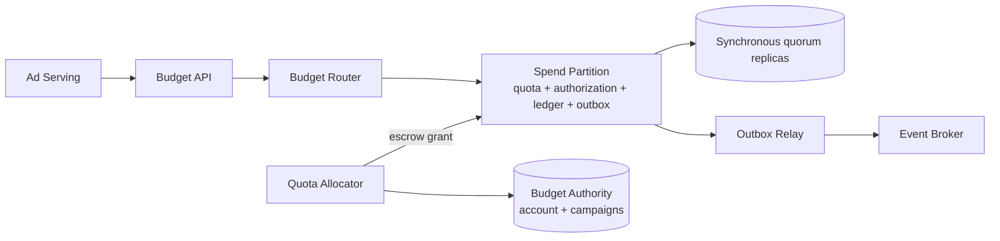
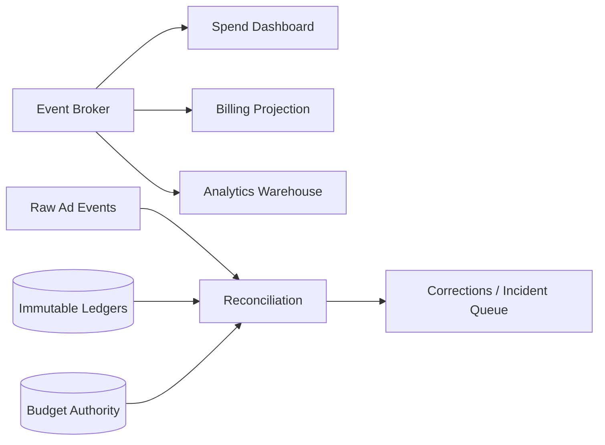

# Ad Budget Service: точное списание рекламного бюджета

## Содержание

- [Фаза 1: уточнение требований](#фаза-1-уточнение-требований)
- [Фаза 2: оценка нагрузки](#фаза-2-оценка-нагрузки)
- [Фаза 3: высокоуровневый дизайн](#фаза-3-высокоуровневый-дизайн)
- [Фаза 4: deep dive](#фаза-4-deep-dive)
- [Сквозные потоки](#сквозные-потоки)
- [Отказы и деградация](#отказы-и-деградация)
- [Наблюдаемость](#наблюдаемость)
- [Трейдоффы](#трейдоффы)
- [Фаза 5: финал](#фаза-5-финал)
- [Interview-ready answer](#interview-ready-answer)
- [Связанные материалы](#связанные-материалы)

Нужно спроектировать сервис, который обрабатывает `1,2 млрд` рекламных списаний
в сутки. На `1%` аккаунтов приходится `60%` трафика, но суммарные списания не
должны превысить дневной бюджет аккаунта и кампании.

Главная сложность не в арифметике `balance - cost`. Если каждый показ блокирует
одну глобальную строку бюджета, горячий рекламодатель останавливает shard. Если
разрешить всем регионам списывать из локального cache, система быстро ответит, но
перерасходует общий лимит. Нужны заранее распределённые права на расходование и
неизменяемый журнал всех денежных переходов.

---

## Фаза 1: уточнение требований

### Что спросить

- Что тарифицируется, известен ли max cost до показа и какие лимиты действуют?
- Как долго живёт hold, что делать с late event, refund и сменой рекламного дня?
- Нужен точный dashboard или точность обязательна только для нового debit?
- Нужна ли локальная запись в нескольких регионах и как деградирует Ad Serving?

### Зафиксированный scope

Чтобы разбор был конечным, фиксируем:

- Платформа тарифицирует показы, для которых auction заранее знает
  `max_cost_micros`.
- Один аккаунт имеет дневной лимит, а каждая кампания — собственный дневной лимит.
- Любое списание должно одновременно помещаться в оба лимита.
- День определяется именованной временной зоной аккаунта; его идентификатор
  записывается как `budget_epoch`.
- Суммы хранятся целыми `micros`: `1 RUB = 1 000 000 micros`. `float64` для денег
  не используется.
- `Authorize`, `Commit` и `Cancel` идемпотентны.
- Authorization живёт не более 15 минут. После deadline событие не списывается
  автоматически и попадает в поток разбирательства.
- Финансовый ledger хранится неизменяемо; исправление — новая компенсирующая
  запись.
- Dashboard и аналитика могут отставать до одной минуты.
- Решение о новом списании всегда точное и не опирается на dashboard или cache.
- Антифрод после закрытия дня создаёт кредит рекламодателю, но не переоткрывает
  старый дневной бюджет.

Три операции имеют разные обещания:

| Операция | Что делает | Точная гарантия |
| --- | --- | --- |
| `Authorize(max_cost)` | Удерживает максимальную стоимость | После успеха сумма защищена за `authorization_id` |
| `Commit(actual_cost)` | Списывает фактическую стоимость | Повтор не создаёт второе списание |
| `Cancel` | Освобождает hold | Повтор не возвращает деньги дважды |

Без `Authorize` запоздалое событие нельзя точно вписать в уже исчерпанный бюджет.
Сервис не принимает финансовое обязательство без заранее выделенного права
расходования.

### Нефункциональные требования

- `p99 < 50 ms` для регионального `Authorize` при наличии локальной quota.
- `p99 < 100 ms` для `Commit` и `Cancel`.
- Доступность API — `99,99%`, но при неопределённости мутация работает
  `fail-closed`.
- Подтверждённое списание не теряется после отказа узла.
- Перерасход аккаунта или кампании не допускается даже при network partition.
- Система горизонтально масштабируется и не направляет все события hot account в
  одну строку.

За scope оставляем auction, ranking, pricing, антифрод-модель, банковский billing и
pacing. Pacing использует приблизительную проекцию и может остановить кампанию
раньше, но финальный budget guard проверяет каждый `Authorize` точно.

---

## Фаза 2: оценка нагрузки

### Базовый поток

Дано `1,2 млрд` успешных списаний, то есть `Commit`, в сутки.

```text
Commit average:
1 200 000 000 / 86 400 = 13 888,9 операций/с
```

Но один commit требует предыдущего authorize. Допустим, это явно отмеченное
предположение, `90%` authorization завершаются списанием, а остальные `10%`
отменяются или истекают.

```text
Authorize/day:
1 200 000 000 / 0,9 = 1 333 333 333

Cancel or expire/day:
1 333 333 333 - 1 200 000 000 = 133 333 333

Exact mutations/day:
1 333 333 333 + 1 200 000 000 + 133 333 333
= 2 666 666 666

Average exact mutations/s:
2 666 666 666 / 86 400 = 30 864,2
```

Для capacity берём предполагаемый пик `×5`, а для накопления — среднее:

```text
Peak exact mutations:
30 864,2 × 5 = 154 321 операций/с
```

Пиковый коэффициент нужно заменить данными production-трафика. Он не выводится из
суточного объёма.

### Что означает skew `1% → 60%`

На горячую группу в пике приходится:

```text
154 321 × 0,60 = 92 593 операций/с

остальные 99% аккаунтов:
154 321 × 0,40 = 61 728 операций/с
```

Skew группы ещё не доказывает, что существует один ключ на `92 593 операций/с`.
Допустим, активно `100 000` рекламных аккаунтов в день. Тогда горячий `1%` — это
`1 000` аккаунтов, а среднее внутри этой группы:

```text
92 593 / 1 000 = 92,6 операций/с на аккаунт
```

Реальное распределение обычно снова неравномерно. Поэтому отдельно зададим
stress-case для самого горячего аккаунта: `5 000 mutations/s`. Это допущение для
проектирования hot-key path, а не следствие `1% → 60%`.

### Хранилище ledger

Допустим, ledger entry занимает `180 B`, индексы добавляют `50%`, replication
factor БД равен `3`, а outbox event занимает `250 B`.

| Величина | Расчёт | Результат |
| --- | --- | ---: |
| Logical ledger/day | `2,667 млрд × 180 B` | `480 GB` |
| Logical ledger/year | `480 GB × 365` | `175,2 TB` |
| 30 days online с индексами и RF=3 | `480 GB × 30 × 1,5 × 3` | `64,8 TB` |
| Broker ingress в пике | `154 321 × 250 B` | `38,6 MB/s` |

Размеры — предположения до измерения реальной схемы; WAL, backups и compaction не
учтены. OLTP держит активный период и idempotency keys, а полная история уходит в
колоночный архив в object storage.

### Оценка числа spend shards

Capacity нельзя брать из названия БД. Для интервью введём проверяемое допущение:
нагрузочный тест полной однооперационной транзакции дал `6 000 mutations/s` на
один shard в рамках latency SLO.

При целевой загрузке `60%`:

```text
Working capacity/shard:
6 000 × 0,60 = 3 600 mutations/s

Required working shards:
ceil(154 321 / 3 600) = ceil(42,87) = 43
```

Округлим до `48` spend shards для более удобного распределения и запаса. Тогда
средняя пиковая нагрузка при равномерном routing:

```text
154 321 / 48 = 3 215 mutations/s на shard

3 215 / 6 000 = 53,6% от benchmark capacity
```

Каждый shard — replicated group в трёх зонах: leader подтверждает запись после
majority commit. При модели «один member на узел» это `48` write leaders и `144`
replica members; в реальном deployment несколько shard members могут жить на
одном DB-узле с ограничением blast radius. Реплики не увеличивают write capacity:
они выполняют ту же запись.

---

## Фаза 3: высокоуровневый дизайн

### Точный online path



Главный request flow читается слева направо: Ad Serving вызывает Budget API,
router выбирает spend partition, а успешный ответ возвращается только после
durable majority commit replicated group. Broker не находится на этом пути.

Quota Allocator — control plane. Spend partition заранее запрашивает порцию
бюджета, поэтому обычный authorize не блокирует глобальную строку аккаунта.

### Асинхронные потребители и сверка



Dashboard, billing projection и analytics читают один поток, но имеют разные SLA
и retention. Reconciliation сверяет их с исходными рекламными событиями,
операционными ledgers и control-plane балансами.

### Роль компонентов

| Компонент | Роль | Не делает |
| --- | --- | --- |
| Budget API | Валидация, authentication, deadline и идемпотентный контракт | Не считает баланс в памяти процесса |
| Budget Router | Выбирает route version и spend partition | Не решает, сколько денег осталось |
| Spend Partition | Транзакционно расходует локальную quota и пишет ledger/outbox | Не выдаёт себе дополнительные деньги |
| Budget Authority | Хранит account/campaign limits и выданные права | Не участвует в каждом показе |
| Quota Allocator | Выдаёт, пополняет и безопасно закрывает escrow leases | Не переиспользует quota исчезнувшего writer без подтверждения |
| Outbox Relay | Публикует committed ledger events с повторами | Не обещает exactly-once delivery |
| Event Broker | Развязывает online path и consumers | Не является source of truth баланса |
| Reconciliation | Ищет пропуски, дубли и расхождения | Не переписывает старые ledger entries |

### Два уровня шардирования

Control plane шардируется по `account_id`. Все лимиты аккаунта и принадлежащих ему
кампаний попадают в один authority shard, поэтому quota grant проверяет оба лимита
одной локальной транзакцией.

Data plane шардируется по виртуальному spend bucket. Для обычного аккаунта в
текущем `budget_epoch` назначается один bucket, для hot account — несколько. Так
денежный authority остаётся единым, а поток списаний распределяется.

---

## Фаза 4: deep dive

### 4.1 Денежные инварианты

Для каждого account budget и campaign budget authority поддерживает:

```text
available + allocated + settled = effective_limit

available >= 0
allocated >= 0
settled >= 0
```

`Available` ещё можно выдать, `allocated` уже зарезервировано leases, а `settled`
подтверждено их отчётами. Пока lease не отчитался, allocated консервативно
покрывает:

```text
local remaining + active holds + settled but not reported
```

Authority может раньше считать бюджет исчерпанным, но не выдать лишнее. Локально:

```text
lease.remaining_micros >= 0

sum(active holds + settled in lease + remaining)
<= lease.granted_micros
```

Проверки выполняются отдельно для account и campaign, а lease выдаётся на минимум
из их available.

### 4.2 API, состояние и локальная транзакция

| API | Ключевые поля | Результат |
| --- | --- | --- |
| `POST /authorizations` | event, account, campaign, epoch, max cost, pricing version | Hold и `authorization_id` |
| `POST /authorizations/{id}/commit` | request ID, actual cost | Единственный terminal debit |
| `POST /authorizations/{id}/cancel` | request ID | Идемпотентное освобождение hold |

Authority хранит account/campaign budgets и quota leases. Spend shard хранит
local leases, текущее состояние authorization, immutable ledger и outbox. На
authorization действует `UNIQUE (account_id, event_id)`; повтор с другим pricing
fingerprint возвращает conflict.

В одной spend-транзакции `Authorize` создаёт idempotency record, условно уменьшает
`lease.remaining` при достаточном остатке и пишет `HELD + ledger + outbox`. Успех
возвращается только после синхронной репликации commit. Недостаток локальной quota
запускает короткую попытку refill, но не разрешает потратить stale dashboard
balance.

`Commit(actual)` переводит только `HELD → SETTLED`, возвращая
`max_cost - actual_cost` в lease. `Cancel` переводит только
`HELD → CANCELLED` и возвращает весь hold. Повтор terminal-операции возвращает
сохранённый результат; actual cost выше hold отклоняется.

### 4.3 Shard key и стабильная маршрутизация

Нельзя шардировать authority только по `campaign_id`: общий account limit тогда
потребует распределённой транзакции между всеми кампаниями. Поэтому authority key
— `account_id`.

Для spend path router использует настройку, неизменяемую внутри budget epoch:

```text
sub_bucket = hash(account_id, event_id) mod bucket_count
virtual_bucket = hash(account_id, sub_bucket) mod V
physical_shard = directory[virtual_bucket]
```

- Для обычного аккаунта `bucket_count = 1`.
- Для заранее обнаруженного hot account можно назначить `8`, `16`, `32` или больше.
- `V`, например `4096`, отделяет логический routing от числа physical shards.
- `route_version` сохраняется в authorization и quota lease.

Одинаковый `event_id` всегда попадает в тот же sub-bucket, поэтому retry встречает
первую запись. Изменять `bucket_count` посреди эпохи без миграционного протокола
нельзя: retry может уйти на другой shard. Плановое изменение применяется со
следующей эпохи; при resharding directory хранит старую route version до конца
retention ключей идемпотентности.

### 4.4 Escrow quota leases для hot accounts

Quota Allocator одной транзакцией уменьшает `available` аккаунта и кампании на
`q`, увеличивает их `allocated` на `q` и создаёт lease для конкретного spend
bucket. Сумма выданных прав никогда не превышает меньший из двух лимитов.

Разберём stress-case `5 000 mutations/s` на одном аккаунте. Допустим, benchmark
показывает среднее удержание одной hot lease row около `5 ms`. Верхняя оценка
последовательной строки:

```text
1 / 0,005 s = 200 mutations/s

working capacity при target utilization 60%:
200 × 0,60 = 120 mutations/s

minimum working buckets:
ceil(5 000 / 120) = ceil(41,67) = 42
```

Берём `64` buckets:

```text
5 000 / 64 = 78,125 mutations/s на lease row
```

Это лишь стартовая конфигурация. `5 ms` — benchmark assumption, а не свойство SQL.
При `10 ms` строка даст теоретические `100/s` и рабочие `60/s`, поэтому потребуется
минимум `ceil(5 000 / 60) = 84`, то есть `128` buckets или single-writer.

Размер quota выбирают по денежному burn rate, refill latency и допустимой сумме
временно stranded budget. Слишком маленькая quota вернёт hotspot в authority,
слишком большая заморозит бюджет на неактивном partition.

### 4.5 Почему lease нельзя переиспользовать только по TTL

Spend process мог потерять сеть, продолжить расходовать локальную quota и не
увидеть, что control plane считает lease истёкшим. Если authority сразу выдаст
тот же остаток другому writer, обе стороны потратят одни деньги.

Authority сначала помечает lease `REVOKING` и повышает fencing token. Partition
перестаёт создавать holds и durable сообщает consumed/remaining с монотонным
`report_seq`. Только подтверждённый remainder возвращается в `available`. Если
partition недоступен, quota остаётся stranded: одного TTL недостаточно для
повторной выдачи денег.

Новая дневная эпоха имеет отдельный лимит и отдельные leases. Поздний commit
старого authorization расходует сохранённый hold старой эпохи и не трогает новый
день.

### 4.6 Single-writer с микропакетами

Для очень горячего аккаунта альтернатива escrow buckets — один логический writer,
который получает все его команды в порядке и объединяет их в короткие batches.
Ответ клиенту отправляется только после durable batch transaction.

Для stress-case:

```text
commands = 5 000/s
batch size = 50

database transactions:
5 000 / 50 = 100 transactions/s
```

Внутри batch writer один раз блокирует balance row, проверяет 50 команд,
bulk-вставляет ledger и обновляет баланс агрегированной суммой. Для этого нужен
отдельный benchmark: batching уменьшает число транзакций, но не отменяет `5 000`
новых ledger rows/s.

Single-writer даёт одну точную сумму и естественный порядок, но требует fencing
при failover, добавляет batch wait и разрушается от backlog. Поэтому escrow —
базовый multi-region путь, а single-writer — режим extreme account, когда десятки
buckets становятся дороже одного владельца.

Уменьшение budget ниже `settled + allocated` также требует drain: новые grants
останавливаются, но ранее подтверждённые holds остаются валидными.

### 4.7 Задержавшиеся события и refunds

До показа Ad Serving получает authorization на максимальную стоимость. Tracker
может доставить billable event позже, но commit использует уже существующий hold.

До deadline выполняется идемпотентный commit hold, duplicate возвращает прежний
результат, а событие после `EXPIRED` уходит в late-event queue без автоматического
debit. Списать любой клик когда угодно и никогда не превысить дневной бюджет
невозможно без заранее удержанного максимума или допуска overdelivery.

Антифрод создаёт `REVERSAL` с ссылкой на исходную entry. В принятом scope reversal
после закрытия эпохи идёт в advertiser credit. Удалять исходный debit нельзя:
иначе аудит перестаёт объяснять, почему раньше dashboard показывал расход.

### 4.8 Reconciliation

Online-транзакция защищает новый debit, а reconciliation обнаруживает ошибки
интеграции и реализации.

Периодическая сверка проверяет:

1. Raw event соответствует не более одному `SETTLED`, у которого есть hold и
   pricing fingerprint.
2. Ledger debits минус reversals совпадают с lease reports, а `report_seq`
   монотонен.
3. Для budget выполняется `available + allocated + settled = effective_limit`.
4. Outbox дошёл до projections, а архив совпадает по контрольным count/hash эпохи.

Расхождение не исправляется прямым `UPDATE amount`. Reconciliation создаёт
correction command с idempotency key, ссылкой на исходную entry и причиной.
Крупное или необъяснимое расхождение останавливает grants затронутого аккаунта и
открывает incident.

---

## Сквозные потоки

### Успешный показ

Auction вычисляет цену `18 000 micros` и максимум `20 000`. Ad Serving вызывает
authorize, router выбирает bucket, а spend transaction уменьшает lease и пишет
hold, ledger и outbox. После durable commit объявление показывается. Позже commit
списывает `18 000`, возвращает `2 000` в lease, а outbox обновляет проекции.

---

## Отказы и деградация

| Сбой | Поведение | Почему нет overspend |
| --- | --- | --- |
| Budget API pod упал | Клиент повторяет запрос с тем же key | Идемпотентность хранится на spend shard, а не в памяти pod |
| Ответ потерян после commit | Retry возвращает прежнюю authorization | Unique key и fingerprint не дают создать второй hold |
| Spend leader упал | Quorum выбирает нового leader; minority fail closed | Успех не возвращался до durable majority commit |
| Budget Authority недоступен | Partitions тратят существующие quotas, refill прекращается | Новые права не создаются локально |
| Регион изолирован | Работает только в пределах уже выданных leases | Сумма leases заранее вычтена из global available |
| Partition с quota исчез | Права остаются stranded | Authority не переиспользует их по одному TTL |
| Broker недоступен | Outbox растёт, online debit продолжает работать до лимита диска | Ledger и outbox уже committed одной транзакцией |
| Dashboard отстаёт | UI показывает timestamp свежести и lag | Dashboard не участвует в authorize |
| Duplicate tracker event | Повторный commit возвращает старый результат | State machine разрешает один terminal debit |
| Commit больше hold | Запрос отклоняется | Нельзя создать долг, не покрытый escrow |
| Clock skew | Deadline проверяется по времени DB/authority и epoch rules | Клиентский timestamp не выдаёт права расходования |
| Reconciliation нашёл расхождение | Grants аккаунта приостанавливаются, создаётся correction/incident | История не переписывается молча |

### Graceful degradation

При исчерпании локальной quota и недоступном authority система:

1. прекращает платные показы затронутой кампании;
2. пробует другую кампанию с валидной quota;
3. показывает organic result или house ad;
4. не использует stale dashboard balance как разрешение;
5. после восстановления пополняет leases и снимает техническую паузу.

Такой порядок уменьшает выручку во время сбоя, но сохраняет финансовый контракт с
рекламодателем.

---

## Наблюдаемость

Ключевые сигналы:

- API latency p50/p95/p99, technical errors, business rejects и idempotent retries;
- replica acknowledgement latency, WAL rate и replication lag;
- нарушения budget invariant, отрицательный lease, duplicate debit attempts и
  reconciliation discrepancy в micros;
- stranded quota, lease/outbox lag и пропуски `report_seq`;
- mutations/s и lock wait по account, bucket и physical shard;
- доля top `1%/0,1%`, hottest account, refill horizon и single-writer backlog.

Алерт только по общему RPS скрывает проблему: средняя загрузка кластера может быть
`40%`, пока один bucket упирается в row lock и нарушает p99.

---

## Трейдоффы

| Решение | Альтернатива | Почему выбрано |
| --- | --- | --- |
| Authorize до показа | Списать только по позднему событию | Только hold даёт точную защиту без overdelivery |
| Micros в integer | `float64` | Детерминированная денежная арифметика |
| Authority по `account_id` | По `campaign_id` | Account limit проверяется локально вместе со всеми кампаниями |
| Spend virtual buckets | Ledger только по account | Hot account распределяется между shards |
| Escrow leases | Global row на каждое событие | Убирает глобальную координацию с hot path |
| Safe stranded quota | Переиздать lease по TTL | Ложное исчерпание дешевле двойного расходования |
| Immutable ledger | Перезаписывать balance history | Аудит, replay и reconciliation |
| Outbox + at-least-once | Dual write в DB и broker | Событие не теряется между commit и publish |
| Eventual dashboard | Fan-out exact read всех leases | Быстрее и дешевле, если freshness явно показана |
| Single-writer для extreme hot | Всегда увеличивать buckets | Microbatch снижает число balance transactions |

---

## Фаза 5: финал

### Двухминутное резюме

> Я разделю систему на Budget Authority и распределённые Spend Partitions.
> Authority шардируется по account_id, хранит лимиты аккаунта и кампаний и выдаёт
> escrow quota leases. Каждая выданная сумма заранее вычитается из global
> available, поэтому несколько регионов не могут вместе превысить бюджет.
>
> Online path — authorize, затем commit или cancel. Spend partition одной durable
> транзакцией меняет локальную quota, authorization, immutable ledger и outbox.
> Идемпотентность хранится по account_id плюс event_id, а детерминированный virtual
> bucket приводит retry на тот же shard.
>
> Из 1,2 млрд финальных списаний при 90% conversion получается около 2,67 млрд
> точных mutations в сутки и 154 тысячи в пике при коэффициенте ×5. На условном
> benchmark 6 тысяч mutations/s и рабочей загрузке 60% нужно минимум 43 spend
> shards; я округлю до 48. Hot account распределяется по нескольким leases. Для
> stress-case 5 тысяч/s, 5 ms на строку и target utilization 60% нужно минимум 42
> buckets; начну с 64, а extreme account переведу на fenced single-writer.
>
> Broker и dashboard находятся вне синхронного пути. Reconciliation сверяет raw
> events, ledgers, lease reports и проекции. При отказе authority partitions
> тратят только ранее выданные quotas, а после их исчерпания сервис fail-closed и
> показывает другую рекламу или organic content.

### Что осталось за scope

Auction, ranking, pacing, credit risk, FX, налоги, privacy и антифрод требуют
отдельных контрактов и не входят в этот budget guard.

### Что менять при росте ×10

- добавить physical shards по benchmark и выделить hot accounts в routing pools;
- переводить extreme accounts на single-writer microbatches;
- разделить online idempotency и долгий ledger archive;
- масштабировать reconciliation по account/epoch partitions.

---

## Interview-ready answer

**1. Как не допустить перерасход рекламного бюджета?**

- Контракт — до показа создаётся authorization на максимальную стоимость.
- Authority — выдаёт ограниченные escrow quotas, сумма которых заранее вычтена из
  доступного account и campaign budget.
- Spend partition — принимает debit только в пределах локальной quota через
  условное транзакционное обновление.

**2. Почему нельзя списывать только после прихода события?**

- Задержка — к моменту позднего события бюджет уже может быть выдан другим
  показам.
- Граница — без hold система выбирает между overdelivery и отказом выставить счёт
  за уже оказанную услугу.
- Решение — заранее удержать max cost, а на commit вернуть разницу.

**3. Как выбрать shard key?**

- Control plane — `account_id`, чтобы account и campaign limits менялись одной
  транзакцией.
- Data plane — стабильный virtual bucket от account, event и route version.
- Hot account — получает несколько buckets, обычный account остаётся на одном.

**4. Как обрабатывается retry после timeout?**

- Routing — одинаковый account/event/epoch приходит на тот же shard.
- Unique key — `(account_id, event_id)` не позволяет создать второй hold.
- Fingerprint — повтор с другим amount или pricing version возвращает conflict.

**5. Зачем нужны immutable ledger и reconciliation?**

- Аудит — ledger объясняет каждое удержание, списание, отмену и reversal.
- Сверка — raw events, authorizations, lease reports и projections сравниваются с
  ledger.
- Исправление — создаётся идемпотентная компенсирующая entry, история не
  переписывается.

**6. Как escrow снимает hot row?**

- Grant — authority редко выдаёт ограниченную сумму конкретному spend bucket.
- Local path — тысячи событий расходуют независимые lease rows без глобальной
  блокировки.
- Reclaim — unused quota возвращается только после fenced отчёта, а не по одному
  TTL.

**7. Когда выбрать single-writer?**

- Сигнал — одному аккаунту нужны десятки buckets, а quota rebalance портит
  доступность и эксплуатацию.
- Механика — один fenced owner микропакетами проверяет команды, вставляет ledger и
  меняет balance одной транзакцией.
- Цена — queue latency, backlog и отдельный failover этого owner.

**8. Что происходит при отказе Budget Authority?**

- Existing quota — spend partitions продолжают работу в пределах выданных прав.
- Refill — новые права не выдаются.
- Exhaustion — сервис fail-closed для затронутой кампании и выбирает другую
  рекламу или organic result.

---

## Связанные материалы

- [Как проходить System Design Interview](./00-how-to-approach.md)
- [Promo Code Service](./22-promo-code-service.md)
- [Payment System](./11-payment-system.md)
- [Stock Inventory Service](./14.1-stock-inventory-service.md)
- [Hot rows and counters](../../06-databases/database-systems-catalog/postgresql/highload-scenarios/04-hot-rows-and-counters.md)
- [Идемпотентность](../reliability-patterns/06-idempotency.md)
- [Saga и Outbox](../../04-architecture-and-patterns/patterns/09-saga-and-outbox.md)
- [Модели репликации](../../06-databases/database-fundamentals/05-replication-models.md)
