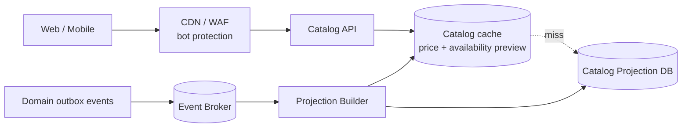
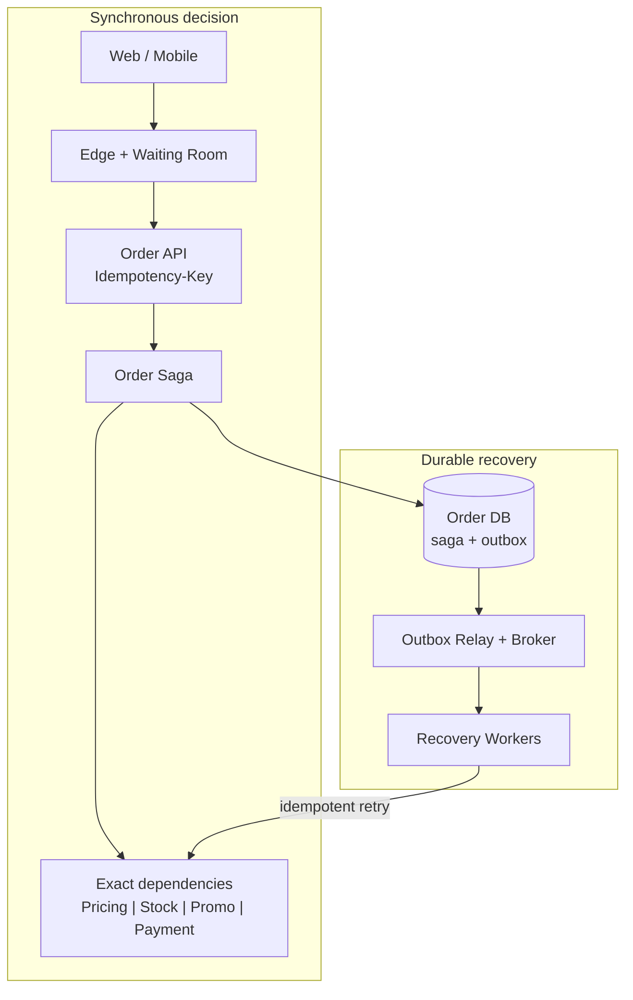

# Black Friday Marketplace ×20 — composite system design drill

## Содержание

- [Что проверяет задача](#что-проверяет-задача)
- [Фаза 1: уточнение требований](#фаза-1-уточнение-требований)
- [Фаза 2: оценка нагрузки](#фаза-2-оценка-нагрузки)
- [Фаза 3: высокоуровневый дизайн](#фаза-3-высокоуровневый-дизайн)
- [Фаза 4: deep dive](#фаза-4-deep-dive)
- [Порядок graceful degradation и load shedding](#порядок-graceful-degradation-и-load-shedding)
- [Сквозные потоки](#сквозные-потоки)
- [Отказы и восстановление](#отказы-и-восстановление)
- [Наблюдаемость](#наблюдаемость)
- [Трейдоффы](#трейдоффы)
- [Фаза 5: финал](#фаза-5-финал)
- [Interview-ready answer](#interview-ready-answer)
- [Связанные материалы](#связанные-материалы)

Это 45-минутная тренировка сборки Catalog, Stock, Promo, Order и Payment в одно
решение. Здесь не повторяются их полные deep dive: задача — провести границу между
приблизительной витриной и точным checkout, связать резервы через Saga и защитить уже
начатые заказы от пика ×20.

```text
0–7 мин    требования и гарантии
7–13 мин   числа и bottleneck
13–25 мин  две схемы и роли компонентов
25–40 мин  Saga, admission и hot keys
40–45 мин  failures, trade-offs и резюме
```

---

## Что проверяет задача

| Признак | Архитектурный ход | Цена |
| --- | --- | --- |
| Миллион витринных чтений/с | CDN + cache + read projection | Цена и остаток могут отставать |
| Нельзя продать отсутствующий товар | Exact Stock Reserve | При потере кворума checkout отказывает |
| Купон ограничен бюджетом | Promo Reserve; escrow для hot campaign | Часть quota временно простаивает |
| Заказ затрагивает несколько сервисов | Order Saga + outbox + idempotency | Временно существуют partial holds |
| Один SKU получает большую долю пика | Отдельный hot-key path | Две стратегии записи и сложнее recovery |
| Вход выше capacity Payment | Waiting room + admission control | Часть клиентов ждёт или получает `429` |

Ключевой вывод: витрина может деградировать в stale, а `reserve`, платёж и terminal
transition должны либо выполниться корректно, либо явно отказать.

---

## Фаза 1: уточнение требований

### Что спросить

```text
1. Пик ×20 относится к просмотрам, checkout или обоим потокам?
2. Допустимо ли показывать цену и availability с задержкой?
3. Какая цена окончательная: на карточке или при checkout?
4. Корзина резервируется целиком? Какой TTL у holds?
5. Можно ли вернуть 202 PROCESSING вместо синхронного финала?
6. Какой предел у платёжного провайдера?
7. Нужна ли строгая очередь покупателей flash-sale SKU?
```

### Зафиксированный scope

- Web и mobile просматривают каталог, применяют один промокод и создают заказ;
- корзина содержит в среднем три SKU и резервируется целиком;
- карточка использует приблизительные цену и availability;
- checkout повторно считает точную цену и создаёт Stock/Promo holds;
- Payment авторизует сумму и затем подтверждает денежный hold;
- Stock и Promo holds живут 15 минут, пиковое окно — 6 часов;
- один регион развёрнут в трёх зонах доступности;
- доставка, возвраты, settlement и рекомендации остаются за scope.

### Контракты

```text
Catalog:
  p99 < 200 мс
  цена и availability могут отставать до 5 минут

Checkout:
  один Idempotency-Key создаёт не более одного заказа
  terminal result или durable 202 PROCESSING за p99 < 2 с
  окончательная сумма определяется exact quote

Correctness:
  нет overselling и превышения campaign budget
  один payment attempt не списывается дважды
```

Если exact quote отличается от карточки, новая сумма требует подтверждения пользователя.
Допустимая stale-витрина не становится денежным контрактом.

---

## Фаза 2: оценка нагрузки

Все числа ниже — учебные допущения. Среднее используется для накопления, пик — для
capacity.

### Витрина

```text
обычные catalog reads:  50 000/с
Black Friday ×20:       1 000 000/с

средний ответ:          20 kB
client egress:          1 000 000 × 20 kB = 20 GB/с = 160 Gbit/с

edge hit ratio 90%:
до Catalog API:         1 000 000 × 10% = 100 000/с

application cache hit 95%:
до Projection DB:       100 000 × 5% = 5 000 чтений/с
```

Точный fan-out в Pricing, Stock и Promo на каждый показ перенёс бы почти `1 млн RPS` в
correctness-контур, поэтому карточка читается из готовой проекции.

### Checkout и admission

```text
обычные checkout attempts:         1 000/с
Black Friday ×20:                  20 000/с

безопасная capacity Order API:     25 000 новых orders/с
лимит Payment authorization:       15 000 операций/с
admission новых checkout:          15 000/с

устойчивый избыток:                20 000 - 15 000 = 5 000/с
рост очереди за 30 секунд:         5 000 × 30 = 150 000 клиентов
```

Очередь не добавляет capacity. Waiting room ограничивается примерно 150 тысячами
подписанных tickets; после этого новые попытки получают `429 Retry-After`.

Для `15 000` допущенных checkout/с примем три SKU в заказе, `70%` успешных полных
резервов и `90%` payment approval:

```text
stock reserve attempts:     15 000 × 3 = 45 000 commands/с
orders с полным reserve:    15 000 × 70% = 10 500/с
terminal для полных:        10 500 × 3 = 31 500 commit/cancel/с
partial failure worst case:  4 500 × 2 = 9 000 cancel/с
stock total worst case:     45 000 + 31 500 + 9 000 = 85 500 commands/с

payment authorizations:     10 500/с
успешные orders:            10 500 × 90% = 9 450/с
payment decline + cancel:   10 500 - 9 450 = 1 050/с

promo используется в 40% checkout:
reserve:                    15 000 × 40% = 6 000/с
terminal commit/cancel:      до 6 000/с
promo total worst case:     12 000 commands/с
```

`85 500` для Stock — консервативная граница: у каждого неуспешного полного
reserve успели удержаться два из трёх SKU и оба требуют cancel. В реальности
распределение partial failures измеряют, но capacity нельзя считать так, будто
неполный reserve ничего не нужно освобождать.

### Hot keys и broker

Пусть один SKU получает `20%` stock-команд, а одна campaign — `70%` promo-трафика:

```text
hot SKU:                    85 500 × 20% = 17 100 commands/с
обычные SKU:                85 500 - 17 100 = 68 400 commands/с

hot campaign reserve:        6 000 × 70% = 4 200/с
hot campaign all commands:  12 000 × 70% = 8 400/с
```

Допустим, benchmark обычного Stock shard даёт `5 000 commands/с`, а рабочий бюджет при
загрузке `60%` — `3 000/с`:

```text
обычные Stock shard leaders: ceil(68 400 / 3 000) = 23
берём 24 leaders + отдельный hot-SKU path
```

У каждого shard есть реплики; `24` — число write leaders, а не всех DB-узлов.

Если один order создаёт в среднем восемь событий/команд размером `1 kB`:

```text
broker peak:          15 000 × 8 = 120 000 events/с = 120 MB/с raw
replication factor 3: 120 × 3 = 360 MB/с внутренней записи

Black Friday day:
120 000 × 21 600 с + 8 000 × 64 800 с
= 3,1104 млрд events ≈ 3,11 TB raw

7 дней: один пиковый + шесть обычных дней
3,1104 + 6 × (8 000 × 86 400 / 1 млрд) = 7,2576 TB raw
с replication factor 3: ≈ 21,77 TB
```

Partition count выводится из benchmark выбранного брокера, а не из универсальной
capacity «Kafka держит N».

---

## Фаза 3: высокоуровневый дизайн

### Витрина



### Checkout



Быстрый путь вызывает exact dependencies напрямую. Решение одновременно фиксируется в
Order DB и outbox, поэтому после сбоя recovery повторяет команды. Дубликаты безопасны
только потому, что каждый downstream transition идемпотентен.

### Роли компонентов

| Компонент | Роль |
| --- | --- |
| CDN / Edge | Кэширует публичные ответы, фильтрует ботов и ограничивает поток |
| Waiting Room | Допускает не больше рассчитанного числа новых checkout |
| Catalog API + cache | Отдаёт денормализованную карточку без exact fan-out |
| Projection Builder | Собирает Product, Price, Stock и Promo preview из событий |
| Order API | Создаёт durable order по idempotency key и request hash |
| Order Saga | Управляет резервами, платежом и terminal decision |
| Pricing | Возвращает exact quote и версию цены |
| Stock / Promo / Payment | Выполняют authoritative holds и terminal transitions |
| Order DB + outbox | Сохраняет state machine и команды восстановления атомарно |
| Broker + Recovery | Буферизует и повторяет незавершённые переходы |

`Redis` уместен в витринном пути, но не становится источником истины Stock или Promo
только потому, что он быстрее.

---

## Фаза 4: deep dive

Под таймером подробно защищаем Saga и overload control. Hot-key механика остаётся
короткой и ссылается на профильные кейсы.

### 4.1 Order Saga и точка решения

```text
PENDING -> RESERVING -> PAYMENT_AUTHORIZING -> CONFIRMING -> CONFIRMED
                      \-> CANCELING -> CANCELED
```

Happy path:

```text
1. Создать order + saga + outbox по Idempotency-Key.
2. Получить exact quote.
3. Параллельно выполнить Stock.Reserve и Promo.Reserve.
4. Выполнить Payment.Authorize на точную сумму.
5. Сохранить решение CONFIRMING + outbox-команды.
6. Идемпотентно вызвать Stock.Commit, Promo.Commit, Payment.Confirm.
7. После подтверждений перевести order в CONFIRMED.
```

Ошибка до устойчивого `CONFIRMING` переводит Saga в `CANCELING`. После записи
`CONFIRMING` таймаут не меняет решение: recovery продолжает `Confirm`.

Клиент ждёт до 1,5 секунды, затем получает terminal result либо `202 PROCESSING` с
`order_id`. Повтор `POST` с тем же ключом возвращает этот же заказ. Публичный ключ
хранится вместе с `user_id` и request hash; тот же ключ с другой корзиной даёт conflict.

Downstream keys выводятся из `order_id` и шага. При таймауте Payment Saga повторяет тот
же attempt ID или читает status, а не создаёт новый charge у другого провайдера.

### 4.2 Admission и защита dependencies

Waiting Room проверяется до создания order и holds:

```text
admission = min(
  Order capacity,
  Stock capacity / commands per checkout,
  Promo capacity / commands per checkout,
  Payment capacity / worst-case attempts per checkout
)
```

Каждая зависимость получает собственные concurrency limit, deadline, circuit breaker и
retry budget. Один пользовательский запрос не запускает независимые retries на gateway,
Order и downstream одновременно.

Часть capacity Stock, Promo и recovery workers резервируется для `commit`, `cancel` и
expiry. Иначе новые reserve займут все workers, holds не освободятся, и полезная
capacity станет ещё меньше.

### 4.3 Hot SKU и hot campaign

Обычное hash-sharding не делит один SKU. Для `17 100 commands/с` используем per-SKU
admission и ordered writer, который собирает до 64 команд или ждёт не более 5 мс:

```text
ceil(17 100 / 64) = 268 batch-транзакций/с
```

При рабочей загрузке 60% benchmark hot path должен подтвердить не меньше
`268 / 0,60 ≈ 447`, округлённо `450 batch-транзакций/с` с WAL, индексами и
reservation rows. После распродажи короткий sold-out latch отсекает новые
попытки раньше DB. Полная механика находится в
[Stock / Inventory Service](./14-stock-inventory-service.md).

Hot campaign получает `4 200 reserve/с`, тогда как строка с блокировкой на 5 мс имеет
грубый предел около `200 транзакций/с`, а рабочий при 60% — около `120/с`.
Allocator раздаёт ограниченные usage/budget leases по 80 redemption partitions:

```text
8 400 / 80 = 105 commands/с на partition
```

Сумма leases не превышает global limit. Цена — временно неиспользованный quota и
reconciliation. Подробности — в [Promo Code Service](./22-promo-code-service.md).

### 4.4 Broker и backpressure

Критичные Saga commands и recovery отделяются квотами от notifications, analytics и
recommendations. Ключ `order_id` сохраняет порядок одного заказа; глобальный порядок не
нужен.

Consumers используют bounded queues. Если intake устойчиво выше processing, broker lag,
outbox age и hold age растут без границы. Поэтому admission снижается раньше исчерпания
retention или диска; необязательные consumers останавливаются первыми.

---

## Порядок graceful degradation и load shedding

Каждый следующий уровень включается, если предыдущего недостаточно:

| Уровень | Действие | Что сохраняется |
| --- | --- | --- |
| 1 | Отключить рекомендации, enrichment и синхронную аналитику | Каталог и checkout |
| 2 | Увеличить TTL публичной витрины до 5 минут, включить stale | Exact quote остаётся свежим |
| 3 | Убрать персонализацию, тяжёлые facets и точные счётчики | Базовый listing и product detail |
| 4 | Ограничить новые checkout до `15K/с` через waiting room | Предсказуемая latency admitted requests |
| 5 | Включить per-SKU/per-campaign limits и sold-out latch | Hot key не перегружает соседей |
| 6 | Отдать приоритет `commit`, `cancel`, expiry, status и recovery | Начатые Saga завершаются |
| 7 | При открытом Payment breaker перестать начинать новые holds | Товар и quota не замораживаются зря |
| 8 | При потере exact DB quorum отказать в mutations, продолжая каталог | Нет overselling и overspend |
| 9 | Остановить новые checkout, оставить terminal transitions | Сохраняются принятые обязательства |

Отключать cancel/recovery первым нельзя: зависшие holds ещё сильнее уменьшают доступный
товар и quota. Бесконечная очередь также не является деградацией — она превращает
overload в минуты latency и retry storm.

---

## Сквозные потоки

### Успешная покупка

```text
admission -> durable order -> exact quote -> Stock/Promo holds
-> Payment authorize -> durable CONFIRMING -> idempotent confirms
-> CONFIRMED -> Fulfillment/Notification events
```

### Stock успешен, Promo закончился

Saga записывает `CANCELING`, освобождает Stock hold и возвращает новый quote без купона
либо отказ согласно policy. Она не покупает по большей цене без подтверждения клиента.

### Payment timeout после авторизации

Order остаётся `PAYMENT_AUTHORIZING`. Recovery читает прежний payment attempt:
`AUTHORIZED` продолжает confirm, `DECLINED` запускает cancel, `UNKNOWN` повторяется и
попадает в reconciliation.

### Broker недоступен

Order state и outbox уже зафиксированы. Fast path может продолжать прямые идемпотентные
команды, relay сохраняет записи до восстановления broker. Рост outbox age заранее
снижает admission; после восстановления публикация происходит at-least-once.

---

## Отказы и восстановление

| Сбой | Риск | Реакция |
| --- | --- | --- |
| Повтор `POST /orders` | Два заказа | Durable idempotency key + request hash |
| Catalog cache недоступен | `100K RPS` идут в projection | Не делать полный bypass: stale, coalescing, shedding |
| Price projection отстала | Старая сумма | Exact quote + повторное подтверждение |
| Stock/Promo частично успешны | Зависшие holds | Durable `CANCELING` + идемпотентные компенсации |
| Hot writer потерял ownership | Два writer меняют SKU | Lease + fencing token, ACK после DB commit |
| Payment response потерян | Двойной charge | Тот же attempt ID + status query |
| Orchestrator упал после решения | Незавершённые confirms | Saga state + outbox + recovery workers |
| Broker lag растёт | Holds истекают, outbox заполняет диск | Lag-based admission, отдельный critical pool |
| Retry storm | Отказ размножается | Общий retry budget, backoff + jitter, circuit breaker |
| Потерян exact DB quorum | Запись в stale state | Fail closed для mutations, stale-каталог продолжает работать |

TTL holds равен 15 минутам, а штатная Saga укладывается в секунды. Возраст
промежуточного состояния алертится задолго до expiry. После нарушения terminal-контракта
заказ идёт в reconciliation/manual review, а не помечается успешным по догадке.

---

## Наблюдаемость

- Edge — входящий RPS, bot rate, waiting/rejected и CDN hit ratio;
- Catalog — application hit ratio, projection lag и возраст stale-ответов;
- Saga — p99 фаз, число и возраст процессов по состояниям, retry rate;
- Holds — возраст Stock/Promo holds относительно TTL;
- Payment — authorization rate, unknown outcomes и circuit state;
- Delivery — outbox age, critical broker lag и recovery throughput;
- Hot keys — top SKU/campaign, batch size, queue delay и rejected/с;
- Dependencies — concurrency, timeout rate и оставшийся retry budget.

Если critical workers принимают `120K events/с`, а обрабатывают `100K/с`, то за пять
минут lag вырастет на:

```text
(120 000 - 100 000) × 300 = 6 000 000 событий
```

Больше retention лишь даёт время снизить admission или масштабировать consumers; оно не
исправляет отрицательную разницу throughput.

---

## Трейдоффы

| Выбор | Альтернатива | Почему и чем платим |
| --- | --- | --- |
| Approximate catalog projection | Exact fan-out | Выдерживает `1M RPS`, но данные могут отставать |
| Exact quote на checkout | Цена карточки | Воспроизводимая сумма ценой повторного подтверждения |
| Waiting room | Бесконечная очередь API | Bounded overload ценой ожидания и `429` |
| Saga + outbox | Two-Phase Commit | Нет общих DB-locks, но есть partial holds |
| Direct path + outbox recovery | Только broker commands | Ниже normal latency, но downstream видит дубли |
| Ordered batch для hot SKU | Обычный shard | Меньше balance transactions, нужен single owner |
| Escrow для hot campaign | Global counter | Нет hot row, quota распределён неидеально |
| Fail closed mutations | Запись в stale cache | Сохраняет инварианты ценой availability |

---

## Фаза 5: финал

### Двухминутное резюме

> Я разделил приблизительную витрину и exact checkout. Миллион catalog RPS проходит
> через CDN и cache: при 90% edge hit и 95% application hit до projection DB доходит
> около 5 тысяч чтений/с. Checkout формирует exact quote и только потом резервирует
> Stock и Promo.
>
> На вход приходит 20 тысяч checkout/с, а безопасный предел Payment — 15 тысяч.
> Waiting room ограничивает admission; устойчивые 5 тысяч/с избытка нельзя скрыть в
> бесконечной очереди. Order хранит Saga и outbox, фиксирует одно решение и повторяет
> идемпотентные terminal transitions.
>
> Hot SKU с 15,3 тысячи команд/с уходит в ordered microbatch path, hot campaign с 4,2
> тысячи reserve/с — в escrow quota partitions. При перегрузке сначала отключаются
> необязательные функции и стареет витрина, затем ограничиваются новые checkout. Exact
> mutations fail closed, а confirm, cancel, status и recovery получают приоритет.

### За пределами scope и рост ×10

- вне scope — выбор склада, fraud-модели, settlement/refund, fulfillment и multi-region;
- рост ×10 сначала требует новых payment limits, а не только дополнительных подов;
- Order DB и broker перераспределяются по `order_id`, Stock — по SKU и hot writers;
- waiting room становится отдельным сервисом fairness, а не заменой capacity.

---

## Interview-ready answer

**1. Почему каталог и checkout читают разные данные?**

- Витрина — обслуживает миллион RPS из CDN, cache и асинхронной проекции.
- Checkout — повторяет точный расчёт и reserve на authoritative path.
- Цена — карточка может отставать и не обещает остаток или окончательную сумму.

**2. Откуда взялся предел 15 тысяч checkout/с?**

- Вход — после роста ×20 приходит 20 тысяч попыток в секунду.
- Ограничение — безопасная Payment capacity равна 15 тысячам операций в секунду.
- Решение — admission берёт минимум capacity зависимостей.
- Избыток — 5 тысяч в секунду ждёт в bounded waiting room либо получает `Retry-After`.

**3. Как согласовать Stock, Promo и Payment?**

- Координатор — Order Saga хранит durable state machine и terminal decision.
- Подготовка — Stock/Promo создают holds, Payment авторизует сумму.
- Успех — после `CONFIRMING` подтверждения повторяются до terminal states.
- Неудача — до `CONFIRMING` успешные holds отменяются идемпотентно.

**4. Что делать с hot SKU?**

- Проблема — один SKU получает 15,3 тысячи команд/с и не делится hash-sharding.
- Admission — per-SKU limit защищает соседние товары.
- Запись — ordered writer объединяет до 64 команд в транзакцию.
- Проверка — примерно 240 batch-транзакций/с подтверждаются отдельным benchmark.

**5. Что делать с hot промокодом?**

- Проблема — 4,2 тысячи reserve/с сериализуются на global counter.
- Решение — allocator раздаёт ограниченные usage и budget leases partitions.
- Инвариант — сумма leases не превышает campaign limit.
- Цена — quota может временно простаивать и требует reconciliation.

**6. Как broker backpressure влияет на checkout?**

- Буфер — broker принимает временный lag, outbox переживает сбой публикации.
- Ограничение — intake выше processing бесконечно увеличивает lag и возраст holds.
- Реакция — noncritical consumers останавливаются, admission снижается.
- Приоритет — confirm/cancel и recovery обслуживаются раньше аналитики.

**7. В каком порядке деградирует система?**

- Сначала — аналитика, рекомендации, enrichment и тяжёлая персонализация.
- Затем — stale публичная витрина в пределах пяти минут.
- После — waiting room, per-key limits и снижение новых checkout.
- В конце — fail closed mutations при сохранении status, cancel, confirm и recovery.

**8. Что происходит при неизвестном результате платежа?**

- Состояние — таймаут не означает отказ и не разрешает новый charge.
- Повтор — используется тот же payment attempt ID или status query.
- Переключение — другой PSP допускается только после достоверного исхода.
- Recovery — Order остаётся в промежуточном состоянии до решения или ручной сверки.

---

## Связанные материалы

- [Как проходить System Design Interview](./00-how-to-approach.md)
- [Stock / Inventory Service](./14-stock-inventory-service.md)
- [Promo Code Service](./22-promo-code-service.md)
- [Payment System](./11-payment-system.md)
- [Saga и Outbox](../../04-architecture-and-patterns/patterns/09-saga-and-outbox.md)
- [Распределённые транзакции: 2PC, 3PC, TCC и Saga](../../04-architecture-and-patterns/patterns/11-distributed-transactions-2pc-3pc-tcc.md)
- [Backpressure и Load Shedding](../reliability-patterns/05-backpressure-and-shedding.md)
- [Timeouts и Deadlines](../reliability-patterns/01-timeouts-and-deadlines.md)
- [Retries и Backoff](../reliability-patterns/02-retries-and-backoff.md)
- [Circuit Breaker](../reliability-patterns/03-circuit-breaker.md)
- [Idempotency](../reliability-patterns/06-idempotency.md)
