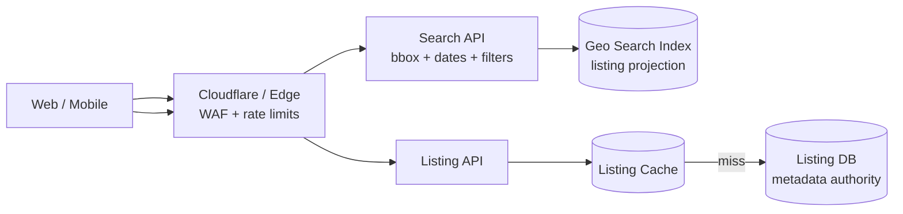
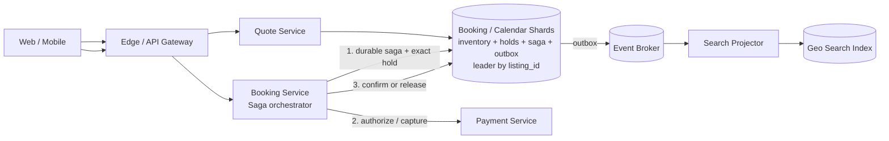

# Airbnb Booking: поиск по карте и последнее доступное жильё

## Содержание

- [Что проверяет задача](#что-проверяет-задача)
- [Фаза 1: уточнение требований](#фаза-1-уточнение-требований)
- [Фаза 2: оценка нагрузки](#фаза-2-оценка-нагрузки)
- [Ключевая модель: projection, quote, hold и booking](#ключевая-модель-projection-quote-hold-и-booking)
- [Фаза 3: высокоуровневый дизайн](#фаза-3-высокоуровневый-дизайн)
- [Фаза 4: deep dive](#фаза-4-deep-dive)
- [Сквозные потоки](#сквозные-потоки)
- [Отказы и пограничные случаи](#отказы-и-пограничные-случаи)
- [Трейдоффы](#трейдоффы)
- [Фаза 5: финал](#фаза-5-финал)
- [Interview-ready answer](#interview-ready-answer)
- [Связанные материалы](#связанные-материалы)

Практический разбор сервиса краткосрочной аренды. Пользователь ищет жильё на
карте по датам и фильтрам, получает зафиксированную цену, временно удерживает
последний доступный объект и оплачивает бронирование. Главный инвариант: одна и
та же единица жилья не может быть подтверждена двум гостям на пересекающиеся даты.

---

## Что проверяет задача

Здесь сталкиваются два разных требования:

- поиск должен быстро просматривать миллионы объявлений и допускает небольшое
  отставание индекса;
- booking последнего доступного жилья должен дать точный ответ при конкуренции.

Поисковая выдача поэтому является **candidate projection**, а не источником
истины. Даже если карточка секунду показывает устаревшую доступность, final hold
проверяет все ночи одной транзакцией в authority выбранного listing.

Отдельно нужно развести четыре похожие сущности:

| Сущность | Что обещает |
| --- | --- |
| Search result | жильё выглядит подходящим по отстающей projection |
| Quote | цена и правила зафиксированы до `expires_at` |
| Hold | inventory ночей временно принадлежит одному checkout |
| Booking | подтверждённое durable бронирование |

---

## Фаза 1: уточнение требований

### Что спросить

```text
- Сдаётся весь объект или несколько одинаковых units?
- Точность search availability обязательна или exact check только на checkout?
- Как долго действует цена и hold?
- Payment — authorization/capture или мгновенное списание?
- Может ли host менять цену/календарь во время checkout?
- Нужны отмена, refund и разные cancellation policies?
- Поиск выполняется по городу, bounding box карты или произвольному polygon?
- Поддерживаем instant booking или host approval?
```

### Зафиксированный scope

- 10 млн активных listings; у listing может быть `unit_capacity > 1`.
- Поиск по bounding box, датам, числу гостей, цене и amenities.
- Search projection может отставать до минуты, но UI явно перепроверяет
  доступность и цену перед hold.
- Quote и hold живут 10 минут.
- Instant booking: payment authorization, затем confirm booking и capture.
- Идемпотентные create quote, hold, confirm и cancel.
- История booking и финансовых переходов хранится бессрочно; старые search
  projections можно перестроить.

Вне scope: рекомендации, отзывы, host approval, dispute resolution, payouts
хозяевам, fraud-модели и долгосрочная аренда.

### Нефункциональные требования

```text
search:               p99 < 300 мс
quote / exact check:  p99 < 200 мс
create hold:          p99 < 300 мс
booking correctness:  никакого double booking
availability:         99,99% для search, 99,95% для exact booking path
durability:           подтверждённый booking и payment events не теряются
```

Booking path выбирает consistency вместо ложного успеха: при недоступности
authority конкретного listing система не подтверждает бронь из кеша.

---

## Фаза 2: оценка нагрузки

Чисел в условии нет. Ниже учебные допущения, которые нужно согласовать с
интервьюером:

```text
DAU:                         5 млн
search requests на DAU:      20/день
детальных просмотров:        5/день
booking attempts:            2 млн/день
confirmed bookings:          500 тыс./день
средняя поездка:             4 ночи
активных listings:           10 млн
горизонт календаря:          18 месяцев
```

### Search и detail

```text
Search:
  5 млн × 20 / 86 400 ≈ 1 157 запросов/с в среднем
  travel peak ×10 ≈ 11 600 запросов/с

Detail:
  5 млн × 5 / 86 400 ≈ 289 запросов/с в среднем
  peak ×10 ≈ 2 900 запросов/с
```

Search доминирует по чтениям и требует отдельного геопространственного индекса.
Но эти 11,6K RPS не должны попадать в exact calendar DB.

### Booking и calendar mutations

```text
Booking attempts:
  2 млн / 86 400 ≈ 23 attempts/с в среднем
  campaign peak ×10 ≈ 230 attempts/с

Confirmed bookings:
  500 тыс. / 86 400 ≈ 5,8 booking/с в среднем
  peak ×10 ≈ 58 booking/с

Занятые ночи:
  500 тыс. × 4 = 2 млн booked-night transitions/день
```

Глобальный write RPS невелик, но нагрузка локально неравномерна: популярное
жильё может получить сотни одновременных hold attempts на один и тот же диапазон.
Значит, главная проблема — contention и корректность hot listing, а не общий RPS.

### Хранение

```text
Booking records за год:
  500 тыс. × 365 ≈ 182,5 млн bookings/год

Booked-night transitions за год:
  2 млн × 365 ≈ 730 млн transitions/год
```

Текущий calendar horizon ограничен 18 месяцами; прошлые nightly states можно
компактировать, а immutable booking/ledger history — партиционировать по времени.
Размер DB-шардов из числа строк не угадывают: row/index overhead и capacity
полной транзакции измеряются benchmark на целевой схеме.

### Availability projection

Raw bitmap на 18 месяцев — около 550 бит, то есть 69 bytes на listing:

```text
10 млн × 69 B ≈ 690 MB raw bitmap payload
```

Реальный поисковый индекс будет заметно больше из-за документов, geo, amenities,
цен, сегментов и replication. Расчёт показывает лишь, что компактный coarse
calendar допустимо денормализовать в search projection.

---

## Ключевая модель: projection, quote, hold и booking

### Availability projection

Search документ содержит geo, capacity, amenities, price range и приблизительный
bitmap доступности. Он обновляется через outbox и может отставать. Его ответ:
«этот listing стоит проверить», а не «он гарантированно ваш».

### Quote

Quote фиксирует вычисленную сумму и входные версии:

```text
quote_id, listing_id, check_in, check_out, guests
nightly_price_version, fee_version, tax_version, policy_version
currency, subtotal, fees, taxes, total, expires_at
```

Изменение host price не переписывает уже выданный quote. После `expires_at`
нужно получить новый.

### Hold

Hold временно уменьшает available capacity **в каждой ночи диапазона**:

```text
PENDING → HELD → CONFIRMED
             └→ EXPIRED / CANCELED
```

### Booking

Booking появляется как durable business entity до внешней оплаты, но становится
`CONFIRMED` только после payment authorization и успешного calendar confirm:

```text
RESERVING → PAYMENT_PENDING → CONFIRMED → CANCELED
   │               │                           │
   └→ SOLD_OUT      └→ PAYMENT_FAILED           └→ REFUND_PENDING → REFUNDED
```

---

## Фаза 3: высокоуровневый дизайн

Чтобы не смешивать тысячи поисковых чтений с точным checkout, схема разделена
на discovery и booking.

### Discovery: карта и фильтры



### Exact booking и payment saga



### Роль компонентов

**Search API и Geo Search Index.**
*Зачем:* фильтруют listings по bounding box, датам, capacity, price и amenities,
сортируют кандидатов и возвращают cursor.
*Почему отдельно:* 11,6K peak RPS работают с денормализованным документом; joins
с exact calendar для каждого результата разрушили бы latency и availability.

**Listing API и DB.**
*Зачем:* authority описания, host, coordinates, rules и media references.
*Почему отдельно от Search:* изменения редки и требуют audit, а выдача read-heavy
и допускает projection lag.

**Quote Service.**
*Зачем:* точно перепроверяет dates/guests, рассчитывает nights, fees и taxes,
фиксирует версии правил на 10 минут.
*Почему отдельная сущность:* цена в search — preview; payment должен ссылаться на
неизменяемую сумму, а не пересчитывать её посередине Saga.

**Booking Service.**
*Зачем:* идемпотентно запускает hold → payment authorization → calendar confirm →
capture и выполняет компенсации.
*Почему orchestrator:* состояние и следующий шаг видны в одной durable Saga;
retry внешнего timeout не создаёт вторую оплату.

**Booking / Calendar Shards.**
*Зачем:* хранят capacity по `listing_id + date`, holds, booking state, quote
snapshot, idempotency, Saga steps и outbox.
*Почему shard key `listing_id`:* один booking затрагивает много ночей, но один
listing; reserve/confirm/cancel остаются локальными транзакциями на shard leader.
История по `guest_id` и `host_id` строится отдельной read projection.

**Event Broker и Search Projector.**
*Зачем:* асинхронно обновляют availability/price projection, уведомления,
аналитику и host calendar exports.
*Почему вне точной транзакции:* поиск может отстать; dual-write authority +
Search Index не должен определять корректность booking.

---

## Фаза 4: deep dive

### 4.1 API

```http
GET  /v1/search?bbox=...&check_in=...&check_out=...&guests=2&cursor=...
POST /v1/quotes
POST /v1/holds                 Idempotency-Key: ...
GET  /v1/holds/{hold_id}
POST /v1/bookings/{id}/confirm Idempotency-Key: ...
POST /v1/bookings/{id}/cancel  Idempotency-Key: ...
GET  /v1/bookings/{id}
```

Потерянный ответ восстанавливается через `GET` или повтор с тем же ключом.
`Idempotency-Key` сравнивается с hash тела: тот же ключ и другое содержание —
ошибка, а не возврат чужого старого результата.

### 4.2 Exact calendar schema

Упрощённая модель multi-unit listing:

```sql
CREATE TABLE nightly_inventory (
    listing_id UUID NOT NULL,
    night      DATE NOT NULL,
    capacity   INTEGER NOT NULL,
    held       INTEGER NOT NULL DEFAULT 0,
    booked     INTEGER NOT NULL DEFAULT 0,
    version    BIGINT NOT NULL DEFAULT 0,
    PRIMARY KEY (listing_id, night),
    CHECK (capacity >= 0),
    CHECK (held >= 0),
    CHECK (booked >= 0),
    CHECK (held + booked <= capacity)
);
```

Hold сначала блокирует ночи в детерминированном порядке от `check_in` до
`check_out - 1`. Затем проверяет полноту диапазона и capacity и увеличивает
`held`; если хотя бы одной ночи не хватает, вся транзакция откатывается.

```sql
SELECT night, capacity, held, booked
FROM nightly_inventory
WHERE listing_id = $1
  AND night >= $check_in
  AND night < $check_out
ORDER BY night
FOR UPDATE;

-- В приложении проверяем число ночей и held + booked < capacity у каждой строки.

UPDATE nightly_inventory
SET held = held + 1,
    version = version + 1
WHERE listing_id = $1
  AND night >= $check_in
  AND night < $check_out;
```

Проверка и update выполняются в одной транзакции после `FOR UPDATE`. Должно быть
получено и изменено ровно `check_out - check_in` строк; иначе `ROLLBACK`:
частично удержанный диапазон недопустим. Транзакция заранее создаёт отсутствующие
nightly rows или модель гарантирует их наличие на всём booking horizon.

В той же транзакции создаётся `calendar_hold` с `UNIQUE(client_id,
idempotency_key)` и request hash. Поэтому потерянный ответ и повтор не увеличат
`held` второй раз. Hold, booking Saga, inventory и outbox находятся на одном
шарде; отдельный «idempotency service» перед маршрутизацией создал бы dual-write.

Для single-unit listing можно хранить интервалы и использовать exclusion
constraint по `tstzrange`, как в
[Meeting Room Booking](./23-meeting-room-booking.md). Nightly rows проще для
capacity больше единицы и календарных цен, но создают больше записей.

### 4.3 Hot listing не лечится добавлением шардов

Шардирование по `listing_id` распределяет разные объекты, но последнее жильё с
сотнями конкурентных покупателей остаётся на одном shard и тех же nightly rows.
Это неизбежная точка сериализации инварианта.

Что можно сделать:

- waiting room ограничивает одновременно допущенные hold attempts;
- ранний compare-and-set быстро отклоняет проигравших;
- transaction не вызывает Payment и другие сети под row locks;
- per-listing queue улучшает fairness, но увеличивает latency и operational cost.

Для capacity > 1 возможны escrow buckets по units, но для одного уникального
дома делить последнюю единицу между независимыми writers нельзя без общего
решения о победителе.

### 4.4 Hold TTL и гонка с confirm

Hold row хранит `expires_at`, но TTL сам по себе не освобождает inventory.
Освобождение и confirm — условные транзакции:

```text
confirm:
  HELD + now < expires_at + matching quote/payment → CONFIRMED
  held -= 1; booked += 1

expire:
  HELD + now >= expires_at → EXPIRED
  held -= 1
```

Обе операции проверяют state/version под теми же calendar locks. Кто закоммитил
первым, тот определил итог; запоздавший sweeper не может освободить уже
`CONFIRMED` inventory.

TTL 10 минут — продуктовый параметр. Слишком длинный TTL замораживает последнее
жильё брошенными checkout, слишком короткий повышает число оплат, завершившихся
после expiry. Метрика `hold_to_booking_conversion` и latency платёжного провайдера
определяют значение лучше круглого числа.

### 4.5 Price snapshot

Search показывает ориентировочную сумму. Quote Service читает актуальные
nightly prices, cleaning fee, taxes, currency и policy versions и сохраняет
полный breakdown.

Hold принимает только неистёкший `quote_id` с тем же listing/dates/guests.
Payment использует `quote.total`, а не текущую цену listing. Это защищает и
гостя от неожиданного повышения, и сервис от повторного применения старой скидки
после expiration.

Quote не резервирует inventory. Иначе пользователи, просто открывшие checkout,
замораживали бы жильё без явного hold.

### 4.6 Payment Saga

Внешний payment provider нельзя вызывать внутри транзакции Booking/Calendar
authority. Locks держались бы секунды, а timeout оставил бы неизвестный результат.

```text
1. Persist Booking(RESERVING) + Saga + idempotency на listing shard.
2. В той же локальной authority выполнить exact Hold; Booking → PAYMENT_PENDING.
3. Authorize payment с operation key = booking_id + payment_attempt.
4. Локально confirm: held → booked, Booking → CONFIRMED, INSERT outbox.
5. Capture authorization с отдельным operation key.
6. Publish BookingConfirmed через outbox.
```

Если authorization отклонён — release hold. Если confirm не прошёл из-за
истечения hold — void authorization. Если capture после confirm временно
неизвестен — повторяем с тем же operation key и сверяемся reconciliation, а не
создаём новый charge.

Здесь нет общей атомарной транзакции с provider: Saga гарантирует завершение или
компенсацию, но временные состояния видимы и должны обрабатываться явно.

### 4.7 Cancel и refund

Cancel одной локальной транзакцией listing shard:

- переводит `CONFIRMED → CANCELED` ровно один раз;
- уменьшает `booked` для будущих ночей согласно policy;
- сохраняет refund calculation snapshot;
- пишет outbox `RefundRequested` и `AvailabilityChanged`.

Refund выполняется асинхронно и идемпотентно. Освобождённое жильё может снова
появиться в Search с задержкой projection, но exact calendar доступно сразу.
Прошедшие ночи не «возвращаются» в capacity задним числом.

### 4.8 Поиск по карте

Search Index шардируется по крупному георегиону; внутри документа хранится geo
point и компактная availability projection. Запрос bounding box:

1. выбирает пересекающиеся geo shards;
2. фильтрует dates/guests/amenities;
3. каждый shard возвращает локальный top-K;
4. coordinator merge-ит результаты по score;
5. cursor содержит query hash и стабильный tie-breaker `listing_id`.

При движении карты клиент debounce-ит запросы и отменяет устаревший. Огромный
viewport не должен читать весь мир: API ограничивает zoom/area или возвращает
агрегированные map clusters вместо отдельных listings.

`offset` неудобен: при обновлении рейтинга элементы прыгают между страницами и
глубокая страница становится дорогой. Cursor привязывается к короткому search
snapshot/version, но не превращает выдачу в exact availability authority.

### 4.9 Projection через outbox

Calendar transaction пишет `AvailabilityChanged(listing_id, version)`. Projector
читает события partitioned по `listing_id`, применяет только версию новее текущей
и обновляет Search Index идемпотентно.

Если consumer отстал, UI может показать уже занятый listing. Это допустимый
ложноположительный candidate: exact hold вернёт `SOLD_OUT`, после чего клиент
получит обновлённые альтернативы. Ложноотрицательный stale result снижает
конверсию, поэтому lag имеет SLO и алерт, хотя инвариант не ломает.

---

## Сквозные потоки

### 1. Поиск и quote

Клиент двигает карту → Search читает geo projection → пользователь открывает
listing → Quote точно читает актуальные цены/правила и сохраняет snapshot.
*Итог:* быстрый поиск не обещает окончательную цену, checkout получает
проверяемую сумму.

### 2. Два гостя выбирают последнее жильё

Оба видят listing в Search → оба создают quote → Calendar shard сериализует
условные hold transactions → один получает `HELD`, второй — `SOLD_OUT`.
*Итог:* stale projection создаёт лишнюю попытку, но не double booking.

### 3. Успешное бронирование

Booking/Calendar shard одной транзакцией сохраняет Saga и exact hold → Payment
авторизует сумму → shard атомарно переводит held nights в booked и пишет outbox →
capture завершается → consumers обновляют Search и отправляют уведомления.
*Итог:* booking, inventory и payment имеют повторяемые operation IDs и явные
компенсации.

### 4. Отмена

Booking проверяет policy snapshot → локально отменяет будущие nights → outbox
запускает refund и Search update → provider callback/reconciliation подтверждает
возврат.
*Итог:* доступность восстанавливается независимо от задержки refund.

---

## Отказы и пограничные случаи

| Сбой | Поведение |
| --- | --- |
| Search Index недоступен | Можно показать recent/favorite listings, но новый exact поиск деградирует |
| Search projection отстаёт | Возможен `SOLD_OUT` на hold; double booking невозможен |
| Booking/Calendar shard недоступен | Новый hold fail closed; историю можно показать из read projection как временно устаревшую |
| Ответ create hold потерян | Retry с тем же idempotency key возвращает тот же hold |
| Payment timeout | Проверка статуса и retry с тем же operation key, без нового charge |
| Hold истёк одновременно с authorization | Conditional confirm проигрывает expiry; authorization void |
| Projector применил события не по порядку | Listing version отбрасывает старое событие |
| Refund consumer отстаёт | Booking показывает `REFUND_PENDING`; reconciliation продолжает процесс |

---

## Трейдоффы

| Выбор | Альтернатива | Причина |
| --- | --- | --- |
| Search projection + exact hold | Exact join Calendar для каждой карточки | 11,6K search RPS не нагружают booking authority |
| Shard key `listing_id` | Shard key `guest_id` | Все ночи одного booking остаются в локальной транзакции |
| Nightly rows | Только interval rows | Capacity > 1 и цена по ночам проще; цена — больше записей |
| Quote snapshot | Пересчитать цену после payment | Стабильная сумма и версии правил на checkout |
| Hold до payment | Payment до inventory | Меньше лишних void/refund при sold out |
| Saga | Распределённая транзакция с provider | Provider не участвует в общей DB-транзакции |
| Cursor pagination | Offset | Стабильнее при изменяющемся ranking и дешевле глубоких страниц |
| Fail closed Calendar | Бронь из cache | Сохраняет инвариант последнего доступного жилья |

---

## Фаза 5: финал

### Двухминутное резюме

> Я разделяю discovery и booking. При учебных 5 млн DAU search получает около
> 11,6K RPS в пике и читает географический денормализованный индекс. Availability
> bitmap и цена там могут отставать; это только candidate projection. Точный
> quote фиксирует версии nightly prices, fees, taxes и policy на 10 минут.
>
> Hold маршрутизируется по `listing_id` на leader Booking/Calendar shard. Одна транзакция
> условно увеличивает held для каждой ночи диапазона и проверяет число изменённых
> строк. Поэтому два гостя могут увидеть последнее жильё в stale Search, но
> подтвердит hold только один. Добавление шардов распределяет разные listings, но
> не устраняет сериализацию одного hot listing; там нужны waiting room и короткий
> conditional path.
>
> Booking Service ведёт durable Saga: exact hold, payment authorization, calendar
> confirm, capture и outbox. Каждый внешний шаг имеет operation key. Истечение
> hold и confirm соревнуются условными state transitions; проигравшая authorization
> void-ится. Cancel освобождает будущие nights локально, а refund идёт асинхронно.

### За пределами scope и рост ×10

- Host approval добавит долгоживущий request, но не должен держать inventory без
  согласованной политики.
- Cross-region active-active для одного listing потребует home region или escrow
  capacity; обычная multi-leader запись вернёт риск double booking.
- Recommendations могут переиспользовать search documents, но строятся отдельно.
- Для длинной истории booking/ledger добавляются time partitions и cold archive.

---

## Interview-ready answer

**1. Почему Search может врать про доступность?**

- Он обслуживает 11,6K peak RPS из асинхронной projection.
- Stale positive приводит только к отклонённому hold.
- Exact Calendar transaction остаётся barrier против double booking.

**2. Как забронировать диапазон ночей атомарно?**

- Все nights одного listing находятся на shard по `listing_id`.
- Условный update выполняется в одной транзакции и детерминированном порядке.
- Если изменено меньше ожидаемого числа nights, транзакция откатывается целиком.

**3. Что происходит при гонке hold expiry и confirm?**

- Обе операции проверяют state/version под Calendar locks.
- Только один переход может закоммититься первым.
- Если победил expiry, payment authorization отменяется через void.

**4. Зачем отдельный Quote?**

- Search price — preview, а payment нужна фиксированная сумма.
- Quote сохраняет breakdown и версии pricing/tax/policy.
- Expiration ограничивает срок старых цен без изменения уже начатого checkout.

**5. Почему payment — Saga?**

- Внешний provider нельзя включить в локальную Booking/Calendar транзакцию.
- Durable steps и operation keys переживают timeout и потерянные ответы.
- Невыполненный шаг завершается retry или явной компенсацией.

**6. Почему hot listing не лечится обычным шардированием?**

- Все конкуренты изменяют те же nightly rows одного `listing_id`.
- Перенос соседних listings разгружает shard, но не эту точку сериализации.
- Waiting room ограничивает contenders; последнее уникальное unit всё равно
  требует одного точного решения.

---

## Связанные материалы

- [Meeting Room Booking](./23-meeting-room-booking.md) — range conflicts и
  exclusion constraint
- [Stock / Inventory Service](./14-stock-inventory-service.md) — exact reserve,
  hot resource и Saga
- [Uber / Ride-Sharing](./06-uber-ride-sharing.md) — геоиндекс как candidate source
- [Avito / Classifieds](./13-avito-classifieds.md) — фасетный поисковый индекс
- [Payment System](./11-payment-system.md) — ledger, idempotency и reconciliation
- [Saga, Outbox и compensation](../../04-architecture-and-patterns/patterns/09-saga-and-outbox.md)
- [PostgreSQL: транзакции и блокировки](../../06-databases/database-systems-catalog/postgresql/04-transactions-and-locking.md)
