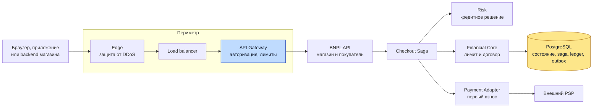
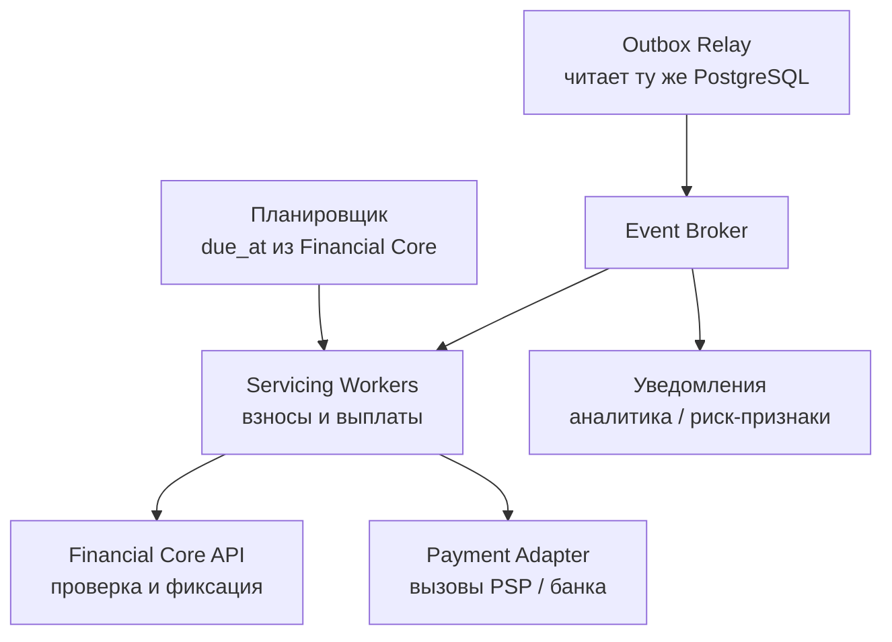

# BNPL Service: рассрочка по модели Tabby / Klarna

## Содержание

- [Что проектируем](#что-проектируем)
- [Фаза 1: уточнение требований](#фаза-1-уточнение-требований)
- [Фаза 2: оценка нагрузки](#фаза-2-оценка-нагрузки)
- [Фаза 3: высокоуровневый дизайн](#фаза-3-высокоуровневый-дизайн)
- [Фаза 4: deep dive](#фаза-4-deep-dive)
- [Сквозные потоки](#сквозные-потоки)
- [Отказы и наблюдаемость](#отказы-и-наблюдаемость)
- [Трейдоффы](#трейдоффы)
- [Фаза 5: финал](#фаза-5-финал)
- [Вопросы и ответы: платёжные сбои и сверка денег](#вопросы-и-ответы-платёжные-сбои-и-сверка-денег)
- [Interview-ready answer](#interview-ready-answer)
- [Связанные материалы и источники](#связанные-материалы-и-источники)

Разбор на 45–60 минут по [общему плану интервью](./00-how-to-approach.md).
На deep dive выбираем две темы: конкурентное использование лимита и жизненный
цикл денег. Остальные подразделы — ответы на уточнения, а не обязательный монолог.

---

## Что проектируем

**BNPL (Buy Now, Pay Later)** — покупка сейчас с оплатой частями.
Проектируем самого провайдера рассрочки, а не магазин, который подключает
готовый способ оплаты через Stripe.

Покупатель берёт товар за 100, платит сейчас 25 и ещё три раза по 25 позже.
Продавец получает согласованную сумму раньше, чем покупатель погасит весь долг.
Провайдер финансирует этот разрыв и принимает оговорённый кредитный риск.

Сам он картами не оперирует: списания и возвраты идут через **PSP**
(`payment service provider`) — платёжного провайдера, который хранит карточные
данные, обращается к платёжным системам и отвечает за исход операции. Дальше
по тексту PSP означает эту внешнюю сторону, а не наш собственный Payment Adapter,
который её вызывает.
Поэтому «первый взнос оплачен», «продавцу перечислены деньги» и «долг погашен»
— разные факты, которые нельзя спрятать за одним `status=PAID`.

Tabby и Klarna здесь — ориентиры продукта. Схемы ниже не описывают их внутренние
системы. Например, публичные merchant API выделяют операции capture и refund;
из этого не следует, как устроены их кредитный движок или ledger.
См. [Tabby: capture](https://docs.tabby.ai/api-reference/payments/capture-a-payment)
и [Klarna: capture](https://docs.klarna.com/acquirer/klarna/after-payments/order-management/manage-orders-with-the-api/capture-and-track-orders/).

---

## Фаза 1: уточнение требований

### Что спросить

| Вопрос | Почему меняет дизайн |
| --- | --- |
| Строим провайдера или интеграцию магазина? | У провайдера появляются долг клиента, кредитный риск и финансирование продавца |
| Какие страны, валюты и продукты рассрочки? | Проверки клиента, договоры, сроки и правила автосписаний нельзя считать универсальными |
| Когда берём первый взнос и подтверждаем покупку? | Определяет Saga, временные резервы и возврат денег при отмене |
| Когда продавец получает деньги и кто несёт риск неплатежа? | Выплата продавцу не должна случайно зависеть от погашения всех взносов |
| Нужны частичные отгрузки, возвраты, досрочное погашение? | Возникают несколько capture и перераспределение долга между взносами |
| Насколько быстро нужен ответ и что делать при недоступном Risk или PSP? | Быстрый отказ, ожидание и `PROCESSING` — разные продуктовые результаты |

### Учебные допущения и scope

Фиксируем один рынок и одну валюту с двумя десятичными знаками. Это допущения
кейса, не тариф или юридические правила Tabby/Klarna:

- Четыре взноса без процентов покупателю; комиссия удерживается с продавца.
  Первый взнос списываем при оформлении, остальные — через 30, 60 и 90 дней
  от даты первого взноса; точные даты фиксируем в условиях.
- Кредитное решение учитывает клиента, сумму и продавца. Есть общий лимит клиента
  для покупок во всех магазинах этого провайдера.
- После первого взноса выдаём магазину разрешение на полный capture.
  В кейсе оно действительно 24 часа. Частичные отгрузки оставляем за рамками.
- Capture активирует договор и обязательство перед продавцом. Выплата идёт
  отдельным процессом по согласованному календарю, не ждёт остальных взносов.
- Нужны просмотр графика, автосписания, ручная оплата, отмена до capture,
  полные и частичные возвраты после него, уведомления и обработка просрочек.
- Проверку личности, внешние кредитные сведения и платёжные реквизиты получаем
  через интеграции. Модели скоринга, лицензирование, юридическое взыскание,
  валютный обмен и привлечение финансирования подробно не проектируем.

Договор хранит версию условий и подтверждение согласия. Правила хранения данных,
проверок клиента и коммуникаций задаются для выбранного рынка; универсальное
«храним всё вечно» или «списываем сколько угодно раз» в требования не добавляем.

### Гарантии

| Требование | Контракт |
| --- | --- |
| Корректность лимита | Две параллельные покупки не могут использовать одну свободную сумму |
| Корректность денег | Один финансовый эффект на бизнес-операцию; неизвестный исход не считается отказом |
| Доступность | Учебная цель API — 99,99%; при потере безопасного writer новые обязательства не принимаем |
| Задержка | Цель p99 приёма команды/чтения статуса — 300 мс; асинхронное решение Risk — до 2 с при доступных зависимостях |
| Внешние платежи | Время действий пользователя и PSP не включаем в обещание 300 мс; возвращаем состояние операции |
| Сохранность | Подтверждённые локальные операции переживают потерю одного узла/зоны; отдельные backup и проверка восстановления |

Точное чтение долга и лимита идёт на leader. История в приложении и аналитика
могут читать проекции с обозначенным запаздыванием. Новое списание всегда заново
проверяет сумму в финансовом ядре, а не доверяет экрану клиента.

---

## Фаза 2: оценка нагрузки

Все числа ниже — допущения для интервью, а не статистика компаний или benchmark.

| Показатель | Допущение |
| --- | --- |
| Заявки на рассрочку | 2 млн/сутки |
| Активированные договоры | 500 тыс./сутки, то есть 25% заявок |
| Пик оформления | ×10 к среднесуточному потоку |
| Чтения графика и истории | 10 млн/сутки, пик ×10 |
| Отложенные взносы | 3 на договор; считаем установившийся поток после набора всех когорт |
| Дополнительные попытки отложенных списаний | +20% к числу взносов |
| Окно фоновых списаний | 6 часов в дату платежа по условиям продукта |

Пиковые значения ниже округляем вверх до целых запросов в секунду.

```text
Заявки:              2 000 000 / 86 400 ≈ 23/с; пик ≈ 232/с
Активации:             500 000 / 86 400 ≈ 5,8/с; пик ≈ 58/с
Чтения:             10 000 000 / 86 400 ≈ 116/с; пик ≈ 1 158/с

Отложенные взносы:     500 000 × 3 = 1 500 000/сутки
С попытками:         1 500 000 × 1,2 = 1 800 000/сутки
Внутри окна:         1 800 000 / (6 × 3 600) ≈ 83 попытки/с
```

Число первых списаний отдельно измеряем: не каждый оплаченный checkout доходит
до capture. Нельзя принять 58 активаций/с за верхний предел вызовов PSP.

Если PSP выделяет фоновой очереди 100 запросов/с, 1,8 млн попыток занимают
`1 800 000 / 100 = 18 000 с = 5 часов`. При среднем времени запроса 1 с нужно
около `100 × 1 = 100` одновременных запросов. Это расчёт при допущенной квоте,
не свойство PSP. Первые платежи, проверка статусов и запас на сбои требуют
отдельного бюджета: при общей квоте 100/с расчёт уже не оставляет им эти 100/с.

### Эхо когорт

Взносы привязаны к фиксированным +30, +60 и +90 дням, поэтому равномерный поток
в 1,5 млн взносов держится только при равномерных активациях. Любой всплеск
оформлений возвращается тремя всплесками списаний — ровно через месяц, два и три,
и приходит он не в пик оформления, а в обычный день.

Считаем день, в котором активаций оказалось втрое больше обычного (распродажа,
рекламная кампания). Через 30 дней очередь этого дня складывается из трёх когорт,
одна из которых втрое толще:

```text
обычный день: 0,5 + 0,5 + 0,5 = 1,5 млн взносов
              1,5 млн × 1,2   = 1,8 млн попыток →  83/с, 5 ч при квоте 100/с

день-эхо:     0,5 + 0,5 + 1,5 = 2,5 млн взносов
              2,5 млн × 1,2   = 3,0 млн попыток → 139/с
              3 000 000 / 100 = 30 000 с = 8,3 ч
```

Восьмичасовая очередь не влезает в шестичасовое окно, и запаса нет: базовый
расчёт уже занимает 5 часов из 6. Число worker тут не помогает — квота PSP от
него не растёт.

Лечится это на этапе построения графика, а не при исполнении: `due_at` получает
разброс внутри разрешённого условиями окна не только по времени суток, но и по
дате внутри когорты. Тогда толстая когорта размазывается на несколько дней и
эхо не собирается в один день. Ограничение здесь продуктовое и юридическое —
насколько договор позволяет двигать дату платежа, поэтому величину разброса
согласуют с владельцем продукта, а не выбирают в коде.

Для истории допустим 20 записей жизненного цикла по 1 KB на договор:

```text
500 000 × 20 × 1 KB = 10 GB/сутки
10 GB × 365 = 3,65 TB/год без индексов, реплик и документов
```

Это оценка порядка объёма при средней нагрузке и только по активированным
договорам. Отклонённых и брошенных оформлений втрое больше — 1,5 млн в сутки, —
и каждое тоже оставляет строки: заявку, решение Risk с версией правил и причинами,
ключ идемпотентности. Записи мельче, но их втрое больше, и хранить их приходится
ради аудита и обучения риск-моделей. Дополнительные попытки, возвраты, сырые
webhook и аудит увеличат объём ещё; их retention и размер оцениваем отдельно.

**Выводы для схемы:**

- Сотни checkout-запросов в секунду сами по себе не требуют шардирования.
  Начинаем с PostgreSQL-кластера и проверяем смесь операций с синхронной репликацией.
- Равномерный средний поток не защищает от массовых списаний в одну минуту.
  Нужен планировщик с квотами и отдельной очередью от checkout.
- Несколько TB истории в год требуют политики архива и измерения времени
  восстановления, но не означают автоматически «нужна Cassandra».
- До ответа «сколько узлов» измеряем транзакции/с, WAL, p99 и лаг.
  Один API-вызов может создавать несколько локальных транзакций и внешних попыток.

---

## Фаза 3: высокоуровневый дизайн

Внешний вход показан на первой схеме и опущен на второй: фоновые worker приходят
в ядро изнутри периметра и через Gateway не проходят.

### Оформление покупки



Периметр не принимает кредитных решений и не знает о лимите: он проверяет права
магазина или клиента и режет поток. Единственное, что он добавляет к финансовой
части, — ограничение частоты на пару «магазин и заказ», чтобы шторм повторов
не дошёл до ядра.

**Financial Core** — единственный владелец финансовых изменений. Внутри него
лимит, договор, график и ledger меняются локальными транзакциями. Это логические
модули, не требование немедленно разнести их по отдельным микросервисам.
Saga хранит своё состояние в том же кластере; внешнего PSP в эту транзакцию нет.

### Обслуживание действующих договоров



Второй рисунок — продолжение первого: тот же Financial Core, тот же платёжный
адаптер. Стрелки показывают обращения, а не всю последовательность протокола.
Worker сначала фиксирует операцию в ядре, потом вызывает PSP и отдельным
обращением фиксирует результат. Подробный порядок — в deep dive.

Event Broker доставляет факты вроде `loan.activated`, `installment.paid` и
`refund.accepted`. Долг и будущие даты платежей живут в БД: Kafka не заменяет
ledger и не является единственным календарём задач на три месяца вперёд.

### Роль компонентов

| Компонент | Зачем | Почему так / где подробнее |
| --- | --- | --- |
| Edge, LB, API Gateway | Защита входа, маршрутизация и проверка прав магазина/клиента | Не принимают кредитные решения; [путь внешнего запроса](../../08-networking-and-api/request-lifecycle/04-cdn-load-balancer-reverse-proxy.md) |
| Checkout Saga | Восстанавливает оформление между резервом, первым платежом и capture | У PSP нет общей транзакции с БД; [Saga и Outbox](../../04-architecture-and-patterns/patterns/09-saga-and-outbox.md) |
| Risk | Возвращает одобрение, условия, причину и версию решения | Скоринг не владеет остатком лимита; его конкурентную проверку выполняет ядро |
| Financial Core + PostgreSQL | Договоры, лимит, график, финансовые операции и проводки | Общая граница транзакции для связанных инвариантов; [транзакции и блокировки](../../06-databases/database-systems-catalog/postgresql/04-transactions-and-locking.md) |
| Payment Adapter | Изолирует API PSP/банка, ключи повторов и проверку исхода | Авторизация карты не равна списанию, callback не равен истине; [интеграция с PSP](../../08-networking-and-api/protocols/05-integration-patterns/stripe-payments/README.md) |
| Планировщик и Servicing Workers | Выбирают наступившие взносы, выполняют списания, возвраты и выплаты | Разные очереди и квоты для этих операций; [Task Queue](./05-task-queue.md) |
| Outbox Relay + Event Broker | Публикуют события после фиксации состояния, доставляют их подписчикам | БД сама ничего в брокер не отправляет; [outbox](../../06-databases/database-systems-catalog/postgresql/14-outbox-and-idempotency.md), [выбор брокера](../../07-message-brokers-and-streaming/00-comparison.md) |
| Уведомления и аналитика | Напоминают о взносах, строят отчёты и признаки для Risk | Не входят в транзакцию платежа; [Notification Service](./02-notification-service.md) |

Redis не обязателен для этой нагрузки. Он может кешировать публичные условия
и поддерживать rate limiting, но не хранит единственную копию лимита, долга
или идемпотентности. Аналитические проекции строятся из событий и сверяются с ядром.

### Границы: одна база, несколько развёртываний

Одна транзакционная граница — это выбор, а не свойство предметной области.
Критерий один: данные лежат в одной транзакции тогда, когда их связывает
инвариант, который не должен нарушаться даже на миллисекунду. Если правило
допустимо временно нарушить и потом починить сверкой, разносить можно.

Составы транзакций из deep dive показывают, где здесь проходит ось:

```text
резерв (4.2):     идемпотентность + переход checkout + credit_holds
                  + credit_accounts + outbox
активация (4.3):  checkout + loans + installments + ledger
                  + credit_accounts (резерв → exposure) + outbox
списание (4.5):   payment_operation + распределение + ledger
                  + долг + exposure + outbox
```

Во всех трёх участвует `credit_accounts`: лимит клиента связан с его долгом
правилом, которое обязано держаться постоянно.

Проверим критерий самым заманчивым разрезом — вынести ledger и договоры отдельно
от лимита. Активация превращается в двухшаговую сагу, и появляется окно, в котором
резерв уже заменён на `exposure`, а договор с графиком в другой базе ещё не
записан. В этом окне клиент с лимитом 1 000 и покупкой на 400 оформляет вторую
на 400, и условный `UPDATE` её пропустит — в его базе второго долга пока нет.
Гонка из 4.2 возвращается через заднюю дверь и лечится уже только сверкой
постфактум, когда деньги ушли продавцу.

Другие разрезы стоят дёшево, и это показывает, что тесное ядро меньше, чем
«всё финансовое»:

| Что вынести | Цена | Почему |
| --- | --- | --- |
| Risk | Нулевая | Уже снаружи; решение совещательное, ядро всё равно перепроверяет лимит |
| Settlement и выплаты | Низкая | Инвариант «не заплатить продавцу дважды» локален внутри settlement; обязательство приезжает событием |
| Уведомления и аналитика | Нулевая | Ничего не гарантируют ядру |
| Ledger и договоры от лимита | Высокая | Возвращает гонку по лимиту, описанную выше |

Числа за границу не голосуют: 58 активаций/с и 3,65 ТБ в год одинаково ложатся
и на одну базу, и на три. Аргумент здесь только инвариантный — тот же принцип,
по которому выше отклонены Redis как хранилище лимита и преждевременное
шардирование.

Отдельно: «одна граница» не означает «навсегда одна машина». Шардирование по
`customer_id` из раздела роста ×10 режет ту же границу по клиентам, оставляя
лимит и долг вместе. Это принципиально другой разрез, чем между лимитом и ledger.

Дальше вопрос «сколько тут микросервисов» распадается на два независимых, и
склеивать их не следует:

| Вопрос | Ответ |
| --- | --- |
| Сколько границ транзакции, то есть баз данных | Одна: лимит, договор, график, ledger и outbox фиксируются вместе |
| Сколько отдельных развёртываний, то есть процессов | Несколько: у них несовместимые профили нагрузки и отказа |

Профили видно из уже посчитанного:

```text
API:      232 checkout/с в пике, бюджет p99 = 300 мс
Воркеры:   83 попытки/с, растянутые на шестичасовое окно,
           вызов PSP ~1 с → около 100 запросов в полёте одновременно
```

Сотня горутин, висящих на секундных внешних вызовах, в одном процессе с приёмом
checkout — это общий рантайм, общий пул соединений к БД и общая сборка мусора.
Замедлился PSP — просела выдача рассрочек, хотя она к нему в этот момент не
обращалась. Отдельно от этого стоят квоты: бюджет обращений к PSP делится между
фоновыми списаниями, первыми платежами и проверками статусов, и разделение
между развёртываниями структурно, а внутри одного процесса держится только
дисциплиной. Наконец, воркер при остановке обязан дождаться исхода начатых
вызовов PSP, иначе сам порождает `UNKNOWN`; поды API так задерживать не нужно.

| Развёртывание | Чем масштабируется | Почему отдельно |
| --- | --- | --- |
| BNPL API | Пик оформления | Синхронный путь с бюджетом задержки |
| Планировщик | Практически не масштабируется | Несколько копий не должны выбирать одни строки: аренда задачи и `SKIP LOCKED` |
| Servicing workers | Окно списаний | Своя квота PSP и своё время остановки |
| Settlement workers | Календарь выплат | Другая внешняя интеграция и другая срочность |
| Outbox relay | Допустимый лаг публикации | Отставание публикации не должно мешать ни API, ни списаниям |

Чего делать нельзя — давать воркерам собственную базу. Резерв лимита, запись
идемпотентности, переход состояния и outbox фиксируются одним commit; воркер со
своим хранилищем, синхронизирующимся с ядром, возвращает двойную запись, ради
устранения которой outbox и существует.

Итоговая формулировка: одна транзакционная граница, несколько развёртываний
поверх неё, общий код и общие миграции. Это не микросервисы в привычном смысле,
но и не один под, который делает всё.

---

## Фаза 4: deep dive

### 4.1 API и основные сущности

| API | Результат |
| --- | --- |
| `POST /v1/checkouts` | Заявка магазина: order reference, сумма, валюта, состав покупки |
| `POST /v1/checkouts/{id}/accept` | Согласие покупателя с конкретной версией условий; начало оформления |
| `GET /v1/checkouts/{id}` | `PROCESSING`, `REQUIRES_ACTION`, `AUTHORIZED`, отказ или отмена |
| `POST /v1/checkouts/{id}/capture` | Однократная полная активация договора магазином |
| `POST /v1/checkouts/{id}/cancel` | Отмена до capture; после него используем refund |
| `GET /v1/loans/{id}` | Долг, версия графика, оплаченные и предстоящие взносы |
| `POST /v1/installments/{id}/pay` | Ручная оплата через ту же защиту, что у автосписаний |
| `POST /v1/loans/{id}/refunds` | Возврат от магазина: сумма и ссылка на исходную покупку |

У изменяющих команд есть `Idempotency-Key`, сохранённый в БД вместе с результатом
и hash значимых параметров. Тот же ключ с другой суммой — конфликт, не новый
платёж. Отдельно уникален `(merchant_id, order_reference)`: новый случайный
ключ не должен разрешать второй активный договор на тот же заказ.

| Сущность | Ключевые поля и смысл |
| --- | --- |
| `credit_accounts` | `customer_id`, `currency`, `limit_minor`, `reserved_minor`, `exposure_minor`, `blocked`, `version` |
| `checkouts` / `credit_holds` | Продавец и заказ, ссылка на клиента, сумма, решение Risk, состояние Saga и срок резерва |
| `loans` / `installments` | Условия, согласие, версия графика; номер взноса, `due_at`, суммы к оплате/оплаченные/возвращённые |
| `payment_operations` | Назначение, сумма, попытка, PSP reference, `PENDING / UNKNOWN / SUCCEEDED / FAILED` |
| `ledger_journals` / `ledger_entries` | Неизменяемые проводки, `business_operation_id`, валюта и связанные счета |
| `settlement_items` / `payouts` | Обязательства по покупкам, включение в выплату, состояние перевода продавцу |
| `inbox` / `outbox` | Принятые внешние события и события для публикации после commit |

Деньги — целое число минимальных денежных единиц, без `float`.
Например, `10 001 / 4` распределяем как `2 501 + 2 500 + 2 500 + 2 500`.
Правило округления, даты и условия сохраняем в договоре: новое правило продукта
не переписывает графики уже выданных рассрочек.

### 4.2 Кредитное решение и конкурентный лимит

**Underwriting** — оценка, можем ли мы выдать конкретную рассрочку и на каких
условиях. Risk использует подтверждённую личность, историю платежей, признаки
устройства и магазина, внешние сведения и антифрод-правила. Решение хранится
с версией правил/модели, временем, сроком действия и причинами.

Одобрение не резервирует деньги само по себе. Пока покупатель смотрит предложение,
он может оформить другую покупку. В момент `accept` ядро повторно проверяет
актуальность решения, блокировки и свободный лимит:

```text
available = max(0, limit - reserved - exposure)
limit     = допустимая сумма использования
reserved  = обязательства по незавершённым оформлениям
exposure  = уже использованный лимит по действующим договорам
```

В базовом сценарии `exposure` уменьшается при подтверждённом погашении долга.
До активации консервативно резервируем всю цену покупки, даже если первый взнос
уже списан. После активации резерв заменяется оставшимся долгом.

Пример: лимит 1 000, действующий долг 400, свободно 600. Два магазина одновременно
оформляют покупки по 400. Проверка «прочитал 600 → записал резерв» в обоих
процессах ошибочна. Условный `UPDATE` сериализует использование одной строки:

```sql
UPDATE credit_accounts
SET reserved_minor = reserved_minor + :amount,
    version = version + 1          -- монотонный счётчик для проекций
WHERE customer_id = :customer_id
  AND currency = :currency
  AND blocked = false
  AND :amount > 0
  AND limit_minor - reserved_minor - exposure_minor >= :amount
RETURNING customer_id;
```

Это часть одной транзакции: проверка/запись идемпотентности, переход checkout,
резерв в `credit_holds`, обновление аккаунта и outbox. Ноль строк — лимита не
хватило или аккаунт заблокирован. В примере первый резерв оставляет 200, второй
не проходит. В PostgreSQL при `READ COMMITTED` конфликтующий `UPDATE` ждёт и
перепроверяет условие на новой версии строки; см.
[Transaction Isolation](https://www.postgresql.org/docs/18/transaction-iso.html).

Конкурентность здесь держит само условие в `WHERE`, а не сравнение версий
(оптимистичная блокировка):
`version` инкрементируется как монотонный счётчик, по которому проекции и
аналитика отличают свежую копию строки от устаревшей. Добавлять к нему
`AND version = :expected` не нужно — это превратило бы честный отказ «не хватило
лимита» в отказ «кто-то успел раньше», который клиенту пришлось бы повторять.

Все пути изменения лимита, погашения, отмены и активации работают через эту
строку аккаунта. При захвате нескольких строк соблюдаем общий порядок блокировок;
вызовов Risk и PSP внутри транзакции нет.

Лимит разрешено снизить ниже уже занятой суммы: доступно станет ноль, долг не
исчезнет. Поэтому глобальный `CHECK (reserved + exposure <= limit)` не подходит
для пересмотра риска. Запрет превышения действует при принятии нового обязательства.
Если критичные сведения Risk недоступны или устарели, возвращаем `PENDING_REVIEW`
либо отказ; «одобрять всех при таймауте» не является повышением надёжности.

### 4.3 Оформление как Saga

Разделяем разрешение на покупку и активацию обязательств:

1. После согласия с условиями ядро резервирует лимит и сохраняет операцию первого
   взноса. Checkout становится `PROCESSING`; worker получает устойчивый ID операции.
2. Payment Adapter списывает первый взнос через PSP. Если нужна дополнительная
   проверка владельца карты, клиент получает `REQUIRES_ACTION`.
3. Подтверждённое списание фиксируем в ledger как полученные от клиента средства,
   ещё не распределённые на договор. Checkout становится `AUTHORIZED`.
4. Магазин отправляет полный capture. В одной транзакции ядро проверяет состояние
   и deadline, активирует договор, создаёт график и проводки, заменяет полный
   резерв оставшимся долгом и создаёт `loan.activated` в outbox.
5. Магазин получает подтверждение capture; выплата ему планируется отдельно.
   Остальные взносы теперь обслуживаются независимо от запроса checkout.

В этом продукте merchant capture — подтверждение финансирования покупки, а не
повторный вызов карточного capture первого взноса. После покупки на 100 и первого
взноса 25 резерв уменьшается на 100, а использованный лимит увеличивается на 75.

При cancel до активации выполняем компенсирующий возврат первого взноса и
закрываем резерв. Capture и cancel проверяют одну машину состояний под блокировкой:
успешен только один переход. Возврат после capture — уже другая бизнес-операция.

**Таймаут не означает отказ.** Если PSP мог списать деньги, операция остаётся
`UNKNOWN`. Возвращаем `202` и ссылку на состояние; потеря HTTP-соединения не
отменяет процесс. Проверка PSP и reconciliation доводят его до результата.
Нельзя освобождать лимит и начинать независимую попытку, пока исход не установлен.

Для автоматического восстановления выбираем PSP/банк с идемпотентными командами
и проверкой результата по устойчивой ссылке. Если интеграция этого не позволяет,
неопределённый перевод требует сверки или ручного разбора, а не слепого повтора.

У не начатого оформления можно истечь резерв. У оформления с внешним платежом
deadline запускает восстановление/отмену, а не безусловное удаление hold.
После deadline переход в capture запрещён; поздно обнаруженный первый платёж
возвращаем. Уже активированный долг вообще не освобождается по TTL.

**Чем реализовать Saga.** Слово «Saga» описывает схему восстановления, а не
технологию, и вариантов три.

| Вариант | Что даёт | Чем платим |
| --- | --- | --- |
| Хореография: каждый шаг реагирует на событие предыдущего | Нет отдельного координатора | Никто не владеет ответом «в каком состоянии этот checkout»; компенсации и deadline размазаны по подписчикам |
| Оркестрация состоянием в той же PostgreSQL | Переход saga коммитится вместе с резервом, идемпотентностью и outbox | Свои таймеры, повторы и выборка застрявших процессов |
| Движок долговременного исполнения (Temporal, Cadence) | Готовые durable-таймеры, политики повторов, версионирование запущенных процессов, видимость застрявших | Ещё одна stateful-система в эксплуатации; состояние процесса живёт вне вашей транзакции |

Хореография здесь отпадает сразу: у оформления есть deadline, компенсация и
внешний платёж с неопределённым исходом, а в хореографии нет места, где это
сходится.

Между двумя оставшимися выбор определяет одно наблюдение: точки принятия
решения saga трогают те же строки, что и деньги. Резерв лимита, запись
идемпотентности, переход checkout и outbox фиксируются одним commit — именно это
делает оформление восстановимым. Движок исполнения такой транзакции не даёт:
его состояние живёт в его собственном хранилище, и попытка сделать его источником
правды по лимиту возвращает двойную запись, от которой мы избавлялись outbox'ом.

Поэтому даже с Temporal раскладка получается такая:

```text
в Temporal:      порядок шагов, таймеры (24 ч на capture), политики повторов,
                 видимость и ручное вмешательство в застрявший процесс
в PostgreSQL:    условный UPDATE лимита, запись идемпотентности, состояние
                 checkout, ledger, outbox — всё так же одной транзакцией
```

Отдельно стоит развеять ожидание: «exactly once» у таких движков относится к
исполнению шага внутри движка, а не к внешнему эффекту. Вызов PSP всё равно
идёт с устойчивым ключом и последующей проверкой исхода, иначе повтор шага
после сбоя даст второе списание.

Для этого кейса по умолчанию берём оркестрацию состоянием в PostgreSQL: saga
короткая (пять шагов), живёт от минут до суток, и её единственный вид один.
Движок исполнения окупается, когда долгоживущих процессов становится несколько
разных — оформление, dunning, выплата, спор, проверка клиента, — у каждого свои
таймеры и компенсации, и писать для каждого свой планировщик дороже, чем
эксплуатировать общий движок. Порог здесь по числу разных процессов, а не по
нагрузке: 58 активаций/с в пике сами по себе аргументом не являются.

### 4.4 Почему нужен ledger, а не только payment status

**Ledger** — журнал, объясняющий каждое изменение денег и обязательств.
Каждая операция содержит сбалансированные дебетовые и кредитовые записи
по одной валюте. Проводки не переписываем: исправление — новая компенсирующая запись.

Иллюстрация на покупке за 100 с первым взносом 25 и комиссией продавца 4.
Это упрощённый операционный учёт, не готовая бухгалтерская политика признания
выручки или кредитных убытков.

| Момент | Дебет | Кредит | Сумма |
| --- | --- | --- | ---: |
| PSP подтвердил первый взнос | Требование к PSP | Нераспределённые средства клиента | 25 |
| Магазин сделал capture | Долг покупателя | Обязательство перед продавцом | 100 |
| Первый взнос отнесён на договор | Нераспределённые средства клиента | Долг покупателя | 25 |
| Удержана комиссия продавца | Обязательство перед продавцом | Учёт комиссии до признания выручки | 4 |
| PSP перечислил первый взнос | Деньги в банке | Требование к PSP | 25 |
| Выплата продавцу подтверждена банком | Обязательство перед продавцом | Деньги в банке | 96 |

Сразу после capture покупатель должен 75, продавцу должны 96. Успех списания
в PSP ещё не означает поступление денег на банковский счёт. Провайдер финансирует
разрыв: после получения 25 и выплаты 96 изменение его денег равно `25 - 96 = -71`.
Отрицательно здесь изменение, а не разрешённый остаток банковского счёта.
Без собственного финансирования/ликвидности рабочая архитектура не сможет
выполнить выплаты, сколько бы серверов у неё ни было.

В транзакции активации проводки, остатки, лимит, график и outbox фиксируются
вместе. Уникальный `business_operation_id` предотвращает повторную проводку;
балансирующая проверка выполняется до commit. Отдельная сверка сопоставляет
материализованные остатки с журналом — сама по себе нулевая сумма проводок
не доказывает, что была списана правильная сумма или правильный клиент.

### 4.5 Взносы, повторные попытки и просрочка

Планировщик выбирает наступившие `due_at` по индексу, небольшими порциями.
Условия продукта задают дату и допустимое окно по часовому поясу; исполнение
распределяем внутри окна, а не запускаем все списания в полночь.

1. Worker через ядро блокирует договор и взнос в общем порядке, проверяет остаток,
   версию графика, отсутствие отмены/возврата и другой незавершённой операции.
   Создаёт `payment_operation` на точную сумму. Возврат захватывает ту же строку договора.
2. После commit вызывает PSP с устойчивым ключом этой операции. Автосписание и
   ручная оплата используют одну проверку: нельзя параллельно списать один остаток.
3. Подтверждённый результат атомарно меняет операцию, распределение платежа,
   ledger, долг, использованный лимит и outbox. Повтор события ничего не меняет.
4. При неизвестном результате восстанавливаем эту операцию. Только после
   окончательного отказа можно создать следующую попытку по правилам продукта.

Аренда задачи помогает распределить работу, но её истечение не разрешает новое
списание: старый worker ещё мог обратиться к PSP. Повторы одной операции имеют
тот же ключ и параметры. Новая бизнес-попытка после подтверждённого отказа —
новый ID. Ограничение PSP на срок хранения ключа учитываем отдельно: после его
окончания сначала устанавливаем исход, а не повторяем POST вслепую.
Например, [Stripe описывает удаление ключей после как минимум 24 часов](https://docs.stripe.com/api/idempotent_requests).

Для списаний без присутствия клиента сохраняем токен способа оплаты и согласие
на этот сценарий. Токен не гарантирует успех: может потребоваться действие
покупателя. Это видно и в контракте
[Stripe Setup Intents](https://docs.stripe.com/payments/setup-intents).

Недостаточно денег — повод для ограниченного расписания повторов и уведомления,
а не бесконечного цикла. **Dunning** — процесс напоминаний и попыток получить
просроченный платёж. **Delinquency** — состояние просрочки; его рассчитываем
по непогашенным суммам и датам, а не по одному неудачному HTTP-запросу.

Статус договора, состояние платежа и наличие просрочки хранятся отдельно:
активный договор может иметь оплаченные, предстоящие и просроченные взносы.
При просрочке блокируем новые выдачи по риск-политике. Бухгалтерское списание
убытка (`write-off`) не означает прощение долга и не возвращает клиенту лимит
автоматически. Оспаривание карточного платежа тоже идёт отдельным процессом:
коррекция учёта и блокировка риска, а не переписывание успешного платежа в `FAILED`.

### 4.6 Выплата продавцу и возврат покупки

**Settlement** — расчёт того, сколько и когда перечислить продавцу.
В кейсе после capture эта обязанность не зависит от будущей дисциплины
покупателя. Возвраты, споры и комиссия корректируют её по договору с магазином.

Worker атомарно закрепляет неоплаченные `settlement_items` за выплатой и
сохраняет сумму, валюту и `payout_id`. Только после commit вызывает банк.
Два worker не могут включить одну позицию в разные выплаты; неизвестный исход
банковского перевода блокирует повтор с новым ID. Подтверждение и банковский
отчёт сверяем отдельно. Недостаток ликвидности — сигнал казначейству и задержка
выплаты, а не повод поставить `PAID`.

**Возврат меняет обязательства, а не только статус заказа.** Учебная политика:
сначала уменьшаем оставшийся основной долг, начиная с последних взносов;
излишек создаёт обязательство вернуть деньги покупателю.

```text
Покупка 100; оплачено 25; осталось 75; возврат 40:
новая стоимость 60; осталось 35; будущие взносы 25, 10, 0.
Возвращать 40 на карту не нужно: эта сумма уменьшила будущий долг.

Другой договор: покупка 100; оплачено 50; осталось 50; возврат 70:
новая стоимость 30; долг 0; покупателю возвращаем 20.
```

Каждая версия графика проверяется одним инвариантом:
`сумма всех взносов == captured − принятые возвраты`. Проверка обязательна именно
при перевыпуске: правило округления кладёт остаток от деления на первый взнос,
а после возврата уменьшаются последние — без явной сверки график разъезжается
с долгом на копейку, и расхождение всплывает только на последнем списании.

Сумма принятых возвратов не превышает captured amount. Под блокировкой договора
дедуплицируем возврат, проверяем этот предел, создаём корректирующие проводки,
новую версию графика и при необходимости отдельную операцию возврата через PSP.
Уже оплаченные факты сохраняем; старый график остаётся в истории.

Если автосписание уже отправлено, сначала запрещаем новые попытки и сохраняем
возврат как ожидающий применения. Дожидаемся результата существующей операции,
затем пересчитываем долг; переплата возвращается отдельной компенсацией.
Нельзя уменьшить взнос, пока PSP независимо завершает списание старой суммы,
и считать, что гонку устранил новый `schedule_version`.

До формирования выплаты уменьшаем payable продавца. Сумму уже сформированной
или неизвестной по исходу выплаты не переписываем: возврат создаёт отдельную
корректировку, которую сверяем с результатом перевода. После успешной выплаты
возникает требование к продавцу или удержание из будущих выплат. Как возвращается
комиссия, задаёт его договор. Возврат покупателю не должен зависеть от удачи
немедленно забрать деньги у продавца: риск и обеспечение такого разрыва
учитываются отдельно.

---

## Сквозные потоки

**1. Покупка и активация.** Магазин создаёт checkout → Risk возвращает условия →
покупатель принимает их → ядро резервирует лимит → PSP списывает первый взнос →
магазин делает capture → ядро атомарно фиксирует договор, долг, обязательство
продавцу и outbox. Итог: покупка подтверждена, но договор ещё не погашен.

**2. Очередной взнос.** Планировщик находит наступившую дату → worker резервирует
операцию на неоплаченный остаток → адаптер обращается к PSP → подтверждённый
результат уменьшает долг и создаёт событие. Итог: повтор worker/webhook не создаёт
второе списание; уведомление может прийти позже.

**3. Пропал ответ первого платежа.** PSP мог списать деньги → сохраняется `UNKNOWN`
→ API возвращает состояние ожидания → проверка PSP устанавливает исход → Saga
либо разрешает capture, либо после отмены/истечения срока возвращает платёж.
Итог: повтор запроса не начинает независимую покупку и не скрывает неопределённость.

**4. Частичный возврат после выплаты продавцу.** Магазин запрашивает refund →
ядро проверяет лимит возвратов и незавершённые списания → уменьшает долг,
версионирует график и при необходимости возвращает переплату → учитывает
требование к продавцу. Итог: учтены обе стороны операции, а не только карта клиента.

---

## Отказы и наблюдаемость

| Сценарий | Реакция |
| --- | --- |
| Worker упал после успешного списания | Восстанавливаем сохранённую операцию через PSP reference/ключ; не создаём новую |
| Webhook дублируется или опоздал | Проверяем подлинность, сохраняем в durable inbox до ACK, применяем допустимый переход; старое событие не откатывает успех |
| Брокер недоступен | Финансовая транзакция и outbox остаются в БД; relay догоняет после восстановления |
| Планировщик пропустил запуск | Повторная выборка наступивших и незавершённых задач из ядра; alert по возрасту очереди |
| PSP или Risk недоступен | Ограниченные повторы с backoff, отдельные квоты, `PROCESSING`/ожидание проверки; не объявляем платёж успешным |
| Снизился лимит или возник спор | Блокируем новые выдачи по политике, сохраняем прежние обязательства и аудит |
| Закончились деньги для settlement | Эскалация казначейству и контроль срока выплаты; задолженность продавцу остаётся |
| Событие аналитики потеряло порядок | Дедупликация, версия агрегата и восстановление из ядра; проекция не меняет ledger |

Для БД используем leader с синхронной копией в другой зоне. Failover допускает
только узел со всеми подтверждёнными операциями и изолирует прежний leader
от записи. При невозможности доказать это новые финансовые изменения
приостанавливаются. Репликация не заменяет backup, архив журнала и тесты
восстановления; потеря региона требует отдельного соглашения о допустимой
потере данных и времени восстановления. Подробнее —
[модели репликации](../../06-databases/database-fundamentals/05-replication-models.md).

**Reconciliation** — сверка трёх представлений: наш ledger, операции/отчёты PSP
и банковские поступления/выплаты. Оперативно разбираем `UNKNOWN`, периодически
сверяем полный отчёт и накопленные суммы. Старый `PENDING` — сигнал расследовать,
а не основание автоматически признать списание неуспешным. Подробная механика —
[webhooks и reconciliation](../../08-networking-and-api/protocols/05-integration-patterns/stripe-payments/03-webhooks-and-reconciliation.md).

Следим не только за CPU:

- **Корректность** — несбалансированные проводки, расхождения графика и долга,
  повторное распределение платежа, дубли settlement items.
- **Надёжность** — возраст `UNKNOWN`, outbox/inbox lag, время восстановления
  Saga, ожидание блокировок, replication lag и время failover.
- **Деньги и продукт** — доля успешных списаний, задержка выплат продавцам,
  ликвидность, просроченная сумма и дни просрочки по когортам договоров.
- **Риск** — изменение одобрений, fraud/dispute rate, качество и свежесть
  входных данных; рост одобрений сам по себе не означает улучшение системы.

Карточные данные остаются у PSP, в ядре — токены. Персональные сведения отделены
от финансовых событий, доступ ограничен ролями, чувствительные поля исключены
из логов. Merchant API проверяет владельца заказа; изменение банковских реквизитов
и ручные финансовые корректировки требуют отдельного контроля и аудита.

---

## Трейдоффы

| Решение | Альтернатива | Что получаем и чем платим |
| --- | --- | --- |
| Лимит, график и ledger в одном финансовом ядре | Независимые БД микросервисов с первого дня | Локальные инварианты проще; граница ядра крупнее и требует дисциплины модулей |
| Резерв полной цены до capture | Резерв только будущего долга | Проще отмена и восстановление; временно блокируем больше лимита |
| Saga с устойчивыми операциями и компенсациями | Распределённый двухфазный commit | PSP не участвует в общей транзакции; приходится показывать промежуточные состояния |
| Истина в PostgreSQL, кеш только для проекций | Redis как единственный счётчик лимита | Проще обеспечить сохранность и аудит; точные операции зависят от доступности writer |
| Устойчивый график и БД-планировщик | Таймер в памяти на каждый договор | Перезапуск не теряет сроки; нужны индекс, распределение работы и контроль lag |
| Возврат сначала уменьшает будущий долг | Возвращать всё на карту, сохраняя график | Меньше будущих списаний; покупателю нужно ясно объяснить новый график |
| Одна база, несколько развёртываний поверх неё | Отдельные сервисы со своими БД или один под на всё | Инварианты остаются в одной транзакции при раздельном масштабировании; нужна дисциплина модулей внутри общей границы |
| Оркестрация saga состоянием в PostgreSQL | Движок долговременного исполнения с первого дня | Переход saga коммитится вместе с деньгами; свои таймеры и выборка застрявших процессов |
| Один регион записи | Независимые active-active writer | Нет двойного использования лимита при разделении сети; региональная авария ограничивает выдачи |

Типичные ошибки: одобрять по кешу лимита, считать первый взнос полной оплатой,
отпускать hold по TTL при `UNKNOWN`, повторять банковский перевод с новым ID,
терять обязательство перед продавцом после refund и считать write-off погашением.

---

## Фаза 5: финал

### Двухминутное резюме

> Мы спроектировали провайдера рассрочки на четыре взноса. Главная особенность —
> продавцу нужно заплатить раньше, чем покупатель погасит весь долг. Поэтому
> раздельно учитываем оформление, долг клиента, платежи и выплаты продавцу.
>
> Risk предлагает условия, но свободный лимит атомарно резервирует финансовое
> ядро. Это защищает от одновременных покупок в разных магазинах. После первого
> взноса и capture одним commit создаём активный договор, график, проводки и
> события; временный резерв заменяем оставшимся долгом.
>
> С внешним PSP работает Saga: у каждой операции устойчивый ID, есть восстановление
> неизвестного исхода и компенсация. Таймаут не означает, что денег не списали.
> Тот же принцип используем для автосписаний, ручной оплаты и выплат продавцам.
>
> График хранится в БД, фоновые workers выполняют его в пределах квот PSP.
> Возврат уменьшает будущий долг или создаёт возврат переплаты, при этом отдельно
> корректируется расчёт с продавцом. Ledger и reconciliation объясняют все суммы.
>
> Для заданных сотен запросов в секунду начну с PostgreSQL-кластера с синхронной
> репликацией. Шарды добавлю по замерам, а не по названию продукта. Цена решения —
> промежуточные состояния Saga и отказ принимать новые обязательства, когда
> нельзя безопасно подтвердить лимит. Безопасность денег важнее ложного успеха.

### За пределами scope и рост ×10

Юридические процедуры, обучение скоринга, кредитное финансирование, частичные
отгрузки и несколько валют требуют отдельного разбора. Их нельзя заменить
ещё одним брокером или сервисом.

При ×10 получаем около 2 320 заявок/с на пике и 830 фоновых попыток/с в том же
шестичасовом окне — и это при равномерных активациях; эхо когорт из фазы 2
накладывается сверху и считается от фактического профиля, а не от среднего. Сначала проверяем квоты PSP, DB/WAL и способность восстановиться
после простоя. Масштабируем stateless workers, изолируем очереди, архивируем
историю. Увеличение числа worker не расширяет квоту внешнего провайдера.

Если ядро перестаёт укладываться в измеренный запас, кандидат на шардирование —
`customer_id`: общий лимит клиента и его договоры остаются у одного владельца.
Расчёты продавца тогда проходят по нескольким шардам: потребуются локальные
резервы settlement items и Saga выплаты с общей сверкой. Это отдельная цена
шардирования, не бесплатное следствие `hash(customer_id)`. Виртуальные бакеты,
перенос данных и переключение владельца планируем отдельно.

---

## Вопросы и ответы: платёжные сбои и сверка денег

Этот блок — тренажёр для уточняющих вопросов после основного дизайна, в том числе
при подготовке к Tabby. Это не список реальных вопросов компании и не описание
её внутренних систем. В каждом ответе сначала формулировка для собеседования,
затем механизм в архитектуре этого кейса.

### 1. Что произойдёт, если банк списал деньги, а сервис получил timeout?

**Короткий ответ.** Таймаут означает неизвестный исход, а не отказ. Сохраняем
`UNKNOWN`, выясняем результат прежней операции и не начинаем независимое списание.

До обращения к PSP в БД уже существуют `payment_operation`, точная сумма,
валюта и ключ провайдера. После потери ответа клиент видит `PROCESSING`
и может получить состояние через API; закрытие приложения процесс не отменяет.
Worker проверяет результат по устойчивой ссылке, принимает подтверждённый webhook
или восстанавливает факт из отчёта сверки. Если PSP допускает безопасный повтор,
использует тот же ключ и параметры в пределах гарантий его API.

При подтверждённом успехе одна транзакция записывает результат, проводки,
распределение платежа и изменение долга/лимита. Если webhook уже сделал это,
ответ status API не применит деньги второй раз. Падение worker между ответом
PSP и commit восстанавливается тем же путём; старый `PENDING` тоже проверяем,
поскольку процесс мог не успеть сохранить `UNKNOWN`.

Пример: взнос 25 списан банком, но HTTP-ответ потерян. До подтверждения наш долг
не уменьшается, зато повторная оплата этого взноса заблокирована. После сверки
долг уменьшается на 25 ровно один раз. Для первого взноса сохраняется hold;
если срок оформления уже истёк, поздний успех запускает возврат, а не capture.

**Ошибка.** Поставить `FAILED` по таймауту и предложить «попробовать ещё раз»
с новой операцией. Даже ответ «не найдено» недостаточен, если контракт PSP
не гарантирует, что прежний запрос уже не может завершиться.

### 2. Как исключить двойное списание?

**Короткий ответ.** Защита нужна в трёх местах: при создании нашей операции,
при внешнем списании и при применении финансового результата.

| Уровень | Механизм | От чего защищает |
| --- | --- | --- |
| Наш API и workers | Устойчивый бизнес-ID, уникальный ключ и сохранённый hash параметров; проверка остатка и незавершённой операции под блокировкой взноса | Повтор HTTP-запроса, гонка ручной оплаты и автосписания, новый случайный ключ клиента |
| Вызов PSP | Сохранённый ключ провайдера для одной попытки и неизменные сумма/валюта | Повтор отправки после обрыва связи или падения worker |
| Финансовое ядро | Уникальный `business_operation_id` журнала и атомарное применение результата, долга и outbox | Одновременные webhook, ответ PSP и reconciliation |

Две горутины могут одновременно выбрать взнос, но только одна создаёт активную
операцию под блокировкой. Вызов PSP идёт после commit, без удержания DB lock.
Если истекла аренда worker, новый исполнитель восстанавливает ту же операцию,
а не создаёт ещё одну. Для выплаты продавцу работают аналогичные ограничения
на `payout_id` и включение `settlement_item` в выплату.

Транспортный повтор сохраняет ключ. Новая бизнес-попытка получает новый ключ
только после окончательно установленного неуспеха предыдущей и повторной
проверки остатка. Срок дедупликации PSP конечен: например,
[Stripe допускает удаление ключей после как минимум 24 часов](https://docs.stripe.com/api/idempotent_requests).
Наши финансовые идентификаторы должны переживать позднюю сверку и replay,
а не исчезать вместе с краткоживущим кешем API.

**Ошибка.** Обещать отсутствие двойного списания только благодаря Redis lock
или уникальной проводке. Они не остановят второй внешний запрос с другим ключом.
Если PSP не предоставляет нужных гарантий, неопределённую операцию нельзя
безопасно автоматически повторять.

### 3. Можно ли доверять redirect пользователя после оплаты?

**Короткий ответ.** Нет. Redirect управляет экраном пользователя, а подтверждение
денег приходит по проверенному серверному каналу.

Пользователь может открыть success URL вручную, подменить параметры или вообще
не вернуться после успешной оплаты. Страница возврата запрашивает наш backend,
а он проверяет принадлежность checkout пользователю и читает сохранённый статус.
Если результата ещё нет, показывает ожидание и запускает проверку PSP.

Перед применением серверного подтверждения сверяем provider account, ссылку
на нашу операцию, сумму, валюту и смысл статуса. Авторизация карты — разрешение
на последующее списание, а не доказательство завершённого списания. В нашем
кейсе подтверждение первого взноса разрешает переход checkout в `AUTHORIZED`;
для активации договора всё ещё нужен отдельный merchant capture.

**Ошибка.** Активировать договор или уменьшить долг по `?success=true`.
Webhook тоже не становится доверенным только потому, что пришёл на секретный URL:
нужна проверка подлинности по контракту PSP.

### 4. Что делать, если webhook пришёл дважды или события пришли не по порядку?

**Короткий ответ.** Доставку дедуплицируем через inbox, финансовый эффект — через
ID операции, а переход состояния проверяем независимо от порядка доставки.

1. Проверяем подлинность по контракту PSP. Например, Stripe требует проверки
   подписи на исходном теле запроса, до преобразования JSON.
2. Сохраняем событие в durable inbox с уникальностью
   `(provider, provider_account, event_id)`, затем отвечаем `2xx`.
   Если сохранить не удалось, успех не подтверждаем; уже сохранённый дубль можно
   подтвердить сразу. Медленная обработка выполняется отдельно.
3. Worker сопоставляет событие с операцией и под блокировкой применяет разрешённый
   переход. Результат, проводки, outbox и отметка обработки inbox — один commit.
4. При противоречии запрашиваем актуальное состояние PSP вне DB-транзакции,
   затем снова проверяем локальное состояние перед commit. Неразрешённый конфликт
   оставляем для сверки, а не выбираем «последний пришедший» статус.

Пример: сначала пришёл успех списания, затем старое сообщение об обработке.
Второе событие не откатывает `SUCCEEDED` в `PENDING`. Если позднее пришёл refund
или chargeback, это новый финансовый факт с собственным ID и корректирующими
проводками, а не причина игнорировать событие из-за завершённого платежа.

Два разных event ID могут описывать один эффект, поэтому одного inbox недостаточно.
Но и дедупликация только по payment ID слишком груба: у одного платежа бывают
несколько частичных возвратов. Их различаем по ID отдельных операций возврата.
Отсутствие гарантированного порядка, дубли и требования к подписи описаны в
[Stripe: webhooks](https://docs.stripe.com/webhooks); сортировка по timestamp
не заменяет проверку переходов.

### 5. Где нужна строгая консистентность, а где допустима eventual consistency?

**Короткий ответ.** Решение, создающее или меняющее финансовое обязательство,
принимается по актуальному состоянию ядра. Отображение и доставка уведомлений
могут отставать, если они не разрешают новое списание или выдачу лимита.

| Что проверяем или меняем | Требуемая гарантия |
| --- | --- |
| Свободный лимит и новый hold | Атомарный условный `UPDATE`; два checkout не расходуют один остаток |
| Активная операция взноса, оплаченная сумма, долг и проводки | Одна транзакция и общий порядок блокировок; ручная оплата не обгоняет автосписание |
| Capture, cancel и применение refund | Согласованные переходы под блокировкой; нельзя одновременно активировать и отменить покупку |
| Состав и сумма выплаты продавцу | Атомарное закрепление позиций за выплатой; повтор не создаёт второй перевод |
| История в приложении, поиск, уведомления, аналитика | Eventual consistency через outbox и проекции с контролем lag |

Точное чтение направляем на leader, но одного чтения недостаточно: между ним
и записью состояние может измениться. Инвариант проверяется внутри изменяющей
транзакции. Даже если UI показывает устаревший долг, команда оплаты перепроверяет
его в ядре.

Между нашей БД, PSP и банком общей атомарной транзакции нет. Там остаются
промежуточные состояния и reconciliation. Строгая консистентность ядра не делает
внешний платёж мгновенно известным. При невозможности безопасной записи лучше
временно не принять финансовую команду, чем подтвердить несуществующий успех.

### 6. Как сверить ledger, данные провайдера и выплату мерчанту?

**Короткий ответ.** Сверяем связанные операции и движение денег по отдельным
этапам. В BNPL клиентские списания не обязаны равняться выплатам продавцам:
провайдер финансирует разрыв.

1. Внутри ядра сверяем проводки с материализованным долгом, распределением платежей
   и обязательствами перед продавцом. Сбалансированный ledger ещё может содержать
   запись на неправильную сумму или не того клиента.
2. Операции ядра сопоставляем с PSP по нашим ID, provider reference, типу операции,
   сумме и валюте. Проверяем обе стороны: успех у PSP без проводки и проводку
   без подтверждения PSP. Отчёт импортируем идемпотентно, сохраняя исходные данные
   и связь каждой строки с результатом сверки.
3. Отчёт PSP связываем с банковским поступлением по расчётному пакету и reference
   перевода. Учитываем комиссии, возвраты, споры и ещё не перечисленные суммы.
   В отчётах Adyen есть отдельные ссылки на операцию и выплату, а также gross/net
   суммы: [transaction-level reconciliation](https://docs.adyen.com/reporting/settlement-reconciliation/transaction-level/).
4. Выплату продавцу сверяем отдельно: обязательство после capture и корректировок
   → закреплённые `settlement_items` → `payout_id` → подтверждение банка.
   Сверяем сумму и получателя, а не только факт списания с нашего счёта.

Все сравнения выполняем в одной валюте, по одному юридическому лицу/счёту и
согласованному моменту отсечения данных. Ожидаемое перечисление завтра — деньги
в пути, а не потеря сегодня. Но у такой разницы есть ожидаемый срок закрытия:
бесконечно объяснять ею расхождение нельзя.

В примере из 4.4 после покупки на 100 клиент должен 75, PSP должен перечислить 25,
а продавцу причитается 96 с учётом комиссии 4. Получить 25 и выплатить 96 —
финансирование разницы 71, а не ошибка ledger; комиссии PSP в том примере опущены.
Если при выплате 96 банк подтверждает перевод 95 без объясняющей комиссии,
это уже исключение для расследования. Ledger не «подгоняем» под отчёт:
исправления проводят отдельными операциями с причиной и аудитом.

### 7. Как переключиться на резервного провайдера?

**Короткий ответ.** Новые операции можно направить к другому PSP, а операцию
с неизвестным исходом нельзя автоматически списать повторно у него.

| Состояние операции у PSP A | Действие |
| --- | --- |
| Вызов точно не начат | Атомарно выбираем PSP B до выдачи операции worker |
| Получен окончательный неуспех без списания | Закрываем попытку; если правила разрешают, создаём новую через PSP B |
| Таймаут, `PENDING` или `UNKNOWN` | Восстанавливаем исход у A; B не вызываем для этого списания |
| Успешно | Применяем результат; возврат связываем с исходной операцией у A |

Маршрут и ключ сохраняются до внешнего вызова. Смена маршрута конкурирует с
захватом операции worker через один атомарный переход: нельзя считать «не отправлено»
доказанным только из-за отсутствия ответа или истечения аренды. После захвата
работы старый исполнитель ещё может отправить запрос в A.

Резервная интеграция должна быть подготовлена заранее: доступный у B платёжный
инструмент, согласие на нужный сценарий списания, поддерживаемые валюта и страна,
квоты и сверка. Токен, выданный A, не считаем автоматически пригодным для B;
может понадобиться повторное участие покупателя. Окончательный банковский отказ
тоже не означает, что правила разрешают перебор провайдеров.

При росте ошибок circuit breaker временно прекращает новые обращения к A;
проверки старых операций продолжаются с отдельной квотой. Одинаковая строка
`Idempotency-Key` у двух независимых PSP не создаёт общую дедупликацию.
Если после таймаута A всё-таки списал 25, параллельная попытка B даст ещё 25.
Поэтому переключение улучшает доступность новых операций, но не устраняет
неопределённость уже отправленных.

### 8. Как провести повторную обработку без изменения уже завершённых операций?

**Короткий ответ.** Replay повторяет применение прежних фактов с прежними ID,
а не создаёт новые списания. Завершённая операция остаётся завершённой;
законная корректировка — отдельный факт.

Сначала разделяем цель повторной обработки:

- Восстановление проекции — читаем сохранённые факты в новую версию проекции,
  проверяем итог и переключаем чтение. Этот обработчик не вызывает PSP и не
  отправляет старые уведомления повторно.
- Восстановление обработки inbox — запускаем штатную проверку перехода и
  уникальности финансового эффекта. Уже применённый успех ничего не меняет;
  пропущенный подтверждённый успех создаёт недостающий результат один раз.
- Восстановление внешней операции — проверяем PSP и используем исходную операцию.
  Истёкший срок действия его idempotency key не разрешает слепой повтор списания.

Пример: обработчик webhook уже создал проводку и уменьшил долг на 25, а оператор
повторно запустил обработку того же события. Повтор не уменьшает долг ещё
раз и не сбрасывает `SUCCEEDED` в `PENDING`. При настоящем возврате создаётся
новый `refund_id` и корректирующие проводки; история успеха сохраняется.

Перед массовым replay делаем прогон без записи, ограничиваем выборку и скорость,
фиксируем версию обработчика и сохраняем позицию для продолжения после сбоя.
Для финансовых исправлений нужны согласование и аудит. Старые проводки не
пересчитываем молча по новым правилам продукта: используем условия договора
и явные корректировки. Нельзя удалять inbox/ключи идемпотентности ради того,
чтобы «заставить всё выполниться заново».

### 9. Какие метрики и алерты покажут финансовое расхождение?

**Короткий ответ.** Нужны суммы, количество и возраст необъяснённых различий,
а не только HTTP error rate. Зелёный API не доказывает правильность денег.

| Сигнал | Что показывает и когда реагировать |
| --- | --- |
| Несбалансированный journal; отличие долга/остатков от ledger | Нарушение инварианта: отклоняем некорректную транзакцию и расследуем; подтверждённое расхождение требует срочной реакции |
| Количество и сумма операций «PSP success без проводки» и обратных случаев | Потерянный финансовый факт; контролируем возраст, а не только число новых ошибок |
| Несовпадение суммы, валюты, получателя; несколько успешных списаний одного взноса | Прямой риск потери денег; требуется срочное расследование и ограничение затронутого пути |
| Необъяснённая разница отчёта PSP и банковского поступления | Проблема расчётов; отделяем ожидаемые комиссии и деньги в пути от просроченных разниц |
| Невыплаченные обязательства продавцам после срока; payout без банковского подтверждения | Задержка выплат, неизвестный перевод или недостаток ликвидности — причины разбираются отдельно |
| Количество, сумма и максимальный возраст `PENDING / UNKNOWN` | Накопление неопределённых обязательств, которое ещё может не попасть в итоговый отчёт |
| Возраст последней успешной сверки, полнота отчётов, inbox/outbox lag | Сверка может показывать ноль ошибок просто потому, что перестала получать данные |

Порог возраста задаём по срокам PSP, расписанию отчётов и обязательствам перед
продавцом; порог суммы — по согласованной риск-политике. Это настройки продукта,
а не универсальные «пять минут для любого банка». Не суммируем разные валюты
и не взаимозачитываем ошибки: расхождения `+25` и `−25` дают ноль в сумме,
но два незакрытых случая и 50 по сумме абсолютных величин в одной валюте.

Alert ведёт к списку операций, владельцу разбора и инструкции действий.
ID платежей/клиентов храним в защищённом журнале сверки, не в labels метрик:
иначе число временных рядов растёт вместе с числом платежей. Ошибка баланса
не исправляется повторным POST в банк из обработчика алерта.

---

## Interview-ready answer

**1. Чем BNPL отличается от обычной платёжной системы?**

- Суть — долг покупателя живёт дольше расчёта с продавцом, провайдер финансирует разрыв.
- Следствие — нужны общий лимит, договор, график и кредитный риск, а не только статус платежа.

**2. Как не превысить лимит при двух покупках одновременно?**

- Защита — условный резерв в строке аккаунта вместе с checkout и идемпотентностью в одной транзакции.
- Risk — одобряет условия, но не заменяет проверку текущего лимита в ядре.

**3. Что делать, если первый платёж завис?**

- Исход — хранить `UNKNOWN` и возвращать состояние процесса, не объявлять отказ по таймауту.
- Восстановление — проверить PSP и продолжить ту же операцию; поздний успех после отмены компенсировать.

**4. Почему нельзя списывать взнос повторно после истечения аренды worker?**

- Причина — старый worker ещё может завершить внешнее списание.
- Защита — сохранённая операция, устойчивый PSP key и запрет новой попытки до установления исхода.

**5. Что происходит с возвратом посреди графика?**

- Политика — уменьшаем будущий долг, остаток возвращаем покупателю; сохраняем новую версию графика.
- Гонка — сначала устанавливаем исход уже отправленного списания, затем применяем перерасчёт и компенсацию.

**6. Нужны ли сразу Redis, шарды и движок долговременного исполнения?**

- База — заданные числа не доказывают необходимость; сначала проверяем PostgreSQL на реальной смеси транзакций.
- Цена — шардирование по клиенту сохраняет его лимит локальным, но усложняет общие выплаты продавцам.
- Saga — состояние в той же БД коммитится вместе с деньгами; Temporal окупается числом разных долгоживущих процессов, а не нагрузкой.
- Граница — движок исполнения не заменяет транзакцию: условный `UPDATE`, идемпотентность и outbox остаются в PostgreSQL.

**7. Что произойдёт через месяц после распродажи?**

- Эффект — фиксированные +30/+60/+90 дней возвращают всплеск оформлений тремя всплесками списаний.
- Числа — втрое более толстая когорта даёт 2,5 млн взносов вместо 1,5 млн: 8,3 часа очереди против окна в 6 часов.
- Почему не масштабируется — квота PSP от числа worker не растёт, а пик приходит в обычный день, а не в пик оформления.
- Решение — разброс `due_at` внутри разрешённого договором окна, согласованный с владельцем продукта.

---

## Связанные материалы и источники

- [Payment System](./11-payment-system.md) — базовый разбор платежей и double-entry ledger.
- [Интеграция со Stripe](../../08-networking-and-api/protocols/05-integration-patterns/stripe-payments/README.md) — взгляд интегратора, не архитектура самого BNPL-провайдера.
- [Saga и Outbox](../../04-architecture-and-patterns/patterns/09-saga-and-outbox.md) — восстановление процесса и доставка событий.
- [Банковские реквизиты поставщиков](./20-vendor-bank-details.md) — защита изменения получателя выплат.
- [Tabby: payment statuses](https://docs.tabby.ai/pay-in-4-custom-integration/payment-statuses) — внешний lifecycle авторизации, capture, cancel и refund.
- [Klarna: refunds](https://docs.klarna.com/acquirer/klarna/after-payments/order-management/manage-orders-with-the-api/refund-orders-and-manage-authorizations/) — возвраты и ключи идемпотентности в merchant API.

Публичные контракты проверены 2 сентября 2026 года. Конкретные сроки, комиссии,
модель лимита и распределение возвратов в этом кейсе — собственные учебные
допущения; для реального продукта их согласуют с владельцами риска и финансов.
